# GIS 服务

<cite>
**本文引用的文件**
- [app/gis/gis.proto](file://app/gis/gis.proto)
- [app/gis/internal/logic/transformcoordlogic.go](file://app/gis/internal/logic/transformcoordlogic.go)
- [app/gis/internal/logic/batchtransformcoordlogic.go](file://app/gis/internal/logic/batchtransformcoordlogic.go)
- [app/gis/internal/logic/distancelogic.go](file://app/gis/internal/logic/distancelogic.go)
- [app/gis/internal/logic/batchdistancelogic.go](file://app/gis/internal/logic/batchdistancelogic.go)
- [app/gis/internal/logic/encodegeohashlogic.go](file://app/gis/internal/logic/encodegeohashlogic.go)
- [app/gis/internal/logic/decodegeohashlogic.go](file://app/gis/internal/logic/decodegeohashlogic.go)
- [app/gis/internal/logic/encodeh3logic.go](file://app/gis/internal/logic/encodeh3logic.go)
- [app/gis/internal/logic/decodeh3logic.go](file://app/gis/internal/logic/decodeh3logic.go)
- [app/gis/internal/logic/generatefencecellslogic.go](file://app/gis/internal/logic/generatefencecellslogic.go)
- [app/gis/internal/logic/generatefenceh3cellslogic.go](file://app/gis/internal/logic/generatefenceh3cellslogic.go)
- [app/gis/internal/logic/pointswithinradiuslogic.go](file://app/gis/internal/logic/pointswithinradiuslogic.go)
- [app/gis/internal/logic/pointinfencelogic.go](file://app/gis/internal/logic/pointinfencelogic.go)
- [app/gis/internal/logic/pointinfenceslogic.go](file://app/gis/internal/logic/pointinfenceslogic.go)
- [app/gis/internal/logic/nearbyfenceslogic.go](file://app/gis/internal/logic/nearbyfenceslogic.go)
- [app/gis/internal/logic/routepointslogic.go](file://app/gis/internal/logic/routepointslogic.go)
- [common/gisx/gisx.go](file://common/gisx/gisx.go)
</cite>

## 目录
1. [简介](#简介)
2. [项目结构](#项目结构)
3. [核心组件](#核心组件)
4. [架构总览](#架构总览)
5. [详细组件分析](#详细组件分析)
6. [依赖关系分析](#依赖关系分析)
7. [性能考量](#性能考量)
8. [故障排查指南](#故障排查指南)
9. [结论](#结论)
10. [附录](#附录)

## 简介
本技术文档面向工业级地理信息系统（GIS）服务，系统性阐述坐标转换、地理围栏、距离测量、H3索引、地理编码/反向地理编码、路径分析、最近邻查询与区域内点统计等能力。文档同时给出API接口清单、数据格式与精度控制策略、坐标系配置模板、性能优化建议与空间索引策略，并提供可视化与实时定位跟踪的集成思路及典型应用场景。

## 项目结构
GIS服务位于独立模块 app/gis，采用 go-zero 生成的 gRPC 服务框架，协议定义于 gis.proto，业务逻辑集中在 internal/logic 下，公共GIS工具位于 common/gisx。

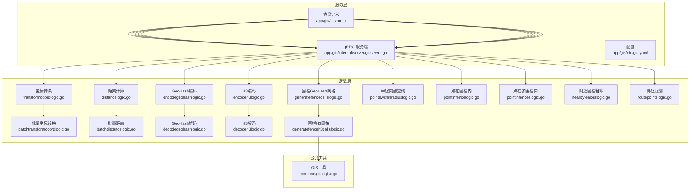

图表来源
- [app/gis/gis.proto](file://app/gis/gis.proto)
- [app/gis/internal/logic/transformcoordlogic.go](file://app/gis/internal/logic/transformcoordlogic.go)
- [app/gis/internal/logic/batchtransformcoordlogic.go](file://app/gis/internal/logic/batchtransformcoordlogic.go)
- [app/gis/internal/logic/distancelogic.go](file://app/gis/internal/logic/distancelogic.go)
- [app/gis/internal/logic/batchdistancelogic.go](file://app/gis/internal/logic/batchdistancelogic.go)
- [app/gis/internal/logic/encodegeohashlogic.go](file://app/gis/internal/logic/encodegeohashlogic.go)
- [app/gis/internal/logic/decodegeohashlogic.go](file://app/gis/internal/logic/decodegeohashlogic.go)
- [app/gis/internal/logic/encodeh3logic.go](file://app/gis/internal/logic/encodeh3logic.go)
- [app/gis/internal/logic/decodeh3logic.go](file://app/gis/internal/logic/decodeh3logic.go)
- [app/gis/internal/logic/generatefencecellslogic.go](file://app/gis/internal/logic/generatefencecellslogic.go)
- [app/gis/internal/logic/generatefenceh3cellslogic.go](file://app/gis/internal/logic/generatefenceh3cellslogic.go)
- [app/gis/internal/logic/pointswithinradiuslogic.go](file://app/gis/internal/logic/pointswithinradiuslogic.go)
- [app/gis/internal/logic/pointinfencelogic.go](file://app/gis/internal/logic/pointinfencelogic.go)
- [app/gis/internal/logic/pointinfenceslogic.go](file://app/gis/internal/logic/pointinfenceslogic.go)
- [app/gis/internal/logic/nearbyfenceslogic.go](file://app/gis/internal/logic/nearbyfenceslogic.go)
- [app/gis/internal/logic/routepointslogic.go](file://app/gis/internal/logic/routepointslogic.go)
- [common/gisx/gisx.go](file://common/gisx/gisx.go)

章节来源
- [app/gis/gis.proto](file://app/gis/gis.proto)
- [app/gis/internal/logic/transformcoordlogic.go](file://app/gis/internal/logic/transformcoordlogic.go)
- [app/gis/internal/logic/batchtransformcoordlogic.go](file://app/gis/internal/logic/batchtransformcoordlogic.go)
- [app/gis/internal/logic/distancelogic.go](file://app/gis/internal/logic/distancelogic.go)
- [app/gis/internal/logic/batchdistancelogic.go](file://app/gis/internal/logic/batchdistancelogic.go)
- [app/gis/internal/logic/encodegeohashlogic.go](file://app/gis/internal/logic/encodegeohashlogic.go)
- [app/gis/internal/logic/decodegeohashlogic.go](file://app/gis/internal/logic/decodegeohashlogic.go)
- [app/gis/internal/logic/encodeh3logic.go](file://app/gis/internal/logic/encodeh3logic.go)
- [app/gis/internal/logic/decodeh3logic.go](file://app/gis/internal/logic/decodeh3logic.go)
- [app/gis/internal/logic/generatefencecellslogic.go](file://app/gis/internal/logic/generatefencecellslogic.go)
- [app/gis/internal/logic/generatefenceh3cellslogic.go](file://app/gis/internal/logic/generatefenceh3cellslogic.go)
- [app/gis/internal/logic/pointswithinradiuslogic.go](file://app/gis/internal/logic/pointswithinradiuslogic.go)
- [app/gis/internal/logic/pointinfencelogic.go](file://app/gis/internal/logic/pointinfencelogic.go)
- [app/gis/internal/logic/pointinfenceslogic.go](file://app/gis/internal/logic/pointinfenceslogic.go)
- [app/gis/internal/logic/nearbyfenceslogic.go](file://app/gis/internal/logic/nearbyfenceslogic.go)
- [app/gis/internal/logic/routepointslogic.go](file://app/gis/internal/logic/routepointslogic.go)
- [common/gisx/gisx.go](file://common/gisx/gisx.go)

## 核心组件
- 协议与服务：基于 gRPC 的 Gis 服务，提供坐标转换、地理编码/反向地理编码、围栏网格生成、距离计算、最近邻与区域内点统计、路径规划等接口。
- 坐标转换：支持 WGS84、GCJ02、BD09 三类坐标系互转，含批量转换。
- 地理围栏：支持 GeoHash 与 H3 两种栅格化方案生成围栏网格，提供点命中围栏判断与多围栏命中。
- 距离计算：提供单点对距离与批量点对距离计算，基于球面距离模型。
- H3 索引：提供 H3 编码/解码，结合多边形栅格化生成围栏 H3 索引。
- 路径分析：针对巡检点集的贪心+2-opt 近似路径优化。
- 最近邻与区域内点统计：基于球面距离阈值快速筛选命中点索引。

章节来源
- [app/gis/gis.proto](file://app/gis/gis.proto)
- [app/gis/internal/logic/transformcoordlogic.go](file://app/gis/internal/logic/transformcoordlogic.go)
- [app/gis/internal/logic/batchtransformcoordlogic.go](file://app/gis/internal/logic/batchtransformcoordlogic.go)
- [app/gis/internal/logic/encodegeohashlogic.go](file://app/gis/internal/logic/encodegeohashlogic.go)
- [app/gis/internal/logic/decodegeohashlogic.go](file://app/gis/internal/logic/decodegeohashlogic.go)
- [app/gis/internal/logic/encodeh3logic.go](file://app/gis/internal/logic/encodeh3logic.go)
- [app/gis/internal/logic/decodeh3logic.go](file://app/gis/internal/logic/decodeh3logic.go)
- [app/gis/internal/logic/generatefencecellslogic.go](file://app/gis/internal/logic/generatefencecellslogic.go)
- [app/gis/internal/logic/generatefenceh3cellslogic.go](file://app/gis/internal/logic/generatefenceh3cellslogic.go)
- [app/gis/internal/logic/pointswithinradiuslogic.go](file://app/gis/internal/logic/pointswithinradiuslogic.go)
- [app/gis/internal/logic/pointinfencelogic.go](file://app/gis/internal/logic/pointinfencelogic.go)
- [app/gis/internal/logic/pointinfenceslogic.go](file://app/gis/internal/logic/pointinfenceslogic.go)
- [app/gis/internal/logic/routepointslogic.go](file://app/gis/internal/logic/routepointslogic.go)

## 架构总览
服务采用“协议 → 服务端 → 逻辑层 → 工具库”的分层设计，逻辑层通过 go-zero 的上下文与日志封装，依赖第三方几何/索引库完成具体算法。

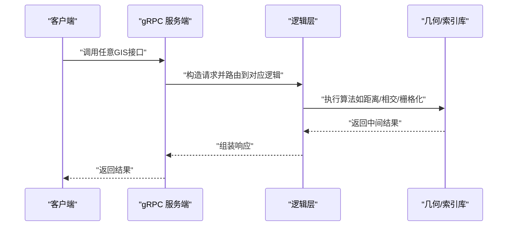

图表来源
- [app/gis/gis.proto](file://app/gis/gis.proto)
- [app/gis/internal/logic/distancelogic.go](file://app/gis/internal/logic/distancelogic.go)
- [app/gis/internal/logic/generatefencecellslogic.go](file://app/gis/internal/logic/generatefencecellslogic.go)
- [app/gis/internal/logic/encodeh3logic.go](file://app/gis/internal/logic/encodeh3logic.go)

## 详细组件分析

### 坐标转换（WGS84/GCJ02/BD09）
- 支持单点与批量转换；当源/目标类型相同时直接返回。
- 输入校验包括经纬度范围与坐标系枚举合法性。
- 实现基于外部坐标转换库，覆盖常见国内地图坐标系。

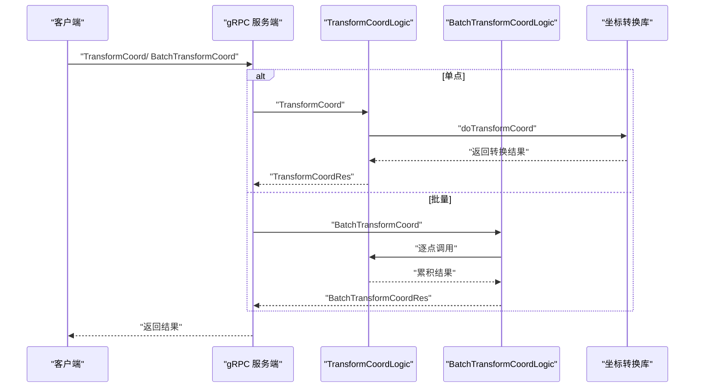

图表来源
- [app/gis/internal/logic/transformcoordlogic.go](file://app/gis/internal/logic/transformcoordlogic.go)
- [app/gis/internal/logic/batchtransformcoordlogic.go](file://app/gis/internal/logic/batchtransformcoordlogic.go)

章节来源
- [app/gis/internal/logic/transformcoordlogic.go](file://app/gis/internal/logic/transformcoordlogic.go)
- [app/gis/internal/logic/batchtransformcoordlogic.go](file://app/gis/internal/logic/batchtransformcoordlogic.go)

### 距离测量与批量距离
- 单点对距离：基于球面距离模型，输入点对校验通过后计算并返回米级距离。
- 批量距离：对点对数组逐一计算，返回对应距离数组。
- 精度控制：通过输入点的经纬度精度决定距离计算精度，建议保留小数位至厘米级以满足多数工业场景。

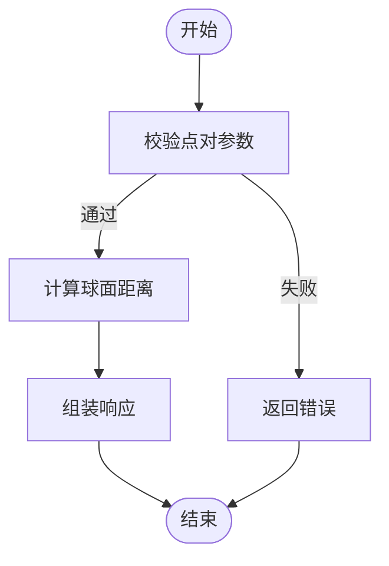

图表来源
- [app/gis/internal/logic/distancelogic.go](file://app/gis/internal/logic/distancelogic.go)
- [app/gis/internal/logic/batchdistancelogic.go](file://app/gis/internal/logic/batchdistancelogic.go)

章节来源
- [app/gis/internal/logic/distancelogic.go](file://app/gis/internal/logic/distancelogic.go)
- [app/gis/internal/logic/batchdistancelogic.go](file://app/gis/internal/logic/batchdistancelogic.go)

### GeoHash 编码与解码
- 编码：支持指定精度（默认 7），返回 GeoHash 字符串。
- 解码：返回中心点与包围盒（最小/最大经纬度）。
- 围栏生成：基于 GeoHash 网格遍历与相交/包含判断生成围栏网格，支持扩展邻居格子。

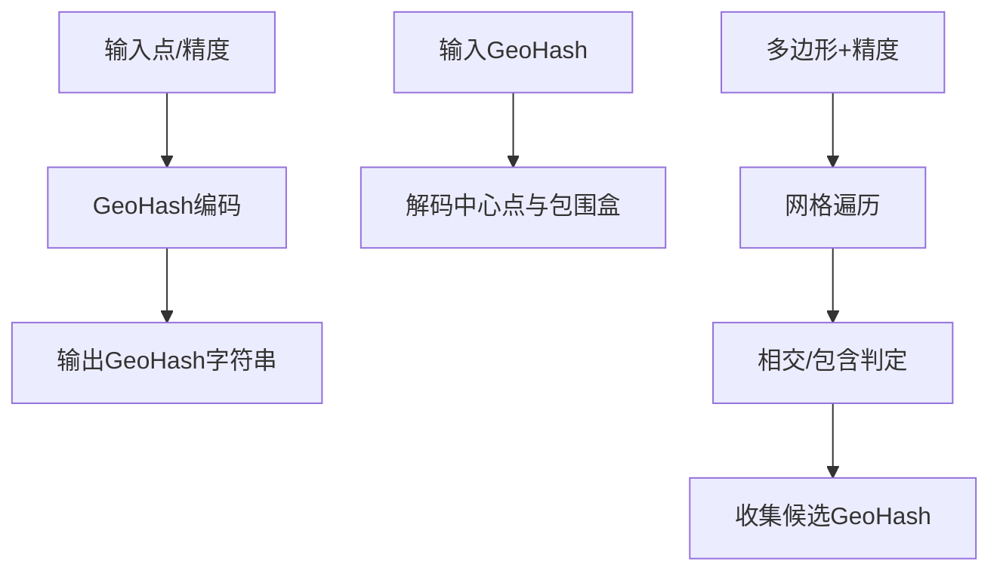

图表来源
- [app/gis/internal/logic/encodegeohashlogic.go](file://app/gis/internal/logic/encodegeohashlogic.go)
- [app/gis/internal/logic/decodegeohashlogic.go](file://app/gis/internal/logic/decodegeohashlogic.go)
- [app/gis/internal/logic/generatefencecellslogic.go](file://app/gis/internal/logic/generatefencecellslogic.go)

章节来源
- [app/gis/internal/logic/encodegeohashlogic.go](file://app/gis/internal/logic/encodegeohashlogic.go)
- [app/gis/internal/logic/decodegeohashlogic.go](file://app/gis/internal/logic/decodegeohashlogic.go)
- [app/gis/internal/logic/generatefencecellslogic.go](file://app/gis/internal/logic/generatefencecellslogic.go)

### H3 索引编码/解码与围栏栅格化
- 编码/解码：支持指定分辨率（0-15，默认 9），返回 H3 索引字符串或中心点与边界点。
- 围栏栅格化：将多边形转换为 H3 网格，实验接口支持重叠包含策略与批量返回。

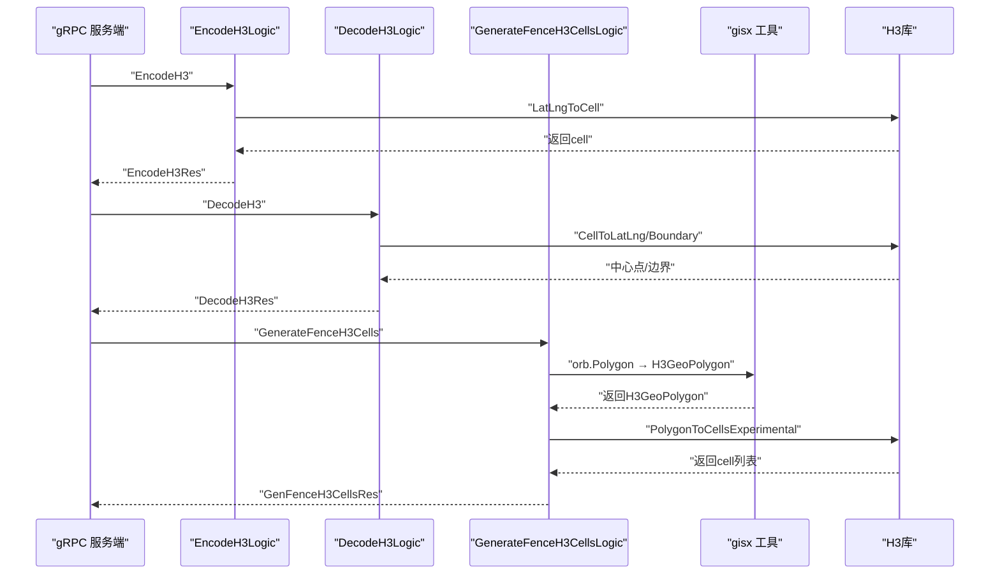

图表来源
- [app/gis/internal/logic/encodeh3logic.go](file://app/gis/internal/logic/encodeh3logic.go)
- [app/gis/internal/logic/decodeh3logic.go](file://app/gis/internal/logic/decodeh3logic.go)
- [app/gis/internal/logic/generatefenceh3cellslogic.go](file://app/gis/internal/logic/generatefenceh3cellslogic.go)
- [common/gisx/gisx.go](file://common/gisx/gisx.go)

章节来源
- [app/gis/internal/logic/encodeh3logic.go](file://app/gis/internal/logic/encodeh3logic.go)
- [app/gis/internal/logic/decodeh3logic.go](file://app/gis/internal/logic/decodeh3logic.go)
- [app/gis/internal/logic/generatefenceh3cellslogic.go](file://app/gis/internal/logic/generatefenceh3cellslogic.go)
- [common/gisx/gisx.go](file://common/gisx/gisx.go)

### 地理围栏计算（GeoHash/H3）
- GeoHash 围栏：根据多边形边界框按格子步长遍历，结合中心点包含与多边形相交进行精过滤，可选扩展邻居格子。
- H3 围栏：使用 H3 的多边形栅格化接口生成网格，支持分辨率控制与重叠包含策略。

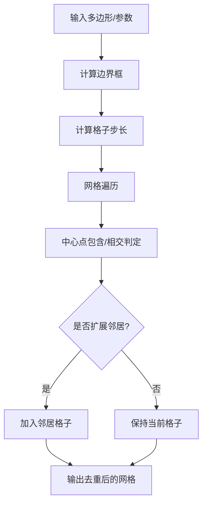

图表来源
- [app/gis/internal/logic/generatefencecellslogic.go](file://app/gis/internal/logic/generatefencecellslogic.go)
- [app/gis/internal/logic/generatefenceh3cellslogic.go](file://app/gis/internal/logic/generatefenceh3cellslogic.go)

章节来源
- [app/gis/internal/logic/generatefencecellslogic.go](file://app/gis/internal/logic/generatefencecellslogic.go)
- [app/gis/internal/logic/generatefenceh3cellslogic.go](file://app/gis/internal/logic/generatefenceh3cellslogic.go)

### 点是否命中电子围栏（单/多）
- 单围栏：将围栏点序列转换为几何多边形，使用平面几何判断点是否在多边形内。
- 多围栏：对每个围栏重复上述过程，返回命中的围栏ID列表。

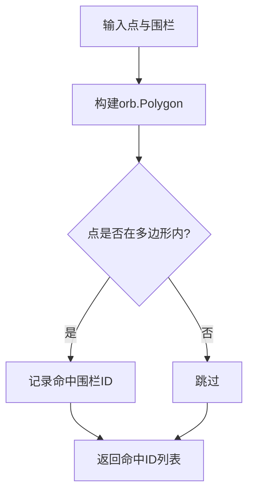

图表来源
- [app/gis/internal/logic/pointinfencelogic.go](file://app/gis/internal/logic/pointinfencelogic.go)
- [app/gis/internal/logic/pointinfenceslogic.go](file://app/gis/internal/logic/pointinfenceslogic.go)

章节来源
- [app/gis/internal/logic/pointinfencelogic.go](file://app/gis/internal/logic/pointinfencelogic.go)
- [app/gis/internal/logic/pointinfenceslogic.go](file://app/gis/internal/logic/pointinfenceslogic.go)

### 半径内点位查询
- 对输入点列表逐一计算与中心点的球面距离，小于等于半径阈值则记录其索引。
- 可作为围栏粗筛的前置步骤，降低后续复杂几何运算成本。

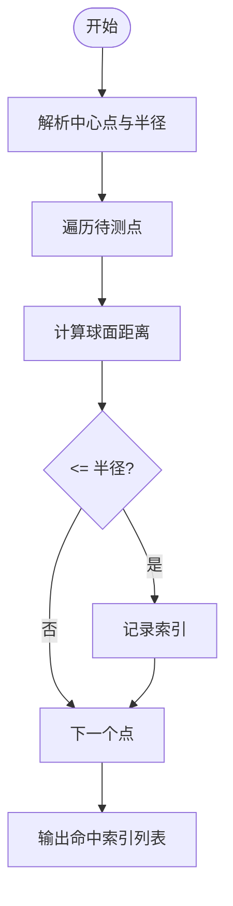

图表来源
- [app/gis/internal/logic/pointswithinradiuslogic.go](file://app/gis/internal/logic/pointswithinradiuslogic.go)

章节来源
- [app/gis/internal/logic/pointswithinradiuslogic.go](file://app/gis/internal/logic/pointswithinradiuslogic.go)

### 路径分析（最近邻+2-opt）
- 输入起点与待巡检点集，先用贪心策略生成初始访问顺序，再用 2-opt 局部搜索优化路径，最终返回访问顺序与总距离（米）。

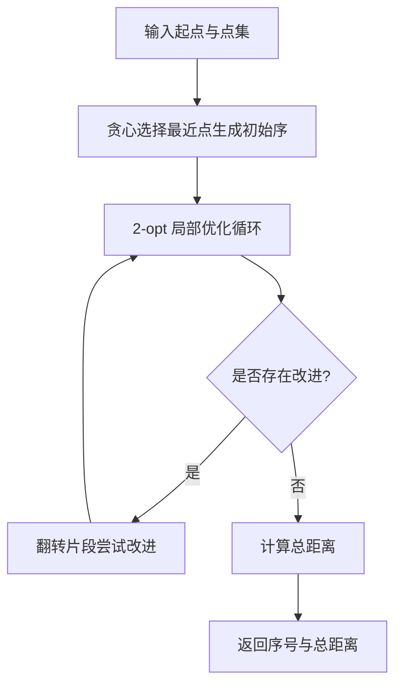

图表来源
- [app/gis/internal/logic/routepointslogic.go](file://app/gis/internal/logic/routepointslogic.go)

章节来源
- [app/gis/internal/logic/routepointslogic.go](file://app/gis/internal/logic/routepointslogic.go)

### API 接口清单与数据格式
- 协议定义与消息体详见 gis.proto，涵盖坐标转换、GeoHash/H3 编解码、围栏网格生成、距离计算、最近邻/区域内点统计、点命中围栏、附近围栏粗筛、路径规划等。
- 关键数据结构：
  - Point：纬度/经度双精度
  - PointPair：点对
  - Fence：由点序列构成的多边形
  - CoordType：坐标系枚举（WGS84/GCJ02/BD09）

章节来源
- [app/gis/gis.proto](file://app/gis/gis.proto)

## 依赖关系分析
- 第三方库
  - 几何/距离：paulmach/orb、paulmach/orb/geo
  - GeoHash：mmcloughlin/geohash
  - H3：uber/h3-go/v4
  - 坐标转换：qichengzx/coordtransform
  - 多边形栅格化：twpayne/go-geom（配合 gisx 工具）
- 内部依赖
  - gisx 工具：提供 orb.Polygon 与 H3GeoPolygon 的转换辅助

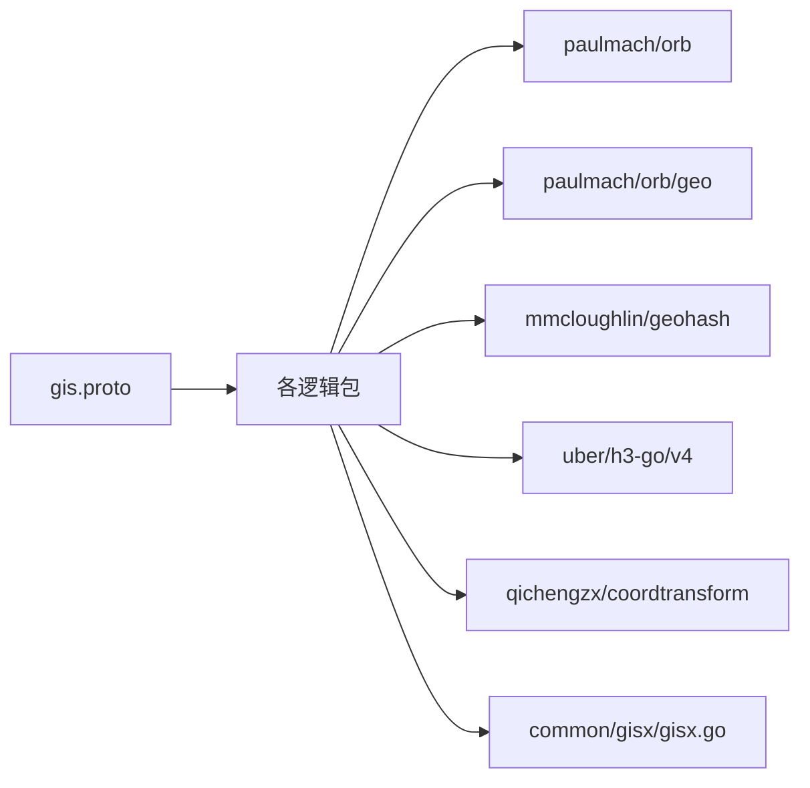

图表来源
- [app/gis/gis.proto](file://app/gis/gis.proto)
- [app/gis/internal/logic/generatefenceh3cellslogic.go](file://app/gis/internal/logic/generatefenceh3cellslogic.go)
- [common/gisx/gisx.go](file://common/gisx/gisx.go)

章节来源
- [app/gis/internal/logic/generatefenceh3cellslogic.go](file://app/gis/internal/logic/generatefenceh3cellslogic.go)
- [common/gisx/gisx.go](file://common/gisx/gisx.go)

## 性能考量
- 算法复杂度
  - 距离计算：O(1) 单次；批量 O(n)
  - GeoHash 围栏：网格遍历 O(k)，k 为候选格子数；相交/包含 O(m)（m 为多边形边数）
  - H3 围栏：多边形栅格化 O(c)，c 为生成的单元数量
  - 路径规划：贪心 O(n^2)，2-opt 在稀疏图上通常收敛较快
- 空间索引策略
  - 围栏预处理：优先使用 H3 索引进行粗筛，再对候选网格做精细相交判断
  - 点命中：对多围栏场景，可维护围栏ID到H3网格的映射，命中后再精确判断
- 精度控制
  - GeoHash 精度与分辨率：精度越高越耗时且网格越细，需结合业务阈值权衡
  - H3 分辨率：分辨率越高，单元越小，覆盖更精细但数量增加
- 批量化与并发
  - 批量坐标转换与批量距离计算已内置；建议在上游聚合请求，减少网络往返
- I/O 与缓存
  - 围栏多边形可缓存或持久化，命中后优先从缓存读取
  - 结果可按坐标/时间窗口缓存，避免重复计算

## 故障排查指南
- 常见错误与定位
  - 请求参数非法：坐标系枚举越界、经纬度超范围、点对为空、围栏点不足等
  - 算法异常：多边形构建失败、H3 栅格化失败、GeoHash 解析失败
  - 坐标转换：源/目标类型相同直接返回，若出现异常需检查外部库版本与兼容性
- 日志与可观测性
  - 逻辑层广泛使用日志记录，便于定位参数校验失败与中间结果
- 建议流程
  - 先验证输入参数与坐标范围
  - 对复杂几何操作（相交/栅格化）添加降级策略（如回退到粗筛）
  - 对批量接口设置合理的超时与限流

章节来源
- [app/gis/internal/logic/transformcoordlogic.go](file://app/gis/internal/logic/transformcoordlogic.go)
- [app/gis/internal/logic/generatefencecellslogic.go](file://app/gis/internal/logic/generatefencecellslogic.go)
- [app/gis/internal/logic/generatefenceh3cellslogic.go](file://app/gis/internal/logic/generatefenceh3cellslogic.go)

## 结论
本GIS服务围绕工业场景的关键需求，提供了完整的坐标转换、围栏栅格化、距离计算、路径规划与点查询能力。通过 GeoHash 与 H3 两种索引方案，结合粗筛与精判策略，可在保证精度的同时兼顾性能。建议在生产环境中结合缓存、批量处理与限流策略，持续监控关键指标并迭代优化。

## 附录

### 坐标系配置模板（示例）
- 源坐标系：WGS84
- 目标坐标系：GCJ02 或 BD09
- 批量转换：对设备上报的原始坐标统一转换为目标坐标系，再进行后续分析

章节来源
- [app/gis/internal/logic/transformcoordlogic.go](file://app/gis/internal/logic/transformcoordlogic.go)

### API 功能一览（按类别）
- 基础能力
  - 编码/解码：GeoHash、H3
  - 距离：单点对、批量点对
  - 坐标转换：单点、批量
- 围栏与空间分析
  - 生成围栏网格：GeoHash、H3
  - 点命中围栏：单/多围栏
  - 半径内点统计
  - 附近围栏粗筛
- 路径规划
  - 巡检点最优路径

章节来源
- [app/gis/gis.proto](file://app/gis/gis.proto)

### 地理数据可视化与实时定位跟踪
- 可视化：将 H3/GeoHash 网格与多边形围栏渲染至前端地图底图，叠加轨迹与告警标记
- 实时定位：通过 WebSocket 或服务端推送通道订阅设备位置，触发围栏命中与距离告警
- 集成案例
  - 电力巡检：路径规划 + 围栏告警 + 半径内设备统计
  - 物流配送：批量坐标转换 + 路径优化 + 半径内签收点统计
  - 安防巡更：H3 粗筛 + 点命中围栏 + 实时告警

[本节为概念性内容，无需代码来源]