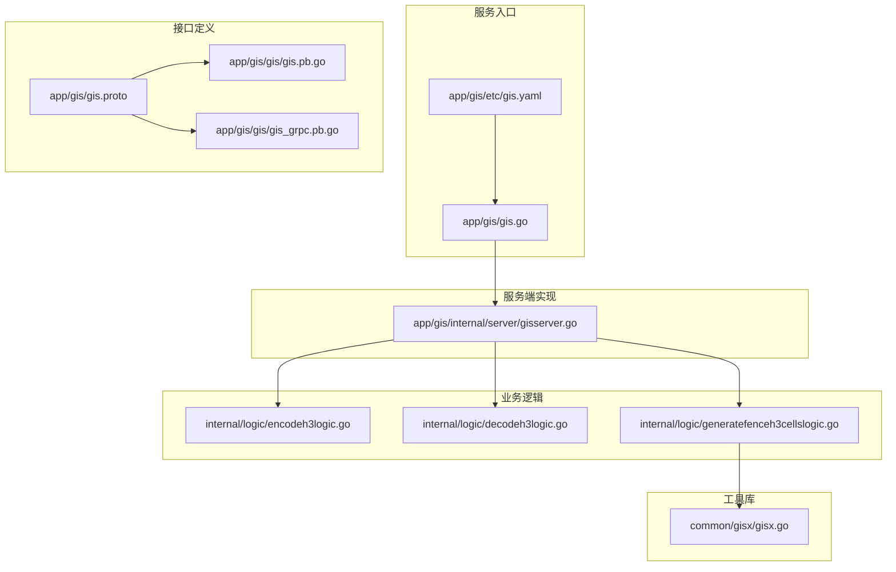
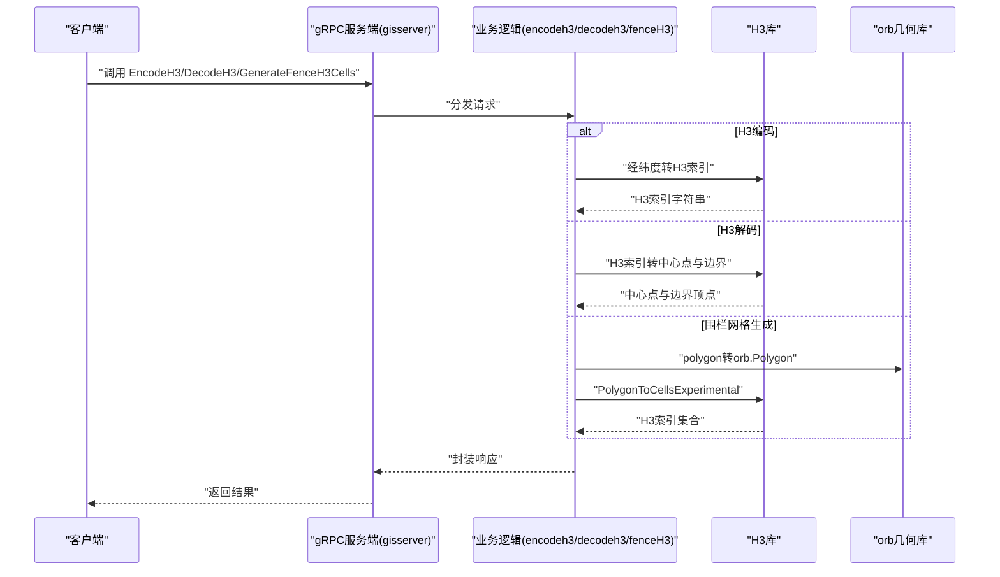
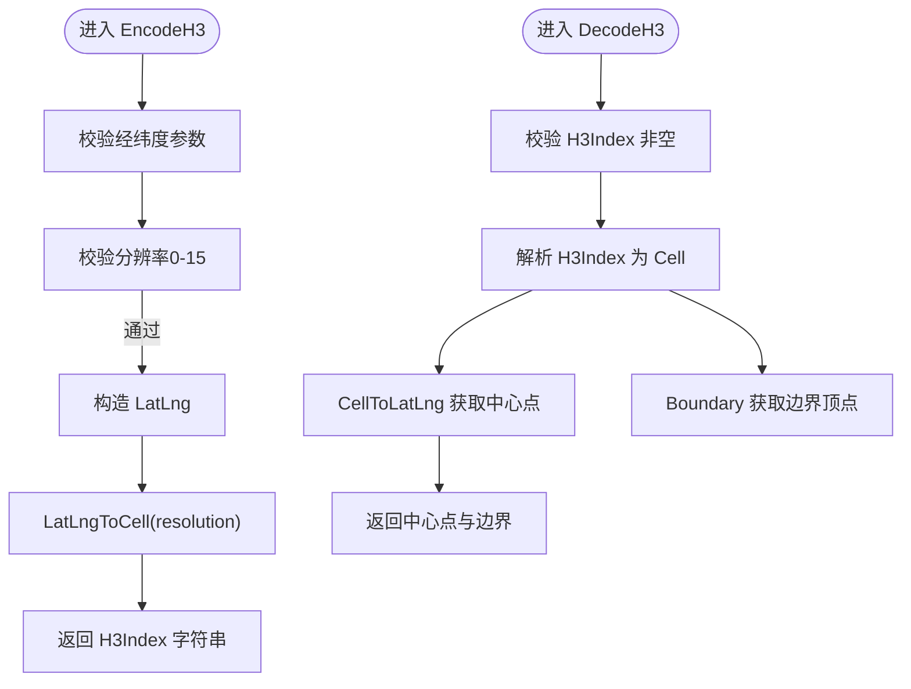
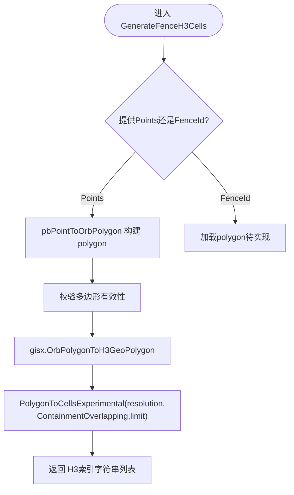
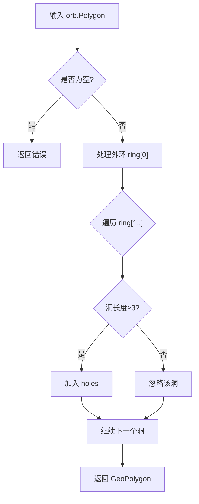
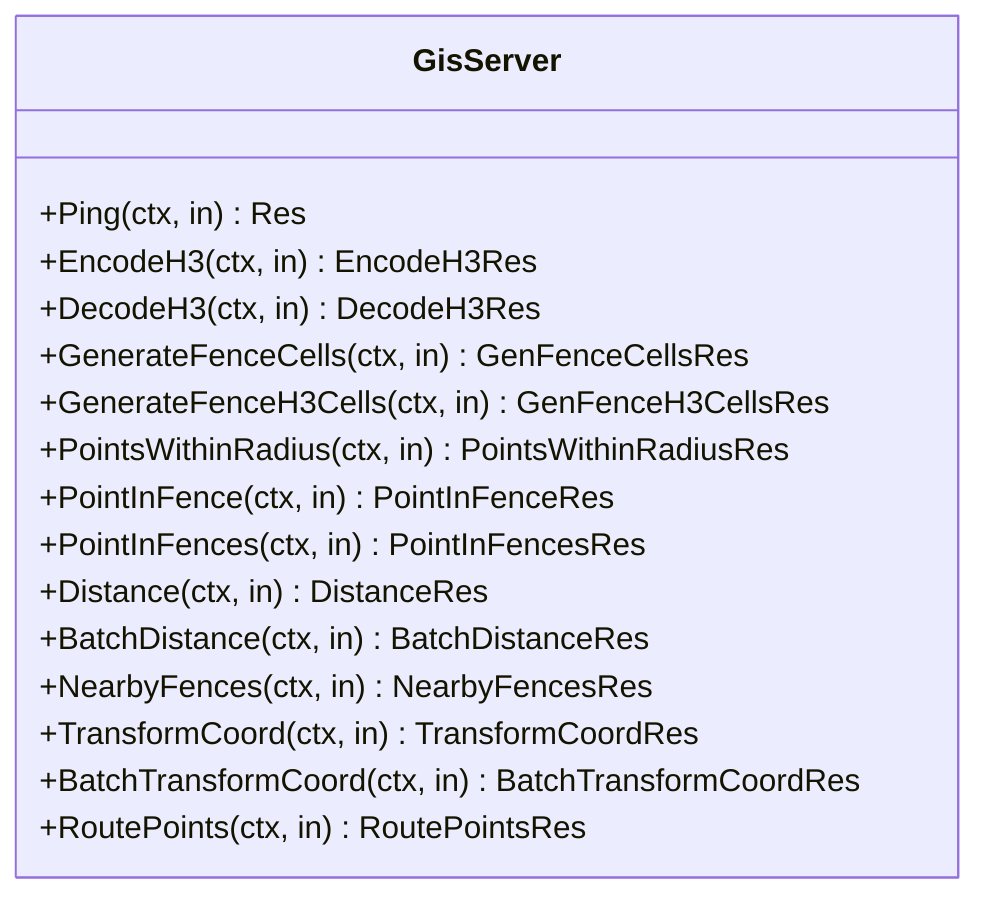
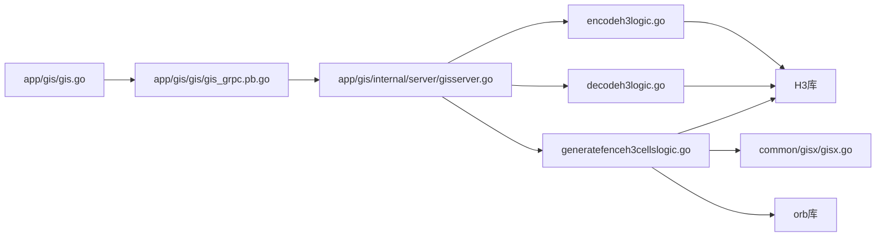

# H3索引系统

<cite>
**本文引用的文件**
- [app/gis/gis.go](file://app/gis/gis.go)
- [app/gis/etc/gis.yaml](file://app/gis/etc/gis.yaml)
- [app/gis/gis.proto](file://app/gis/gis.proto)
- [app/gis/gis/gis.pb.go](file://app/gis/gis/gis.pb.go)
- [app/gis/gis/gis_grpc.pb.go](file://app/gis/gis/gis_grpc.pb.go)
- [app/gis/internal/server/gisserver.go](file://app/gis/internal/server/gisserver.go)
- [app/gis/internal/logic/encodeh3logic.go](file://app/gis/internal/logic/encodeh3logic.go)
- [app/gis/internal/logic/decodeh3logic.go](file://app/gis/internal/logic/decodeh3logic.go)
- [app/gis/internal/logic/generatefenceh3cellslogic.go](file://app/gis/internal/logic/generatefenceh3cellslogic.go)
- [common/gisx/gisx.go](file://common/gisx/gisx.go)
</cite>

## 目录
1. [简介](#简介)
2. [项目结构](#项目结构)
3. [核心组件](#核心组件)
4. [架构总览](#架构总览)
5. [详细组件分析](#详细组件分析)
6. [依赖关系分析](#依赖关系分析)
7. [性能考量](#性能考量)
8. [故障排查指南](#故障排查指南)
9. [结论](#结论)
10. [附录](#附录)

## 简介
本技术文档围绕H3索引系统在GIS服务中的应用展开，基于仓库中现有的H3编码/解码、电子围栏网格生成与查询能力，系统化梳理H3索引的编码与解码算法、层级选择策略与精度控制、地理围栏的H3网格生成、相邻区域查询与区域重叠计算、空间分割原理与性能平衡，并给出实际应用场景与配置参数、性能优化与内存使用策略建议。

## 项目结构
H3索引系统位于“gis”微服务模块中，采用go-zero框架与gRPC协议，核心由以下部分组成：
- 服务入口与配置：服务启动、日志、注册中心集成
- gRPC接口定义：H3编码/解码、围栏网格生成等
- 服务端实现：gRPC方法到业务逻辑的映射
- 业务逻辑：H3编码/解码、围栏网格生成、坐标转换等
- 工具库：多边形到H3 GeoPolygon的转换

图表来源
- [app/gis/gis.go:27-70](file://app/gis/gis.go#L27-L70)
- [app/gis/etc/gis.yaml:1-19](file://app/gis/etc/gis.yaml#L1-L19)
- [app/gis/gis.proto:18-50](file://app/gis/gis.proto#L18-L50)
- [app/gis/internal/server/gisserver.go:15-120](file://app/gis/internal/server/gisserver.go#L15-L120)
- [app/gis/internal/logic/encodeh3logic.go:28-45](file://app/gis/internal/logic/encodeh3logic.go#L28-L45)
- [app/gis/internal/logic/decodeh3logic.go:28-56](file://app/gis/internal/logic/decodeh3logic.go#L28-L56)
- [app/gis/internal/logic/generatefenceh3cellslogic.go:29-77](file://app/gis/internal/logic/generatefenceh3cellslogic.go#L29-L77)
- [common/gisx/gisx.go:11-60](file://common/gisx/gisx.go#L11-L60)

章节来源
- [app/gis/gis.go:27-70](file://app/gis/gis.go#L27-L70)
- [app/gis/etc/gis.yaml:1-19](file://app/gis/etc/gis.yaml#L1-L19)
- [app/gis/gis.proto:18-50](file://app/gis/gis.proto#L18-L50)
- [app/gis/internal/server/gisserver.go:15-120](file://app/gis/internal/server/gisserver.go#L15-L120)

## 核心组件
- H3编码服务：将经纬度点映射为H3索引字符串，支持分辨率0-15
- H3解码服务：将H3索引还原为中心点与边界顶点
- 围栏H3网格生成：对给定多边形生成覆盖的H3网格，支持默认分辨率与实验性重叠包含模式
- 多边形到H3 GeoPolygon转换：处理外环与洞（holes），确保闭合性与有效性

章节来源
- [app/gis/internal/logic/encodeh3logic.go:28-45](file://app/gis/internal/logic/encodeh3logic.go#L28-L45)
- [app/gis/internal/logic/decodeh3logic.go:28-56](file://app/gis/internal/logic/decodeh3logic.go#L28-L56)
- [app/gis/internal/logic/generatefenceh3cellslogic.go:29-77](file://app/gis/internal/logic/generatefenceh3cellslogic.go#L29-L77)
- [common/gisx/gisx.go:11-60](file://common/gisx/gisx.go#L11-L60)

## 架构总览
H3索引系统通过gRPC对外提供服务，客户端调用EncodeH3/DecodeH3/GenerateFenceH3Cells等接口；服务端将请求路由至对应逻辑层，逻辑层使用H3库进行索引计算，并在必要时借助orb库进行几何转换。

图表来源
- [app/gis/internal/server/gisserver.go:43-65](file://app/gis/internal/server/gisserver.go#L43-L65)
- [app/gis/internal/logic/encodeh3logic.go:28-45](file://app/gis/internal/logic/encodeh3logic.go#L28-L45)
- [app/gis/internal/logic/decodeh3logic.go:28-56](file://app/gis/internal/logic/decodeh3logic.go#L28-L56)
- [app/gis/internal/logic/generatefenceh3cellslogic.go:57-77](file://app/gis/internal/logic/generatefenceh3cellslogic.go#L57-L77)
- [common/gisx/gisx.go:11-60](file://common/gisx/gisx.go#L11-L60)

## 详细组件分析

### H3编码与解码组件
- 编码流程要点
  - 输入校验：经纬度非空、分辨率范围0-15
  - LatLng构造与索引生成：使用H3库将经纬度映射到指定分辨率的单元格
  - 输出：H3索引字符串
- 解码流程要点
  - 输入校验：索引非空
  - 索引解析与中心点还原：将H3索引转LatLng
  - 边界提取：获取六边形边界顶点序列
  - 输出：中心点与边界顶点数组

图表来源
- [app/gis/internal/logic/encodeh3logic.go:28-45](file://app/gis/internal/logic/encodeh3logic.go#L28-L45)
- [app/gis/internal/logic/decodeh3logic.go:28-56](file://app/gis/internal/logic/decodeh3logic.go#L28-L56)

章节来源
- [app/gis/internal/logic/encodeh3logic.go:28-45](file://app/gis/internal/logic/encodeh3logic.go#L28-L45)
- [app/gis/internal/logic/decodeh3logic.go:28-56](file://app/gis/internal/logic/decodeh3logic.go#L28-L56)

### 围栏H3网格生成组件
- 功能概述
  - 支持通过多边形顶点或围栏ID生成覆盖网格
  - 默认分辨率9，支持0-15范围校验
  - 将orb.Polygon转换为H3 GeoPolygon，调用实验性PolygonToCellsExperimental生成索引
  - 返回去重后的H3索引字符串列表
- 关键流程
  - 多边形构建与校验：点数≥3、经纬度范围校验、首尾闭合
  - GeoPolygon转换：外环与洞（holes）处理
  - 网格生成：PolygonToCellsExperimental + ContainmentOverlapping
  - 结果输出：H3索引字符串切片

图表来源
- [app/gis/internal/logic/generatefenceh3cellslogic.go:29-77](file://app/gis/internal/logic/generatefenceh3cellslogic.go#L29-L77)
- [common/gisx/gisx.go:11-60](file://common/gisx/gisx.go#L11-L60)

章节来源
- [app/gis/internal/logic/generatefenceh3cellslogic.go:29-77](file://app/gis/internal/logic/generatefenceh3cellslogic.go#L29-L77)
- [common/gisx/gisx.go:11-60](file://common/gisx/gisx.go#L11-L60)

### 多边形到H3 GeoPolygon转换
- 外环与洞处理：严格区分ring[0]为外环，ring[1...]为洞；洞长度不足则忽略
- 闭合性检查：若首尾不闭合则追加首点
- 坐标系映射：orb.Point(lon,lat) → H3.LatLng(lat,lng)

图表来源
- [common/gisx/gisx.go:11-60](file://common/gisx/gisx.go#L11-L60)

章节来源
- [common/gisx/gisx.go:11-60](file://common/gisx/gisx.go#L11-L60)

### gRPC接口与服务端映射
- 接口定义：H3编码/解码、围栏网格生成等
- 服务端实现：将gRPC方法映射到对应逻辑层
- 客户端调用：通过gRPC客户端发起请求

图表来源
- [app/gis/internal/server/gisserver.go:15-120](file://app/gis/internal/server/gisserver.go#L15-L120)

章节来源
- [app/gis/gis.proto:18-50](file://app/gis/gis.proto#L18-L50)
- [app/gis/internal/server/gisserver.go:15-120](file://app/gis/internal/server/gisserver.go#L15-L120)
- [app/gis/gis/gis.pb.go:117-155](file://app/gis/gis/gis.pb.go#L117-L155)
- [app/gis/gis/gis_grpc.pb.go:117-155](file://app/gis/gis/gis_grpc.pb.go#L117-L155)

## 依赖关系分析
- 服务入口依赖go-zero与nacos（可选注册）
- 业务逻辑依赖H3库与orb库
- gRPC接口定义与生成文件驱动服务端与客户端

图表来源
- [app/gis/gis.go:36-69](file://app/gis/gis.go#L36-L69)
- [app/gis/internal/server/gisserver.go:43-65](file://app/gis/internal/server/gisserver.go#L43-L65)
- [app/gis/internal/logic/encodeh3logic.go:10](file://app/gis/internal/logic/encodeh3logic.go#L10)
- [app/gis/internal/logic/decodeh3logic.go:10](file://app/gis/internal/logic/decodeh3logic.go#L10)
- [app/gis/internal/logic/generatefenceh3cellslogic.go:10-11](file://app/gis/internal/logic/generatefenceh3cellslogic.go#L10-L11)
- [common/gisx/gisx.go:7-8](file://common/gisx/gisx.go#L7-L8)

章节来源
- [app/gis/gis.go:36-69](file://app/gis/gis.go#L36-L69)
- [app/gis/internal/logic/encodeh3logic.go:10](file://app/gis/internal/logic/encodeh3logic.go#L10)
- [app/gis/internal/logic/decodeh3logic.go:10](file://app/gis/internal/logic/decodeh3logic.go#L10)
- [app/gis/internal/logic/generatefenceh3cellslogic.go:10-11](file://app/gis/internal/logic/generatefenceh3cellslogic.go#L10-L11)
- [common/gisx/gisx.go:7-8](file://common/gisx/gisx.go#L7-L8)

## 性能考量
- 分辨率与精度平衡
  - 分辨率越高，单元格越小，覆盖更精细但索引数量增长快，计算与存储成本上升
  - 默认分辨率9在大多数围栏场景下折中了精度与性能
- 空间分割原理
  - H3以六边形网格对地球表面进行连续分割，具有良好的拓扑一致性与邻域查询效率
- 算法复杂度
  - PolygonToCellsExperimental的时间复杂度与多边形顶点数、分辨率及包含模式有关
  - 合理设置分辨率与包含模式可降低计算开销
- 内存使用策略
  - 使用切片收集结果，避免重复分配
  - 对于大规模网格生成，建议分批处理与限流
- I/O与网络
  - gRPC默认超时与日志级别可在配置中调整，避免高频请求导致阻塞

## 故障排查指南
- 参数校验错误
  - 编码/解码：经纬度或索引为空、分辨率越界
  - 围栏生成：Points数量不足、经纬度越界、多边形未闭合
- 几何转换异常
  - 外环点数不足、洞无效、多边形闭合失败
- 算法执行失败
  - PolygonToCellsExperimental返回错误，检查分辨率与包含模式
- 日志定位
  - 服务端日志记录关键步骤与错误信息，便于快速定位

章节来源
- [app/gis/internal/logic/encodeh3logic.go:30-35](file://app/gis/internal/logic/encodeh3logic.go#L30-L35)
- [app/gis/internal/logic/decodeh3logic.go:30-32](file://app/gis/internal/logic/decodeh3logic.go#L30-L32)
- [app/gis/internal/logic/generatefenceh3cellslogic.go:40-45](file://app/gis/internal/logic/generatefenceh3cellslogic.go#L40-L45)
- [common/gisx/gisx.go:18-26](file://common/gisx/gisx.go#L18-L26)

## 结论
本H3索引系统在GIS服务中提供了完整的H3编码/解码与围栏网格生成能力，结合orb几何库实现了多边形到H3 GeoPolygon的转换，满足电子围栏、区域划分、密度分析与空间聚合等典型场景需求。通过合理的分辨率选择与包含模式配置，可在精度与性能之间取得良好平衡；同时，清晰的日志与参数校验有助于快速定位与解决问题。

## 附录

### 配置参数与运行说明
- 服务监听与超时
  - 监听地址、超时时间、日志路径与级别、中间件统计忽略项
- 注册中心
  - Nacos开关、主机、端口、命名空间、服务名等

章节来源
- [app/gis/etc/gis.yaml:1-19](file://app/gis/etc/gis.yaml#L1-L19)

### 实际应用场景建议
- 区域划分：根据业务范围选择合适分辨率，生成覆盖网格作为分区依据
- 密度分析：对网格计数与聚合，结合邻域查询进行热点识别
- 空间聚合：按网格汇总事件或指标，支持动态聚合粒度

### H3索引与精度控制要点
- 分辨率0-15：数值越大，网格越细密
- 默认分辨率9：兼顾精度与性能的常用值
- 包含模式：Overlap/Touch/Disjoint等影响覆盖范围与结果数量