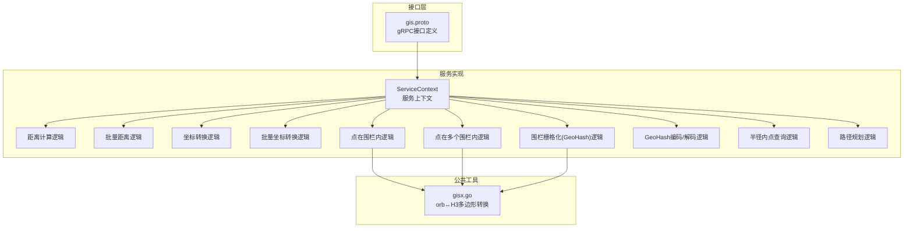
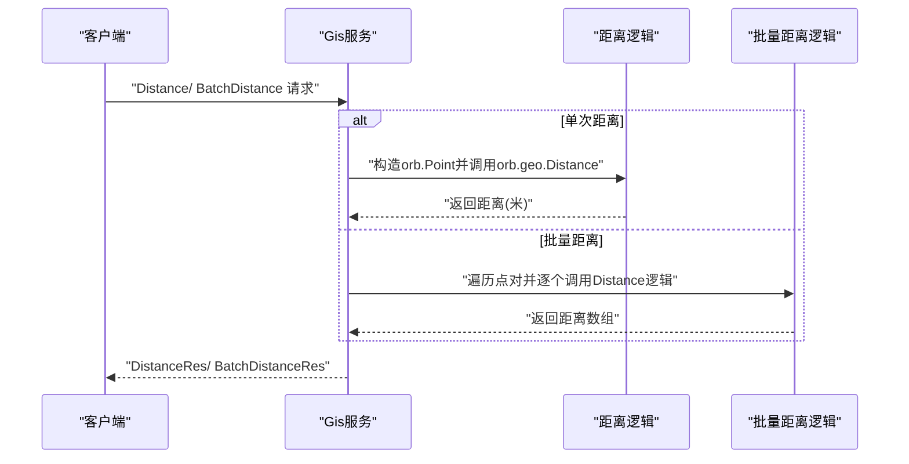
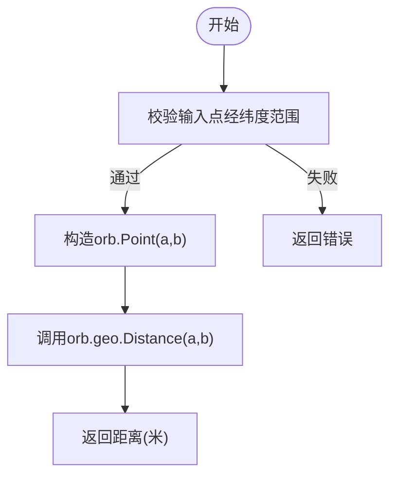
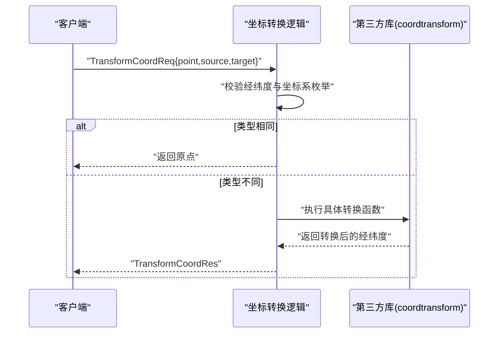
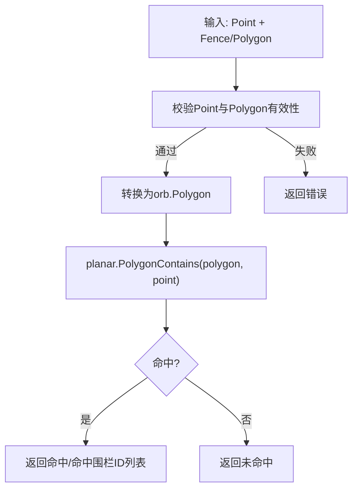
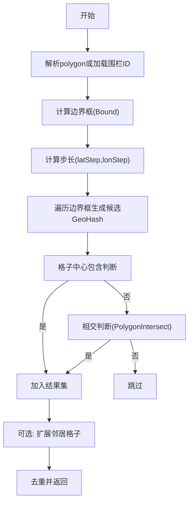
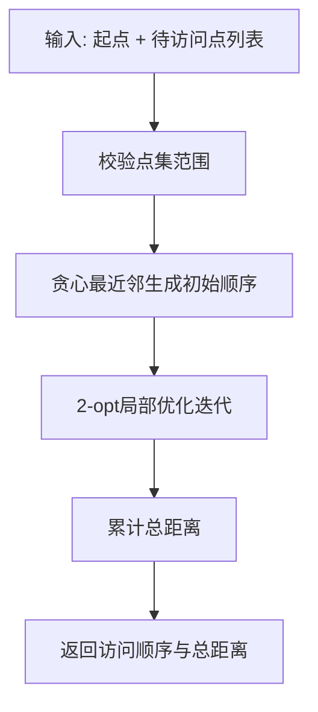
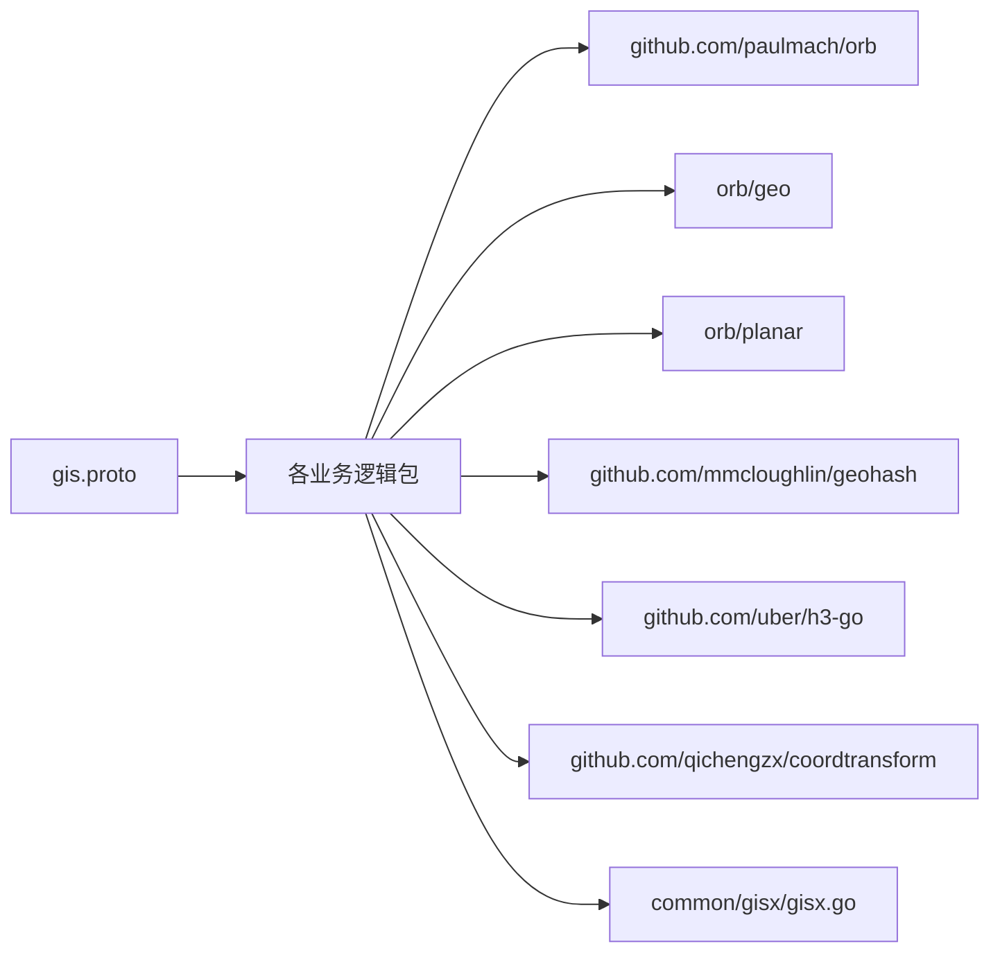

# 地理算法实现

<cite>
**本文引用的文件**
- [app/gis/gis.proto](file://app/gis/gis.proto)
- [common/gisx/gisx.go](file://common/gisx/gisx.go)
- [app/gis/internal/logic/distancelogic.go](file://app/gis/internal/logic/distancelogic.go)
- [app/gis/internal/logic/batchdistancelogic.go](file://app/gis/internal/logic/batchdistancelogic.go)
- [app/gis/internal/logic/transformcoordlogic.go](file://app/gis/internal/logic/transformcoordlogic.go)
- [app/gis/internal/logic/batchtransformcoordlogic.go](file://app/gis/internal/logic/batchtransformcoordlogic.go)
- [app/gis/internal/logic/pointinfencelogic.go](file://app/gis/internal/logic/pointinfencelogic.go)
- [app/gis/internal/logic/pointinfenceslogic.go](file://app/gis/internal/logic/pointinfenceslogic.go)
- [app/gis/internal/logic/generatefencecellslogic.go](file://app/gis/internal/logic/generatefencecellslogic.go)
- [app/gis/internal/logic/encodegeohashlogic.go](file://app/gis/internal/logic/encodegeohashlogic.go)
- [app/gis/internal/logic/decodegeohashlogic.go](file://app/gis/internal/logic/decodegeohashlogic.go)
- [app/gis/internal/logic/pointswithinradiuslogic.go](file://app/gis/internal/logic/pointswithinradiuslogic.go)
- [app/gis/internal/logic/routepointslogic.go](file://app/gis/internal/logic/routepointslogic.go)
- [app/gis/internal/svc/servicecontext.go](file://app/gis/internal/svc/servicecontext.go)
</cite>

## 目录
1. [简介](#简介)
2. [项目结构](#项目结构)
3. [核心组件](#核心组件)
4. [架构总览](#架构总览)
5. [详细组件分析](#详细组件分析)
6. [依赖分析](#依赖分析)
7. [性能考量](#性能考量)
8. [故障排查指南](#故障排查指南)
9. [结论](#结论)
10. [附录](#附录)

## 简介
本技术文档聚焦于GIS服务中的核心地理算法实现，涵盖以下主题：
- 距离计算算法：基于orb.geo的球面距离计算（Haversine近似），适用于全球范围内的两点间距离估算。
- 坐标转换算法：支持WGS84、GCJ02、BD09三种坐标系之间的相互转换，满足国内外常见地图服务的坐标一致性需求。
- 地理围栏与点在多边形内判断：基于orb.planar的多边形包含判断，支持单围栏与多围栏命中检测，并提供围栏栅格化（GeoHash）生成能力。
- 批量处理优化策略：通过批量接口减少RPC开销，结合轻量级数据结构与预分配策略提升吞吐。
- 数学原理、适用场景与精度范围：明确各算法的数学基础、适用范围与误差来源。
- 调用示例、参数配置与错误处理：提供清晰的请求/响应模型与错误处理机制说明。
- 性能基准与最佳实践：总结性能特征与优化建议。

## 项目结构
GIS服务采用Go Zero微服务框架，按领域分层组织：
- 接口定义：gRPC协议在proto文件中定义，统一描述请求/响应与服务方法。
- 业务逻辑：位于internal/logic目录，按功能模块拆分，如距离、坐标转换、围栏、栅格化等。
- 公共工具：common/gisx提供与orb库交互的辅助函数，如多边形到H3 GeoPolygon的转换。
- 服务上下文：internal/svc/servicecontext集中承载配置与上下文信息。

图表来源
- [app/gis/gis.proto:1-219](file://app/gis/gis.proto#L1-L219)
- [app/gis/internal/svc/servicecontext.go:1-14](file://app/gis/internal/svc/servicecontext.go#L1-L14)
- [common/gisx/gisx.go:1-60](file://common/gisx/gisx.go#L1-L60)

章节来源
- [app/gis/gis.proto:1-219](file://app/gis/gis.proto#L1-L219)
- [app/gis/internal/svc/servicecontext.go:1-14](file://app/gis/internal/svc/servicecontext.go#L1-L14)

## 核心组件
本节概述各算法模块的职责与关键流程：
- 距离计算：接收两个经纬度点，返回球面距离（米）。支持单次与批量两种接口。
- 坐标转换：支持WGS84、GCJ02、BD09三者之间互相转换；批量转换接口复用单次转换逻辑。
- 围栏与点判断：将前端传入的polygon点集转换为orb.Polygon，使用planar.PolygonContains进行包含判断；支持单围栏与多围栏命中检测。
- 围栏栅格化：基于GeoHash在多边形边界框内以步长遍历，利用格子中心点包含与相交判断筛选有效格子；可选择扩展邻居格子。
- GeoHash编解码：提供经纬度与GeoHash字符串之间的双向转换。
- 半径内点查询：对给定点列表逐一计算到中心点的距离，返回命中索引。
- 路径规划：基于贪心最近邻生成初始路径，再使用2-opt局部优化提升路径质量。

章节来源
- [app/gis/internal/logic/distancelogic.go:1-67](file://app/gis/internal/logic/distancelogic.go#L1-L67)
- [app/gis/internal/logic/batchdistancelogic.go:1-50](file://app/gis/internal/logic/batchdistancelogic.go#L1-L50)
- [app/gis/internal/logic/transformcoordlogic.go:1-102](file://app/gis/internal/logic/transformcoordlogic.go#L1-L102)
- [app/gis/internal/logic/batchtransformcoordlogic.go:1-66](file://app/gis/internal/logic/batchtransformcoordlogic.go#L1-L66)
- [app/gis/internal/logic/pointinfencelogic.go:1-59](file://app/gis/internal/logic/pointinfencelogic.go#L1-L59)
- [app/gis/internal/logic/pointinfenceslogic.go:1-67](file://app/gis/internal/logic/pointinfenceslogic.go#L1-L67)
- [app/gis/internal/logic/generatefencecellslogic.go:1-294](file://app/gis/internal/logic/generatefencecellslogic.go#L1-L294)
- [app/gis/internal/logic/encodegeohashlogic.go:1-45](file://app/gis/internal/logic/encodegeohashlogic.go#L1-L45)
- [app/gis/internal/logic/decodegeohashlogic.go:1-48](file://app/gis/internal/logic/decodegeohashlogic.go#L1-L48)
- [app/gis/internal/logic/pointswithinradiuslogic.go:1-75](file://app/gis/internal/logic/pointswithinradiuslogic.go#L1-L75)
- [app/gis/internal/logic/routepointslogic.go:1-113](file://app/gis/internal/logic/routepointslogic.go#L1-L113)

## 架构总览
下图展示gRPC接口到具体逻辑实现的调用链路与数据流：

图表来源
- [app/gis/gis.proto:38-47](file://app/gis/gis.proto#L38-L47)
- [app/gis/internal/logic/distancelogic.go:30-41](file://app/gis/internal/logic/distancelogic.go#L30-L41)
- [app/gis/internal/logic/batchdistancelogic.go:30-49](file://app/gis/internal/logic/batchdistancelogic.go#L30-L49)

## 详细组件分析

### 距离计算算法
- 数学原理：基于orb.geo提供的球面距离计算，通常采用Haversine公式或类似的大圆距离模型，适用于全球范围内的两点间距离估算。
- 输入输出：接收两个Point结构，输出距离（米）。
- 批量优化：批量接口通过循环复用单次逻辑，减少重复校验与对象构造成本。
- 精度与范围：适用于常规导航与定位场景；对于极高精度需求（如厘米级）需考虑椭球模型（本实现采用球面模型）。

图表来源
- [app/gis/internal/logic/distancelogic.go:30-41](file://app/gis/internal/logic/distancelogic.go#L30-L41)
- [app/gis/internal/logic/batchdistancelogic.go:30-49](file://app/gis/internal/logic/batchdistancelogic.go#L30-L49)

章节来源
- [app/gis/internal/logic/distancelogic.go:1-67](file://app/gis/internal/logic/distancelogic.go#L1-L67)
- [app/gis/internal/logic/batchdistancelogic.go:1-50](file://app/gis/internal/logic/batchdistancelogic.go#L1-L50)

### 坐标转换算法
- 支持坐标系：WGS84（GPS原生）、GCJ02（高德/腾讯/谷歌中国加密）、BD09（百度在GCJ02基础上二次加密）。
- 实现策略：根据源/目标类型选择对应转换函数；若类型相同则直接返回原点。
- 批量策略：批量接口遍历输入点，逐个委托单次转换逻辑，保持一致性与可维护性。

图表来源
- [app/gis/internal/logic/transformcoordlogic.go:28-50](file://app/gis/internal/logic/transformcoordlogic.go#L28-L50)
- [app/gis/internal/logic/batchtransformcoordlogic.go:28-65](file://app/gis/internal/logic/batchtransformcoordlogic.go#L28-L65)

章节来源
- [app/gis/internal/logic/transformcoordlogic.go:1-102](file://app/gis/internal/logic/transformcoordlogic.go#L1-L102)
- [app/gis/internal/logic/batchtransformcoordlogic.go:1-66](file://app/gis/internal/logic/batchtransformcoordlogic.go#L1-L66)

### 地理围栏与点在多边形内判断
- 数据结构：将前端polygon点集转换为orb.Polygon；支持外环与洞（holes）结构。
- 判断逻辑：使用orb.planar.PolygonContains进行点包含判断；多围栏版本遍历所有围栏并收集命中ID。
- 错误处理：对空点集、无效围栏ID、点集闭合性等问题进行显式校验与日志记录。

图表来源
- [app/gis/internal/logic/pointinfencelogic.go:29-58](file://app/gis/internal/logic/pointinfencelogic.go#L29-L58)
- [app/gis/internal/logic/pointinfenceslogic.go:28-66](file://app/gis/internal/logic/pointinfenceslogic.go#L28-L66)
- [common/gisx/gisx.go:11-41](file://common/gisx/gisx.go#L11-L41)

章节来源
- [app/gis/internal/logic/pointinfencelogic.go:1-59](file://app/gis/internal/logic/pointinfencelogic.go#L1-L59)
- [app/gis/internal/logic/pointinfenceslogic.go:1-67](file://app/gis/internal/logic/pointinfenceslogic.go#L1-L67)
- [common/gisx/gisx.go:1-60](file://common/gisx/gisx.go#L1-L60)

### 围栏栅格化（GeoHash）
- 算法思路：在polygon边界框内按步长遍历生成候选GeoHash，先以内核（格子中心）包含判断快速过滤，再对相交情况进行精确判定；可选扩展邻居格子。
- 步长计算：依据精度与中心纬度计算格子宽高，步长减半以避免遗漏。
- 结果去重：使用map去重，最终转换为切片返回。
- 相交判断：提供线段相交、Ring相交与Polygon相交的辅助函数，确保覆盖边界相交场景。

图表来源
- [app/gis/internal/logic/generatefencecellslogic.go:32-126](file://app/gis/internal/logic/generatefencecellslogic.go#L32-L126)
- [app/gis/internal/logic/generatefencecellslogic.go:149-159](file://app/gis/internal/logic/generatefencecellslogic.go#L149-L159)
- [app/gis/internal/logic/generatefencecellslogic.go:246-270](file://app/gis/internal/logic/generatefencecellslogic.go#L246-L270)

章节来源
- [app/gis/internal/logic/generatefencecellslogic.go:1-294](file://app/gis/internal/logic/generatefencecellslogic.go#L1-L294)

### GeoHash编解码
- 编码：根据经纬度与精度生成GeoHash字符串。
- 解码：返回中心点经纬度与包围盒范围，便于可视化与二次处理。

章节来源
- [app/gis/internal/logic/encodegeohashlogic.go:1-45](file://app/gis/internal/logic/encodegeohashlogic.go#L1-L45)
- [app/gis/internal/logic/decodegeohashlogic.go:1-48](file://app/gis/internal/logic/decodegeohashlogic.go#L1-L48)

### 半径内点查询
- 算法：对输入点列表逐一计算到中心点的距离，保留小于等于半径的点索引。
- 批量优化：当前实现为顺序扫描；注释中展示了MapReduce的潜在实现思路，可用于大规模数据的并行化。

章节来源
- [app/gis/internal/logic/pointswithinradiuslogic.go:1-75](file://app/gis/internal/logic/pointswithinradiuslogic.go#L1-L75)

### 路径规划（巡检点最优访问顺序）
- 策略：贪心最近邻生成初始顺序，随后使用2-opt局部搜索迭代改进路径，最终统计总距离。
- 适用场景：物流配送、巡检任务等需要降低总行驶距离的应用。

图表来源
- [app/gis/internal/logic/routepointslogic.go:29-112](file://app/gis/internal/logic/routepointslogic.go#L29-L112)

章节来源
- [app/gis/internal/logic/routepointslogic.go:1-113](file://app/gis/internal/logic/routepointslogic.go#L1-L113)

## 依赖分析
- 第三方库
  - orb：提供几何对象（Point、Polygon、Ring）与平面几何运算（包含判断、距离计算）。
  - geohash：提供GeoHash编码/解码与包围盒计算。
  - h3-go：提供H3索引能力（多边形转换等）。
  - coordtransform：提供WGS84/GCJ02/BD09之间的互转。
- 内部依赖
  - gisx：封装orb与H3之间的多边形转换，确保外部逻辑与H3库的对接。

图表来源
- [app/gis/gis.proto:1-219](file://app/gis/gis.proto#L1-L219)
- [common/gisx/gisx.go:1-60](file://common/gisx/gisx.go#L1-L60)

章节来源
- [app/gis/gis.proto:1-219](file://app/gis/gis.proto#L1-L219)
- [common/gisx/gisx.go:1-60](file://common/gisx/gisx.go#L1-L60)

## 性能考量
- 时间复杂度
  - 距离计算：单次O(1)，批量O(n)。
  - 点在围栏内：单次O(m)，m为围栏边数；多围栏O(k·m)，k为围栏数量。
  - 围栏栅格化：O((Δlat/step_lat)·(Δlon/step_lon))，受精度与边界框大小影响；相交判断引入额外O(m·n)。
  - 半径内点查询：当前O(n)；可考虑空间索引（如R-tree）或并行化（MapReduce）进一步优化。
  - 路径规划：贪心O(n^2)，2-opt最坏O(n^4)，实践中常数较小且收敛较快。
- 空间复杂度
  - 多数操作为O(1)或O(n)；栅格化阶段使用map去重，内存占用与有效格子数量相关。
- 优化建议
  - 批量接口优先：减少RPC往返与序列化开销。
  - 预分配与复用：批量逻辑中预先分配切片，减少扩容与GC压力。
  - 粗过滤：围栏栅格化作为粗过滤手段，先用GeoHash/H3快速筛除不可能区域，再做精细判断。
  - 并行化：半径内点查询与批量转换可采用并发处理（注意线程安全与共享状态）。
  - 索引加速：对大规模围栏或点集引入空间索引（如R-tree）以降低查询复杂度。
- 精度与误差
  - 距离计算采用球面模型，适合一般导航场景；若需更高精度，应采用椭球模型（如Vincenty公式）。
  - GeoHash栅格化存在网格近似误差，可通过提高精度或扩展邻居格子缓解。

[本节为通用性能讨论，无需列出具体文件来源]

## 故障排查指南
- 常见错误类型
  - 输入参数非法：经纬度越界、点集为空、围栏点数不足、坐标系枚举值非法。
  - 多边形有效性：首尾未闭合、洞结构无效、外环点数不足。
  - 功能未实现：基于ID加载围栏、附近围栏粗过滤等功能预留占位。
- 定位方法
  - 查看日志：各逻辑模块均包含错误日志输出，有助于快速定位问题。
  - 参数校验：优先检查输入范围与必填字段，确保符合协议定义。
  - 逐步缩小：先验证单次接口，再迁移至批量接口，最后验证组合流程。
- 建议
  - 对外暴露统一的错误码与错误消息，便于客户端处理。
  - 在批量接口中区分“部分失败”与“全部失败”，返回已成功项与失败原因。

章节来源
- [app/gis/internal/logic/distancelogic.go:43-66](file://app/gis/internal/logic/distancelogic.go#L43-L66)
- [app/gis/internal/logic/pointinfencelogic.go:30-52](file://app/gis/internal/logic/pointinfencelogic.go#L30-L52)
- [app/gis/internal/logic/generatefencecellslogic.go:33-57](file://app/gis/internal/logic/generatefencecellslogic.go#L33-L57)
- [app/gis/internal/logic/transformcoordlogic.go:52-76](file://app/gis/internal/logic/transformcoordlogic.go#L52-L76)

## 结论
本GIS服务围绕球面距离、坐标转换、围栏判断、栅格化与路径规划等核心算法构建，具备清晰的接口定义与模块化实现。通过批量接口与预分配策略提升吞吐，配合GeoHash/H3栅格化实现粗过滤，可在保证实用性的同时兼顾性能。针对更高精度需求（如椭球模型）与更大规模数据（如空间索引、并行化），可按本文建议持续演进。

[本节为总结性内容，无需列出具体文件来源]

## 附录

### API定义与调用示例（路径指引）
- 距离计算
  - 接口：[Distance:38-41](file://app/gis/gis.proto#L38-L41)
  - 请求体：[DistanceReq:165-168](file://app/gis/gis.proto#L165-L168)
  - 响应体：[DistanceRes:170-172](file://app/gis/gis.proto#L170-L172)
  - 实现：[distancelogic.go:30-41](file://app/gis/internal/logic/distancelogic.go#L30-L41)
- 批量距离
  - 接口：[BatchDistance:40-41](file://app/gis/gis.proto#L40-L41)
  - 请求体：[BatchDistanceReq:174-177](file://app/gis/gis.proto#L174-L177)
  - 响应体：[BatchDistanceRes:178-180](file://app/gis/gis.proto#L178-L180)
  - 实现：[batchdistancelogic.go:30-49](file://app/gis/internal/logic/batchdistancelogic.go#L30-L49)
- 坐标转换
  - 接口：[TransformCoord:44-47](file://app/gis/gis.proto#L44-L47)
  - 请求体：[TransformCoordReq:191-195](file://app/gis/gis.proto#L191-L195)
  - 响应体：[TransformCoordRes:197-199](file://app/gis/gis.proto#L197-L199)
  - 实现：[transformcoordlogic.go:28-50](file://app/gis/internal/logic/transformcoordlogic.go#L28-L50)
- 批量坐标转换
  - 接口：[BatchTransformCoord:46-47](file://app/gis/gis.proto#L46-L47)
  - 请求体：[BatchTransformCoordReq:201-205](file://app/gis/gis.proto#L201-L205)
  - 响应体：[BatchTransformCoordRes:207-209](file://app/gis/gis.proto#L207-L209)
  - 实现：[batchtransformcoordlogic.go:28-65](file://app/gis/internal/logic/batchtransformcoordlogic.go#L28-L65)
- 围栏判断（单/多）
  - 接口：[PointInFence:34-35](file://app/gis/gis.proto#L34-L35)、[PointInFences:36-37](file://app/gis/gis.proto#L36-L37)
  - 请求体：[PointInFenceReq:147-149](file://app/gis/gis.proto#L147-L149)、[PointInFencesReq:156-159](file://app/gis/gis.proto#L156-L159)
  - 响应体：[PointInFenceRes:152-154](file://app/gis/gis.proto#L152-L154)、[PointInFencesRes:161-163](file://app/gis/gis.proto#L161-L163)
  - 实现：[pointinfencelogic.go:29-58](file://app/gis/internal/logic/pointinfencelogic.go#L29-L58)、[pointinfenceslogic.go:28-66](file://app/gis/internal/logic/pointinfenceslogic.go#L28-66)
- 围栏栅格化（GeoHash）
  - 接口：[GenerateFenceCells:28-29](file://app/gis/gis.proto#L28-L29)
  - 请求体：[GenFenceCellsReq:116-121](file://app/gis/gis.proto#L116-L121)
  - 响应体：[GenFenceCellsRes:123-125](file://app/gis/gis.proto#L123-L125)
  - 实现：[generatefencecellslogic.go:32-126](file://app/gis/internal/logic/generatefencecellslogic.go#L32-126)
- GeoHash编解码
  - 接口：[EncodeGeoHash:20-21](file://app/gis/gis.proto#L20-L21)、[DecodeGeoHash:22-23](file://app/gis/gis.proto#L22-L23)
  - 请求体：[EncodeGeoHashReq:77-80](file://app/gis/gis.proto#L77-L80)、[DecodeGeoHashReq:86-88](file://app/gis/gis.proto#L86-L88)
  - 响应体：[EncodeGeoHashRes:82-84](file://app/gis/gis.proto#L82-L84)、[DecodeGeoHashRes:90-96](file://app/gis/gis.proto#L90-L96)
  - 实现：[encodegeohashlogic.go:28-44](file://app/gis/internal/logic/encodegeohashlogic.go#L28-44)、[decodegeohashlogic.go:28-47](file://app/gis/internal/logic/decodegeohashlogic.go#L28-47)
- 半径内点查询
  - 接口：[PointsWithinRadius:32-33](file://app/gis/gis.proto#L32-L33)
  - 请求体：[PointsWithinRadiusReq:137-141](file://app/gis/gis.proto#L137-L141)
  - 响应体：[PointsWithinRadiusRes:143-145](file://app/gis/gis.proto#L143-L145)
  - 实现：[pointswithinradiuslogic.go:28-74](file://app/gis/internal/logic/pointswithinradiuslogic.go#L28-74)
- 路径规划
  - 接口：[RoutePoints:48-49](file://app/gis/gis.proto#L48-L49)
  - 请求体：[RoutePointsReq:211-214](file://app/gis/gis.proto#L211-L214)
  - 响应体：[RoutePointsRes:216-219](file://app/gis/gis.proto#L216-L219)
  - 实现：[routepointslogic.go:29-112](file://app/gis/internal/logic/routepointslogic.go#L29-112)

### 数学原理与适用范围
- 距离计算（球面Haversine近似）
  - 适用：全球范围内的两点间距离估算，误差通常在数百米级别。
  - 限制：忽略地球椭球形状差异，不适合超高精度测量。
- 坐标转换（WGS84/GCJ02/BD09）
  - 适用：国内地图服务坐标一致性处理；跨境场景需谨慎。
  - 限制：转换为近似映射，存在系统性偏差。
- 围栏判断（平面包含）
  - 适用：小范围或多边形近似场景；对大范围需考虑投影与边界处理。
- GeoHash栅格化
  - 适用：空间索引与粗过滤；精度越高，格子越细，覆盖越准但计算量越大。
- 路径规划（贪心+2-opt）
  - 适用：短/中等规模点集的启发式优化；全局最优需更复杂算法。

[本节为概念性说明，无需列出具体文件来源]