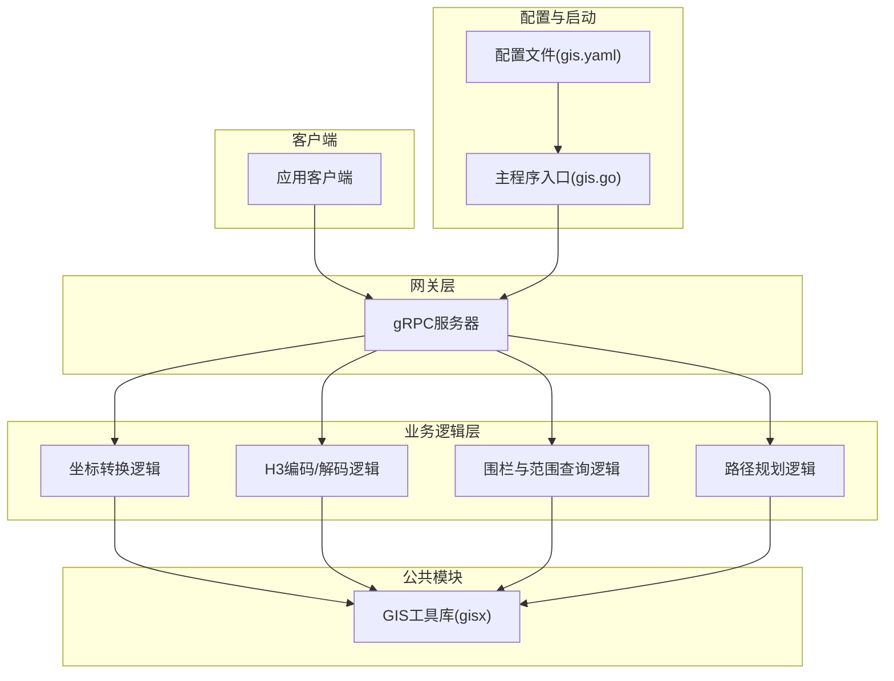
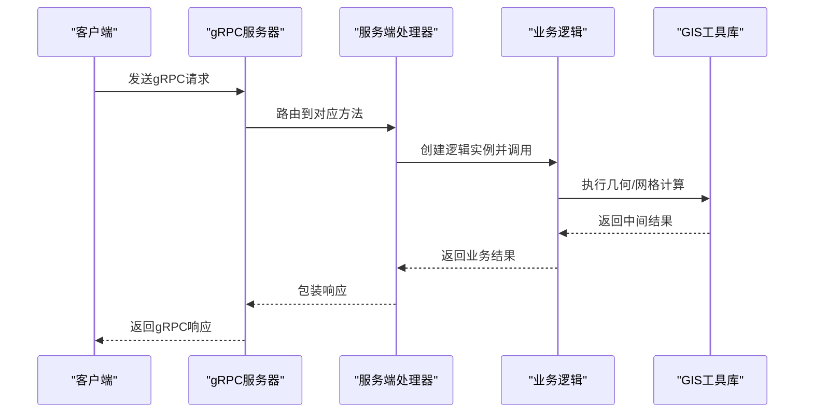
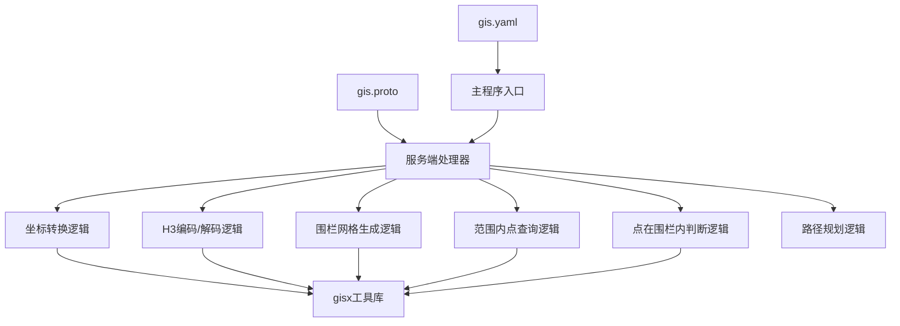

# 数据模型设计

<cite>
**本文档引用的文件**
- [app/gis/gis.proto](file://app/gis/gis.proto)
- [common/gisx/gisx.go](file://common/gisx/gisx.go)
- [app/gis/internal/logic/encodeh3logic.go](file://app/gis/internal/logic/encodeh3logic.go)
- [app/gis/internal/logic/decodeh3logic.go](file://app/gis/internal/logic/decodeh3logic.go)
- [app/gis/internal/logic/generatefenceh3cellslogic.go](file://app/gis/internal/logic/generatefenceh3cellslogic.go)
- [app/gis/internal/logic/pointinfencelogic.go](file://app/gis/internal/logic/pointinfencelogic.go)
- [app/gis/internal/logic/pointswithinradiuslogic.go](file://app/gis/internal/logic/pointswithinradiuslogic.go)
- [app/gis/internal/logic/transformcoordlogic.go](file://app/gis/internal/logic/transformcoordlogic.go)
- [app/gis/internal/logic/routepointslogic.go](file://app/gis/internal/logic/routepointslogic.go)
- [app/gis/etc/gis.yaml](file://app/gis/etc/gis.yaml)
- [app/gis/gis.go](file://app/gis/gis.go)
- [app/gis/internal/server/gisserver.go](file://app/gis/internal/server/gisserver.go)
- [model/sql/data.sql](file://model/sql/data.sql)
</cite>

## 目录
1. [简介](#简介)
2. [项目结构](#项目结构)
3. [核心组件](#核心组件)
4. [架构概览](#架构概览)
5. [详细组件分析](#详细组件分析)
6. [依赖分析](#依赖分析)
7. [性能考虑](#性能考虑)
8. [故障排除指南](#故障排除指南)
9. [结论](#结论)
10. [附录](#附录)

## 简介
本文件面向GIS服务中的数据模型设计，系统性阐述轨迹点数据模型、地理围栏模型与H3网格模型的字段定义、数据类型选择、约束条件、存储策略、索引设计与查询优化。同时覆盖轨迹数据的时间序列处理、空间索引建立与范围查询实现，以及数据模型的演进历史、版本管理与兼容性处理，并提供数据导入导出工具、数据校验规则与质量控制机制。

## 项目结构
GIS服务采用go-zero微服务框架，通过gRPC提供统一接口，内部以逻辑层封装具体算法，公共模块提供GIS基础能力，配置文件集中管理运行参数与日志输出。

图表来源
- [app/gis/gis.go:1-71](file://app/gis/gis.go#L1-L71)
- [app/gis/etc/gis.yaml:1-19](file://app/gis/etc/gis.yaml#L1-L19)
- [app/gis/internal/server/gisserver.go:1-120](file://app/gis/internal/server/gisserver.go#L1-L120)

章节来源
- [app/gis/gis.go:1-71](file://app/gis/gis.go#L1-L71)
- [app/gis/etc/gis.yaml:1-19](file://app/gis/etc/gis.yaml#L1-L19)

## 核心组件
- gRPC接口定义：在gis.proto中定义了坐标系类型、围栏、点、点对等消息体，以及编码/解码H3、生成围栏网格、范围内点查询、点在围栏内判断、距离计算、批量坐标转换、路径规划等服务方法。
- 公共GIS工具：gisx模块负责orb.Polygon到H3 GeoPolygon的转换、点比较与ring到LatLng的映射。
- 逻辑实现：各功能由独立逻辑层实现，如H3编码/解码、围栏网格生成、点在围栏内判断、半径内点查询、坐标转换、路径规划等。
- 配置与启动：通过gis.yaml配置监听端口、日志路径、Nacos注册等；主程序入口负责加载配置、初始化服务上下文与gRPC服务器。

章节来源
- [app/gis/gis.proto:1-219](file://app/gis/gis.proto#L1-L219)
- [common/gisx/gisx.go:1-60](file://common/gisx/gisx.go#L1-L60)
- [app/gis/internal/logic/encodeh3logic.go:1-46](file://app/gis/internal/logic/encodeh3logic.go#L1-L46)
- [app/gis/internal/logic/decodeh3logic.go:1-57](file://app/gis/internal/logic/decodeh3logic.go#L1-L57)
- [app/gis/internal/logic/generatefenceh3cellslogic.go:1-78](file://app/gis/internal/logic/generatefenceh3cellslogic.go#L1-L78)
- [app/gis/internal/logic/pointinfencelogic.go:1-59](file://app/gis/internal/logic/pointinfencelogic.go#L1-L59)
- [app/gis/internal/logic/pointswithinradiuslogic.go:1-75](file://app/gis/internal/logic/pointswithinradiuslogic.go#L1-L75)
- [app/gis/internal/logic/transformcoordlogic.go:1-102](file://app/gis/internal/logic/transformcoordlogic.go#L1-L102)
- [app/gis/internal/logic/routepointslogic.go:1-113](file://app/gis/internal/logic/routepointslogic.go#L1-L113)

## 架构概览
服务通过gRPC暴露统一接口，请求进入后根据方法路由到对应逻辑层，逻辑层使用公共GIS工具进行几何计算与H3网格操作，最终返回结果。配置文件控制日志级别、输出路径与服务注册行为。

图表来源
- [app/gis/internal/server/gisserver.go:1-120](file://app/gis/internal/server/gisserver.go#L1-L120)
- [app/gis/internal/logic/encodeh3logic.go:1-46](file://app/gis/internal/logic/encodeh3logic.go#L1-L46)
- [common/gisx/gisx.go:1-60](file://common/gisx/gisx.go#L1-L60)

## 详细组件分析

### 数据模型总览
- 基础类型
  - Point：经纬度(double)，用于表示单个地理点。
  - Fence：围栏标识与顶点序列，顶点为Point数组。
  - PointPair：两个点构成的配对，用于距离计算。
  - CoordType：坐标系枚举，支持WGS84、GCJ02、BD09。
- 接口消息
  - 编码/解码H3：输入点与分辨率，输出H3索引字符串或中心点与边界点。
  - 围栏网格生成：输入围栏顶点或ID与分辨率，输出去重后的H3索引列表。
  - 范围内点查询：输入中心点、候选点列表与半径，输出命中点索引。
  - 点在围栏内判断：输入点与围栏，输出布尔命中结果。
  - 距离计算：输入两个点或点对列表，输出距离（米）。
  - 坐标转换：输入点与源/目标坐标系，输出转换后的点。
  - 路径规划：输入起点与待巡检点列表，输出访问顺序与总距离。

章节来源
- [app/gis/gis.proto:54-219](file://app/gis/gis.proto#L54-L219)

### 轨迹点数据模型
- 字段定义
  - 时间戳：建议增加时间字段（例如double型秒级时间戳），用于排序与范围查询。
  - 经纬度：Point.lat/lon（double）。
  - 附加属性：速度、方向、海拔、信号强度等，按需扩展。
- 数据类型选择
  - double：满足高精度地理坐标存储与计算需求。
  - 时间戳：推荐使用Unix秒或纳秒，便于跨语言与数据库统一。
- 约束条件
  - 纬度范围[-90, 90]，经度范围[-180, 180]。
  - 时间戳需严格单调递增或允许重复（取决于业务需求）。
- 存储策略
  - 按时间分片分区（如按日/月），提高范围查询效率。
  - 空间索引：结合H3索引或地理编码索引，支持时空复合查询。
- 查询优化
  - 范围查询：先按时间过滤，再按空间索引筛选。
  - 聚合统计：按H3分辨率聚合，减少数据扫描量。
- 版本管理与兼容性
  - 字段扩展遵循protobuf兼容规则，新增字段保持向后兼容。
  - 对历史数据进行迁移脚本与版本标记，确保读写一致性。

[本节为概念性内容，不直接分析具体文件，故无章节来源]

### 地理围栏模型
- 字段定义
  - id：围栏唯一标识（string）。
  - points：Polygon顶点序列（Point数组），支持外环与洞（holes）。
- 数据类型选择
  - Polygon：由多个Ring组成，Ring为Point序列。
  - GeoPolygon：H3库所需的外部环与内部洞结构。
- 约束条件
  - 外环至少3个点，洞至少3个点。
  - 外环首尾需闭合，洞若未闭合则自动补全。
- 存储策略
  - Polygon与H3网格索引并存：Polygon用于精确判断，H3网格用于粗过滤。
  - H3网格按分辨率预计算并缓存，提升命中查询性能。
- 查询优化
  - 粗过滤：基于H3网格候选集，再精确判断点是否在Polygon内。
  - 多围栏命中：并行处理多个Polygon，合并命中结果。
- 版本管理与兼容性
  - 围栏ID变更时，同步更新索引与缓存。
  - 支持围栏更新后重新生成H3网格索引。

章节来源
- [app/gis/gis.proto:54-57](file://app/gis/gis.proto#L54-L57)
- [common/gisx/gisx.go:11-60](file://common/gisx/gisx.go#L11-L60)
- [app/gis/internal/logic/pointinfencelogic.go:29-58](file://app/gis/internal/logic/pointinfencelogic.go#L29-L58)
- [app/gis/internal/logic/generatefenceh3cellslogic.go:29-77](file://app/gis/internal/logic/generatefenceh3cellslogic.go#L29-L77)

### H3网格模型
- 字段定义
  - h3Index：H3单元索引字符串（string）。
  - resolution：H3分辨率（uint32，0-15）。
- 数据类型选择
  - string：H3索引以十六进制字符串存储，便于数据库索引与传输。
  - uint32：分辨率范围限定在0-15。
- 约束条件
  - 分辨率必须在有效范围内。
  - H3索引需为有效字符串，解码成功。
- 存储策略
  - H3索引作为主键或唯一索引，支持快速查找与去重。
  - 结合Polygon预计算H3网格，存储至专用表或缓存。
- 查询优化
  - 空间索引：H3索引天然具备邻域特性，便于范围查询与邻居扩展。
  - 粗过滤：先用H3候选集缩小搜索范围，再做精确几何判断。
- 版本管理与兼容性
  - 分辨率变更时，重新生成网格索引并更新缓存。
  - 向后兼容：低分辨率索引可覆盖高分辨率索引。

章节来源
- [app/gis/gis.proto:98-114](file://app/gis/gis.proto#L98-L114)
- [app/gis/internal/logic/encodeh3logic.go:28-45](file://app/gis/internal/logic/encodeh3logic.go#L28-L45)
- [app/gis/internal/logic/decodeh3logic.go:28-56](file://app/gis/internal/logic/decodeh3logic.go#L28-L56)
- [app/gis/internal/logic/generatefenceh3cellslogic.go:47-76](file://app/gis/internal/logic/generatefenceh3cellslogic.go#L47-L76)

### 时间序列处理与范围查询
- 时间序列处理
  - 轨迹点按时间戳排序，支持滑动窗口与区间聚合。
  - H3索引随时间变化而动态更新，维护时间-空间索引映射。
- 空间索引建立
  - 为H3索引建立唯一索引，加速范围查询与去重。
  - 为Polygon顶点建立空间索引（如R-tree），提升点在围栏内判断性能。
- 范围查询实现
  - 时间范围：按时间分区裁剪，减少扫描。
  - 空间范围：H3候选集 + 几何精确判断。
  - 复合范围：时间+空间双重过滤，先粗后精。

章节来源
- [app/gis/internal/logic/pointswithinradiuslogic.go:28-74](file://app/gis/internal/logic/pointswithinradiuslogic.go#L28-L74)
- [app/gis/internal/logic/routepointslogic.go:29-112](file://app/gis/internal/logic/routepointslogic.go#L29-L112)

### 数据导入导出与质量控制
- 导入导出
  - 导入：支持CSV/JSON批量导入轨迹点，校验经纬度与时间戳范围。
  - 导出：支持按时间范围与空间范围导出轨迹点与围栏结果。
- 数据校验规则
  - 基础校验：经纬度范围、时间戳合法性、分辨率范围。
  - 几何校验：Polygon闭合性、外环与洞的有效性。
  - 业务校验：围栏ID唯一性、H3索引有效性。
- 质量控制
  - 日志记录：所有异常与边界情况均记录日志，便于审计。
  - 重试与幂等：对网络抖动与并发冲突进行重试与幂等处理。
  - 监控指标：统计请求耗时、命中率、错误率，及时发现异常。

章节来源
- [app/gis/etc/gis.yaml:1-19](file://app/gis/etc/gis.yaml#L1-L19)
- [app/gis/internal/logic/transformcoordlogic.go:52-76](file://app/gis/internal/logic/transformcoordlogic.go#L52-L76)
- [common/gisx/gisx.go:43-58](file://common/gisx/gisx.go#L43-L58)

## 依赖分析
- 外部依赖
  - H3库：提供H3索引编码/解码与多边形到网格的转换。
  - orb库：提供几何运算与空间关系判断。
  - 坐标转换库：提供WGS84、GCJ02、BD09之间的相互转换。
- 内部依赖
  - gRPC接口定义与服务端处理器：将请求路由到对应逻辑层。
  - 逻辑层依赖公共GIS工具：完成几何与网格计算。
  - 配置文件驱动：控制日志、注册与运行模式。

图表来源
- [app/gis/gis.proto:1-219](file://app/gis/gis.proto#L1-L219)
- [app/gis/internal/server/gisserver.go:1-120](file://app/gis/internal/server/gisserver.go#L1-L120)
- [common/gisx/gisx.go:1-60](file://common/gisx/gisx.go#L1-L60)
- [app/gis/etc/gis.yaml:1-19](file://app/gis/etc/gis.yaml#L1-L19)
- [app/gis/gis.go:1-71](file://app/gis/gis.go#L1-L71)

章节来源
- [app/gis/gis.proto:1-219](file://app/gis/gis.proto#L1-L219)
- [app/gis/internal/server/gisserver.go:1-120](file://app/gis/internal/server/gisserver.go#L1-L120)
- [common/gisx/gisx.go:1-60](file://common/gisx/gisx.go#L1-L60)
- [app/gis/etc/gis.yaml:1-19](file://app/gis/etc/gis.yaml#L1-L19)
- [app/gis/gis.go:1-71](file://app/gis/gis.go#L1-L71)

## 性能考虑
- 查询性能
  - H3网格：利用H3的邻域特性进行粗过滤，显著降低几何计算次数。
  - 空间索引：为H3索引与Polygon建立索引，提升范围查询与命中判断性能。
- 计算性能
  - 路径规划：贪心初始化 + 2-opt局部优化，平衡性能与质量。
  - 批量处理：对批量坐标转换与距离计算采用向量化或并行处理。
- 存储性能
  - 分区与分片：按时间分区，减少扫描范围。
  - 缓存：热点围栏网格与转换结果缓存，降低重复计算。
- 网络与并发
  - 连接池与超时控制：合理设置gRPC连接与超时参数。
  - 幂等与重试：对关键操作实施幂等与指数退避重试。

[本节为通用性能指导，不直接分析具体文件，故无章节来源]

## 故障排除指南
- 常见错误与定位
  - 参数校验失败：检查经纬度范围、分辨率范围、坐标系枚举值。
  - H3索引无效：确认索引字符串格式与解析结果。
  - Polygon闭合性问题：确保外环首尾闭合，洞至少3点。
- 日志与监控
  - 日志路径与级别在配置文件中设置，便于问题排查。
  - 关注错误计数、延迟分布与命中率指标。
- 修复建议
  - 参数修正：根据错误提示调整输入参数。
  - 索引重建：当H3网格或Polygon索引异常时，重建索引。
  - 重试与降级：在网络波动或上游依赖异常时启用重试与降级策略。

章节来源
- [app/gis/etc/gis.yaml:1-19](file://app/gis/etc/gis.yaml#L1-L19)
- [app/gis/internal/logic/transformcoordlogic.go:52-76](file://app/gis/internal/logic/transformcoordlogic.go#L52-L76)
- [app/gis/internal/logic/encodeh3logic.go:33-35](file://app/gis/internal/logic/encodeh3logic.go#L33-L35)
- [common/gisx/gisx.go:43-58](file://common/gisx/gisx.go#L43-L58)

## 结论
本数据模型设计围绕轨迹点、地理围栏与H3网格三大核心，结合go-zero微服务架构与H3空间索引技术，实现了高效的空间查询与路径规划能力。通过严格的参数校验、索引设计与查询优化，能够满足大规模轨迹数据的存储与检索需求。未来可在时间序列分区、缓存策略与监控告警方面进一步完善，以提升整体系统的稳定性与可运维性。

## 附录
- 示例数据
  - 行政区划数据：包含省市区层级与编码，可用于区域范围查询与数据校验。
- 配置参考
  - gRPC监听端口、日志路径、Nacos注册开关等，按需调整。

章节来源
- [model/sql/data.sql:1-37](file://model/sql/data.sql#L1-L37)