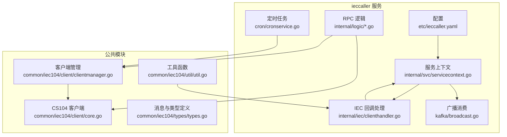
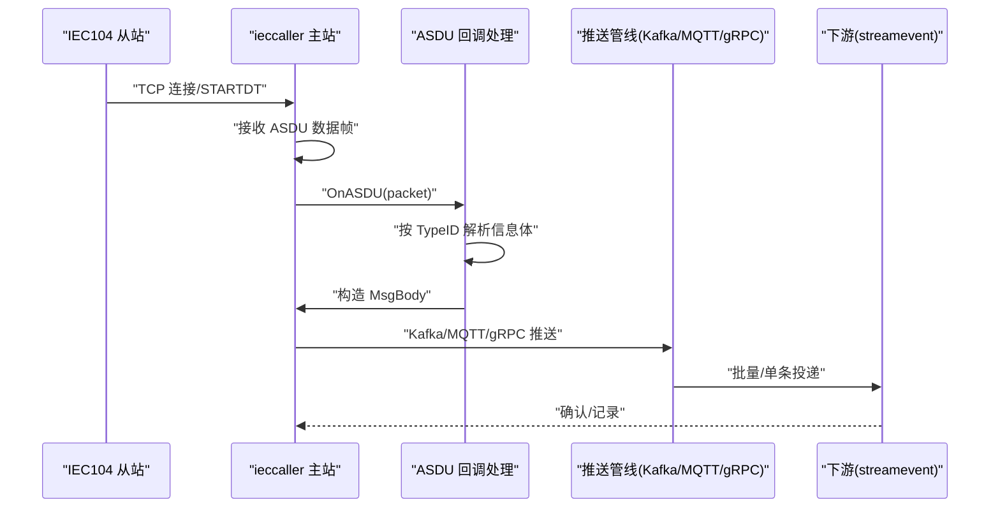
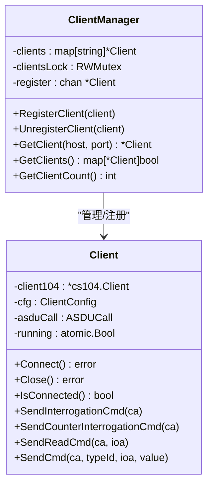
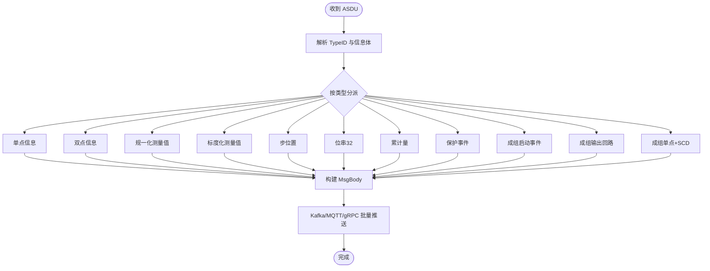
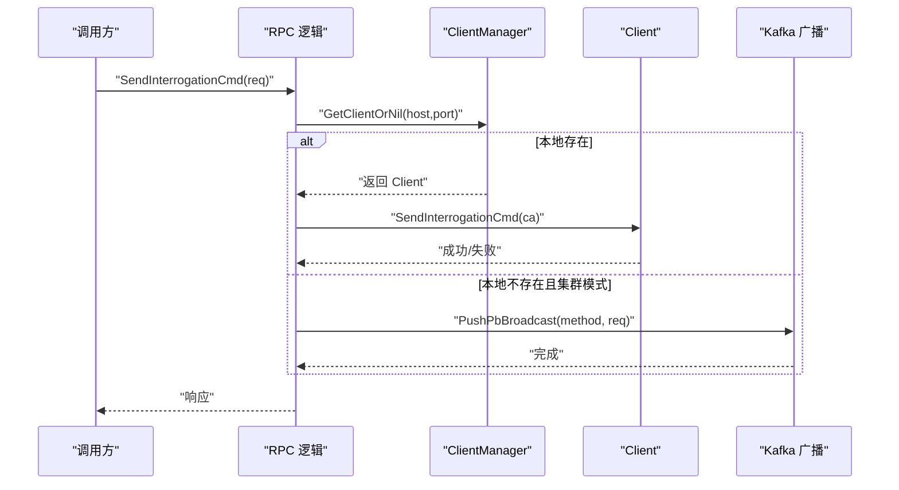
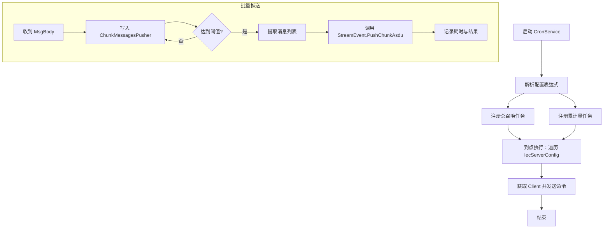
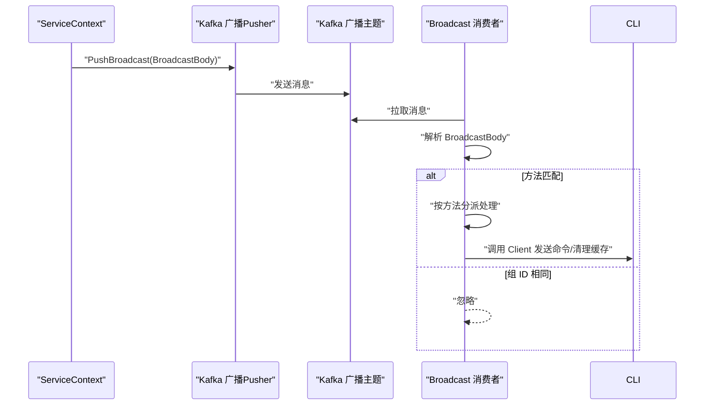
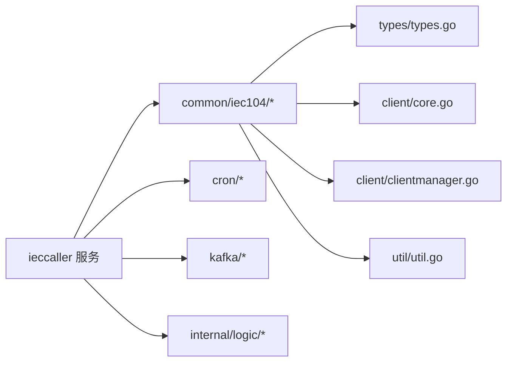

# IEC104 主站服务

<cite>
**本文引用的文件**
- [ieccaller.yaml](file://app/ieccaller/etc/ieccaller.yaml)
- [ieccaller.proto](file://app/ieccaller/ieccaller.proto)
- [clientmanager.go](file://common/iec104/client/clientmanager.go)
- [types.go](file://common/iec104/types/types.go)
- [clienthandler.go](file://app/ieccaller/internal/iec/clienthandler.go)
- [config.go](file://app/ieccaller/internal/config/config.go)
- [servicecontext.go](file://app/ieccaller/internal/svc/servicecontext.go)
- [broadcast.go](file://app/ieccaller/kafka/broadcast.go)
- [core.go](file://common/iec104/client/core.go)
- [cronservice.go](file://app/ieccaller/cron/cronservice.go)
- [sendinterrogationcmdlogic.go](file://app/ieccaller/internal/logic/sendinterrogationcmdlogic.go)
- [sendreadcmdlogic.go](file://app/ieccaller/internal/logic/sendreadcmdlogic.go)
- [sendcommandlogic.go](file://app/ieccaller/internal/logic/sendcommandlogic.go)
- [util.go](file://common/iec104/util/util.go)
- [iec104.md](file://docs/iec104.md)
</cite>

## 目录
1. [简介](#简介)
2. [项目结构](#项目结构)
3. [核心组件](#核心组件)
4. [架构总览](#架构总览)
5. [详细组件分析](#详细组件分析)
6. [依赖关系分析](#依赖关系分析)
7. [性能考量](#性能考量)
8. [故障排查指南](#故障排查指南)
9. [结论](#结论)
10. [附录](#附录)

## 简介
本文件面向 IE C104 主站服务（ieccaller），系统性梳理其架构设计、客户端管理机制、协议处理实现、命令下发与广播同步、定时任务与批量推送、以及与 Kafka/MQTT/gRPC 的集成方案。文档同时提供配置项说明、API 接口清单与使用示例，并结合 IEC104 协议规范与 AS DU 数据帧解析要点，给出部署与运维最佳实践。

## 项目结构
ieccaller 位于 app/ieccaller，围绕 IEC104 主站通信展开，核心目录与职责如下：
- etc：服务配置（ieccaller.yaml）
- internal/config：服务配置模型与 IEC 服务器配置模型
- internal/svc：服务上下文，负责 Kafka/MQTT/gRPC 推送、点位映射模型与批处理推送器
- internal/iec：ASDU 回调与数据处理
- internal/logic：RPC 逻辑层（命令下发）
- cron：定时任务（总召唤/累计量召唤）
- kafka：广播消费（集群模式下跨实例同步命令）
- iecagent/iecstash/streamevent：与上下游服务协作的数据通路

**图表来源**
- [servicecontext.go:45-142](file://app/ieccaller/internal/svc/servicecontext.go#L45-L142)
- [clientmanager.go:17-27](file://common/iec104/client/clientmanager.go#L17-L27)
- [core.go:87-117](file://common/iec104/client/core.go#L87-L117)
- [clienthandler.go:30-44](file://app/ieccaller/internal/iec/clienthandler.go#L30-L44)
- [cronservice.go:16-21](file://app/ieccaller/cron/cronservice.go#L16-L21)
- [broadcast.go:18-22](file://app/ieccaller/kafka/broadcast.go#L18-L22)

**章节来源**
- [ieccaller.yaml:1-79](file://app/ieccaller/etc/ieccaller.yaml#L1-L79)
- [config.go:18-58](file://app/ieccaller/internal/config/config.go#L18-L58)
- [servicecontext.go:45-142](file://app/ieccaller/internal/svc/servicecontext.go#L45-L142)

## 核心组件
- 客户端管理器（ClientManager）：维护多路 IEC104 从站连接，提供注册/注销/查询/统计能力
- CS104 客户端（Client）：封装连接、自动重连、命令发送、事件回调
- ASDU 回调处理（ClientCall）：按 ASDU 类型解析数据体，构造 MsgBody，推送至 Kafka/MQTT/gRPC
- 服务上下文（ServiceContext）：统一初始化与关闭资源，负责点位映射、批量推送、广播推送
- 定时任务（CronService）：周期性触发总召唤/累计量召唤
- 广播消费（Broadcast）：集群模式下消费广播主题，跨实例同步命令与缓存清理
- 工具与类型（util/types）：质量描述符解析、主题模板生成、消息体结构

**章节来源**
- [clientmanager.go:11-145](file://common/iec104/client/clientmanager.go#L11-L145)
- [core.go:48-283](file://common/iec104/client/core.go#L48-L283)
- [clienthandler.go:21-541](file://app/ieccaller/internal/iec/clienthandler.go#L21-L541)
- [servicecontext.go:33-311](file://app/ieccaller/internal/svc/servicecontext.go#L33-L311)
- [cronservice.go:11-78](file://app/ieccaller/cron/cronservice.go#L11-L78)
- [broadcast.go:14-149](file://app/ieccaller/kafka/broadcast.go#L14-L149)
- [util.go:13-242](file://common/iec104/util/util.go#L13-L242)
- [types.go:11-323](file://common/iec104/types/types.go#L11-L323)

## 架构总览
ieccaller 作为 IEC104 主站，与多个从站并行通信；收到 ASDU 后，依据点位映射决定是否推送，并通过 Kafka/MQTT/gRPC 三通道分发。在集群模式下，通过 Kafka 广播实现跨实例命令同步与缓存清理。

**图表来源**
- [clienthandler.go:94-140](file://app/ieccaller/internal/iec/clienthandler.go#L94-L140)
- [servicecontext.go:144-244](file://app/ieccaller/internal/svc/servicecontext.go#L144-L244)

## 详细组件分析

### 客户端管理与连接生命周期
- 注册/注销：ClientManager 提供注册与注销方法，内部以 host:port 为键管理客户端
- 查询与统计：支持按主机端口查询、遍历全部客户端、统计连接状态
- 运行状态：Client 内部 running 原子标记，连接/断开/服务器主动激活事件触发相应处理

**图表来源**
- [clientmanager.go:11-145](file://common/iec104/client/clientmanager.go#L11-L145)
- [core.go:48-180](file://common/iec104/client/core.go#L48-L180)

**章节来源**
- [clientmanager.go:35-107](file://common/iec104/client/clientmanager.go#L35-L107)
- [core.go:161-180](file://common/iec104/client/core.go#L161-L180)

### ASDU 数据帧处理与命令下发
- 回调入口：OnASDU 将不同 TypeID 的 ASDU 分派到对应解析函数
- 数据体解析：单点/双点/测量值/步位/位串/累计量/保护事件/打包信息/成组单点等
- 质量描述符：利用 util.Qds/Qdp 函数族解析溢出/封锁/替代/非最新/无效等标志
- 推送路径：构造 MsgBody，写入 Kafka/MQTT/gRPC 批处理队列

**图表来源**
- [clienthandler.go:94-140](file://app/ieccaller/internal/iec/clienthandler.go#L94-L140)
- [util.go:55-93](file://common/iec104/util/util.go#L55-L93)

**章节来源**
- [clienthandler.go:142-536](file://app/ieccaller/internal/iec/clienthandler.go#L142-L536)
- [util.go:13-242](file://common/iec104/util/util.go#L13-L242)

### 命令发送与 RPC 接口
- RPC 方法：总召唤、累计量召唤、读定值、测试命令、通用命令下发、点位映射查询与缓存清理
- 本地优先：若本地存在对应 Client 则直接发送
- 集群广播：若本地不存在且 DeployMode=cluster，则将请求广播到 Kafka 广播主题，由其他实例执行

**图表来源**
- [sendinterrogationcmdlogic.go:26-42](file://app/ieccaller/internal/logic/sendinterrogationcmdlogic.go#L26-L42)
- [servicecontext.go:246-262](file://app/ieccaller/internal/svc/servicecontext.go#L246-L262)
- [broadcast.go:40-68](file://app/ieccaller/kafka/broadcast.go#L40-L68)

**章节来源**
- [sendinterrogationcmdlogic.go:25-42](file://app/ieccaller/internal/logic/sendinterrogationcmdlogic.go#L25-L42)
- [sendreadcmdlogic.go:25-43](file://app/ieccaller/internal/logic/sendreadcmdlogic.go#L25-L43)
- [sendcommandlogic.go:27-44](file://app/ieccaller/internal/logic/sendcommandlogic.go#L27-L44)
- [broadcast.go:40-110](file://app/ieccaller/kafka/broadcast.go#L40-L110)

### 定时任务与批量推送
- 定时任务：根据配置的 cron 表达式周期性发送总召唤/累计量召唤
- 批量推送：按字节阈值（默认 1MB）聚合消息，减少下游压力
- 聚合器：executorx.ChunkMessagesPusher 负责缓冲与触发

**图表来源**
- [cronservice.go:23-71](file://app/ieccaller/cron/cronservice.go#L23-L71)
- [servicecontext.go:76-131](file://app/ieccaller/internal/svc/servicecontext.go#L76-L131)

**章节来源**
- [cronservice.go:23-71](file://app/ieccaller/cron/cronservice.go#L23-L71)
- [servicecontext.go:76-131](file://app/ieccaller/internal/svc/servicecontext.go#L76-L131)

### Kafka 广播与集群同步
- 广播发布：ServiceContext.PushBroadcast/PushPbBroadcast 将方法名与请求体封装为 BroadcastBody，推送到 Kafka 广播主题
- 广播消费：Broadcast.Consume 根据 Method 分派到具体命令发送或缓存清理
- 组 ID 过滤：忽略来自同一 BroadcastGroupId 的广播，避免自反

**图表来源**
- [servicecontext.go:246-285](file://app/ieccaller/internal/svc/servicecontext.go#L246-L285)
- [broadcast.go:24-148](file://app/ieccaller/kafka/broadcast.go#L24-L148)

**章节来源**
- [servicecontext.go:246-285](file://app/ieccaller/internal/svc/servicecontext.go#L246-L285)
- [broadcast.go:40-148](file://app/ieccaller/kafka/broadcast.go#L40-L148)

### 配置选项与部署建议
- 服务配置（ieccaller.yaml）：监听地址、部署模式、超时、日志、Nacos、IEC 服务器列表、Kafka/MQTT/gRPC、数据库、定时任务、批量阈值等
- 配置模型（config.Config/IecServerConfig）：强类型定义，支持集群广播组 ID、任务并发度、定时表达式等
- 部署模式：standalone/cluster；cluster 模式启用广播同步与跨实例一致性

**章节来源**
- [ieccaller.yaml:1-79](file://app/ieccaller/etc/ieccaller.yaml#L1-L79)
- [config.go:18-58](file://app/ieccaller/internal/config/config.go#L18-L58)

## 依赖关系分析
- ieccaller 依赖公共模块 common/iec104 提供的客户端、类型与工具
- 服务上下文统一编排 Kafka/MQTT/gRPC 推送与批处理
- 定时任务与广播消费分别在 cron 与 kafka 包中实现
- RPC 逻辑层通过 ClientManager 与 Client 进行命令下发

**图表来源**
- [servicecontext.go:33-43](file://app/ieccaller/internal/svc/servicecontext.go#L33-L43)
- [clientmanager.go:11-145](file://common/iec104/client/clientmanager.go#L11-L145)
- [core.go:48-117](file://common/iec104/client/core.go#L48-L117)
- [util.go:13-242](file://common/iec104/util/util.go#L13-L242)

**章节来源**
- [servicecontext.go:33-43](file://app/ieccaller/internal/svc/servicecontext.go#L33-L43)
- [clientmanager.go:11-145](file://common/iec104/client/clientmanager.go#L11-L145)
- [core.go:48-117](file://common/iec104/client/core.go#L48-L117)

## 性能考量
- 任务并发：每个 IEC 服务器配置可设置 TaskConcurrency，提升 ASDU 解析与推送吞吐
- 批量推送：默认 1MB 字节阈值聚合，降低网络与下游压力
- 资源关闭：ServiceContext.Close 统一关闭 Kafka/MQTT 连接，避免资源泄漏
- 自动重连：CS104 客户端支持自动重连与重连间隔配置，增强链路稳定性

[本节为通用指导，无需列出具体文件来源]

## 故障排查指南
- 连接问题：检查 IecServerConfig 中 Host/Port 与 ReconnectInterval；查看 ClientManager 统计日志
- 推送失败：核对 Kafka/MQTT 配置与 Topic；确认 PushASDU 返回的错误日志
- 广播未生效：确认 DeployMode=cluster 且 Kafka 广播主题配置正确；检查 BroadcastGroupId 是否一致
- 定时任务：确认 cron 表达式合法；查看 CronService 日志
- 点位映射：确认 enable_push 与缓存状态；必要时使用 ClearPointMappingCache 清理

**章节来源**
- [clientmanager.go:117-144](file://common/iec104/client/clientmanager.go#L117-L144)
- [servicecontext.go:186-242](file://app/ieccaller/internal/svc/servicecontext.go#L186-L242)
- [broadcast.go:24-38](file://app/ieccaller/kafka/broadcast.go#L24-L38)
- [cronservice.go:23-71](file://app/ieccaller/cron/cronservice.go#L23-L71)

## 结论
ieccaller 以清晰的模块划分实现了 IEC104 主站的核心能力：多从站并行通信、完善的 ASDU 解析与推送、灵活的集群广播同步、定时任务与批量推送。配合 Kafka/MQTT/gRPC 的多通道输出，满足大规模工业数据采集与转发需求。通过合理的配置与监控，可在生产环境中稳定运行并扩展。

[本节为总结性内容，无需列出具体文件来源]

## 附录

### API 接口清单（RPC）
- SendInterrogationCmd：总召唤
- SendCounterInterrogationCmd：累计量召唤
- SendReadCmd：读定值
- SendTestCmd：测试命令
- SendCommand：通用命令下发（单点/双点/步位/设定值等）
- QueryPointMappingById：按 ID 查询点位映射
- QueryPointMappingByKey：按 tag_station/coa/ioa 查询点位映射
- PageListPointMapping：分页查询点位映射
- ClearPointMappingCache：清除点位映射缓存

**章节来源**
- [sendinterrogationcmdlogic.go:25-42](file://app/ieccaller/internal/logic/sendinterrogationcmdlogic.go#L25-L42)
- [sendreadcmdlogic.go:25-43](file://app/ieccaller/internal/logic/sendreadcmdlogic.go#L25-L43)
- [sendcommandlogic.go:27-44](file://app/ieccaller/internal/logic/sendcommandlogic.go#L27-L44)
- [ieccaller.proto](file://app/ieccaller/ieccaller.proto)

### IEC104 协议与 AS DU 类型要点
- 支持监视方向 12 种 ASDU 类型（含无时标/带时标/CP56Time2a 三种变体）与 6 种命令类型
- 质量描述符（QDS/QDP）用于标识数据有效性与状态
- 主题模板支持动态 Topic 生成，便于按站点/设备/扩展字段组织订阅

**章节来源**
- [util.go:55-175](file://common/iec104/util/util.go#L55-L175)
- [types.go:11-323](file://common/iec104/types/types.go#L11-L323)
- [iec104.md:243-328](file://docs/iec104.md#L243-L328)

### 配置项速览（ieccaller.yaml）
- 服务与日志：Name、ListenOn、DeployMode、Timeout、Log.*
- IEC 服务器：IecServerConfig[*].Host/Port/IcCoaList/CcCoaList/MetaData/TaskConcurrency
- Kafka：Brokers、Topic、BroadcastTopic、BroadcastGroupId、IsPush
- MQTT：Broker、Username/Password、Qos、Topic[]、IsPush
- StreamEvent：Endpoints/Target、NonBlock、Timeout
- 数据库：DB.DataSource（启用点位映射）
- 定时任务：InterrogationCmdCron、CounterInterrogationCmd
- 批量推送：PushAsduChunkBytes、GracePeriod

**章节来源**
- [ieccaller.yaml:1-79](file://app/ieccaller/etc/ieccaller.yaml#L1-L79)
- [config.go:18-58](file://app/ieccaller/internal/config/config.go#L18-L58)