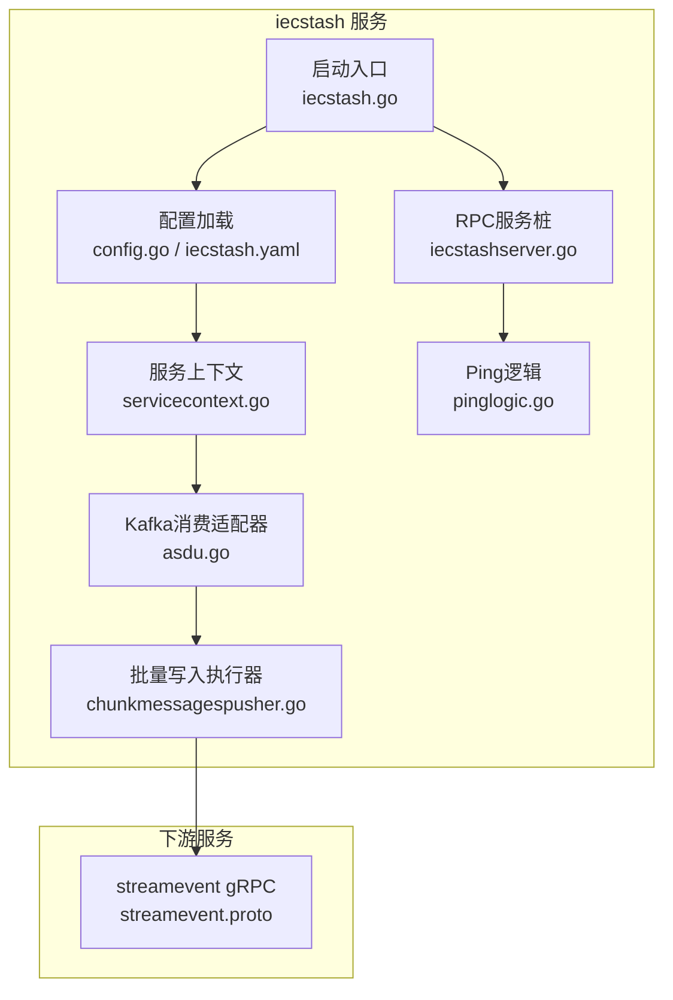
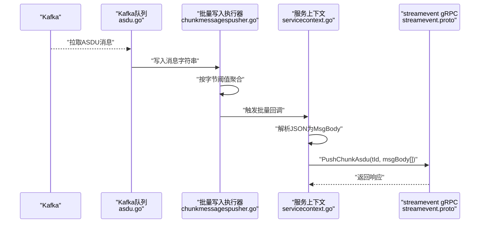
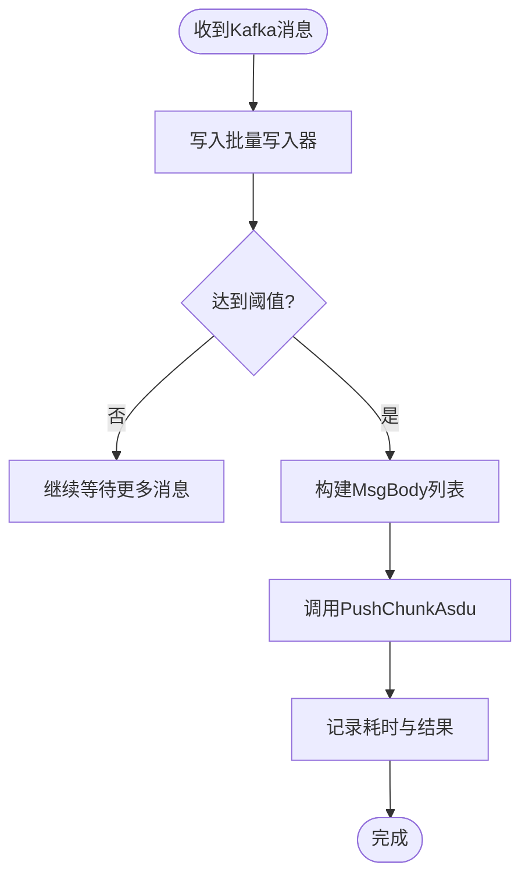
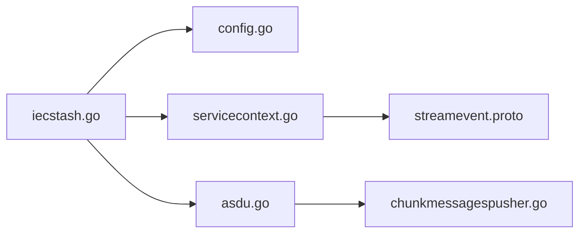

# IEC104 数据合并服务

<cite>
**本文引用的文件**
- [iecstash.go](file://app/iecstash/iecstash.go)
- [iecstash.yaml](file://app/iecstash/etc/iecstash.yaml)
- [config.go](file://app/iecstash/internal/config/config.go)
- [servicecontext.go](file://app/iecstash/internal/svc/servicecontext.go)
- [asdu.go](file://app/iecstash/kafka/asdu.go)
- [chunkmessagespusher.go](file://common/executorx/chunkmessagespusher.go)
- [streamevent.proto](file://facade/streamevent/streamevent/streamevent.proto)
- [pinglogic.go](file://app/iecstash/internal/logic/pinglogic.go)
- [iecstashserver.go](file://app/iecstash/internal/server/iecstashserver.go)
</cite>

## 目录
1. [简介](#简介)
2. [项目结构](#项目结构)
3. [核心组件](#核心组件)
4. [架构总览](#架构总览)
5. [详细组件分析](#详细组件分析)
6. [依赖关系分析](#依赖关系分析)
7. [性能考量](#性能考量)
8. [故障排查指南](#故障排查指南)
9. [结论](#结论)
10. [附录](#附录)

## 简介
本文件面向IEC104数据合并服务（iecstash），系统性梳理其数据聚合架构、缓存与批处理机制、Kafka消费与异步推送流程、时间戳与数据合并策略、质量控制与异常处理、配置参数与性能调优建议，以及监控指标与高可用部署最佳实践。目标是帮助读者快速理解并高效运维该服务。

## 项目结构
iecstash服务位于应用目录下的独立模块中，采用go-zero框架提供的RPC与队列能力，结合facade层的streamevent服务进行下游数据推送。关键文件组织如下：
- 启动入口与服务注册：app/iecstash/iecstash.go
- 配置与运行参数：app/iecstash/etc/iecstash.yaml、app/iecstash/internal/config/config.go
- 服务上下文与批量推送器：app/iecstash/internal/svc/servicecontext.go
- Kafka消费适配器：app/iecstash/kafka/asdu.go
- 批量写入执行器：common/executorx/chunkmessagespusher.go
- gRPC接口与消息模型：facade/streamevent/streamevent/streamevent.proto
- RPC服务桩与逻辑：app/iecstash/internal/server/iecstashserver.go、app/iecstash/internal/logic/pinglogic.go

图表来源
- [iecstash.go:35-84](file://app/iecstash/iecstash.go#L35-L84)
- [config.go:10-28](file://app/iecstash/internal/config/config.go#L10-L28)
- [servicecontext.go:25-91](file://app/iecstash/internal/svc/servicecontext.go#L25-L91)
- [asdu.go:20-24](file://app/iecstash/kafka/asdu.go#L20-L24)
- [chunkmessagespusher.go:17-44](file://common/executorx/chunkmessagespusher.go#L17-L44)
- [streamevent.proto:10-25](file://facade/streamevent/streamevent/streamevent.proto#L10-L25)

章节来源
- [iecstash.go:35-84](file://app/iecstash/iecstash.go#L35-L84)
- [iecstash.yaml:1-46](file://app/iecstash/etc/iecstash.yaml#L1-L46)
- [config.go:10-28](file://app/iecstash/internal/config/config.go#L10-L28)

## 核心组件
- 配置与运行参数
  - KafkaASDUConfig：Kafka消费者配置，含Broker、Topic、Group、连接数、每连接协程数、处理协程数、最小/最大拉取字节、偏移策略等。
  - StreamEventConf：下游streamevent服务客户端配置，含非阻塞、超时、目标地址等。
  - PushAsduChunkBytes：批量推送阈值（字节）。
  - GracePeriod：优雅停机窗口。
- 服务上下文
  - 构造streamevent客户端，设置最大消息尺寸。
  - 初始化批量推送器ChunkMessagesPusher，负责将字符串消息聚合成批次并转换为MsgBody后调用PushChunkAsdu。
- Kafka消费适配器
  - 实现Consume(key, value)接口，将Kafka消息写入批量推送器。
- 批量写入执行器
  - 基于go-zero的ChunkExecutor，按字节阈值聚合消息，触发回调执行批量发送。
- RPC服务桩与逻辑
  - 提供Ping接口，便于健康检查与连通性验证。

章节来源
- [iecstash.yaml:18-46](file://app/iecstash/etc/iecstash.yaml#L18-L46)
- [config.go:10-28](file://app/iecstash/internal/config/config.go#L10-L28)
- [servicecontext.go:25-91](file://app/iecstash/internal/svc/servicecontext.go#L25-L91)
- [asdu.go:20-24](file://app/iecstash/kafka/asdu.go#L20-L24)
- [chunkmessagespusher.go:17-44](file://common/executorx/chunkmessagespusher.go#L17-L44)
- [iecstashserver.go:26-29](file://app/iecstash/internal/server/iecstashserver.go#L26-L29)
- [pinglogic.go:26-28](file://app/iecstash/internal/logic/pinglogic.go#L26-L28)

## 架构总览
iecstash通过go-queue的Kafka队列消费IEC104的ASDU消息，使用ChunkMessagesPusher进行批量聚合，随后将消息体转换为streamevent的MsgBody并通过gRPC批量推送至streamevent服务。整体流程强调低延迟、高吞吐与可扩展的异步处理。

图表来源
- [asdu.go:20-24](file://app/iecstash/kafka/asdu.go#L20-L24)
- [chunkmessagespusher.go:32-44](file://common/executorx/chunkmessagespusher.go#L32-L44)
- [servicecontext.go:36-84](file://app/iecstash/internal/svc/servicecontext.go#L36-L84)
- [streamevent.proto:83-89](file://facade/streamevent/streamevent/streamevent.proto#L83-L89)

## 详细组件分析

### Kafka消费与批量处理
- 消费适配器
  - Consume方法将Kafka消息写入ChunkMessagesPusher，日志记录key与value，便于问题定位。
- 批量写入执行器
  - NewChunkMessagesPusher构造ChunkExecutor，按PushAsduChunkBytes阈值聚合消息。
  - execute回调将interface{}转回string切片，交由chunkSender处理。
- 服务上下文中的批量发送
  - 将字符串数组解析为MsgBody列表，生成事务ID，调用PushChunkAsdu，记录耗时与结果。

图表来源
- [asdu.go:20-24](file://app/iecstash/kafka/asdu.go#L20-L24)
- [chunkmessagespusher.go:26-44](file://common/executorx/chunkmessagespusher.go#L26-L44)
- [servicecontext.go:36-84](file://app/iecstash/internal/svc/servicecontext.go#L36-L84)

章节来源
- [asdu.go:20-24](file://app/iecstash/kafka/asdu.go#L20-L24)
- [chunkmessagespusher.go:17-44](file://common/executorx/chunkmessagespusher.go#L17-L44)
- [servicecontext.go:36-84](file://app/iecstash/internal/svc/servicecontext.go#L36-L84)

### 数据模型与消息体
- streamevent消息体包含：
  - 基础信息：msgId、host、port、asdu、typeId、dataType、coa、time、metaDataRaw。
  - 信息体原始内容：bodyRaw。
  - 点位映射：deviceId、deviceName、tdTableType及扩展字段。
- 这些字段在服务上下文中被解析并组装为MsgBody，随后批量推送到下游。

章节来源
- [streamevent.proto:92-114](file://facade/streamevent/streamevent/streamevent.proto#L92-L114)
- [servicecontext.go:40-65](file://app/iecstash/internal/svc/servicecontext.go#L40-L65)

### 时间戳与数据合并策略
- 时间戳
  - Kafka消息消费侧未对时间戳做额外处理，统一使用消息体中的time字段。
- 数据合并
  - 当前实现为基于字节阈值的批量聚合，未见针对ASDU去重或按设备/点位的合并逻辑。
  - 若需要去重与合并，可在服务上下文的解析阶段引入去重键（如设备地址+公共地址+信息体地址+时间戳）与合并策略。

章节来源
- [servicecontext.go:40-65](file://app/iecstash/internal/svc/servicecontext.go#L40-L65)

### 异常数据过滤与质量控制
- JSON解析
  - 使用gjson解析字符串，若字段缺失或类型不符，可能导致MsgBody字段为空或默认值。
- gRPC调用
  - 对PushChunkAsdu的错误进行记录与告警，但未见自动重试或降级策略。
- 建议
  - 在解析阶段增加字段校验与默认值处理；对异常批次进行隔离与重试队列。

章节来源
- [servicecontext.go:40-81](file://app/iecstash/internal/svc/servicecontext.go#L40-L81)

### 缓存管理与持久化
- 当前实现未见针对iecstash的专用缓存组件。
- 点位映射缓存存在于其他模块（如devicepointmappingmodel），可作为参考设计：
  - 生成缓存键（站点+COA+IOA）。
  - 缓存条目包含有效性标记，缺失时返回空条目而非报错。
- 建议
  - 如需缓存ASDU去重或合并状态，可复用类似缓存模型，设定过期策略与淘汰机制。

章节来源
- [devicepointmappingmodel.go:70-107](file://model/devicepointmappingmodel.go#L70-L107)

### RPC服务与健康检查
- Ping接口
  - 提供基础健康检查能力，便于运维与编排系统探测服务状态。

章节来源
- [pinglogic.go:26-28](file://app/iecstash/internal/logic/pinglogic.go#L26-L28)
- [iecstashserver.go:26-29](file://app/iecstash/internal/server/iecstashserver.go#L26-L29)

## 依赖关系分析
- 启动入口依赖配置与服务上下文，注册RPC服务并启动Kafka队列。
- 服务上下文依赖streamevent客户端与批量写入执行器。
- Kafka消费适配器依赖服务上下文的批量写入器。
- 批量写入执行器依赖go-zero的ChunkExecutor。

图表来源
- [iecstash.go:45-83](file://app/iecstash/iecstash.go#L45-L83)
- [config.go:10-28](file://app/iecstash/internal/config/config.go#L10-L28)
- [servicecontext.go:25-91](file://app/iecstash/internal/svc/servicecontext.go#L25-L91)
- [asdu.go:14-24](file://app/iecstash/kafka/asdu.go#L14-L24)
- [chunkmessagespusher.go:17-44](file://common/executorx/chunkmessagespusher.go#L17-L44)
- [streamevent.proto:10-25](file://facade/streamevent/streamevent/streamevent.proto#L10-L25)

章节来源
- [iecstash.go:45-83](file://app/iecstash/iecstash.go#L45-L83)

## 性能考量
- Kafka消费参数
  - Conns、Consumers、Processors：建议根据CPU核数与分区数合理配置，避免过度并发导致资源争用。
  - MinBytes/MaxBytes：在网络与磁盘IO良好的环境下可适当提高，以提升吞吐。
  - Offset：首次/末尾读取策略影响启动时延与历史数据补齐。
- 批量阈值
  - PushAsduChunkBytes：建议结合下游gRPC最大消息限制与网络MTU进行调优，避免过大导致内存压力。
- 并发与资源
  - 严格控制并发度，避免与下游服务限流冲突；必要时引入背压与限速。
- 内存优化
  - 字符串消息在聚合阶段避免不必要的拷贝；及时释放临时对象。
- 监控与可观测性
  - 记录批次大小、耗时、错误率、重试次数；关注下游服务的响应时间与拒绝率。

## 故障排查指南
- Kafka消费异常
  - 检查Broker连通性、Topic与Group配置、分区与消费者数量匹配。
  - 关注MinBytes/MaxBytes与网络延迟的关系，避免长时间无消息。
- gRPC推送失败
  - 查看PushChunkAsdu的错误日志，确认下游服务可达性与消息大小限制。
  - 若出现超时，考虑增大超时配置或降低批次大小。
- 解析异常
  - gjson解析失败或字段缺失时，检查上游消息格式一致性。
- 健康检查
  - 使用Ping接口验证服务可用性，结合Nacos注册状态确认服务发现正常。

章节来源
- [servicecontext.go:74-81](file://app/iecstash/internal/svc/servicecontext.go#L74-L81)
- [asdu.go:20-24](file://app/iecstash/kafka/asdu.go#L20-L24)

## 结论
iecstash服务通过Kafka消费与批量聚合实现了IEC104数据的高效汇聚，并以gRPC向下游推送。当前实现侧重于吞吐与稳定性，建议在后续版本中补充去重、合并、异常重试与缓存策略，以进一步提升数据质量与系统韧性。

## 附录

### 配置参数说明
- KafkaASDUConfig
  - Name：队列名称
  - Brokers：Kafka集群地址列表
  - Topic：ASDU主题
  - Group：消费者组
  - Conns：连接数（建议≤CPU核数）
  - Consumers：每连接协程数（建议≤分区数）
  - Processors：处理协程数（建议为Conns×Consumers的倍数）
  - MinBytes/MaxBytes：每次拉取字节范围
  - CommitInOrder：是否有序提交
  - Offset：起始偏移策略（first/last）
- StreamEventConf
  - Target：下游服务地址
  - NonBlock：非阻塞模式
  - Timeout：调用超时
- PushAsduChunkBytes：批量阈值（字节）
- GracePeriod：优雅停机窗口

章节来源
- [iecstash.yaml:18-46](file://app/iecstash/etc/iecstash.yaml#L18-L46)
- [config.go:10-28](file://app/iecstash/internal/config/config.go#L10-L28)