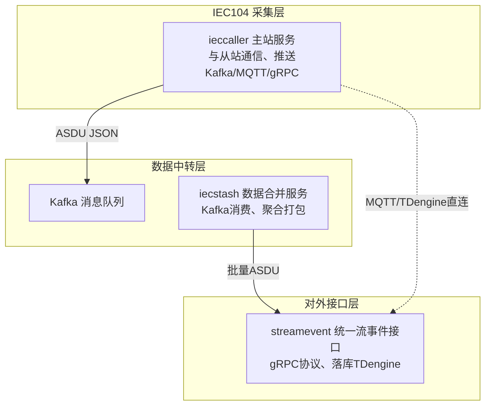
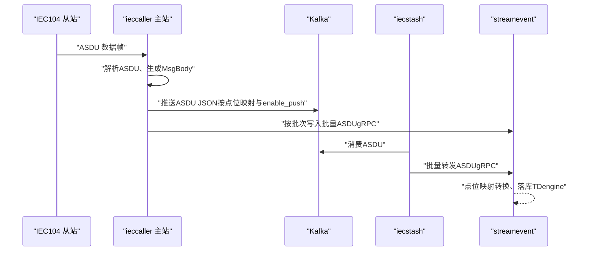
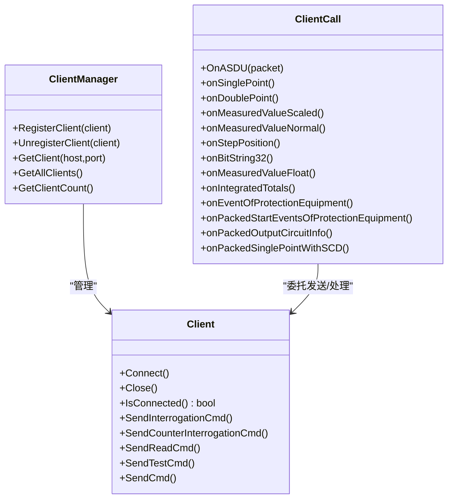
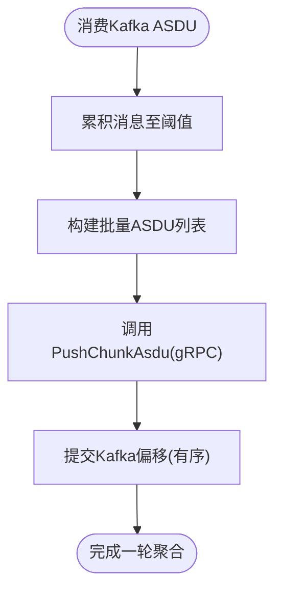
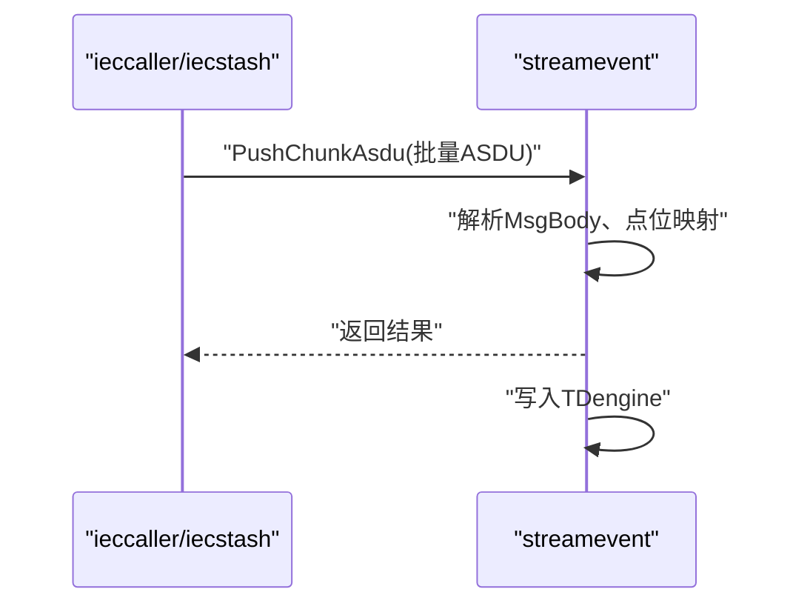
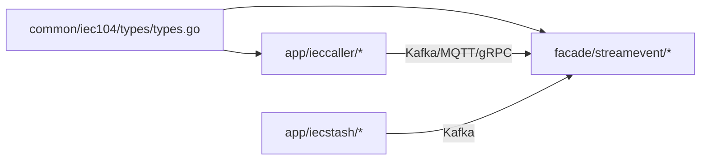

# IEC104 数采平台

<cite>
**本文引用的文件**
- [docs/iec104.md](file://docs/iec104.md)
- [docs/iec104-protocol.md](file://docs/iec104-protocol.md)
- [common/iec104/types/types.go](file://common/iec104/types/types.go)
- [common/iec104/client/clientmanager.go](file://common/iec104/client/clientmanager.go)
- [common/iec104/client/core.go](file://common/iec104/client/core.go)
- [common/iec104/server/iecServer.go](file://common/iec104/server/iecServer.go)
- [app/ieccaller/internal/iec/clienthandler.go](file://app/ieccaller/internal/iec/clienthandler.go)
- [app/ieccaller/kafka/broadcast.go](file://app/ieccaller/kafka/broadcast.go)
- [app/ieccaller/etc/ieccaller.yaml](file://app/ieccaller/etc/ieccaller.yaml)
- [app/ieccaller/internal/svc/servicecontext.go](file://app/ieccaller/internal/svc/servicecontext.go)
- [app/iecstash/kafka/asdu.go](file://app/iecstash/kafka/asdu.go)
- [app/iecstash/etc/iecstash.yaml](file://app/iecstash/etc/iecstash.yaml)
- [facade/streamevent/etc/streamevent.yaml](file://facade/streamevent/etc/streamevent.yaml)
- [facade/streamevent/internal/logic/receivekafkamessagelogic.go](file://facade/streamevent/internal/logic/receivekafkamessagelogic.go)
- [app/ieccaller/ieccaller/ieccaller.pb.go](file://app/ieccaller/ieccaller/ieccaller.pb.go)
- [facade/streamevent/streamevent/streamevent.pb.go](file://facade/streamevent/streamevent/streamevent.pb.go)
</cite>

## 目录
1. [引言](#引言)
2. [项目结构](#项目结构)
3. [核心组件](#核心组件)
4. [架构总览](#架构总览)
5. [详细组件分析](#详细组件分析)
6. [依赖分析](#依赖分析)
7. [性能考虑](#性能考虑)
8. [故障排查指南](#故障排查指南)
9. [结论](#结论)
10. [附录](#附录)

## 引言
本技术文档面向IEC60870-5-104（IEC104）工业自动化数采平台，系统性阐述三大核心服务：ieccaller主站服务、iecstash数据合并服务、streamevent对外接口层的协作流程、数据流向与错误处理策略。文档同时提供IEC104协议规范要点、ASDU格式解析、主站通信流程以及最佳实践，帮助读者快速理解并落地部署。

## 项目结构
平台由三个服务与公共IEC104库组成，形成“主站采集—Kafka聚合—统一事件接口”的数据链路，并支持MQTT与gRPC直连落库路径。

图表来源
- [docs/iec104.md:14-29](file://docs/iec104.md#L14-L29)

章节来源
- [docs/iec104.md:1-64](file://docs/iec104.md#L1-L64)

## 核心组件
- ieccaller 主站服务：与多个IEC104从站并行通信，解析ASDU，按配置推送至Kafka/MQTT/gRPC；支持集群广播同步命令；内置点位映射缓存与弱校验推送控制。
- iecstash 数据合并服务：订阅Kafka中的ASDU，按字节阈值聚合，批量写入streamevent；支持高并发消费者与有序提交。
- streamevent 对外接口层：统一的流事件gRPC协议，接收批量ASDU并落库TDengine，支持跨语言接入与协议转换。

章节来源
- [docs/iec104.md:38-64](file://docs/iec104.md#L38-L64)

## 架构总览
下图展示ieccaller、iecstash、streamevent三者之间的交互与数据流：

图表来源
- [docs/iec104.md:14-29](file://docs/iec104.md#L14-L29)
- [app/ieccaller/etc/ieccaller.yaml:35-79](file://app/ieccaller/etc/ieccaller.yaml#L35-L79)
- [app/iecstash/etc/iecstash.yaml:18-46](file://app/iecstash/etc/iecstash.yaml#L18-L46)
- [facade/streamevent/etc/streamevent.yaml:22-28](file://facade/streamevent/etc/streamevent.yaml#L22-L28)

## 详细组件分析

### ieccaller 主站服务
- 客户端管理机制
  - ClientManager负责注册/注销/查询IEC104客户端，键为“host:port”，支持统计每分钟在线/离线数量。
  - 支持并发任务调度，按配置限制每个从站的处理并发度。
- ASDU数据处理
  - ClientCall实现ASDUCall接口，按ASDU类型分发到对应处理函数，构造MsgBody并写入点位映射缓存与弱校验逻辑。
  - 支持单点、双点、测量值（标度化/规一化/短浮点）、步位置、位串、累计量、保护设备事件、成组事件/输出回路、带变位检出的成组单点等类型。
- Kafka消息广播
  - 支持集群模式下的广播机制：将RPC命令序列化为BroadcastBody，写入广播Topic，其他实例消费后在本地目标从站执行相同命令。
- 配置与部署
  - 支持Kafka/MQTT/gRPC三通道独立开关；可配置定时总召唤/累计量召唤；支持点位映射数据库（SQLite/PostgreSQL）与缓存。

图表来源
- [common/iec104/client/clientmanager.go:11-145](file://common/iec104/client/clientmanager.go#L11-L145)
- [common/iec104/client/core.go:48-446](file://common/iec104/client/core.go#L48-L446)
- [app/ieccaller/internal/iec/clienthandler.go:21-541](file://app/ieccaller/internal/iec/clienthandler.go#L21-L541)

章节来源
- [common/iec104/client/clientmanager.go:1-145](file://common/iec104/client/clientmanager.go#L1-L145)
- [common/iec104/client/core.go:1-446](file://common/iec104/client/core.go#L1-L446)
- [app/ieccaller/internal/iec/clienthandler.go:1-541](file://app/ieccaller/internal/iec/clienthandler.go#L1-L541)
- [app/ieccaller/etc/ieccaller.yaml:1-79](file://app/ieccaller/etc/ieccaller.yaml#L1-L79)

### iecstash 数据合并服务
- 数据聚合策略
  - 从Kafka消费ASDU消息，按字节阈值（默认1MB）聚合，批量写入streamevent的PushChunkAsdu接口。
  - 支持MinBytes/MaxBytes范围配置，适配不同网络与IO环境。
- 缓存管理
  - 通过ChunkMessagesPusher实现内存缓冲与批量写入，减少gRPC调用次数与网络开销。
- 性能优化
  - 配置Conns/Consumers/Processors参数，结合CPU核数与分区数进行调优；开启有序提交保证一致性。

图表来源
- [app/iecstash/kafka/asdu.go:20-25](file://app/iecstash/kafka/asdu.go#L20-L25)
- [app/iecstash/etc/iecstash.yaml:18-46](file://app/iecstash/etc/iecstash.yaml#L18-L46)

章节来源
- [app/iecstash/kafka/asdu.go:1-25](file://app/iecstash/kafka/asdu.go#L1-L25)
- [app/iecstash/etc/iecstash.yaml:1-46](file://app/iecstash/etc/iecstash.yaml#L1-L46)

### streamevent 对外接口层
- 统一事件协议设计
  - 提供PushChunkAsdu等gRPC接口，接收ieccaller/iecstash批量ASDU，进行点位映射转换与落库。
  - 支持Nacos注册与Endpoints直连两种接入方式。
- 跨语言支持与协议转换
  - 以Protobuf定义接口，便于多语言客户端接入；内部对ASDU JSON进行解析与结构化封装。
- 配置与落库
  - 支持TDengine数据源配置，按点位映射的表类型写入相应表。

图表来源
- [facade/streamevent/etc/streamevent.yaml:22-28](file://facade/streamevent/etc/streamevent.yaml#L22-L28)
- [facade/streamevent/internal/logic/receivekafkamessagelogic.go:26-31](file://facade/streamevent/internal/logic/receivekafkamessagelogic.go#L26-L31)

章节来源
- [facade/streamevent/etc/streamevent.yaml:1-28](file://facade/streamevent/etc/streamevent.yaml#L1-L28)
- [facade/streamevent/internal/logic/receivekafkamessagelogic.go:1-32](file://facade/streamevent/internal/logic/receivekafkamessagelogic.go#L1-L32)

## 依赖分析
- 协议与类型
  - MsgBody与各类ASDU信息体结构定义于公共types包，确保ieccaller与streamevent之间数据契约一致。
- 通信与集成
  - ieccaller依赖Kafka/MQTT/gRPC三方组件；iecstash依赖Kafka与streamevent；streamevent依赖TDengine。
- 错误处理
  - 各组件均采用异步并发推送与超时控制，失败日志记录与忽略策略明确，避免阻塞主流程。

图表来源
- [common/iec104/types/types.go:17-40](file://common/iec104/types/types.go#L17-L40)
- [app/ieccaller/etc/ieccaller.yaml:35-79](file://app/ieccaller/etc/ieccaller.yaml#L35-L79)
- [app/iecstash/etc/iecstash.yaml:18-46](file://app/iecstash/etc/iecstash.yaml#L18-L46)
- [facade/streamevent/etc/streamevent.yaml:22-28](file://facade/streamevent/etc/streamevent.yaml#L22-L28)

章节来源
- [common/iec104/types/types.go:1-323](file://common/iec104/types/types.go#L1-L323)

## 性能考虑
- 并发与批处理
  - ieccaller按从站并发度与任务调度器限制处理并发；批量聚合阈值（默认1MB）降低网络与gRPC调用成本。
  - iecstash按字节阈值聚合，结合Conns/Consumers/Processors参数提升吞吐。
- 网络与存储
  - Kafka分区数与消费者数量匹配；gRPC调用设置最大消息尺寸以适配大批量。
  - TDengine写入按点位映射表类型分表，提高查询与写入效率。
- 资源关闭
  - 服务关闭时统一释放Kafka/MQTT连接与客户端资源，避免泄漏。

章节来源
- [app/ieccaller/internal/svc/servicecontext.go:76-131](file://app/ieccaller/internal/svc/servicecontext.go#L76-L131)
- [app/iecstash/etc/iecstash.yaml:24-32](file://app/iecstash/etc/iecstash.yaml#L24-L32)
- [facade/streamevent/etc/streamevent.yaml:22-28](file://facade/streamevent/etc/streamevent.yaml#L22-L28)

## 故障排查指南
- 连接与重连
  - 检查IEC104从站地址与端口配置；确认ClientManager统计日志中在线/离线数量；关注连接事件回调日志。
- Kafka推送失败
  - 核对Brokers与Topic配置；检查PushASDU并发分支中的Kafka推送超时与错误日志；确认广播模式下的广播组ID。
- MQTT推送异常
  - 校验Broker、用户名密码与QoS；检查Topic模板生成是否成功；关注发布超时与错误。
- gRPC直连落库
  - 确认Endpoints或Nacos Target配置；检查最大消息尺寸设置；查看PushChunkAsdu调用耗时与错误。
- 缓存与点位映射
  - 若enable_push为否，则不会推送；可通过ClearPointMappingCache触发缓存清理；核对点位映射模型初始化与数据库连接。

章节来源
- [common/iec104/client/core.go:120-147](file://common/iec104/client/core.go#L120-L147)
- [app/ieccaller/internal/svc/servicecontext.go:186-244](file://app/ieccaller/internal/svc/servicecontext.go#L186-L244)
- [app/ieccaller/kafka/broadcast.go:24-149](file://app/ieccaller/kafka/broadcast.go#L24-L149)

## 结论
本平台以IEC104协议为核心，通过ieccaller主站服务实现多从站并发采集，借助Kafka实现高吞吐中转，再由iecstash进行数据聚合，最终由streamevent统一落库TDengine。该架构兼顾可靠性、扩展性与性能，适合大规模工业数据采集与多下游消费场景。

## 附录

### IEC104 协议与ASDU格式要点
- 基础协议
  - 传输协议：IEC60870-5-104；传输载体：Kafka/MQTT；数据格式：JSON；编码：UTF-8。
- 消息结构
  - 包含msgId、host、port、asdu、typeId、dataType、coa、body、time、metaData、pm等字段。
- ASDU类型
  - 支持单点、双点、测量值（标度化/规一化/短浮点）、步位置、位串、累计量、保护设备事件、成组事件/输出回路、带变位检出的成组单点等。
- QDS/QDP描述
  - 提供溢出、封锁、替代、非时效、无效等标志位的字符串化描述，便于诊断。

章节来源
- [docs/iec104-protocol.md:9-50](file://docs/iec104-protocol.md#L9-L50)
- [common/iec104/types/types.go:17-323](file://common/iec104/types/types.go#L17-L323)

### API 接口文档（RPC）
- ieccaller.proto
  - 方法：SendInterrogationCmd、SendCounterInterrogationCmd、SendReadCmd、SendTestCmd、SendCommand、QueryPointMappingById、QueryPointMappingByKey、PageListPointMapping、ClearPointMappingCache。
- streamevent.proto
  - 方法：PushChunkAsdu（批量ASDU写入）、ReceiveMQTTMessage（待完善）等。

章节来源
- [app/ieccaller/ieccaller/ieccaller.pb.go:112-200](file://app/ieccaller/ieccaller/ieccaller.pb.go#L112-L200)
- [facade/streamevent/streamevent/streamevent.pb.go:75-200](file://facade/streamevent/streamevent/streamevent.pb.go#L75-L200)

### 配置示例
- ieccaller.yaml
  - 部署模式、Kafka/MQTT/gRPC配置、定时总召唤/累计量召唤、点位映射数据库、批量阈值与优雅退出周期。
- iecstash.yaml
  - Kafka消费组、连接数、消费者数、处理器数、批处理阈值、偏移策略。
- streamevent.yaml
  - 日志级别、Nacos注册、TDengine数据源与库名。

章节来源
- [app/ieccaller/etc/ieccaller.yaml:1-79](file://app/ieccaller/etc/ieccaller.yaml#L1-L79)
- [app/iecstash/etc/iecstash.yaml:1-46](file://app/iecstash/etc/iecstash.yaml#L1-L46)
- [facade/streamevent/etc/streamevent.yaml:1-28](file://facade/streamevent/etc/streamevent.yaml#L1-L28)

### 部署指南
- 依赖组件
  - Kafka、MQTT（可选）、TDengine（可选）、Nacos（可选）。
- 启动顺序
  - 先启动Kafka，再启动ieccaller与iecstash；streamevent根据需要启动；根据需求启用MQTT或gRPC直连。
- 监控与日志
  - 关注各服务日志与统计指标；定期检查Kafka消费滞后与gRPC调用耗时。

章节来源
- [docs/iec104.md:14-29](file://docs/iec104.md#L14-L29)