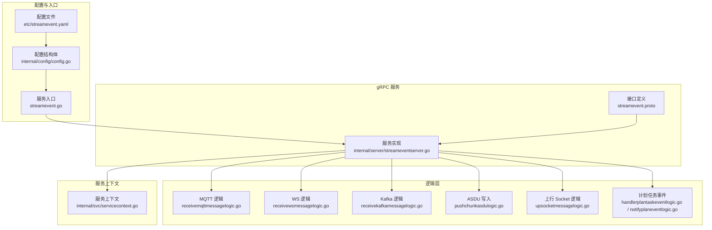
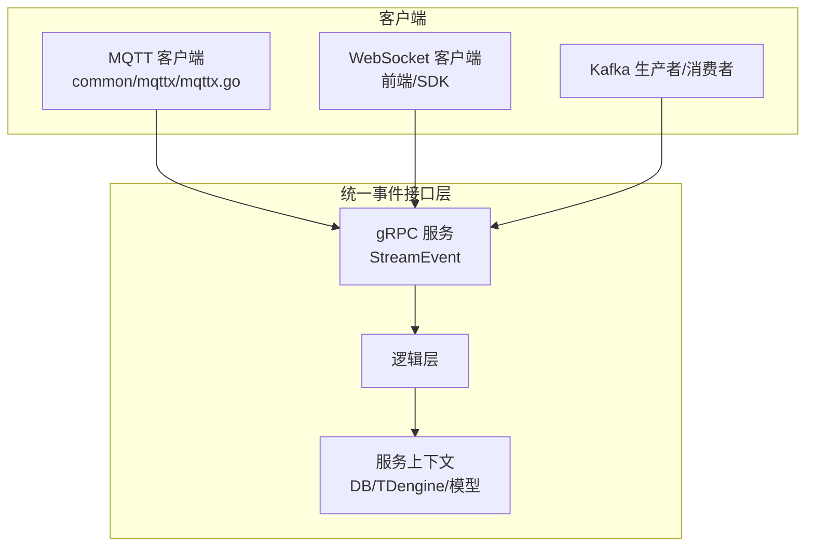
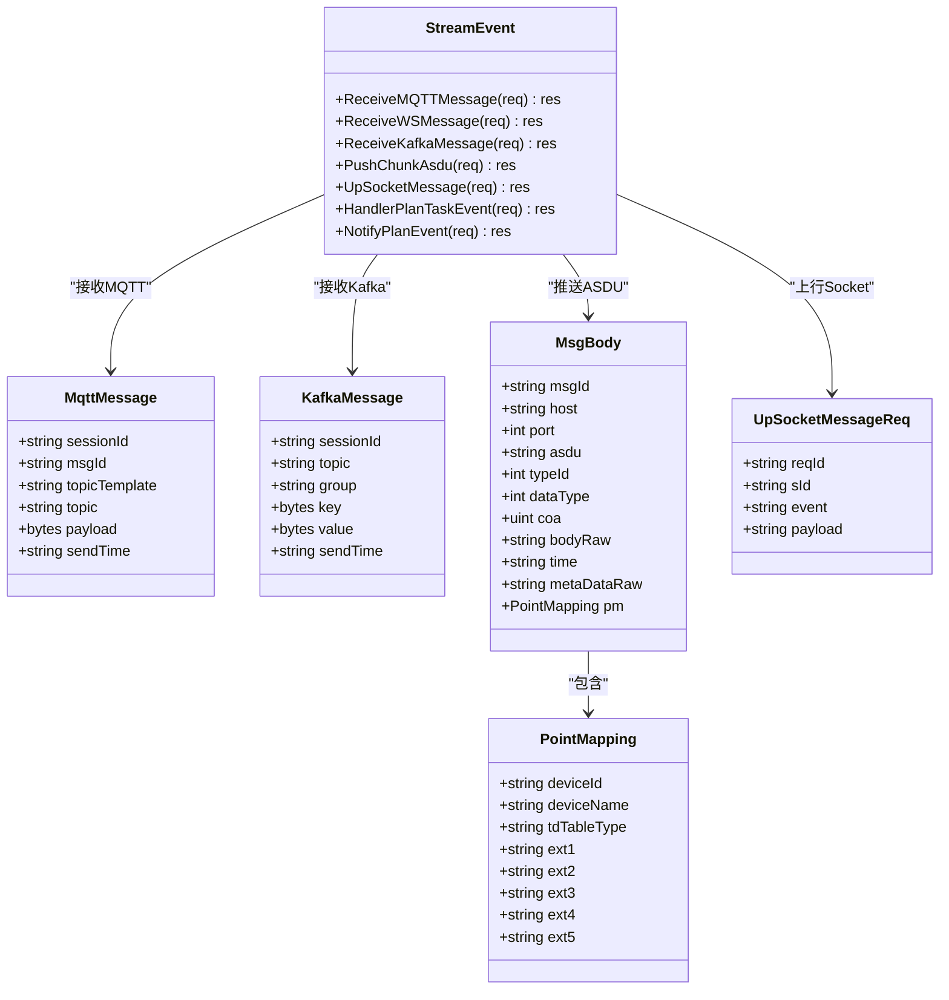
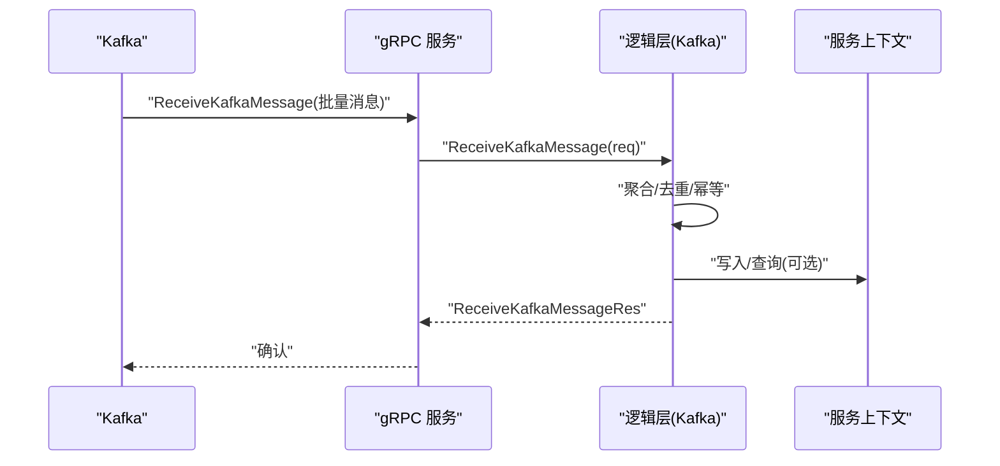
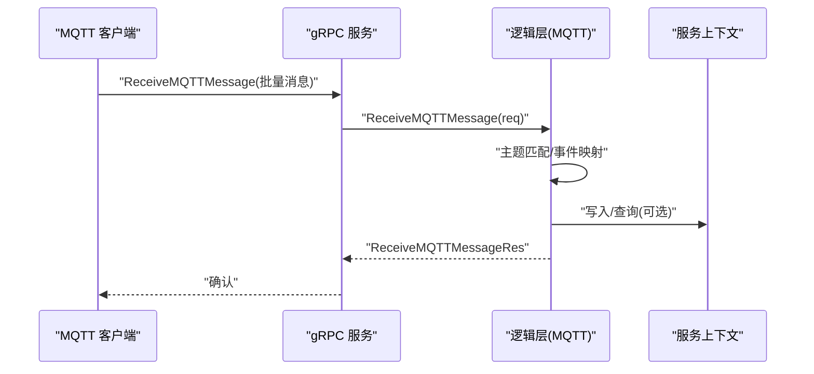
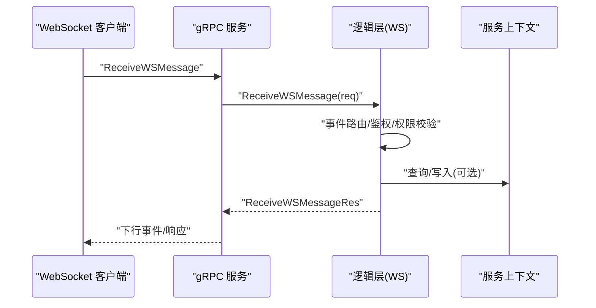
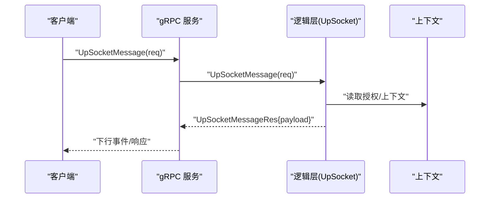
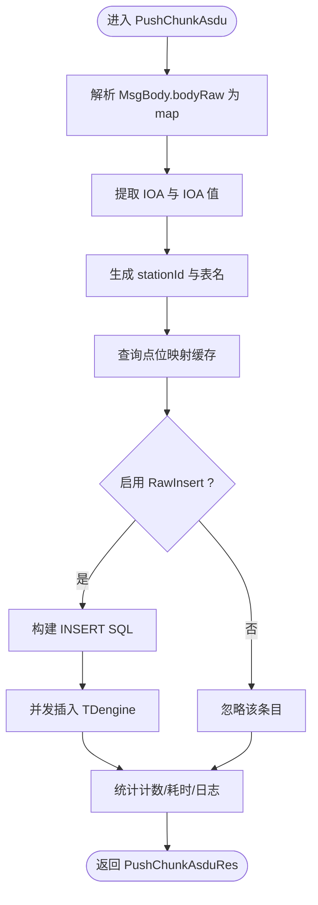
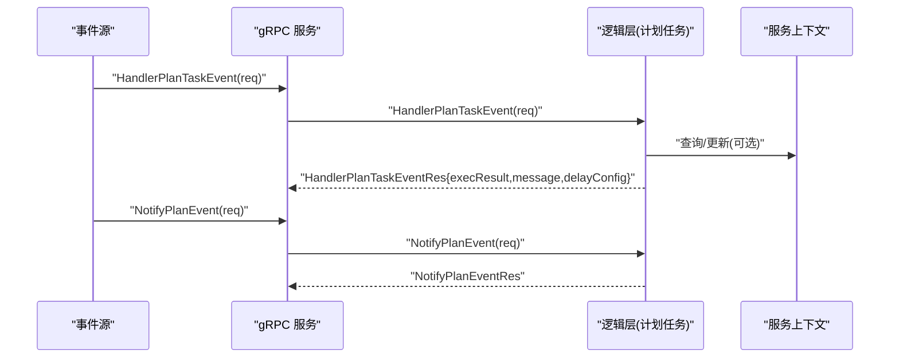
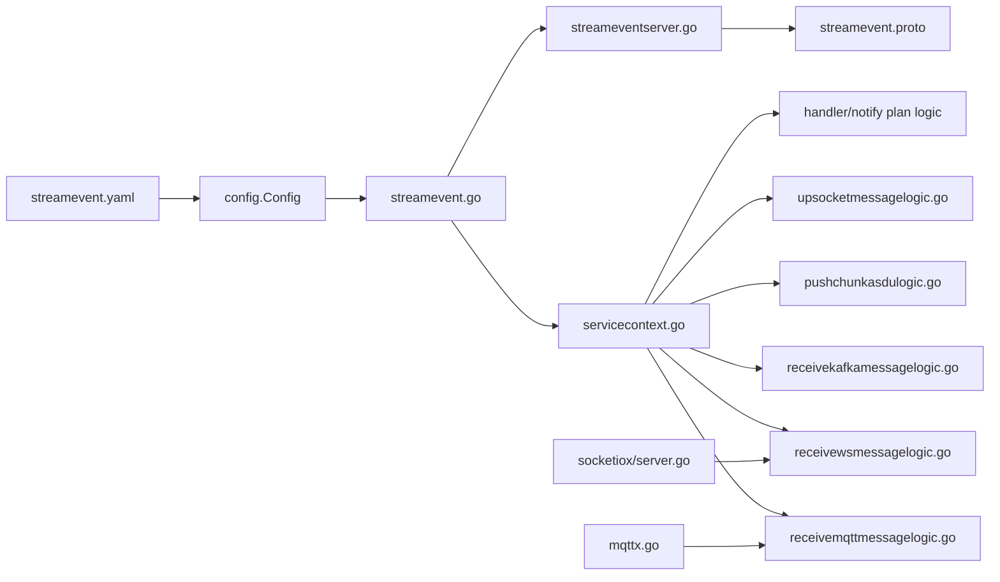

# 统一事件接口层

<cite>
**本文引用的文件**
- [facade/streamevent/streamevent.proto](file://facade/streamevent/streamevent.proto)
- [facade/streamevent/etc/streamevent.yaml](file://facade/streamevent/etc/streamevent.yaml)
- [facade/streamevent/internal/config/config.go](file://facade/streamevent/internal/config/config.go)
- [facade/streamevent/internal/server/streameventserver.go](file://facade/streamevent/internal/server/streameventserver.go)
- [facade/streamevent/internal/logic/receivekafkamessagelogic.go](file://facade/streamevent/internal/logic/receivekafkamessagelogic.go)
- [facade/streamevent/internal/logic/receivemqttmessagelogic.go](file://facade/streamevent/internal/logic/receivemqttmessagelogic.go)
- [facade/streamevent/internal/logic/receivewsmessagelogic.go](file://facade/streamevent/internal/logic/receivewsmessagelogic.go)
- [facade/streamevent/internal/logic/pushchunkasdulogic.go](file://facade/streamevent/internal/logic/pushchunkasdulogic.go)
- [facade/streamevent/internal/logic/upsocketmessagelogic.go](file://facade/streamevent/internal/logic/upsocketmessagelogic.go)
- [facade/streamevent/internal/logic/handlerplantaskeventlogic.go](file://facade/streamevent/internal/logic/handlerplantaskeventlogic.go)
- [facade/streamevent/internal/logic/notifyplaneventlogic.go](file://facade/streamevent/internal/logic/notifyplaneventlogic.go)
- [facade/streamevent/internal/svc/servicecontext.go](file://facade/streamevent/internal/svc/servicecontext.go)
- [facade/streamevent/streamevent.go](file://facade/streamevent/streamevent.go)
- [common/mqttx/mqttx.go](file://common/mqttx/mqttx.go)
- [common/socketiox/server.go](file://common/socketiox/server.go)
- [swagger/streamevent.swagger.json](file://swagger/streamevent.swagger.json)
</cite>

## 目录
1. [引言](#引言)
2. [项目结构](#项目结构)
3. [核心组件](#核心组件)
4. [架构总览](#架构总览)
5. [详细组件分析](#详细组件分析)
6. [依赖关系分析](#依赖关系分析)
7. [性能考量](#性能考量)
8. [故障排查指南](#故障排查指南)
9. [结论](#结论)
10. [附录](#附录)

## 引言
本文件面向统一事件接口层（streamevent）的技术文档，系统阐述其跨语言支持架构、协议转换机制与事件处理流程。重点覆盖以下方面：
- Kafka 消息接收与聚合
- MQTT 消息处理与主题映射
- WebSocket 连接管理与事件路由
- HTTP 请求转发能力（通过 gRPC/HTTP 网关）
- 事件协议标准化、消息格式转换与数据序列化
- 多协议适配器设计、协议扩展与兼容性策略
- 事件路由、负载均衡与故障转移
- 完整 API 接口文档、协议规范与集成示例
- 跨语言通信、协议转换、事件驱动架构与微服务集成最佳实践

## 项目结构
streamevent 采用 go-zero 微服务框架，基于 protobuf 定义 gRPC 接口，提供统一事件入口，内部通过逻辑层与服务上下文对接数据库与外部系统。

**图表来源**
- [facade/streamevent/etc/streamevent.yaml:1-28](file://facade/streamevent/etc/streamevent.yaml#L1-L28)
- [facade/streamevent/internal/config/config.go:1-25](file://facade/streamevent/internal/config/config.go#L1-L25)
- [facade/streamevent/streamevent.go:28-71](file://facade/streamevent/streamevent.go#L28-L71)
- [facade/streamevent/streamevent.proto:10-25](file://facade/streamevent/streamevent.proto#L10-L25)
- [facade/streamevent/internal/server/streameventserver.go:15-67](file://facade/streamevent/internal/server/streameventserver.go#L15-L67)
- [facade/streamevent/internal/svc/servicecontext.go:14-32](file://facade/streamevent/internal/svc/servicecontext.go#L14-L32)

**章节来源**
- [facade/streamevent/etc/streamevent.yaml:1-28](file://facade/streamevent/etc/streamevent.yaml#L1-L28)
- [facade/streamevent/internal/config/config.go:1-25](file://facade/streamevent/internal/config/config.go#L1-L25)
- [facade/streamevent/streamevent.go:28-71](file://facade/streamevent/streamevent.go#L28-L71)
- [facade/streamevent/internal/server/streameventserver.go:15-67](file://facade/streamevent/internal/server/streameventserver.go#L15-L67)

## 核心组件
- gRPC 接口层：定义统一事件 API，包括接收 MQTT/WS/Kafka 消息、推送 ASDU、上行 Socket、计划任务事件处理与通知。
- 逻辑层：各接口的具体实现，负责消息解析、格式转换、路由与持久化。
- 服务上下文：封装配置、数据库连接与模型实例，供逻辑层复用。
- 外部适配：MQTT 客户端库、Socket.IO 服务器库，分别承担消息接入与连接管理。

**章节来源**
- [facade/streamevent/streamevent.proto:10-25](file://facade/streamevent/streamevent.proto#L10-L25)
- [facade/streamevent/internal/server/streameventserver.go:26-66](file://facade/streamevent/internal/server/streameventserver.go#L26-L66)
- [facade/streamevent/internal/svc/servicecontext.go:14-32](file://facade/streamevent/internal/svc/servicecontext.go#L14-L32)

## 架构总览
统一事件接口层通过 gRPC 提供跨语言访问，内部以逻辑层解耦协议差异，结合服务上下文完成数据存储与查询。MQTT/WS/Kafka 的接入由各自适配器完成，最终统一进入逻辑层进行协议标准化与事件处理。

**图表来源**
- [common/mqttx/mqttx.go:76-87](file://common/mqttx/mqttx.go#L76-L87)
- [common/socketiox/server.go:299-312](file://common/socketiox/server.go#L299-L312)
- [facade/streamevent/streamevent.proto:10-25](file://facade/streamevent/streamevent.proto#L10-L25)
- [facade/streamevent/internal/server/streameventserver.go:26-66](file://facade/streamevent/internal/server/streameventserver.go#L26-L66)
- [facade/streamevent/internal/svc/servicecontext.go:14-32](file://facade/streamevent/internal/svc/servicecontext.go#L14-L32)

## 详细组件分析

### gRPC 接口与协议规范
- 接口清单
  - 接收 MQTT 消息：ReceiveMQTTMessage
  - 接收 WS 消息：ReceiveWSMessage
  - 接收 Kafka 消息：ReceiveKafkaMessage
  - 推送 ASDU（IEC 60870-5-104）：PushChunkAsdu
  - 上行 Socket 标准消息：UpSocketMessage
  - 计划任务事件处理：HandlerPlanTaskEvent
  - 通知计划任务事件：NotifyPlanEvent
- 数据模型要点
  - MQTT 消息体包含会话 ID、消息 ID、主题模板、主题、载荷与发送时间。
  - WS 消息体包含会话 ID、消息 ID、载荷与发送时间。
  - Kafka 消息体包含会话 ID、主题、消费组、键、值与发送时间。
  - ASDU 消息体包含消息 ID、设备地址、端口、ASDU 类型、类型标识、数据类型、公共地址、原始消息体、时间戳与元数据；并提供多种 ASDU 类型的消息体结构。
  - 上行 Socket 消息体包含请求 ID、会话 ID、事件名与 JSON 载荷。
  - 计划任务事件包含计划基本信息、批次与执行信息、延迟配置等。

**图表来源**
- [facade/streamevent/streamevent.proto:10-133](file://facade/streamevent/streamevent.proto#L10-L133)
- [facade/streamevent/streamevent.proto:450-459](file://facade/streamevent/streamevent.proto#L450-L459)

**章节来源**
- [facade/streamevent/streamevent.proto:10-133](file://facade/streamevent/streamevent.proto#L10-L133)
- [facade/streamevent/streamevent.proto:450-459](file://facade/streamevent/streamevent.proto#L450-L459)

### Kafka 消息接收与处理
- 输入：批量 Kafka 消息（会话 ID、主题、消费组、键、值、发送时间）。
- 处理：逻辑层预留实现，建议按主题/键聚合、去重与幂等处理，再进入统一事件处理流程。
- 输出：空响应，表示接收确认。

**图表来源**
- [facade/streamevent/streamevent.proto:65-80](file://facade/streamevent/streamevent.proto#L65-L80)
- [facade/streamevent/internal/server/streameventserver.go:38-42](file://facade/streamevent/internal/server/streameventserver.go#L38-L42)
- [facade/streamevent/internal/logic/receivekafkamessagelogic.go:26-31](file://facade/streamevent/internal/logic/receivekafkamessagelogic.go#L26-L31)

**章节来源**
- [facade/streamevent/internal/logic/receivekafkamessagelogic.go:26-31](file://facade/streamevent/internal/logic/receivekafkamessagelogic.go#L26-L31)

### MQTT 消息处理与协议转换
- 输入：批量 MQTT 消息（会话 ID、消息 ID、主题模板、主题、载荷、发送时间）。
- 处理：逻辑层预留实现，建议结合主题模板与事件映射，将 MQTT 载荷转换为统一事件模型。
- 输出：空响应，表示接收确认。

**图表来源**
- [facade/streamevent/streamevent.proto:27-48](file://facade/streamevent/streamevent.proto#L27-L48)
- [facade/streamevent/internal/server/streameventserver.go:26-30](file://facade/streamevent/internal/server/streameventserver.go#L26-L30)
- [facade/streamevent/internal/logic/receivemqttmessagelogic.go:26-31](file://facade/streamevent/internal/logic/receivemqttmessagelogic.go#L26-L31)
- [common/mqttx/mqttx.go:45-64](file://common/mqttx/mqttx.go#L45-L64)

**章节来源**
- [facade/streamevent/internal/logic/receivemqttmessagelogic.go:26-31](file://facade/streamevent/internal/logic/receivemqttmessagelogic.go#L26-L31)
- [common/mqttx/mqttx.go:45-64](file://common/mqttx/mqttx.go#L45-L64)

### WebSocket 连接管理与事件路由
- 输入：WS 消息（会话 ID、消息 ID、载荷、发送时间）。
- 处理：逻辑层预留实现，建议结合上行 Socket 标准消息（reqId、sId、event、payload），进行事件路由与回包。
- 输出：统一响应（payload 或空）。

**图表来源**
- [facade/streamevent/streamevent.proto:51-63](file://facade/streamevent/streamevent.proto#L51-L63)
- [facade/streamevent/internal/server/streameventserver.go:32-36](file://facade/streamevent/internal/server/streameventserver.go#L32-L36)
- [facade/streamevent/internal/logic/receivewsmessagelogic.go:26-31](file://facade/streamevent/internal/logic/receivewsmessagelogic.go#L26-L31)
- [common/socketiox/server.go:299-312](file://common/socketiox/server.go#L299-L312)

**章节来源**
- [facade/streamevent/internal/logic/receivewsmessagelogic.go:26-31](file://facade/streamevent/internal/logic/receivewsmessagelogic.go#L26-L31)
- [common/socketiox/server.go:337-391](file://common/socketiox/server.go#L337-L391)

### 上行 Socket 标准消息与回包
- 输入：上行 Socket 消息（reqId、sId、event、payload）。
- 处理：示例逻辑中读取授权信息，构造测试响应载荷并返回。
- 输出：统一响应（payload）。

**图表来源**
- [facade/streamevent/streamevent.proto:450-459](file://facade/streamevent/streamevent.proto#L450-L459)
- [facade/streamevent/internal/server/streameventserver.go:50-54](file://facade/streamevent/internal/server/streameventserver.go#L50-L54)
- [facade/streamevent/internal/logic/upsocketmessagelogic.go:28-55](file://facade/streamevent/internal/logic/upsocketmessagelogic.go#L28-L55)

**章节来源**
- [facade/streamevent/internal/logic/upsocketmessagelogic.go:28-55](file://facade/streamevent/internal/logic/upsocketmessagelogic.go#L28-L55)

### ASDU（IEC 60870-5-104）写入与数据序列化
- 输入：ASDU 批量消息（事务 ID、消息体数组）。
- 处理：解析消息体原始 JSON，提取 IOA 值，生成设备表名，查询点位映射，按启用标志写入 TDengine。
- 输出：空响应，记录统计与耗时。

**图表来源**
- [facade/streamevent/streamevent.proto:83-114](file://facade/streamevent/streamevent.proto#L83-L114)
- [facade/streamevent/internal/logic/pushchunkasdulogic.go:118-222](file://facade/streamevent/internal/logic/pushchunkasdulogic.go#L118-L222)
- [facade/streamevent/internal/svc/servicecontext.go:14-32](file://facade/streamevent/internal/svc/servicecontext.go#L14-L32)

**章节来源**
- [facade/streamevent/internal/logic/pushchunkasdulogic.go:118-222](file://facade/streamevent/internal/logic/pushchunkasdulogic.go#L118-L222)

### 计划任务事件处理与通知
- HandlerPlanTaskEvent：处理计划任务事件，返回执行结果、消息与延迟配置。
- NotifyPlanEvent：通知计划任务事件（批次完成/计划完成）。

**图表来源**
- [facade/streamevent/streamevent.proto:501-550](file://facade/streamevent/streamevent.proto#L501-L550)
- [facade/streamevent/streamevent.proto:560-581](file://facade/streamevent/streamevent.proto#L560-L581)
- [facade/streamevent/internal/server/streameventserver.go:56-66](file://facade/streamevent/internal/server/streameventserver.go#L56-L66)
- [facade/streamevent/internal/logic/handlerplantaskeventlogic.go:28-38](file://facade/streamevent/internal/logic/handlerplantaskeventlogic.go#L28-L38)
- [facade/streamevent/internal/logic/notifyplaneventlogic.go:26-31](file://facade/streamevent/internal/logic/notifyplaneventlogic.go#L26-L31)

**章节来源**
- [facade/streamevent/internal/logic/handlerplantaskeventlogic.go:28-38](file://facade/streamevent/internal/logic/handlerplantaskeventlogic.go#L28-L38)
- [facade/streamevent/internal/logic/notifyplaneventlogic.go:26-31](file://facade/streamevent/internal/logic/notifyplaneventlogic.go#L26-L31)

## 依赖关系分析
- 配置与入口
  - 配置文件提供监听地址、日志、Nacos 注册、TaosDB 与 SQLite 数据源。
  - 服务入口加载配置、初始化服务上下文、注册 gRPC 服务、可选开启反射。
- 服务上下文
  - 初始化 TDengine 连接与设备点位映射模型，供逻辑层使用。
- 逻辑层
  - 各接口逻辑通过服务上下文访问数据库与外部系统。
- 外部适配
  - MQTT 客户端提供订阅、发布、追踪与默认处理器。
  - Socket.IO 服务器提供连接、鉴权、房间管理、广播与统计。

**图表来源**
- [facade/streamevent/etc/streamevent.yaml:1-28](file://facade/streamevent/etc/streamevent.yaml#L1-L28)
- [facade/streamevent/internal/config/config.go:5-24](file://facade/streamevent/internal/config/config.go#L5-L24)
- [facade/streamevent/streamevent.go:37-71](file://facade/streamevent/streamevent.go#L37-L71)
- [facade/streamevent/internal/svc/servicecontext.go:21-32](file://facade/streamevent/internal/svc/servicecontext.go#L21-L32)
- [facade/streamevent/internal/server/streameventserver.go:15-24](file://facade/streamevent/internal/server/streameventserver.go#L15-L24)
- [facade/streamevent/streamevent.proto:10-25](file://facade/streamevent/streamevent.proto#L10-L25)
- [common/mqttx/mqttx.go:76-87](file://common/mqttx/mqttx.go#L76-L87)
- [common/socketiox/server.go:299-312](file://common/socketiox/server.go#L299-L312)

**章节来源**
- [facade/streamevent/etc/streamevent.yaml:1-28](file://facade/streamevent/etc/streamevent.yaml#L1-L28)
- [facade/streamevent/internal/config/config.go:5-24](file://facade/streamevent/internal/config/config.go#L5-L24)
- [facade/streamevent/streamevent.go:37-71](file://facade/streamevent/streamevent.go#L37-L71)
- [facade/streamevent/internal/svc/servicecontext.go:21-32](file://facade/streamevent/internal/svc/servicecontext.go#L21-L32)

## 性能考量
- 并发与批处理
  - ASDU 写入采用 MapReduce 并发执行，提升吞吐。
  - MQTT/WS 事件处理采用 goroutine 安全封装，避免阻塞。
- 数据库与序列化
  - 使用 TDengine 时，按设备与 IOA 动态生成子表，提高写入效率。
  - JSON 解析与序列化使用高性能库，减少 GC 压力。
- 日志与指标
  - 统一日志字段与耗时统计，便于性能分析与问题定位。
  - MQTT 客户端内置指标收集，便于观测连接与订阅状态。

**章节来源**
- [facade/streamevent/internal/logic/pushchunkasdulogic.go:127-212](file://facade/streamevent/internal/logic/pushchunkasdulogic.go#L127-L212)
- [common/mqttx/mqttx.go:257-307](file://common/mqttx/mqttx.go#L257-L307)

## 故障排查指南
- 连接与注册
  - 若 Nacos 注册失败，检查配置中的主机、端口、用户名、密码与命名空间。
  - gRPC 反射仅在开发/测试模式开启，生产环境请关闭。
- 数据库连接
  - TDengine 连接未初始化会导致写入失败，检查数据源与 DB 名称。
  - SQLite 数据源配置错误会导致模型初始化失败。
- MQTT 事件处理
  - 无处理器时触发默认处理器，检查主题是否正确订阅与映射。
  - 载荷为空或解析失败时，查看日志并确认上游消息格式。
- WebSocket 事件处理
  - 缺少必要字段（reqId/payload/room/event）时返回参数错误。
  - 房间加入/离开钩子异常时，查看连接钩子与预加入钩子的日志。
- 计划任务事件
  - HandlerPlanTaskEvent 返回延迟配置时，确保下次触发时间合理设置。

**章节来源**
- [facade/streamevent/etc/streamevent.yaml:14-27](file://facade/streamevent/etc/streamevent.yaml#L14-L27)
- [facade/streamevent/streamevent.go:46-64](file://facade/streamevent/streamevent.go#L46-L64)
- [facade/streamevent/internal/svc/servicecontext.go:29-30](file://facade/streamevent/internal/svc/servicecontext.go#L29-L30)
- [common/mqttx/mqttx.go:353-359](file://common/mqttx/mqttx.go#L353-L359)
- [common/socketiox/server.go:392-435](file://common/socketiox/server.go#L392-L435)
- [common/socketiox/server.go:469-531](file://common/socketiox/server.go#L469-L531)
- [facade/streamevent/internal/logic/handlerplantaskeventlogic.go:28-38](file://facade/streamevent/internal/logic/handlerplantaskeventlogic.go#L28-L38)

## 结论
统一事件接口层通过标准化的 gRPC 接口与协议转换机制，实现了对 Kafka、MQTT、WebSocket 的统一接入，并以逻辑层与服务上下文解耦具体协议细节。配合 TDengine 的高效写入与完善的日志/指标体系，满足高并发、低延迟的事件驱动场景需求。后续可在现有基础上扩展更多协议适配器与路由规则，持续增强兼容性与可扩展性。

## 附录

### API 接口文档（概要）
- 接口：ReceiveMQTTMessage
  - 请求：ReceiveMQTTMessageReq（批量 MqttMessage）
  - 响应：ReceiveMQTTMessageRes
  - 用途：接收 MQTT 消息
- 接口：ReceiveWSMessage
  - 请求：ReceiveWSMessageReq（会话 ID、消息 ID、载荷、发送时间）
  - 响应：ReceiveWSMessageRes
  - 用途：接收 WebSocket 消息
- 接口：ReceiveKafkaMessage
  - 请求：ReceiveKafkaMessageReq（批量 KafkaMessage）
  - 响应：ReceiveKafkaMessageRes
  - 用途：接收 Kafka 消息
- 接口：PushChunkAsdu
  - 请求：PushChunkAsduReq（事务 ID、消息体数组）
  - 响应：PushChunkAsduRes
  - 用途：写入 IEC 60870-5-104 ASDU
- 接口：UpSocketMessage
  - 请求：UpSocketMessageReq（reqId、sId、event、payload）
  - 响应：UpSocketMessageRes
  - 用途：上行 Socket 标准消息
- 接口：HandlerPlanTaskEvent
  - 请求：HandlerPlanTaskEventReq（计划任务相关信息）
  - 响应：HandlerPlanTaskEventRes（执行结果、消息、延迟配置）
  - 用途：处理计划任务事件
- 接口：NotifyPlanEvent
  - 请求：NotifyPlanEventReq（事件类型、关联计划/批次 ID、属性）
  - 响应：NotifyPlanEventRes
  - 用途：通知计划任务事件

**章节来源**
- [facade/streamevent/streamevent.proto:10-25](file://facade/streamevent/streamevent.proto#L10-L25)
- [swagger/streamevent.swagger.json:1-50](file://swagger/streamevent.swagger.json#L1-L50)

### 协议规范与数据模型
- MQTT 消息体字段：sessionId、msgId、topicTemplate、topic、payload、sendTime
- Kafka 消息体字段：sessionId、topic、group、key、value、sendTime
- ASDU 消息体字段：msgId、host、port、asdu、typeId、dataType、coa、bodyRaw、time、metaDataRaw、pm
- 上行 Socket 消息体字段：reqId、sId、event、payload
- 计划任务事件字段：计划基本信息、批次与执行信息、延迟配置

**章节来源**
- [facade/streamevent/streamevent.proto:27-48](file://facade/streamevent/streamevent.proto#L27-L48)
- [facade/streamevent/streamevent.proto:65-80](file://facade/streamevent/streamevent.proto#L65-L80)
- [facade/streamevent/streamevent.proto:83-114](file://facade/streamevent/streamevent.proto#L83-L114)
- [facade/streamevent/streamevent.proto:450-459](file://facade/streamevent/streamevent.proto#L450-L459)
- [facade/streamevent/streamevent.proto:501-550](file://facade/streamevent/streamevent.proto#L501-L550)
- [facade/streamevent/streamevent.proto:560-581](file://facade/streamevent/streamevent.proto#L560-L581)

### 集成示例（步骤指引）
- 配置
  - 修改 etc/streamevent.yaml 中监听地址、日志路径、Nacos 注册与数据库连接。
- 启动
  - 运行入口程序，加载配置并启动 gRPC 服务。
- MQTT 接入
  - 使用 MQTT 客户端订阅主题，消息到达后通过 gRPC 接口上报。
- WebSocket 接入
  - 前端/客户端通过 Socket.IO 连接，发送上行事件，服务端按标准消息格式回包。
- Kafka 接入
  - 生产者发送消息到指定主题，服务端通过 gRPC 接口接收并处理。
- IEC 60870-5-104 写入
  - 按 MsgBody 格式组织 ASDU 消息，调用 PushChunkAsdu 接口写入 TDengine。

**章节来源**
- [facade/streamevent/etc/streamevent.yaml:1-28](file://facade/streamevent/etc/streamevent.yaml#L1-L28)
- [facade/streamevent/streamevent.go:28-71](file://facade/streamevent/streamevent.go#L28-L71)
- [common/mqttx/mqttx.go:180-255](file://common/mqttx/mqttx.go#L180-L255)
- [common/socketiox/server.go:337-391](file://common/socketiox/server.go#L337-L391)
- [facade/streamevent/internal/logic/pushchunkasdulogic.go:118-222](file://facade/streamevent/internal/logic/pushchunkasdulogic.go#L118-L222)