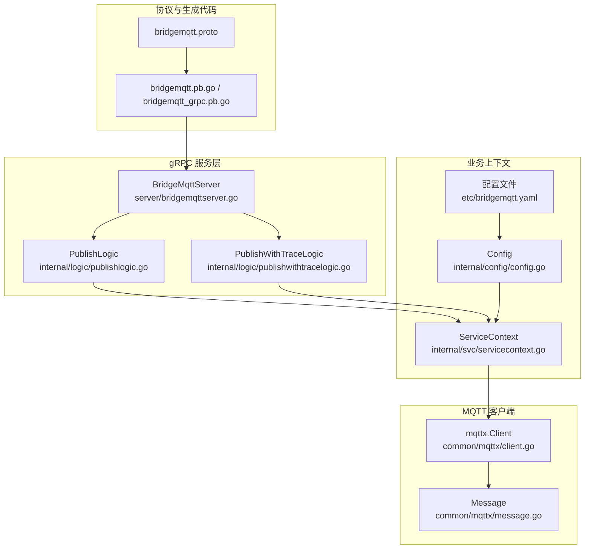
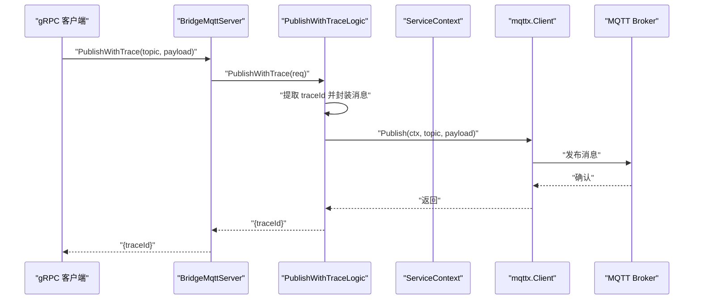
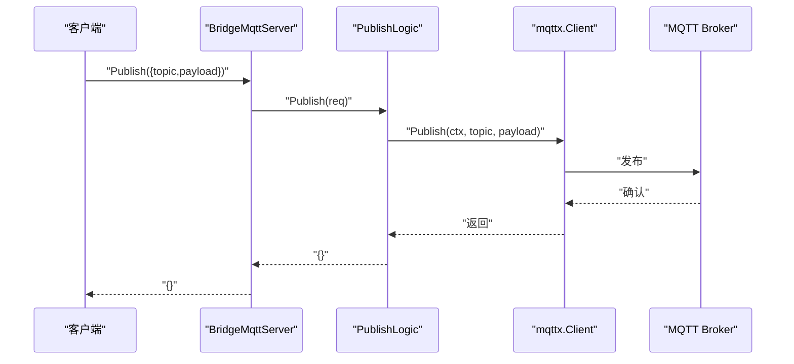
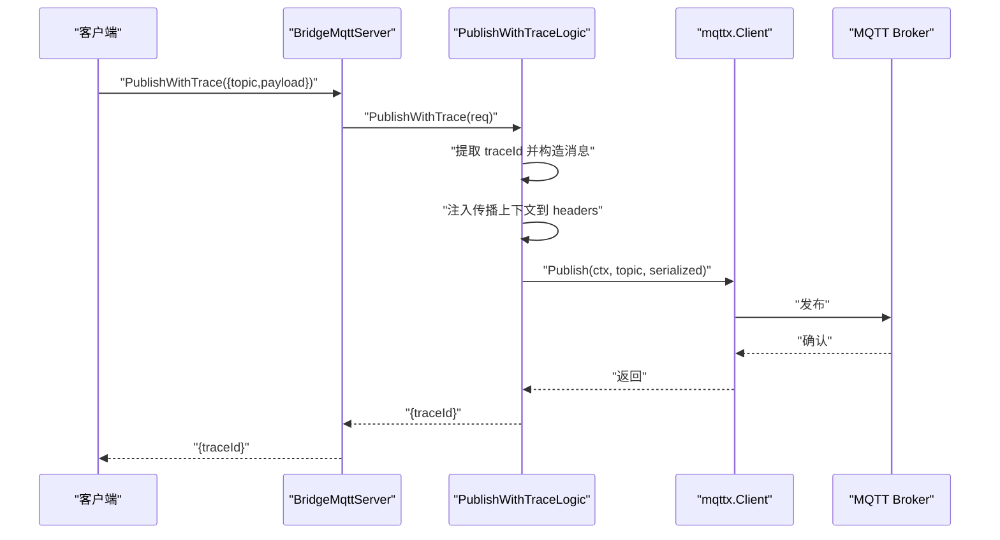

# MQTT API 接口参考

<cite>
**本文引用的文件**
- [bridgemqtt.proto](file://app/bridgemqtt/bridgemqtt.proto)
- [bridgemqtt_grpc.pb.go](file://app/bridgemqtt/bridgemqtt/bridgemqtt_grpc.pb.go)
- [bridgemqtt.pb.go](file://app/bridgemqtt/bridgemqtt/bridgemqtt.pb.go)
- [bridgemqttserver.go](file://app/bridgemqtt/internal/server/bridgemqttserver.go)
- [publishlogic.go](file://app/bridgemqtt/internal/logic/publishlogic.go)
- [publishwithtracelogic.go](file://app/bridgemqtt/internal/logic/publishwithtracelogic.go)
- [servicecontext.go](file://app/bridgemqtt/internal/svc/servicecontext.go)
- [config.go](file://app/bridgemqtt/internal/config/config.go)
- [bridgemqtt.yaml](file://app/bridgemqtt/etc/bridgemqtt.yaml)
- [client.go](file://common/mqttx/client.go)
- [message.go](file://common/mqttx/message.go)
- [mqttstream.swagger.json](file://swagger/mqttstream.swagger.json)
</cite>

## 更新摘要
**所做更改**
- 删除了 Ping 接口相关文档内容，因为服务协议已简化，不再包含 Ping 方法
- 更新了服务接口列表，仅保留 Publish 和 PublishWithTrace 两个核心方法
- 更新了架构图和序列图，移除了 Ping 接口相关的流程
- 更新了配置选项说明，反映了服务协议的简化
- 更新了客户端库使用说明，移除了 Ping 相关的配置项

## 目录
1. [简介](#简介)
2. [项目结构](#项目结构)
3. [核心组件](#核心组件)
4. [架构总览](#架构总览)
5. [详细组件分析](#详细组件分析)
6. [依赖分析](#依赖分析)
7. [性能考量](#性能考量)
8. [故障排除指南](#故障排除指南)
9. [结论](#结论)
10. [附录](#附录)

## 简介
本文件为 MQTT API 接口参考，聚焦于基于 gRPC 的 MQTT 桥接服务，覆盖以下能力：
- 核心接口：Publish、PublishWithTrace
- 请求参数与响应格式
- 错误码与异常处理
- 认证与安全策略
- 超时、重试与并发限制
- 接口调用示例、SDK 使用建议与最佳实践
- 版本管理、兼容性与迁移指南
- 性能指标、监控方法与故障排除

**更新** 服务协议已简化，移除了 Ping 接口，目前仅提供消息发布功能。

## 项目结构
该服务位于 app/bridgemqtt，采用 goctl 生成的 gRPC 代码骨架，结合 common/mqttx 提供的 MQTT 客户端能力，完成对上游 MQTT Broker 的发布与订阅。

**图表来源**
- [bridgemqttserver.go:15-37](file://app/bridgemqtt/internal/server/bridgemqttserver.go#L15-L37)
- [publishlogic.go:26-34](file://app/bridgemqtt/internal/logic/publishlogic.go#L26-L34)
- [publishwithtracelogic.go:30-48](file://app/bridgemqtt/internal/logic/publishwithtracelogic.go#L30-L48)
- [servicecontext.go:16-61](file://app/bridgemqtt/internal/svc/servicecontext.go#L16-L61)
- [config.go:9-24](file://app/bridgemqtt/internal/config/config.go#L9-L24)
- [bridgemqtt.yaml:1-48](file://app/bridgemqtt/etc/bridgemqtt.yaml#L1-L48)
- [client.go:76-354](file://common/mqttx/client.go#L76-L354)
- [message.go:3-38](file://common/mqttx/message.go#L3-L38)
- [bridgemqtt.proto:10-16](file://app/bridgemqtt/bridgemqtt.proto#L10-L16)

**章节来源**
- [bridgemqttserver.go:15-37](file://app/bridgemqtt/internal/server/bridgemqttserver.go#L15-L37)
- [servicecontext.go:16-61](file://app/bridgemqtt/internal/svc/servicecontext.go#L16-L61)
- [bridgemqtt.yaml:1-48](file://app/bridgemqtt/etc/bridgemqtt.yaml#L1-L48)

## 核心组件
- gRPC 服务定义与生成代码：服务名为 BridgeMqtt，包含 Publish、PublishWithTrace 两个 RPC 方法。
- 服务端实现：BridgeMqttServer 将 RPC 调用路由至对应 Logic 层。
- Logic 层：
  - PublishLogic：直接发布消息至指定 topic。
  - PublishWithTraceLogic：注入链路追踪头并发布消息，返回 traceId。
- 上下文与配置：ServiceContext 负责初始化日志、MQTT 客户端、下游服务客户端；Config/MqttConfig 控制 MQTT 客户端行为。
- MQTT 客户端：mqttx.Client 提供连接、订阅、发布、追踪埋点与指标统计。

**更新** 移除了 Ping 接口相关组件，服务结构更加简洁。

**章节来源**
- [bridgemqtt.proto:10-16](file://app/bridgemqtt/bridgemqtt.proto#L10-L16)
- [bridgemqtt_grpc.pb.go:40-76](file://app/bridgemqtt/bridgemqtt/bridgemqtt_grpc.pb.go#L40-L76)
- [bridgemqttserver.go:26-37](file://app/bridgemqtt/internal/server/bridgemqttserver.go#L26-L37)
- [publishlogic.go:26-34](file://app/bridgemqtt/internal/logic/publishlogic.go#L26-L34)
- [publishwithtracelogic.go:30-48](file://app/bridgemqtt/internal/logic/publishwithtracelogic.go#L30-L48)
- [servicecontext.go:16-61](file://app/bridgemqtt/internal/svc/servicecontext.go#L16-L61)
- [config.go:9-24](file://app/bridgemqtt/internal/config/config.go#L9-L24)
- [client.go:51-64](file://common/mqttx/client.go#L51-L64)

## 架构总览
MQTT API 通过 gRPC 对外暴露，内部以 mqttx.Client 连接外部 MQTT Broker。PublishWithTrace 会将 OpenTelemetry 上下文注入消息载荷，便于跨服务链路追踪。

**图表来源**
- [bridgemqttserver.go:32-37](file://app/bridgemqtt/internal/server/bridgemqttserver.go#L32-L37)
- [publishwithtracelogic.go:30-48](file://app/bridgemqtt/internal/logic/publishwithtracelogic.go#L30-L48)
- [client.go:326-339](file://common/mqttx/client.go#L326-L339)

## 详细组件分析

### 接口定义与数据模型

- 服务名：BridgeMqtt
- 方法：
  - Publish(PublishReq) -> PublishRes
  - PublishWithTrace(PublishWithTraceReq) -> PublishWithTraceRes

- 请求与响应字段：
  - PublishReq.topic: string；PublishReq.payload: bytes
  - PublishRes: 空
  - PublishWithTraceReq.topic: string；PublishWithTraceReq.payload: bytes
  - PublishWithTraceRes.traceId: string

- 生成代码位置：
  - bridgemqtt_grpc.pb.go：gRPC 客户端与服务桩
  - bridgemqtt.pb.go：消息类型定义与访问器

**更新** 移除了 Ping 接口，服务接口更加简洁。

**章节来源**
- [bridgemqtt.proto:10-34](file://app/bridgemqtt/bridgemqtt.proto#L10-L34)
- [bridgemqtt_grpc.pb.go:40-76](file://app/bridgemqtt/bridgemqtt/bridgemqtt_grpc.pb.go#L40-L76)
- [bridgemqtt.pb.go:68-300](file://app/bridgemqtt/bridgemqtt/bridgemqtt.pb.go#L68-L300)

### Publish 接口
- 功能：向指定 topic 发布消息。
- 请求：PublishReq.topic, PublishReq.payload
- 响应：PublishRes（空）
- 实现路径：BridgeMqttServer -> PublishLogic -> mqttx.Client.Publish

**图表来源**
- [bridgemqttserver.go:26-31](file://app/bridgemqtt/internal/server/bridgemqttserver.go#L26-L31)
- [publishlogic.go:26-34](file://app/bridgemqtt/internal/logic/publishlogic.go#L26-L34)
- [client.go:326-339](file://common/mqttx/client.go#L326-L339)

**章节来源**
- [bridgemqttserver.go:26-31](file://app/bridgemqtt/internal/server/bridgemqttserver.go#L26-L31)
- [publishlogic.go:26-34](file://app/bridgemqtt/internal/logic/publishlogic.go#L26-L34)
- [client.go:326-339](file://common/mqttx/client.go#L326-L339)

### PublishWithTrace 接口
- 功能：发布消息并携带链路追踪信息，返回 traceId。
- 请求：PublishWithTraceReq.topic, PublishWithTraceReq.payload
- 响应：PublishWithTraceRes.traceId
- 实现要点：
  - 从上下文提取 traceId
  - 使用 mqttx.Message 封装 topic/payload/headers
  - 通过 TextMapPropagator 注入传播上下文
  - 序列化为字节后发布
  - 返回原始 traceId

**图表来源**
- [bridgemqttserver.go:32-37](file://app/bridgemqtt/internal/server/bridgemqttserver.go#L32-L37)
- [publishwithtracelogic.go:30-48](file://app/bridgemqtt/internal/logic/publishwithtracelogic.go#L30-L48)
- [message.go:3-38](file://common/mqttx/message.go#L3-L38)
- [client.go:377-388](file://common/mqttx/client.go#L377-L388)

**章节来源**
- [publishwithtracelogic.go:30-48](file://app/bridgemqtt/internal/logic/publishwithtracelogic.go#L30-L48)
- [message.go:3-38](file://common/mqttx/message.go#L3-L38)
- [client.go:377-388](file://common/mqttx/client.go#L377-L388)

### 认证机制、权限控制与安全策略
- MQTT Broker 认证：通过 MqttConfig 中的 Broker、Username、Password 配置连接参数。
- gRPC 认证：当前未见专用鉴权拦截器或令牌校验逻辑，建议在网关或反向代理层统一接入 JWT/OAuth。
- 传输安全：建议启用 TLS/SSL 连接（Broker 支持时），并在配置中提供证书参数。
- 权限控制：可在业务侧通过 topic 命名规范与 ACL 控制，或在上游 Broker 层面实施细粒度授权。

**章节来源**
- [bridgemqtt.yaml:19-25](file://app/bridgemqtt/etc/bridgemqtt.yaml#L19-L25)
- [client.go:51-64](file://common/mqttx/client.go#L51-L64)

### 超时设置、重试机制与并发限制
- gRPC 超时：服务配置中的 Timeout 字段用于 gRPC 调用超时控制。
- MQTT 超时：MqttConfig.Timeout 控制连接与操作超时，默认值由客户端初始化保证。
- KeepAlive：MqttConfig.KeepAlive 控制心跳周期。
- 自动重连：客户端启用自动重连，断线后重建连接并恢复订阅。
- 并发限制：消息处理采用任务运行器（TaskRunner）进行并发控制，避免过载。

**章节来源**
- [bridgemqtt.yaml:3](file://app/bridgemqtt/etc/bridgemqtt.yaml#L3)
- [client.go:58-60](file://common/mqttx/client.go#L58-L60)
- [client.go:144-146](file://common/mqttx/client.go#L144-L146)
- [client.go:161-166](file://common/mqttx/client.go#L161-L166)
- [servicecontext.go:109](file://app/bridgemqtt/internal/svc/servicecontext.go#L109)

### 接口调用示例与 SDK 使用指南
- gRPC 客户端调用：
  - 使用生成的 gRPC 客户端（bridgemqtt_grpc.pb.go）发起 Publish/PublishWithTrace 调用。
  - 注意设置合适的上下文超时与 Metadata（如需要）。
- SDK 建议：
  - 使用 goctl 生成的客户端代码，保持与服务端一致的 proto 定义。
  - 在客户端侧实现指数退避重试策略，结合 gRPC 的 WithRetry 可选方案。
- 最佳实践：
  - 对大负载消息建议拆分或压缩后再发布。
  - 使用 PublishWithTrace 以获得端到端链路追踪。
  - 在生产环境开启 TLS 并严格管理凭据。

**章节来源**
- [bridgemqtt_grpc.pb.go:40-76](file://app/bridgemqtt/bridgemqtt/bridgemqtt_grpc.pb.go#L40-L76)

### 版本管理、向后兼容性与迁移指南
- 版本管理：当前仓库未提供明确的 API 版本号；建议在服务元数据或 Swagger 中标注版本。
- 向后兼容：新增字段建议使用 proto3 可选字段，避免破坏现有客户端。
- 迁移指南：
  - 新增字段时保留旧字段可选，确保老客户端仍可解析。
  - 对于变更较大的接口，建议引入新方法名或独立服务，逐步替换。

**章节来源**
- [mqttstream.swagger.json:1-79](file://swagger/mqttstream.swagger.json#L1-L79)

## 依赖分析
- 服务端依赖：
  - 生成代码：bridgemqtt_grpc.pb.go/bridgemqtt.pb.go
  - 服务实现：BridgeMqttServer
  - 业务逻辑：PublishLogic、PublishWithTraceLogic
  - 上下文：ServiceContext（含日志、MQTT 客户端、下游客户端）
- MQTT 客户端依赖：
  - paho.mqtt.golang
  - OpenTelemetry 文本传播器
  - go-zero 统一日志与指标

**图表来源**
- [bridgemqtt_grpc.pb.go:40-76](file://app/bridgemqtt/bridgemqtt/bridgemqtt_grpc.pb.go#L40-L76)
- [bridgemqttserver.go:26-37](file://app/bridgemqtt/internal/server/bridgemqttserver.go#L26-L37)
- [publishlogic.go:26-34](file://app/bridgemqtt/internal/logic/publishlogic.go#L26-L34)
- [publishwithtracelogic.go:30-48](file://app/bridgemqtt/internal/logic/publishwithtracelogic.go#L30-L48)
- [servicecontext.go:16-61](file://app/bridgemqtt/internal/svc/servicecontext.go#L16-L61)
- [client.go:377-388](file://common/mqttx/client.go#L377-L388)

**章节来源**
- [bridgemqtt_grpc.pb.go:40-76](file://app/bridgemqtt/bridgemqtt/bridgemqtt_grpc.pb.go#L40-L76)
- [servicecontext.go:16-61](file://app/bridgemqtt/internal/svc/servicecontext.go#L16-L61)

## 性能考量
- 指标采集：
  - mqttx.Client 内置指标收集（耗时、错误等），可用于观测发布/订阅性能。
- 超时与重连：
  - 合理设置 MqttConfig.Timeout 与 KeepAlive，避免频繁超时与抖动。
- 并发与背压：
  - 使用任务运行器控制消息处理并发，防止下游拥塞。
- 监控建议：
  - 结合 OpenTelemetry 追踪 Publish/PublishWithTrace 的端到端耗时。
  - 在网关层增加熔断与限流策略。

**章节来源**
- [client.go:124-126](file://common/mqttx/client.go#L124-L126)
- [client.go:326-339](file://common/mqttx/client.go#L326-L339)
- [servicecontext.go:109](file://app/bridgemqtt/internal/svc/servicecontext.go#L109)

## 故障排除指南
- 连接失败：
  - 检查 Broker 地址、用户名密码是否正确；确认网络可达。
  - 查看连接超时与自动重连日志。
- 发布超时：
  - 提升 MqttConfig.Timeout 或降低消息大小；检查 Broker 性能。
- 订阅异常：
  - 确认订阅主题与 ACL 权限；查看恢复订阅日志。
- 追踪缺失：
  - 确保 PublishWithTrace 流程中正确注入传播上下文；检查 headers 内容。

**章节来源**
- [client.go:100-117](file://common/mqttx/client.go#L100-L117)
- [client.go:168-177](file://common/mqttx/client.go#L168-L177)
- [client.go:215-233](file://common/mqttx/client.go#L215-L233)
- [client.go:326-339](file://common/mqttx/client.go#L326-L339)

## 结论
本 MQTT API 通过清晰的 gRPC 接口与成熟的 MQTT 客户端实现，提供了消息发布与链路追踪能力。服务协议已简化，移除了不必要的 Ping 接口，使整体架构更加简洁高效。建议在生产环境中完善认证、TLS、限流与可观测性配置，以满足高可用与可运维需求。

## 附录

### 错误码定义（基于 gRPC 状态）
- 未实现：当服务端尚未实现某方法时返回相应状态。
- 连接失败/超时：客户端连接或操作超时返回错误。
- 订阅失败：订阅主题失败返回错误。
- 发布失败：发布消息失败返回错误。

**章节来源**
- [bridgemqtt_grpc.pb.go:99-107](file://app/bridgemqtt/bridgemqtt/bridgemqtt_grpc.pb.go#L99-L107)
- [client.go:170-175](file://common/mqttx/client.go#L170-L175)
- [client.go:222-228](file://common/mqttx/client.go#L222-L228)
- [client.go:320-331](file://common/mqttx/client.go#L320-L331)