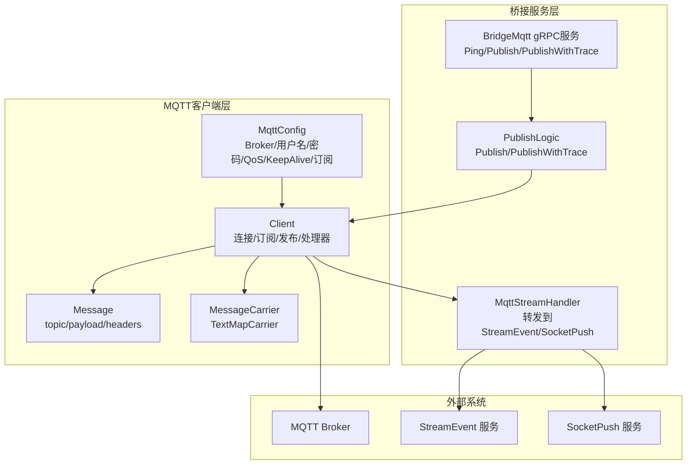
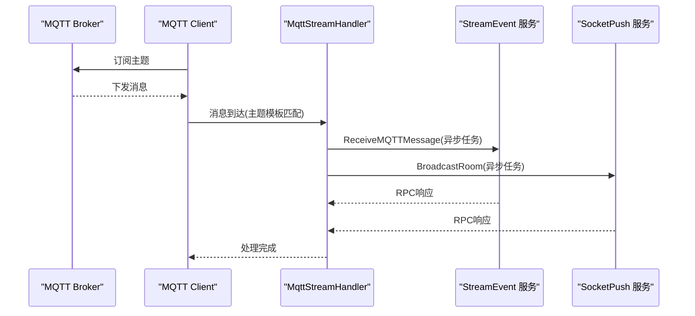
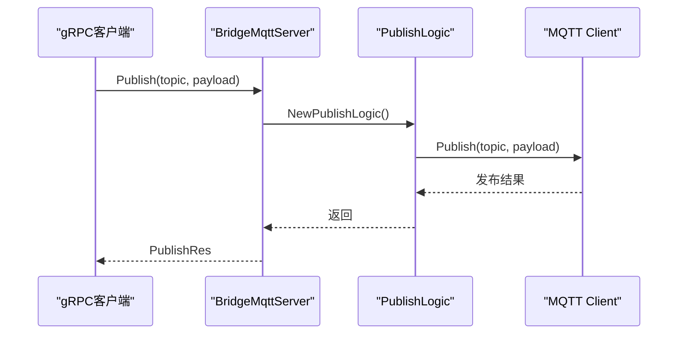
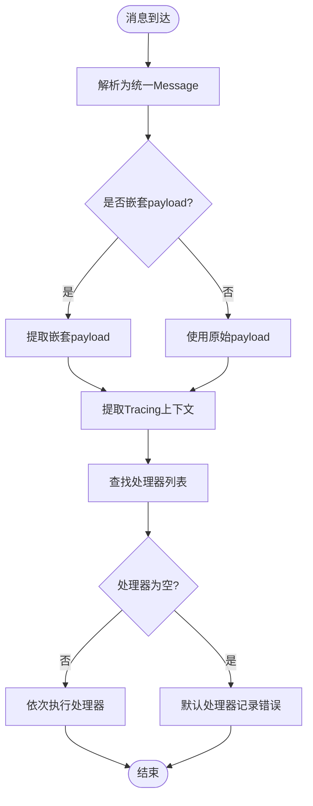
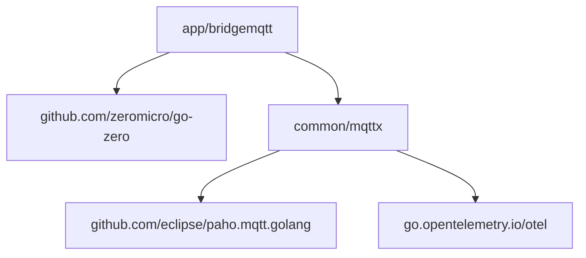

# MQTT 协议原理与实现

<cite>
**本文档引用的文件**
- [mqttx.go](file://common/mqttx/mqttx.go)
- [message.go](file://common/mqttx/message.go)
- [trace.go](file://common/mqttx/trace.go)
- [bridgemqtt.proto](file://app/bridgemqtt/bridgemqtt.proto)
- [bridgemqtt_grpc.pb.go](file://app/bridgemqtt/bridgemqtt/bridgemqtt_grpc.pb.go)
- [bridgemqtt.pb.go](file://app/bridgemqtt/bridgemqtt/bridgemqtt.pb.go)
- [bridgemqtt.go](file://app/bridgemqtt/bridgemqtt.go)
- [bridgemqtt.yaml](file://app/bridgemqtt/etc/bridgemqtt.yaml)
- [bridgemqttserver.go](file://app/bridgemqtt/internal/server/bridgemqttserver.go)
- [servicecontext.go](file://app/bridgemqtt/internal/svc/servicecontext.go)
- [publishlogic.go](file://app/bridgemqtt/internal/logic/publishlogic.go)
- [mqttstreamhandler.go](file://app/bridgemqtt/internal/handler/mqttstreamhandler.go)
- [receivemqttmessagelogic.go](file://facade/streamevent/internal/logic/receivemqttmessagelogic.go)
- [mqttstream.swagger.json](file://swagger/mqttstream.swagger.json)
- [go.mod](file://go.mod)
</cite>

## 目录
1. [引言](#引言)
2. [项目结构](#项目结构)
3. [核心组件](#核心组件)
4. [架构总览](#架构总览)
5. [详细组件分析](#详细组件分析)
6. [依赖关系分析](#依赖关系分析)
7. [性能考量](#性能考量)
8. [故障排查指南](#故障排查指南)
9. [结论](#结论)
10. [附录](#附录)

## 引言
本文件面向希望深入理解并实现MQTT协议的工程师与架构师，系统梳理MQTT在本仓库中的实现形态与工程化落地。文档围绕以下目标展开：
- 协议核心概念与消息模型：连接管理、主题订阅、消息发布、QoS等级、会话保持
- 协议版本差异与消息类型：MQTT 3.1.1与MQTT 5.0的差异点、控制包格式
- 物联网场景优势：低带宽占用、低功耗特性、可靠性保障
- 安全机制：认证方式、加密传输
- 规范解读、最佳实践与常见问题解决方案

本仓库以Go语言实现，基于Eclipse Paho MQTT客户端库，结合gRPC与OpenTelemetry实现消息桥接、可观测性与跨服务集成。

## 项目结构
本项目围绕“MQTT桥接服务”构建，核心模块包括：
- 协议客户端封装：common/mqttx 提供MQTT客户端、消息模型与链路追踪
- 桥接服务：app/bridgemqtt 提供gRPC服务，支持发布消息与带traceId发布
- 业务集成：将MQTT消息转发至流事件与Socket推送服务
- 配置与启动：bridgemqtt.yaml配置Broker、认证、QoS、订阅主题等



图表来源
- [mqttx.go:51-87](file://common/mqttx/mqttx.go#L51-L87)
- [bridgemqtt.proto:10-16](file://app/bridgemqtt/bridgemqtt.proto#L10-L16)
- [bridgemqttserver.go:15-42](file://app/bridgemqtt/internal/server/bridgemqttserver.go#L15-L42)
- [publishlogic.go:26-33](file://app/bridgemqtt/internal/logic/publishlogic.go#L26-L33)
- [mqttstreamhandler.go:99-119](file://app/bridgemqtt/internal/handler/mqttstreamhandler.go#L99-L119)

章节来源
- [bridgemqtt.go:28-71](file://app/bridgemqtt/bridgemqtt.go#L28-L71)
- [bridgemqtt.yaml:1-48](file://app/bridgemqtt/etc/bridgemqtt.yaml#L1-L48)

## 核心组件
- MQTT客户端封装（common/mqttx）
  - MqttConfig：Broker地址、ClientID、用户名/密码、QoS、KeepAlive、超时、自动订阅、初始订阅主题、事件映射、默认事件
  - Client：连接管理、订阅恢复、消息处理包装、发布、关闭、跟踪与指标
  - Message：统一消息载体，支持headers扩展
  - MessageCarrier：实现OpenTelemetry TextMapCarrier，用于链路透传
- 桥接服务（app/bridgemqtt）
  - gRPC服务：Ping、Publish、PublishWithTrace
  - 逻辑层：PublishLogic封装对MQTT客户端的发布调用
  - 服务上下文：初始化MQTT客户端并在OnReady时注册转发处理器
  - 处理器：MqttStreamHandler将MQTT消息转发至StreamEvent与SocketPush，并支持事件映射与日志管理

章节来源
- [mqttx.go:51-87](file://common/mqttx/mqttx.go#L51-L87)
- [message.go:3-15](file://common/mqttx/message.go#L3-L15)
- [trace.go:8-30](file://common/mqttx/trace.go#L8-L30)
- [bridgemqtt.proto:10-16](file://app/bridgemqtt/bridgemqtt.proto#L10-L16)
- [bridgemqttserver.go:26-41](file://app/bridgemqtt/internal/server/bridgemqttserver.go#L26-L41)
- [publishlogic.go:26-33](file://app/bridgemqtt/internal/logic/publishlogic.go#L26-L33)
- [servicecontext.go:47-55](file://app/bridgemqtt/internal/svc/servicecontext.go#L47-L55)
- [mqttstreamhandler.go:99-119](file://app/bridgemqtt/internal/handler/mqttstreamhandler.go#L99-L119)

## 架构总览
下图展示从MQTT Broker到桥接服务再到下游系统的完整链路：



图表来源
- [mqttx.go:258-307](file://common/mqttx/mqttx.go#L258-L307)
- [mqttstreamhandler.go:130-188](file://app/bridgemqtt/internal/handler/mqttstreamhandler.go#L130-L188)
- [servicecontext.go:47-55](file://app/bridgemqtt/internal/svc/servicecontext.go#L47-L55)

## 详细组件分析

### 组件A：MQTT客户端与消息模型
- 连接管理
  - 自动重连、连接超时、心跳设置、首次连接回调
  - 连接丢失时清空订阅状态，OnConnect后恢复订阅
- 主题订阅
  - 支持手动订阅与自动订阅；内部维护已订阅集合
  - 订阅超时与错误处理
- 消息发布
  - 基于QoS等级发布；记录发布Span与指标
  - 发布超时与错误处理
- QoS等级
  - QoS校验与默认值调整；在0~2范围内
- 会话保持
  - KeepAlive与自动重连保障长连接稳定
- 消息模型与链路追踪
  - Message封装topic/payload/headers
  - MessageCarrier实现TextMapCarrier，支持OpenTelemetry上下文透传

```mermaid
classDiagram
class MqttConfig {
+[]string Broker
+string ClientID
+string Username
+string Password
+byte Qos
+int Timeout
+int KeepAlive
+bool AutoSubscribe
+[]string SubscribeTopics
+[]EventMapping EventMapping
+string DefaultEvent
}
class Client {
-mqtt.Client client
-MqttConfig cfg
-map[string][]ConsumeHandler handlers
-map[string]struct{} subscribed
-func onReady
-bool ready
-byte qos
+AddHandler()
+Subscribe()
+Publish()
+Close()
+RestoreSubscriptions()
}
class Message {
+string Topic
+[]byte Payload
+map[string]string Headers
+GetHeader()
+SetHeader()
}
class MessageCarrier {
-Message msg
+Get()
+Set()
+Keys()
}
Client --> MqttConfig : "使用"
Client --> Message : "消费/发布"
Message --> MessageCarrier : "透传"
```

图表来源
- [mqttx.go:51-87](file://common/mqttx/mqttx.go#L51-L87)
- [message.go:3-15](file://common/mqttx/message.go#L3-L15)
- [trace.go:8-30](file://common/mqttx/trace.go#L8-L30)

章节来源
- [mqttx.go:98-178](file://common/mqttx/mqttx.go#L98-L178)
- [mqttx.go:204-255](file://common/mqttx/mqttx.go#L204-L255)
- [mqttx.go:309-333](file://common/mqttx/mqttx.go#L309-L333)
- [mqttx.go:361-388](file://common/mqttx/mqttx.go#L361-L388)
- [message.go:3-15](file://common/mqttx/message.go#L3-L15)
- [trace.go:8-30](file://common/mqttx/trace.go#L8-L30)

### 组件B：桥接服务与发布流程
- gRPC服务定义
  - Ping：健康检查
  - Publish：向指定主题发布消息
  - PublishWithTrace：带traceId发布，便于内部链路追踪
- 服务端实现
  - BridgeMqttServer将请求路由到对应Logic
- 逻辑层
  - PublishLogic直接委托MQTT客户端发布
- 客户端生成
  - bridgemqtt_grpc.pb.go提供gRPC客户端桩代码
  - bridgemqtt.pb.go提供消息体定义



图表来源
- [bridgemqtt.proto:10-16](file://app/bridgemqtt/bridgemqtt.proto#L10-L16)
- [bridgemqttserver.go:31-35](file://app/bridgemqtt/internal/server/bridgemqttserver.go#L31-L35)
- [publishlogic.go:26-33](file://app/bridgemqtt/internal/logic/publishlogic.go#L26-L33)
- [bridgemqtt_grpc.pb.go:58-66](file://app/bridgemqtt/bridgemqtt/bridgemqtt_grpc.pb.go#L58-L66)

章节来源
- [bridgemqtt.proto:10-16](file://app/bridgemqtt/bridgemqtt.proto#L10-L16)
- [bridgemqtt_grpc.pb.go:40-76](file://app/bridgemqtt/bridgemqtt/bridgemqtt_grpc.pb.go#L40-L76)
- [bridgemqtt.pb.go:203-300](file://app/bridgemqtt/bridgemqtt/bridgemqtt.pb.go#L203-L300)
- [bridgemqttserver.go:26-41](file://app/bridgemqtt/internal/server/bridgemqttserver.go#L26-L41)
- [publishlogic.go:26-33](file://app/bridgemqtt/internal/logic/publishlogic.go#L26-L33)

### 组件C：消息消费与转发
- 消费处理包装
  - 消息到达后尝试解析为统一Message；若包含嵌套payload则提取
  - 启动消费Span，注入OpenTelemetry上下文
  - 并发安全地调用注册的处理器列表
- 转发处理器
  - MqttStreamHandler负责将MQTT消息异步转发至StreamEvent与SocketPush
  - 支持事件映射（根据主题模板映射到事件名），默认事件名可配置
  - 日志管理：按主题维度控制日志频率与是否打印payload
  - 使用TaskRunner并发调度，避免阻塞消息处理



图表来源
- [mqttx.go:258-307](file://common/mqttx/mqttx.go#L258-L307)
- [mqttstreamhandler.go:121-188](file://app/bridgemqtt/internal/handler/mqttstreamhandler.go#L121-L188)

章节来源
- [mqttx.go:258-307](file://common/mqttx/mqttx.go#L258-L307)
- [mqttstreamhandler.go:99-188](file://app/bridgemqtt/internal/handler/mqttstreamhandler.go#L99-L188)

### 组件D：配置与启动
- 配置项
  - Broker、用户名/密码、QoS、KeepAlive、订阅主题、事件映射、默认事件
  - gRPC服务监听、日志级别、Nacos注册开关与元数据
- 启动流程
  - 加载配置，初始化日志
  - 构建MQTT客户端，注册OnReady回调
  - OnReady时为订阅主题注册MqttStreamHandler
  - 启动gRPC服务，按需注册到Nacos

章节来源
- [bridgemqtt.yaml:1-48](file://app/bridgemqtt/etc/bridgemqtt.yaml#L1-L48)
- [servicecontext.go:21-60](file://app/bridgemqtt/internal/svc/servicecontext.go#L21-L60)
- [bridgemqtt.go:28-71](file://app/bridgemqtt/bridgemqtt.go#L28-L71)

## 依赖关系分析
- 外部依赖
  - Eclipse Paho MQTT客户端库：提供MQTT协议实现
  - OpenTelemetry：链路追踪与Span埋点
  - go-zero生态：配置加载、日志、服务框架、gRPC
- 内部依赖
  - common/mqttx被app/bridgemqtt与facade/streamevent等模块复用
  - bridgemqtt服务依赖MQTT客户端与下游服务（StreamEvent/SocketPush）



图表来源
- [go.mod:17-52](file://go.mod#L17-L52)
- [mqttx.go:12-23](file://common/mqttx/mqttx.go#L12-L23)
- [bridgemqtt.go:16-24](file://app/bridgemqtt/bridgemqtt.go#L16-L24)

章节来源
- [go.mod:17-52](file://go.mod#L17-L52)

## 性能考量
- 连接与订阅
  - 自动重连与KeepAlive降低断线影响；OnConnect后批量恢复订阅减少重复开销
- 发布与消费
  - 发布超时与错误记录，避免阻塞；消费侧通过处理器列表与并发调度提升吞吐
- 转发链路
  - 异步任务队列（TaskRunner）隔离MQTT消费与下游RPC调用，降低尾延迟
- 日志与可观测性
  - 指标统计与Span埋点有助于定位瓶颈与异常

## 故障排查指南
- 连接失败
  - 检查Broker地址、认证信息、超时配置；查看连接超时与错误日志
- 订阅失败
  - 确认客户端已连接后再订阅；检查订阅超时与错误返回
- 发布失败
  - 校验QoS与Broker支持情况；关注发布超时与错误记录
- 无处理器
  - 默认处理器会记录“无处理器”错误；确保AddHandler正确注册
- 下游转发失败
  - 检查StreamEvent/SocketPush服务可用性与网络；查看异步任务日志

章节来源
- [mqttx.go:148-178](file://common/mqttx/mqttx.go#L148-L178)
- [mqttx.go:215-233](file://common/mqttx/mqttx.go#L215-L233)
- [mqttx.go:318-333](file://common/mqttx/mqttx.go#L318-L333)
- [mqttx.go:293-299](file://common/mqttx/mqttx.go#L293-L299)
- [mqttstreamhandler.go:140-188](file://app/bridgemqtt/internal/handler/mqttstreamhandler.go#L140-L188)

## 结论
本仓库以简洁可靠的架构实现了MQTT协议在物联网场景中的关键能力：稳定的连接管理、灵活的主题订阅、可控的QoS发布、完善的链路追踪与可观测性，以及与下游服务的解耦集成。通过配置驱动与OnReady回调，系统能够在连接建立后自动恢复订阅并注册转发处理器，满足生产环境的高可用需求。

## 附录

### 协议版本与消息类型
- 协议版本差异（MQTT 3.1.1 vs MQTT 5.0）
  - 本项目基于Eclipse Paho库，默认遵循MQTT 3.1.1语义；MQTT 5.0新增属性、用户属性、会话过期间隔、最大包大小等能力，如需使用MQTT 5.0特性，可在客户端库层面进行升级与适配
- 控制包格式
  - CONNECT/CONNACK：建立会话
  - PUBLISH/PUBACK/PUBREC/PUBREL/PUBCOMP：发布与确认
  - SUBSCRIBE/SUBACK：订阅与确认
  - UNSUBSCRIBE/UNSUBACK：取消订阅
  - PINGREQ/PINGRESP：心跳
  - DISCONNECT：断开

章节来源
- [go.mod:17-17](file://go.mod#L17-L17)

### 安全机制与认证
- 认证方式
  - 用户名/密码认证：在MqttConfig中配置
  - 可扩展TLS/SSL认证（需在客户端库层面启用）
- 加密传输
  - 建议在Broker侧启用TLS；客户端连接选项可配置TLS参数
- 最佳实践
  - 生产环境强制启用TLS
  - 使用短生命周期Token或动态凭证轮换
  - 限制订阅主题范围，最小权限原则

章节来源
- [bridgemqtt.yaml:20-25](file://app/bridgemqtt/etc/bridgemqtt.yaml#L20-L25)

### 物联网场景优势
- 低带宽占用
  - 小型控制包、可选压缩头字段
- 低功耗特性
  - KeepAlive与自动重连减少无效连接
- 可靠性保证
  - QoS 1/2发布配合Broker持久化与确认机制

### 规范解读与最佳实践
- 规范解读
  - 严格遵守主题层级与通配符规则（如#、+）
  - 合理设置KeepAlive与超时，平衡资源与稳定性
- 最佳实践
  - 使用事件映射将MQTT主题抽象为业务事件
  - 对高频主题开启日志节流，避免日志风暴
  - 在网关层统一接入MQTT，集中做鉴权与限流

### 常见问题与解决方案
- 无法连接Broker
  - 检查网络连通性、Broker地址与端口、认证信息
- 订阅无消息
  - 确认订阅主题与通配符匹配；检查OnConnect恢复订阅逻辑
- 发布超时
  - 调整超时配置；检查Broker负载与网络状况
- 下游转发失败
  - 查看异步任务日志与下游服务状态码；必要时增加重试与熔断