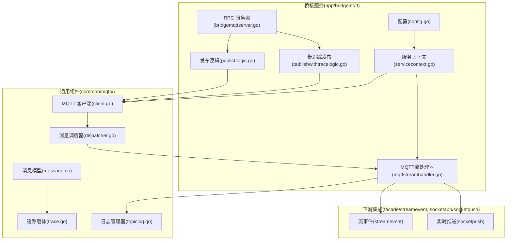
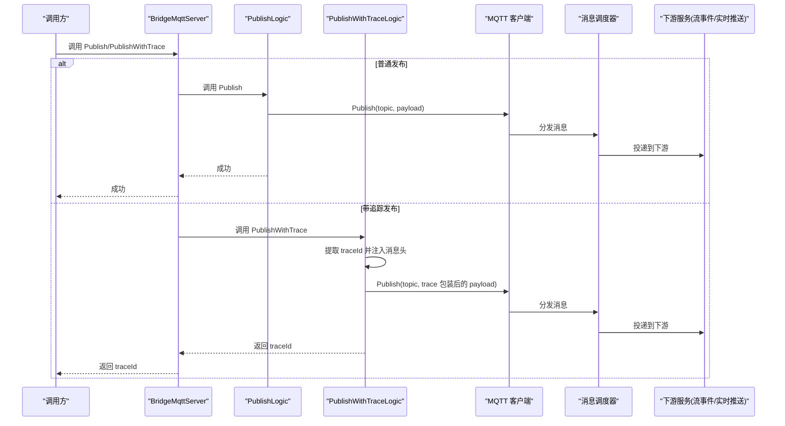
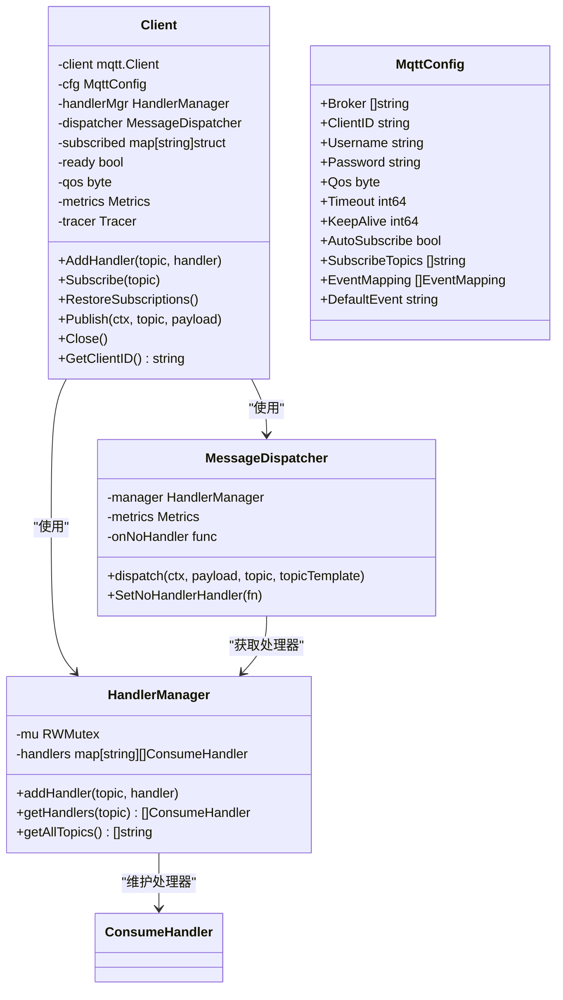
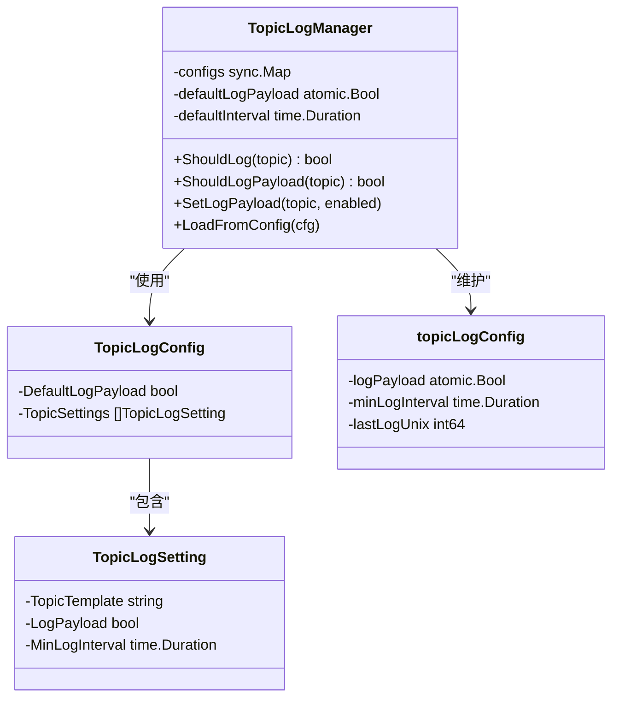
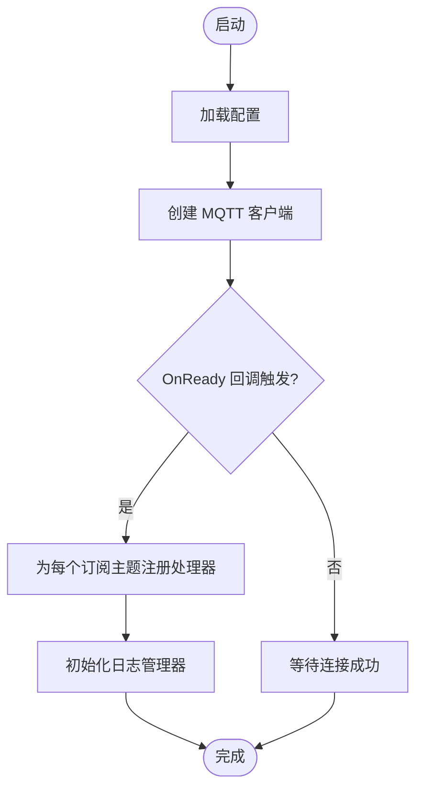
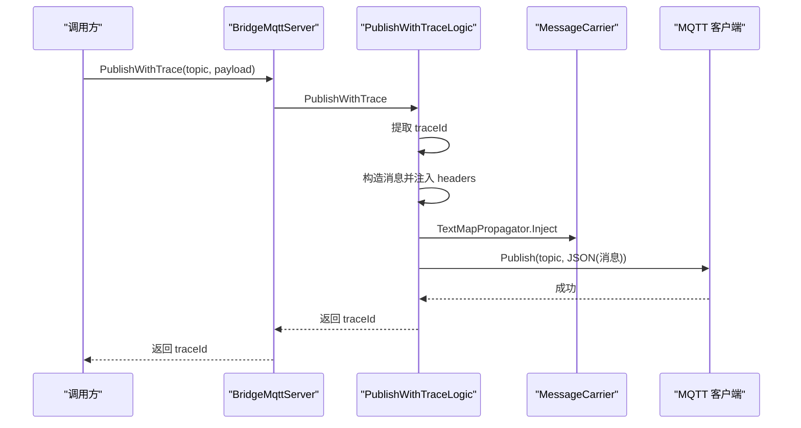
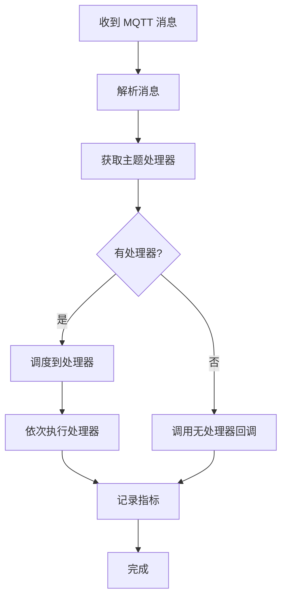
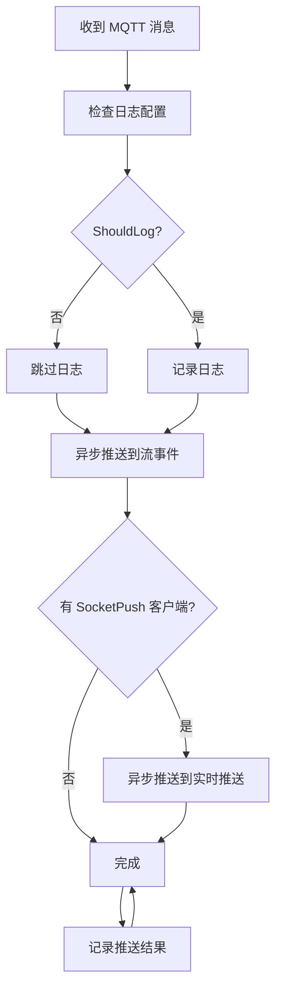
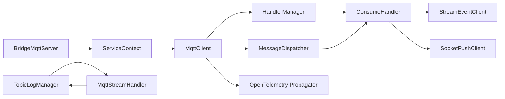

# MQTT 协议桥接服务

<cite>
**本文档引用的文件**   
- [bridgemqtt.proto](file://app/bridgemqtt/bridgemqtt.proto)
- [bridgemqtt.yaml](file://app/bridgemqtt/etc/bridgemqtt.yaml)
- [config.go](file://app/bridgemqtt/internal/config/config.go)
- [servicecontext.go](file://app/bridgemqtt/internal/svc/servicecontext.go)
- [bridgemqttserver.go](file://app/bridgemqtt/internal/server/bridgemqttserver.go)
- [publishlogic.go](file://app/bridgemqtt/internal/logic/publishlogic.go)
- [publishwithtracelogic.go](file://app/bridgemqtt/internal/logic/publishwithtracelogic.go)
- [client.go](file://common/mqttx/client.go)
- [config.go](file://common/mqttx/config.go)
- [dispatcher.go](file://common/mqttx/dispatcher.go)
- [message.go](file://common/mqttx/message.go)
- [trace.go](file://common/mqttx/trace.go)
- [topiclog.go](file://common/mqttx/topiclog.go)
- [mqttstreamhandler.go](file://app/bridgemqtt/internal/handler/mqttstreamhandler.go)
- [receivemqttmessagelogic.go](file://facade/streamevent/internal/logic/receivemqttmessagelogic.go)
- [mqttstream.swagger.json](file://swagger/mqttstream.swagger.json)
</cite>

## 更新摘要
**所做更改**   
- 新增 TopicLogManager 日志配置系统，支持按主题粒度的日志频率控制
- 改进客户端连接处理，采用毫秒精度的时间控制
- 重构消息处理架构，引入消息调度器和处理器管理器
- 增强配置结构，支持更灵活的日志配置和事件映射
- **更新** 分布式追踪ID标准化：从trace_id改为traceId，提升分布式追踪系统的互操作性和可观测性

## 目录
1. [引言](#引言)
2. [项目结构](#项目结构)
3. [核心组件](#核心组件)
4. [架构总览](#架构总览)
5. [详细组件分析](#详细组件分析)
6. [依赖分析](#依赖分析)
7. [性能考量](#性能考量)
8. [故障排查指南](#故障排查指南)
9. [结论](#结论)
10. [附录](#附录)

## 引言
本技术文档围绕"MQTT 协议桥接服务"展开，系统性阐述其在物联网场景中的定位与价值：以轻量、低带宽、高可靠的消息传输能力支撑设备与平台之间的数据互通；通过统一的桥接层实现 MQTT 与内部 RPC 生态（如流事件推送、实时推送）的无缝衔接。文档覆盖客户端管理、主题订阅、消息发布、链路追踪与上下文传递、QoS 与重连策略、API 接口与消息格式、主题命名与权限控制建议、性能调优与部署实践等。

**更新** 新增了 TopicLogManager 日志配置系统，支持按主题粒度的日志频率控制和内容过滤，改进了客户端连接处理的毫秒精度控制，重构了消息处理架构以提高性能和可维护性。**更新** 分布式追踪ID标准化：从trace_id改为traceId，提升分布式追踪系统的互操作性和可观测性。

## 项目结构
该服务采用 go-zero 微服务框架，按"RPC 服务 + 业务逻辑 + 配置 + 通用组件"的层次组织：
- 应用入口与服务定义位于 app/bridgemqtt，包含 proto 定义、配置、服务上下文、RPC 服务器与逻辑层。
- 通用 MQTT 能力封装于 common/mqttx，提供客户端生命周期、订阅管理、发布、追踪与指标统计。
- 事件与推送集成位于 facade/streamevent 与 socketapp/socketpush，用于将 MQTT 消息转发至内部生态。

**图表来源**
- [config.go:9-25](file://app/bridgemqtt/internal/config/config.go#L9-L25)
- [servicecontext.go:16-60](file://app/bridgemqtt/internal/svc/servicecontext.go#L16-L60)
- [bridgemqttserver.go:15-42](file://app/bridgemqtt/internal/server/bridgemqttserver.go#L15-L42)
- [publishlogic.go:27-33](file://app/bridgemqtt/internal/logic/publishlogic.go#L27-L33)
- [publishwithtracelogic.go:31-47](file://app/bridgemqtt/internal/logic/publishwithtracelogic.go#L31-L47)
- [client.go:32-46](file://common/mqttx/client.go#L32-L46)
- [message.go:3-12](file://common/mqttx/message.go#L3-L12)
- [trace.go:8-27](file://common/mqttx/trace.go#L8-L27)
- [dispatcher.go:69-85](file://common/mqttx/dispatcher.go#L69-L85)
- [topiclog.go:69-142](file://common/mqttx/topiclog.go#L69-L142)
- [mqttstreamhandler.go:18-43](file://app/bridgemqtt/internal/handler/mqttstreamhandler.go#L18-L43)

**章节来源**
- [bridgemqtt.proto:10-16](file://app/bridgemqtt/bridgemqtt.proto#L10-L16)
- [bridgemqtt.yaml:1-56](file://app/bridgemqtt/etc/bridgemqtt.yaml#L1-L56)
- [config.go:9-25](file://app/bridgemqtt/internal/config/config.go#L9-L25)
- [servicecontext.go:21-60](file://app/bridgemqtt/internal/svc/servicecontext.go#L21-L60)
- [bridgemqttserver.go:15-42](file://app/bridgemqtt/internal/server/bridgemqttserver.go#L15-L42)
- [client.go:32-46](file://common/mqttx/client.go#L32-L46)

## 核心组件
- MQTT 客户端与订阅管理：负责连接、订阅、消息分发、QoS 控制、重连与指标统计。
- **新增** TopicLogManager 日志管理器：支持按主题粒度的日志频率控制和内容过滤，避免日志刷屏。
- 服务上下文：加载配置、初始化 MQTT 客户端、注册自动订阅处理器。
- RPC 服务：提供 Ping/Publish/PublishWithTrace 三个接口。
- 业务逻辑：封装发布与带追踪发布。
- **重构** 消息处理架构：引入消息调度器和处理器管理器，提高消息处理性能和可维护性。
- 流处理器：将 MQTT 消息转发至流事件与实时推送服务。
- 追踪与消息载体：基于 OpenTelemetry 文本映射传播，将 trace 上下文嵌入消息头。

**更新** 新增了 TopicLogManager 日志管理器组件，重构了消息处理架构，改进了客户端连接处理的毫秒精度控制。**更新** 分布式追踪ID标准化：从trace_id改为traceId，提升分布式追踪系统的互操作性和可观测性。

**章节来源**
- [client.go:32-46](file://common/mqttx/client.go#L32-L46)
- [topiclog.go:69-142](file://common/mqttx/topiclog.go#L69-L142)
- [servicecontext.go:47-55](file://app/bridgemqtt/internal/svc/servicecontext.go#L47-L55)
- [bridgemqttserver.go:26-41](file://app/bridgemqtt/internal/server/bridgemqttserver.go#L26-L41)
- [publishlogic.go:27-33](file://app/bridgemqtt/internal/logic/publishlogic.go#L27-L33)
- [publishwithtracelogic.go:31-47](file://app/bridgemqtt/internal/logic/publishwithtracelogic.go#L31-L47)
- [dispatcher.go:69-112](file://common/mqttx/dispatcher.go#L69-L112)
- [mqttstreamhandler.go:18-128](file://app/bridgemqtt/internal/handler/mqttstreamhandler.go#L18-L128)
- [trace.go:8-37](file://common/mqttx/trace.go#L8-L37)

## 架构总览
桥接服务通过 go-zero RPC 对外提供发布能力，内部通过 MQTT 客户端订阅指定主题并将消息投递到下游服务。发布流程支持普通发布与带追踪发布两种模式，后者将 trace 上下文注入消息头并通过 OpenTelemetry 传播。**新增** 日志管理器提供按主题粒度的日志控制，消息处理架构采用调度器模式提高性能。

**图表来源**
- [bridgemqttserver.go:31-41](file://app/bridgemqtt/internal/server/bridgemqttserver.go#L31-L41)
- [publishlogic.go:27-33](file://app/bridgemqtt/internal/logic/publishlogic.go#L27-L33)
- [publishwithtracelogic.go:31-47](file://app/bridgemqtt/internal/logic/publishwithtracelogic.go#L31-L47)
- [client.go:261-284](file://common/mqttx/client.go#L261-L284)
- [dispatcher.go:87-106](file://common/mqttx/dispatcher.go#L87-L106)
- [mqttstreamhandler.go:54-65](file://app/bridgemqtt/internal/handler/mqttstreamhandler.go#L54-L65)

## 详细组件分析

### MQTT 客户端与订阅机制
- 客户端配置：支持多 Broker、用户名密码、QoS、心跳、超时、自动订阅初始主题等。
- 订阅管理：支持手动订阅与自动订阅；连接建立或恢复后自动恢复订阅。
- **改进** 连接处理：采用毫秒精度的时间控制，连接超时和心跳间隔都以毫秒为单位。
- 消息分发：**重构** 为消息调度器模式，按主题模板匹配处理器，支持多个处理器并行处理。
- 指标与追踪：内置发布/消费 Span，记录客户端 ID、主题、消息 ID、QoS 等属性。

**图表来源**
- [client.go:32-46](file://common/mqttx/client.go#L32-L46)
- [client.go:254-284](file://common/mqttx/client.go#L254-L284)
- [dispatcher.go:31-67](file://common/mqttx/dispatcher.go#L31-L67)
- [dispatcher.go:69-112](file://common/mqttx/dispatcher.go#L69-L112)
- [config.go:3-27](file://common/mqttx/config.go#L3-L27)

**章节来源**
- [client.go:32-46](file://common/mqttx/client.go#L32-L46)
- [client.go:115-144](file://common/mqttx/client.go#L115-L144)
- [client.go:209-252](file://common/mqttx/client.go#L209-L252)
- [client.go:261-284](file://common/mqttx/client.go#L261-L284)
- [dispatcher.go:31-112](file://common/mqttx/dispatcher.go#L31-L112)
- [config.go:3-27](file://common/mqttx/config.go#L3-L27)

### TopicLogManager 日志配置系统
**新增** 日志管理器提供按主题粒度的日志控制功能：
- 支持默认日志配置和按主题的细粒度配置
- 频率控制：避免高频主题导致的日志刷屏
- 内容控制：可选择是否打印消息内容
- 原子操作：使用原子操作确保线程安全

**图表来源**
- [topiclog.go:69-142](file://common/mqttx/topiclog.go#L69-L142)
- [topiclog.go:19-26](file://common/mqttx/topiclog.go#L19-L26)
- [topiclog.go:9-17](file://common/mqttx/topiclog.go#L9-L17)

**章节来源**
- [topiclog.go:69-142](file://common/mqttx/topiclog.go#L69-L142)
- [topiclog.go:19-26](file://common/mqttx/topiclog.go#L19-L26)
- [topiclog.go:9-17](file://common/mqttx/topiclog.go#L9-L17)

### 服务上下文与自动订阅
- 加载配置并初始化 MQTT 客户端，设置 OnReady 回调。
- 在 OnReady 中根据配置的订阅主题批量注册处理器，实现自动订阅与消息转发。
- **增强** 日志配置：将 TopicLogConfig 传递给 MQTT 流处理器。

**图表来源**
- [servicecontext.go:47-55](file://app/bridgemqtt/internal/svc/servicecontext.go#L47-L55)
- [client.go:146-170](file://common/mqttx/client.go#L146-L170)

**章节来源**
- [servicecontext.go:47-55](file://app/bridgemqtt/internal/svc/servicecontext.go#L47-L55)

### 发布与带追踪发布
- 普通发布：直接调用客户端发布，支持配置的 QoS。
- 带追踪发布：从上下文提取 traceId，构造消息对象，注入消息头，再进行发布；返回 traceId 便于链路追踪。

**图表来源**
- [publishwithtracelogic.go:31-47](file://app/bridgemqtt/internal/logic/publishwithtracelogic.go#L31-L47)
- [trace.go:19-27](file://common/mqttx/trace.go#L19-L27)
- [message.go:14-21](file://common/mqttx/message.go#L14-L21)
- [client.go:326-339](file://common/mqttx/client.go#L326-L339)

**章节来源**
- [publishlogic.go:27-33](file://app/bridgemqtt/internal/logic/publishlogic.go#L27-L33)
- [publishwithtracelogic.go:31-47](file://app/bridgemqtt/internal/logic/publishwithtracelogic.go#L31-L47)
- [message.go:3-12](file://common/mqttx/message.go#L3-L12)
- [trace.go:8-37](file://common/mqttx/trace.go#L8-L37)

### 重构的消息处理架构
**重构** 消息处理采用新的架构模式：
- HandlerManager：维护主题到处理器的映射关系
- MessageDispatcher：负责消息的分发和调度
- 支持多个处理器并行处理同一主题的消息
- 内置指标统计，记录消息处理耗时

**图表来源**
- [dispatcher.go:87-106](file://common/mqttx/dispatcher.go#L87-L106)
- [dispatcher.go:108-112](file://common/mqttx/dispatcher.go#L108-L112)

**章节来源**
- [dispatcher.go:69-112](file://common/mqttx/dispatcher.go#L69-L112)
- [client.go:261-284](file://common/mqttx/client.go#L261-L284)

### 消息流处理器与下游集成
- 将 MQTT 消息异步转发至流事件与实时推送服务，支持事件名映射与日志频率控制。
- **增强** 日志管理：使用 TopicLogManager 控制日志输出频率和内容。
- 使用任务运行器并发调度，避免阻塞消息处理主路径。

**图表来源**
- [mqttstreamhandler.go:54-128](file://app/bridgemqtt/internal/handler/mqttstreamhandler.go#L54-L128)

**章节来源**
- [mqttstreamhandler.go:18-128](file://app/bridgemqtt/internal/handler/mqttstreamhandler.go#L18-L128)

### API 接口与消息格式
- 接口清单
  - Ping：健康检查。
  - Publish：向指定主题发布消息。
  - PublishWithTrace：发布消息并返回 traceId，便于链路追踪。
- 请求/响应字段
  - Ping/Res：字符串类型。
  - PublishReq/PublishRes：topic 字符串，payload 字节。
  - PublishWithTraceReq/PublishWithTraceRes：topic 字符串，payload 字节，traceId 字符串。
- Swagger 定义：包含 MQTT 消息体的通用结构（sessionId、msgId、topic、payload、sendTime）。

**更新** 分布式追踪ID标准化：响应字段从trace_id改为traceId，提升分布式追踪系统的互操作性和可观测性。

**章节来源**
- [bridgemqtt.proto:10-16](file://app/bridgemqtt/bridgemqtt.proto#L10-L16)
- [bridgemqtt.proto:20-49](file://app/bridgemqtt/bridgemqtt.proto#L20-L49)
- [bridgemqtt.pb.go:165-170](file://app/bridgemqtt/bridgemqtt/bridgemqtt.pb.go#L165-L170)
- [publishwithtracelogic.go:44-46](file://app/bridgemqtt/internal/logic/publishwithtracelogic.go#L44-L46)
- [mqttstream.swagger.json:20-44](file://swagger/mqttstream.swagger.json#L20-L44)

## 依赖分析
- 组件耦合
  - BridgeMqttServer 依赖 ServiceContext 获取 MQTT 客户端与下游客户端。
  - ServiceContext 依赖 MqttConfig 初始化 MQTT 客户端，并在 OnReady 中注册处理器。
  - **新增** TopicLogManager 作为独立组件，被 MQTT 流处理器使用。
  - **重构** HandlerManager 和 MessageDispatcher 解耦消息处理逻辑。
  - MQTT 客户端与消息处理器解耦，通过主题模板匹配实现松耦合。
- 外部依赖
  - MQTT Broker（通过配置的 Broker 数组接入）。
  - 流事件与实时推送服务（可选启用）。
  - OpenTelemetry 文本映射传播用于跨进程上下文传递。

**图表来源**
- [bridgemqttserver.go:15-24](file://app/bridgemqtt/internal/server/bridgemqttserver.go#L15-L24)
- [servicecontext.go:16-59](file://app/bridgemqtt/internal/svc/servicecontext.go#L16-L59)
- [client.go:32-46](file://common/mqttx/client.go#L32-L46)
- [dispatcher.go:31-67](file://common/mqttx/dispatcher.go#L31-L67)
- [mqttstreamhandler.go:18-43](file://app/bridgemqtt/internal/handler/mqttstreamhandler.go#L18-L43)

**章节来源**
- [bridgemqttserver.go:15-24](file://app/bridgemqtt/internal/server/bridgemqttserver.go#L15-L24)
- [servicecontext.go:16-59](file://app/bridgemqtt/internal/svc/servicecontext.go#L16-L59)

## 性能考量
- QoS 与可靠性
  - 支持 QoS 0/1/2，系统在创建客户端时对非法值进行修正，默认 QoS 为 1。
  - 发布/订阅均带有超时控制，防止阻塞。
- **改进** 连接与重连
  - 启用自动重连；断开后清空已订阅集合，连接成功后恢复订阅。
  - **改进** 采用毫秒精度的时间控制，提高连接稳定性。
- 并发与吞吐
  - **重构** 消息处理采用调度器模式，支持多个处理器并行处理。
  - 消息处理采用任务运行器并发调度，降低下游延迟。
  - **新增** 日志频率控制避免高频主题导致日志风暴。
- 指标与可观测性
  - 内置发布/消费 Span，采集耗时指标，便于性能分析与问题定位。
  - **新增** TopicLogManager 提供日志级别的性能监控。

**更新** 新增了 TopicLogManager 性能监控功能，改进了连接处理的毫秒精度控制。

**章节来源**
- [client.go:102-113](file://common/mqttx/client.go#L102-L113)
- [client.go:146-170](file://common/mqttx/client.go#L146-L170)
- [client.go:209-252](file://common/mqttx/client.go#L209-L252)
- [dispatcher.go:87-106](file://common/mqttx/dispatcher.go#L87-L106)
- [topiclog.go:46-54](file://common/mqttx/topiclog.go#L46-54)
- [mqttstreamhandler.go:79-116](file://app/bridgemqtt/internal/handler/mqttstreamhandler.go#L79-L116)

## 故障排查指南
- 连接失败
  - 检查 Broker 地址、认证信息与网络连通性；关注连接超时与错误日志。
  - **改进** 连接超时和心跳间隔以毫秒为单位，便于精确调试。
- 订阅失败
  - 确认客户端已连接且订阅未超时；检查主题是否正确、是否被自动订阅。
- 发布失败
  - 检查客户端连接状态、QoS 配置与发布超时；查看返回的错误信息。
- 无处理器或空负载
  - **重构** 消息处理架构后，无处理器时会调用回调函数而非直接忽略。
  - 空负载将被拒绝处理。
- 重连后丢失订阅
  - 系统会在 OnConnectionLost 清空订阅集合，连接成功后恢复订阅；若未恢复，请检查配置与错误日志。
- 追踪无效
  - 确认上下文包含 traceId，消息头中包含传播的键值；检查下游是否正确解析消息头。
- **新增** 日志配置问题
  - 检查 TopicLogConfig 配置是否正确加载。
  - 确认主题模板匹配是否正确。
  - 验证日志频率控制是否生效。

**更新** 新增了日志配置相关的故障排查指导。

**章节来源**
- [client.go:136-143](file://common/mqttx/client.go#L136-L143)
- [client.go:209-252](file://common/mqttx/client.go#L209-L252)
- [client.go:277-284](file://common/mqttx/client.go#L277-L284)
- [dispatcher.go:81-84](file://common/mqttx/dispatcher.go#L81-L84)
- [topiclog.go:117-131](file://common/mqttx/topiclog.go#L117-L131)

## 结论
本桥接服务以简洁稳定的架构实现了 MQTT 与内部生态的高效对接：通过统一的客户端管理与订阅机制保障消息可达性，借助带追踪发布实现端到端链路可视化，结合**重构**的消息处理架构与**新增**的日志管理器提升整体性能与可维护性。**改进** 的毫秒精度连接控制和灵活的日志配置使系统在各类 IoT 场景中实现更高的可用性、可观测性和可控性。**更新** 分布式追踪ID标准化进一步提升了系统的互操作性和可观测性。

## 附录

### API 接口一览
- Ping
  - 请求：Req.ping
  - 响应：Res.pong
- Publish
  - 请求：PublishReq.topic, PublishReq.payload
  - 响应：PublishRes
- PublishWithTrace
  - 请求：PublishWithTraceReq.topic, PublishWithTraceReq.payload
  - 响应：PublishWithTraceRes.traceId

**更新** 分布式追踪ID标准化：响应字段从trace_id改为traceId，提升分布式追踪系统的互操作性和可观测性。

**章节来源**
- [bridgemqtt.proto:10-16](file://app/bridgemqtt/bridgemqtt.proto#L10-L16)
- [bridgemqtt.proto:20-49](file://app/bridgemqtt/bridgemqtt.proto#L20-L49)
- [bridgemqtt.pb.go:165-170](file://app/bridgemqtt/bridgemqtt/bridgemqtt.pb.go#L165-L170)
- [publishwithtracelogic.go:44-46](file://app/bridgemqtt/internal/logic/publishwithtracelogic.go#L44-L46)

### 消息格式规范
- 普通发布：topic 字符串，payload 字节。
- 带追踪发布：payload 为 JSON 结构，包含 topic、payload、headers；headers 用于承载传播的 trace 上下文键值。

**章节来源**
- [bridgemqtt.proto:28-49](file://app/bridgemqtt/bridgemqtt.proto#L28-L49)
- [message.go:3-12](file://common/mqttx/message.go#L3-L12)
- [trace.go:19-27](file://common/mqttx/trace.go#L19-L27)

### 主题命名规范与权限控制建议
- 命名规范
  - 使用层级化命名，如：设备域/区域/设备ID/传感器类型/属性。
  - 保留通配符规则清晰：单级通配符"+"与多级通配符"#", 避免歧义。
- 权限控制
  - 建议在 MQTT Broker 层面配置用户名密码与 ACL，限制订阅/发布主题范围。
  - 在应用侧对 topicTemplate 做白名单校验，防止越权访问。

### QoS 等级与网络异常处理
- QoS 等级
  - 0：最多一次；1：至少一次；2：恰好一次。系统默认 QoS=1，非法值将被修正。
- 重连机制
  - 自动重连开启；断线后清空订阅集合，连接成功后恢复订阅。
- **改进** 网络异常
  - 连接/订阅/发布均设置毫秒精度超时；出现超时或错误时返回错误并记录日志。

**更新** 网络异常处理采用了毫秒精度的时间控制。

**章节来源**
- [client.go:102-113](file://common/mqttx/client.go#L102-L113)
- [client.go:146-170](file://common/mqttx/client.go#L146-L170)
- [client.go:209-252](file://common/mqttx/client.go#L209-L252)
- [client.go:326-339](file://common/mqttx/client.go#L326-L339)

### 配置项说明
- 服务配置
  - Name、ListenOn、Timeout、Log、Mode 等常规 RPC 服务配置。
- Nacos 配置
  - 服务注册开关、地址、凭据、命名空间与服务名。
- MQTT 配置
  - Broker、ClientId、Username、Password、Qos、Timeout、KeepAlive、AutoSubscribe、SubscribeTopics、EventMapping、DefaultEvent。
- **增强** 日志配置
  - LogConfig：支持默认日志配置和按主题的细粒度配置。
  - TopicLogConfig：包含 DefaultLogPayload 和 TopicSettings。
  - TopicLogSetting：包含 TopicTemplate、LogPayload、MinLogInterval。
- 下游客户端配置
  - StreamEventConf、SocketPushConf：Endpoints、NonBlock、Timeout 等。

**更新** 新增了完整的日志配置结构说明。

**章节来源**
- [bridgemqtt.yaml:1-56](file://app/bridgemqtt/etc/bridgemqtt.yaml#L1-L56)
- [config.go:9-25](file://app/bridgemqtt/internal/config/config.go#L9-L25)
- [config.go:3-27](file://common/mqttx/config.go#L3-L27)
- [topiclog.go:19-26](file://common/mqttx/topiclog.go#L19-L26)
- [topiclog.go:9-17](file://common/mqttx/topiclog.go#L9-L17)

### 实际 IoT 应用最佳实践
- 设备接入
  - 使用稳定的主题命名与权限控制，确保设备只访问授权主题。
- 数据流转
  - 对高频主题启用日志频率控制，避免日志风暴；对关键主题启用带追踪发布以便端到端观测。
  - **新增** 利用 TopicLogManager 精确控制不同主题的日志输出。
- 可靠性
  - 根据业务选择合适的 QoS；在弱网环境下适当增大超时与心跳间隔。
  - **改进** 利用毫秒精度的连接控制提高网络适应性。
- 集群部署
  - 多实例部署时共享同一 Broker；利用自动重连与订阅恢复机制保证高可用。
- 性能调优
  - 合理设置任务运行器并发度与日志频率阈值；监控发布/消费耗时与错误率。
  - **重构** 利用新的消息处理架构提高吞吐量。
  - **新增** 使用 TopicLogManager 优化日志性能开销。
- **更新** 分布式追踪最佳实践
  - 使用标准化的 traceId 字段进行链路追踪，提升跨系统互操作性。
  - 确保消息头中正确传播 trace 上下文，便于端到端链路分析。
  - 结合 OpenTelemetry 标准，实现统一的分布式追踪体验。