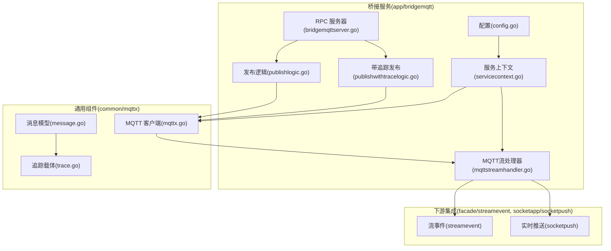
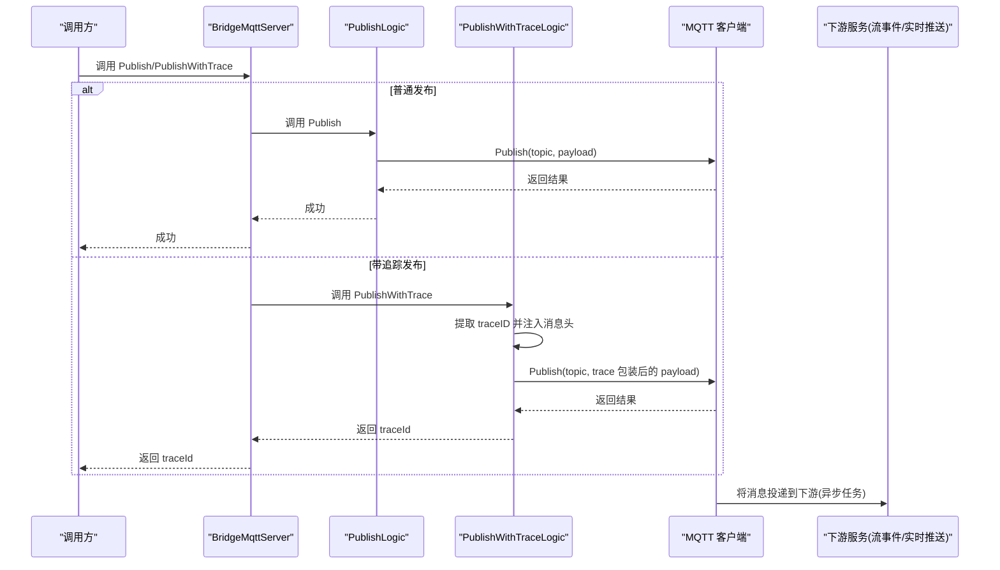
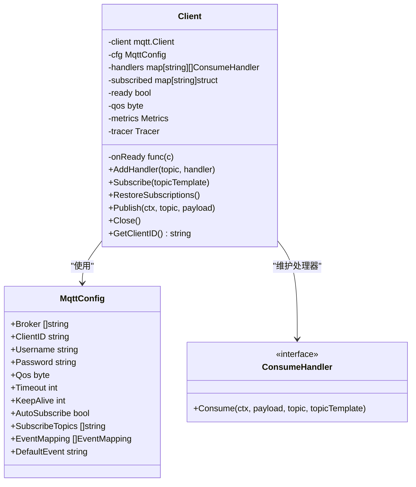
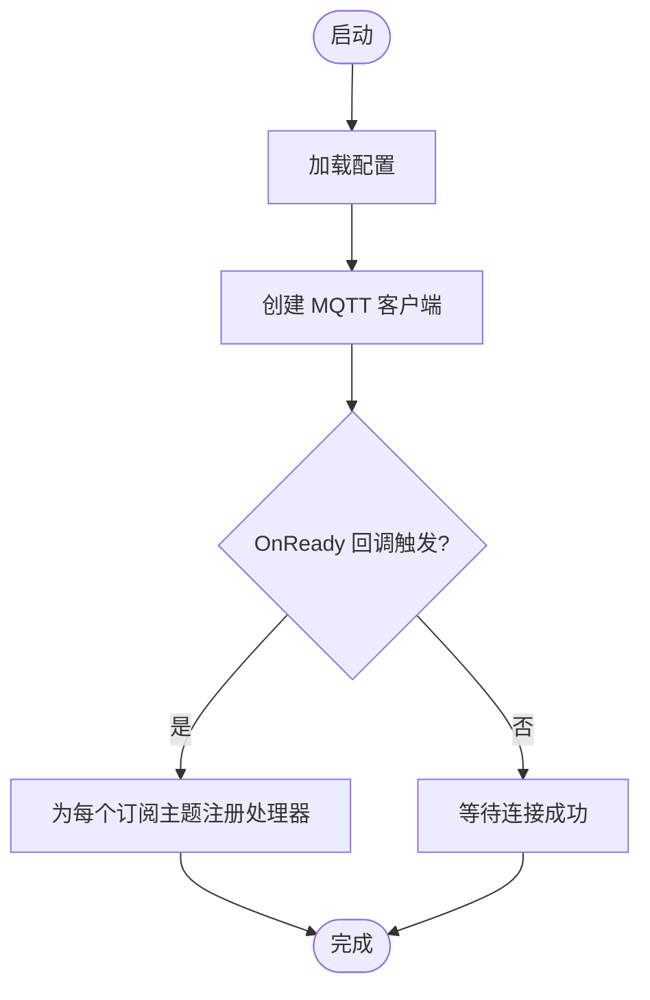
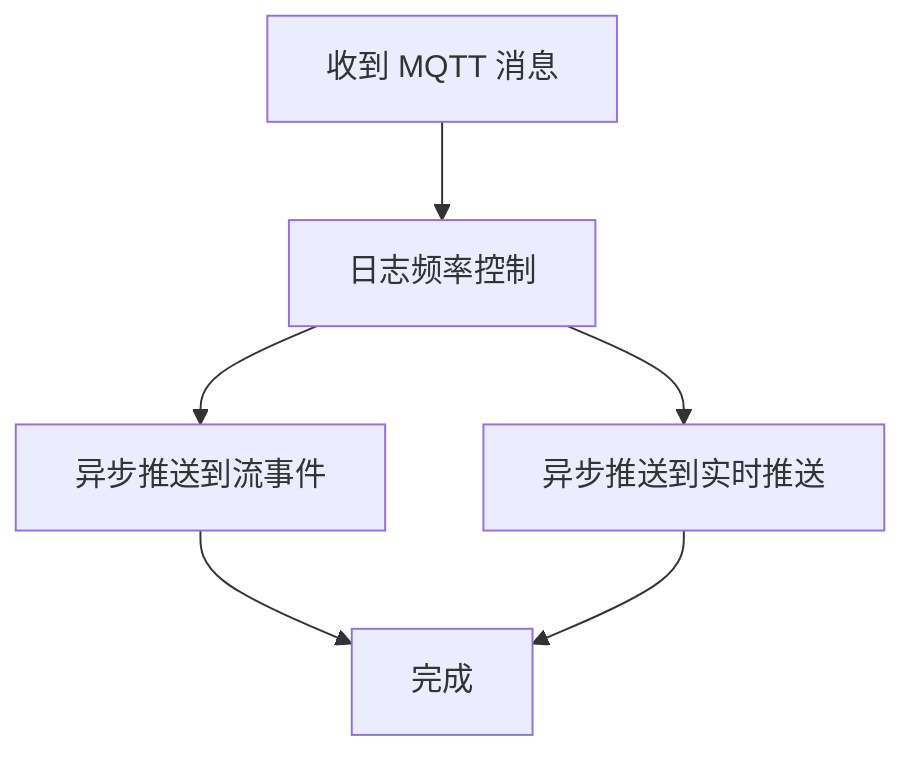
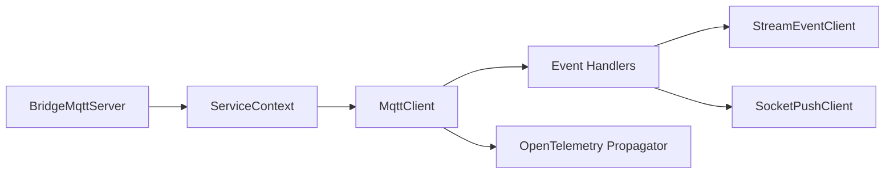

# MQTT 协议桥接服务

<cite>
**本文引用的文件**   
- [bridgemqtt.proto](file://app/bridgemqtt/bridgemqtt.proto)
- [bridgemqtt.yaml](file://app/bridgemqtt/etc/bridgemqtt.yaml)
- [config.go](file://app/bridgemqtt/internal/config/config.go)
- [servicecontext.go](file://app/bridgemqtt/internal/svc/servicecontext.go)
- [bridgemqttserver.go](file://app/bridgemqtt/internal/server/bridgemqttserver.go)
- [publishlogic.go](file://app/bridgemqtt/internal/logic/publishlogic.go)
- [publishwithtracelogic.go](file://app/bridgemqtt/internal/logic/publishwithtracelogic.go)
- [mqttx.go](file://common/mqttx/mqttx.go)
- [message.go](file://common/mqttx/message.go)
- [trace.go](file://common/mqttx/trace.go)
- [mqttstreamhandler.go](file://app/bridgemqtt/internal/handler/mqttstreamhandler.go)
- [receivemqttmessagelogic.go](file://facade/streamevent/internal/logic/receivemqttmessagelogic.go)
- [mqttstream.swagger.json](file://swagger/mqttstream.swagger.json)
</cite>

## 目录
1. [引言](#引言)
2. [项目结构](#项目结构)
3. [核心组件](#核心组件)
4. [架构总览](#架构总览)
5. [详细组件分析](#详细组件分析)
6. [依赖分析](#依赖分析)
7. [性能考量](#性能考量)
8. [故障排查指南](#故障排查指南)
9. [结论](#结论)
10. [附录](#附录)

## 引言
本技术文档围绕“MQTT 协议桥接服务”展开，系统性阐述其在物联网场景中的定位与价值：以轻量、低带宽、高可靠的消息传输能力支撑设备与平台之间的数据互通；通过统一的桥接层实现 MQTT 与内部 RPC 生态（如流事件推送、实时推送）的无缝衔接。文档覆盖客户端管理、主题订阅、消息发布、链路追踪与上下文传递、QoS 与重连策略、API 接口与消息格式、主题命名与权限控制建议、性能调优与部署实践等。

## 项目结构
该服务采用 go-zero 微服务框架，按“RPC 服务 + 业务逻辑 + 配置 + 通用组件”的层次组织：
- 应用入口与服务定义位于 app/bridgemqtt，包含 proto 定义、配置、服务上下文、RPC 服务器与逻辑层。
- 通用 MQTT 能力封装于 common/mqttx，提供客户端生命周期、订阅管理、发布、追踪与指标统计。
- 事件与推送集成位于 facade/streamevent 与 socketapp/socketpush，用于将 MQTT 消息转发至内部生态。

图表来源
- [config.go:9-23](file://app/bridgemqtt/internal/config/config.go#L9-L23)
- [servicecontext.go:16-60](file://app/bridgemqtt/internal/svc/servicecontext.go#L16-L60)
- [bridgemqttserver.go:15-42](file://app/bridgemqtt/internal/server/bridgemqttserver.go#L15-L42)
- [publishlogic.go:27-33](file://app/bridgemqtt/internal/logic/publishlogic.go#L27-L33)
- [publishwithtracelogic.go:31-47](file://app/bridgemqtt/internal/logic/publishwithtracelogic.go#L31-L47)
- [mqttx.go:76-87](file://common/mqttx/mqttx.go#L76-L87)
- [message.go:3-15](file://common/mqttx/message.go#L3-L15)
- [trace.go:8-30](file://common/mqttx/trace.go#L8-L30)
- [mqttstreamhandler.go:99-119](file://app/bridgemqtt/internal/handler/mqttstreamhandler.go#L99-L119)

章节来源
- [bridgemqtt.proto:10-16](file://app/bridgemqtt/bridgemqtt.proto#L10-L16)
- [bridgemqtt.yaml:1-48](file://app/bridgemqtt/etc/bridgemqtt.yaml#L1-L48)
- [config.go:9-23](file://app/bridgemqtt/internal/config/config.go#L9-L23)
- [servicecontext.go:21-60](file://app/bridgemqtt/internal/svc/servicecontext.go#L21-L60)
- [bridgemqttserver.go:15-42](file://app/bridgemqtt/internal/server/bridgemqttserver.go#L15-L42)
- [mqttx.go:76-87](file://common/mqttx/mqttx.go#L76-L87)

## 核心组件
- MQTT 客户端与订阅管理：负责连接、订阅、消息分发、QoS 控制、重连与指标统计。
- 服务上下文：加载配置、初始化 MQTT 客户端、注册自动订阅处理器。
- RPC 服务：提供 Ping/Publish/PublishWithTrace 三个接口。
- 业务逻辑：封装发布与带追踪发布。
- 流处理器：将 MQTT 消息转发至流事件与实时推送服务。
- 追踪与消息载体：基于 OpenTelemetry 文本映射传播，将 trace 上下文嵌入消息头。

章节来源
- [mqttx.go:51-64](file://common/mqttx/mqttx.go#L51-L64)
- [mqttx.go:76-87](file://common/mqttx/mqttx.go#L76-L87)
- [servicecontext.go:47-55](file://app/bridgemqtt/internal/svc/servicecontext.go#L47-L55)
- [bridgemqttserver.go:26-41](file://app/bridgemqtt/internal/server/bridgemqttserver.go#L26-L41)
- [publishlogic.go:27-33](file://app/bridgemqtt/internal/logic/publishlogic.go#L27-L33)
- [publishwithtracelogic.go:31-47](file://app/bridgemqtt/internal/logic/publishwithtracelogic.go#L31-L47)
- [mqttstreamhandler.go:121-188](file://app/bridgemqtt/internal/handler/mqttstreamhandler.go#L121-L188)
- [trace.go:6-30](file://common/mqttx/trace.go#L6-L30)

## 架构总览
桥接服务通过 go-zero RPC 对外提供发布能力，内部通过 MQTT 客户端订阅指定主题并将消息投递到下游服务。发布流程支持普通发布与带追踪发布两种模式，后者将 trace 上下文注入消息头并通过 OpenTelemetry 传播。

图表来源
- [bridgemqttserver.go:31-41](file://app/bridgemqtt/internal/server/bridgemqttserver.go#L31-L41)
- [publishlogic.go:27-33](file://app/bridgemqtt/internal/logic/publishlogic.go#L27-L33)
- [publishwithtracelogic.go:31-47](file://app/bridgemqtt/internal/logic/publishwithtracelogic.go#L31-L47)
- [mqttx.go:309-333](file://common/mqttx/mqttx.go#L309-L333)
- [mqttstreamhandler.go:140-187](file://app/bridgemqtt/internal/handler/mqttstreamhandler.go#L140-L187)

## 详细组件分析

### MQTT 客户端与订阅机制
- 客户端配置：支持多 Broker、用户名密码、QoS、心跳、超时、自动订阅初始主题等。
- 订阅管理：支持手动订阅与自动订阅；连接建立或恢复后自动恢复订阅。
- 消息分发：按主题模板匹配处理器，空负载或无处理器时记录日志并可走默认处理。
- 指标与追踪：内置发布/消费 Span，记录客户端 ID、主题、消息 ID、QoS 等属性。

图表来源
- [mqttx.go:51-64](file://common/mqttx/mqttx.go#L51-L64)
- [mqttx.go:76-87](file://common/mqttx/mqttx.go#L76-L87)
- [mqttx.go:180-197](file://common/mqttx/mqttx.go#L180-L197)
- [mqttx.go:204-233](file://common/mqttx/mqttx.go#L204-L233)
- [mqttx.go:235-255](file://common/mqttx/mqttx.go#L235-L255)
- [mqttx.go:309-333](file://common/mqttx/mqttx.go#L309-L333)

章节来源
- [mqttx.go:51-64](file://common/mqttx/mqttx.go#L51-L64)
- [mqttx.go:180-197](file://common/mqttx/mqttx.go#L180-L197)
- [mqttx.go:204-233](file://common/mqttx/mqttx.go#L204-L233)
- [mqttx.go:235-255](file://common/mqttx/mqttx.go#L235-L255)
- [mqttx.go:309-333](file://common/mqttx/mqttx.go#L309-L333)

### 服务上下文与自动订阅
- 加载配置并初始化 MQTT 客户端，设置 OnReady 回调。
- 在 OnReady 中根据配置的订阅主题批量注册处理器，实现自动订阅与消息转发。

图表来源
- [servicecontext.go:47-55](file://app/bridgemqtt/internal/svc/servicecontext.go#L47-L55)
- [mqttx.go:148-159](file://common/mqttx/mqttx.go#L148-L159)

章节来源
- [servicecontext.go:47-55](file://app/bridgemqtt/internal/svc/servicecontext.go#L47-L55)

### 发布与带追踪发布
- 普通发布：直接调用客户端发布，支持配置的 QoS。
- 带追踪发布：从上下文提取 traceID，构造消息对象，注入消息头，再进行发布；返回 traceID 便于链路追踪。

图表来源
- [publishwithtracelogic.go:31-47](file://app/bridgemqtt/internal/logic/publishwithtracelogic.go#L31-L47)
- [trace.go:16-22](file://common/mqttx/trace.go#L16-L22)
- [message.go:17-29](file://common/mqttx/message.go#L17-L29)
- [mqttx.go:309-333](file://common/mqttx/mqttx.go#L309-L333)

章节来源
- [publishlogic.go:27-33](file://app/bridgemqtt/internal/logic/publishlogic.go#L27-L33)
- [publishwithtracelogic.go:31-47](file://app/bridgemqtt/internal/logic/publishwithtracelogic.go#L31-L47)
- [message.go:3-15](file://common/mqttx/message.go#L3-L15)
- [trace.go:6-30](file://common/mqttx/trace.go#L6-L30)

### 消息流处理器与下游集成
- 将 MQTT 消息异步转发至流事件与实时推送服务，支持事件名映射与日志频率控制。
- 使用任务运行器并发调度，避免阻塞消息处理主路径。

图表来源
- [mqttstreamhandler.go:130-188](file://app/bridgemqtt/internal/handler/mqttstreamhandler.go#L130-L188)

章节来源
- [mqttstreamhandler.go:99-188](file://app/bridgemqtt/internal/handler/mqttstreamhandler.go#L99-L188)

### API 接口与消息格式
- 接口清单
  - Ping：健康检查。
  - Publish：向指定主题发布消息。
  - PublishWithTrace：发布消息并返回 traceId，便于链路追踪。
- 请求/响应字段
  - Ping/Res：字符串类型。
  - PublishReq/PublishRes：topic 字符串，payload 字节。
  - PublishWithTraceReq/PublishWithTraceRes：topic 字符串，payload 字节，traceId 字符串。
- Swagger 定义：包含 MQTT 消息体的通用结构（sessionId、msgId、topic、payload、sendTime）。

章节来源
- [bridgemqtt.proto:10-16](file://app/bridgemqtt/bridgemqtt.proto#L10-L16)
- [bridgemqtt.proto:20-49](file://app/bridgemqtt/bridgemqtt.proto#L20-L49)
- [mqttstream.swagger.json:20-44](file://swagger/mqttstream.swagger.json#L20-L44)

## 依赖分析
- 组件耦合
  - BridgeMqttServer 依赖 ServiceContext 获取 MQTT 客户端与下游客户端。
  - ServiceContext 依赖 MqttConfig 初始化 MQTT 客户端，并在 OnReady 中注册处理器。
  - MQTT 客户端与消息处理器解耦，通过主题模板匹配实现松耦合。
- 外部依赖
  - MQTT Broker（通过配置的 Broker 数组接入）。
  - 流事件与实时推送服务（可选启用）。
  - OpenTelemetry 文本映射传播用于跨进程上下文传递。

图表来源
- [bridgemqttserver.go:15-24](file://app/bridgemqtt/internal/server/bridgemqttserver.go#L15-L24)
- [servicecontext.go:16-59](file://app/bridgemqtt/internal/svc/servicecontext.go#L16-L59)
- [mqttx.go:76-87](file://common/mqttx/mqttx.go#L76-L87)
- [mqttstreamhandler.go:99-119](file://app/bridgemqtt/internal/handler/mqttstreamhandler.go#L99-L119)

章节来源
- [bridgemqttserver.go:15-24](file://app/bridgemqtt/internal/server/bridgemqttserver.go#L15-L24)
- [servicecontext.go:16-59](file://app/bridgemqtt/internal/svc/servicecontext.go#L16-L59)

## 性能考量
- QoS 与可靠性
  - 支持 QoS 0/1/2，系统在创建客户端时对非法值进行修正，默认 QoS 为 1。
  - 发布/订阅均带有超时控制，防止阻塞。
- 连接与重连
  - 启用自动重连；断开后清空已订阅集合，连接成功后恢复订阅。
- 并发与吞吐
  - 消息处理采用任务运行器并发调度，降低下游延迟。
  - 日志频率控制避免高频主题导致日志风暴。
- 指标与可观测性
  - 内置发布/消费 Span，采集耗时指标，便于性能分析与问题定位。

章节来源
- [mqttx.go:132-135](file://common/mqttx/mqttx.go#L132-L135)
- [mqttx.go:144-146](file://common/mqttx/mqttx.go#L144-L146)
- [mqttx.go:161-166](file://common/mqttx/mqttx.go#L161-L166)
- [mqttx.go:309-333](file://common/mqttx/mqttx.go#L309-L333)
- [mqttx.go:362-388](file://common/mqttx/mqttx.go#L362-L388)
- [mqttstreamhandler.go:114-118](file://app/bridgemqtt/internal/handler/mqttstreamhandler.go#L114-L118)

## 故障排查指南
- 连接失败
  - 检查 Broker 地址、认证信息与网络连通性；关注连接超时与错误日志。
- 订阅失败
  - 确认客户端已连接且订阅未超时；检查主题是否正确、是否被自动订阅。
- 发布失败
  - 检查客户端连接状态、QoS 配置与发布超时；查看返回的错误信息。
- 无处理器或空负载
  - 若无处理器，将触发默认处理并记录错误；空负载将被拒绝处理。
- 重连后丢失订阅
  - 系统会在 OnConnectionLost 清空订阅集合并在 OnConnect 恢复订阅；若未恢复，请检查配置与错误日志。
- 追踪无效
  - 确认上下文包含 traceID，消息头中包含传播的键值；检查下游是否正确解析消息头。

章节来源
- [mqttx.go:100-110](file://common/mqttx/mqttx.go#L100-L110)
- [mqttx.go:161-166](file://common/mqttx/mqttx.go#L161-L166)
- [mqttx.go:235-255](file://common/mqttx/mqttx.go#L235-L255)
- [mqttx.go:289-299](file://common/mqttx/mqttx.go#L289-L299)
- [mqttx.go:309-333](file://common/mqttx/mqttx.go#L309-L333)
- [publishwithtracelogic.go:32-35](file://app/bridgemqtt/internal/logic/publishwithtracelogic.go#L32-L35)
- [trace.go:16-22](file://common/mqttx/trace.go#L16-L22)

## 结论
本桥接服务以简洁稳定的架构实现了 MQTT 与内部生态的高效对接：通过统一的客户端管理与订阅机制保障消息可达性，借助带追踪发布实现端到端链路可视化，结合异步转发与并发调度提升整体吞吐与稳定性。配合合理的主题命名、权限控制与性能参数调优，可在各类 IoT 场景中实现高可用与可观测的桥接能力。

## 附录

### API 接口一览
- Ping
  - 请求：Req.ping
  - 响应：Res.pong
- Publish
  - 请求：PublishReq.topic, PublishReq.payload
  - 响应：PublishRes
- PublishWithTrace
  - 请求：PublishWithTraceReq.topic, PublishWithTraceReq.payload
  - 响应：PublishWithTraceRes.traceId

章节来源
- [bridgemqtt.proto:10-16](file://app/bridgemqtt/bridgemqtt.proto#L10-L16)
- [bridgemqtt.proto:20-49](file://app/bridgemqtt/bridgemqtt.proto#L20-L49)

### 消息格式规范
- 普通发布：topic 字符串，payload 字节。
- 带追踪发布：payload 为 JSON 结构，包含 topic、payload、headers；headers 用于承载传播的 trace 上下文键值。

章节来源
- [bridgemqtt.proto:28-49](file://app/bridgemqtt/bridgemqtt.proto#L28-L49)
- [message.go:3-15](file://common/mqttx/message.go#L3-L15)
- [trace.go:16-22](file://common/mqttx/trace.go#L16-L22)

### 主题命名规范与权限控制建议
- 命名规范
  - 使用层级化命名，如：设备域/区域/设备ID/传感器类型/属性。
  - 保留通配符规则清晰：单级通配符“+”与多级通配符“#”，避免歧义。
- 权限控制
  - 建议在 MQTT Broker 层面配置用户名密码与 ACL，限制订阅/发布主题范围。
  - 在应用侧对 topicTemplate 做白名单校验，防止越权访问。

### QoS 等级与网络异常处理
- QoS 等级
  - 0：最多一次；1：至少一次；2：恰好一次。系统默认 QoS=1，非法值将被修正。
- 重连机制
  - 自动重连开启；断线后清空订阅集合，连接成功后恢复订阅。
- 网络异常
  - 连接/订阅/发布均设置超时；出现超时或错误时返回错误并记录日志。

章节来源
- [mqttx.go:132-135](file://common/mqttx/mqttx.go#L132-L135)
- [mqttx.go:144-146](file://common/mqttx/mqttx.go#L144-L146)
- [mqttx.go:161-166](file://common/mqttx/mqttx.go#L161-L166)
- [mqttx.go:170-175](file://common/mqttx/mqttx.go#L170-L175)
- [mqttx.go:223-225](file://common/mqttx/mqttx.go#L223-L225)
- [mqttx.go:320-325](file://common/mqttx/mqttx.go#L320-L325)

### 配置项说明
- 服务配置
  - Name、ListenOn、Timeout、Log、Mode 等常规 RPC 服务配置。
- Nacos 配置
  - 服务注册开关、地址、凭据、命名空间与服务名。
- MQTT 配置
  - Broker、ClientId、Username、Password、Qos、Timeout、KeepAlive、AutoSubscribe、SubscribeTopics、EventMapping、DefaultEvent。
- 下游客户端配置
  - StreamEventConf、SocketPushConf：Endpoints、NonBlock、Timeout 等。

章节来源
- [bridgemqtt.yaml:1-48](file://app/bridgemqtt/etc/bridgemqtt.yaml#L1-L48)
- [config.go:9-23](file://app/bridgemqtt/internal/config/config.go#L9-L23)

### 实际 IoT 应用最佳实践
- 设备接入
  - 使用稳定的主题命名与权限控制，确保设备只访问授权主题。
- 数据流转
  - 对高频主题启用日志频率控制，避免日志风暴；对关键主题启用带追踪发布以便端到端观测。
- 可靠性
  - 根据业务选择合适的 QoS；在弱网环境下适当增大超时与心跳间隔。
- 集群部署
  - 多实例部署时共享同一 Broker；利用自动重连与订阅恢复机制保证高可用。
- 性能调优
  - 合理设置任务运行器并发度与日志频率阈值；监控发布/消费耗时与错误率。