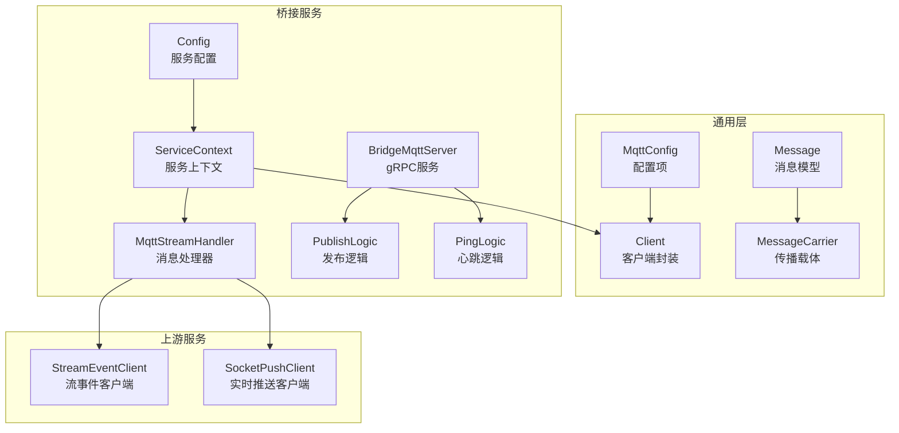
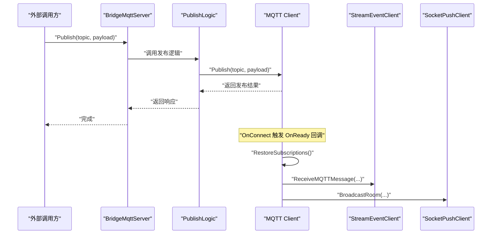
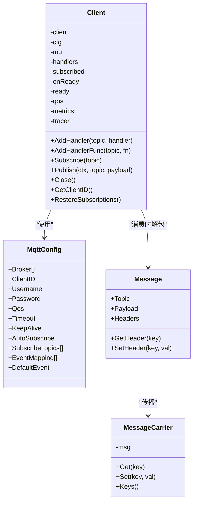
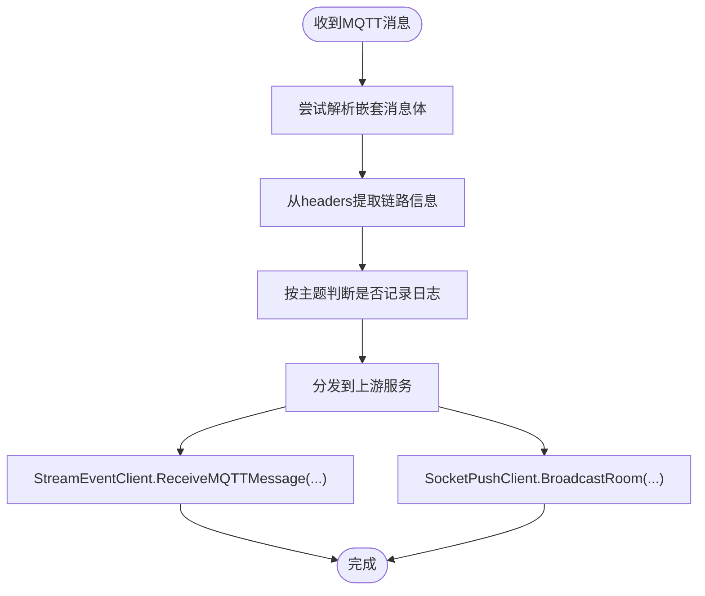
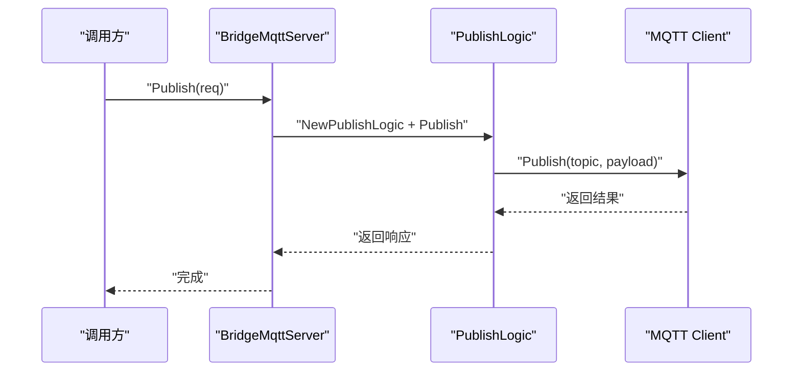
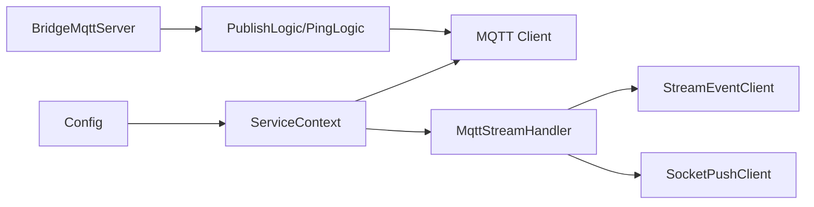
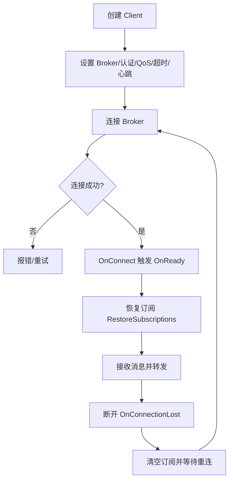

# MQTT 客户端管理

<cite>
**本文引用的文件**
- [common/mqttx/mqttx.go](file://common/mqttx/mqttx.go)
- [common/mqttx/message.go](file://common/mqttx/message.go)
- [common/mqttx/trace.go](file://common/mqttx/trace.go)
- [app/bridgemqtt/etc/bridgemqtt.yaml](file://app/bridgemqtt/etc/bridgemqtt.yaml)
- [app/bridgemqtt/internal/config/config.go](file://app/bridgemqtt/internal/config/config.go)
- [app/bridgemqtt/internal/svc/servicecontext.go](file://app/bridgemqtt/internal/svc/servicecontext.go)
- [app/bridgemqtt/internal/handler/mqttstreamhandler.go](file://app/bridgemqtt/internal/handler/mqttstreamhandler.go)
- [app/bridgemqtt/internal/server/bridgemqttserver.go](file://app/bridgemqtt/internal/server/bridgemqttserver.go)
- [app/bridgemqtt/internal/logic/publishlogic.go](file://app/bridgemqtt/internal/logic/publishlogic.go)
- [app/bridgemqtt/internal/logic/pinglogic.go](file://app/bridgemqtt/internal/logic/pinglogic.go)
- [app/bridgemqtt/bridgemqtt.go](file://app/bridgemqtt/bridgemqtt.go)
- [facade/streamevent/internal/logic/receivemqttmessagelogic.go](file://facade/streamevent/internal/logic/receivemqttmessagelogic.go)
</cite>

## 目录
1. [简介](#简介)
2. [项目结构](#项目结构)
3. [核心组件](#核心组件)
4. [架构总览](#架构总览)
5. [详细组件分析](#详细组件分析)
6. [依赖分析](#依赖分析)
7. [性能考虑](#性能考虑)
8. [故障排查指南](#故障排查指南)
9. [结论](#结论)
10. [附录](#附录)

## 简介
本技术文档围绕仓库中的 MQTT 客户端管理能力进行系统化梳理，覆盖客户端生命周期、连接与断开处理、标识符与认证、TLS 配置、状态监控、心跳与自动重连、会话与遗嘱、并发与资源管理、性能优化、配置模板与参数调优、故障诊断以及多客户端场景下的负载均衡与故障转移实践建议。文档以代码为依据，结合架构图与流程图，帮助读者快速理解并落地 MQTT 客户端在本项目中的使用方式。

## 项目结构
与 MQTT 客户端管理直接相关的模块主要分布在以下位置：
- 通用 MQTT 客户端封装：common/mqttx
- 桥接服务（bridgemqtt）：app/bridgemqtt
- 上游事件推送与实时推送：facade/streamevent、socketapp/socketpush
- 配置与运行入口：app/bridgemqtt/etc、app/bridgemqtt/bridgemqtt.go

图表来源
- [common/mqttx/mqttx.go:51-87](file://common/mqttx/mqttx.go#L51-L87)
- [app/bridgemqtt/internal/config/config.go:9-23](file://app/bridgemqtt/internal/config/config.go#L9-L23)
- [app/bridgemqtt/internal/svc/servicecontext.go:16-59](file://app/bridgemqtt/internal/svc/servicecontext.go#L16-L59)
- [app/bridgemqtt/internal/handler/mqttstreamhandler.go:99-119](file://app/bridgemqtt/internal/handler/mqttstreamhandler.go#L99-L119)
- [app/bridgemqtt/internal/server/bridgemqttserver.go:15-42](file://app/bridgemqtt/internal/server/bridgemqttserver.go#L15-L42)

章节来源
- [app/bridgemqtt/etc/bridgemqtt.yaml:1-48](file://app/bridgemqtt/etc/bridgemqtt.yaml#L1-L48)
- [app/bridgemqtt/bridgemqtt.go:28-71](file://app/bridgemqtt/bridgemqtt.go#L28-L71)

## 核心组件
- 通用 MQTT 客户端封装
  - MqttConfig：定义 Broker 地址、ClientID、用户名密码、QoS、超时、心跳、自动订阅、初始订阅主题、事件映射、默认事件等。
  - Client：封装 paho 客户端，提供连接、订阅、发布、关闭、处理器注册、自动重连、订阅恢复、指标与链路追踪等能力。
  - Message/MessageCarrier：支持在消息中携带 headers 并通过 OpenTelemetry 文本传播。
- 桥接服务
  - Config：聚合 RPC 服务配置、Nacos 注册配置、MQTT 配置、上游服务客户端配置。
  - ServiceContext：初始化日志、构建上游客户端、创建并启动 MQTT 客户端，并在 OnReady 回调中注册消息处理器。
  - MqttStreamHandler：将 MQTT 消息转发至流事件与实时推送服务，支持按主题的日志开关与去噪。
  - BridgeMqttServer/PublishLogic/PingLogic：提供 gRPC 接口用于外部发布消息与健康检查。
- 配置与运行
  - bridgemqtt.yaml：服务监听、日志、Nacos 注册、MQTT 连接参数、上游服务地址等。
  - bridgemqtt.go：加载配置、注册服务、可选 Nacos 注册、启动 RPC 服务器。

章节来源
- [common/mqttx/mqttx.go:51-178](file://common/mqttx/mqttx.go#L51-L178)
- [common/mqttx/message.go:3-30](file://common/mqttx/message.go#L3-L30)
- [common/mqttx/trace.go:8-31](file://common/mqttx/trace.go#L8-L31)
- [app/bridgemqtt/internal/config/config.go:9-23](file://app/bridgemqtt/internal/config/config.go#L9-L23)
- [app/bridgemqtt/internal/svc/servicecontext.go:21-60](file://app/bridgemqtt/internal/svc/servicecontext.go#L21-L60)
- [app/bridgemqtt/internal/handler/mqttstreamhandler.go:99-188](file://app/bridgemqtt/internal/handler/mqttstreamhandler.go#L99-L188)
- [app/bridgemqtt/etc/bridgemqtt.yaml:19-48](file://app/bridgemqtt/etc/bridgemqtt.yaml#L19-L48)
- [app/bridgemqtt/bridgemqtt.go:28-71](file://app/bridgemqtt/bridgemqtt.go#L28-L71)

## 架构总览
下图展示从桥接服务到 MQTT 客户端、再到上游服务的整体交互路径，以及消息消费与转发的关键节点。

图表来源
- [app/bridgemqtt/internal/server/bridgemqttserver.go:26-41](file://app/bridgemqtt/internal/server/bridgemqttserver.go#L26-L41)
- [app/bridgemqtt/internal/logic/publishlogic.go:27-33](file://app/bridgemqtt/internal/logic/publishlogic.go#L27-L33)
- [app/bridgemqtt/internal/svc/servicecontext.go:48-55](file://app/bridgemqtt/internal/svc/servicecontext.go#L48-L55)
- [app/bridgemqtt/internal/handler/mqttstreamhandler.go:140-187](file://app/bridgemqtt/internal/handler/mqttstreamhandler.go#L140-L187)

## 详细组件分析

### 通用 MQTT 客户端封装（Client）
- 生命周期与连接
  - 构造阶段：校验 Broker、生成 ClientID、设置超时与心跳、配置自动重连、设置连接回调与断开回调、建立连接并等待超时。
  - OnConnect：首次连接成功后触发 OnReady 回调；随后尝试恢复订阅。
  - OnConnectionLost：断开时清空已订阅集合，等待重连后重新订阅。
  - Close：优雅断开连接并清理订阅状态。
- 订阅与消息处理
  - AddHandler/AddHandlerFunc：注册主题处理器；若 AutoSubscribe 且已连接则立即订阅。
  - Subscribe/RestoreSubscriptions：手动或恢复订阅；内部使用 QoS 与超时控制。
  - messageHandlerWrapper：统一的消息解包、链路提取、日志与指标记录、panic 捕获与 span 结束。
- 发布与可观测性
  - Publish：带超时与错误 span 记录；支持 OpenTelemetry Producer Span。
  - startConsumeSpan/startPublishSpan：分别在消费与发布路径上打点，附带 topic、message_id、qos、client_id 等属性。
- 并发与资源
  - 使用互斥锁保护处理器表与订阅状态；内部使用统计指标与 tracer。
- 会话与遗嘱
  - 当前实现未显式设置 CleanSession/Will；如需会话持久化或遗嘱，请在 Broker 端或扩展配置中补充。

图表来源
- [common/mqttx/mqttx.go:76-178](file://common/mqttx/mqttx.go#L76-L178)
- [common/mqttx/mqttx.go:258-307](file://common/mqttx/mqttx.go#L258-L307)
- [common/mqttx/mqttx.go:310-342](file://common/mqttx/mqttx.go#L310-L342)
- [common/mqttx/mqttx.go:362-388](file://common/mqttx/mqttx.go#L362-L388)
- [common/mqttx/message.go:3-30](file://common/mqttx/message.go#L3-L30)
- [common/mqttx/trace.go:8-31](file://common/mqttx/trace.go#L8-L31)

章节来源
- [common/mqttx/mqttx.go:98-178](file://common/mqttx/mqttx.go#L98-L178)
- [common/mqttx/mqttx.go:180-255](file://common/mqttx/mqttx.go#L180-L255)
- [common/mqttx/mqttx.go:258-307](file://common/mqttx/mqttx.go#L258-L307)
- [common/mqttx/mqttx.go:310-342](file://common/mqttx/mqttx.go#L310-L342)
- [common/mqttx/mqttx.go:362-388](file://common/mqttx/mqttx.go#L362-L388)

### 桥接服务（ServiceContext 与 Handler）
- 服务上下文
  - 初始化日志、构建上游 StreamEvent 与 SocketPush 客户端（含最大消息大小配置），创建 MQTT 客户端并在 OnReady 中注册处理器。
- 消息处理器
  - MqttStreamHandler：按主题进行日志去噪与 payload 开关；异步调度转发至上游服务；支持事件映射匹配。
  - 任务执行器：使用固定并发的任务运行器，避免阻塞消息处理主循环。

图表来源
- [app/bridgemqtt/internal/handler/mqttstreamhandler.go:130-188](file://app/bridgemqtt/internal/handler/mqttstreamhandler.go#L130-L188)
- [app/bridgemqtt/internal/svc/servicecontext.go:48-55](file://app/bridgemqtt/internal/svc/servicecontext.go#L48-L55)

章节来源
- [app/bridgemqtt/internal/svc/servicecontext.go:21-60](file://app/bridgemqtt/internal/svc/servicecontext.go#L21-L60)
- [app/bridgemqtt/internal/handler/mqttstreamhandler.go:99-188](file://app/bridgemqtt/internal/handler/mqttstreamhandler.go#L99-L188)

### gRPC 接口与逻辑
- BridgeMqttServer：提供 Ping、Publish、PublishWithTrace 三个接口。
- PublishLogic：调用 MQTT 客户端发布消息。
- PingLogic：简单返回 Pong，用于健康检查。

图表来源
- [app/bridgemqtt/internal/server/bridgemqttserver.go:31-41](file://app/bridgemqtt/internal/server/bridgemqttserver.go#L31-L41)
- [app/bridgemqtt/internal/logic/publishlogic.go:27-33](file://app/bridgemqtt/internal/logic/publishlogic.go#L27-L33)

章节来源
- [app/bridgemqtt/internal/server/bridgemqttserver.go:15-42](file://app/bridgemqtt/internal/server/bridgemqttserver.go#L15-L42)
- [app/bridgemqtt/internal/logic/pinglogic.go:26-30](file://app/bridgemqtt/internal/logic/pinglogic.go#L26-L30)
- [app/bridgemqtt/internal/logic/publishlogic.go:27-33](file://app/bridgemqtt/internal/logic/publishlogic.go#L27-L33)

## 依赖分析
- 组件耦合
  - ServiceContext 对 MQTT 客户端、上游客户端与配置存在强依赖；Handler 依赖 MQTT 客户端与上游客户端。
  - Server 仅作为逻辑门面，依赖具体逻辑层。
- 外部依赖
  - MQTT 客户端库、OpenTelemetry、go-zero 日志与指标、gRPC 客户端封装。
- 可能的循环依赖
  - 未发现直接循环依赖；模块边界清晰。

图表来源
- [app/bridgemqtt/internal/config/config.go:9-23](file://app/bridgemqtt/internal/config/config.go#L9-L23)
- [app/bridgemqtt/internal/svc/servicecontext.go:16-59](file://app/bridgemqtt/internal/svc/servicecontext.go#L16-L59)
- [app/bridgemqtt/internal/server/bridgemqttserver.go:15-42](file://app/bridgemqtt/internal/server/bridgemqttserver.go#L15-L42)

章节来源
- [app/bridgemqtt/internal/config/config.go:9-23](file://app/bridgemqtt/internal/config/config.go#L9-L23)
- [app/bridgemqtt/internal/svc/servicecontext.go:21-60](file://app/bridgemqtt/internal/svc/servicecontext.go#L21-L60)
- [app/bridgemqtt/internal/server/bridgemqttserver.go:15-42](file://app/bridgemqtt/internal/server/bridgemqttserver.go#L15-L42)

## 性能考虑
- 并发与限速
  - Handler 使用任务运行器并发处理，避免阻塞；可根据消息吞吐量调整并发度。
  - TopicLogManager 提供按主题的日志去噪，降低高频日志对性能的影响。
- 发布与订阅
  - 发布与订阅均设置超时，防止阻塞；建议根据网络状况调整超时与心跳参数。
  - QoS 选择影响可靠性与性能，建议在业务允许范围内选择合适值。
- 上游调用
  - gRPC 客户端设置了最大发送消息大小，避免大包导致内存压力。
- 指标与追踪
  - 内置指标统计与 span 打点，便于定位慢调用与异常。

章节来源
- [app/bridgemqtt/internal/handler/mqttstreamhandler.go:114-118](file://app/bridgemqtt/internal/handler/mqttstreamhandler.go#L114-L118)
- [app/bridgemqtt/internal/handler/mqttstreamhandler.go:32-92](file://app/bridgemqtt/internal/handler/mqttstreamhandler.go#L32-L92)
- [app/bridgemqtt/internal/svc/servicecontext.go:29-45](file://app/bridgemqtt/internal/svc/servicecontext.go#L29-L45)
- [common/mqttx/mqttx.go:310-342](file://common/mqttx/mqttx.go#L310-L342)

## 故障排查指南
- 连接失败
  - 检查 Broker 地址、用户名密码、超时与心跳配置；确认 OnConnect 回调是否触发。
  - 若连接超时，适当增大 Timeout 或检查网络连通性。
- 断开与重连
  - OnConnectionLost 会清空订阅集合，待重连后自动恢复订阅；若未恢复，检查 RestoreSubscriptions 流程。
- 订阅失败
  - 订阅超时或错误会返回错误；确认主题格式与权限。
- 发布失败
  - 发布超时或错误会记录 span 错误；检查目标主题与 Broker 状态。
- 无处理器
  - 若主题无处理器，将触发默认处理器记录错误；请使用 AddHandler 注册对应处理器。
- 日志与追踪
  - 查看 span 属性（topic、message_id、qos、client_id）与指标统计，定位异常。

章节来源
- [common/mqttx/mqttx.go:148-166](file://common/mqttx/mqttx.go#L148-L166)
- [common/mqttx/mqttx.go:236-255](file://common/mqttx/mqttx.go#L236-L255)
- [common/mqttx/mqttx.go:310-342](file://common/mqttx/mqttx.go#L310-L342)
- [common/mqttx/mqttx.go:293-305](file://common/mqttx/mqttx.go#L293-L305)

## 结论
本项目提供了完整、可扩展的 MQTT 客户端管理能力：从通用封装到桥接服务，再到上游集成与可观测性，形成了一条清晰的链路。通过合理的配置、并发与资源管理策略，可在生产环境中稳定运行。对于会话持久化与 TLS 安全连接，建议在现有配置基础上扩展相应参数与证书配置。

## 附录

### 客户端生命周期与连接流程

图表来源
- [common/mqttx/mqttx.go:98-178](file://common/mqttx/mqttx.go#L98-L178)
- [common/mqttx/mqttx.go:148-166](file://common/mqttx/mqttx.go#L148-L166)
- [common/mqttx/mqttx.go:236-255](file://common/mqttx/mqttx.go#L236-L255)

### 配置模板与参数说明
- 服务配置（bridgemqtt.yaml）
  - Name、ListenOn、Timeout、Log、NacosConfig、MqttConfig、SocketPushConf 等。
  - MqttConfig 关键项：Broker、ClientID（可省略）、Username、Password、Qos、Timeout、KeepAlive、AutoSubscribe、SubscribeTopics、EventMapping、DefaultEvent。
- 服务上下文配置（config.go）
  - 聚合 RPC 服务配置、Nacos 注册配置、MQTT 配置、上游服务客户端配置。

章节来源
- [app/bridgemqtt/etc/bridgemqtt.yaml:1-48](file://app/bridgemqtt/etc/bridgemqtt.yaml#L1-L48)
- [app/bridgemqtt/internal/config/config.go:9-23](file://app/bridgemqtt/internal/config/config.go#L9-L23)

### 认证与安全连接
- 用户名密码认证：在 MqttConfig 中设置 Username 与 Password。
- TLS 安全连接：当前通用封装未显式暴露 TLS 配置项；如需启用，请在 Broker 地址中使用 TLS 协议，并在 paho 客户端选项中增加 TLS 参数（例如在扩展封装中添加）。

章节来源
- [common/mqttx/mqttx.go:137-146](file://common/mqttx/mqttx.go#L137-L146)
- [app/bridgemqtt/etc/bridgemqtt.yaml:19-25](file://app/bridgemqtt/etc/bridgemqtt.yaml#L19-L25)

### 心跳检测与自动重连
- 心跳：KeepAlive 控制心跳间隔；Broker 端应与该值匹配。
- 自动重连：SetAutoReconnect 已开启；断开后清空订阅集合，重连后恢复订阅。
- 建议：根据网络波动调整 KeepAlive 与 Timeout，确保在弱网环境下仍能维持连接。

章节来源
- [common/mqttx/mqttx.go:144-146](file://common/mqttx/mqttx.go#L144-L146)
- [common/mqttx/mqttx.go:161-166](file://common/mqttx/mqttx.go#L161-L166)
- [common/mqttx/mqttx.go:236-255](file://common/mqttx/mqttx.go#L236-L255)

### 会话管理、遗嘱消息与清理
- 会话管理：当前未设置 CleanSession/Will；如需持久会话或遗嘱，请在扩展封装中补充相应选项。
- 清理工作：Close 时断开连接并清空订阅状态；OnConnectionLost 也会清空订阅集合以便重连后恢复。

章节来源
- [common/mqttx/mqttx.go:336-342](file://common/mqttx/mqttx.go#L336-L342)
- [common/mqttx/mqttx.go:161-166](file://common/mqttx/mqttx.go#L161-L166)

### 并发连接限制与资源管理
- 并发：Handler 使用任务运行器并发处理；可根据业务调整并发度。
- 资源：Client 内置指标与 tracer；注意合理设置超时与心跳，避免资源泄露。
- 上游：gRPC 客户端设置最大发送消息大小，防止大包占用过多内存。

章节来源
- [app/bridgemqtt/internal/handler/mqttstreamhandler.go:114-118](file://app/bridgemqtt/internal/handler/mqttstreamhandler.go#L114-L118)
- [app/bridgemqtt/internal/svc/servicecontext.go:29-45](file://app/bridgemqtt/internal/svc/servicecontext.go#L29-L45)

### 多客户端场景下的负载均衡与故障转移
- 负载均衡：可通过多个桥接实例横向扩展，结合 Nacos 注册与客户端路由实现流量分摊。
- 故障转移：利用自动重连与订阅恢复机制，在单实例故障时由其他实例接管订阅；建议配合健康检查与熔断策略。

章节来源
- [app/bridgemqtt/etc/bridgemqtt.yaml:11-18](file://app/bridgemqtt/etc/bridgemqtt.yaml#L11-L18)
- [app/bridgemqtt/bridgemqtt.go:46-64](file://app/bridgemqtt/bridgemqtt.go#L46-L64)

### 故障诊断方法
- 关键日志：连接成功、连接丢失、订阅恢复、发布超时、无处理器等。
- 指标与追踪：查看 span 属性与耗时统计，定位慢调用与异常。
- 上游调用：关注 StreamEvent 与 SocketPush 的调用耗时与成功率。

章节来源
- [common/mqttx/mqttx.go:148-166](file://common/mqttx/mqttx.go#L148-L166)
- [common/mqttx/mqttx.go:236-255](file://common/mqttx/mqttx.go#L236-L255)
- [common/mqttx/mqttx.go:310-342](file://common/mqttx/mqttx.go#L310-L342)
- [app/bridgemqtt/internal/handler/mqttstreamhandler.go:140-187](file://app/bridgemqtt/internal/handler/mqttstreamhandler.go#L140-L187)