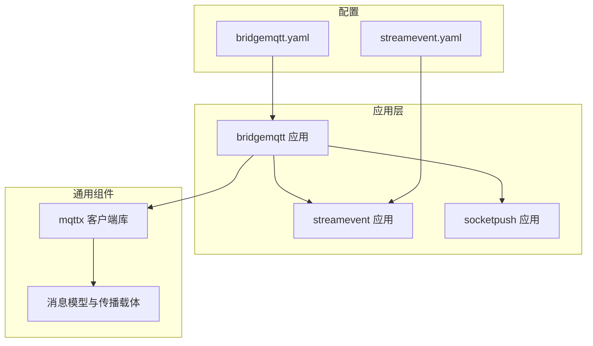
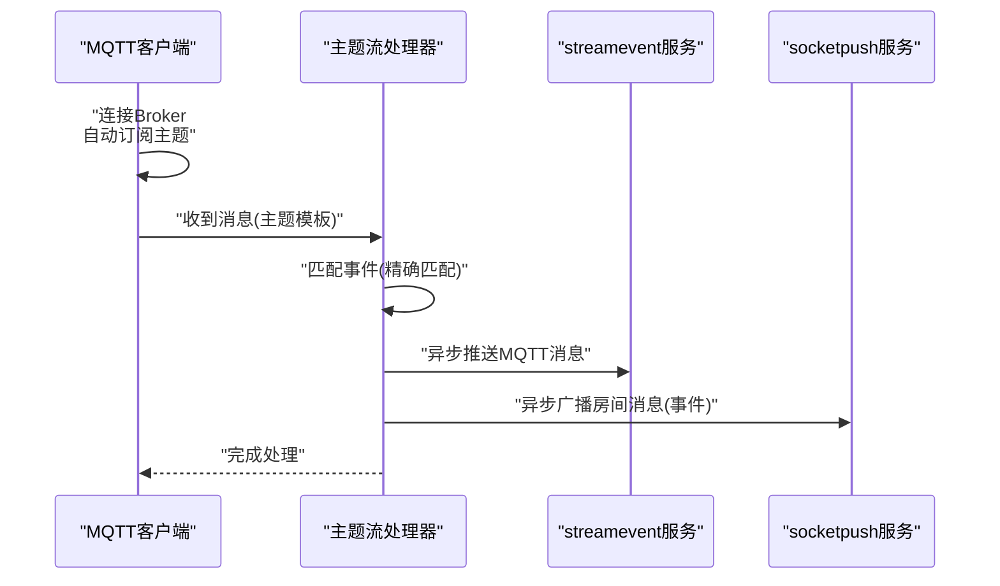
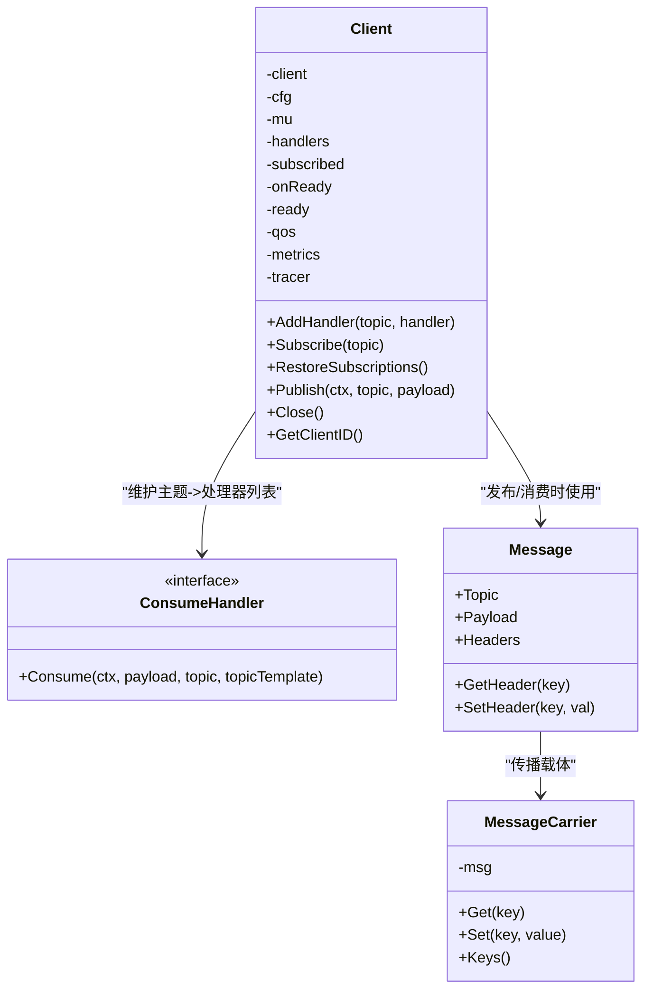
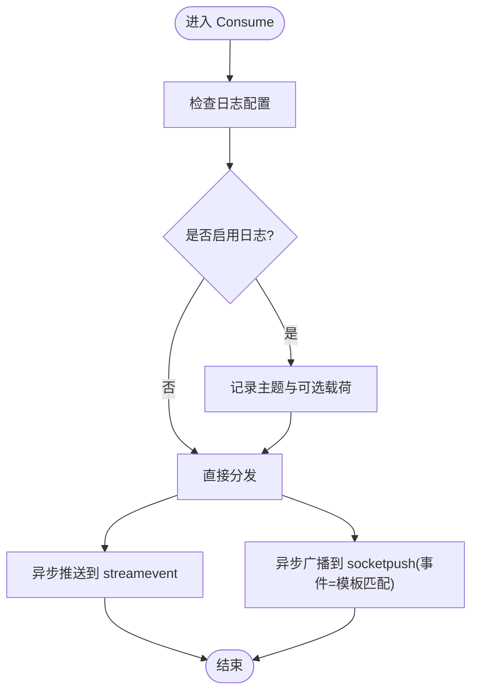
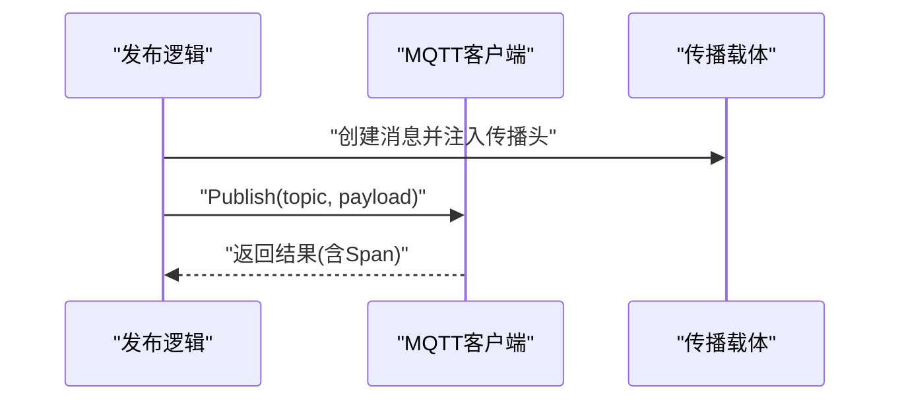
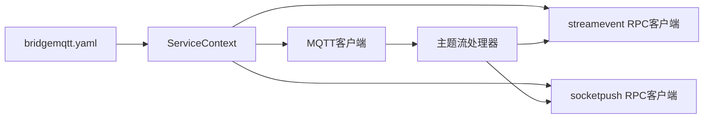
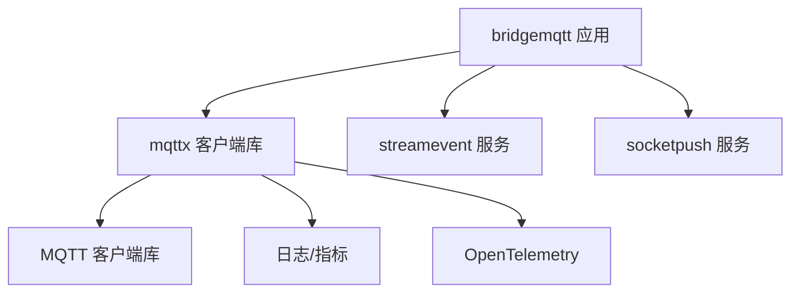

# 主题订阅与路由

<cite>
**本文引用的文件**
- [common/mqttx/mqttx.go](file://common/mqttx/mqttx.go)
- [common/mqttx/message.go](file://common/mqttx/message.go)
- [common/mqttx/trace.go](file://common/mqttx/trace.go)
- [app/bridgemqtt/internal/handler/mqttstreamhandler.go](file://app/bridgemqtt/internal/handler/mqttstreamhandler.go)
- [app/bridgemqtt/internal/logic/publishlogic.go](file://app/bridgemqtt/internal/logic/publishlogic.go)
- [app/bridgemqtt/internal/logic/publishwithtracelogic.go](file://app/bridgemqtt/internal/logic/publishwithtracelogic.go)
- [app/bridgemqtt/internal/svc/servicecontext.go](file://app/bridgemqtt/internal/svc/servicecontext.go)
- [app/bridgemqtt/etc/bridgemqtt.yaml](file://app/bridgemqtt/etc/bridgemqtt.yaml)
- [facade/streamevent/etc/streamevent.yaml](file://facade/streamevent/etc/streamevent.yaml)
- [facade/streamevent/internal/logic/receivemqttmessagelogic.go](file://facade/streamevent/internal/logic/receivemqttmessagelogic.go)
- [socketapp/socketpush/socketpush.proto](file://socketapp/socketpush/socketpush.proto)
</cite>

## 目录
1. [简介](#简介)
2. [项目结构](#项目结构)
3. [核心组件](#核心组件)
4. [架构总览](#架构总览)
5. [详细组件分析](#详细组件分析)
6. [依赖分析](#依赖分析)
7. [性能考虑](#性能考虑)
8. [故障排除指南](#故障排除指南)
9. [结论](#结论)
10. [附录](#附录)

## 简介
本技术文档围绕MQTT主题订阅与路由展开，系统性阐述主题层次结构、通配符订阅与精确匹配机制、主题过滤规则、订阅优先级与消息路由策略；并结合仓库中的桥接组件，给出主题命名规范、权限控制与访问管理建议、动态订阅与批量订阅管理、订阅状态跟踪、路由算法与消息分发机制、负载均衡策略、最佳实践、性能优化与监控指标，以及复杂订阅场景的实现方案与故障排除指南。

## 项目结构
本项目采用多模块微服务架构，MQTT桥接能力集中在“bridgemqtt”应用中，通过统一的MQTT客户端封装与事件映射，将消息分发至“streamevent”与“socketpush”等下游服务。配置文件集中于etc目录，便于按环境切换。

图表来源
- [app/bridgemqtt/etc/bridgemqtt.yaml:1-48](file://app/bridgemqtt/etc/bridgemqtt.yaml#L1-L48)
- [facade/streamevent/etc/streamevent.yaml:1-28](file://facade/streamevent/etc/streamevent.yaml#L1-L28)
- [common/mqttx/mqttx.go:1-389](file://common/mqttx/mqttx.go#L1-L389)
- [common/mqttx/message.go:1-30](file://common/mqttx/message.go#L1-L30)
- [common/mqttx/trace.go:1-31](file://common/mqttx/trace.go#L1-L31)

章节来源
- [app/bridgemqtt/etc/bridgemqtt.yaml:1-48](file://app/bridgemqtt/etc/bridgemqtt.yaml#L1-L48)
- [facade/streamevent/etc/streamevent.yaml:1-28](file://facade/streamevent/etc/streamevent.yaml#L1-L28)

## 核心组件
- MQTT客户端封装：提供连接、订阅、发布、处理器注册、自动订阅恢复、追踪埋点与指标统计。
- 主题流处理器：负责将收到的消息路由到下游服务，并支持事件映射与日志管理。
- 消息模型与传播载体：封装MQTT消息体、头部与OpenTelemetry传播。
- 服务上下文：负责读取配置、初始化MQTT客户端、注册处理器与下游客户端。

章节来源
- [common/mqttx/mqttx.go:1-389](file://common/mqttx/mqttx.go#L1-L389)
- [app/bridgemqtt/internal/handler/mqttstreamhandler.go:1-254](file://app/bridgemqtt/internal/handler/mqttstreamhandler.go#L1-L254)
- [common/mqttx/message.go:1-30](file://common/mqttx/message.go#L1-L30)
- [common/mqttx/trace.go:1-31](file://common/mqttx/trace.go#L1-L31)
- [app/bridgemqtt/internal/svc/servicecontext.go:1-61](file://app/bridgemqtt/internal/svc/servicecontext.go#L1-L61)

## 架构总览
MQTT桥接流程概览：MQTT客户端连接Broker，按配置自动订阅主题；消息到达后，经由消息处理包装器解析与追踪注入，再根据主题模板匹配事件，异步投递到streamevent与socketpush服务。

图表来源
- [common/mqttx/mqttx.go:257-307](file://common/mqttx/mqttx.go#L257-L307)
- [app/bridgemqtt/internal/handler/mqttstreamhandler.go:130-188](file://app/bridgemqtt/internal/handler/mqttstreamhandler.go#L130-L188)

## 详细组件分析

### 组件A：MQTT客户端与订阅管理
- 功能要点
  - 配置化连接：支持Broker地址、用户名密码、QoS、心跳、超时等参数。
  - 自动订阅：在连接成功或恢复时，基于已注册处理器与初始订阅列表进行恢复。
  - 处理器注册：为主题绑定多个处理器，消息到达时依次调用。
  - 消息处理包装：解析嵌套消息载荷、提取追踪上下文、记录指标与异常。
  - 发布与追踪：发布消息时启动生产者Span，注入传播头，支持带TraceId发布。
  - 生命周期：连接丢失时清空订阅状态，重连后恢复订阅。

图表来源
- [common/mqttx/mqttx.go:76-389](file://common/mqttx/mqttx.go#L76-L389)
- [common/mqttx/message.go:3-30](file://common/mqttx/message.go#L3-L30)
- [common/mqttx/trace.go:8-31](file://common/mqttx/trace.go#L8-L31)

章节来源
- [common/mqttx/mqttx.go:51-64](file://common/mqttx/mqttx.go#L51-L64)
- [common/mqttx/mqttx.go:180-202](file://common/mqttx/mqttx.go#L180-L202)
- [common/mqttx/mqttx.go:204-255](file://common/mqttx/mqttx.go#L204-L255)
- [common/mqttx/mqttx.go:257-307](file://common/mqttx/mqttx.go#L257-L307)
- [common/mqttx/mqttx.go:309-333](file://common/mqttx/mqttx.go#L309-L333)
- [common/mqttx/mqttx.go:361-389](file://common/mqttx/mqttx.go#L361-L389)

### 组件B：主题流处理器与事件映射
- 功能要点
  - 日志管理：按主题维度控制日志频率与是否打印载荷。
  - 事件映射：将主题模板与事件名进行精确匹配，未命中时回退默认事件。
  - 异步分发：通过任务运行器并发投递消息到streamevent与socketpush。
  - 广播房间：将消息按事件与房间（主题模板）广播给前端。

图表来源
- [app/bridgemqtt/internal/handler/mqttstreamhandler.go:130-188](file://app/bridgemqtt/internal/handler/mqttstreamhandler.go#L130-L188)
- [app/bridgemqtt/internal/handler/mqttstreamhandler.go:121-128](file://app/bridgemqtt/internal/handler/mqttstreamhandler.go#L121-L128)

章节来源
- [app/bridgemqtt/internal/handler/mqttstreamhandler.go:19-97](file://app/bridgemqtt/internal/handler/mqttstreamhandler.go#L19-L97)
- [app/bridgemqtt/internal/handler/mqttstreamhandler.go:121-128](file://app/bridgemqtt/internal/handler/mqttstreamhandler.go#L121-L128)
- [app/bridgemqtt/internal/handler/mqttstreamhandler.go:130-188](file://app/bridgemqtt/internal/handler/mqttstreamhandler.go#L130-L188)

### 组件C：发布与追踪
- 精确发布：直接向指定主题发布字节载荷。
- 带Trace发布：将当前上下文的Trace信息注入消息头，便于跨服务追踪。

图表来源
- [app/bridgemqtt/internal/logic/publishlogic.go:27-33](file://app/bridgemqtt/internal/logic/publishlogic.go#L27-L33)
- [app/bridgemqtt/internal/logic/publishwithtracelogic.go:30-47](file://app/bridgemqtt/internal/logic/publishwithtracelogic.go#L30-L47)
- [common/mqttx/trace.go:16-30](file://common/mqttx/trace.go#L16-L30)
- [common/mqttx/message.go:17-29](file://common/mqttx/message.go#L17-L29)

章节来源
- [app/bridgemqtt/internal/logic/publishlogic.go:1-34](file://app/bridgemqtt/internal/logic/publishlogic.go#L1-L34)
- [app/bridgemqtt/internal/logic/publishwithtracelogic.go:1-48](file://app/bridgemqtt/internal/logic/publishwithtracelogic.go#L1-L48)
- [common/mqttx/message.go:1-30](file://common/mqttx/message.go#L1-L30)
- [common/mqttx/trace.go:1-31](file://common/mqttx/trace.go#L1-L31)

### 组件D：服务上下文与配置集成
- 读取配置：从bridgemqtt.yaml加载MQTT、streamevent、socketpush等配置。
- 初始化客户端：创建MQTT客户端并在就绪时注册处理器。
- 下游客户端：按配置创建streamevent与socketpush的RPC客户端。

图表来源
- [app/bridgemqtt/etc/bridgemqtt.yaml:19-48](file://app/bridgemqtt/etc/bridgemqtt.yaml#L19-L48)
- [app/bridgemqtt/internal/svc/servicecontext.go:21-60](file://app/bridgemqtt/internal/svc/servicecontext.go#L21-L60)

章节来源
- [app/bridgemqtt/internal/config/config.go:9-24](file://app/bridgemqtt/internal/config/config.go#L9-L24)
- [app/bridgemqtt/etc/bridgemqtt.yaml:1-48](file://app/bridgemqtt/etc/bridgemqtt.yaml#L1-L48)
- [app/bridgemqtt/internal/svc/servicecontext.go:1-61](file://app/bridgemqtt/internal/svc/servicecontext.go#L1-L61)

## 依赖分析
- 组件耦合
  - bridgemqtt应用依赖mqttx客户端库与下游服务RPC客户端。
  - mqttx库内部依赖MQTT客户端库、日志、指标与追踪库。
- 订阅与路由
  - 订阅由MQTT客户端维护，处理器由主题模板精确匹配。
  - 分发通过异步任务运行器实现解耦与并发。

图表来源
- [common/mqttx/mqttx.go:13-23](file://common/mqttx/mqttx.go#L13-L23)
- [app/bridgemqtt/internal/svc/servicecontext.go:23-46](file://app/bridgemqtt/internal/svc/servicecontext.go#L23-L46)

章节来源
- [common/mqttx/mqttx.go:13-23](file://common/mqttx/mqttx.go#L13-L23)
- [app/bridgemqtt/internal/svc/servicecontext.go:23-46](file://app/bridgemqtt/internal/svc/servicecontext.go#L23-L46)

## 性能考虑
- 并发与限流
  - 使用任务运行器对下游推送进行并发调度，避免阻塞消息处理。
  - 可根据下游服务能力调整并发度与队列长度。
- 指标与追踪
  - 客户端内置指标收集与Span埋点，便于定位耗时与错误。
- 载荷与网络
  - 发布时设置合理的发送/接收消息大小限制，避免大包阻塞。
- 订阅恢复
  - 连接丢失后清空订阅状态，重连后恢复订阅，减少重复订阅开销。

章节来源
- [app/bridgemqtt/internal/handler/mqttstreamhandler.go:140-186](file://app/bridgemqtt/internal/handler/mqttstreamhandler.go#L140-L186)
- [common/mqttx/mqttx.go:257-307](file://common/mqttx/mqttx.go#L257-L307)
- [common/mqttx/mqttx.go:361-389](file://common/mqttx/mqttx.go#L361-L389)
- [app/bridgemqtt/internal/svc/servicecontext.go:29-44](file://app/bridgemqtt/internal/svc/servicecontext.go#L29-L44)

## 故障排除指南
- 连接失败
  - 检查Broker地址、认证信息与超时配置。
  - 查看连接回调日志与错误信息。
- 订阅失败
  - 确认主题模板有效且未包含非法字符。
  - 检查自动订阅开关与初始订阅列表。
- 处理器缺失
  - 若无处理器，将触发默认处理器记录错误日志。
- 发布超时
  - 检查网络延迟与消息大小限制，适当增大超时时间。
- 追踪断链
  - 确认消息头中传播键存在且正确注入。

章节来源
- [common/mqttx/mqttx.go:100-117](file://common/mqttx/mqttx.go#L100-L117)
- [common/mqttx/mqttx.go:148-177](file://common/mqttx/mqttx.go#L148-L177)
- [common/mqttx/mqttx.go:215-233](file://common/mqttx/mqttx.go#L215-L233)
- [common/mqttx/mqttx.go:293-299](file://common/mqttx/mqttx.go#L293-L299)
- [common/mqttx/mqttx.go:318-333](file://common/mqttx/mqttx.go#L318-L333)
- [common/mqttx/trace.go:16-30](file://common/mqttx/trace.go#L16-L30)

## 结论
本方案以轻量的MQTT客户端封装为核心，结合事件映射与异步分发，实现了稳定、可观测、可扩展的主题订阅与路由能力。通过配置驱动与自动订阅恢复，满足动态与批量订阅场景；借助追踪与指标，保障线上问题快速定位与性能优化。

## 附录

### 主题层次结构与通配符
- 层次结构
  - 使用“/”分隔层级，如“iec/asdu/103”。不允许多余斜杠、不以斜杠开头或结尾。
- 通配符订阅
  - 本仓库中未直接使用paho通配符订阅，而是通过“事件映射”实现“模板匹配”的路由策略。
- 精确匹配
  - 主题模板与事件映射表中的“match”字段进行严格相等比较，未命中时回退默认事件。

章节来源
- [app/bridgemqtt/etc/bridgemqtt.yaml:26-29](file://app/bridgemqtt/etc/bridgemqtt.yaml#L26-L29)
- [app/bridgemqtt/internal/handler/mqttstreamhandler.go:121-128](file://app/bridgemqtt/internal/handler/mqttstreamhandler.go#L121-L128)

### 主题过滤规则与订阅优先级
- 过滤规则
  - 事件映射表中的“match”字段用于精确匹配主题模板；默认事件用于兜底。
- 订阅优先级
  - 优先使用事件映射表中的事件；若未配置，则使用默认事件。

章节来源
- [app/bridgemqtt/etc/bridgemqtt.yaml:30-34](file://app/bridgemqtt/etc/bridgemqtt.yaml#L30-L34)
- [app/bridgemqtt/internal/handler/mqttstreamhandler.go:121-128](file://app/bridgemqtt/internal/handler/mqttstreamhandler.go#L121-L128)

### 消息路由策略
- 路由算法
  - 基于“主题模板=事件映射.match”的精确匹配；未命中则使用默认事件。
- 分发机制
  - streamevent：异步推送MQTT消息，携带会话ID、消息ID、发送时间与主题模板。
  - socketpush：异步广播到房间（主题模板），事件名来自匹配结果。
- 负载均衡
  - 通过任务运行器并发调度，结合下游服务实例数量与队列深度实现软负载均衡。

章节来源
- [app/bridgemqtt/internal/handler/mqttstreamhandler.go:140-186](file://app/bridgemqtt/internal/handler/mqttstreamhandler.go#L140-L186)
- [socketapp/socketpush/socketpush.proto:134-177](file://socketapp/socketpush/socketpush.proto#L134-L177)

### 主题命名规范与权限控制
- 命名规范
  - 不包含MQTT通配符“+”、“#”，避免与通配符混淆。
  - 不允许多余斜杠、不以斜杠开头或结尾。
- 权限控制与访问管理
  - 建议在MQTT Broker侧配置ACL，限制主题前缀与操作权限。
  - 在应用侧通过事件映射与默认事件实现业务域隔离与降级。

章节来源
- [app/bridgemqtt/etc/bridgemqtt.yaml:26-29](file://app/bridgemqtt/etc/bridgemqtt.yaml#L26-L29)

### 动态订阅、批量订阅管理与状态跟踪
- 动态订阅
  - 通过AddHandler与Subscribe接口动态注册处理器与订阅主题。
- 批量订阅
  - 在配置中提供SubscribeTopics列表，OnReady回调中统一注册处理器。
- 状态跟踪
  - 订阅状态存储于客户端内部map；连接丢失时清空，重连后恢复。

章节来源
- [common/mqttx/mqttx.go:180-202](file://common/mqttx/mqttx.go#L180-L202)
- [common/mqttx/mqttx.go:204-255](file://common/mqttx/mqttx.go#L204-L255)
- [common/mqttx/mqttx.go:335-342](file://common/mqttx/mqttx.go#L335-L342)
- [app/bridgemqtt/internal/svc/servicecontext.go:48-55](file://app/bridgemqtt/internal/svc/servicecontext.go#L48-L55)

### 监控指标与最佳实践
- 指标
  - 客户端内置处理耗时指标；发布/消费Span记录错误与状态。
- 最佳实践
  - 合理设置QoS与超时；对高频主题启用日志节流；为关键路径开启追踪。
  - 将业务事件与主题模板解耦，通过事件映射实现灵活路由。

章节来源
- [common/mqttx/mqttx.go:274-283](file://common/mqttx/mqttx.go#L274-L283)
- [common/mqttx/mqttx.go:361-389](file://common/mqttx/mqttx.go#L361-L389)