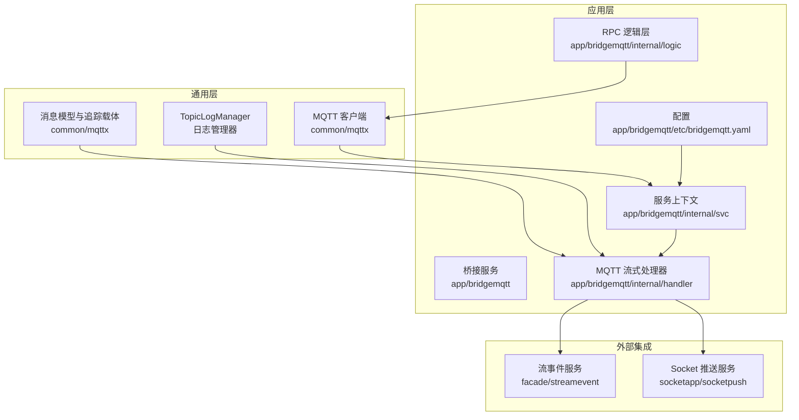
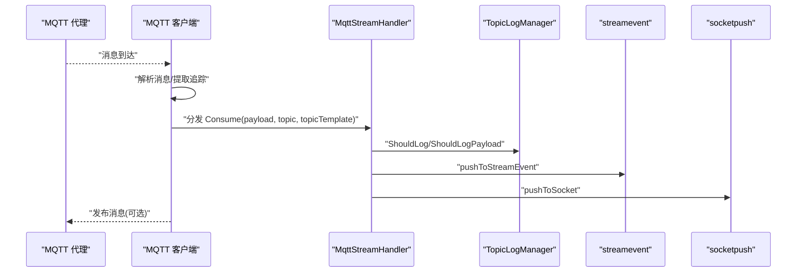
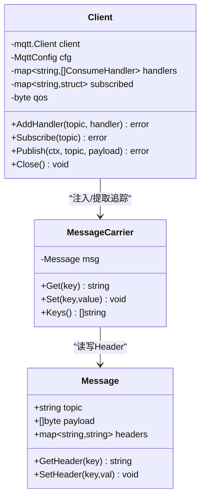
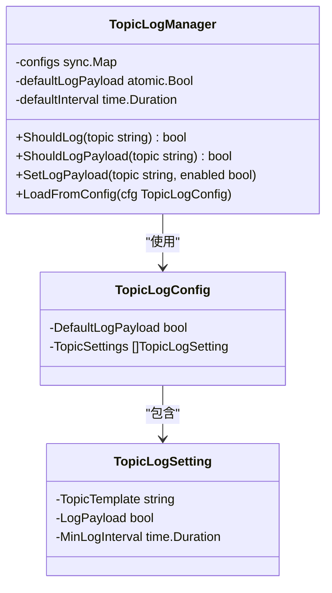
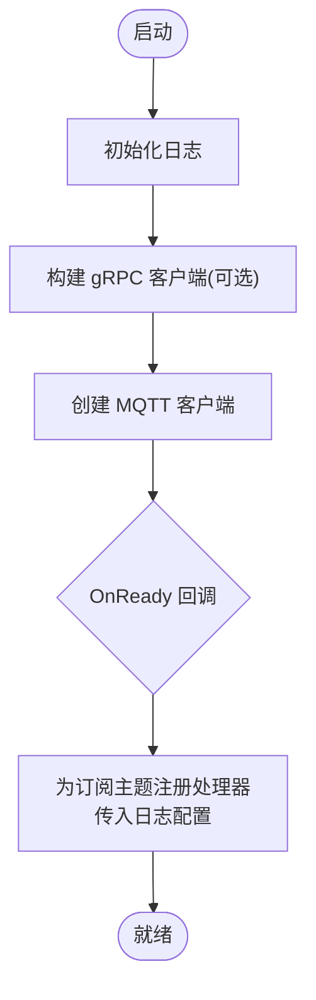
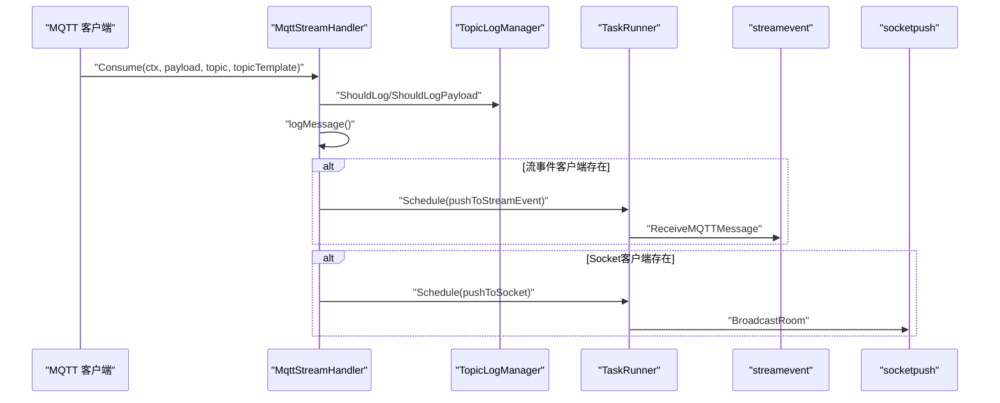
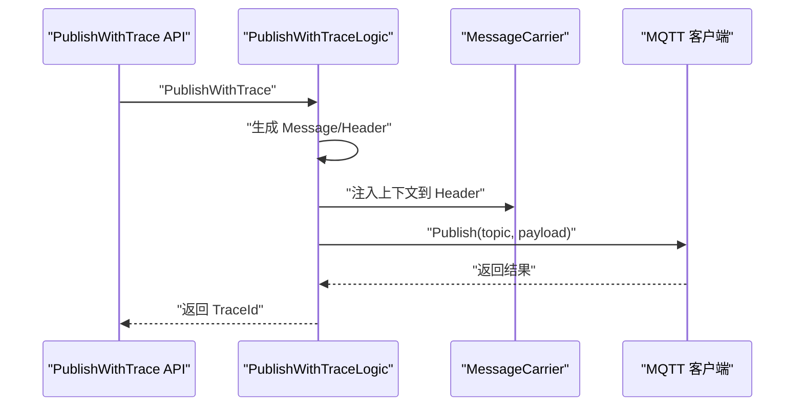
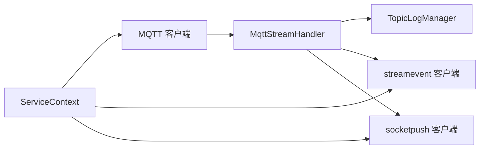

# 消息处理与传输

<cite>
**本文引用的文件**
- [topiclog.go](file://common/mqttx/topiclog.go)
- [message.go](file://common/mqttx/message.go)
- [trace.go](file://common/mqttx/trace.go)
- [client.go](file://common/mqttx/client.go)
- [bridgemqtt.yaml](file://app/bridgemqtt/etc/bridgemqtt.yaml)
- [servicecontext.go](file://app/bridgemqtt/internal/svc/servicecontext.go)
- [mqttstreamhandler.go](file://app/bridgemqtt/internal/handler/mqttstreamhandler.go)
- [publishlogic.go](file://app/bridgemqtt/internal/logic/publishlogic.go)
- [publishwithtracelogic.go](file://app/bridgemqtt/internal/logic/publishwithtracelogic.go)
- [receivemqttmessagelogic.go](file://facade/streamevent/internal/logic/receivemqttmessagelogic.go)
- [broadcastroomlogic.go](file://socketapp/socketpush/internal/logic/broadcastroomlogic.go)
- [stat_analyzer.html](file://deploy/stat_analyzer.html)
</cite>

## 更新摘要
**所做更改**
- 重构消息处理架构，将日志、流事件推送、Socket广播分离为独立方法
- 引入TopicLogManager集成，实现精细化日志控制
- 优化消息处理流程，提升系统可维护性和扩展性

## 目录
1. [引言](#引言)
2. [项目结构](#项目结构)
3. [核心组件](#核心组件)
4. [架构总览](#架构总览)
5. [详细组件分析](#详细组件分析)
6. [依赖分析](#依赖分析)
7. [性能考虑](#性能考虑)
8. [故障排查指南](#故障排查指南)
9. [结论](#结论)
10. [附录](#附录)

## 引言
本技术文档围绕 MQTT 消息处理与传输展开，覆盖消息的完整生命周期：接收、解析、转发、追踪与可观测性、日志与性能统计、以及错误处理与重试策略。文档以仓库中的实际实现为依据，结合架构图与流程图，帮助读者快速理解系统设计、数据流与关键机制。

**更新** 本次更新反映了应用架构的重大重构，将日志、流事件推送、Socket广播分离为独立方法，并引入了TopicLogManager集成，提升了系统的模块化程度和可维护性。

## 项目结构
本项目采用多模块分层组织，MQTT 相关能力集中在 common/mqttx 提供通用客户端与消息模型，应用侧 app/bridgemqtt 提供 RPC 服务与业务逻辑，facade/streamevent 与 socketapp/socketpush 分别负责消息上送与实时推送，etc 下的 YAML 提供运行期配置。

**图表来源**
- [client.go:1-200](file://common/mqttx/client.go#L1-L200)
- [bridgemqtt.yaml:1-56](file://app/bridgemqtt/etc/bridgemqtt.yaml#L1-L56)
- [servicecontext.go:1-61](file://app/bridgemqtt/internal/svc/servicecontext.go#L1-L61)
- [mqttstreamhandler.go:1-128](file://app/bridgemqtt/internal/handler/mqttstreamhandler.go#L1-L128)
- [publishlogic.go:1-34](file://app/bridgemqtt/internal/logic/publishlogic.go#L1-L34)
- [publishwithtracelogic.go:1-48](file://app/bridgemqtt/internal/logic/publishwithtracelogic.go#L1-L48)

**章节来源**
- [bridgemqtt.yaml:1-56](file://app/bridgemqtt/etc/bridgemqtt.yaml#L1-L56)

## 核心组件
- MQTT 客户端与消息模型
  - 通用客户端封装了连接、订阅、发布、处理器注册、追踪与指标等能力。
  - 消息模型支持自定义头部，便于携带追踪上下文。
- TopicLogManager 日志管理器
  - 新增的日志管理器，支持按主题模板配置日志策略，包括最小日志间隔和是否记录Payload。
  - 提供默认配置和动态配置加载功能。
- 应用桥接服务
  - 通过服务上下文初始化 MQTT 客户端，并在 OnReady 回调中注册处理器。
  - 提供带 Trace 的发布与普通发布逻辑。
- 流式处理器
  - 将 MQTT 消息投递到流事件与 Socket 推送服务，支持任务并发与日志管理。
  - 现已分离为独立的日志记录、流事件推送和Socket广播方法。
- 外部集成
  - 流事件服务用于接收 MQTT 消息并进行后续处理。
  - Socket 推送服务将消息广播到指定房间。

**章节来源**
- [topiclog.go:1-143](file://common/mqttx/topiclog.go#L1-L143)
- [client.go:32-46](file://common/mqttx/client.go#L32-L46)
- [message.go:1-38](file://common/mqttx/message.go#L1-L38)
- [trace.go:1-37](file://common/mqttx/trace.go#L1-L37)
- [servicecontext.go:16-61](file://app/bridgemqtt/internal/svc/servicecontext.go#L16-L61)
- [mqttstreamhandler.go:18-43](file://app/bridgemqtt/internal/handler/mqttstreamhandler.go#L18-L43)
- [publishlogic.go:26-33](file://app/bridgemqtt/internal/logic/publishlogic.go#L26-L33)
- [publishwithtracelogic.go:30-47](file://app/bridgemqtt/internal/logic/publishwithtracelogic.go#L30-L47)

## 架构总览
下图展示从 MQTT 接收到消息转发的全链路：客户端连接、订阅、消息到达、处理器分发、外部服务调用与可观测性埋点。

**图表来源**
- [client.go:258-307](file://common/mqttx/client.go#L258-L307)
- [mqttstreamhandler.go:54-65](file://app/bridgemqtt/internal/handler/mqttstreamhandler.go#L54-L65)
- [servicecontext.go:47-55](file://app/bridgemqtt/internal/svc/servicecontext.go#L47-L55)

## 详细组件分析

### 组件一：MQTT 客户端与消息模型
- 客户端职责
  - 连接管理、自动重连、订阅恢复、处理器注册与分发。
  - 支持 OpenTelemetry 追踪，记录消费与发布的 Span。
  - 内置指标统计，捕获 panic 并上报。
- 消息模型
  - 支持自定义 Header，便于上下文传递。
  - 追踪载体实现 TextMapCarrier 接口，兼容 OTel Propagation。
- 配置要点
  - Broker、ClientID、用户名密码、QoS、超时、心跳、自动订阅、初始订阅主题、事件映射与默认事件名。

**图表来源**
- [message.go:3-38](file://common/mqttx/message.go#L3-L38)
- [trace.go:8-37](file://common/mqttx/trace.go#L8-L37)
- [client.go:76-100](file://common/mqttx/client.go#L76-L100)

**章节来源**
- [client.go:32-100](file://common/mqttx/client.go#L32-L100)
- [message.go:1-38](file://common/mqttx/message.go#L1-L38)
- [trace.go:1-37](file://common/mqttx/trace.go#L1-L37)

### 组件二：TopicLogManager 日志管理器
- 日志管理器职责
  - 维护各 topic 的日志配置，并控制打印频率。
  - 支持默认日志配置和按主题模板的差异化配置。
  - 提供原子操作确保线程安全。
- 配置结构
  - TopicLogConfig：包含默认是否打印payload和按topic设置的列表。
  - TopicLogSetting：单个topic的日志配置，包括主题模板、是否打印payload、最小日志间隔。
- 核心功能
  - ShouldLog：基于时间间隔判断是否应该打印日志。
  - ShouldLogPayload：判断是否应该打印payload内容。
  - LoadFromConfig：从配置加载日志配置。
  - SetLogPayload：动态设置topic是否打印payload。

**图表来源**
- [topiclog.go:69-143](file://common/mqttx/topiclog.go#L69-L143)
- [topiclog.go:19-26](file://common/mqttx/topiclog.go#L19-L26)
- [topiclog.go:9-17](file://common/mqttx/topiclog.go#L9-L17)

**章节来源**
- [topiclog.go:1-143](file://common/mqttx/topiclog.go#L1-L143)

### 组件三：桥接服务与服务上下文
- 服务上下文负责：
  - 初始化日志、构建 streamevent 与 socketpush 的 gRPC 客户端（含最大消息大小限制）。
  - 创建 MQTT 客户端并在 OnReady 中注册处理器。
  - 传入TopicLogConfig配置给处理器。
- 处理器注册
  - 遍历配置中的订阅主题，为每个主题注册 MqttStreamHandler。

**图表来源**
- [servicecontext.go:21-61](file://app/bridgemqtt/internal/svc/servicecontext.go#L21-L61)

**章节来源**
- [servicecontext.go:16-61](file://app/bridgemqtt/internal/svc/servicecontext.go#L16-L61)
- [bridgemqtt.yaml:19-56](file://app/bridgemqtt/etc/bridgemqtt.yaml#L19-L56)

### 组件四：流式处理器与消息分发
- 日志管理
  - TopicLogManager 支持按主题设置最小日志间隔与是否记录 Payload。
  - 新增的logMessage方法专门处理日志记录逻辑。
- 并发与调度
  - 使用 TaskRunner 并发调度，避免阻塞主消息处理路径。
- 分发逻辑
  - 现已分离为三个独立方法：
    - logMessage：处理日志记录
    - pushToStreamEvent：异步推送至流事件服务
    - pushToSocket：异步广播至Socket服务
  - 每个推送都包含独立的耗时记录与结果日志。

**图表来源**
- [mqttstreamhandler.go:54-128](file://app/bridgemqtt/internal/handler/mqttstreamhandler.go#L54-L128)

**章节来源**
- [mqttstreamhandler.go:18-43](file://app/bridgemqtt/internal/handler/mqttstreamhandler.go#L18-L43)
- [mqttstreamhandler.go:54-128](file://app/bridgemqtt/internal/handler/mqttstreamhandler.go#L54-L128)

### 组件五：RPC 逻辑与发布
- 普通发布
  - 直接调用 MQTT 客户端发布消息。
- 带 Trace 的发布
  - 从上下文提取 TraceID，封装消息为包含 Header 的结构，再序列化为 Payload 发布。
  - 返回当前 TraceID，便于端到端追踪。

**图表来源**
- [publishwithtracelogic.go:30-47](file://app/bridgemqtt/internal/logic/publishwithtracelogic.go#L30-L47)
- [trace.go:16-37](file://common/mqttx/trace.go#L16-L37)
- [message.go:14-38](file://common/mqttx/message.go#L14-L38)

**章节来源**
- [publishlogic.go:26-33](file://app/bridgemqtt/internal/logic/publishlogic.go#L26-L33)
- [publishwithtracelogic.go:30-47](file://app/bridgemqtt/internal/logic/publishwithtracelogic.go#L30-L47)

### 组件六：外部服务对接
- Streamevent
  - 提供接收 MQTT 消息的逻辑入口，便于后续处理与存储。
- Socket 推送
  - 将消息广播到指定房间，支持并发推送。
  - 现在通过socketpush服务进行广播，而非直接调用socketgtw。

**章节来源**
- [receivemqttmessagelogic.go:26-31](file://facade/streamevent/internal/logic/receivemqttmessagelogic.go#L26-L31)
- [broadcastroomlogic.go:28-44](file://socketapp/socketpush/internal/logic/broadcastroomlogic.go#L28-L44)

## 依赖分析
- 组件耦合
  - 服务上下文集中管理客户端与外部服务客户端，降低模块间直接依赖。
  - MQTT 客户端通过接口 ConsumeHandler 解耦具体业务处理器。
  - 新增的TopicLogManager作为独立的日志控制组件。
- 外部依赖
  - gRPC 客户端通过拦截器传递元数据，统一配置最大消息大小。
  - OpenTelemetry 用于追踪传播与 Span 埋点。

**图表来源**
- [servicecontext.go:23-46](file://app/bridgemqtt/internal/svc/servicecontext.go#L23-L46)
- [client.go:33-43](file://common/mqttx/client.go#L33-L43)

**章节来源**
- [servicecontext.go:23-46](file://app/bridgemqtt/internal/svc/servicecontext.go#L23-L46)

## 性能考虑
- 并发与限流
  - 使用 TaskRunner 并发调度，避免阻塞消息处理。
  - gRPC 客户端设置最大消息大小，防止大包导致内存压力。
- 日志节流
  - TopicLogManager 支持按主题设置最小日志间隔与是否记录 Payload，降低高频日志开销。
  - 新增的独立日志方法使日志控制更加精确和高效。
- 指标与追踪
  - 客户端内置指标统计，记录任务耗时；OpenTelemetry 记录消费/发布 Span，便于性能分析。
- 可视化
  - 提供统计分析页面，聚合 QPS、响应时间、系统指标等，辅助容量规划与问题定位。

**章节来源**
- [mqttstreamhandler.go:79-128](file://app/bridgemqtt/internal/handler/mqttstreamhandler.go#L79-L128)
- [servicecontext.go:29-44](file://app/bridgemqtt/internal/svc/servicecontext.go#L29-L44)
- [stat_analyzer.html:1145-1227](file://deploy/stat_analyzer.html#L1145-L1227)

## 故障排查指南
- 连接与订阅
  - 若连接失败或超时，检查 Broker 地址、认证信息与网络连通性。
  - OnConnectionLost 会清空已订阅集合，确保连接恢复后能正确恢复订阅。
- 处理器缺失
  - 当无匹配处理器时，会触发默认处理器记录错误日志，建议为订阅主题添加对应处理器。
- Panic 与错误
  - 客户端捕获处理器 panic 并记录错误与 Span 状态，便于定位异常。
- 日志与性能
  - 使用 TopicLogManager 控制日志频率与是否记录 Payload。
  - 新增的独立日志方法便于精确控制不同主题的日志输出。
  - 结合统计分析页面查看 QPS、响应时间与系统指标，识别瓶颈。

**章节来源**
- [client.go:146-176](file://common/mqttx/client.go#L146-L176)
- [client.go:293-299](file://common/mqttx/client.go#L293-L299)
- [client.go:275-283](file://common/mqttx/client.go#L275-L283)
- [mqttstreamhandler.go:67-77](file://app/bridgemqtt/internal/handler/mqttstreamhandler.go#L67-L77)

## 结论
该系统以通用 MQTT 客户端为核心，结合服务上下文与流式处理器，实现了从消息接收、解析、转发到可观测性的完整闭环。通过并发调度、日志节流、指标统计与可视化分析，系统在高并发场景下具备良好的稳定性与可维护性。

**更新** 本次架构重构显著提升了系统的模块化程度：日志、流事件推送、Socket广播的分离使代码结构更清晰，TopicLogManager的引入提供了更精细的日志控制能力。建议在生产环境中结合配置文件与监控页面持续优化订阅主题、事件映射与日志策略。

## 附录

### 消息格式与元数据管理
- 消息结构
  - 字段：topic、payload、headers（自定义键值对）。
  - 用途：承载业务负载与上下文信息（如 TraceID）。
- 元数据传递
  - 通过 MessageCarrier 实现 TextMapCarrier 接口，兼容 OTel Propagation。
  - 在带 Trace 的发布中，将上下文注入到 headers，下游可提取恢复链路。

**章节来源**
- [message.go:3-38](file://common/mqttx/message.go#L3-L38)
- [trace.go:16-37](file://common/mqttx/trace.go#L16-L37)

### 消息追踪与上下文传递
- 追踪注入
  - 在发布侧从上下文提取 TraceID，写入消息 Header。
- 追踪提取
  - 在订阅侧解析消息，若存在嵌套消息则提取 Header 并恢复上下文。
- Span 埋点
  - 消费与发布分别开启 Consumer/Producer Span，记录客户端 ID、主题、QoS 等属性。

**章节来源**
- [publishwithtracelogic.go:32-35](file://app/bridgemqtt/internal/logic/publishwithtracelogic.go#L32-L35)
- [client.go:263-268](file://common/mqttx/client.go#L263-L268)
- [client.go:362-388](file://common/mqttx/client.go#L362-L388)

### 错误处理与重试策略
- 连接与订阅
  - 超时与失败会返回错误，建议在上层进行指数退避重试。
- 发布
  - 超时与错误会记录 Span 错误状态，建议结合业务幂等性与重试队列处理。
- 处理器
  - 捕获 panic 并记录错误，避免影响其他处理器执行。

**章节来源**
- [client.go:170-175](file://common/mqttx/client.go#L170-L175)
- [client.go:223-228](file://common/mqttx/client.go#L223-L228)
- [client.go:320-331](file://common/mqttx/client.go#L320-L331)
- [client.go:277-282](file://common/mqttx/client.go#L277-L282)

### 监控、性能统计与故障诊断
- 指标采集
  - 客户端内置指标统计任务耗时；gRPC 客户端记录调用耗时与结果。
- 可视化
  - 统计分析页面聚合 QPS、响应时间、系统指标，支持限流与缓存命中率统计。
- 故障诊断
  - 结合日志节流策略与 Span 信息，快速定位异常节点与热点主题。

**章节来源**
- [client.go:276-277](file://common/mqttx/client.go#L276-L277)
- [mqttstreamhandler.go:118-127](file://app/bridgemqtt/internal/handler/mqttstreamhandler.go#L118-L127)
- [stat_analyzer.html:1145-1227](file://deploy/stat_analyzer.html#L1145-L1227)

### TopicLogManager 集成详解
- 配置加载
  - 通过LoadFromConfig方法从TopicLogConfig加载配置。
  - 支持默认日志策略和按主题模板的差异化配置。
- 动态控制
  - ShouldLog方法基于时间间隔控制日志输出频率。
  - ShouldLogPayload方法控制是否输出payload内容。
  - SetLogPayload方法支持运行时动态调整。
- 性能优化
  - 使用sync.Map存储配置，支持高并发访问。
  - 原子操作确保线程安全，避免锁竞争。

**章节来源**
- [topiclog.go:117-143](file://common/mqttx/topiclog.go#L117-L143)
- [topiclog.go:102-116](file://common/mqttx/topiclog.go#L102-L116)
- [topiclog.go:46-64](file://common/mqttx/topiclog.go#L46-L64)