# Mcpx客户端包

<cite>
**本文档引用的文件**
- [client.go](file://common/mcpx/client.go)
- [config.go](file://common/mcpx/config.go)
- [auth.go](file://common/mcpx/auth.go)
- [server.go](file://common/mcpx/server.go)
- [logger.go](file://common/mcpx/logger.go)
- [ctxprop.go](file://common/mcpx/ctxprop.go)
- [sse_auth.go](file://common/mcpx/sse_auth.go)
- [metadataInterceptor.go](file://common/Interceptor/rpcclient/metadataInterceptor.go)
- [loggerInterceptor.go](file://common/Interceptor/rpcserver/loggerInterceptor.go)
- [claims.go](file://common/ctxprop/claims.go)
- [http.go](file://common/ctxprop/http.go)
- [ctx.go](file://common/ctxprop/ctx.go)
- [ctxData.go](file://common/ctxdata/ctxData.go)
- [tool.go](file://common/tool/tool.go)
- [aichat.yaml](file://aiapp/aichat/etc/aichat.yaml)
- [mcpserver.yaml](file://aiapp/mcpserver/etc/mcpserver.yaml)
- [echo.go](file://aiapp/mcpserver/internal/tools/echo.go)
- [modbus.go](file://aiapp/mcpserver/internal/tools/modbus.go)
- [chatcompletionlogic.go](file://aiapp/aichat/internal/logic/chatcompletionlogic.go)
- [servicecontext.go](file://aiapp/aichat/internal/svc/servicecontext.go)
</cite>

## 更新摘要
**变更内容**
- 更新以反映客户端修改：callTool方法现在自动检查上下文属性并通过SetMeta方法注入到JSON-RPC请求中，这是新的每消息认证机制的一部分
- 增强每消息认证机制，支持SSE传输协议的每消息上下文注入
- 改进工具调用流程，确保每次工具调用都携带最新的用户上下文信息
- 完善上下文传播机制，支持更细粒度的认证控制

## 目录
1. [简介](#简介)
2. [项目结构](#项目结构)
3. [核心组件](#核心组件)
4. [架构概览](#架构概览)
5. [详细组件分析](#详细组件分析)
6. [每消息认证机制](#每消息认证机制)
7. [增强上下文传播框架](#增强上下文传播框架)
8. [双模式认证系统](#双模式认证系统)
9. [SSE认证增强系统](#sse认证增强系统)
10. [RPC拦截器实现](#rpc拦截器实现)
11. [传输协议选择机制](#传输协议选择机制)
12. [依赖关系分析](#依赖关系分析)
13. [性能考虑](#性能考虑)
14. [故障排除指南](#故障排除指南)
15. [结论](#结论)

## 简介

Mcpx客户端包是Zero Service项目中的一个关键组件，它实现了Model Context Protocol (MCP) 客户端功能。该包提供了统一的接口来管理多个MCP服务器连接，聚合工具资源，并提供智能路由功能。Mcpx客户端包支持多种传输协议（包括Streamable HTTP和SSE），具备自动重连机制，以及完整的身份验证和授权功能。

**更新** 该版本引入了全新的每消息认证机制，callTool方法现在自动检查上下文属性并通过SetMeta方法注入到JSON-RPC请求中，确保每次工具调用都携带最新的用户上下文信息。这一机制特别适用于SSE传输协议，提供了更精确的认证控制和更好的安全性。

该包的设计目标是为AI应用提供一个可靠的MCP客户端解决方案，使得应用程序能够通过标准化的工具接口与各种外部服务进行交互，包括设备控制、数据查询、业务逻辑执行等功能。

## 项目结构

Mcpx客户端包位于`common/mcpx/`目录下，包含以下核心文件：

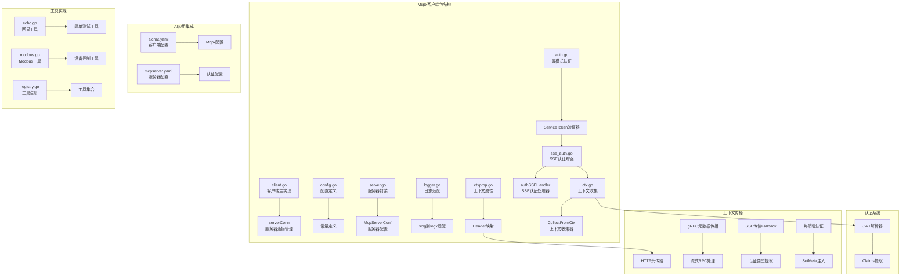
```mermaid
graph TB
subgraph "Mcpx客户端包结构"
A[client.go<br/>客户端主实现] --> B[serverConn<br/>服务器连接管理]
C[config.go<br/>配置定义] --> D[常量定义]
E[auth.go<br/>双模式认证] --> F[ServiceToken验证器]
G[server.go<br/>服务器封装] --> H[McpServerConf<br/>服务器配置]
I[logger.go<br/>日志适配] --> J[slog到logx适配]
K[ctxprop.go<br/>上下文属性] --> L[Header映射]
M[sse_auth.go<br/>SSE认证增强] --> N[authSSEHandler<br/>SSE认证处理器]
O[ctx.go<br/>上下文收集] --> P[CollectFromCtx<br/>上下文收集器]
end
subgraph "认证系统"
F --> M
M --> O
O --> Q[JWT解析器]
Q --> R[Claims提取]
end
subgraph "上下文传播"
L --> S[HTTP头传播]
T[gRPC元数据传播] --> U[流式RPC处理]
V[SSE传输Fallback] --> W[认证类型提取]
X[每消息认证] --> Y[SetMeta注入]
end
subgraph "AI应用集成"
Z[aichat.yaml<br/>客户端配置] --> AA[Mcpx配置]
AB[mcpserver.yaml<br/>服务器配置] --> AC[认证配置]
end
subgraph "工具实现"
AD[echo.go<br/>回显工具] --> AE[简单测试工具]
AF[modbus.go<br/>Modbus工具] --> AG[设备控制工具]
AH[registry.go<br/>工具注册] --> AI[工具集合]
end
```

**图表来源**
- [client.go:1-350](file://common/mcpx/client.go#L1-L350)
- [config.go:1-23](file://common/mcpx/config.go#L1-L23)
- [auth.go:1-77](file://common/mcpx/auth.go#L1-L77)
- [ctxprop.go:1-79](file://common/mcpx/ctxprop.go#L1-L79)
- [sse_auth.go:1-177](file://common/mcpx/sse_auth.go#L1-L177)
- [ctx.go:1-39](file://common/ctxprop/ctx.go#L1-L39)

**章节来源**
- [client.go:1-350](file://common/mcpx/client.go#L1-L350)
- [config.go:1-23](file://common/mcpx/config.go#L1-L23)

## 核心组件

Mcpx客户端包包含以下核心组件：

### 客户端管理器（Client）

客户端管理器是整个包的核心，负责管理多个MCP服务器连接，聚合工具资源，并提供统一的工具调用接口。

**主要特性：**
- 多服务器连接管理
- 工具聚合和路由
- 自动重连机制
- 性能监控和指标收集
- 线程安全的并发访问
- **更新** 每消息认证机制，自动注入上下文属性

### 服务器连接（serverConn）

单个MCP服务器的连接管理器，负责维护与特定MCP服务器的连接状态。

**主要职责：**
- 连接建立和维护
- 工具列表刷新
- 会话管理和生命周期控制
- 错误处理和恢复
- **更新** 每消息上下文注入，通过SetMeta方法传递认证信息

### 配置系统

提供灵活的配置选项，支持不同的连接参数和行为设置。

**配置选项：**
- 服务器端点配置
- 连接超时设置
- 刷新间隔配置
- 认证令牌配置
- **更新** UseStreamable传输协议选择标志
- **更新** SSE认证会话管理配置

**章节来源**
- [client.go:19-44](file://common/mcpx/client.go#L19-L44)
- [config.go:11-23](file://common/mcpx/config.go#L11-L23)

## 架构概览

Mcpx客户端包采用分层架构设计，确保了良好的模块化和可扩展性：

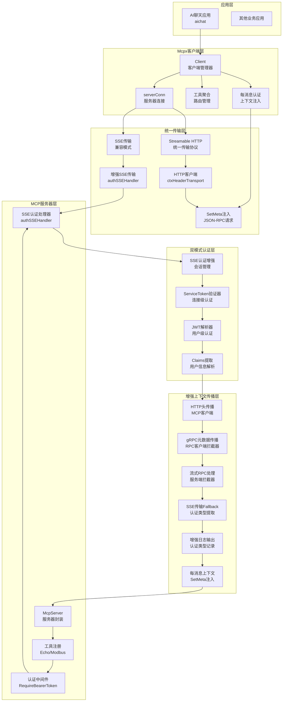
```mermaid
graph TB
subgraph "应用层"
A[AI聊天应用<br/>aichat]
B[其他业务应用]
end
subgraph "Mcpx客户端层"
C[Client<br/>客户端管理器]
D[serverConn<br/>服务器连接]
E[工具聚合<br/>路由管理]
F[每消息认证<br/>上下文注入]
end
subgraph "统一传输层"
G[Streamable HTTP<br/>统一传输协议]
H[SSE传输<br/>兼容模式]
I[HTTP客户端<br/>ctxHeaderTransport]
J[增强SSE传输<br/>authSSEHandler]
K[SetMeta注入<br/>JSON-RPC请求]
end
subgraph "双模式认证层"
L[ServiceToken验证器<br/>连接级认证]
M[JWT解析器<br/>用户级认证]
N[Claims提取<br/>用户信息解析]
O[SSE认证增强<br/>会话管理]
end
subgraph "增强上下文传播层"
P[HTTP头传播<br/>MCP客户端]
Q[gRPC元数据传播<br/>RPC客户端拦截器]
R[流式RPC处理<br/>服务端拦截器]
S[SSE传输Fallback<br/>认证类型提取]
T[增强日志输出<br/>认证类型记录]
U[每消息上下文<br/>SetMeta注入]
end
subgraph "MCP服务器层"
V[McpServer<br/>服务器封装]
W[工具注册<br/>Echo/Modbus]
X[认证中间件<br/>RequireBearerToken]
Y[SSE认证处理器<br/>authSSEHandler]
end
A --> C
C --> D
C --> E
C --> F
D --> G
D --> H
F --> K
G --> I
H --> J
I --> K
J --> Y
Y --> O
O --> L
L --> M
M --> N
N --> P
P --> Q
Q --> R
R --> S
S --> T
T --> U
U --> V
V --> W
W --> X
X --> Y
```

**更新** 传输层现在采用统一架构，通过UseStreamable配置标志动态选择Streamable HTTP或SSE传输协议，简化了协议选择机制。同时增加了每消息认证机制，确保每次工具调用都携带最新的用户上下文信息，特别是在SSE传输协议下提供了更精确的认证控制。

**图表来源**
- [client.go:46-107](file://common/mcpx/client.go#L46-L107)
- [server.go:32-71](file://common/mcpx/server.go#L32-L71)
- [auth.go:17-60](file://common/mcpx/auth.go#L17-L60)
- [sse_auth.go:28-48](file://common/mcpx/sse_auth.go#L28-L48)

## 详细组件分析

### 客户端管理器实现

客户端管理器是Mcpx包的核心组件，负责协调多个MCP服务器的连接和工具调用。

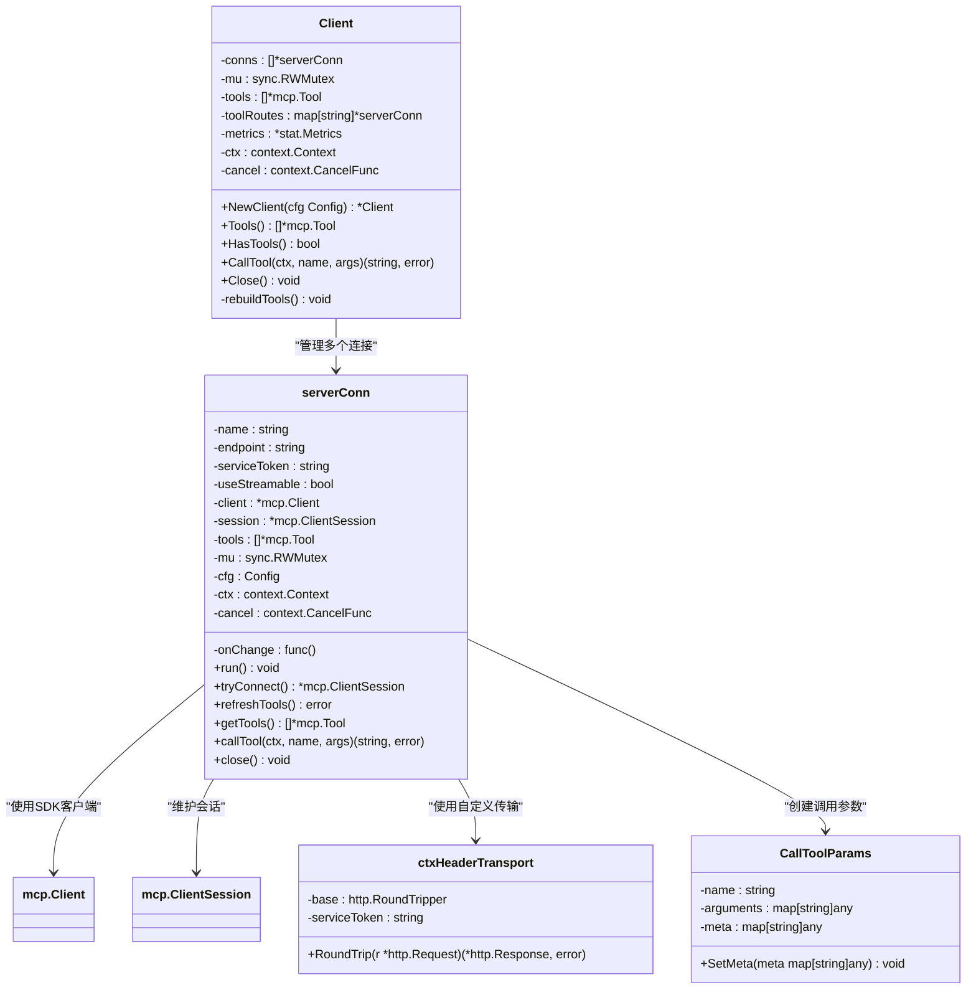
```mermaid
classDiagram
class Client {
-conns : []*serverConn
-mu : sync.RWMutex
-tools : []*mcp.Tool
-toolRoutes : map[string]*serverConn
-metrics : *stat.Metrics
-ctx : context.Context
-cancel : context.CancelFunc
+NewClient(cfg Config) *Client
+Tools() []*mcp.Tool
+HasTools() bool
+CallTool(ctx, name, args) (string, error)
+Close() void
-rebuildTools() void
}
class serverConn {
-name : string
-endpoint : string
-serviceToken : string
-useStreamable : bool
-client : *mcp.Client
-session : *mcp.ClientSession
-tools : []*mcp.Tool
-mu : sync.RWMutex
-cfg : Config
-onChange : func()
-ctx : context.Context
-cancel : context.CancelFunc
+run() void
+tryConnect() *mcp.ClientSession
+refreshTools() error
+getTools() []*mcp.Tool
+callTool(ctx, name, args) (string, error)
+close() void
}
class ctxHeaderTransport {
-base : http.RoundTripper
-serviceToken : string
+RoundTrip(r *http.Request) (*http.Response, error)
}
class CallToolParams {
-name : string
-arguments : map[string]any
-meta : map[string]any
+SetMeta(meta map[string]any) void
}
Client --> serverConn : "管理多个连接"
serverConn --> mcp.Client : "使用SDK客户端"
serverConn --> mcp.ClientSession : "维护会话"
serverConn --> ctxHeaderTransport : "使用自定义传输"
serverConn --> CallToolParams : "创建调用参数"
```

**图表来源**
- [client.go:19-44](file://common/mcpx/client.go#L19-L44)
- [client.go:45-107](file://common/mcpx/client.go#L45-L107)
- [client.go:327-350](file://common/mcpx/client.go#L327-L350)

#### 连接管理流程

客户端启动时会为每个配置的服务器创建连接管理器，并启动后台goroutine进行连接维护：

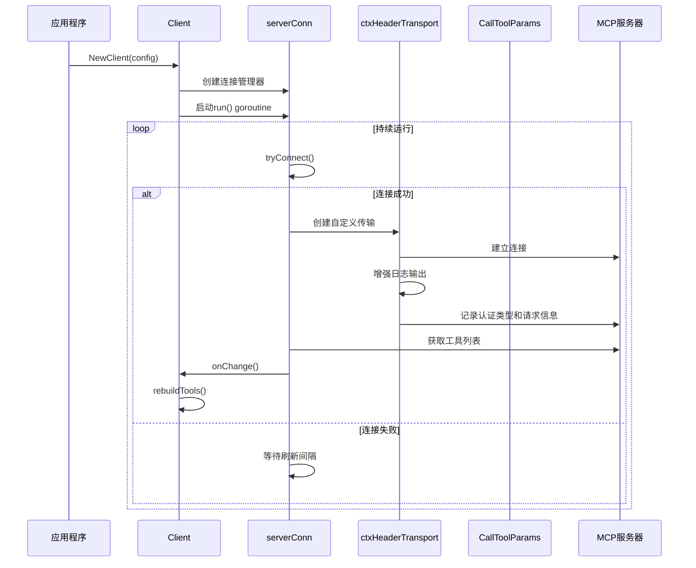
```mermaid
sequenceDiagram
participant App as 应用程序
participant Client as Client
participant Conn as serverConn
participant Transport as ctxHeaderTransport
participant Params as CallToolParams
participant MCP as MCP服务器
App->>Client : NewClient(config)
Client->>Conn : 创建连接管理器
Client->>Conn : 启动run() goroutine
loop 持续运行
Conn->>Conn : tryConnect()
alt 连接成功
Conn->>Transport : 创建自定义传输
Transport->>MCP : 建立连接
Transport->>Transport : 增强日志输出
Transport->>MCP : 记录认证类型和请求信息
Conn->>MCP : 获取工具列表
Conn->>Client : onChange()
Client->>Client : rebuildTools()
else 连接失败
Conn->>Conn : 等待刷新间隔
end
end
```

**图表来源**
- [client.go:184-204](file://common/mcpx/client.go#L184-L204)
- [client.go:206-237](file://common/mcpx/client.go#L206-L237)
- [client.go:342-350](file://common/mcpx/client.go#L342-L350)

**章节来源**
- [client.go:45-180](file://common/mcpx/client.go#L45-L180)

## 每消息认证机制

**更新** Mcpx包引入了全新的每消息认证机制，callTool方法现在自动检查上下文属性并通过SetMeta方法注入到JSON-RPC请求中。这一机制确保每次工具调用都携带最新的用户上下文信息，特别适用于SSE传输协议，提供了更精确的认证控制和更好的安全性。

### 认证机制流程

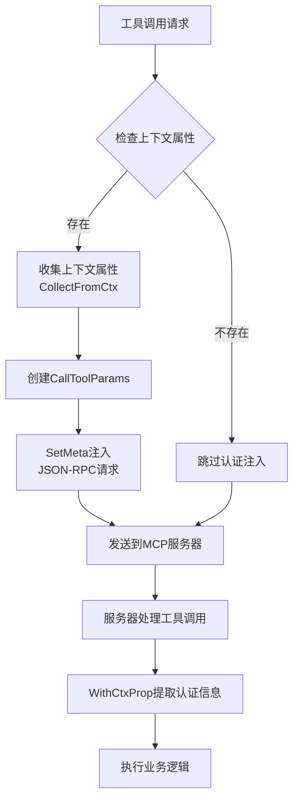
```mermaid
flowchart TD
A[工具调用请求] --> B{检查上下文属性}
B --> |存在| C[收集上下文属性<br/>CollectFromCtx]
B --> |不存在| D[跳过认证注入]
C --> E[创建CallToolParams]
E --> F[SetMeta注入<br/>JSON-RPC请求]
F --> G[发送到MCP服务器]
D --> G
G --> H[服务器处理工具调用]
H --> I[WithCtxProp提取认证信息]
I --> J[执行业务逻辑]
```

**图表来源**
- [client.go:281-311](file://common/mcpx/client.go#L281-L311)
- [ctx.go:12-23](file://common/ctxprop/ctx.go#L12-L23)

### 每消息上下文注入实现

每消息认证机制通过callTool方法实现，确保每次工具调用都携带最新的用户上下文信息：

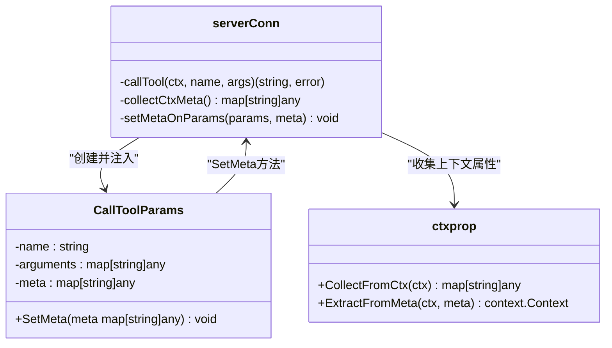
```mermaid
classDiagram
class serverConn {
-callTool(ctx, name, args) (string, error)
-collectCtxMeta() map[string]any
-setMetaOnParams(params, meta) void
}
class CallToolParams {
-name : string
-arguments : map[string]any
-meta : map[string]any
+SetMeta(meta map[string]any) void
}
class ctxprop {
+CollectFromCtx(ctx) map[string]any
+ExtractFromMeta(ctx, meta) context.Context
}
serverConn --> CallToolParams : "创建并注入"
serverConn --> ctxprop : "收集上下文属性"
CallToolParams --> serverConn : "SetMeta方法"
```

**图表来源**
- [client.go:281-311](file://common/mcpx/client.go#L281-L311)
- [ctx.go:12-23](file://common/ctxprop/ctx.go#L12-L23)

### 上下文属性收集机制

每消息认证机制通过CollectFromCtx函数收集上下文中的属性信息：

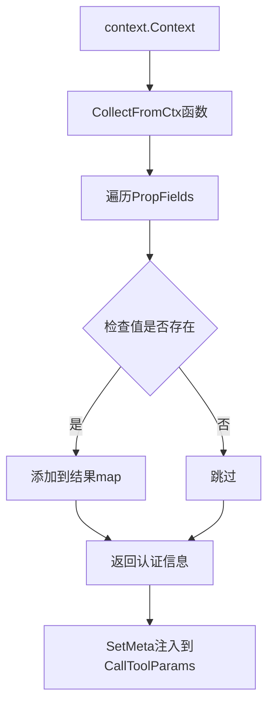
```mermaid
flowchart TD
A[context.Context] --> B[CollectFromCtx函数]
B --> C[遍历PropFields]
C --> D{检查值是否存在}
D --> |是| E[添加到结果map]
D --> |否| F[跳过]
E --> G[返回认证信息]
F --> G
G --> H[SetMeta注入到CallToolParams]
```

**图表来源**
- [ctx.go:12-23](file://common/ctxprop/ctx.go#L12-L23)

**章节来源**
- [client.go:281-311](file://common/mcpx/client.go#L281-L311)
- [ctx.go:12-23](file://common/ctxprop/ctx.go#L12-L23)

## 增强上下文传播框架

**更新** Mcpx包提供了完整的上下文传播框架，支持HTTP、gRPC和MCP三层协议的统一上下文传递，确保用户信息能够在工具调用链中正确传递。本次更新重点增强了每消息认证机制和SSE传输协议的fallback处理机制。

### 上下文传播机制

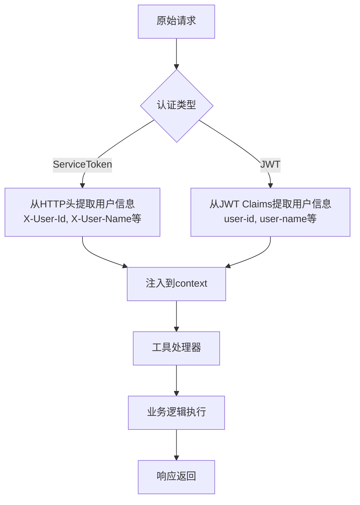
```mermaid
flowchart TD
A[原始请求] --> B{认证类型}
B --> |ServiceToken| C[从HTTP头提取用户信息<br/>X-User-Id, X-User-Name等]
B --> |JWT| D[从JWT Claims提取用户信息<br/>user-id, user-name等]
C --> E[注入到context]
D --> E
E --> F[工具处理器]
F --> G[业务逻辑执行]
G --> H[响应返回]
```

**图表来源**
- [ctxprop.go:15-19](file://common/mcpx/ctxprop.go#L15-L19)

### 上下文字段定义

上下文传播框架基于统一的字段定义，支持多种传输协议的自动转换：

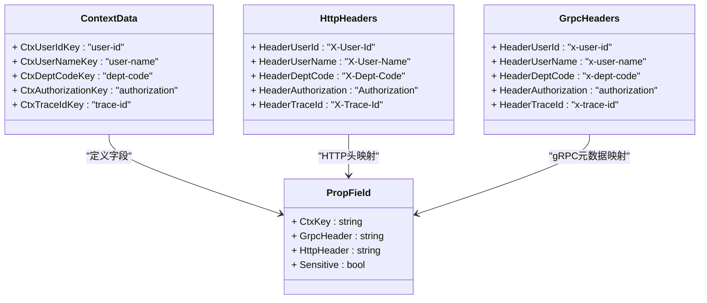
```mermaid
classDiagram
class PropField {
+ CtxKey : string
+ GrpcHeader : string
+ HttpHeader : string
+ Sensitive : bool
}
class ContextData {
+ CtxUserIdKey : "user-id"
+ CtxUserNameKey : "user-name"
+ CtxDeptCodeKey : "dept-code"
+ CtxAuthorizationKey : "authorization"
+ CtxTraceIdKey : "trace-id"
}
class HttpHeaders {
+ HeaderUserId : "X-User-Id"
+ HeaderUserName : "X-User-Name"
+ HeaderDeptCode : "X-Dept-Code"
+ HeaderAuthorization : "Authorization"
+ HeaderTraceId : "X-Trace-Id"
}
class GrpcHeaders {
+ HeaderUserId : "x-user-id"
+ HeaderUserName : "x-user-name"
+ HeaderDeptCode : "x-dept-code"
+ HeaderAuthorization : "authorization"
+ HeaderTraceId : "x-trace-id"
}
ContextData --> PropField : "定义字段"
HttpHeaders --> PropField : "HTTP头映射"
GrpcHeaders --> PropField : "gRPC元数据映射"
```

**图表来源**
- [ctxData.go:22-38](file://common/ctxdata/ctxData.go#L22-L38)

### 上下文传播实现

上下文传播框架提供了三个层次的传播机制：

1. **HTTP头传播**：用于MCP客户端到服务器的上下文传递
2. **gRPC元数据传播**：用于RPC客户端到服务端的上下文传递  
3. **Claims提取**：用于JWT用户信息的结构化提取

**更新** 增强的上下文传播框架现在支持每消息认证机制：

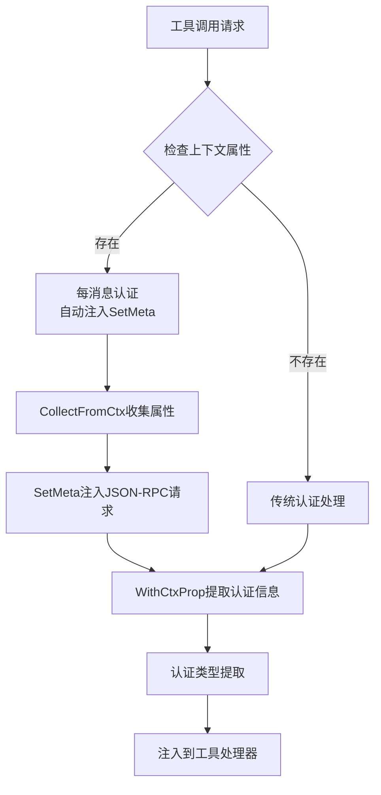
```mermaid
flowchart TD
A[工具调用请求] --> B{检查上下文属性}
B --> |存在| C[每消息认证<br/>自动注入SetMeta]
B --> |不存在| D[传统认证处理]
C --> E[CollectFromCtx收集属性]
E --> F[SetMeta注入JSON-RPC请求]
F --> G[WithCtxProp提取认证信息]
D --> G
G --> H[认证类型提取]
H --> I[注入到工具处理器]
```

**图表来源**
- [client.go:291-294](file://common/mcpx/client.go#L291-L294)
- [ctxprop.go:29-58](file://common/mcpx/ctxprop.go#L29-L58)

### 认证类型提取逻辑

**更新** 改进了认证类型提取逻辑，提供更准确的认证类型识别：

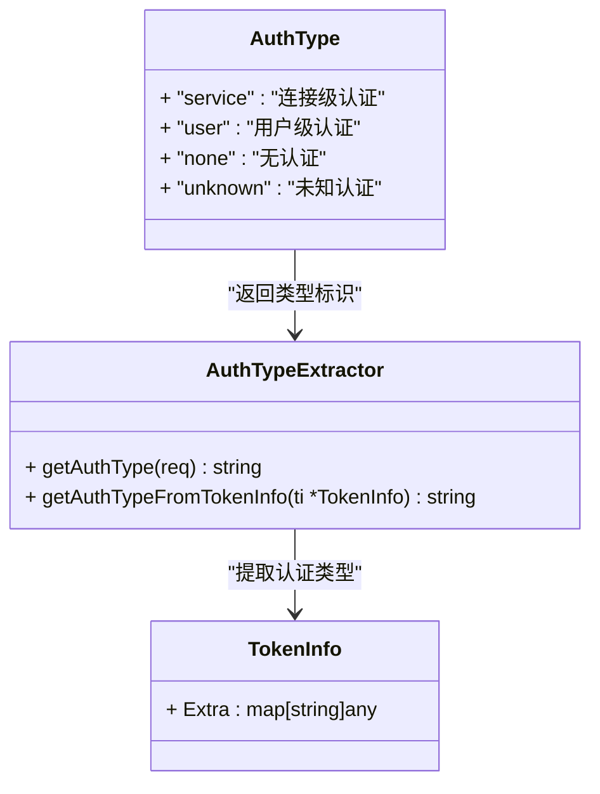
```mermaid
classDiagram
class AuthTypeExtractor {
+ getAuthType(req) string
+ getAuthTypeFromTokenInfo(ti *TokenInfo) string
}
class TokenInfo {
+ Extra : map[string]any
}
class AuthType {
+ "service" : "连接级认证"
+ "user" : "用户级认证"
+ "none" : "无认证"
+ "unknown" : "未知认证"
}
AuthTypeExtractor --> TokenInfo : "提取认证类型"
AuthType --> AuthTypeExtractor : "返回类型标识"
```

**图表来源**
- [ctxprop.go:61-79](file://common/mcpx/ctxprop.go#L61-L79)

**章节来源**
- [ctxprop.go:1-79](file://common/mcpx/ctxprop.go#L1-L79)
- [ctxData.go:1-74](file://common/ctxdata/ctxData.go#L1-L74)
- [ctx.go:1-39](file://common/ctxprop/ctx.go#L1-L39)

## 双模式认证系统

**更新** Mcpx包实现了双模式的身份验证系统，支持ServiceToken和JWT两种认证方式，提供更灵活的安全控制机制。本次更新进一步增强了每消息认证机制和SSE传输协议的兼容性。

### 认证流程

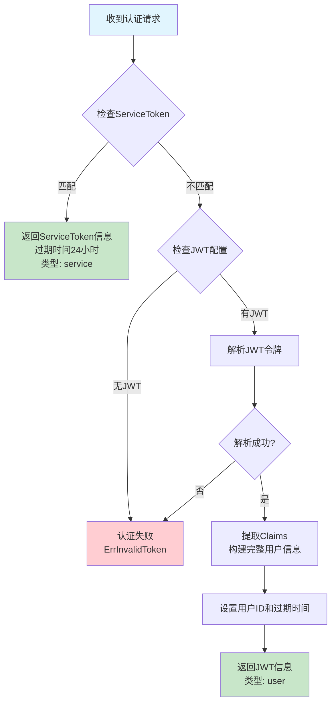
```mermaid
flowchart TD
A[收到认证请求] --> B{检查ServiceToken}
B --> |匹配| C[返回ServiceToken信息<br/>过期时间24小时<br/>类型: service]
B --> |不匹配| D{检查JWT配置}
D --> |无JWT| E[认证失败<br/>ErrInvalidToken]
D --> |有JWT| F[解析JWT令牌]
F --> G{解析成功?}
G --> |否| E
G --> |是| H[提取Claims<br/>构建完整用户信息]
H --> I[设置用户ID和过期时间]
I --> J[返回JWT信息<br/>类型: user]
style A fill:#e1f5fe
style C fill:#c8e6c9
style E fill:#ffcdd2
style J fill:#c8e6c9
```

**图表来源**
- [auth.go:21-59](file://common/mcpx/auth.go#L21-L59)

### 认证验证器实现

双模式认证验证器提供了统一的认证接口，优先使用ServiceToken进行连接级认证，失败后再尝试JWT进行用户级认证：

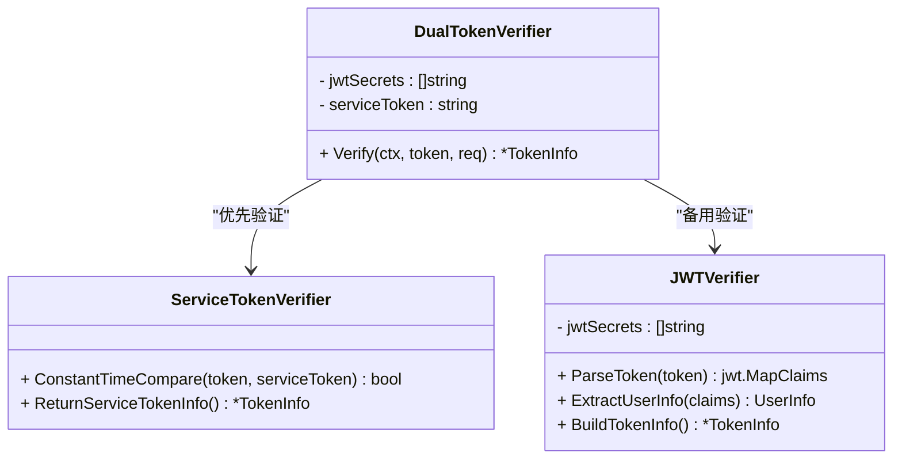
```mermaid
classDiagram
class DualTokenVerifier {
- jwtSecrets : []string
- serviceToken : string
+ Verify(ctx, token, req) *TokenInfo
}
class ServiceTokenVerifier {
+ ConstantTimeCompare(token, serviceToken) bool
+ ReturnServiceTokenInfo() *TokenInfo
}
class JWTVerifier {
- jwtSecrets : []string
+ ParseToken(token) jwt.MapClaims
+ ExtractUserInfo(claims) UserInfo
+ BuildTokenInfo() *TokenInfo
}
DualTokenVerifier --> ServiceTokenVerifier : "优先验证"
DualTokenVerifier --> JWTVerifier : "备用验证"
```

**图表来源**
- [auth.go:21-59](file://common/mcpx/auth.go#L21-L59)

**章节来源**
- [auth.go:17-77](file://common/mcpx/auth.go#L17-L77)

## SSE认证增强系统

**新增** Mcpx包引入了全新的SSE认证增强系统，专门针对SSE传输协议的认证需求进行了优化，确保POST请求中的认证信息能够正确传递到工具处理器。

### SSE认证处理器架构

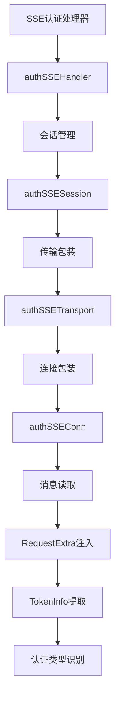
```mermaid
flowchart TD
A[SSE认证处理器] --> B[authSSEHandler]
B --> C[会话管理]
C --> D[authSSESession]
D --> E[传输包装]
E --> F[authSSETransport]
F --> G[连接包装]
G --> H[authSSEConn]
H --> I[消息读取]
I --> J[RequestExtra注入]
J --> K[TokenInfo提取]
K --> L[认证类型识别]
```

**图表来源**
- [sse_auth.go:28-48](file://common/mcpx/sse_auth.go#L28-L48)
- [sse_auth.go:131-165](file://common/mcpx/sse_auth.go#L131-L165)

### SSE认证会话管理

SSE认证系统通过会话管理机制确保每个SSE连接的认证信息独立存储和传递：

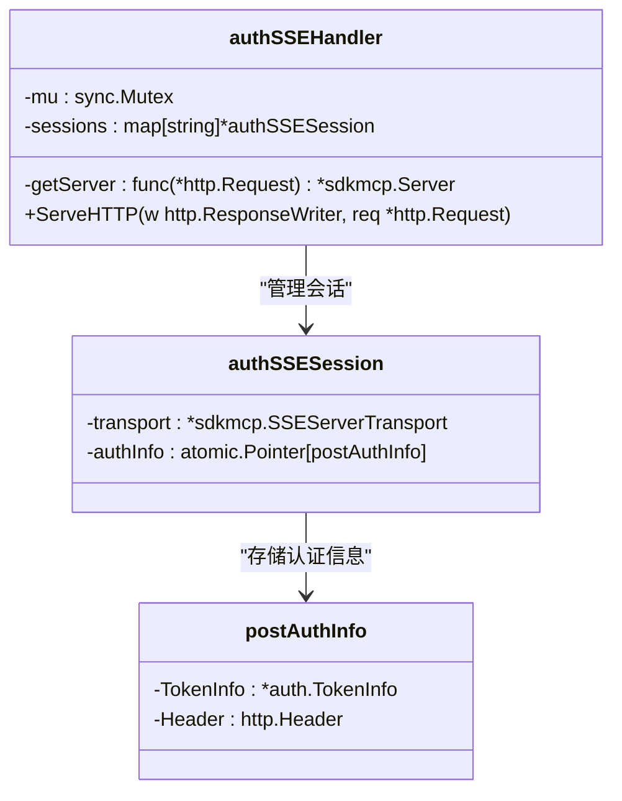
```mermaid
classDiagram
class authSSEHandler {
-getServer : func(*http.Request) *sdkmcp.Server
-mu : sync.Mutex
-sessions : map[string]*authSSESession
+ServeHTTP(w http.ResponseWriter, req *http.Request)
}
class authSSESession {
-transport : *sdkmcp.SSEServerTransport
-authInfo : atomic.Pointer[postAuthInfo]
}
class postAuthInfo {
-TokenInfo : *auth.TokenInfo
-Header : http.Header
}
authSSEHandler --> authSSESession : "管理会话"
authSSESession --> postAuthInfo : "存储认证信息"
```

**图表来源**
- [sse_auth.go:16-48](file://common/mcpx/sse_auth.go#L16-L48)

### SSE传输包装机制

SSE认证系统通过传输包装机制在消息读取时自动注入认证信息：

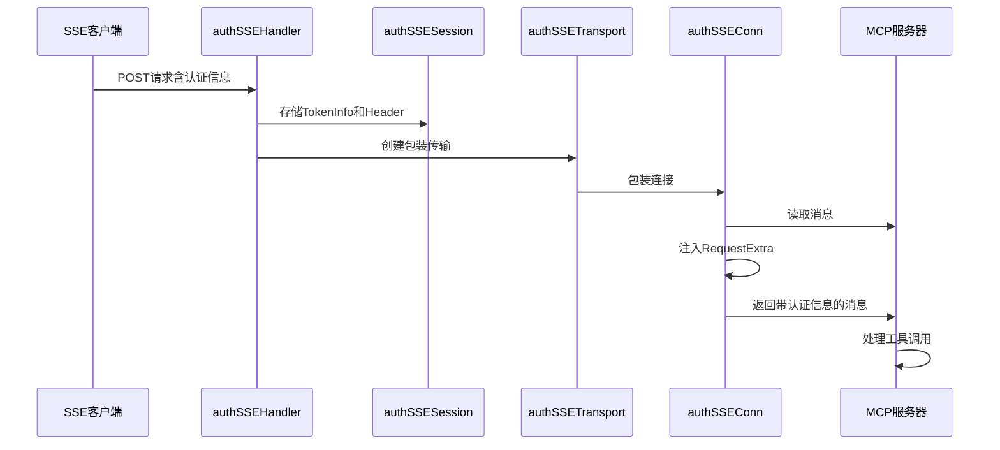
```mermaid
sequenceDiagram
participant Client as SSE客户端
participant Handler as authSSEHandler
participant Session as authSSESession
participant Transport as authSSETransport
participant Conn as authSSEConn
participant Server as MCP服务器
Client->>Handler : POST请求含认证信息
Handler->>Session : 存储TokenInfo和Header
Handler->>Transport : 创建包装传输
Transport->>Conn : 包装连接
Conn->>Server : 读取消息
Conn->>Conn : 注入RequestExtra
Conn->>Server : 返回带认证信息的消息
Server->>Server : 处理工具调用
```

**图表来源**
- [sse_auth.go:50-129](file://common/mcpx/sse_auth.go#L50-L129)
- [sse_auth.go:151-165](file://common/mcpx/sse_auth.go#L151-L165)

### SSE服务器集成

SSE认证系统与MCP服务器的集成确保了认证信息的正确传递：

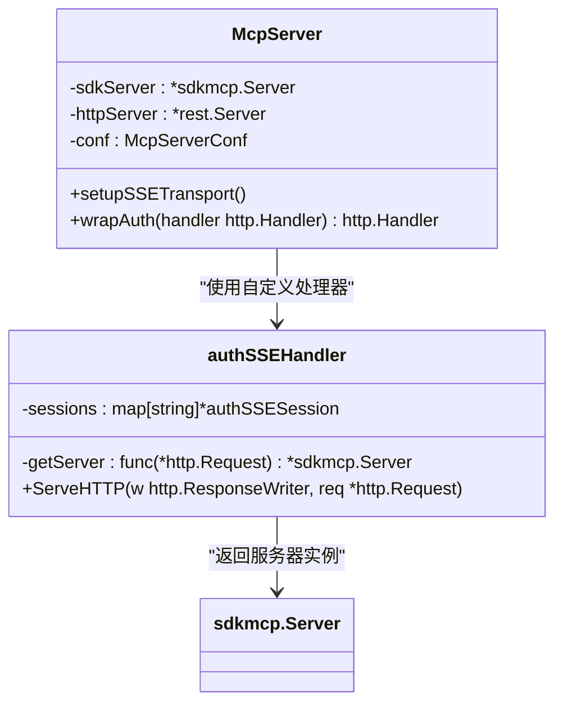
```mermaid
classDiagram
class McpServer {
-sdkServer : *sdkmcp.Server
-httpServer : *rest.Server
-conf : McpServerConf
+setupSSETransport()
+wrapAuth(handler http.Handler) http.Handler
}
class authSSEHandler {
-getServer : func(*http.Request) *sdkmcp.Server
-sessions : map[string]*authSSESession
+ServeHTTP(w http.ResponseWriter, req *http.Request)
}
McpServer --> authSSEHandler : "使用自定义处理器"
authSSEHandler --> sdkmcp.Server : "返回服务器实例"
```

**图表来源**
- [server.go:92-124](file://common/mcpx/server.go#L92-L124)
- [server.go:100-102](file://common/mcpx/server.go#L100-L102)

**章节来源**
- [sse_auth.go:1-177](file://common/mcpx/sse_auth.go#L1-L177)
- [server.go:92-124](file://common/mcpx/server.go#L92-L124)

## RPC拦截器实现

**新增** Mcpx包改进了RPC拦截器实现，提供了完整的gRPC元数据传播和流式RPC上下文处理能力。

### gRPC客户端拦截器

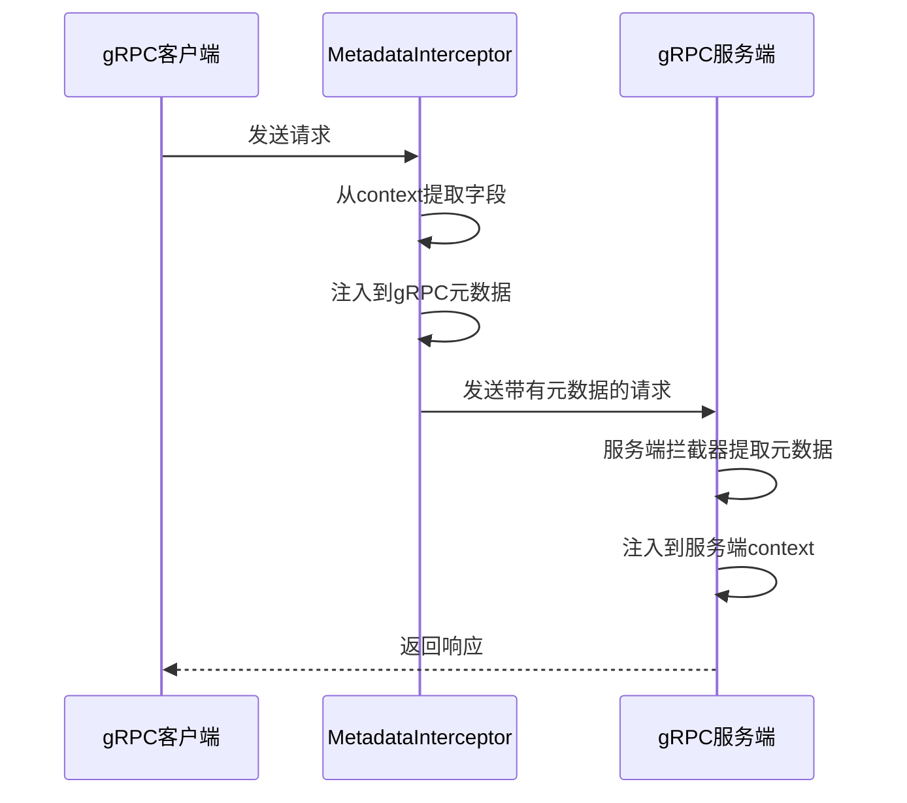
```mermaid
sequenceDiagram
participant Client as gRPC客户端
participant Interceptor as MetadataInterceptor
participant Server as gRPC服务端
Client->>Interceptor : 发送请求
Interceptor->>Interceptor : 从context提取字段
Interceptor->>Interceptor : 注入到gRPC元数据
Interceptor->>Server : 发送带有元数据的请求
Server->>Server : 服务端拦截器提取元数据
Server->>Server : 注入到服务端context
Server-->>Client : 返回响应
```

**图表来源**
- [metadataInterceptor.go:11-19](file://common/Interceptor/rpcclient/metadataInterceptor.go#L11-L19)

### gRPC服务端拦截器

服务端拦截器提供了两种实现，分别处理一元RPC和流式RPC：

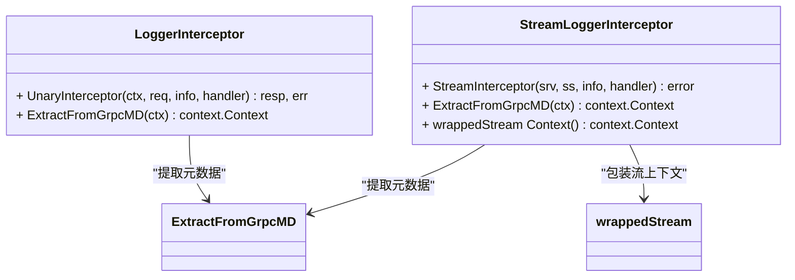
```mermaid
classDiagram
class LoggerInterceptor {
+ UnaryInterceptor(ctx, req, info, handler) resp, err
+ ExtractFromGrpcMD(ctx) context.Context
}
class StreamLoggerInterceptor {
+ StreamInterceptor(srv, ss, info, handler) error
+ ExtractFromGrpcMD(ctx) context.Context
+ wrappedStream Context() context.Context
}
LoggerInterceptor --> ExtractFromGrpcMD : "提取元数据"
StreamLoggerInterceptor --> ExtractFromGrpcMD : "提取元数据"
StreamLoggerInterceptor --> wrappedStream : "包装流上下文"
```

**图表来源**
- [loggerInterceptor.go:12-43](file://common/Interceptor/rpcserver/loggerInterceptor.go#L12-L43)

**章节来源**
- [metadataInterceptor.go:1-20](file://common/Interceptor/rpcclient/metadataInterceptor.go#L1-L20)
- [loggerInterceptor.go:1-44](file://common/Interceptor/rpcserver/loggerInterceptor.go#L1-L44)

## 传输协议选择机制

**更新** Mcpx客户端包现在支持统一的传输协议选择机制，通过UseStreamable配置标志动态选择传输协议。本次更新增强了每消息认证机制和SSE传输协议的兼容性。

### 传输协议配置

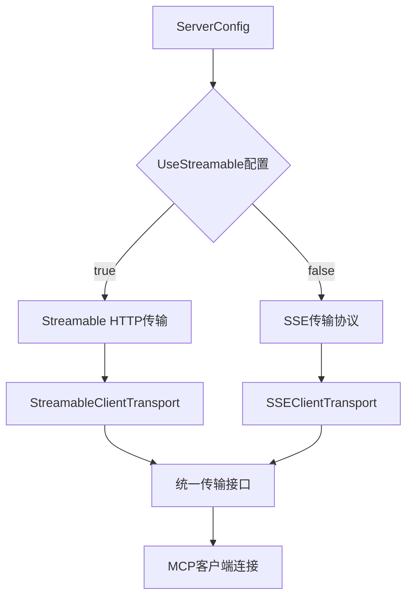
```mermaid
flowchart TD
A[ServerConfig] --> B{UseStreamable配置}
B --> |true| C[Streamable HTTP传输]
B --> |false| D[SSE传输协议]
C --> E[StreamableClientTransport]
D --> F[SSEClientTransport]
E --> G[统一传输接口]
F --> G
G --> H[MCP客户端连接]
```

**图表来源**
- [config.go:11-16](file://common/mcpx/config.go#L11-L16)
- [client.go:208-222](file://common/mcpx/client.go#L208-L222)

### 传输协议选择实现

传输协议的选择在连接建立时进行，确保了运行时的灵活性：

```mermaid
sequenceDiagram
participant Client as 客户端
participant Config as 配置
participant Transport as 传输层
participant Server as MCP服务器
Client->>Config : 读取UseStreamable标志
Config-->>Client : 返回传输协议类型
alt UseStreamable = true
Client->>Transport : 创建StreamableClientTransport
Transport->>Server : 建立Streamable连接
Transport->>Transport : 增强日志输出
Transport->>Transport : 记录认证类型和请求信息
else UseStreamable = false
Client->>Transport : 创建SSEClientTransport
Transport->>Server : 建立SSE连接
Transport->>Transport : SSE认证增强处理
Transport->>Transport : 会话管理认证信息
end
Server-->>Client : 连接建立成功
```

**图表来源**
- [client.go:208-222](file://common/mcpx/client.go#L208-L222)

### 配置示例

**更新** 配置文件现在包含UseStreamable标志，支持灵活的传输协议选择：

```yaml
Mcpx:
  Servers:
    - Name: "mcpserver"
      Endpoint: "http://localhost:13003/sse"
      ServiceToken: "mcp-internal-service-token-2026"
      UseStreamable: false  # 选择SSE传输协议
  RefreshInterval: 30s
  ConnectTimeout: 10s
```

**章节来源**
- [config.go:11-16](file://common/mcpx/config.go#L11-L16)
- [client.go:208-222](file://common/mcpx/client.go#L208-L222)
- [aichat.yaml:8-15](file://aiapp/aichat/etc/aichat.yaml#L8-L15)

## 依赖关系分析

Mcpx客户端包的依赖关系体现了清晰的分层架构：

```mermaid
graph TB
subgraph "外部依赖"
A[modelcontextprotocol/go-sdk/mcp<br/>MCP SDK]
B[zeromicro/go-zero/core/logx<br/>日志系统]
C[zeromicro/go-zero/core/stat<br/>统计监控]
D[zeromicro/go-zero/core/timex<br/>时间工具]
E[golang-jwt/jwt/v4<br/>JWT解析]
F[google.golang.org/grpc<br/>gRPC框架]
G[modelcontextprotocol/go-sdk/auth<br/>认证SDK]
H[modelcontextprotocol/go-sdk/jsonrpc<br/>JSON-RPC SDK]
end
subgraph "内部模块"
I[common/mcpx/client.go<br/>客户端实现]
J[common/mcpx/auth.go<br/>双模式认证]
K[common/mcpx/server.go<br/>服务器封装]
L[common/mcpx/ctxprop.go<br/>上下文属性]
M[common/mcpx/sse_auth.go<br/>SSE认证增强]
N[common/ctxdata/ctxData.go<br/>上下文字段定义]
O[common/ctxprop/claims.go<br/>Claims处理]
P[common/ctxprop/http.go<br/>HTTP传播]
Q[common/ctxprop/ctx.go<br/>上下文收集]
R[common/Interceptor/rpcclient/metadataInterceptor.go<br/>RPC客户端拦截器]
S[common/Interceptor/rpcserver/loggerInterceptor.go<br/>RPC服务端拦截器]
T[common/tool/tool.go<br/>工具函数]
U[common/mcpx/logger.go<br/>日志适配]
end
subgraph "AI应用"
V[aiapp/aichat<br/>聊天应用]
W[aiapp/mcpserver<br/>MCP服务器]
X[aiapp/mcpserver/internal/tools<br/>工具实现]
end
I --> A
I --> B
I --> C
I --> D
I --> U
J --> E
J --> N
J --> O
J --> T
K --> A
K --> B
K --> M
L --> N
L --> O
L --> P
L --> Q
M --> G
M --> H
N --> B
O --> N
P --> N
Q --> N
R --> Q
S --> Q
V --> I
W --> K
W --> X
```

**图表来源**
- [client.go:3-17](file://common/mcpx/client.go#L3-L17)
- [server.go:3-11](file://common/mcpx/server.go#L3-L11)
- [auth.go:3-15](file://common/mcpx/auth.go#L3-L15)
- [sse_auth.go:3-14](file://common/mcpx/sse_auth.go#L3-L14)

**章节来源**
- [client.go:1-350](file://common/mcpx/client.go#L1-L350)
- [server.go:1-146](file://common/mcpx/server.go#L1-L146)

## 性能考虑

Mcpx客户端包在设计时充分考虑了性能优化：

### 连接池和重用
- 使用长连接而非短连接，减少连接建立开销
- 实现连接池机制，支持多个服务器同时连接
- 自动重连机制，确保连接稳定性

### 缓存策略
- 工具列表缓存，避免频繁查询
- 连接状态缓存，快速响应工具调用
- 性能指标缓存，提供实时监控数据

### 并发控制
- 读写锁保护共享资源
- Goroutine池管理后台任务
- 上下文取消机制，优雅关闭连接

### 监控和诊断
- 内置性能监控指标
- 详细的日志记录
- 连接状态跟踪

### 传输协议优化
**更新** 统一传输架构提供了更好的性能表现：
- 减少了协议切换的开销
- 统一的连接管理机制
- 更好的资源利用率
- **更新** 每消息认证机制减少了重复认证的开销
- **新增** SSE认证增强系统减少了认证信息传递的延迟

### 认证性能优化
**更新** 双模式认证系统提供了高效的认证性能：
- ServiceToken使用常量时间比较，避免时序攻击
- JWT解析采用多密钥轮询，提高成功率
- Claims提取优化，减少不必要的类型转换
- **更新** 每消息认证机制优化，避免重复收集上下文属性
- **新增** SSE传输协议认证失败的快速检测和恢复

### 上下文传播优化
**更新** 增强的上下文传播框架提供了高效的跨协议数据传递：
- 统一的字段定义，减少转换开销
- 批量字段处理，提高传播效率
- 智能过滤机制，避免不必要的数据传递
- **更新** 每消息认证机制优化，减少上下文收集的CPU消耗
- **新增** SSE传输fallback处理，确保认证类型提取的准确性
- **新增** 增强日志输出，提供详细的认证类型和请求信息

### SSE认证性能优化
**新增** SSE认证增强系统提供了专门的性能优化：
- 原子指针存储认证信息，减少锁竞争
- 会话ID随机生成，避免碰撞
- 传输包装最小化，减少额外开销
- 认证信息缓存，避免重复解析
- **更新** 每消息认证机制优化，减少SetMeta注入的内存分配

### 每消息认证性能优化
**更新** 每消息认证机制提供了专门的性能优化：
- 上下文属性收集缓存，避免重复遍历
- SetMeta方法优化，减少JSON序列化开销
- 条件注入机制，只有在上下文存在时才进行注入
- 批量认证信息处理，提高处理效率

## 故障排除指南

### 常见问题和解决方案

#### 连接问题
**症状：** 客户端无法连接到MCP服务器
**可能原因：**
- 服务器端点配置错误
- 网络连接问题
- 认证失败
- **更新** 传输协议选择错误
- **更新** 每消息认证机制异常
- **新增** SSE认证会话管理异常

**解决步骤：**
1. 检查服务器端点URL配置
2. 验证网络连通性
3. 确认认证令牌有效
4. **更新** 验证UseStreamable配置是否正确
5. **更新** 检查每消息认证机制是否正常工作
6. **新增** 检查SSE会话ID生成和管理
7. 查看日志获取详细错误信息

#### 工具调用失败
**症状：** 工具调用返回错误
**可能原因：**
- 工具名称不匹配
- 参数格式错误
- 服务器无响应
- **更新** 传输协议不兼容
- **更新** 每消息认证信息传递失败
- **新增** SSE认证信息传递失败

**解决步骤：**
1. 验证工具名称格式（serverName__toolName）
2. 检查参数JSON格式
3. 确认服务器正常运行
4. **更新** 检查传输协议兼容性
5. **更新** 验证每消息认证信息是否正确传递
6. **新增** 验证SSE认证信息是否正确传递
7. 查看工具调用日志

#### 认证问题
**症状：** 认证失败或权限不足
**可能原因：**
- ServiceToken过期
- JWT令牌无效
- 用户权限不足
- **更新** 双模式认证配置错误
- **更新** 每消息认证机制配置错误
- **新增** SSE传输协议认证失败

**解决步骤：**
1. 更新ServiceToken
2. 验证JWT签名密钥
3. 检查用户权限配置
4. **更新** 验证双模式认证配置
5. **更新** 检查每消息认证机制配置
6. **新增** 检查SSE传输协议认证配置
7. 查看认证日志

#### 上下文传播问题
**更新** 上下文传播相关的问题：

**症状：** 工具执行时缺少用户上下文信息
**可能原因：**
- HTTP头传播失败
- gRPC元数据丢失
- Claims提取错误
- 字段定义不匹配
- **更新** 每消息认证机制失效
- **更新** SSE传输fallback处理失败
- **更新** 认证信息提取不完整

**解决步骤：**
1. 检查HTTP头是否正确注入
2. 验证gRPC元数据传播
3. 确认JWT Claims格式正确
4. 检查上下文字段定义一致性
5. **更新** 验证每消息认证机制
6. **更新** 验证SSE传输fallback处理
7. **更新** 检查认证信息提取逻辑
8. 查看上下文传播日志

#### 每消息认证问题
**更新** 每消息认证机制相关的问题：

**症状：** 工具调用时认证信息不正确或缺失
**可能原因：**
- 上下文属性收集失败
- SetMeta注入异常
- JSON-RPC参数构造错误
- 认证信息格式不正确
- **新增** SSE传输协议下每消息认证失效

**解决步骤：**
1. 检查上下文属性是否正确设置
2. 验证CollectFromCtx函数是否正常工作
3. 确认SetMeta方法调用是否正确
4. 检查JSON-RPC参数构造逻辑
5. **新增** 验证SSE传输协议下的每消息认证
6. 查看每消息认证日志

#### 传输协议问题
**更新** 传输协议选择导致的问题：

**症状：** 连接建立失败或工具调用异常
**可能原因：**
- UseStreamable配置与服务器支持的协议不匹配
- 服务器端未正确配置传输协议
- 网络环境限制特定传输协议
- **更新** SSE传输协议兼容性问题
- **更新** 每消息认证机制在特定协议下失效
- **新增** SSE认证会话管理异常

**解决步骤：**
1. 检查服务器端传输协议配置
2. 验证客户端UseStreamable设置
3. 确认网络环境允许所选传输协议
4. **更新** 验证SSE传输协议兼容性
5. **更新** 检查每消息认证机制在特定协议下的行为
6. **新增** 检查SSE认证会话管理
7. 查看传输层错误日志

#### RPC拦截器问题
**新增** RPC拦截器相关的问题：

**症状：** gRPC调用时上下文丢失
**可能原因：**
- 客户端拦截器未正确配置
- 服务端拦截器处理异常
- 流式RPC上下文包装失败

**解决步骤：**
1. 检查客户端元数据拦截器配置
2. 验证服务端拦截器注册
3. 确认流式RPC上下文包装
4. 查看拦截器日志

#### 认证类型提取问题
**更新** 认证类型提取相关的问题：

**症状：** 工具调用时认证类型识别错误
**可能原因：**
- TokenInfo结构不完整
- 认证类型字段缺失
- SSE传输fallback处理失败
- Claims提取格式错误
- **更新** 每消息认证信息注入失败
- **新增** SSE认证信息注入失败

**解决步骤：**
1. 检查TokenInfo结构完整性
2. 验证认证类型字段存在性
3. 确认SSE传输fallback处理逻辑
4. 检查Claims提取格式正确性
5. **更新** 验证每消息认证信息注入过程
6. **新增** 验证SSE认证信息注入过程
7. 查看认证类型提取日志

#### SSE认证增强问题
**新增** SSE认证增强系统相关的问题：

**症状：** SSE传输协议认证失败
**可能原因：**
- 会话ID生成失败
- 认证信息存储异常
- 传输包装错误
- 连接包装失败
- **更新** 每消息认证机制在SSE协议下失效

**解决步骤：**
1. 检查会话ID生成算法
2. 验证认证信息存储机制
3. 确认传输包装逻辑
4. 检查连接包装实现
5. **更新** 验证每消息认证机制在SSE协议下的行为
6. 查看SSE认证增强日志

**章节来源**
- [client.go:123-148](file://common/mcpx/client.go#L123-L148)
- [auth.go:20-59](file://common/mcpx/auth.go#L20-L59)
- [sse_auth.go:50-129](file://common/mcpx/sse_auth.go#L50-L129)

## 结论

Mcpx客户端包是一个功能完整、设计精良的MCP客户端实现。它提供了以下核心价值：

### 主要优势
- **模块化设计：** 清晰的分层架构，易于维护和扩展
- **高可用性：** 自动重连、故障转移机制
- **安全性：** 双模式认证系统，支持多种身份验证方式
- **可观测性：** 完善的日志记录和性能监控
- **易用性：** 简洁的API设计，降低使用复杂度
- **统一传输架构：** 简化的协议选择机制，提高系统灵活性
- **增强上下文传播：** 支持多协议的统一上下文传递
- **每消息认证机制：** 提供更精确的认证控制和更好的安全性
- **完善RPC拦截器：** 提供完整的元数据传播和流式RPC处理
- **SSE传输兼容性：** 增强的fallback处理机制，确保协议兼容性
- **SSE认证增强系统：** 专门针对SSE传输协议的认证优化

### 技术特色
- **更新** 每消息认证机制：callTool方法现在自动检查上下文属性并通过SetMeta方法注入到JSON-RPC请求中，确保每次工具调用都携带最新的用户上下文信息
- **更新** 增强的上下文传播机制：支持每消息认证的上下文收集和注入，提供更精确的认证控制
- **更新** 改进认证类型提取逻辑：提供更准确的认证类型识别，支持"service"、"user"、"none"、"unknown"四种类型
- **更新** 优化双模式认证系统：增强每消息认证机制和SSE传输协议的兼容性和可靠性
- **更新** 改进客户端传输日志输出：增强认证类型和请求信息的详细记录
- **统一传输协议选择：** 通过UseStreamable配置标志动态选择Streamable HTTP或SSE传输
- **简化配置：** 统一的传输架构减少了配置复杂性
- **向后兼容：** 保持对现有SSE传输的支持
- 支持多种传输协议（Streamable HTTP、SSE）
- 智能工具路由和聚合
- 完整的上下文属性传递机制
- 灵活的配置系统
- 丰富的工具实现示例

### 应用场景
Mcpx客户端包适用于需要与外部服务进行智能交互的各种应用场景，包括但不限于：
- AI助手和聊天机器人
- 工业控制系统集成
- 数据查询和处理服务
- 业务逻辑扩展平台
- 多协议混合架构系统
- **更新** 实时数据流应用，特别是需要精确认证控制的场景
- **新增** SSE传输协议的实时数据流应用

**更新** 新的每消息认证机制、增强的上下文传播框架、改进的认证类型提取逻辑、增强的SSE传输兼容性和改进的客户端传输日志输出使得Mcpx客户端包能够更好地适应现代微服务架构的需求，为未来的功能扩展和技术演进奠定了更加坚实的基础。

通过其可靠的设计、完善的实现和现代化的功能增强，Mcpx客户端包为Zero Service项目提供了一个强大而灵活的MCP客户端解决方案，特别适合需要高级安全控制、复杂上下文管理和多协议通信的企业级应用场景。新增的每消息认证机制和SSE认证增强系统进一步提升了系统的兼容性和可靠性，为实时数据流应用和精确认证控制提供了更好的支持。