# Mcpx客户端包

<cite>
**本文档引用的文件**
- [client.go](file://common/mcpx/client.go)
- [config.go](file://common/mcpx/config.go)
- [auth.go](file://common/mcpx/auth.go)
- [server.go](file://common/mcpx/server.go)
- [logger.go](file://common/mcpx/logger.go)
- [ctxprop.go](file://common/mcpx/ctxprop.go)
- [aichat.yaml](file://aiapp/aichat/etc/aichat.yaml)
- [mcpserver.yaml](file://aiapp/mcpserver/etc/mcpserver.yaml)
- [echo.go](file://aiapp/mcpserver/internal/tools/echo.go)
- [modbus.go](file://aiapp/mcpserver/internal/tools/modbus.go)
- [registry.go](file://aiapp/mcpserver/internal/tools/registry.go)
- [chatcompletionlogic.go](file://aiapp/aichat/internal/logic/chatcompletionlogic.go)
- [servicecontext.go](file://aiapp/aichat/internal/svc/servicecontext.go)
</cite>

## 更新摘要
**变更内容**
- 新增UseStreamable配置标志，简化传输协议选择机制
- 从双传输系统迁移到统一传输架构
- 更新传输层实现，支持动态协议选择
- 增强配置系统的灵活性和向后兼容性

## 目录
1. [简介](#简介)
2. [项目结构](#项目结构)
3. [核心组件](#核心组件)
4. [架构概览](#架构概览)
5. [详细组件分析](#详细组件分析)
6. [传输协议选择机制](#传输协议选择机制)
7. [依赖关系分析](#依赖关系分析)
8. [性能考虑](#性能考虑)
9. [故障排除指南](#故障排除指南)
10. [结论](#结论)

## 简介

Mcpx客户端包是Zero Service项目中的一个关键组件，它实现了Model Context Protocol (MCP) 客户端功能。该包提供了统一的接口来管理多个MCP服务器连接，聚合工具资源，并提供智能路由功能。Mcpx客户端包支持多种传输协议（包括Streamable HTTP和SSE），具备自动重连机制，以及完整的身份验证和授权功能。

**更新** 该版本引入了UseStreamable配置标志，实现了从双传输系统到统一传输架构的迁移，简化了传输协议选择机制，提高了系统的灵活性和可维护性。

该包的设计目标是为AI应用提供一个可靠的MCP客户端解决方案，使得应用程序能够通过标准化的工具接口与各种外部服务进行交互，包括设备控制、数据查询、业务逻辑执行等功能。

## 项目结构

Mcpx客户端包位于`common/mcpx/`目录下，包含以下核心文件：

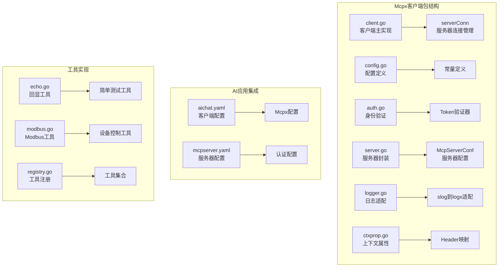

**图表来源**
- [client.go:1-360](file://common/mcpx/client.go#L1-L360)
- [config.go:1-23](file://common/mcpx/config.go#L1-L23)
- [auth.go:1-66](file://common/mcpx/auth.go#L1-L66)

**章节来源**
- [client.go:1-360](file://common/mcpx/client.go#L1-L360)
- [config.go:1-23](file://common/mcpx/config.go#L1-L23)

## 核心组件

Mcpx客户端包包含以下核心组件：

### 客户端管理器（Client）

客户端管理器是整个包的核心，负责管理多个MCP服务器连接，聚合工具资源，并提供统一的工具调用接口。

**主要特性：**
- 多服务器连接管理
- 工具聚合和路由
- 自动重连机制
- 性能监控和指标收集
- 线程安全的并发访问

### 服务器连接（serverConn）

单个MCP服务器的连接管理器，负责维护与特定MCP服务器的连接状态。

**主要职责：**
- 连接建立和维护
- 工具列表刷新
- 会话管理和生命周期控制
- 错误处理和恢复

### 配置系统

提供灵活的配置选项，支持不同的连接参数和行为设置。

**配置选项：**
- 服务器端点配置
- 连接超时设置
- 刷新间隔配置
- 认证令牌配置
- **新增** UseStreamable传输协议选择标志

**章节来源**
- [client.go:19-44](file://common/mcpx/client.go#L19-L44)
- [config.go:11-23](file://common/mcpx/config.go#L11-L23)

## 架构概览

Mcpx客户端包采用分层架构设计，确保了良好的模块化和可扩展性：

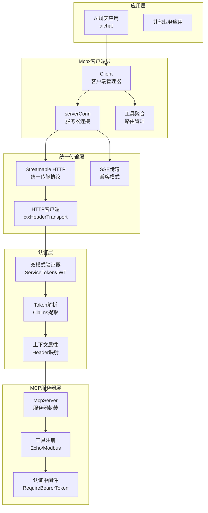

**更新** 传输层现在采用统一架构，通过UseStreamable配置标志动态选择Streamable HTTP或SSE传输协议，简化了协议选择机制。

**图表来源**
- [client.go:46-107](file://common/mcpx/client.go#L46-L107)
- [server.go:32-71](file://common/mcpx/server.go#L32-L71)
- [auth.go:19-48](file://common/mcpx/auth.go#L19-L48)

## 详细组件分析

### 客户端管理器实现

客户端管理器是Mcpx包的核心组件，负责协调多个MCP服务器的连接和工具调用。

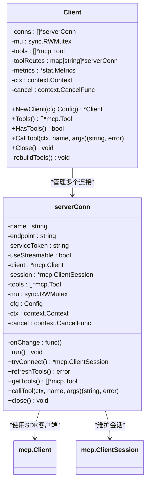

**图表来源**
- [client.go:19-44](file://common/mcpx/client.go#L19-L44)
- [client.go:45-107](file://common/mcpx/client.go#L45-L107)

#### 连接管理流程

客户端启动时会为每个配置的服务器创建连接管理器，并启动后台goroutine进行连接维护：

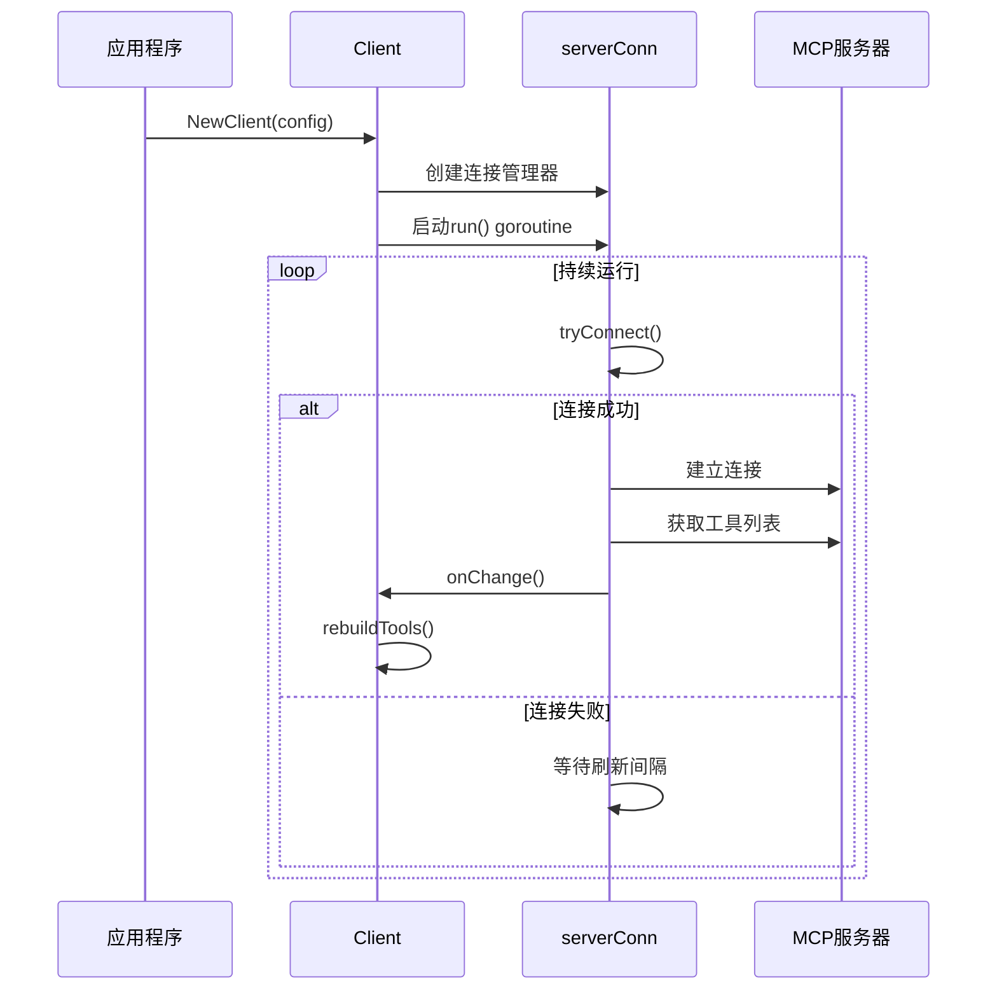

**图表来源**
- [client.go:184-204](file://common/mcpx/client.go#L184-L204)
- [client.go:206-237](file://common/mcpx/client.go#L206-L237)

**章节来源**
- [client.go:45-180](file://common/mcpx/client.go#L45-L180)

### 认证和授权系统

Mcpx包实现了双模式的身份验证系统，支持ServiceToken和JWT两种认证方式：

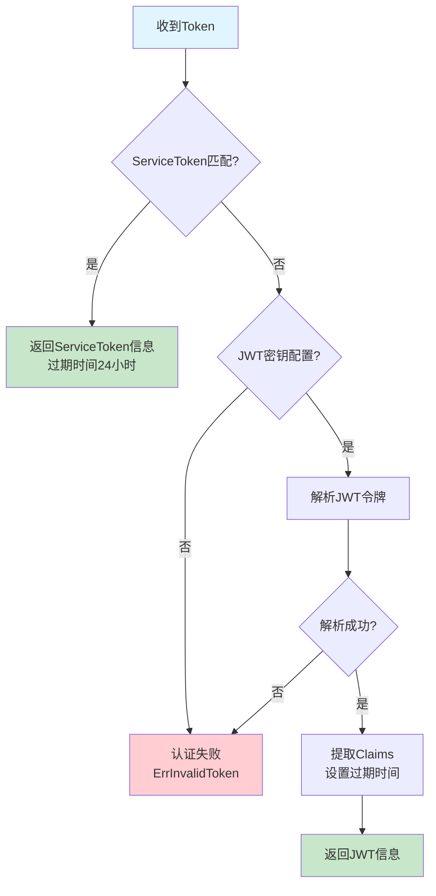

**图表来源**
- [auth.go:19-48](file://common/mcpx/auth.go#L19-L48)

#### 上下文属性传递

Mcpx包提供了完整的上下文属性传递机制，确保用户信息能够在工具调用链中正确传递：

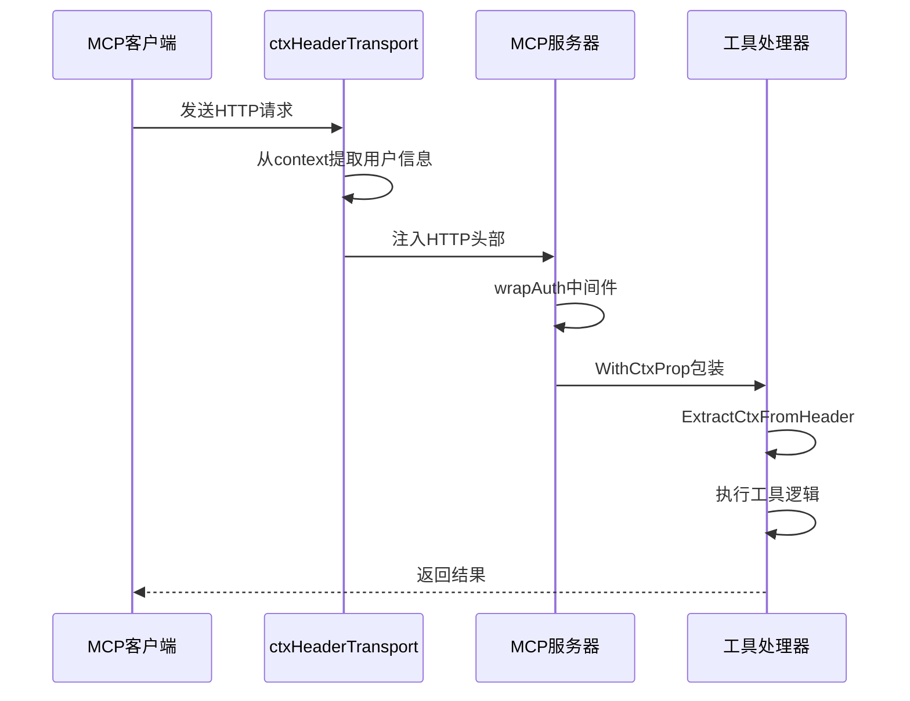

**图表来源**
- [ctxprop.go:25-59](file://common/mcpx/ctxprop.go#L25-L59)
- [client.go:313-360](file://common/mcpx/client.go#L313-L360)

**章节来源**
- [auth.go:15-66](file://common/mcpx/auth.go#L15-L66)
- [ctxprop.go:13-59](file://common/mcpx/ctxprop.go#L13-L59)

### 工具实现示例

Mcpx包提供了两个示例工具来演示如何实现MCP工具：

#### Echo工具

Echo工具是最简单的示例，展示了基本的工具注册和参数处理：

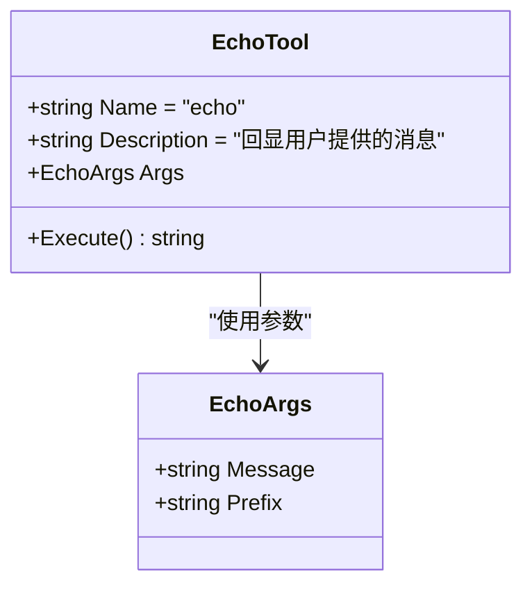

**图表来源**
- [echo.go:9-37](file://aiapp/mcpserver/internal/tools/echo.go#L9-L37)

#### Modbus工具

Modbus工具展示了如何实现复杂的工业控制工具，包括参数验证、错误处理和结果格式化：

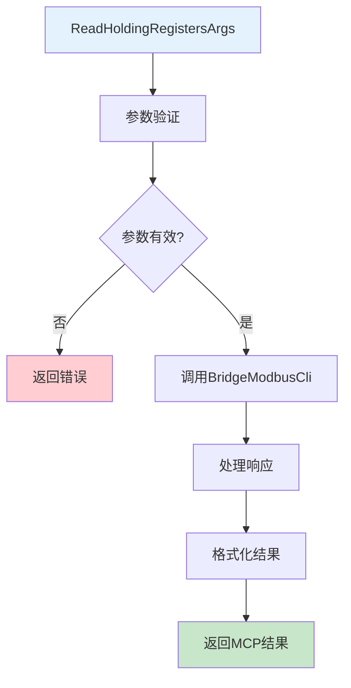

**图表来源**
- [modbus.go:15-70](file://aiapp/mcpserver/internal/tools/modbus.go#L15-L70)

**章节来源**
- [echo.go:1-37](file://aiapp/mcpserver/internal/tools/echo.go#L1-L37)
- [modbus.go:1-129](file://aiapp/mcpserver/internal/tools/modbus.go#L1-L129)

### AI应用集成

Mcpx包与AI聊天应用的集成展示了完整的工具调用流程：

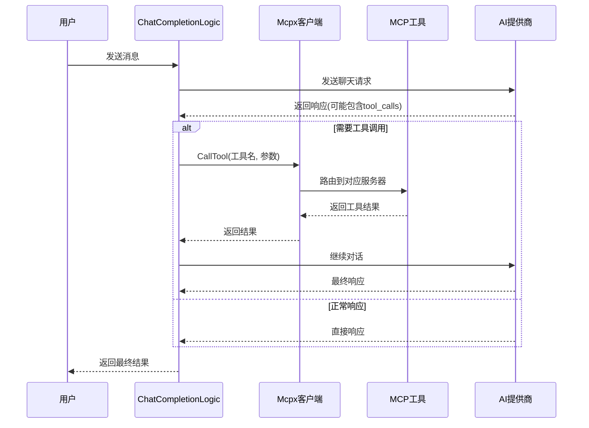

**图表来源**
- [chatcompletionlogic.go:33-86](file://aiapp/aichat/internal/logic/chatcompletionlogic.go#L33-L86)

**章节来源**
- [chatcompletionlogic.go:1-223](file://aiapp/aichat/internal/logic/chatcompletionlogic.go#L1-L223)

## 传输协议选择机制

**新增** Mcpx客户端包现在支持统一的传输协议选择机制，通过UseStreamable配置标志动态选择传输协议。

### 传输协议配置

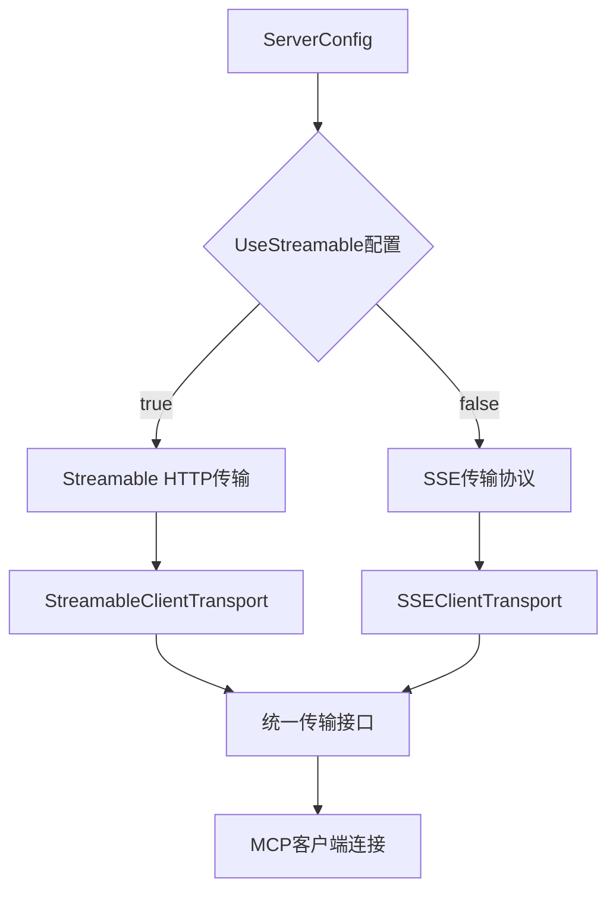

**图表来源**
- [config.go:11-16](file://common/mcpx/config.go#L11-L16)
- [client.go:208-222](file://common/mcpx/client.go#L208-L222)

### 传输协议选择实现

传输协议的选择在连接建立时进行，确保了运行时的灵活性：

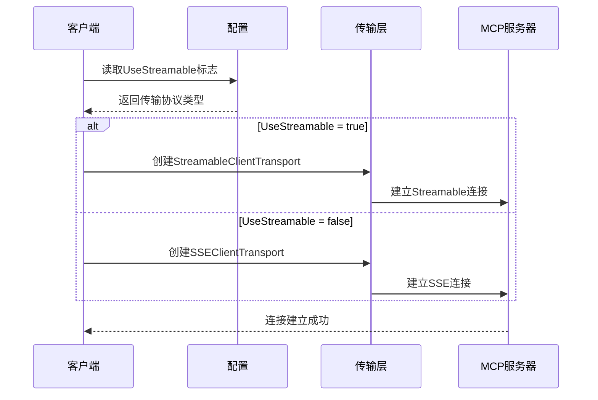

**图表来源**
- [client.go:208-222](file://common/mcpx/client.go#L208-L222)

### 配置示例

**更新** 配置文件现在包含UseStreamable标志，支持灵活的传输协议选择：

```yaml
Mcpx:
  Servers:
    - Name: "mcpserver"
      Endpoint: "http://localhost:13003/sse"
      ServiceToken: "mcp-internal-service-token-2026"
      UseStreamable: false  # 选择SSE传输协议
  RefreshInterval: 30s
  ConnectTimeout: 10s
```

**章节来源**
- [config.go:11-16](file://common/mcpx/config.go#L11-L16)
- [client.go:208-222](file://common/mcpx/client.go#L208-L222)
- [aichat.yaml:8-15](file://aiapp/aichat/etc/aichat.yaml#L8-L15)

## 依赖关系分析

Mcpx客户端包的依赖关系体现了清晰的分层架构：

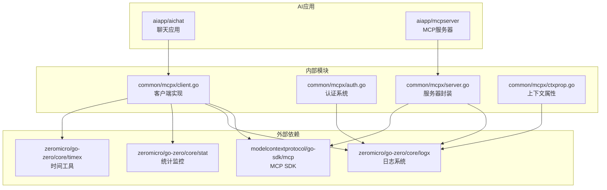

**图表来源**
- [client.go:3-17](file://common/mcpx/client.go#L3-L17)
- [server.go:3-11](file://common/mcpx/server.go#L3-L11)

**章节来源**
- [client.go:1-360](file://common/mcpx/client.go#L1-L360)
- [server.go:1-141](file://common/mcpx/server.go#L1-L141)

## 性能考虑

Mcpx客户端包在设计时充分考虑了性能优化：

### 连接池和重用
- 使用长连接而非短连接，减少连接建立开销
- 实现连接池机制，支持多个服务器同时连接
- 自动重连机制，确保连接稳定性

### 缓存策略
- 工具列表缓存，避免频繁查询
- 连接状态缓存，快速响应工具调用
- 性能指标缓存，提供实时监控数据

### 并发控制
- 读写锁保护共享资源
- Goroutine池管理后台任务
- 上下文取消机制，优雅关闭连接

### 监控和诊断
- 内置性能监控指标
- 详细的日志记录
- 连接状态跟踪

### 传输协议优化
**新增** 统一传输架构提供了更好的性能表现：
- 减少了协议切换的开销
- 统一的连接管理机制
- 更好的资源利用率

## 故障排除指南

### 常见问题和解决方案

#### 连接问题
**症状：** 客户端无法连接到MCP服务器
**可能原因：**
- 服务器端点配置错误
- 网络连接问题
- 认证失败
- **新增** 传输协议选择错误

**解决步骤：**
1. 检查服务器端点URL配置
2. 验证网络连通性
3. 确认认证令牌有效
4. **新增** 验证UseStreamable配置是否正确
5. 查看日志获取详细错误信息

#### 工具调用失败
**症状：** 工具调用返回错误
**可能原因：**
- 工具名称不匹配
- 参数格式错误
- 服务器无响应
- **新增** 传输协议不兼容

**解决步骤：**
1. 验证工具名称格式（serverName__toolName）
2. 检查参数JSON格式
3. 确认服务器正常运行
4. **新增** 检查传输协议兼容性
5. 查看工具调用日志

#### 认证问题
**症状：** 认证失败或权限不足
**可能原因：**
- ServiceToken过期
- JWT令牌无效
- 用户权限不足

**解决步骤：**
1. 更新ServiceToken
2. 验证JWT签名密钥
3. 检查用户权限配置
4. 查看认证日志

#### 传输协议问题
**新增** 传输协议选择导致的问题：

**症状：** 连接建立失败或工具调用异常
**可能原因：**
- UseStreamable配置与服务器支持的协议不匹配
- 服务器端未正确配置传输协议
- 网络环境限制特定传输协议

**解决步骤：**
1. 检查服务器端传输协议配置
2. 验证客户端UseStreamable设置
3. 确认网络环境允许所选传输协议
4. 查看传输层错误日志

**章节来源**
- [client.go:123-148](file://common/mcpx/client.go#L123-L148)
- [auth.go:20-47](file://common/mcpx/auth.go#L20-L47)

## 结论

Mcpx客户端包是一个功能完整、设计精良的MCP客户端实现。它提供了以下核心价值：

### 主要优势
- **模块化设计：** 清晰的分层架构，易于维护和扩展
- **高可用性：** 自动重连、故障转移机制
- **安全性：** 双模式认证系统，支持多种身份验证方式
- **可观测性：** 完善的日志记录和性能监控
- **易用性：** 简洁的API设计，降低使用复杂度
- ****统一传输架构：** 简化的协议选择机制，提高系统灵活性

### 技术特色
- **新增** 统一传输协议选择：通过UseStreamable配置标志动态选择Streamable HTTP或SSE传输
- **简化配置**：统一的传输架构减少了配置复杂性
- **向后兼容**：保持对现有SSE传输的支持
- 支持多种传输协议（Streamable HTTP、SSE）
- 智能工具路由和聚合
- 完整的上下文属性传递机制
- 灵活的配置系统
- 丰富的工具实现示例

### 应用场景
Mcpx客户端包适用于需要与外部服务进行智能交互的各种应用场景，包括但不限于：
- AI助手和聊天机器人
- 工业控制系统集成
- 数据查询和处理服务
- 业务逻辑扩展平台

**更新** 新的统一传输架构使得Mcpx客户端包能够更好地适应不同的部署环境和网络条件，为未来的功能扩展和技术演进奠定了更加坚实的基础。

通过其可靠的设计、完善的实现和现代化的传输协议选择机制，Mcpx客户端包为Zero Service项目提供了一个强大而灵活的MCP客户端解决方案。