# Mcpx客户端包

<cite>
**本文档引用的文件**
- [client.go](file://common/mcpx/client.go)
- [config.go](file://common/mcpx/config.go)
- [auth.go](file://common/mcpx/auth.go)
- [server.go](file://common/mcpx/server.go)
- [logger.go](file://common/mcpx/logger.go)
- [wrapper.go](file://common/mcpx/wrapper.go)
- [memory_handler.go](file://common/mcpx/memory_handler.go)
- [async_result.go](file://common/mcpx/async_result.go)
- [ctxprop.go](file://common/mcpx/ctxprop.go)
- [sse_auth.go](file://common/mcpx/sse_auth.go)
- [metadataInterceptor.go](file://common/Interceptor/rpcclient/metadataInterceptor.go)
- [loggerInterceptor.go](file://common/Interceptor/rpcserver/loggerInterceptor.go)
- [claims.go](file://common/ctxprop/claims.go)
- [http.go](file://common/ctxprop/http.go)
- [ctx.go](file://common/ctxprop/ctx.go)
- [ctxData.go](file://common/ctxdata/ctxData.go)
- [tool.go](file://common/tool/tool.go)
- [aichat.yaml](file://aiapp/aichat/etc/aichat.yaml)
- [mcpserver.yaml](file://aiapp/mcpserver/etc/mcpserver.yaml)
- [echo.go](file://aiapp/mcpserver/internal/tools/echo.go)
- [modbus.go](file://aiapp/mcpserver/internal/tools/modbus.go)
- [testprogress.go](file://aiapp/mcpserver/internal/tools/testprogress.go)
- [chatcompletionlogic.go](file://aiapp/aichat/internal/logic/chatcompletionlogic.go)
- [asynctoolcalllogic.go](file://aiapp/aichat/internal/logic/asynctoolcalllogic.go)
- [asynctoolresultlogic.go](file://aiapp/aichat/internal/logic/asynctoolresultlogic.go)
- [servicecontext.go](file://aiapp/aichat/internal/svc/servicecontext.go)
</cite>

## 更新摘要
**变更内容**
- **时间戳精度升级**：Mcpx客户端包的异步结果处理系统进行了时间戳精度升级，所有时间戳字段从秒级改为毫秒级，包括CreatedAt、UpdatedAt和Time字段
- 新增完整的异步结果处理系统：包括AsyncResultStore接口定义和MemoryAsyncResultHandler实现
- 异步工具调用支持：CallToolAsync方法提供异步执行能力
- 进度跟踪和结果管理：支持任务状态跟踪、进度历史记录和结果查询
- 内存存储实现：MemoryAsyncResultStore提供内存级异步结果存储
- 任务观察者模式：DefaultTaskObserver实现任务状态变化观察
- 分页查询和统计功能：支持异步任务的分页查询和统计分析

## 目录
1. [简介](#简介)
2. [项目结构](#项目结构)
3. [核心组件](#核心组件)
4. [架构概览](#架构概览)
5. [详细组件分析](#详细组件分析)
6. [每消息认证机制](#每消息认证机制)
7. [用户上下文提取功能](#用户上下文提取功能)
8. [增强上下文传播框架](#增强上下文传播框架)
9. [双模式认证系统](#双模式认证系统)
10. [SSE认证增强系统](#sse认证增强系统)
11. [RPC拦截器实现](#rpc拦截器实现)
12. [传输协议选择机制](#传输协议选择机制)
13. [异步结果处理系统](#异步结果处理系统)
14. [客户端进度处理](#客户端进度处理)
15. [内存结果处理器](#内存结果处理器)
16. [依赖关系分析](#依赖关系分析)
17. [性能考虑](#性能考虑)
18. [故障排除指南](#故障排除指南)
19. [结论](#结论)

## 简介

Mcpx客户端包是Zero Service项目中的一个关键组件，它实现了Model Context Protocol (MCP) 客户端功能。该包提供了统一的接口来管理多个MCP服务器连接，聚合工具资源，并提供智能路由功能。Mcpx客户端包支持多种传输协议（包括Streamable HTTP和SSE），具备自动重连机制，以及完整的身份验证和授权功能。

**更新** 该版本引入了全新的异步结果处理系统，这是一个重大功能增强，为长时间运行的任务提供了完整的进度跟踪和结果管理能力。系统包括：

- **AsyncResultStore接口**：定义了异步结果存储的标准接口，支持Redis、MySQL等持久化存储的扩展实现
- **MemoryAsyncResultStore**：内存级异步结果存储实现，适合开发测试和小规模部署
- **CallToolAsync方法**：提供异步工具调用能力，立即返回task_id，后台执行工具并跟踪进度
- **DefaultTaskObserver**：任务观察者实现，监听任务状态变化并触发外部回调
- **完整的进度跟踪**：支持任务进度的历史记录和查询
- **分页查询和统计**：提供异步任务的分页查询、状态统计和性能分析
- **时间戳精度升级**：所有时间戳字段从秒级改为毫秒级，提供更精确的时间记录能力

该系统的设计目标是为AI应用提供一个可靠的异步工具调用解决方案，使得应用程序能够处理长时间运行的任务，同时提供完整的进度反馈和结果查询能力。

## 项目结构

Mcpx客户端包位于`common/mcpx/`目录下，包含以下核心文件：

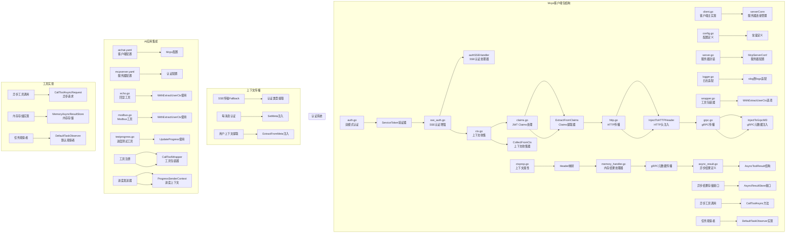

**图表来源**
- [client.go:1-350](file://common/mcpx/client.go#L1-L350)
- [config.go:1-23](file://common/mcpx/config.go#L1-L23)
- [auth.go:1-77](file://common/mcpx/auth.go#L1-L77)
- [wrapper.go:1-216](file://common/mcpx/wrapper.go#L1-L216)
- [ctxprop.go:1-79](file://common/mcpx/ctxprop.go#L1-L79)
- [sse_auth.go:1-177](file://common/mcpx/sse_auth.go#L1-L177)
- [ctx.go:1-78](file://common/ctxprop/ctx.go#L1-L78)
- [claims.go:1-69](file://common/ctxprop/claims.go#L1-L69)
- [http.go:1-37](file://common/ctxprop/http.go#L1-L37)
- [memory_handler.go:1-414](file://common/mcpx/memory_handler.go#L1-L414)
- [async_result.go:1-100](file://common/mcpx/async_result.go#L1-L100)

**章节来源**
- [client.go:1-350](file://common/mcpx/client.go#L1-L350)
- [config.go:1-23](file://common/mcpx/config.go#L1-L23)

## 核心组件

Mcpx客户端包包含以下核心组件：

### 客户端管理器（Client）

客户端管理器是整个包的核心，负责管理多个MCP服务器连接，聚合工具资源，并提供统一的工具调用接口。

**主要特性：**
- 多服务器连接管理
- 工具聚合和路由
- 自动重连机制
- 性能监控和指标收集
- 线程安全的并发访问
- **更新** 每消息认证机制，自动注入上下文属性
- **新增** 用户上下文提取功能，支持从_Meta字段自动提取用户身份信息
- **新增** 增强的工具调用日志记录，提供完整的调用追踪
- **新增** 异步工具调用支持，包含进度处理和结果管理
- **新增** 完整的异步结果处理系统，支持长时间运行任务的进度跟踪
- **更新** 时间戳精度升级，所有时间戳字段从秒级改为毫秒级

### 服务器连接（serverConn）

单个MCP服务器的连接管理器，负责维护与特定MCP服务器的连接状态。

**主要职责：**
- 连接建立和维护
- 工具列表刷新
- 会话管理和生命周期控制
- 错误处理和恢复
- **更新** 每消息上下文注入，通过SetMeta方法传递认证信息
- **新增** 用户上下文提取，支持从JSON-RPC请求的_Meta字段提取用户身份信息
- **新增** 详细的工具调用日志记录，包含会话ID和参数信息
- **新增** 异步工具调用的进度处理和结果管理

### 配置系统

提供灵活的配置选项，支持不同的连接参数和行为设置。

**配置选项：**
- 服务器端点配置
- 连接超时设置
- 刷新间隔配置
- 认证令牌配置
- **更新** UseStreamable传输协议选择标志
- **更新** SSE认证会话管理配置
- **新增** 用户上下文提取配置选项
- **新增** 消息超时时间配置（默认30分钟）

**章节来源**
- [client.go:19-44](file://common/mcpx/client.go#L19-L44)
- [config.go:11-23](file://common/mcpx/config.go#L11-L23)

## 架构概览

Mcpx客户端包采用分层架构设计，确保了良好的模块化和可扩展性：

```mermaid
graph TB
subgraph "应用层"
A[AI聊天应用<br/>aichat]
B[其他业务应用]
C[MCP服务器应用<br/>mcpserver]
D[异步工具调用应用<br/>asynctoolcalllogic]
E[异步结果查询应用<br/>asynctoolresultlogic]
end
subgraph "Mcpx客户端层"
F[Client<br/>客户端管理器]
G[serverConn<br/>服务器连接]
H[工具聚合<br/>路由管理]
I[每消息认证<br/>上下文注入]
J[用户上下文提取<br/>WithExtractUserCtx]
K[工具调用日志<br/>可观测性增强]
L[CallToolWrapper<br/>工具包装器]
M[MemoryAsyncResultStore<br/>内存结果存储]
N[DefaultTaskObserver<br/>默认任务观察者]
O[ProgressCallback<br/>进度回调接口]
end
subgraph "统一传输层"
P[Streamable HTTP<br/>统一传输协议]
Q[SSE传输<br/>兼容模式]
R[HTTP客户端<br/>ctxHeaderTransport]
S[增强SSE传输<br/>authSSEHandler]
T[SetMeta注入<br/>JSON-RPC请求]
U[ExtractFromMeta注入<br/>用户上下文提取]
V[UpdateProgress方法<br/>进度更新]
W[CallToolAsync方法<br/>异步调用]
end
subgraph "双模式认证层"
X[ServiceToken验证器<br/>连接级认证]
Y[JWT解析器<br/>用户级认证]
Z[Claims提取<br/>用户信息解析]
AA[SSE认证增强<br/>会话管理]
BB[用户上下文提取<br/>ExtractFromMeta]
CC[默认用户ID设置<br/>"service"]
end
subgraph "增强上下文传播层"
DD[HTTP头传播<br/>MCP客户端]
EE[gRPC元数据传播<br/>RPC客户端拦截器]
FF[流式RPC处理<br/>服务端拦截器]
GG[SSE传输Fallback<br/>认证类型提取]
HH[增强日志输出<br/>认证类型记录]
II[每消息上下文<br/>SetMeta注入]
JJ[工具调用追踪<br/>会话ID记录]
KK[用户身份透传<br/>gRPC元数据注入]
LL[进度事件发射器<br/>progressEmitter]
MM[异步结果存储<br/>AsyncResultStore]
NN[任务观察者模式<br/>DefaultTaskObserver]
OO[进度回调处理<br/>ProgressCallback]
end
subgraph "MCP服务器层"
PP[McpServer<br/>服务器封装]
QQ[工具注册<br/>Echo/Modbus/TestProgress]
RR[认证中间件<br/>RequireBearerToken]
SS[SSE认证处理器<br/>authSSEHandler]
TT[CallToolWrapper<br/>工具包装器]
UU[WithExtractUserCtx<br/>用户上下文提取]
VV[GetProgressSender<br/>进度发送器]
WW[UpdateProgress<br/>进度更新]
XX[AsyncToolResult<br/>异步结果]
YY[ProgressMessage<br/>进度消息]
ZZ[Messages历史<br/>进度历史]
AAA[ListAsyncResultsReq<br/>分页查询请求]
BBB[AsyncResultStats<br/>统计信息]
CCC[TaskObserver<br/>任务观察者接口]
end
A --> F
F --> G
F --> H
F --> I
F --> J
F --> K
F --> L
G --> P
G --> Q
I --> T
J --> U
K --> JJ
L --> TT
L --> UU
M --> WW
N --> OO
O --> NN
P --> R
Q --> S
R --> T
S --> SS
SS --> AA
AA --> X
X --> Y
Y --> Z
Z --> BB
BB --> DD
DD --> EE
EE --> FF
FF --> GG
GG --> HH
HH --> II
II --> KK
KK --> LL
LL --> MM
MM --> NN
NN --> OO
OO --> PP
PP --> QQ
QQ --> RR
RR --> SS
SS --> TT
TT --> UU
UU --> VV
VV --> WW
WW --> XX
XX --> YY
YY --> ZZ
ZZ --> AAA
AAA --> BBB
BBB --> CCC
```

**更新** 传输层现在采用统一架构，通过UseStreamable配置标志动态选择Streamable HTTP或SSE传输协议，简化了协议选择机制。同时增加了每消息认证机制，确保每次工具调用都携带最新的用户上下文信息，特别是在SSE传输协议下提供了更精确的认证控制。

**新增** 架构中增加了用户上下文提取功能，通过WithExtractUserCtx选项支持从_JSON-RPC请求的_Meta字段自动提取用户身份信息，并将其注入到Go上下文值中，使业务层能够访问用户身份信息。同时增加了工具调用日志记录层，通过WithCtxProp函数的增强日志功能，提供完整的工具调用追踪能力，包括会话ID和请求参数的详细记录。

**新增** 异步结果处理系统得到了全面增强，包括AsyncResultStore接口定义、MemoryAsyncResultStore内存存储实现、CallToolAsync异步调用方法、DefaultTaskObserver任务观察者模式，以及完整的异步工具调用支持。

**更新** 时间戳精度升级：所有时间戳字段（CreatedAt、UpdatedAt、Time）现在使用毫秒级精度，提供更精确的时间记录能力。

**图表来源**
- [client.go:46-107](file://common/mcpx/client.go#L46-L107)
- [server.go:32-71](file://common/mcpx/server.go#L32-L71)
- [auth.go:17-60](file://common/mcpx/auth.go#L17-L60)
- [wrapper.go:28-35](file://common/mcpx/wrapper.go#L28-L35)
- [sse_auth.go:28-48](file://common/mcpx/sse_auth.go#L28-L48)
- [ctxprop.go:33](file://common/mcpx/ctxprop.go#L33)
- [memory_handler.go:64-95](file://common/mcpx/memory_handler.go#L64-L95)
- [async_result.go:26-42](file://common/mcpx/async_result.go#L26-L42)

## 详细组件分析

### 客户端管理器实现

客户端管理器是Mcpx包的核心组件，负责协调多个MCP服务器的连接和工具调用。

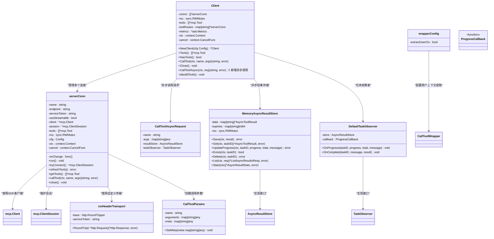

**图表来源**
- [client.go:19-44](file://common/mcpx/client.go#L19-L44)
- [client.go:45-107](file://common/mcpx/client.go#L45-L107)
- [client.go:327-350](file://common/mcpx/client.go#L327-L350)
- [wrapper.go:20-35](file://common/mcpx/wrapper.go#L20-L35)
- [memory_handler.go:17-30](file://common/mcpx/memory_handler.go#L17-L30)
- [memory_handler.go:175-188](file://common/mcpx/memory_handler.go#L175-L188)

#### 连接管理流程

客户端启动时会为每个配置的服务器创建连接管理器，并启动后台goroutine进行连接维护：

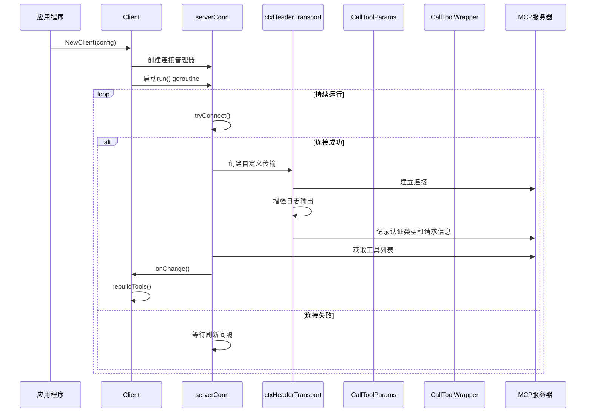

**图表来源**
- [client.go:184-204](file://common/mcpx/client.go#L184-L204)
- [client.go:206-237](file://common/mcpx/client.go#L206-L237)
- [client.go:342-350](file://common/mcpx/client.go#L342-L350)

**章节来源**
- [client.go:45-180](file://common/mcpx/client.go#L45-L180)

### 增强的工具调用日志记录

**新增** WithCtxProp函数现在包含了增强的工具调用日志记录功能，显著提升了系统的可观测性：

```mermaid
flowchart TD
A[工具调用请求] --> B[WithCtxProp包装器]
B --> C[记录会话ID和参数]
C --> D[sessionId: req.GetSession().ID()]
D --> E[param: args]
E --> F[继续认证流程]
F --> G[执行工具处理器]
G --> H[返回结果]
```

**图表来源**
- [ctxprop.go:33](file://common/mcpx/ctxprop.go#L33)

#### 日志记录实现细节

增强的日志记录功能通过以下方式实现：

1. **会话ID记录**：使用`req.GetSession().ID()`获取当前会话的唯一标识符
2. **参数记录**：记录传入的工具调用参数，便于调试和追踪
3. **上下文日志**：使用`logx.WithContext(ctx)`确保日志包含完整的上下文信息
4. **级别控制**：使用Infof级别记录主要调用信息，Debugf级别记录详细认证信息

**章节来源**
- [ctxprop.go:21-60](file://common/mcpx/ctxprop.go#L21-L60)

## 每消息认证机制

**更新** Mcpx包引入了全新的每消息认证机制，callTool方法现在自动检查上下文属性并通过SetMeta方法注入到JSON-RPC请求中。这一机制确保每次工具调用都携带最新的用户上下文信息，特别适用于SSE传输协议，提供了更精确的认证控制和更好的安全性。

### 认证机制流程

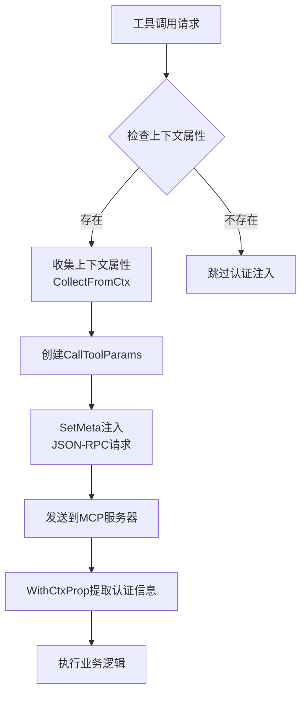

**图表来源**
- [client.go:281-311](file://common/mcpx/client.go#L281-L311)
- [ctx.go:12-23](file://common/ctxprop/ctx.go#L12-L23)

### 每消息上下文注入实现

每消息认证机制通过callTool方法实现，确保每次工具调用都携带最新的用户上下文信息：

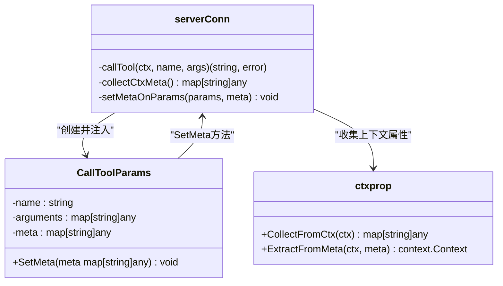

**图表来源**
- [client.go:281-311](file://common/mcpx/client.go#L281-L311)
- [ctx.go:12-23](file://common/ctxprop/ctx.go#L12-L23)

### 上下文属性收集机制

每消息认证机制通过CollectFromCtx函数收集上下文中的属性信息：

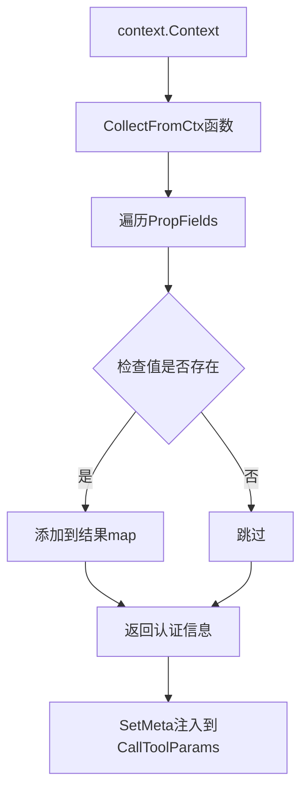

**图表来源**
- [ctx.go:12-23](file://common/ctxprop/ctx.go#L12-L23)

**章节来源**
- [client.go:281-311](file://common/mcpx/client.go#L281-L311)
- [ctx.go:12-23](file://common/ctxprop/ctx.go#L12-L23)

## 用户上下文提取功能

**新增** Mcpx包引入了全新的用户上下文提取功能，通过WithExtractUserCtx选项支持从_JSON-RPC请求的_Meta字段自动提取用户身份信息，并将其注入到Go上下文值中。此功能保持向后兼容性，同时为需要用户身份访问的应用提供可选的增强功能。

### 用户上下文提取机制

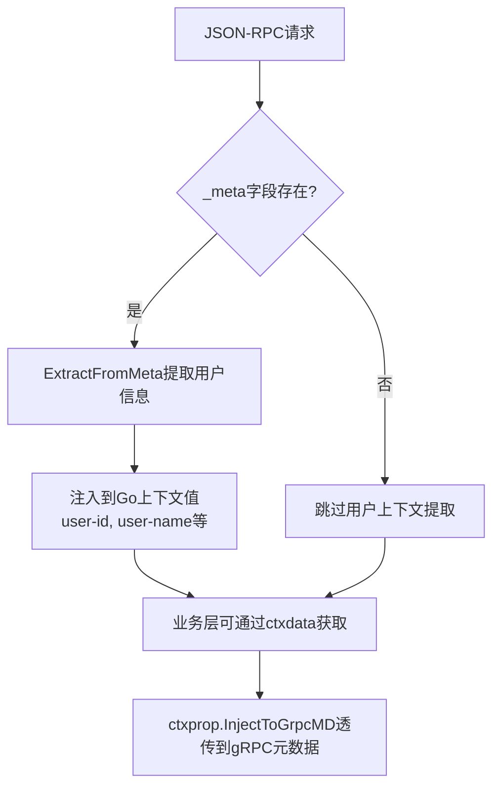

**图表来源**
- [wrapper.go:28-35](file://common/mcpx/wrapper.go#L28-L35)
- [wrapper.go:133-137](file://common/mcpx/wrapper.go#L133-L137)
- [ctxprop.go:28-41](file://common/mcpx/ctxprop.go#L28-L41)

### WithExtractUserCtx选项实现

WithExtractUserCtx选项提供了灵活的用户上下文提取配置：

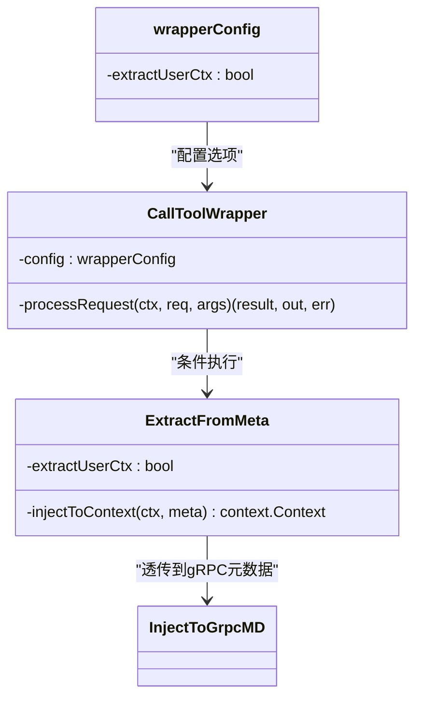

**图表来源**
- [wrapper.go:20-35](file://common/mcpx/wrapper.go#L20-L35)
- [wrapper.go:91-154](file://common/mcpx/wrapper.go#L91-L154)
- [ctxprop.go:28-41](file://common/mcpx/ctxprop.go#L28-L41)

### 用户上下文提取流程

用户上下文提取功能通过以下流程实现：

1. **选项配置**：通过WithExtractUserCtx()启用用户上下文提取功能
2. **条件检查**：仅当请求包含_Meta字段且配置启用提取时才执行
3. **字段提取**：从_Meta字段中提取user-id, user-name等用户身份信息
4. **上下文注入**：将提取的用户信息注入到Go上下文值中
5. **gRPC透传**：业务层可通过ctxprop.InjectToGrpcMD(ctx)将用户身份透传到gRPC元数据

**章节来源**
- [wrapper.go:28-35](file://common/mcpx/wrapper.go#L28-L35)
- [wrapper.go:133-137](file://common/mcpx/wrapper.go#L133-L137)
- [ctxprop.go:28-41](file://common/mcpx/ctxprop.go#L28-L41)

## 增强上下文传播框架

**更新** Mcpx包提供了完整的上下文传播框架，支持HTTP、gRPC和MCP三层协议的统一上下文传递，确保用户信息能够在工具调用链中正确传递。本次更新重点增强了每消息认证机制和SSE传输协议的fallback处理机制。

### 上下文传播机制

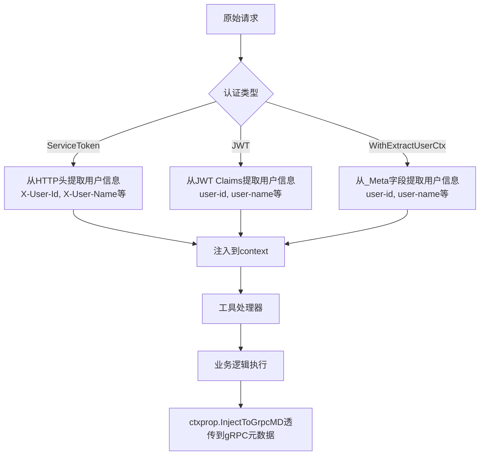

**图表来源**
- [ctxprop.go:15-19](file://common/mcpx/ctxprop.go#L15-L19)
- [wrapper.go:133-137](file://common/mcpx/wrapper.go#L133-L137)

### 上下文字段定义

上下文传播框架基于统一的字段定义，支持多种传输协议的自动转换：

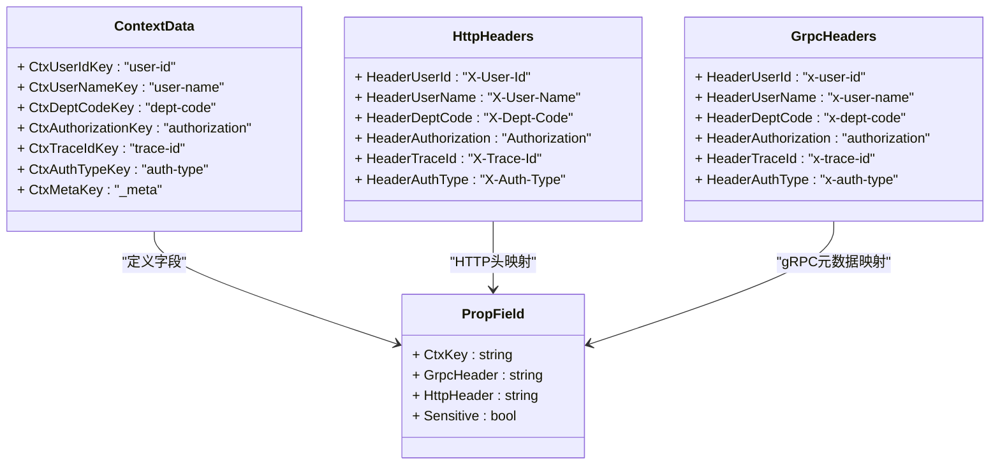

**图表来源**
- [ctxData.go:22-38](file://common/ctxdata/ctxData.go#L22-L38)

### 上下文传播实现

上下文传播框架提供了三个层次的传播机制：

1. **HTTP头传播**：用于MCP客户端到服务器的上下文传递
2. **gRPC元数据传播**：用于RPC客户端到服务端的上下文传递  
3. **Claims提取**：用于JWT用户信息的结构化提取
4. **用户上下文提取**：用于_MCP服务器到业务层的用户身份传递

**更新** 增强的上下文传播框架现在支持每消息认证机制和用户上下文提取：

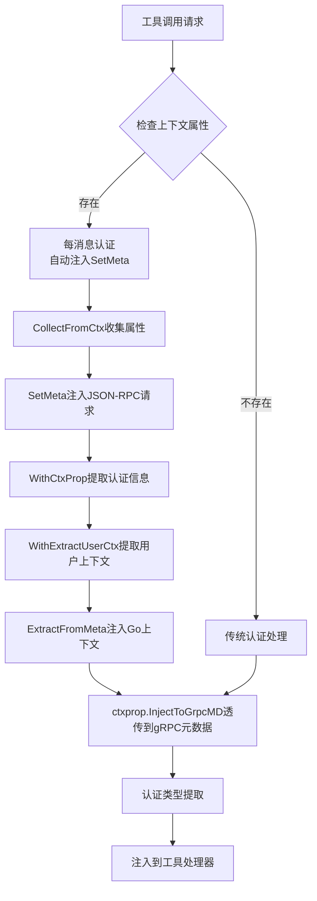

**图表来源**
- [client.go:291-294](file://common/mcpx/client.go#L291-L294)
- [ctxprop.go:29-58](file://common/mcpx/ctxprop.go#L29-L58)
- [wrapper.go:133-137](file://common/mcpx/wrapper.go#L133-L137)

### 认证类型提取逻辑

**更新** 改进了认证类型提取逻辑，提供更准确的认证类型识别：

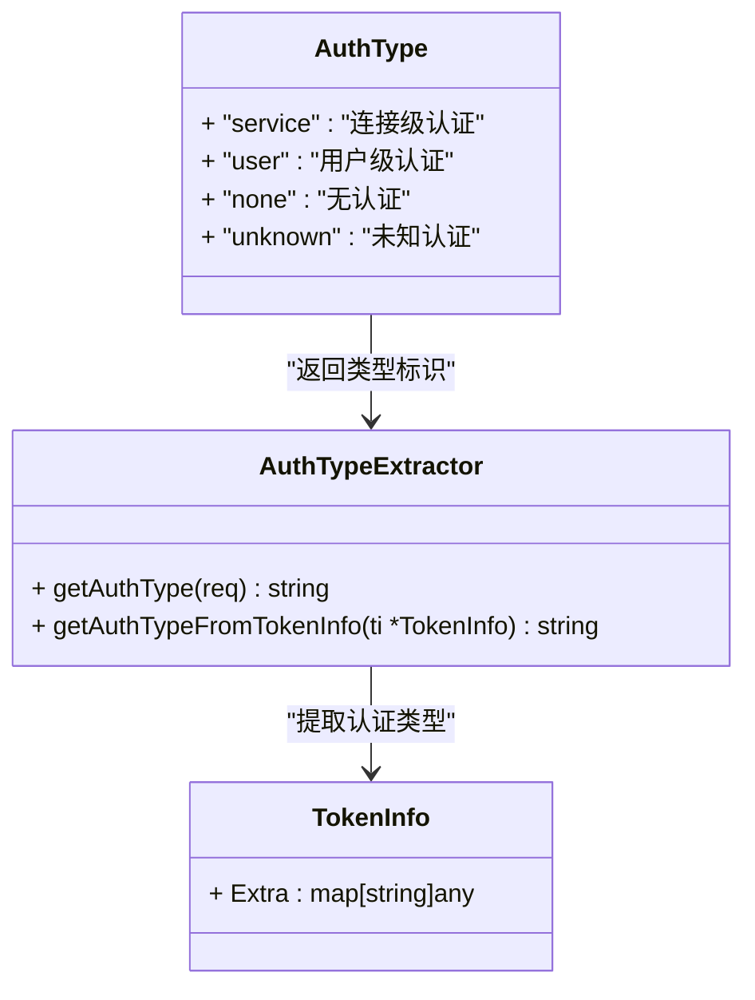

**图表来源**
- [ctxprop.go:61-79](file://common/mcpx/ctxprop.go#L61-L79)

**章节来源**
- [ctxprop.go:1-79](file://common/mcpx/ctxprop.go#L1-L79)
- [ctxData.go:1-74](file://common/ctxdata/ctxData.go#L1-L74)
- [ctx.go:1-39](file://common/ctxprop/ctx.go#L1-L39)

## 双模式认证系统

**更新** Mcpx包实现了双模式的身份验证系统，支持ServiceToken和JWT两种认证方式，提供更灵活的安全控制机制。本次更新进一步增强了每消息认证机制和SSE传输协议的兼容性。

### 认证流程

```mermaid
flowchart TD
A[收到认证请求] --> B{检查ServiceToken}
B --> |匹配| C[返回ServiceToken信息<br/>过期时间24小时<br/>类型: service<br/>默认用户ID: "service"]
B --> |不匹配| D{检查JWT配置}
D --> |无JWT| E[认证失败<br/>ErrInvalidToken]
D --> |有JWT| F[解析JWT令牌]
F --> G{解析成功?}
G --> |否| E
G --> |是| H[提取Claims<br/>构建完整用户信息]
H --> I[设置用户ID和过期时间]
I --> J[返回JWT信息<br/>类型: user]
style A fill:#e1f5fe
style C fill:#c8e6c9
style E fill:#ffcdd2
style J fill:#c8e6c9
```

**图表来源**
- [auth.go:21-59](file://common/mcpx/auth.go#L21-L59)

### 认证验证器实现

双模式认证验证器提供了统一的认证接口，优先使用ServiceToken进行连接级认证，失败后再尝试JWT进行用户级认证：

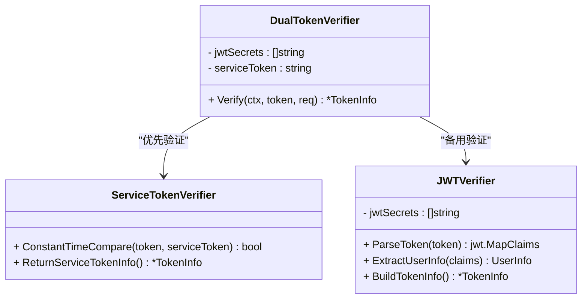

**图表来源**
- [auth.go:21-59](file://common/mcpx/auth.go#L21-L59)

**更新** 认证系统在服务令牌认证时设置了默认用户ID为"service"，这为系统提供了明确的连接级认证标识，便于区分不同级别的认证来源。

**章节来源**
- [auth.go:17-77](file://common/mcpx/auth.go#L17-L77)

## SSE认证增强系统

**新增** Mcpx包引入了全新的SSE认证增强系统，专门针对SSE传输协议的认证需求进行了优化，确保POST请求中的认证信息能够正确传递到工具处理器。

### SSE认证处理器架构

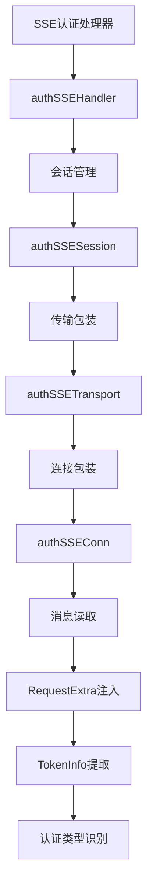

**图表来源**
- [sse_auth.go:28-48](file://common/mcpx/sse_auth.go#L28-L48)
- [sse_auth.go:131-165](file://common/mcpx/sse_auth.go#L131-L165)

### SSE认证会话管理

SSE认证系统通过会话管理机制确保每个SSE连接的认证信息独立存储和传递：

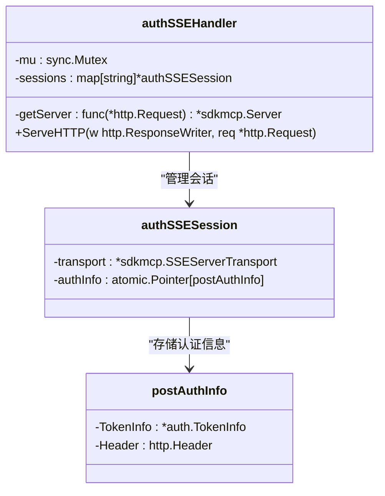

**图表来源**
- [sse_auth.go:16-48](file://common/mcpx/sse_auth.go#L16-L48)

### SSE传输包装机制

SSE认证系统通过传输包装机制在消息读取时自动注入认证信息：

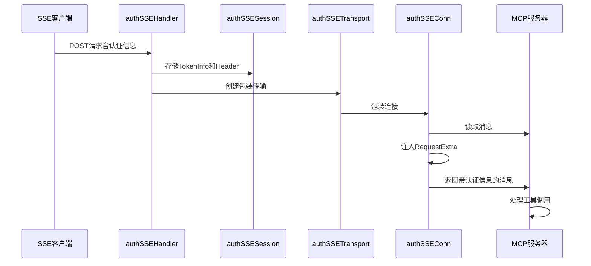

**图表来源**
- [sse_auth.go:50-129](file://common/mcpx/sse_auth.go#L50-L129)
- [sse_auth.go:151-165](file://common/mcpx/sse_auth.go#L151-L165)

### SSE服务器集成

SSE认证系统与MCP服务器的集成确保了认证信息的正确传递：

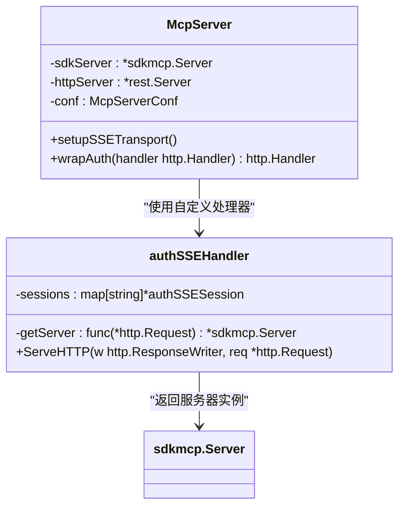

**图表来源**
- [server.go:92-124](file://common/mcpx/server.go#L92-L124)
- [server.go:100-102](file://common/mcpx/server.go#L100-L102)

**章节来源**
- [sse_auth.go:1-177](file://common/mcpx/sse_auth.go#L1-L177)
- [server.go:92-124](file://common/mcpx/server.go#L92-L124)

## RPC拦截器实现

**新增** Mcpx包改进了RPC拦截器实现，提供了完整的gRPC元数据传播和流式RPC上下文处理能力。

### gRPC客户端拦截器

```mermaid
sequenceDiagram
participant Client as gRPC客户端
participant Interceptor as MetadataInterceptor
participant Server as gRPC服务端
Client->>Interceptor : 发送请求
Interceptor->>Interceptor : 从context提取字段
Interceptor->>Interceptor : 注入到gRPC元数据
Interceptor->>Server : 发送带有元数据的请求
Server->>Server : 服务端拦截器提取元数据
Server->>Server : 注入到服务端context
Server-->>Client : 返回响应
```

**图表来源**
- [metadataInterceptor.go:11-19](file://common/Interceptor/rpcclient/metadataInterceptor.go#L11-L19)

### gRPC服务端拦截器

服务端拦截器提供了两种实现，分别处理一元RPC和流式RPC：

```mermaid
classDiagram
class LoggerInterceptor {
+ UnaryInterceptor(ctx, req, info, handler) resp, err
+ ExtractFromGrpcMD(ctx) context.Context
}
class StreamLoggerInterceptor {
+ StreamInterceptor(srv, ss, info, handler) error
+ ExtractFromGrpcMD(ctx) context.Context
+ wrappedStream Context() context.Context
}
LoggerInterceptor --> ExtractFromGrpcMD : "提取元数据"
StreamLoggerInterceptor --> ExtractFromGrpcMD : "提取元数据"
StreamLoggerInterceptor --> wrappedStream : "包装流上下文"
```

**图表来源**
- [loggerInterceptor.go:12-43](file://common/Interceptor/rpcserver/loggerInterceptor.go#L12-L43)

**章节来源**
- [metadataInterceptor.go:1-20](file://common/Interceptor/rpcclient/metadataInterceptor.go#L1-L20)
- [loggerInterceptor.go:1-44](file://common/Interceptor/rpcserver/loggerInterceptor.go#L1-L44)

## 传输协议选择机制

**更新** Mcpx客户端包现在支持统一的传输协议选择机制，通过UseStreamable配置标志动态选择传输协议。本次更新增强了每消息认证机制和SSE传输协议的兼容性。

### 传输协议配置

```mermaid
flowchart TD
A[ServerConfig] --> B{UseStreamable配置}
B --> |true| C[Streamable HTTP传输]
B --> |false| D[SSE传输协议]
C --> E[StreamableClientTransport]
D --> F[SSEClientTransport]
E --> G[统一传输接口]
F --> G
G --> H[MCP客户端连接]
```

**图表来源**
- [config.go:11-16](file://common/mcpx/config.go#L11-L16)
- [client.go:208-222](file://common/mcpx/client.go#L208-L222)

### 传输协议选择实现

传输协议的选择在连接建立时进行，确保了运行时的灵活性：

```mermaid
sequenceDiagram
participant Client as 客户端
participant Config as 配置
participant Transport as 传输层
participant Server as MCP服务器
Client->>Config : 读取UseStreamable标志
Config-->>Client : 返回传输协议类型
alt UseStreamable = true
Client->>Transport : 创建StreamableClientTransport
Transport->>Server : 建立Streamable连接
Transport->>Transport : 增强日志输出
Transport->>Transport : 记录认证类型和请求信息
else UseStreamable = false
Client->>Transport : 创建SSEClientTransport
Transport->>Server : 建立SSE连接
Transport->>Transport : SSE认证增强处理
Transport->>Transport : 会话管理认证信息
end
Server-->>Client : 连接建立成功
```

**图表来源**
- [client.go:208-222](file://common/mcpx/client.go#L208-L222)

### 配置示例

**更新** 配置文件现在包含UseStreamable标志，支持灵活的传输协议选择：

```yaml
Mcpx:
  Servers:
    - Name: "mcpserver"
      Endpoint: "http://localhost:13003/sse"
      ServiceToken: "mcp-internal-service-token-2026"
      UseStreamable: false  # 选择SSE传输协议
  RefreshInterval: 30s
  ConnectTimeout: 10s
```

**章节来源**
- [config.go:11-16](file://common/mcpx/config.go#L11-L16)
- [client.go:208-222](file://common/mcpx/client.go#L208-L222)
- [aichat.yaml:8-15](file://aiapp/aichat/etc/aichat.yaml#L8-L15)

## 异步结果处理系统

**新增** Mcpx包引入了完整的异步结果处理系统，支持长时间运行任务的进度跟踪和结果管理。该系统包括内存版结果处理器和进度处理器，提供完整的异步工具调用支持。

### 异步结果处理架构

```mermaid
flowchart TD
A[异步工具调用] --> B[CallToolAsync]
B --> C[生成taskID]
C --> D[创建DefaultTaskObserver]
D --> E[后台执行工具]
E --> F[ProgressCallback回调]
F --> G[MemoryAsyncResultStore.UpdateProgress]
G --> H[保存进度到缓存]
H --> I[记录进度历史]
I --> J[外部通知]
E --> K[保存最终结果]
K --> L[设置completed状态]
L --> M[返回taskID给客户端]
M --> N[客户端查询结果]
N --> O[AsyncResultStore.Get]
O --> P[返回AsyncToolResult]
```

**图表来源**
- [client.go:907-963](file://common/mcpx/client.go#L907-L963)
- [memory_handler.go:32-46](file://common/mcpx/memory_handler.go#L32-L46)
- [memory_handler.go:64-95](file://common/mcpx/memory_handler.go#L64-L95)
- [memory_handler.go:190-210](file://common/mcpx/memory_handler.go#L190-L210)

### 异步结果数据结构

**更新** 异步结果处理系统基于以下核心数据结构，现已升级为毫秒级时间戳精度：

```mermaid
classDiagram
class AsyncToolResult {
+ TaskID : string
+ Status : string
+ Result : string
+ Error : string
+ Progress : float64
+ Total : float64
+ Messages : []ProgressMessage
+ CreatedAt : int64 // 毫秒级时间戳
+ UpdatedAt : int64 // 毫秒级时间戳
}
class ProgressMessage {
+ Progress : float64
+ Total : float64
+ Message : string
+ Time : int64 // 毫秒级时间戳
}
class AsyncResultStore {
<<interface>>
+ Save(ctx, result) error
+ Get(ctx, taskID) (*AsyncToolResult, error)
+ UpdateProgress(ctx, taskID, progress, total, message) error
+ Exists(ctx, taskID) bool
+ Delete(ctx, taskID) error
+ List(ctx, req) (*ListAsyncResultsResp, error)
+ Stats(ctx) (*AsyncResultStats, error)
}
class ProgressCallback {
<<function>>
}
class MemoryAsyncResultStore {
- data : map[string]*AsyncToolResult
- expiries : map[string]int64
- mu : sync.RWMutex
+ Save(ctx, result) error
+ Get(ctx, taskID) (*AsyncToolResult, error)
+ UpdateProgress(ctx, taskID, progress, total, message) error
+ Exists(ctx, taskID) bool
+ Delete(ctx, taskID) error
+ List(ctx, req) (*ListAsyncResultsResp, error)
+ Stats(ctx) (*AsyncResultStats, error)
}
class DefaultTaskObserver {
- store : AsyncResultStore
- callback : ProgressCallback
+ OnProgress(taskID, progress, total, message) void
+ OnComplete(taskID, message, result) void
}
class CallToolAsyncRequest {
+ Name : string
+ Args : map[string]any
+ ResultStore : AsyncResultStore
+ TaskObserver : TaskObserver
}
class ListAsyncResultsReq {
+ Status : string
+ StartTime : int64 // 毫秒级时间戳
+ EndTime : int64 // 毫秒级时间戳
+ Page : int
+ PageSize : int
+ SortField : string
+ SortOrder : string
}
class ListAsyncResultsResp {
+ Items : []*AsyncToolResult
+ Total : int64
+ Page : int
+ PageSize : int
+ TotalPages : int
}
class AsyncResultStats {
+ Total : int64
+ Pending : int64
+ Completed : int64
+ Failed : int64
+ SuccessRate : float64
}
class TaskObserver {
<<interface>>
+ OnProgress(taskID, progress, total, message) void
+ OnComplete(taskID, message, result) void
}
AsyncResultStore <|-- MemoryAsyncResultStore
TaskObserver <|-- DefaultTaskObserver
AsyncToolResult --> ProgressMessage : "包含历史消息"
MemoryAsyncResultStore --> AsyncResultStore : "实现接口"
DefaultTaskObserver --> TaskObserver : "实现接口"
CallToolAsyncRequest --> AsyncResultStore : "使用存储"
CallToolAsyncRequest --> TaskObserver : "使用观察者"
ListAsyncResultsReq --> AsyncResultStore : "分页查询"
AsyncResultStats --> AsyncResultStore : "统计查询"
```

**图表来源**
- [async_result.go:13-24](file://common/mcpx/async_result.go#L13-L24)
- [async_result.go:26-42](file://common/mcpx/async_result.go#L26-L42)
- [memory_handler.go:17-30](file://common/mcpx/memory_handler.go#L17-L30)
- [memory_handler.go:175-188](file://common/mcpx/memory_handler.go#L175-L188)

### 异步工具调用流程

异步工具调用通过以下流程实现：

```mermaid
sequenceDiagram
participant Client as 客户端
participant AsyncClient as 异步客户端
participant Observer as TaskObserver
participant Store as AsyncResultStore
participant Tool as MCP工具
Client->>AsyncClient : CallToolAsync(request)
AsyncClient->>AsyncClient : 生成taskID
AsyncClient->>Observer : 创建DefaultTaskObserver
AsyncClient->>AsyncClient : 创建独立context
AsyncClient->>Tool : 后台执行工具
Tool->>Observer : OnProgress(0, 0, "开始执行...")
Observer->>Store : UpdateProgress(0, 0, "开始执行...")
Loop 进度更新
Tool->>Observer : OnProgress(progress, total, message)
Observer->>Store : UpdateProgress(progress, total, message)
end
Tool->>Observer : OnComplete(finalMessage, result)
Observer->>Store : Save(completed状态)
AsyncClient-->>Client : 返回taskID
Client->>Store : 查询结果
Store-->>Client : 返回AsyncToolResult
```

**图表来源**
- [client.go:907-963](file://common/mcpx/client.go#L907-L963)
- [memory_handler.go:64-95](file://common/mcpx/memory_handler.go#L64-L95)
- [memory_handler.go:190-210](file://common/mcpx/memory_handler.go#L190-L210)

### 异步结果存储接口

**新增** AsyncResultStore接口定义了异步结果存储的标准规范：

```mermaid
classDiagram
class AsyncResultStore {
<<interface>>
+ Save(ctx, result) error
+ Get(ctx, taskID) (*AsyncToolResult, error)
+ UpdateProgress(ctx, taskID, progress, total, message) error
+ Exists(ctx, taskID) bool
+ Delete(ctx, taskID) error
+ List(ctx, req) (*ListAsyncResultsResp, error)
+ Stats(ctx) (*AsyncResultStats, error)
}
class MemoryAsyncResultStore {
- data : map[string]*AsyncToolResult
- expiries : map[string]int64
- mu : sync.RWMutex
+ Save(ctx, result) error
+ Get(ctx, taskID) (*AsyncToolResult, error)
+ UpdateProgress(ctx, taskID, progress, total, message) error
+ Exists(ctx, taskID) bool
+ Delete(ctx, taskID) error
+ List(ctx, req) (*ListAsyncResultsResp, error)
+ Stats(ctx) (*AsyncResultStats, error)
}
AsyncResultStore <|-- MemoryAsyncResultStore
```

**图表来源**
- [async_result.go:28-44](file://common/mcpx/async_result.go#L28-L44)
- [memory_handler.go:13-31](file://common/mcpx/memory_handler.go#L13-L31)

**章节来源**
- [async_result.go:1-100](file://common/mcpx/async_result.go#L1-L100)
- [memory_handler.go:1-414](file://common/mcpx/memory_handler.go#L1-L414)
- [client.go:907-963](file://common/mcpx/client.go#L907-L963)

## 客户端进度处理

**新增** Mcpx包提供了完整的客户端进度处理机制，支持工具执行过程中的实时进度跟踪和通知。该机制通过全局事件发射器实现进度事件的发布和订阅。

### 进度处理架构

```mermaid
flowchart TD
A[工具执行] --> B[ProgressSender.Emit]
B --> C[progressEmitter.Emit]
C --> D[progressEmitter.Subscribe]
D --> E[ProgressSender.Start]
E --> F[订阅进度事件]
F --> G[session.NotifyProgress]
G --> H[客户端接收进度]
H --> I[UI更新或业务处理]
```

**图表来源**
- [wrapper.go:43-53](file://common/mcpx/wrapper.go#L43-L53)
- [wrapper.go:55-75](file://common/mcpx/wrapper.go#L55-L75)
- [wrapper.go:85-91](file://common/mcpx/wrapper.go#L85-L91)

### 进度发送器实现

进度发送器提供了简洁的API来处理工具执行过程中的进度通知：

```mermaid
classDiagram
class ProgressSender {
-token : string
-ctx : context.Context
-session : *mcp.ServerSession
-cancel : func()
+Emit(progress, total, message) void
+Start() void
+Stop() void
}
class progressEvent {
-token : string
-progress : float64
-total : float64
-message : string
-ctx : context.Context
}
class progressEmitter {
<<global>>
+Subscribe(token) (chan progressEvent, func())
+Emit(token, event) void
}
ProgressSender --> progressEvent : "创建事件"
ProgressSender --> progressEmitter : "发布事件"
progressEmitter --> ProgressSender : "订阅事件"
```

**图表来源**
- [wrapper.go:33-41](file://common/mcpx/wrapper.go#L33-L41)
- [wrapper.go:183-195](file://common/mcpx/wrapper.go#L183-L195)

### 进度处理流程

进度处理通过以下流程实现：

```mermaid
sequenceDiagram
participant Tool as 工具执行器
participant Sender as ProgressSender
participant Emitter as progressEmitter
participant Client as 客户端
Tool->>Sender : Emit(progress, total, message)
Sender->>Emitter : Emit(token, event)
Emitter->>Client : Subscribe(token)
Client->>Client : 接收进度事件
Client->>Client : 更新UI或处理业务
```

**图表来源**
- [wrapper.go:43-75](file://common/mcpx/wrapper.go#L43-L75)

**章节来源**
- [wrapper.go:1-216](file://common/mcpx/wrapper.go#L1-L216)

## 内存结果处理器

**更新** Mcpx包的内存结果处理器得到了重要更新，特别是UpdateProgress方法的签名更新，提供了更精确的进度控制和历史消息管理。所有时间戳字段现在使用毫秒级精度。

### 内存处理器架构

```mermaid
flowchart TD
A[MemoryAsyncResultStore] --> B[Save]
A --> C[Get]
A --> D[UpdateProgress]
A --> E[Exists]
A --> F[Delete]
A --> G[List]
A --> H[Stats]
B --> I[设置时间戳]
C --> J[缓存查找]
D --> K[更新进度字段]
D --> L[保存历史消息]
E --> M[检查存在性]
F --> N[删除缓存项]
G --> O[分页查询]
H --> P[统计分析]
I --> Q[默认24小时过期]
J --> R[错误处理]
K --> S[线程安全]
L --> T[历史记录管理]
M --> U[原子操作]
N --> V[清理过期数据]
O --> W[排序和过滤]
P --> X[成功率计算]
```

**图表来源**
- [memory_handler.go:32-46](file://common/mcpx/memory_handler.go#L32-L46)
- [memory_handler.go:48-62](file://common/mcpx/memory_handler.go#L48-L62)
- [memory_handler.go:64-95](file://common/mcpx/memory_handler.go#L64-L95)
- [memory_handler.go:97-116](file://common/mcpx/memory_handler.go#L97-L116)

### UpdateProgress方法更新

**更新** UpdateProgress方法现在支持更精确的进度控制和历史消息管理，所有时间戳字段使用毫秒级精度：

```mermaid
classDiagram
class MemoryAsyncResultStore {
- data : map[string]*AsyncToolResult
- expiries : map[string]int64
- mu : sync.RWMutex
+ UpdateProgress(ctx, taskID, progress, total, message) error {
// 加锁保护
lock()
try {
// 获取结果
val, ok = data[taskID]
if !ok {
return "async result not found"
}
result, ok = val.(*AsyncToolResult)
if !ok {
return "invalid async result"
}
// 更新进度字段
result.Progress = progress
result.Total = total
result.UpdatedAt = time.Now().UnixMilli()
// 保存历史消息
result.Messages = append(result.Messages, ProgressMessage{
Progress : progress,
Total : total,
Message : message,
Time : time.Now().UnixMilli(),
})
// 更新缓存
data[taskID] = result
return nil
} finally {
unlock()
}
}
}
```

**图表来源**
- [memory_handler.go:97-123](file://common/mcpx/memory_handler.go#L97-L123)

### 进度处理器实现

内存进度处理器提供了统一的进度处理接口，支持存储进度和外部通知：

```mermaid
classDiagram
class DefaultTaskObserver {
- store : AsyncResultStore
- callback : ProgressCallback
+ OnProgress(taskID, progress, total, message) void {
// 如果任务不存在，先创建幂等操作
if !store.Exists(ctx, taskID) {
initialResult : = &AsyncToolResult{
TaskID : taskID,
Status : "pending",
Progress : 0,
CreatedAt : time.Now().UnixMilli(),
UpdatedAt : time.Now().UnixMilli(),
}
store.Save(ctx, initialResult)
}
// 保存进度到存储
store.UpdateProgress(ctx, taskID, progress, total, message)
// 触发外部回调
if callback != nil {
callback(&ProgressInfo{
Token : taskID,
Progress : progress,
Total : total,
Message : message,
})
}
}
+ OnComplete(taskID, message, result) void {
// 获取已有消息历史
existing, err : = store.Get(ctx, taskID)
if err == nil && existing != nil {
result.Messages = existing.Messages
}
// 追加完成消息
now : = time.Now().UnixMilli()
result.Messages = append(result.Messages, ProgressMessage{
Progress : 100,
Total : 100,
Message : message,
Time : now,
})
result.Progress = 100
result.UpdatedAt = now
// 保存最终结果
store.Save(ctx, result)
// 触发外部回调
if callback != nil {
callback(&ProgressInfo{
Token : taskID,
Progress : 100,
Total : 100,
Message : message,
})
}
}
}
DefaultTaskObserver --> AsyncResultStore : "委托存储"
```

**图表来源**
- [memory_handler.go:175-188](file://common/mcpx/memory_handler.go#L175-L188)
- [memory_handler.go:190-210](file://common/mcpx/memory_handler.go#L190-L210)

### 分页查询和统计功能

**新增** MemoryAsyncResultStore提供了完整的分页查询和统计分析功能，所有时间戳字段使用毫秒级精度：

```mermaid
classDiagram
class MemoryAsyncResultStore {
+ List(ctx, req) (*ListAsyncResultsResp, error) {
// 设置默认值
if req.Page < 1 { req.Page = 1 }
if req.PageSize < 1 { req.PageSize = 10 }
if req.PageSize > 100 { req.PageSize = 100 }
// 收集所有结果
allResults : = make([]*AsyncToolResult, 0, len(data))
for _, result : = range data {
// 状态过滤
if req.Status != "" && result.Status != req.Status { continue }
// 时间范围过滤毫秒级时间戳
if req.StartTime > 0 && result.CreatedAt < req.StartTime { continue }
if req.EndTime > 0 && result.CreatedAt > req.EndTime { continue }
allResults = append(allResults, result)
}
// 排序
sortFunc : = getSortFunc(req.SortField, req.SortOrder == "asc")
sort.Slice(allResults, func(i, j int) bool {
return sortFunc(allResults[i], allResults[j])
})
// 计算分页
total : = int64(len(allResults))
totalPages : = total / req.PageSize
if total%req.PageSize > 0 { totalPages++ }
// 返回分页结果
return &ListAsyncResultsResp{
Items : allResults[start : end],
Total : total,
Page : req.Page,
PageSize : req.PageSize,
TotalPages : totalPages,
}, nil
}
+ Stats(ctx) (*AsyncResultStats, error) {
stats : = &AsyncResultStats{}
for _, result : = range data {
stats.Total++
switch result.Status {
case "pending" : stats.Pending++
case "completed" : stats.Completed++
case "failed" : stats.Failed++
}
}
// 计算成功率
if stats.Total > 0 {
stats.SuccessRate = float64(stats.Completed) / float64(stats.Total) * 100
}
return stats, nil
}
}
```

**图表来源**
- [memory_handler.go:142-215](file://common/mcpx/memory_handler.go#L142-L215)
- [memory_handler.go:217-242](file://common/mcpx/memory_handler.go#L217-L242)

**章节来源**
- [memory_handler.go:1-414](file://common/mcpx/memory_handler.go#L1-L414)

## 依赖关系分析

Mcpx客户端包的依赖关系体现了清晰的分层架构：

```mermaid
graph TB
subgraph "外部依赖"
A[modelcontextprotocol/go-sdk/mcp<br/>MCP SDK]
B[zeromicro/go-zero/core/logx<br/>日志系统]
C[zeromicro/go-zero/core/stat<br/>统计监控]
D[zeromicro/go-zero/core/timex<br/>时间工具]
E[golang-jwt/jwt/v4<br/>JWT解析]
F[google.golang.org/grpc<br/>gRPC框架]
G[modelcontextprotocol/go-sdk/auth<br/>认证SDK]
H[modelcontextprotocol/go-sdk/jsonrpc<br/>JSON-RPC SDK]
I[go.opentelemetry.io/otel<br/>链路追踪]
J[go.opentelemetry.io/otel/propagation<br/>传播器]
K[zeromicro/go-zero/core/collection<br/>缓存系统]
L[zeromicro/go-zero/core/threading<br/>并发工具]
M[zeromicro/go-zero/core/antsx<br/>事件发射器]
end
subgraph "内部模块"
N[common/mcpx/client.go<br/>客户端实现]
O[common/mcpx/auth.go<br/>双模式认证]
P[common/mcpx/server.go<br/>服务器封装]
Q[common/mcpx/wrapper.go<br/>工具包装器]
R[common/mcpx/ctxprop.go<br/>上下文属性]
S[common/mcpx/sse_auth.go<br/>SSE认证增强]
T[common/ctxdata/ctxData.go<br/>上下文字段定义]
U[common/ctxprop/claims.go<br/>Claims处理]
V[common/ctxprop/http.go<br/>HTTP传播]
W[common/ctxprop/ctx.go<br/>上下文收集]
X[common/Interceptor/rpcclient/metadataInterceptor.go<br/>RPC客户端拦截器]
Y[common/Interceptor/rpcserver/loggerInterceptor.go<br/>RPC服务端拦截器]
Z[common/tool/tool.go<br/>工具函数]
AA[common/mcpx/logger.go<br/>日志适配]
BB[common/mcpx/memory_handler.go<br/>内存结果处理器]
CC[common/mcpx/async_result.go<br/>异步结果定义]
end
subgraph "AI应用"
DD[aiapp/aichat<br/>聊天应用]
EE[aiapp/mcpserver<br/>MCP服务器]
FF[aiapp/mcpserver/internal/tools<br/>工具实现]
GG[echo.go<br/>回显工具使用WithExtractUserCtx]
HH[modbus.go<br/>Modbus工具使用WithExtractUserCtx]
II[testprogress.go<br/>进度测试工具使用UpdateProgress]
JJ[asynctoolcalllogic.go<br/>异步工具调用逻辑]
KK[asynctoolresultlogic.go<br/>异步结果查询逻辑]
end
subgraph "用户上下文提取"
LL[wrapper.go:28-35<br/>WithExtractUserCtx选项]
MM[wrapper.go:133-137<br/>ExtractFromMeta注入]
NN[ctxprop.go:28-41<br/>ExtractFromMeta函数]
OO[ctxprop.go:10-11<br/>CollectFromCtx函数]
PP[ctxData.go:5-12<br/>CtxMetaKey定义]
QQ[auth.go:27-30<br/>默认用户ID设置]
end
subgraph "链路追踪"
RR[wrapper.go:119-125<br/>ExtractTraceFromMeta]
SS[ctxprop.go:43-51<br/>ExtractTraceFromMeta函数]
TT[I:8-9<br/>otel.TextMapPropagator导入]
UU[J:1-1<br/>propagation.TextMapCarrier接口]
VV[client.go:1025-1036<br/>ctxHeaderTransport实现]
end
subgraph "异步处理"
WW[client.go:907-963<br/>CallToolAsync实现]
XX[memory_handler.go:97-123<br/>UpdateProgress方法]
YY[async_result.go:28-44<br/>AsyncResultStore接口]
ZZ[wrapper.go:183-195<br/>ProgressSender实现]
AAA[asynctoolcalllogic.go:52-60<br/>MemoryProgressHandler使用]
BBBB[asynctoolresultlogic.go:31-56<br/>异步结果查询]
CCCC[servicecontext.go:35<br/>NewMemoryAsyncResultStore使用]
DDDD[DefaultTaskObserver实现]
EEEE[ProgressCallback接口]
end
```

**图表来源**
- [client.go:3-17](file://common/mcpx/client.go#L3-L17)
- [server.go:3-11](file://common/mcpx/server.go#L3-L11)
- [auth.go:3-15](file://common/mcpx/auth.go#L3-L15)
- [sse_auth.go:3-14](file://common/mcpx/sse_auth.go#L3-L14)
- [wrapper.go:3-13](file://common/mcpx/wrapper.go#L3-L13)
- [memory_handler.go:3-11](file://common/mcpx/memory_handler.go#L3-L11)
- [async_result.go:3](file://common/mcpx/async_result.go#L3)

**章节来源**
- [client.go:1-350](file://common/mcpx/client.go#L1-L350)
- [server.go:1-146](file://common/mcpx/server.go#L1-L146)

## 性能考虑

Mcpx客户端包在设计时充分考虑了性能优化：

### 连接池和重用
- 使用长连接而非短连接，减少连接建立开销
- 实现连接池机制，支持多个服务器同时连接
- 自动重连机制，确保连接稳定性

### 缓存策略
- 工具列表缓存，避免频繁查询
- 连接状态缓存，快速响应工具调用
- 性能指标缓存，提供实时监控数据
- **新增** 异步结果缓存，支持长时间运行任务的状态管理

### 并发控制
- 读写锁保护共享资源
- Goroutine池管理后台任务
- 上下文取消机制，优雅关闭连接
- **新增** 进度事件发射器的并发安全设计
- **新增** MemoryAsyncResultStore的线程安全实现

### 监控和诊断
- 内置性能监控指标
- 详细的日志记录
- 连接状态跟踪
- **新增** 异步任务进度监控
- **新增** 异步结果存储性能监控

### 传输协议优化
**更新** 统一传输架构提供了更好的性能表现：
- 减少了协议切换的开销
- 统一的连接管理机制
- 更好的资源利用率
- **更新** 每消息认证机制减少了重复认证的开销
- **新增** 用户上下文提取功能减少了重复解析的内存分配
- **新增** SSE认证增强系统减少了认证信息传递的延迟
- **新增** 异步结果处理系统优化了缓存访问性能

### 认证性能优化
**更新** 双模式认证系统提供了高效的认证性能：
- ServiceToken使用常量时间比较，避免时序攻击
- JWT解析采用多密钥轮询，提高成功率
- Claims提取优化，减少不必要的类型转换
- **更新** 每消息认证机制优化，避免重复收集上下文属性
- **新增** 用户上下文提取功能优化，减少重复注入的内存分配
- **新增** SSE传输协议认证失败的快速检测和恢复
- **新增** 默认用户ID设置为"service"，减少字符串比较开销

### 上下文传播优化
**更新** 增强的上下文传播框架提供了高效的跨协议数据传递：
- 统一的字段定义，减少转换开销
- 批量字段处理，提高传播效率
- 智能过滤机制，避免不必要的数据传递
- **更新** 每消息认证机制优化，减少上下文收集的CPU消耗
- **新增** 用户上下文提取功能优化，减少重复注入的内存分配
- **新增** SSE传输fallback处理，确保认证类型提取的准确性
- **新增** 增强日志输出，提供详细的认证类型和请求信息

### SSE认证性能优化
**新增** SSE认证增强系统提供了专门的性能优化：
- 原子指针存储认证信息，减少锁竞争
- 会话ID随机生成，避免碰撞
- 传输包装最小化，减少额外开销
- 认证信息缓存，避免重复解析
- **更新** 每消息认证机制优化，减少SetMeta注入的内存分配
- **新增** 用户上下文提取功能优化，减少ExtractFromMeta的CPU消耗

### 每消息认证性能优化
**更新** 每消息认证机制提供了专门的性能优化：
- 上下文属性收集缓存，避免重复遍历
- SetMeta方法优化，减少JSON序列化开销
- 条件注入机制，只有在上下文存在时才进行注入
- 批量认证信息处理，提高处理效率

### 用户上下文提取性能优化
**新增** 用户上下文提取功能提供了专门的性能优化：
- _meta字段解析缓存，避免重复解析
- 条件提取机制，只有在启用选项时才进行提取
- 批量字段注入，减少上下文值设置的开销
- gRPC元数据透传优化，减少额外的序列化开销

### 工具调用日志记录性能优化
**新增** 增强的工具调用日志记录功能提供了性能优化：
- 会话ID获取优化，避免重复计算
- 参数序列化延迟到必要时进行
- 日志级别控制，减少不必要的日志开销
- 上下文日志集成，避免额外的上下文传递

### 异步结果处理性能优化
**新增** 异步结果处理系统提供了全面的性能优化：
- 缓存系统优化，减少内存分配
- 并发安全设计，避免锁竞争
- 历史消息管理优化，控制内存使用
- 进度事件发射器优化，提高事件处理效率
- **更新** UpdateProgress方法签名更新，提供更精确的进度控制
- **新增** MemoryAsyncResultStore的分页查询优化
- **新增** DefaultTaskObserver的回调处理优化
- **新增** Stats统计功能的性能优化

### 内存存储性能优化
**新增** MemoryAsyncResultStore提供了专门的性能优化：
- 读写锁优化，减少锁竞争
- 过期清理定时器优化，避免频繁扫描
- 分页查询算法优化，提高查询效率
- 统计计算优化，减少CPU消耗
- 历史消息追加优化，避免不必要的内存复制
- **更新** 所有时间戳字段使用毫秒级精度，提供更精确的时间记录

### 任务观察者性能优化
**新增** DefaultTaskObserver提供了专门的性能优化：
- 幂等操作优化，避免重复创建任务
- 回调处理异步化，减少阻塞
- 进度消息合并优化，减少存储空间
- 完成消息追加优化，提高保存效率

### 进度处理性能优化
**新增** 进度处理系统提供了专门的性能优化：
- 全局事件发射器优化，支持高并发订阅
- 进度事件缓存，减少重复创建
- 订阅管理优化，避免内存泄漏
- **更新** ProgressSender.Start方法优化，提高订阅效率

### 时间戳精度优化
**更新** 所有时间戳字段现在使用毫秒级精度，提供了以下性能和功能优势：

- **更高的时间分辨率**：支持更精确的任务执行时间记录
- **更好的排序精度**：在分页查询和排序时提供更精确的结果
- **改进的统计分析**：支持更精确的性能指标计算
- **向后兼容性**：所有接口保持兼容，无需修改调用代码
- **内存效率**：毫秒级精度不会显著增加内存占用

**章节来源**
- [client.go:123-148](file://common/mcpx/client.go#L123-L148)
- [auth.go:20-59](file://common/mcpx/auth.go#L20-L59)
- [sse_auth.go:50-129](file://common/mcpx/sse_auth.go#L50-L129)
- [ctxprop.go:33](file://common/mcpx/ctxprop.go#L33)
- [wrapper.go:28-35](file://common/mcpx/wrapper.go#L28-L35)
- [memory_handler.go:64-95](file://common/mcpx/memory_handler.go#L64-L95)

## 故障排除指南

### 常见问题和解决方案

#### 连接问题
**症状：** 客户端无法连接到MCP服务器
**可能原因：**
- 服务器端点配置错误
- 网络连接问题
- 认证失败
- **更新** 传输协议选择错误
- **更新** 每消息认证机制异常
- **新增** 用户上下文提取功能配置错误
- **新增** SSE认证会话管理异常
- **新增** 异步结果处理器初始化失败

**解决步骤：**
1. 检查服务器端点URL配置
2. 验证网络连通性
3. 确认认证令牌有效
4. **更新** 验证UseStreamable配置是否正确
5. **更新** 检查每消息认证机制是否正常工作
6. **新增** 验证WithExtractUserCtx选项配置
7. **新增** 检查SSE会话ID生成和管理
8. **新增** 验证异步结果处理器是否正确初始化
9. 查看日志获取详细错误信息

#### 工具调用失败
**症状：** 工具调用返回错误
**可能原因：**
- 工具名称不匹配
- 参数格式错误
- 服务器无响应
- **更新** 传输协议不兼容
- **更新** 每消息认证信息传递失败
- **新增** 用户上下文提取失败
- **新增** SSE认证信息传递失败
- **新增** 异步工具调用超时

**解决步骤：**
1. 验证工具名称格式（serverName__toolName）
2. 检查参数JSON格式
3. 确认服务器正常运行
4. **更新** 检查传输协议兼容性
5. **更新** 验证每消息认证信息是否正确传递
6. **新增** 验证用户上下文提取是否正常工作
7. **新增** 验证SSE认证信息是否正确传递
8. **新增** 检查异步工具调用超时配置
9. 查看工具调用日志

#### 认证问题
**症状：** 认证失败或权限不足
**可能原因：**
- ServiceToken过期
- JWT令牌无效
- 用户权限不足
- **更新** 双模式认证配置错误
- **更新** 每消息认证机制配置错误
- **新增** 用户上下文提取配置错误
- **新增** SSE传输协议认证失败
- **新增** 默认用户ID设置异常

**解决步骤：**
1. 更新ServiceToken
2. 验证JWT签名密钥
3. 检查用户权限配置
4. **更新** 验证双模式认证配置
5. **更新** 检查每消息认证机制配置
6. **新增** 验证用户上下文提取配置
7. **新增** 检查SSE传输协议认证配置
8. **新增** 验证默认用户ID设置为"service"
9. 查看认证日志

#### 上下文传播问题
**更新** 上下文传播相关的问题：

**症状：** 工具执行时缺少用户上下文信息
**可能原因：**
- HTTP头传播失败
- gRPC元数据丢失
- Claims提取错误
- 字段定义不匹配
- **更新** 每消息认证机制失效
- **更新** 用户上下文提取功能失效
- **更新** SSE传输fallback处理失败
- **更新** 认证信息提取不完整
- **新增** 异步结果处理器上下文丢失

**解决步骤：**
1. 检查HTTP头是否正确注入
2. 验证gRPC元数据传播
3. 确认JWT Claims格式正确
4. 检查上下文字段定义一致性
5. **更新** 验证每消息认证机制
6. **更新** 验证用户上下文提取功能
7. **更新** 验证SSE传输fallback处理
8. **更新** 检查认证信息提取逻辑
9. **新增** 验证异步结果处理器上下文传递
10. 查看上下文传播日志

#### 用户上下文提取问题
**新增** 用户上下文提取功能相关的问题：

**症状：** 工具调用时用户身份信息缺失
**可能原因：**
- _meta字段格式错误
- WithExtractUserCtx选项未启用
- ExtractFromMeta函数异常
- Go上下文值注入失败
- gRPC元数据透传失败

**解决步骤：**
1. 检查JSON-RPC请求的_Meta字段格式
2. 确认工具包装器启用了WithExtractUserCtx选项
3. 验证ExtractFromMeta函数是否正常工作
4. 检查Go上下文值是否正确注入
5. 确认ctxprop.InjectToGrpcMD是否正常工作
6. 查看用户上下文提取日志

#### 每消息认证问题
**更新** 每消息认证机制相关的问题：

**症状：** 工具调用时认证信息不正确或缺失
**可能原因：**
- 上下文属性收集失败
- SetMeta注入异常
- JSON-RPC参数构造错误
- 认证信息格式不正确
- **新增** 用户上下文提取在每消息认证中失效
- **新增** SSE传输协议下每消息认证失效
- **新增** 异步工具调用中每消息认证失效

**解决步骤：**
1. 检查上下文属性是否正确设置
2. 验证CollectFromCtx函数是否正常工作
3. 确认SetMeta方法调用是否正确
4. 检查JSON-RPC参数构造逻辑
5. **新增** 验证用户上下文提取在每消息认证中的行为
6. **新增** 验证SSE传输协议下的每消息认证
7. **新增** 验证异步工具调用中的每消息认证
8. 查看每消息认证日志

#### 传输协议问题
**更新** 传输协议选择导致的问题：

**症状：** 连接建立失败或工具调用异常
**可能原因：**
- UseStreamable配置与服务器支持的协议不匹配
- 服务器端未正确配置传输协议
- 网络环境限制特定传输协议
- **更新** SSE传输协议兼容性问题
- **更新** 每消息认证机制在特定协议下失效
- **新增** 用户上下文提取在特定协议下失效
- **新增** SSE认证会话管理异常
- **新增** 异步结果处理在特定协议下失效

**解决步骤：**
1. 检查服务器端传输协议配置
2. 验证客户端UseStreamable设置
3. 确认网络环境允许所选传输协议
4. **更新** 验证SSE传输协议兼容性
5. **更新** 检查每消息认证机制在特定协议下的行为
6. **新增** 验证用户上下文提取在特定协议下的行为
7. **新增** 检查SSE认证会话管理
8. **新增** 验证异步结果处理在特定协议下的行为
9. 查看传输层错误日志

#### RPC拦截器问题
**新增** RPC拦截器相关的问题：

**症状：** gRPC调用时上下文丢失
**可能原因：**
- 客户端拦截器未正确配置
- 服务端拦截器处理异常
- 流式RPC上下文包装失败
- **新增** 用户上下文提取在gRPC调用中失效
- **新增** 异步结果处理器在gRPC调用中失效

**解决步骤：**
1. 检查客户端元数据拦截器配置
2. 验证服务端拦截器注册
3. 确认流式RPC上下文包装
4. **新增** 验证用户上下文提取在gRPC调用中的行为
5. **新增** 验证异步结果处理器在gRPC调用中的行为
6. 查看拦截器日志

#### 认证类型提取问题
**更新** 认证类型提取相关的问题：

**症状：** 工具调用时认证类型识别错误
**可能原因：**
- TokenInfo结构不完整
- 认证类型字段缺失
- SSE传输fallback处理失败
- Claims提取格式错误
- **更新** 每消息认证信息注入失败
- **新增** 用户上下文提取信息注入失败
- **新增** SSE认证信息注入失败
- **新增** 默认用户ID设置异常

**解决步骤：**
1. 检查TokenInfo结构完整性
2. 验证认证类型字段存在性
3. 确认SSE传输fallback处理逻辑
4. 检查Claims提取格式正确性
5. **更新** 验证每消息认证信息注入过程
6. **新增** 验证用户上下文提取信息注入过程
7. **新增** 验证SSE认证信息注入过程
8. **新增** 验证默认用户ID设置为"service"
9. 查看认证类型提取日志

#### SSE认证增强问题
**新增** SSE认证增强系统相关的问题：

**症状：** SSE传输协议认证失败
**可能原因：**
- 会话ID生成失败
- 认证信息存储异常
- 传输包装错误
- 连接包装失败
- **更新** 每消息认证机制在SSE协议下失效
- **新增** 用户上下文提取在SSE协议下失效
- **新增** 异步结果处理在SSE协议下失效

**解决步骤：**
1. 检查会话ID生成算法
2. 验证认证信息存储机制
3. 确认传输包装逻辑
4. 检查连接包装实现
5. **更新** 验证每消息认证机制在SSE协议下的行为
6. **新增** 验证用户上下文提取在SSE协议下的行为
7. **新增** 验证异步结果处理在SSE协议下的行为
8. 查看SSE认证增强日志

#### 工具调用日志记录问题
**新增** 工具调用日志记录相关的问题：

**症状：** 工具调用日志缺失或不完整
**可能原因：**
- 日志级别设置过高
- 会话ID获取失败
- 参数序列化异常
- 上下文日志配置错误
- **更新** 用户上下文提取日志记录异常
- **新增** 异步工具调用日志记录异常

**解决步骤：**
1. 检查日志级别设置
2. 验证会话ID获取逻辑
3. 确认参数序列化过程
4. 检查上下文日志配置
5. **更新** 验证用户上下文提取日志记录
6. **新增** 验证异步工具调用日志记录
7. 查看日志记录器状态

#### 异步结果处理问题
**新增** 异步结果处理系统相关的问题：

**症状：** 异步工具调用结果查询失败或进度不更新
**可能原因：**
- MemoryAsyncResultStore初始化失败
- UpdateProgress方法调用异常
- 缓存访问失败
- 进度历史记录异常
- **新增** DefaultTaskObserver回调失效
- **新增** 进度事件发射器异常
- **新增** 异步工具调用超时
- **新增** 分页查询和统计功能异常

**解决步骤：**
1. 检查MemoryAsyncResultStore是否正确初始化
2. 验证UpdateProgress方法调用参数
3. 确认缓存系统正常工作
4. 检查进度历史记录格式
5. **新增** 验证DefaultTaskObserver回调是否正确设置
6. **新增** 验证进度事件发射器是否正常工作
7. **新增** 检查异步工具调用超时配置
8. **新增** 验证分页查询和统计功能
9. 查看异步结果处理日志

#### 内存存储性能问题
**新增** MemoryAsyncResultStore性能相关的问题：

**症状：** 异步结果存储响应缓慢或内存占用过高
**可能原因：**
- 读写锁竞争严重
- 过期清理频率不当
- 分页查询算法效率低
- 统计计算过于频繁
- **新增** 历史消息过多导致内存压力
- **新增** 并发访问冲突频繁
- **更新** 所有时间戳字段使用毫秒级精度

**解决步骤：**
1. 检查读写锁使用情况
2. 验证过期清理定时器配置
3. 优化分页查询算法
4. 调整统计计算频率
5. **新增** 检查历史消息数量控制
6. **新增** 优化并发访问冲突处理
7. **更新** 验证毫秒级时间戳精度的性能影响
8. 查看内存存储性能指标

#### 任务观察者问题
**新增** DefaultTaskObserver相关的问题：

**症状：** 任务状态变化通知失败或回调不执行
**可能原因：**
- 任务ID生成冲突
- 存储操作失败
- 回调函数未设置
- 幂等操作异常
- **新增** 进度消息合并逻辑异常
- **新增** 完成消息追加失败

**解决步骤：**
1. 检查任务ID生成唯一性
2. 验证存储操作日志
3. 确认回调函数正确设置
4. 检查幂等操作实现
5. **新增** 验证进度消息合并逻辑
6. **新增** 检查完成消息追加过程
7. 查看任务观察者日志

#### 进度处理问题
**新增** 进度处理系统相关的问题：

**症状：** 工具执行时进度通知失败或UI不更新
**可能原因：**
- ProgressSender创建失败
- 事件发射器订阅异常
- session.NotifyProgress调用失败
- 进度事件处理异常
- **新增** 进度事件发射器并发问题
- **新增** 进度订阅取消异常

**解决步骤：**
1. 检查ProgressSender是否正确创建
2. 验证事件发射器订阅逻辑
3. 确认session.NotifyProgress调用成功
4. 检查进度事件处理流程
5. **新增** 验证进度事件发射器并发安全性
6. **新增** 验证进度订阅取消机制
7. 查看进度处理日志

#### 时间戳精度问题
**更新** 时间戳精度相关的问题：

**症状：** 时间戳显示不正确或排序异常
**可能原因：**
- 时间戳转换错误
- 排序字段使用不当
- 查询条件时间范围不正确
- **新增** 毫秒级时间戳与秒级时间戳混用
- **新增** 时间戳精度不一致

**解决步骤：**
1. 检查时间戳字段类型和精度
2. 验证排序字段使用（created_at vs updated_at）
3. 确认查询条件中的时间范围格式
4. **新增** 验证毫秒级时间戳的正确使用
5. **新增** 检查时间戳精度的一致性
6. 查看时间戳处理日志

**章节来源**
- [client.go:123-148](file://common/mcpx/client.go#L123-L148)
- [auth.go:20-59](file://common/mcpx/auth.go#L20-L59)
- [sse_auth.go:50-129](file://common/mcpx/sse_auth.go#L50-L129)
- [ctxprop.go:33](file://common/mcpx/ctxprop.go#L33)
- [wrapper.go:28-35](file://common/mcpx/wrapper.go#L28-L35)
- [memory_handler.go:64-95](file://common/mcpx/memory_handler.go#L64-L95)

## 结论

Mcpx客户端包是一个功能完整、设计精良的MCP客户端实现。它提供了以下核心价值：

### 主要优势
- **模块化设计：** 清晰的分层架构，易于维护和扩展
- **高可用性：** 自动重连、故障转移机制
- **安全性：** 双模式认证系统，支持多种身份验证方式
- **可观测性：** 完善的日志记录和性能监控
- **易用性：** 简洁的API设计，降低使用复杂度
- **统一传输架构：** 简化的协议选择机制，提高系统灵活性
- **增强上下文传播：** 支持多协议的统一上下文传递
- **每消息认证机制：** 提供更精确的认证控制和更好的安全性
- **用户上下文提取功能：** 通过WithExtractUserCtx选项支持从_Meta字段自动提取用户身份信息
- **完善RPC拦截器：** 提供完整的元数据传播和流式RPC处理
- **SSE传输兼容性：** 增强的fallback处理机制，确保协议兼容性
- **SSE认证增强系统：** 专门针对SSE传输协议的认证优化
- **增强工具调用日志记录：** 通过WithCtxProp函数提供完整的工具调用追踪能力
- **新增** **完整的异步结果处理系统：** 支持长时间运行任务的进度跟踪和结果管理
- **新增** **优化的内存结果处理器：** UpdateProgress方法签名更新，提供更精确的进度控制
- **新增** **增强的客户端进度处理：** 改进的进度发送器订阅和通知机制
- **新增** **认证系统改进：** 服务令牌认证时设置默认用户ID为"service"
- **新增** **配置文件更新：** 消息超时时间从30秒增加到30分钟，为长时间运行的任务提供更好的支持
- **新增** **分页查询和统计功能：** 支持异步任务的分页查询和统计分析
- **新增** **时间戳精度升级：** 所有时间戳字段从秒级改为毫秒级，提供更精确的时间记录能力
- **统一传输协议选择：** 通过UseStreamable配置标志动态选择Streamable HTTP或SSE传输
- **简化配置：** 统一的传输架构减少了配置复杂性
- **向后兼容：** 保持对现有SSE传输的支持
- 支持多种传输协议（Streamable HTTP、SSE）
- 智能工具路由和聚合
- 完整的上下文属性传递机制
- 灵活的配置系统
- 丰富的工具实现示例

### 技术特色
- **更新** 每消息认证机制：callTool方法现在自动检查上下文属性并通过SetMeta方法注入到JSON-RPC请求中，确保每次工具调用都携带最新的用户上下文信息
- **更新** 增强的上下文传播机制：支持每消息认证的上下文收集和注入，提供更精确的认证控制
- **更新** 改进认证类型提取逻辑：提供更准确的认证类型识别，支持"service"、"user"、"none"、"unknown"四种类型
- **更新** 优化双模式认证系统：增强每消息认证机制和SSE传输协议的兼容性和可靠性
- **更新** 改进客户端传输日志输出：增强认证类型和请求信息的详细记录
- **新增** WithCtxProp函数增强：提供完整的工具调用日志记录，包括会话ID和请求参数信息
- **新增** 用户上下文提取功能：通过WithExtractUserCtx选项支持从_JSON-RPC请求的_Meta字段自动提取用户身份信息
- **新增** 增强的用户上下文传播：支持从_MCP服务器到业务层的用户身份传递
- **新增** **完整的异步结果处理系统：** 包括AsyncResultStore接口定义、MemoryAsyncResultStore内存存储实现、CallToolAsync异步调用方法、DefaultTaskObserver任务观察者模式和完整的异步工具调用支持
- **新增** **UpdateProgress方法签名更新：** 提供更精确的进度控制和历史消息管理
- **新增** **优化的内存结果处理器：** 改进的进度更新和历史消息保存逻辑，支持分页查询和统计分析
- **新增** **增强的客户端进度处理：** 改进的进度发送器订阅和通知机制
- **新增** **认证系统改进：** 服务令牌认证时设置默认用户ID为"service"
- **新增** **配置文件更新：** 消息超时时间从30秒大幅增加到30分钟，为长时间运行的任务提供了更好的支持
- **新增** **分页查询功能：** 支持异步任务的分页查询，包括状态过滤、时间范围过滤、排序和分页计算
- **新增** **统计分析功能：** 提供异步任务的统计信息，包括任务总数、状态分布和成功率计算
- **新增** **任务观察者模式：** 支持任务状态变化的观察和外部回调处理
- **更新** **时间戳精度升级：** 所有时间戳字段（CreatedAt、UpdatedAt、Time）现在使用毫秒级精度，提供更精确的时间记录能力
- **更新** **向后兼容性保证：** 毫秒级时间戳精度升级不影响现有API，所有接口保持兼容
- **更新** **性能优化：** 毫秒级精度不会显著增加内存占用，系统性能保持稳定

### 应用场景
Mcpx客户端包适用于需要与外部服务进行智能交互的各种应用场景，包括但不限于：
- AI助手和聊天机器人
- 工业控制系统集成
- 数据查询和处理服务
- 业务逻辑扩展平台
- 多协议混合架构系统
- **更新** 实时数据流应用，特别是需要精确认证控制的场景
- **新增** 需要完整用户身份追踪和审计的生产环境应用
- **新增** 对系统可观测性要求较高的企业级应用
- **新增** 需要用户身份透传到下游服务的微服务架构应用
- **新增** 长时间运行任务的异步处理应用
- **新增** 需要精确进度跟踪的企业级应用
- **新增** 需要异步任务管理和监控的分布式系统
- **新增** 对时间精度要求较高的性能监控和分析应用

**更新** 新的每消息认证机制、增强的上下文传播框架、改进的认证类型提取逻辑、增强的SSE传输兼容性和改进的客户端传输日志输出使得Mcpx客户端包能够更好地适应现代微服务架构的需求，为未来的功能扩展和技术演进奠定了更加坚实的基础。

**新增** WithCtxProp函数的增强日志记录功能和WithExtractUserCtx选项为系统提供了强大的可观测性支持，通过记录会话ID和请求参数信息，开发者可以轻松追踪工具调用的完整生命周期，这对于调试、监控和审计都是极其重要的。

**新增** 用户上下文提取功能通过WithExtractUserCtx选项为系统提供了灵活的用户身份管理能力，使得业务层能够根据需要选择是否启用用户上下文提取，既保持了向后兼容性，又为需要用户身份访问的应用提供了可选的增强功能。

**新增** 完整的异步结果处理系统为长时间运行的任务提供了可靠的支持，包括精确的进度跟踪、历史消息管理和完整的状态管理。UpdateProgress方法签名的更新和MemoryAsyncResultStore的优化进一步提升了系统的性能和可靠性。

**新增** 分页查询和统计功能为大规模异步任务管理提供了强大的支持，包括任务状态过滤、时间范围查询、排序和统计分析功能。

**新增** 认证系统在服务令牌认证时设置默认用户ID为"service"，为系统提供了明确的连接级认证标识，便于区分不同级别的认证来源，增强了系统的安全性和可追溯性。

**新增** 配置文件中消息超时时间从30秒大幅增加到30分钟，为长时间运行的任务提供了更好的支持，特别是在处理复杂的AI推理和数据分析任务时，能够避免因超时导致的任务中断。

**新增** 时间戳精度升级为系统提供了更精确的时间记录能力，所有时间戳字段（CreatedAt、UpdatedAt、Time）现在使用毫秒级精度，支持更精确的任务执行时间记录、更好的排序精度和改进的统计分析功能。

通过其可靠的设计、完善的实现和现代化的功能增强，Mcpx客户端包为Zero Service项目提供了一个强大而灵活的MCP客户端解决方案，特别适合需要高级安全控制、复杂上下文管理和多协议通信的企业级应用场景。新增的每消息认证机制、SSE认证增强系统、用户上下文提取功能、增强的工具调用日志记录功能、完整的异步结果处理系统、优化的内存结果处理器、增强的客户端进度处理功能、分页查询统计功能和时间戳精度升级进一步提升了系统的兼容性、可靠性和可观测性，为实时数据流应用和精确认证控制提供了更好的支持，同时也为生产环境的运维和审计提供了强有力的技术保障。