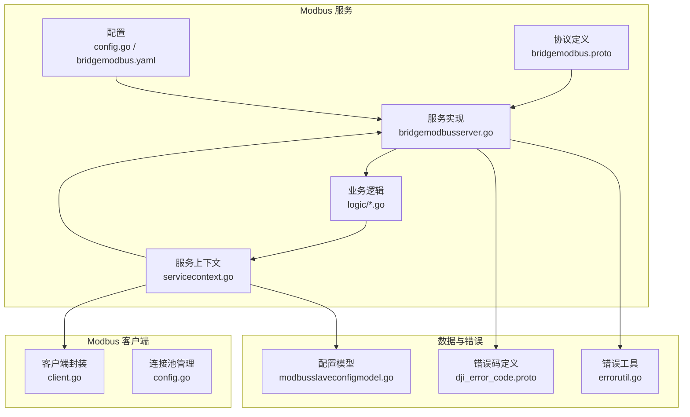
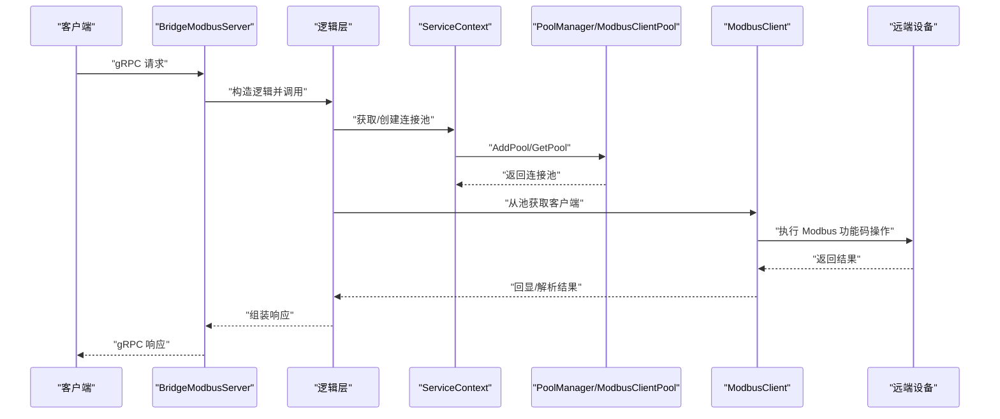
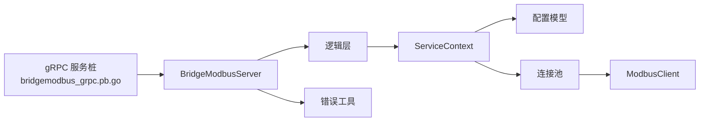
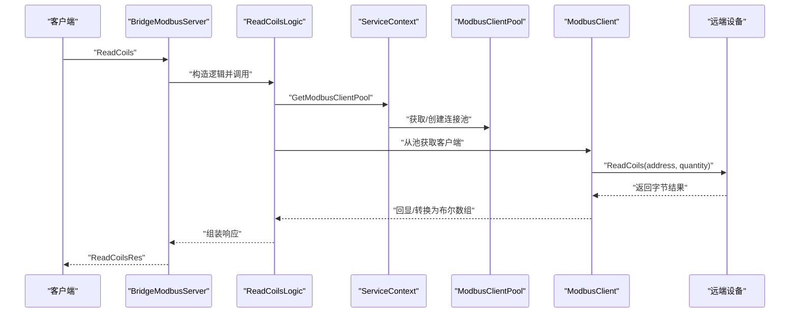

# API 接口参考

<cite>
**本文引用的文件**   
- [bridgemodbus.proto](file://app/bridgemodbus/bridgemodbus.proto)
- [bridgemodbus_grpc.pb.go](file://app/bridgemodbus/bridgemodbus/bridgemodbus_grpc.pb.go)
- [bridgemodbus.yaml](file://app/bridgemodbus/etc/bridgemodbus.yaml)
- [config.go](file://app/bridgemodbus/internal/config/config.go)
- [servicecontext.go](file://app/bridgemodbus/internal/svc/servicecontext.go)
- [bridgemodbusserver.go](file://app/bridgemodbus/internal/server/bridgemodbusserver.go)
- [readcoilslogic.go](file://app/bridgemodbus/internal/logic/readcoilslogic.go)
- [saveconfiglogic.go](file://app/bridgemodbus/internal/logic/saveconfiglogic.go)
- [pagelistconfiglogic.go](file://app/bridgemodbus/internal/logic/pagelistconfiglogic.go)
- [client.go](file://common/modbusx/client.go)
- [config.go](file://common/modbusx/config.go)
- [modbusslaveconfigmodel.go](file://model/modbusslaveconfigmodel.go)
- [errorutil.go](file://common/tool/errorutil.go)
- [dji_error_code.proto](file://third_party/dji_error_code.proto)
</cite>

## 目录
1. [简介](#简介)
2. [项目结构](#项目结构)
3. [核心组件](#核心组件)
4. [架构总览](#架构总览)
5. [详细组件分析](#详细组件分析)
6. [依赖分析](#依赖分析)
7. [性能考虑](#性能考虑)
8. [故障排查指南](#故障排查指南)
9. [结论](#结论)
10. [附录](#附录)

## 简介
本文件为 Modbus 服务的 API 接口参考，覆盖 gRPC 接口、HTTP/SSE/WebSocket 的集成现状与约束、认证与安全策略、版本与兼容性、调用频率与并发控制、以及性能指标与监控告警建议。当前仓库中 Modbus 服务以 gRPC 为核心接口，提供配置管理与多种 Modbus 功能码读写能力；HTTP/SSE/WebSocket 的接入方式在本仓库中未直接暴露 Modbus API，但可通过统一网关或适配层进行扩展。

## 项目结构
Modbus 服务位于 app/bridgemodbus，核心由以下部分组成：
- 协议定义：bridgemodbus.proto
- 服务端实现：internal/server/bridgemodbusserver.go
- 业务逻辑：internal/logic/*.go
- 服务上下文与配置：internal/svc/servicecontext.go、internal/config/config.go、etc/bridgemodbus.yaml
- Modbus 客户端与连接池：common/modbusx/client.go、common/modbusx/config.go
- 数据模型：model/modbusslaveconfigmodel.go
- 错误码与通用工具：third_party/dji_error_code.proto、common/tool/errorutil.go

**图表来源**
- [bridgemodbus.proto:1-83](file://app/bridgemodbus/bridgemodbus.proto#L1-L83)
- [bridgemodbusserver.go:1-151](file://app/bridgemodbus/internal/server/bridgemodbusserver.go#L1-L151)
- [servicecontext.go:1-81](file://app/bridgemodbus/internal/svc/servicecontext.go#L1-L81)
- [client.go:1-218](file://common/modbusx/client.go#L1-L218)
- [config.go:1-125](file://common/modbusx/config.go#L1-L125)
- [modbusslaveconfigmodel.go:1-32](file://model/modbusslaveconfigmodel.go#L1-L32)
- [dji_error_code.proto:1-513](file://third_party/dji_error_code.proto#L1-L513)
- [errorutil.go:1-91](file://common/tool/errorutil.go#L1-L91)

**章节来源**
- [bridgemodbus.proto:1-83](file://app/bridgemodbus/bridgemodbus.proto#L1-L83)
- [bridgemodbusserver.go:1-151](file://app/bridgemodbus/internal/server/bridgemodbusserver.go#L1-L151)
- [servicecontext.go:1-81](file://app/bridgemodbus/internal/svc/servicecontext.go#L1-L81)
- [client.go:1-218](file://common/modbusx/client.go#L1-L218)
- [config.go:1-125](file://common/modbusx/config.go#L1-L125)
- [bridgemodbus.yaml:1-26](file://app/bridgemodbus/etc/bridgemodbus.yaml#L1-L26)

## 核心组件
- gRPC 服务：BridgeModbus，提供配置管理与多种 Modbus 功能码读写接口。
- 服务上下文：负责数据库连接、配置模型、Modbus 客户端池与连接池管理器。
- Modbus 客户端封装：对底层 modbus.Client 进行封装，并提供连接池与 TLS 支持。
- 错误体系：基于扩展错误码与通用错误工具，统一错误映射与 HTTP 状态码。

**章节来源**
- [bridgemodbus.proto:10-83](file://app/bridgemodbus/bridgemodbus.proto#L10-L83)
- [servicecontext.go:14-32](file://app/bridgemodbus/internal/svc/servicecontext.go#L14-L32)
- [client.go:20-98](file://common/modbusx/client.go#L20-L98)
- [errorutil.go:12-59](file://common/tool/errorutil.go#L12-L59)

## 架构总览
Modbus 服务采用 go-zero RPC 架构，gRPC 作为入口，内部通过 ServiceContext 组织业务逻辑与数据访问，Modbus 客户端封装与连接池负责与远端设备通信。

**图表来源**
- [bridgemodbusserver.go:56-150](file://app/bridgemodbus/internal/server/bridgemodbusserver.go#L56-L150)
- [servicecontext.go:34-80](file://app/bridgemodbus/internal/svc/servicecontext.go#L34-L80)
- [client.go:106-143](file://common/modbusx/client.go#L106-L143)

## 详细组件分析

### gRPC 接口总览
- 服务名：BridgeModbus
- 方法分类：
  - 配置管理：SaveConfig、DeleteConfig、PageListConfig、GetConfigByCode、BatchGetConfigByCode
  - Bit Access：ReadCoils、ReadDiscreteInputs、WriteSingleCoil、WriteMultipleCoils
  - 16-bit Register Access：ReadInputRegisters、ReadHoldingRegisters、WriteSingleRegister、WriteSingleRegisterWithDecimal、WriteMultipleRegisters、WriteMultipleRegistersWithDecimal、ReadWriteMultipleRegisters、MaskWriteRegister、ReadFIFOQueue
  - 设备识别：ReadDeviceIdentification、ReadDeviceIdentificationSpecificObject
  - 批量转换：BatchConvertDecimalToRegister

每个方法的请求/响应消息体与字段详见协议文件。

**章节来源**
- [bridgemodbus.proto:10-83](file://app/bridgemodbus/bridgemodbus.proto#L10-L83)

### 配置管理接口
- SaveConfig
  - 请求：modbusCode、slaveAddress、slave
  - 响应：id
  - 业务逻辑：若存在则更新，否则新增
- DeleteConfig
  - 请求：ids[]
  - 响应：空
- PageListConfig
  - 请求：page、pageSize、keyword、status
  - 响应：total、cfg[]
- GetConfigByCode
  - 请求：modbusCode
  - 响应：cfg
- BatchGetConfigByCode
  - 请求：modbusCode[]
  - 响应：cfg[]

实现要点：
- 逻辑层通过 ServiceContext 的 ModbusSlaveConfigModel 进行数据持久化。
- 配置状态与有效性在获取连接池时进行校验。

**章节来源**
- [bridgemodbus.proto:105-148](file://app/bridgemodbus/bridgemodbus.proto#L105-L148)
- [saveconfiglogic.go:27-61](file://app/bridgemodbus/internal/logic/saveconfiglogic.go#L27-L61)
- [pagelistconfiglogic.go:29-52](file://app/bridgemodbus/internal/logic/pagelistconfiglogic.go#L29-L52)
- [servicecontext.go:34-54](file://app/bridgemodbus/internal/svc/servicecontext.go#L34-L54)

### Bit Access 接口
- ReadCoils
  - 请求：modbusCode、address、quantity(1–2000)
  - 响应：results(bytes)、values(bool[])
- ReadDiscreteInputs
  - 请求：modbusCode、address、quantity(1–2000)
  - 响应：results(bytes)、values(bool[])
- WriteSingleCoil
  - 请求：modbusCode、address、value(bool)
  - 响应：results(bytes)
- WriteMultipleCoils
  - 请求：modbusCode、address、quantity、values(bool[])
  - 响应：results(bytes)

实现要点：
- 逻辑层从连接池获取客户端，调用底层 ReadCoils/ReadDiscreteInputs/WriteSingleCoil/WriteMultipleCoils。
- 结果转换：将原始字节转换为布尔数组供业务使用。

**章节来源**
- [bridgemodbus.proto:152-194](file://app/bridgemodbus/bridgemodbus.proto#L152-L194)
- [readcoilslogic.go:26-43](file://app/bridgemodbus/internal/logic/readcoilslogic.go#L26-L43)
- [client.go:29-47](file://common/modbusx/client.go#L29-L47)

### 16-bit Register Access 接口
- ReadInputRegisters
  - 请求：modbusCode、address、quantity(1–125)
  - 响应：results(bytes)、uintValues、intValues、hexValues、binaryValues
- ReadHoldingRegisters
  - 请求：modbusCode、address、quantity(1–125)
  - 响应：results(bytes)、uintValues、intValues、hexValues、binaryValues
- WriteSingleRegister
  - 请求：modbusCode、address、value(uint32)
  - 响应：results(bytes)
- WriteSingleRegisterWithDecimal
  - 请求：modbusCode、address、value(int32)、unsigned(bool)
  - 响应：results(bytes)
- WriteMultipleRegisters
  - 请求：modbusCode、address、quantity、values(uint32[])
  - 响应：results(bytes)
- WriteMultipleRegistersWithDecimal
  - 请求：modbusCode、address、quantity、values(int32[])、unsigned(bool)
  - 响应：results(bytes)
- ReadWriteMultipleRegisters
  - 请求：readAddress、readQuantity、writeAddress、writeQuantity、values(uint32[])
  - 响应：results(bytes)、uintValues、intValues、hexValues、binaryValues
- MaskWriteRegister
  - 请求：modbusCode、address、andMask、orMask
  - 响应：results(bytes)
- ReadFIFOQueue
  - 请求：modbusCode、address
  - 响应：results(bytes)

实现要点：
- 读写寄存器接口返回多格式结果，便于业务侧直接使用。
- Decimal 写入接口支持有符号/无符号两种模式。

**章节来源**
- [bridgemodbus.proto:197-304](file://app/bridgemodbus/bridgemodbus.proto#L197-L304)

### 设备识别接口
- ReadDeviceIdentification
  - 请求：modbusCode、readDeviceIdCode
  - 响应：results(map)、hexResults(map)、semanticResults(map)
- ReadDeviceIdentificationSpecificObject
  - 请求：modbusCode、objectId
  - 响应：同上

实现要点：
- 提供原始对象 ID、十六进制与语义化映射三套结果，便于调试与业务使用。

**章节来源**
- [bridgemodbus.proto:306-342](file://app/bridgemodbus/bridgemodbus.proto#L306-L342)

### 批量转换接口
- BatchConvertDecimalToRegister
  - 请求：values(int32[])、unsigned(bool)
  - 响应：uint16Values、int16Values、hexValues、binaryValues、bytes

实现要点：
- 将整数列表转换为 Modbus 寄存器格式，支持无符号/有符号两种模式。

**章节来源**
- [bridgemodbus.proto:344-355](file://app/bridgemodbus/bridgemodbus.proto#L344-L355)

### gRPC 服务端与路由
- BridgeModbusServer 将每个 RPC 方法映射到对应的逻辑层。
- 服务端通过 ServiceContext 获取连接池与模型实例。

**章节来源**
- [bridgemodbusserver.go:26-150](file://app/bridgemodbus/internal/server/bridgemodbusserver.go#L26-L150)

### Modbus 客户端与连接池
- ModbusClient 封装底层 modbus.Client，提供常用功能码方法。
- ModbusClientPool 使用 syncx.Pool 管理连接复用，默认最大空闲 10 分钟。
- PoolManager 按 modbusCode 维度管理连接池，支持动态创建与查询。

**章节来源**
- [client.go:20-191](file://common/modbusx/client.go#L20-L191)
- [config.go:63-125](file://common/modbusx/config.go#L63-L125)

### 配置与服务上下文
- bridgemodbus.yaml 提供监听地址、日志、Modbus 池大小、数据库连接等配置。
- ServiceContext 负责构建数据库模型、默认连接池与 PoolManager。

**章节来源**
- [bridgemodbus.yaml:1-26](file://app/bridgemodbus/etc/bridgemodbus.yaml#L1-L26)
- [config.go:9-25](file://app/bridgemodbus/internal/config/config.go#L9-L25)
- [servicecontext.go:22-32](file://app/bridgemodbus/internal/svc/servicecontext.go#L22-L32)

### 错误处理与安全
- 错误码：通过扩展错误码与通用工具将业务错误映射为标准 HTTP 状态码。
- 安全：Modbus 客户端支持 TLS 配置，连接池与日志记录器提供会话标识与地址摘要。

**章节来源**
- [errorutil.go:12-59](file://common/tool/errorutil.go#L12-L59)
- [client.go:107-143](file://common/modbusx/client.go#L107-L143)

## 依赖分析
- 服务端依赖：Protocol Buffer 生成的服务桩、逻辑层、ServiceContext。
- 逻辑层依赖：ServiceContext 中的模型与连接池。
- 客户端依赖：modbusx 包中的客户端封装与连接池。
- 错误依赖：扩展错误码与通用错误工具。

**图表来源**
- [bridgemodbus_grpc.pb.go:195-655](file://app/bridgemodbus/bridgemodbus/bridgemodbus_grpc.pb.go#L195-L655)
- [bridgemodbusserver.go:15-24](file://app/bridgemodbus/internal/server/bridgemodbusserver.go#L15-L24)
- [servicecontext.go:14-20](file://app/bridgemodbus/internal/svc/servicecontext.go#L14-L20)
- [client.go:20-25](file://common/modbusx/client.go#L20-L25)

**章节来源**
- [bridgemodbus_grpc.pb.go:195-655](file://app/bridgemodbus/bridgemodbus/bridgemodbus_grpc.pb.go#L195-L655)
- [bridgemodbusserver.go:15-24](file://app/bridgemodbus/internal/server/bridgemodbusserver.go#L15-L24)
- [servicecontext.go:14-20](file://app/bridgemodbus/internal/svc/servicecontext.go#L14-L20)

## 性能考虑
- 连接池：默认池大小由配置项 ModbusPool 控制；连接池空闲 10 分钟自动回收。
- 超时与重连：ModbusClientConf 提供 Timeout、IdleTimeout、LinkRecoveryTimeout、ProtocolRecoveryTimeout、ConnectDelay 等参数，建议结合设备特性与网络环境调优。
- 并发控制：逻辑层通过连接池并发获取客户端，建议在上游增加限流与熔断策略，避免对远端设备造成压力。
- 日志与追踪：ModbusLogger 在日志中携带会话标识与地址摘要，便于定位问题。

**章节来源**
- [bridgemodbus.yaml:11-11](file://app/bridgemodbus/etc/bridgemodbus.yaml#L11-L11)
- [client.go:130-136](file://common/modbusx/client.go#L130-L136)
- [client.go:174-175](file://common/modbusx/client.go#L174-L175)

## 故障排查指南
- 常见错误映射：使用扩展错误码与 errorutil 工具将业务错误映射为 HTTP 状态码，便于统一处理。
- TLS 连接失败：检查证书与 CA 文件路径与权限，确认 TLS.Enable、CertFile、KeyFile、CAFile 配置。
- 连接池创建失败：确认 modbusCode、配置与池大小参数有效，查看日志输出。
- 读写超时：调整 Timeout、IdleTimeout、LinkRecoveryTimeout、ProtocolRecoveryTimeout 参数。
- 设备未启用或配置不存在：获取连接池时会进行状态校验，需先启用配置或创建有效配置。

**章节来源**
- [errorutil.go:12-59](file://common/tool/errorutil.go#L12-L59)
- [client.go:107-143](file://common/modbusx/client.go#L107-L143)
- [servicecontext.go:34-54](file://app/bridgemodbus/internal/svc/servicecontext.go#L34-L54)

## 结论
本仓库提供了完整的 Modbus gRPC 服务接口与底层客户端封装，具备配置管理、Bit/寄存器读写、设备识别与批量转换等能力。HTTP/SSE/WebSocket 的接入方式在当前仓库中未直接暴露 Modbus API，但可通过统一网关或适配层进行扩展。建议在生产环境中结合连接池、超时与 TLS 配置，配合统一错误处理与日志追踪，保障稳定性与安全性。

## 附录

### 接口调用流程（以 ReadCoils 为例）

**图表来源**
- [bridgemodbusserver.go:56-60](file://app/bridgemodbus/internal/server/bridgemodbusserver.go#L56-L60)
- [readcoilslogic.go:26-43](file://app/bridgemodbus/internal/logic/readcoilslogic.go#L26-L43)
- [servicecontext.go:56-80](file://app/bridgemodbus/internal/svc/servicecontext.go#L56-L80)
- [client.go:30-32](file://common/modbusx/client.go#L30-L32)

### 错误码映射（示例）
- 通过扩展错误码与 errorutil 工具，将业务错误映射为 HTTP 状态码，便于统一处理与上报。

**章节来源**
- [dji_error_code.proto:10-513](file://third_party/dji_error_code.proto#L10-L513)
- [errorutil.go:61-81](file://common/tool/errorutil.go#L61-L81)