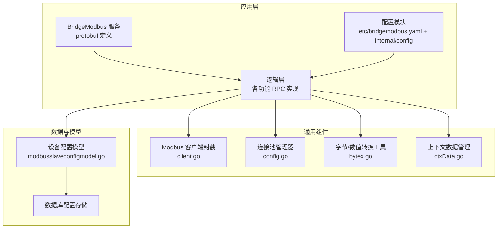
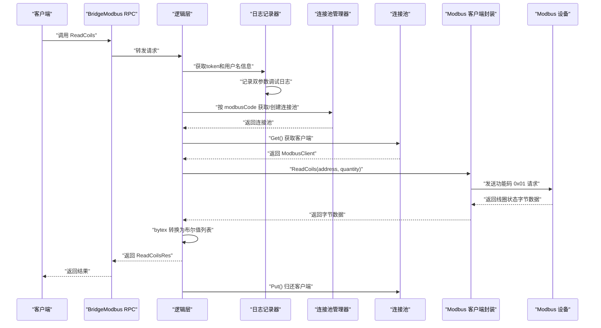
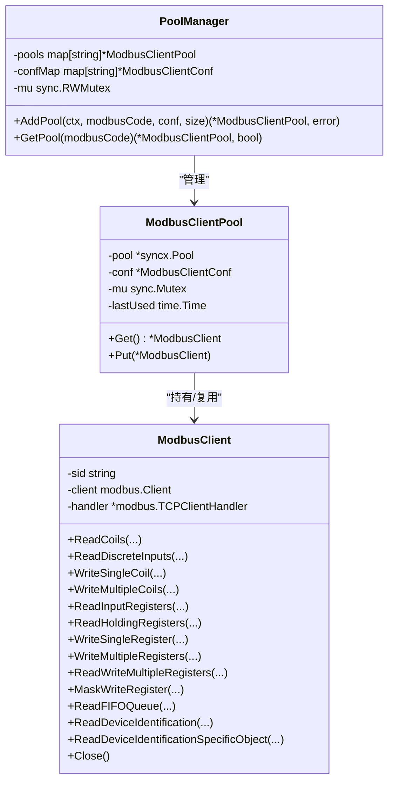
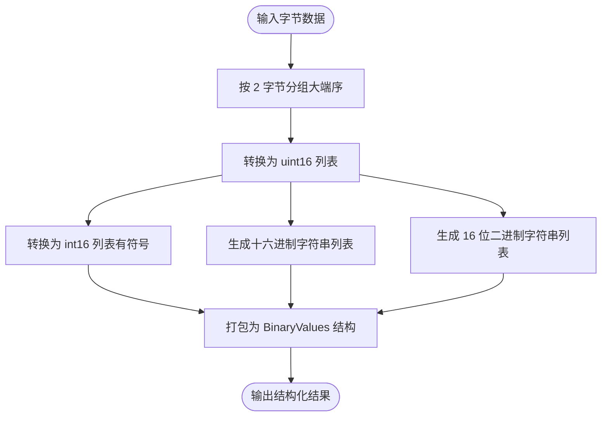
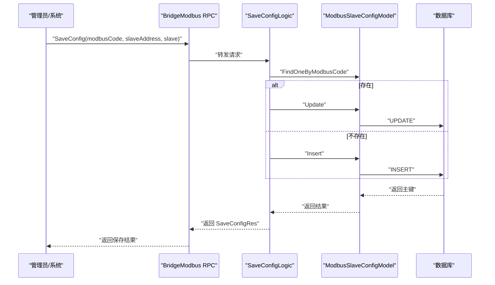
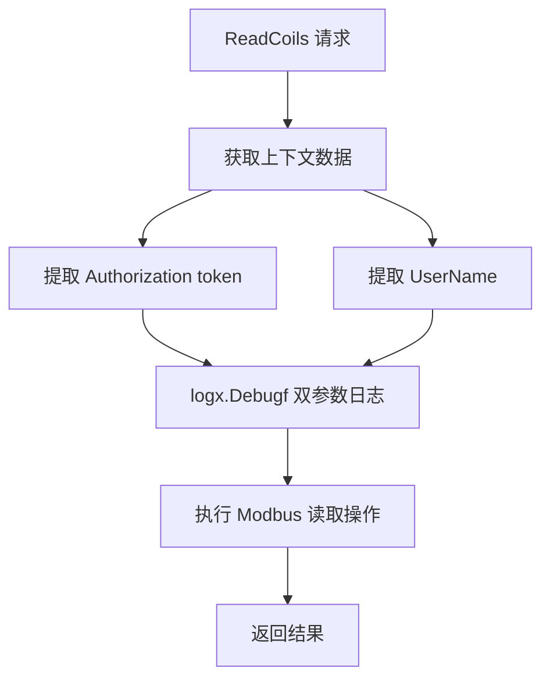
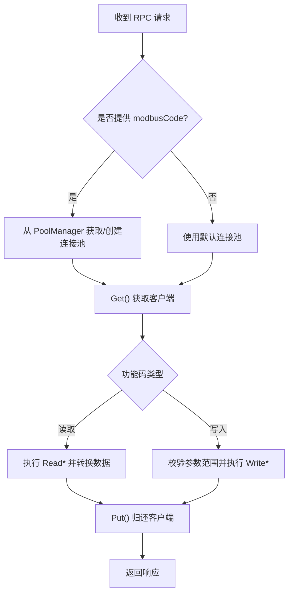
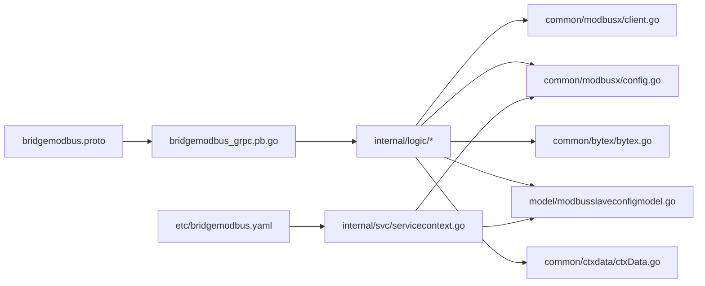

# Modbus 协议桥接服务

<cite>
**本文引用的文件**
- [bridgemodbus.proto](file://app/bridgemodbus/bridgemodbus/bridgemodbus.proto)
- [bridgemodbus_grpc.pb.go](file://app/bridgemodbus/bridgemodbus/bridgemodbus_grpc.pb.go)
- [client.go](file://common/modbusx/client.go)
- [config.go](file://common/modbusx/config.go)
- [bridgemodbus.yaml](file://app/bridgemodbus/etc/bridgemodbus.yaml)
- [config.go](file://app/bridgemodbus/internal/config/config.go)
- [servicecontext.go](file://app/bridgemodbus/internal/svc/servicecontext.go)
- [readcoilslogic.go](file://app/bridgemodbus/internal/logic/readcoilslogic.go)
- [readholdingregisterslogic.go](file://app/bridgemodbus/internal/logic/readholdingregisterslogic.go)
- [writesingleregisterlogic.go](file://app/bridgemodbus/internal/logic/writesingleregisterlogic.go)
- [saveconfiglogic.go](file://app/bridgemodbus/internal/logic/saveconfiglogic.go)
- [pagelistconfiglogic.go](file://app/bridgemodbus/internal/logic/pagelistconfiglogic.go)
- [modbusslaveconfigmodel.go](file://model/modbusslaveconfigmodel.go)
- [bytex.go](file://common/bytex/bytex.go)
- [ctxData.go](file://common/ctxdata/ctxData.go)
</cite>

## 更新摘要
**所做更改**
- 更新了coil读取功能的日志记录部分，增加了双参数调试日志格式
- 新增了上下文数据获取和日志记录的详细说明
- 补充了token和用户名信息捕获的实现细节

## 目录
1. [简介](#简介)
2. [项目结构](#项目结构)
3. [核心组件](#核心组件)
4. [架构总览](#架构总览)
5. [详细组件分析](#详细组件分析)
6. [依赖分析](#依赖分析)
7. [性能考虑](#性能考虑)
8. [故障排查指南](#故障排查指南)
9. [结论](#结论)
10. [附录](#附录)

## 简介
本技术文档面向"Modbus 协议桥接服务"，系统性阐述其在工业控制领域的应用原理与实现细节，覆盖 Modbus TCP/RTU 协议转换机制、设备连接管理、数据读写操作、配置管理、设备点位映射与批量数据处理能力。文档同时介绍 Modbus 客户端封装的设计模式、连接池管理与错误重试策略，并给出完整的 API 接口清单、参数说明与使用示例，提供设备配置模板、常见问题解决方案与性能优化建议。

**更新** 服务现已增强了日志记录功能，特别是coil读取操作中增加了双参数调试日志，用于捕获和记录token及用户名信息，提升服务的可观测性和安全性审计能力。

## 项目结构
该服务采用 Go-Zero RPC 架构，基于 protobuf 定义服务契约，内部通过逻辑层调用通用 Modbus 客户端与连接池，结合数据库模型完成配置持久化与查询。

**图表来源**
- [bridgemodbus.proto:1-83](file://app/bridgemodbus/bridgemodbus/bridgemodbus.proto#L1-L83)
- [client.go:106-143](file://common/modbusx/client.go#L106-L143)
- [config.go:63-124](file://common/modbusx/config.go#L63-L124)
- [bytex.go:1-239](file://common/bytex/bytex.go#L1-L239)
- [modbusslaveconfigmodel.go:1-32](file://model/modbusslaveconfigmodel.go#L1-L32)
- [ctxData.go:1-73](file://common/ctxdata/ctxData.go#L1-L73)

**章节来源**
- [bridgemodbus.proto:1-83](file://app/bridgemodbus/bridgemodbus/bridgemodbus.proto#L1-L83)
- [bridgemodbus.yaml:1-26](file://app/bridgemodbus/etc/bridgemodbus.yaml#L1-L26)
- [config.go:1-26](file://app/bridgemodbus/internal/config/config.go#L1-L26)

## 核心组件
- 服务契约与 API：通过 protobuf 定义 BridgeModbus 服务，涵盖配置管理、位访问、16 位寄存器访问、读写多寄存器、屏蔽写寄存器、FIFO 队列读取、设备标识读取以及十进制到寄存器格式的批量转换。
- Modbus 客户端封装：对底层 modbus.Client 进行薄封装，统一暴露功能码对应的读写方法，并支持 TLS、超时、空闲超时、链路恢复与协议恢复等参数。
- 连接池与管理器：按 modbusCode 维度管理连接池，支持并发安全地获取/归还客户端实例，具备资源自动销毁与最大存活时间控制。
- 数据转换工具：提供字节到 16 位无符号/有符号整数、十六进制、二进制字符串的双向转换，便于上层业务计算与展示。
- 配置模型与持久化：提供设备配置的增删改查、分页查询与按编码批量查询，配合服务上下文动态创建连接池。
- 上下文数据管理：提供token、用户名、用户ID等上下文信息的获取与传递机制，支持安全审计和用户追踪。

**更新** 日志增强功能：新增了双参数调试日志记录，专门用于coil读取操作中捕获token和用户名信息，提升服务的安全审计能力和问题定位效率。

**章节来源**
- [bridgemodbus.proto:10-83](file://app/bridgemodbus/bridgemodbus/bridgemodbus.proto#L10-L83)
- [client.go:20-97](file://common/modbusx/client.go#L20-L97)
- [config.go:63-124](file://common/modbusx/config.go#L63-L124)
- [bytex.go:7-239](file://common/bytex/bytex.go#L7-L239)
- [modbusslaveconfigmodel.go:7-32](file://model/modbusslaveconfigmodel.go#L7-L32)
- [ctxData.go:1-73](file://common/ctxdata/ctxData.go#L1-L73)

## 架构总览
服务采用"RPC 服务 + 逻辑层 + 客户端封装 + 连接池 + 数据模型 + 上下文数据管理"的分层架构。RPC 请求进入后，逻辑层根据 modbusCode 获取或创建连接池，调用封装的 Modbus 客户端执行具体功能码操作，随后通过 bytex 工具进行数据格式转换并返回结果。新增的日志记录功能在关键操作点捕获上下文信息，用于安全审计和问题追踪。

**图表来源**
- [bridgemodbus_grpc.pb.go:639-655](file://app/bridgemodbus/bridgemodbus/bridgemodbus_grpc.pb.go#L639-L655)
- [readcoilslogic.go:27-43](file://app/bridgemodbus/internal/logic/readcoilslogic.go#L27-L43)
- [client.go:54-57](file://common/modbusx/client.go#L54-L57)
- [bytex.go:136-161](file://common/bytex/bytex.go#L136-L161)

## 详细组件分析

### Modbus 客户端封装与连接池
- 设计模式：对第三方 modbus.Client 进行轻量封装，保留原生功能码方法签名，便于替换与测试；同时注入 TLS、超时、空闲超时、链路恢复、协议恢复与连接延迟等参数。
- 连接池管理：PoolManager 按 modbusCode 维度管理连接池，支持并发安全的 AddPool 与 GetPool；ModbusClientPool 使用通用池库进行对象复用与自动销毁。
- 错误重试与健壮性：通过超时与恢复参数降低瞬时网络波动影响；日志器输出带会话标识，便于定位问题。

**图表来源**
- [client.go:20-97](file://common/modbusx/client.go#L20-L97)
- [client.go:145-191](file://common/modbusx/client.go#L145-L191)
- [config.go:63-124](file://common/modbusx/config.go#L63-L124)

**章节来源**
- [client.go:106-143](file://common/modbusx/client.go#L106-L143)
- [client.go:145-191](file://common/modbusx/client.go#L145-L191)
- [config.go:63-124](file://common/modbusx/config.go#L63-L124)

### 数据转换工具（bytex）
- 提供字节到 16 位无符号/有符号整数、十六进制与二进制字符串的互转，支持批量转换与结构化输出，满足上层业务对不同数值视图的需求。
- 在读取寄存器类 RPC 中被广泛使用，确保返回值既可用于业务计算，又便于前端展示。

**图表来源**
- [bytex.go:25-161](file://common/bytex/bytex.go#L25-L161)

**章节来源**
- [bytex.go:7-239](file://common/bytex/bytex.go#L7-L239)

### 配置管理与设备点位映射
- 配置模型：提供设备配置的增删改查、分页查询与按编码批量查询能力，支持状态过滤与关键字模糊匹配。
- 服务上下文：根据 modbusCode 动态加载配置并创建连接池；若 modbusCode 为空则使用默认配置。
- 业务流程：保存配置时优先更新已有记录，不存在则新建；分页查询支持条件筛选。

**图表来源**
- [saveconfiglogic.go:27-61](file://app/bridgemodbus/internal/logic/saveconfiglogic.go#L27-L61)
- [modbusslaveconfigmodel.go:20-32](file://model/modbusslaveconfigmodel.go#L20-L32)

**章节来源**
- [saveconfiglogic.go:27-61](file://app/bridgemodbus/internal/logic/saveconfiglogic.go#L27-L61)
- [pagelistconfiglogic.go:29-52](file://app/bridgemodbus/internal/logic/pagelistconfiglogic.go#L29-L52)
- [modbusslaveconfigmodel.go:7-32](file://model/modbusslaveconfigmodel.go#L7-L32)

### 日志记录与安全审计
**更新** 服务现已增强日志记录功能，特别是在coil读取操作中实现了双参数调试日志记录，用于捕获和记录token及用户名信息。

- **双参数调试日志**：在ReadCoils操作中，逻辑层会从上下文获取Authorization和UserName信息，使用logx.Debugf进行双参数调试日志记录，格式为"token: %s,username: %s"。
- **上下文数据获取**：通过ctxdata.GetAuthorization()和ctxdata.GetUserName()从请求上下文中提取认证信息和用户名。
- **安全审计**：记录的token和用户名信息可用于安全审计、用户行为追踪和问题定位。
- **日志格式**：采用Go-Zero框架的标准调试日志格式，支持结构化日志输出和级别控制。

**图表来源**
- [readcoilslogic.go:29-31](file://app/bridgemodbus/internal/logic/readcoilslogic.go#L29-L31)
- [ctxData.go:47-59](file://common/ctxdata/ctxData.go#L47-L59)

**章节来源**
- [readcoilslogic.go:27-43](file://app/bridgemodbus/internal/logic/readcoilslogic.go#L27-L43)
- [ctxData.go:1-73](file://common/ctxdata/ctxData.go#L1-L73)

### API 接口与使用示例
以下为服务提供的完整 API 清单与关键参数说明（以功能分类），并给出典型使用场景与注意事项。

- 配置管理
  - SaveConfig：保存或更新设备配置（modbusCode、slaveAddress、slave）。返回保存的主键。
  - DeleteConfig：删除配置（支持批量，传入 ids）。
  - PageListConfig：分页查询配置（page、pageSize、keyword、status）。
  - GetConfigByCode：按编码查询单条配置。
  - BatchGetConfigByCode：按编码数组批量查询配置。
- 位访问（Bit Access）
  - ReadCoils：读取线圈状态（address、quantity，1–2000）。**更新**：新增双参数调试日志记录token和用户名信息。
  - ReadDiscreteInputs：读取离散输入状态（address、quantity，1–2000）。
  - WriteSingleCoil：写单个线圈（address、value）。
  - WriteMultipleCoils：写多个线圈（address、quantity、values）。
- 16 位寄存器访问（16-bit Register Access）
  - ReadInputRegisters：读取输入寄存器（address、quantity，1–125）。
  - ReadHoldingRegisters：读取保持寄存器（address、quantity，1–125）。
  - WriteSingleRegister：写单个保持寄存器（address、value，0–65535）。
  - WriteSingleRegisterWithDecimal：写单个寄存器（十进制值，支持有符号/无符号）。
  - WriteMultipleRegisters：写多个保持寄存器（values 为 uint32 列表，每个值对应一个寄存器）。
  - WriteMultipleRegistersWithDecimal：写多个寄存器（十进制值列表，支持有符号/无符号）。
  - ReadWriteMultipleRegisters：读写多个寄存器（read/write 地址与数量、写入数据）。
  - MaskWriteRegister：屏蔽写寄存器（andMask、orMask）。
  - ReadFIFOQueue：读取 FIFO 队列（address）。
- 设备识别（Device Identification）
  - ReadDeviceIdentification：读取设备标识（readDeviceIdCode，0x01/0x02/0x03）。
  - ReadDeviceIdentificationSpecificObject：读取特定 Object ID 的设备标识（objectId）。
- 批量十进制到寄存器格式转换
  - BatchConvertDecimalToRegister：将十进制整数列表转换为寄存器格式（无符号/有符号），输出 uint16、int16、十六进制、二进制与字节数组。

使用示例（步骤说明）
- 读取线圈状态
  - 步骤：构造 ReadCoilsReq（modbusCode、address、quantity），调用 ReadCoils；服务侧获取上下文中的token和用户名信息，记录双参数调试日志，然后获取连接池、执行读取、通过 bytex 转换后返回。
  - 关键点：quantity 不得超过 2000；返回值包含原始字节与布尔值列表，便于业务与前端使用；日志中会记录token和用户名信息用于审计。
- 读取保持寄存器
  - 步骤：构造 ReadHoldingRegistersReq（modbusCode、address、quantity），调用 ReadHoldingRegisters；服务侧获取连接池、执行读取、通过 bytex 转换后返回。
  - 关键点：quantity 不得超过 125；返回值包含原始字节与多视图数值，便于业务与前端使用。
- 写单个保持寄存器
  - 步骤：构造 WriteSingleRegisterReq（address、value），调用 WriteSingleRegister；服务侧校验 value 范围并在必要时进行数值视图打印。
  - 关键点：value 必须在 0–65535 范围内；若需写入十进制有符号值，使用 WriteSingleRegisterWithDecimal。
- 批量十进制转换
  - 步骤：构造 BatchConvertDecimalToRegisterReq（values、unsigned），调用接口；服务侧返回 uint16/int16、十六进制、二进制与字节数组，便于后续写入寄存器。

**章节来源**
- [bridgemodbus.proto:10-83](file://app/bridgemodbus/bridgemodbus/bridgemodbus.proto#L10-L83)
- [bridgemodbus_grpc.pb.go:195-313](file://app/bridgemodbus/bridgemodbus/bridgemodbus_grpc.pb.go#L195-L313)
- [readcoilslogic.go:27-43](file://app/bridgemodbus/internal/logic/readcoilslogic.go#L27-L43)
- [readholdingregisterslogic.go:27-57](file://app/bridgemodbus/internal/logic/readholdingregisterslogic.go#L27-L57)
- [writesingleregisterlogic.go:29-54](file://app/bridgemodbus/internal/logic/writesingleregisterlogic.go#L29-L54)

### 读写流程与错误处理
- 读取流程：逻辑层获取连接池 -> 从池中取出客户端 -> 调用封装客户端执行功能码 -> 转换数据 -> 归还客户端。
- 写入流程：逻辑层获取连接池 -> 校验参数范围 -> 执行写入 -> 归还客户端。
- 错误处理：当 modbusCode 不存在或未启用时，服务上下文会返回业务错误；写入前对数值范围进行校验；日志器输出带会话标识，便于追踪。

**图表来源**
- [servicecontext.go:56-80](file://app/bridgemodbus/internal/svc/servicecontext.go#L56-L80)
- [readcoilslogic.go:27-43](file://app/bridgemodbus/internal/logic/readcoilslogic.go#L27-L43)
- [writesingleregisterlogic.go:29-54](file://app/bridgemodbus/internal/logic/writesingleregisterlogic.go#L29-L54)

## 依赖分析
- 服务契约依赖 protobuf 定义的服务方法与消息体，逻辑层通过生成的客户端/服务端桩进行调用与实现。
- 逻辑层依赖通用 Modbus 客户端封装与连接池管理器，实现按 modbusCode 的连接池隔离与复用。
- 数据层依赖设备配置模型与数据库，提供配置的持久化与查询能力。
- 工具层提供字节与数值之间的转换，保证返回值的多视图一致性。
- 上下文数据层提供token、用户名等认证信息的获取与传递机制，支持安全审计和用户追踪。

**图表来源**
- [bridgemodbus.proto:1-83](file://app/bridgemodbus/bridgemodbus/bridgemodbus.proto#L1-L83)
- [bridgemodbus_grpc.pb.go:837-885](file://app/bridgemodbus/bridgemodbus/bridgemodbus_grpc.pb.go#L837-L885)
- [servicecontext.go:14-32](file://app/bridgemodbus/internal/svc/servicecontext.go#L14-L32)

**章节来源**
- [bridgemodbus.proto:1-83](file://app/bridgemodbus/bridgemodbus/bridgemodbus.proto#L1-L83)
- [bridgemodbus_grpc.pb.go:837-885](file://app/bridgemodbus/bridgemodbus/bridgemodbus_grpc.pb.go#L837-L885)
- [servicecontext.go:14-32](file://app/bridgemodbus/internal/svc/servicecontext.go#L14-L32)

## 性能考虑
- 连接池复用：按 modbusCode 维度隔离连接池，避免跨设备竞争；池大小与最大存活时间可根据设备并发与资源占用调整。
- 超时与恢复：合理设置超时、空闲超时、链路恢复与协议恢复时间，减少网络抖动对吞吐的影响。
- 数据转换成本：批量读取时尽量一次性转换，避免多次重复转换；在高频场景下可缓存常用映射。
- 写入批量化：对于写多个寄存器的场景，尽量合并请求，减少往返次数。
- 日志与监控：开启必要的日志字段（地址、会话标识）以便快速定位性能瓶颈。
- **更新** 日志记录优化：双参数调试日志采用高效的格式化方式，避免不必要的字符串拼接开销；日志级别可根据环境配置进行调整。

## 故障排查指南
- 连接失败
  - 检查 modbusCode 对应的配置是否存在且启用；确认 Address、Slave、TLS 参数正确。
  - 查看日志中的会话标识与地址字段，定位具体设备。
- 超时或读写异常
  - 调整 Timeout、IdleTimeout、LinkRecoveryTimeout、ProtocolRecoveryTimeout 参数。
  - 确认设备侧功能码支持情况与地址范围（如 quantity 超限）。
- 写入失败
  - 校验写入值范围（如 0–65535），必要时使用十进制写入接口。
  - 检查写入掩码与读写多寄存器的地址与数量配置。
- 数据视图不一致
  - 确认使用 bytex 的转换函数，确保大端序与有符号/无符号转换正确。
- **更新** 日志审计问题
  - 检查日志级别配置，确保调试日志能够正常输出。
  - 验证上下文数据传递，确认token和用户名信息能够正确提取。
  - 查看双参数日志格式，确保token和username字段都正确记录。

**章节来源**
- [servicecontext.go:34-54](file://app/bridgemodbus/internal/svc/servicecontext.go#L34-L54)
- [writesingleregisterlogic.go:38-40](file://app/bridgemodbus/internal/logic/writesingleregisterlogic.go#L38-L40)
- [readcoilslogic.go:29-31](file://app/bridgemodbus/internal/logic/readcoilslogic.go#L29-L31)

## 结论
本服务通过清晰的分层设计与通用组件封装，实现了 Modbus TCP/RTU 的协议桥接与设备连接管理，提供了完善的配置管理、批量数据处理与错误重试机制。依托连接池与数据转换工具，服务在工业场景中具备良好的可扩展性与稳定性。

**更新** 新增的日志增强功能显著提升了服务的可观测性和安全性，特别是coil读取操作中的双参数调试日志记录，能够有效捕获token和用户名信息，为安全审计、用户行为追踪和问题定位提供了强有力的支持。建议在生产环境中结合监控与日志策略，持续优化连接池大小与超时参数，以获得更佳的性能表现。

## 附录

### 设备配置模板（YAML）
- 服务监听与日志
  - Name、ListenOn、Timeout、Mode、Log（Encoding、Path、Level、KeepDays）
- 连接池与注册中心
  - ModbusPool（连接池大小）
  - NacosConfig（IsRegister、Host、Port、Username、PassWord、NamespaceId、ServiceName）
- 数据库配置
  - DB.DataSource（数据源）
- 默认 Modbus 客户端配置
  - Address、Slave

**章节来源**
- [bridgemodbus.yaml:1-26](file://app/bridgemodbus/etc/bridgemodbus.yaml#L1-L26)
- [config.go:9-25](file://app/bridgemodbus/internal/config/config.go#L9-L25)

### 常见问题与解答
- 如何选择合适的连接池大小？
  - 根据设备并发请求数与资源占用评估，逐步调优；过大导致资源浪费，过小导致频繁创建销毁。
- 为什么某些功能码调用报错？
  - 检查设备是否支持该功能码，以及地址与 quantity 是否在允许范围内。
- 如何处理有符号与无符号寄存器值？
  - 使用十进制写入接口时明确 unsigned 标志；读取时通过 bytex 的 int16 视图进行解释。
- **更新** 如何配置日志记录？
  - 确保日志级别设置为Debug以启用双参数调试日志。
  - 验证上下文数据传递，确保Authorization和UserName能够正确提取。
  - 检查日志输出配置，确保token和username字段能够正常显示。

### 实际工业场景应用案例
- 电表/水表数据采集：使用 ReadHoldingRegisters 批量读取寄存器，结合 bytex 的多视图输出，实现能耗统计与告警。
- 控制阀门/开关：使用 WriteSingleCoil 或 WriteMultipleCoils 控制设备启停，结合日志与会话标识进行审计。
- 参数下发：使用 WriteMultipleRegisters 或 ReadWriteMultipleRegisters 下发参数并回读确认，确保参数生效。
- **更新** 用户权限控制：通过coil读取操作的日志记录，可以追踪不同用户的操作行为，实现细粒度的权限审计和合规要求。