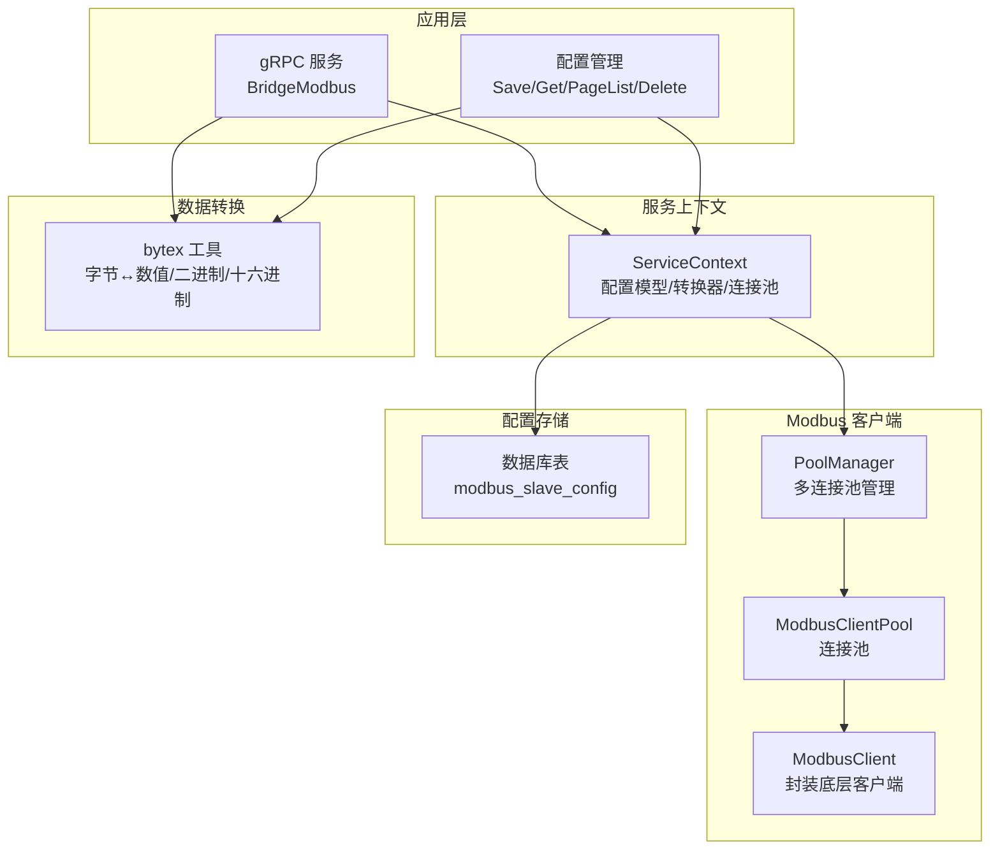
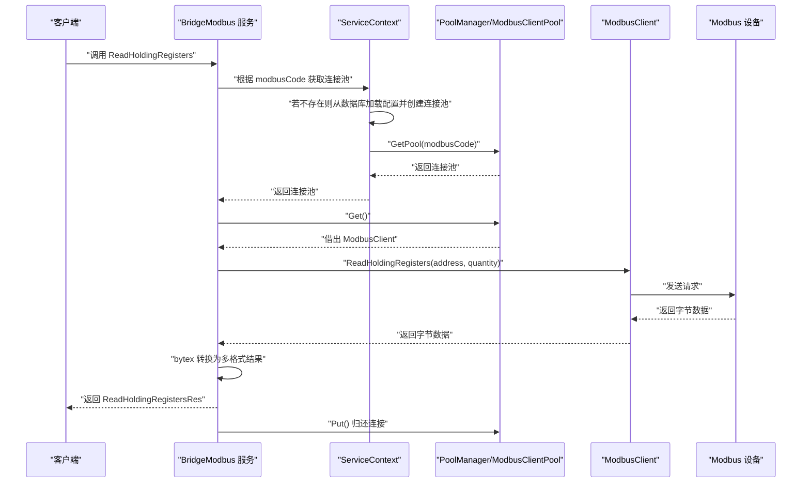
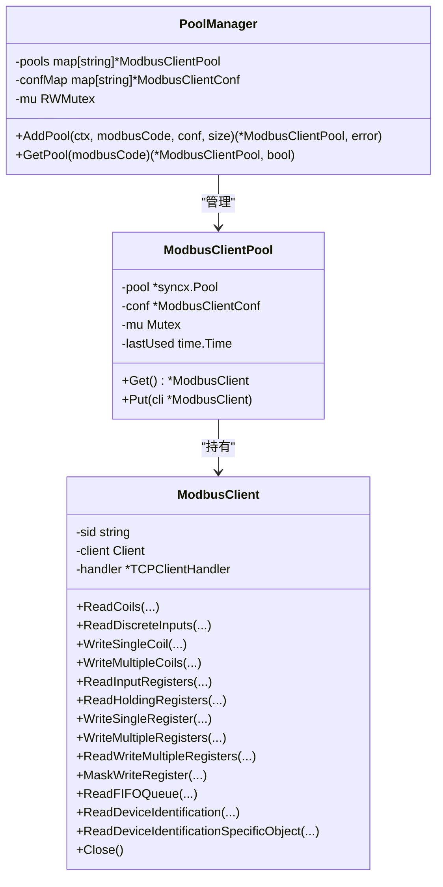
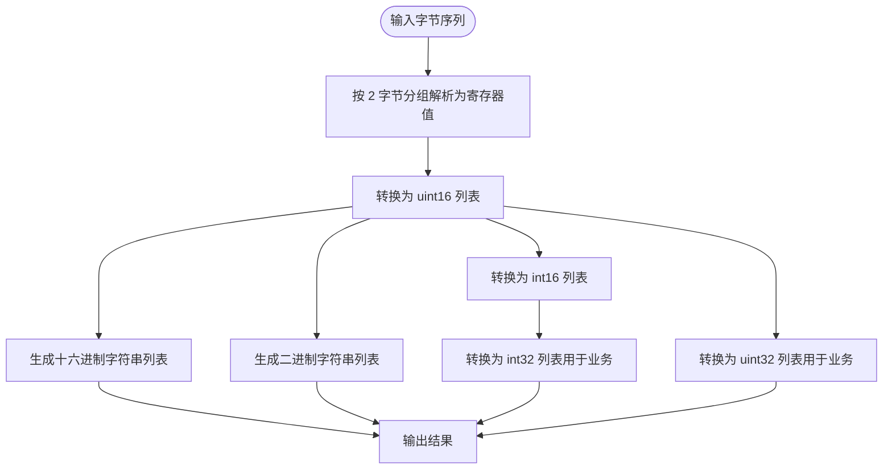
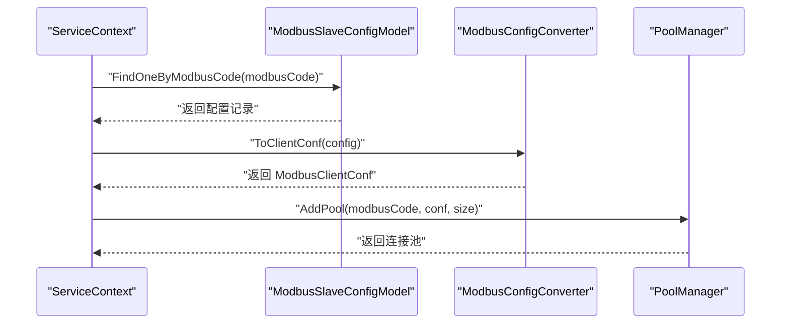
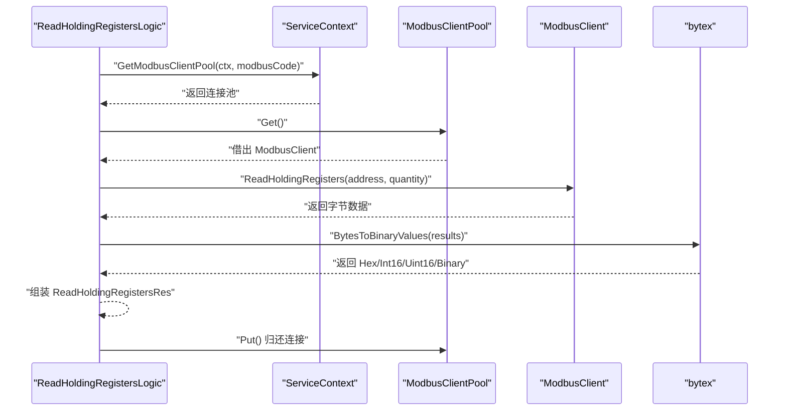
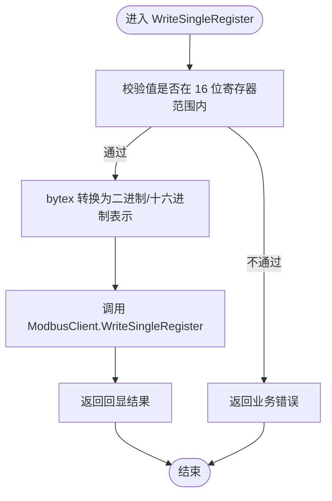
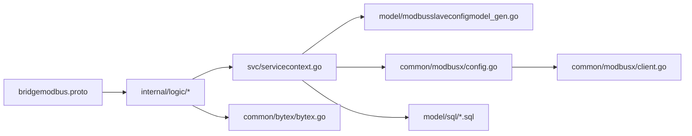

# Modbus 协议概述

<cite>
**本文引用的文件**
- [bridgemodbus.proto](file://app/bridgemodbus/bridgemodbus.proto)
- [client.go](file://common/modbusx/client.go)
- [config.go](file://common/modbusx/config.go)
- [bytex.go](file://common/bytex/bytex.go)
- [bridgemodbus.go](file://app/bridgemodbus/bridgemodbus.go)
- [servicecontext.go](file://app/bridgemodbus/internal/svc/servicecontext.go)
- [readcoilslogic.go](file://app/bridgemodbus/internal/logic/readcoilslogic.go)
- [readholdingregisterslogic.go](file://app/bridgemodbus/internal/logic/readholdingregisterslogic.go)
- [writesingleregisterlogic.go](file://app/bridgemodbus/internal/logic/writesingleregisterlogic.go)
- [bridgemodbus.yaml](file://app/bridgemodbus/etc/bridgemodbus.yaml)
- [modbusslaveconfigmodel_gen.go](file://model/modbusslaveconfigmodel_gen.go)
- [modbus.sql](file://model/sql/modbus.sql)
- [postgres.sql](file://model/sql/postgres.sql)
</cite>

## 目录
1. [简介](#简介)
2. [项目结构](#项目结构)
3. [核心组件](#核心组件)
4. [架构总览](#架构总览)
5. [详细组件分析](#详细组件分析)
6. [依赖关系分析](#依赖关系分析)
7. [性能考量](#性能考量)
8. [故障排查指南](#故障排查指南)
9. [结论](#结论)
10. [附录](#附录)

## 简介
本技术文档围绕 Modbus 协议在本仓库中的实现与应用进行系统化梳理，重点覆盖以下方面：
- Modbus 协议在工业自动化中的地位与典型应用场景
- Modbus RTU 与 Modbus TCP 的区别、帧格式与通信机制
- 功能码定义、数据类型转换与地址映射规则
- 在本项目中的具体实现：gRPC 接口、Modbus 客户端封装、连接池、数据转换工具与配置持久化
- 协议规范参考、常见设备兼容性与通信参数配置指南
- 实际工业场景中的应用案例与最佳实践建议

## 项目结构
本仓库中与 Modbus 相关的核心模块包括：
- gRPC 接口层：定义完整的 Modbus 功能码调用接口与消息结构
- Modbus 客户端封装与连接池：对底层 Modbus 库进行封装，并提供连接池与 TLS 支持
- 数据转换工具：提供字节与数值之间的多格式转换（十六进制、二进制、有符号/无符号）
- 服务上下文与配置管理：从数据库加载配置，动态创建连接池
- 配置持久化：Modbus 从站配置的数据库表结构与字段说明

图表来源
- [bridgemodbus.proto:10-83](file://app/bridgemodbus/bridgemodbus.proto#L10-L83)
- [servicecontext.go:14-32](file://app/bridgemodbus/internal/svc/servicecontext.go#L14-L32)
- [client.go:20-143](file://common/modbusx/client.go#L20-L143)
- [config.go:32-125](file://common/modbusx/config.go#L32-L125)
- [bytex.go:7-239](file://common/bytex/bytex.go#L7-L239)
- [modbusslaveconfigmodel_gen.go:59-80](file://model/modbusslaveconfigmodel_gen.go#L59-L80)

章节来源
- [bridgemodbus.proto:10-83](file://app/bridgemodbus/bridgemodbus.proto#L10-L83)
- [servicecontext.go:14-32](file://app/bridgemodbus/internal/svc/servicecontext.go#L14-L32)
- [client.go:20-143](file://common/modbusx/client.go#L20-L143)
- [config.go:32-125](file://common/modbusx/config.go#L32-L125)
- [bytex.go:7-239](file://common/bytex/bytex.go#L7-L239)
- [modbusslaveconfigmodel_gen.go:59-80](file://model/modbusslaveconfigmodel_gen.go#L59-L80)

## 核心组件
- gRPC 服务与消息定义：涵盖配置管理、位访问（线圈/离散输入）、16 位寄存器访问（输入/保持寄存器）、写单个/多个寄存器、读写多个寄存器、屏蔽写寄存器、FIFO 队列读取、设备标识读取、十进制数值批量转换等
- Modbus 客户端封装：对底层 Modbus TCP 客户端进行封装，暴露统一的读写方法；支持 TLS 加密、超时与空闲超时、链路恢复与协议恢复重试、连接延迟
- 连接池与管理器：按 modbusCode 维度管理多个连接池，支持并发安全与资源回收
- 数据转换工具：提供字节序列与十六进制/二进制/有符号/无符号整数之间的双向转换
- 配置模型与持久化：Modbus 从站配置的数据库表结构、字段含义与查询接口

章节来源
- [bridgemodbus.proto:10-83](file://app/bridgemodbus/bridgemodbus.proto#L10-L83)
- [client.go:20-143](file://common/modbusx/client.go#L20-L143)
- [config.go:32-125](file://common/modbusx/config.go#L32-L125)
- [bytex.go:7-239](file://common/bytex/bytex.go#L7-L239)
- [modbusslaveconfigmodel_gen.go:59-80](file://model/modbusslaveconfigmodel_gen.go#L59-L80)

## 架构总览
下图展示了从 gRPC 请求到 Modbus 设备的完整调用链路，以及配置加载与连接池管理的关键节点。

图表来源
- [bridgemodbus.proto:197-223](file://app/bridgemodbus/bridgemodbus.proto#L197-L223)
- [servicecontext.go:56-80](file://app/bridgemodbus/internal/svc/servicecontext.go#L56-L80)
- [client.go:20-92](file://common/modbusx/client.go#L20-L92)
- [readholdingregisterslogic.go:27-57](file://app/bridgemodbus/internal/logic/readholdingregisterslogic.go#L27-L57)
- [bytex.go:136-161](file://common/bytex/bytex.go#L136-L161)

## 详细组件分析

### gRPC 接口与功能码定义
- 配置管理：保存、删除、分页查询、按编码查询、批量查询
- 位访问：读取线圈、读取离散输入、写单个线圈、写多个线圈
- 寄存器访问：读取输入寄存器、读取保持寄存器、写单个寄存器、写多个寄存器、读写多个寄存器、屏蔽写寄存器
- 设备识别：读取设备标识（含通用对象 ID 与特定对象 ID）
- 数据转换：批量将十进制数值转换为寄存器格式（无符号/有符号、十六进制、二进制、字节数组）

章节来源
- [bridgemodbus.proto:10-83](file://app/bridgemodbus/bridgemodbus.proto#L10-L83)

### Modbus 客户端封装与连接池
- ModbusClient：对底层客户端进行薄封装，暴露统一的读写方法，便于上层调用
- ModbusClientPool：基于连接池实现连接复用，支持最大存活时间与归还回收
- PoolManager：按 modbusCode 维度管理多个连接池，支持并发安全与重复创建保护
- TLS 支持：可选启用，支持客户端证书与 CA 校验
- 超时与恢复：支持发送/接收超时、空闲超时、链路恢复与协议恢复重试、连接建立延迟

图表来源
- [client.go:20-143](file://common/modbusx/client.go#L20-L143)
- [config.go:32-125](file://common/modbusx/config.go#L32-L125)

章节来源
- [client.go:20-143](file://common/modbusx/client.go#L20-L143)
- [config.go:32-125](file://common/modbusx/config.go#L32-L125)

### 数据转换工具（bytex）
- 字节序列与十六进制/二进制字符串互转
- 无符号/有符号 16 位整数之间的转换
- 从字节序列到寄存器值集合的解析与格式化输出
- 布尔位与字节序列的互转（线圈/离散输入）

图表来源
- [bytex.go:25-161](file://common/bytex/bytex.go#L25-L161)

章节来源
- [bytex.go:7-239](file://common/bytex/bytex.go#L7-L239)

### 服务上下文与配置管理
- ServiceContext：负责初始化配置模型、配置转换器、默认连接池与连接池管理器
- AddPool：根据 modbusCode 从数据库加载配置，转换为客户端配置并创建连接池
- GetModbusClientPool：优先使用自定义连接池（按 modbusCode），否则使用默认连接池

图表来源
- [servicecontext.go:34-54](file://app/bridgemodbus/internal/svc/servicecontext.go#L34-L54)
- [modbusslaveconfigmodel_gen.go:131-150](file://model/modbusslaveconfigmodel_gen.go#L131-L150)

章节来源
- [servicecontext.go:14-81](file://app/bridgemodbus/internal/svc/servicecontext.go#L14-L81)
- [modbusslaveconfigmodel_gen.go:59-80](file://model/modbusslaveconfigmodel_gen.go#L59-L80)

### 典型调用流程示例：读取保持寄存器
- 业务逻辑：读取保持寄存器，返回原始字节与多格式解析结果
- 数据转换：通过 bytex 将字节序列转换为十六进制、二进制、有符号/无符号整数

图表来源
- [readholdingregisterslogic.go:27-57](file://app/bridgemodbus/internal/logic/readholdingregisterslogic.go#L27-L57)
- [bytex.go:136-161](file://common/bytex/bytex.go#L136-L161)

章节来源
- [readholdingregisterslogic.go:1-58](file://app/bridgemodbus/internal/logic/readholdingregisterslogic.go#L1-L58)
- [bytex.go:136-161](file://common/bytex/bytex.go#L136-L161)

### 写单个寄存器流程（含数值校验）
- 业务逻辑：写单个寄存器前对值域进行校验（16 位寄存器范围）
- 数据转换：将待写入的值转换为二进制/十六进制表示以便调试与审计

图表来源
- [writesingleregisterlogic.go:29-54](file://app/bridgemodbus/internal/logic/writesingleregisterlogic.go#L29-L54)
- [bytex.go:166-189](file://common/bytex/bytex.go#L166-L189)

章节来源
- [writesingleregisterlogic.go:1-55](file://app/bridgemodbus/internal/logic/writesingleregisterlogic.go#L1-L55)
- [bytex.go:166-189](file://common/bytex/bytex.go#L166-L189)

### 读取线圈状态流程
- 业务逻辑：读取线圈状态，将字节序列转换为布尔数组，便于上层业务判断

章节来源
- [readcoilslogic.go:1-44](file://app/bridgemodbus/internal/logic/readcoilslogic.go#L1-L44)

## 依赖关系分析
- 接口层依赖于服务上下文以获取连接池
- 服务上下文依赖于配置模型与转换器，以及连接池管理器
- 连接池依赖于 Modbus 客户端封装
- 业务逻辑依赖于 bytex 工具进行数据格式转换
- 配置持久化依赖于数据库表结构与查询接口

图表来源
- [bridgemodbus.proto:10-83](file://app/bridgemodbus/bridgemodbus.proto#L10-L83)
- [servicecontext.go:14-32](file://app/bridgemodbus/internal/svc/servicecontext.go#L14-L32)
- [client.go:20-143](file://common/modbusx/client.go#L20-L143)
- [config.go:32-125](file://common/modbusx/config.go#L32-L125)
- [bytex.go:7-239](file://common/bytex/bytex.go#L7-L239)
- [modbusslaveconfigmodel_gen.go:59-80](file://model/modbusslaveconfigmodel_gen.go#L59-L80)
- [modbus.sql:1-32](file://model/sql/modbus.sql#L1-L32)
- [postgres.sql:452-525](file://model/sql/postgres.sql#L452-L525)

章节来源
- [bridgemodbus.proto:10-83](file://app/bridgemodbus/bridgemodbus.proto#L10-L83)
- [servicecontext.go:14-32](file://app/bridgemodbus/internal/svc/servicecontext.go#L14-L32)
- [client.go:20-143](file://common/modbusx/client.go#L20-L143)
- [config.go:32-125](file://common/modbusx/config.go#L32-L125)
- [bytex.go:7-239](file://common/bytex/bytex.go#L7-L239)
- [modbusslaveconfigmodel_gen.go:59-80](file://model/modbusslaveconfigmodel_gen.go#L59-L80)
- [modbus.sql:1-32](file://model/sql/modbus.sql#L1-L32)
- [postgres.sql:452-525](file://model/sql/postgres.sql#L452-L525)

## 性能考量
- 连接池复用：通过连接池减少频繁建连/断连开销，提升吞吐与稳定性
- 超时与空闲超时：合理设置超时参数，避免长时间占用资源
- 链路与协议恢复：在网络抖动或协议异常时自动重试，降低人工干预成本
- 数据转换优化：在业务侧尽量复用 bytex 的转换结果，避免重复计算
- 并发安全：PoolManager 使用读写锁保证多连接池并发安全

## 故障排查指南
- 配置加载失败：检查 modbusCode 是否存在且状态为启用；确认数据库连接与字段映射正确
- 连接池为空：确认已成功创建连接池或使用默认连接池；检查 modbusCode 传参
- 值域错误：写寄存器前确保值在 16 位寄存器范围内；注意无符号/有符号差异
- TLS 配置问题：确认证书/私钥/CA 文件路径有效且权限正确
- 超时与重试：适当增大超时与恢复间隔，避免频繁报错导致雪崩

章节来源
- [servicecontext.go:34-54](file://app/bridgemodbus/internal/svc/servicecontext.go#L34-L54)
- [writesingleregisterlogic.go:38-40](file://app/bridgemodbus/internal/logic/writesingleregisterlogic.go#L38-L40)
- [client.go:109-135](file://common/modbusx/client.go#L109-L135)

## 结论
本项目以 gRPC 为接口层，结合 Modbus 客户端封装、连接池与数据转换工具，提供了面向工业控制场景的 Modbus 通信能力。通过数据库驱动的配置管理与动态连接池创建，能够灵活适配多从站、多协议（含 TLS）的复杂环境。建议在生产环境中结合监控与告警体系，持续优化超时与恢复策略，确保稳定与高效。

## 附录

### Modbus RTU 与 Modbus TCP 的区别与通信机制
- 传输模式
  - Modbus RTU：基于串口/ASCII 的二进制帧，带校验，适用于串行链路
  - Modbus TCP：基于以太网的 TCP 帧，无校验，适用于以太网
- 帧格式
  - RTU：设备地址 + 功能码 + 数据 + CRC16
  - TCP：MBAP 头（事务/协议/长度/单元ID）+ Modbus PDU（功能码+数据）
- 通信机制
  - RTU：主站轮询从站，从站应答；需考虑 ASCII/二进制模式与波特率
  - TCP：长连接复用，支持并发请求；需考虑超时与空闲连接回收

### 功能码与数据类型转换
- 功能码
  - 读线圈：0x01；写单个线圈：0x05；写多个线圈：0x0F
  - 读离散输入：0x02；读保持寄存器：0x03；读输入寄存器：0x04
  - 写单个寄存器：0x06；写多个寄存器：0x10；读写多个寄存器：0x17
  - 屏蔽写寄存器：0x16；读 FIFO 队列：0x18；设备标识：0x2B/0x0E
- 数据类型转换
  - 字节序列 ↔ 16 位寄存器值（无符号/有符号）
  - 16 位寄存器值 ↔ 十六进制/二进制字符串
  - 线圈/离散输入：字节序列 ↔ 布尔数组

章节来源
- [bridgemodbus.proto:30-77](file://app/bridgemodbus/bridgemodbus.proto#L30-L77)
- [bytex.go:25-239](file://common/bytex/bytex.go#L25-L239)

### 地址映射规则
- 线圈地址（Coil Address）：从 0 开始计数
- 寄存器地址（Register Address）：从 0 开始计数
- 读写数量限制：线圈/离散输入读写数量通常受 1–2000 限制；寄存器读写数量通常受 1–125 限制

章节来源
- [bridgemodbus.proto:152-201](file://app/bridgemodbus/bridgemodbus.proto#L152-L201)

### 协议规范参考
- IEC 61850、Modbus 规范（功能码、帧格式、地址范围）
- 本项目接口与数据结构以 gRPC proto 定义为准

### 常见设备兼容性与通信参数配置指南
- 设备兼容性：主流 PLC、仪表、传感器均支持 Modbus RTU/TCP
- 通信参数
  - Modbus TCP：IP:Port、从站地址（Unit ID）、超时、空闲超时、链路恢复、协议恢复、连接延迟、TLS（可选）
  - Modbus RTU：串口号、波特率、数据位、停止位、校验方式、从站地址、超时
- 配置持久化：通过数据库表 modbus_slave_config 存储配置，支持启用/禁用、备注等

章节来源
- [bridgemodbus.yaml:20-26](file://app/bridgemodbus/etc/bridgemodbus.yaml#L20-L26)
- [modbus.sql:1-32](file://model/sql/modbus.sql#L1-L32)
- [postgres.sql:452-525](file://model/sql/postgres.sql#L452-L525)
- [modbusslaveconfigmodel_gen.go:59-80](file://model/modbusslaveconfigmodel_gen.go#L59-L80)

### 实际工业场景中的应用案例与最佳实践
- 案例
  - 生产线数据采集：通过读取保持寄存器与输入寄存器，实时获取设备运行参数
  - 控制指令下发：通过写单个/多个寄存器实现启停控制、参数设定
  - 设备诊断：读取设备标识与 FIFO 队列，辅助运维排障
- 最佳实践
  - 使用连接池与默认配置双轨：默认配置用于快速接入，按需为不同从站创建独立连接池
  - 合理设置超时与恢复：平衡响应速度与可靠性
  - 数据转换标准化：统一使用 bytex 提供的多格式输出，便于前端与业务系统消费
  - TLS 加固：在跨网段或公网场景启用 TLS，保障通信安全