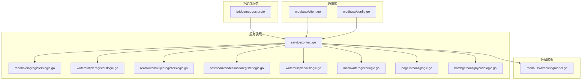
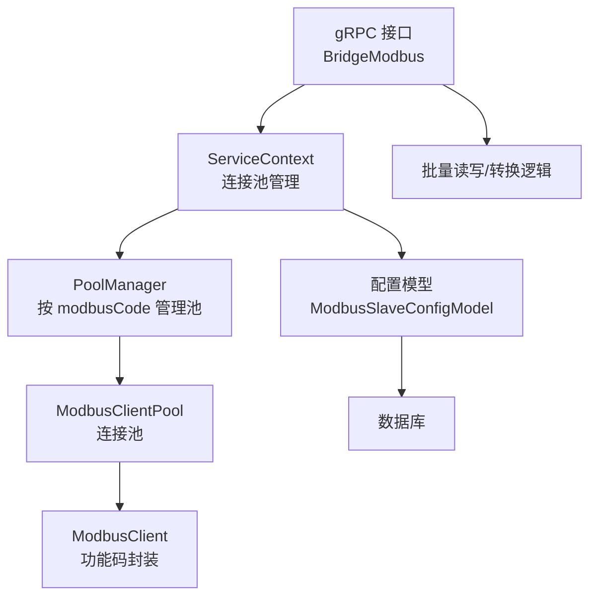
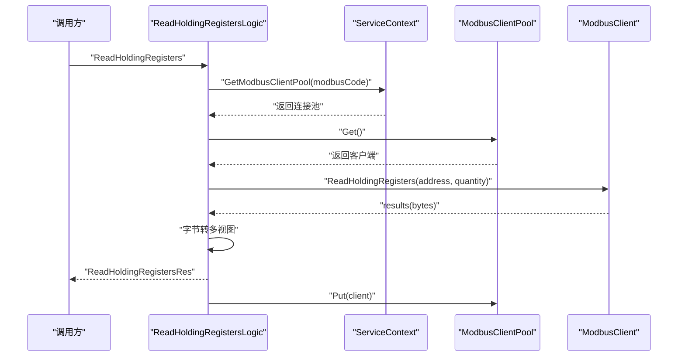
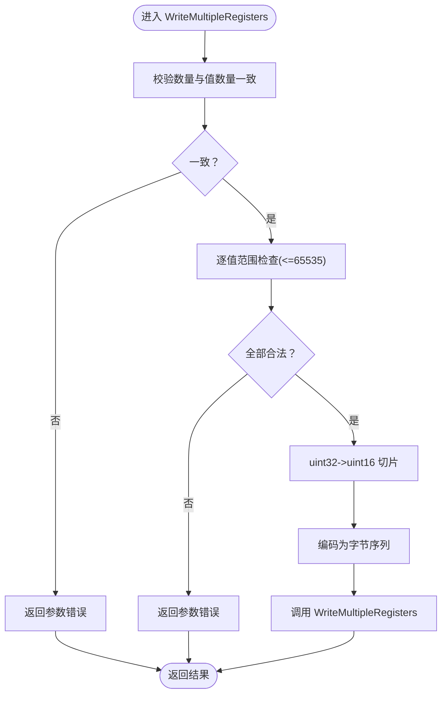
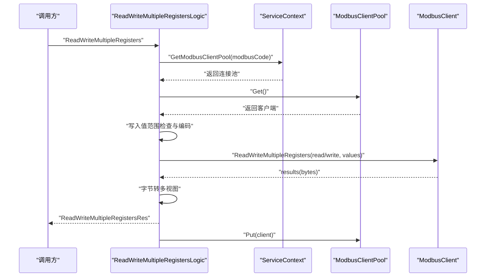
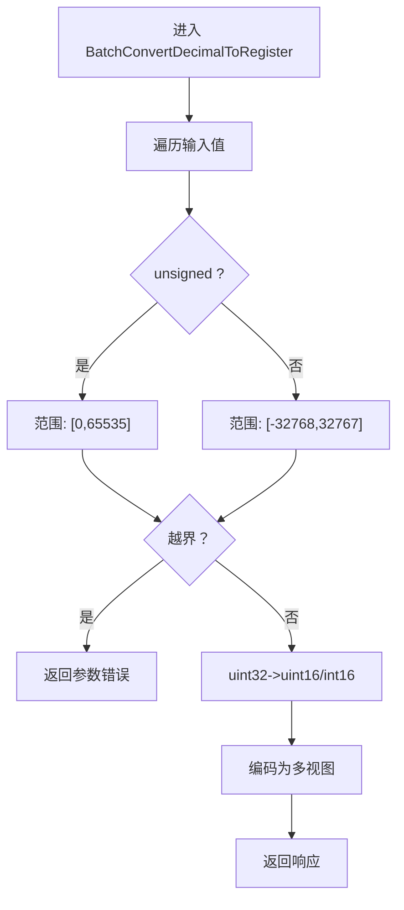
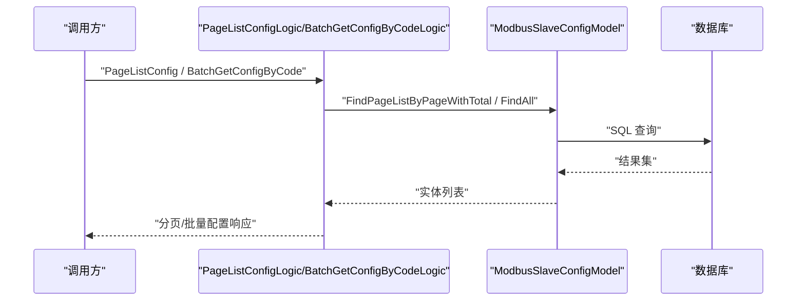
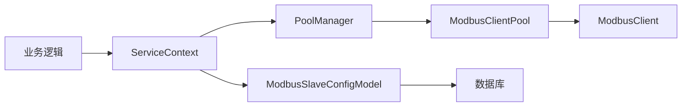

# 批量数据处理

<cite>
**本文引用的文件**
- [app/bridgemodbus/bridgemodbus.proto](file://app/bridgemodbus/bridgemodbus.proto)
- [common/modbusx/client.go](file://common/modbusx/client.go)
- [common/modbusx/config.go](file://common/modbusx/config.go)
- [app/bridgemodbus/internal/svc/servicecontext.go](file://app/bridgemodbus/internal/svc/servicecontext.go)
- [app/bridgemodbus/internal/logic/readholdingregisterslogic.go](file://app/bridgemodbus/internal/logic/readholdingregisterslogic.go)
- [app/bridgemodbus/internal/logic/writemultipleregisterslogic.go](file://app/bridgemodbus/internal/logic/writemultipleregisterslogic.go)
- [app/bridgemodbus/internal/logic/readwritemultipleregisterslogic.go](file://app/bridgemodbus/internal/logic/readwritemultipleregisterslogic.go)
- [app/bridgemodbus/internal/logic/batchconvertdecimaltoregisterlogic.go](file://app/bridgemodbus/internal/logic/batchconvertdecimaltoregisterlogic.go)
- [app/bridgemodbus/internal/logic/writemultiplecoilslogic.go](file://app/bridgemodbus/internal/logic/writemultiplecoilslogic.go)
- [app/bridgemodbus/internal/logic/maskwriteregisterlogic.go](file://app/bridgemodbus/internal/logic/maskwriteregisterlogic.go)
- [app/bridgemodbus/internal/logic/pagelistconfiglogic.go](file://app/bridgemodbus/internal/logic/pagelistconfiglogic.go)
- [app/bridgemodbus/internal/logic/batchgetconfigbycodelogic.go](file://app/bridgemodbus/internal/logic/batchgetconfigbycodelogic.go)
- [model/modbusslaveconfigmodel.go](file://model/modbusslaveconfigmodel.go)
</cite>

## 目录
1. [引言](#引言)
2. [项目结构](#项目结构)
3. [核心组件](#核心组件)
4. [架构总览](#架构总览)
5. [详细组件分析](#详细组件分析)
6. [依赖分析](#依赖分析)
7. [性能考虑](#性能考虑)
8. [故障排查指南](#故障排查指南)
9. [结论](#结论)
10. [附录](#附录)

## 引言
本技术文档聚焦于 Modbus 批量数据处理能力，系统性阐述批量读取、批量写入与混合操作的实现机制、数据组织方式、内存管理与性能优化策略，并覆盖批量配置获取、数据合并与结果聚合、事务性与错误隔离、超时与并发控制、资源管理、API 接口说明、性能基准建议与使用场景分析，以及最佳实践、调优与故障恢复指南。目标是帮助读者在复杂工业场景下高效、稳定地完成大规模 Modbus 数据采集与控制。

## 项目结构
围绕 Modbus 批量处理的相关模块主要分布在以下位置：
- 协议与服务定义：app/bridgemodbus/bridgemodbus.proto
- Modbus 客户端与连接池：common/modbusx/client.go、common/modbusx/config.go
- 服务上下文与连接池管理：app/bridgemodbus/internal/svc/servicecontext.go
- 读写与批量转换逻辑：internal/logic 下多文件
- 配置模型与查询：model/modbusslaveconfigmodel.go

图表来源
- [app/bridgemodbus/bridgemodbus.proto:1-83](file://app/bridgemodbus/bridgemodbus.proto#L1-L83)
- [common/modbusx/client.go:1-218](file://common/modbusx/client.go#L1-L218)
- [common/modbusx/config.go:1-125](file://common/modbusx/config.go#L1-L125)
- [app/bridgemodbus/internal/svc/servicecontext.go:1-81](file://app/bridgemodbus/internal/svc/servicecontext.go#L1-L81)
- [app/bridgemodbus/internal/logic/readholdingregisterslogic.go:1-58](file://app/bridgemodbus/internal/logic/readholdingregisterslogic.go#L1-L58)
- [app/bridgemodbus/internal/logic/writemultipleregisterslogic.go:1-62](file://app/bridgemodbus/internal/logic/writemultipleregisterslogic.go#L1-L62)
- [app/bridgemodbus/internal/logic/readwritemultipleregisterslogic.go:1-63](file://app/bridgemodbus/internal/logic/readwritemultipleregisterslogic.go#L1-L63)
- [app/bridgemodbus/internal/logic/batchconvertdecimaltoregisterlogic.go:1-68](file://app/bridgemodbus/internal/logic/batchconvertdecimaltoregisterlogic.go#L1-L68)
- [app/bridgemodbus/internal/logic/writemultiplecoilslogic.go:1-52](file://app/bridgemodbus/internal/logic/writemultiplecoilslogic.go#L1-L52)
- [app/bridgemodbus/internal/logic/maskwriteregisterlogic.go:1-53](file://app/bridgemodbus/internal/logic/maskwriteregisterlogic.go#L1-L53)
- [app/bridgemodbus/internal/logic/pagelistconfiglogic.go:1-53](file://app/bridgemodbus/internal/logic/pagelistconfiglogic.go#L1-L53)
- [app/bridgemodbus/internal/logic/batchgetconfigbycodelogic.go:1-46](file://app/bridgemodbus/internal/logic/batchgetconfigbycodelogic.go#L1-L46)
- [model/modbusslaveconfigmodel.go:1-32](file://model/modbusslaveconfigmodel.go#L1-L32)

章节来源
- [app/bridgemodbus/bridgemodbus.proto:1-83](file://app/bridgemodbus/bridgemodbus.proto#L1-L83)
- [common/modbusx/client.go:1-218](file://common/modbusx/client.go#L1-L218)
- [common/modbusx/config.go:1-125](file://common/modbusx/config.go#L1-L125)
- [app/bridgemodbus/internal/svc/servicecontext.go:1-81](file://app/bridgemodbus/internal/svc/servicecontext.go#L1-L81)

## 核心组件
- Modbus 客户端与连接池
  - 提供对标准功能码的封装（读写寄存器、线圈、屏蔽写等），并内置连接池以复用 TCP/串口连接，降低握手与建链开销。
  - 支持超时、空闲超时、重连与协议恢复等参数化配置。
- 服务上下文与动态连接池管理
  - 基于配置表动态创建/获取连接池，按 modbusCode 维度隔离不同设备或网关的连接资源。
- 批量读写与转换逻辑
  - 批量读取保持寄存器、批量写多个寄存器、读写多个寄存器、批量转换十进制到寄存器格式、批量写多个线圈、屏蔽写寄存器等。
- 配置管理与查询
  - 保存/删除/分页查询/按编码批量查询 Modbus 从站配置，支撑批量操作的配置获取与合并。

章节来源
- [common/modbusx/client.go:145-191](file://common/modbusx/client.go#L145-L191)
- [common/modbusx/config.go:63-125](file://common/modbusx/config.go#L63-L125)
- [app/bridgemodbus/internal/svc/servicecontext.go:34-80](file://app/bridgemodbus/internal/svc/servicecontext.go#L34-L80)
- [app/bridgemodbus/internal/logic/readholdingregisterslogic.go:27-57](file://app/bridgemodbus/internal/logic/readholdingregisterslogic.go#L27-L57)
- [app/bridgemodbus/internal/logic/writemultipleregisterslogic.go:29-61](file://app/bridgemodbus/internal/logic/writemultipleregisterslogic.go#L29-L61)
- [app/bridgemodbus/internal/logic/readwritemultipleregisterslogic.go:29-62](file://app/bridgemodbus/internal/logic/readwritemultipleregisterslogic.go#L29-L62)
- [app/bridgemodbus/internal/logic/batchconvertdecimaltoregisterlogic.go:30-67](file://app/bridgemodbus/internal/logic/batchconvertdecimaltoregisterlogic.go#L30-L67)
- [app/bridgemodbus/internal/logic/writemultiplecoilslogic.go:29-51](file://app/bridgemodbus/internal/logic/writemultiplecoilslogic.go#L29-L51)
- [app/bridgemodbus/internal/logic/maskwriteregisterlogic.go:28-52](file://app/bridgemodbus/internal/logic/maskwriteregisterlogic.go#L28-L52)
- [app/bridgemodbus/internal/logic/pagelistconfiglogic.go:29-52](file://app/bridgemodbus/internal/logic/pagelistconfiglogic.go#L29-L52)
- [app/bridgemodbus/internal/logic/batchgetconfigbycodelogic.go:29-45](file://app/bridgemodbus/internal/logic/batchgetconfigbycodelogic.go#L29-L45)
- [model/modbusslaveconfigmodel.go:1-32](file://model/modbusslaveconfigmodel.go#L1-L32)

## 架构总览
整体架构由“协议层—通用库—服务上下文—业务逻辑—数据模型”构成，批量处理通过统一的连接池与配置管理实现跨设备、跨协议的高吞吐与低延迟。

图表来源
- [app/bridgemodbus/bridgemodbus.proto:10-83](file://app/bridgemodbus/bridgemodbus.proto#L10-L83)
- [common/modbusx/config.go:63-125](file://common/modbusx/config.go#L63-L125)
- [common/modbusx/client.go:145-191](file://common/modbusx/client.go#L145-L191)
- [app/bridgemodbus/internal/svc/servicecontext.go:34-80](file://app/bridgemodbus/internal/svc/servicecontext.go#L34-L80)
- [model/modbusslaveconfigmodel.go:1-32](file://model/modbusslaveconfigmodel.go#L1-L32)

## 详细组件分析

### 批量读取：读取保持寄存器
- 功能要点
  - 使用连接池获取客户端，调用底层读取保持寄存器功能码。
  - 将原始字节结果转换为多种视图（无符号/有符号 16 位整型、十六进制、二进制、字节数组）以便上层消费。
- 数据组织与内存
  - 结果以字节数组返回，随后一次性转换为多种切片，避免重复解析。
- 性能优化
  - 通过连接池减少建链成本；合理设置超时与空闲超时，避免长连接占用。
- 错误处理
  - 传输/协议错误向上抛出；参数校验在调用前完成。

图表来源
- [app/bridgemodbus/internal/logic/readholdingregisterslogic.go:27-57](file://app/bridgemodbus/internal/logic/readholdingregisterslogic.go#L27-L57)
- [app/bridgemodbus/internal/svc/servicecontext.go:56-80](file://app/bridgemodbus/internal/svc/servicecontext.go#L56-L80)
- [common/modbusx/client.go:54-57](file://common/modbusx/client.go#L54-L57)
- [common/modbusx/client.go:180-191](file://common/modbusx/client.go#L180-L191)

章节来源
- [app/bridgemodbus/internal/logic/readholdingregisterslogic.go:27-57](file://app/bridgemodbus/internal/logic/readholdingregisterslogic.go#L27-L57)

### 批量写入：写多个保持寄存器
- 功能要点
  - 校验数量与值数量一致性；对每个值进行范围检查（16 位寄存器最大值）。
  - 将 32 位整型数组转换为 16 位无符号数组，再编码为字节序列。
- 数据组织与内存
  - 中间使用临时切片进行类型转换与编码，避免重复分配。
- 性能优化
  - 批量写入减少往返次数；连接池复用降低延迟。
- 错误处理
  - 参数不一致与越界均返回明确错误码。

图表来源
- [app/bridgemodbus/internal/logic/writemultipleregisterslogic.go:29-61](file://app/bridgemodbus/internal/logic/writemultipleregisterslogic.go#L29-L61)

章节来源
- [app/bridgemodbus/internal/logic/writemultipleregisterslogic.go:29-61](file://app/bridgemodbus/internal/logic/writemultipleregisterslogic.go#L29-L61)

### 混合操作：读写多个保持寄存器
- 功能要点
  - 同时发起读取与写入，适用于“读取旧值并写入新值”的原子性场景。
  - 对写入值同样进行范围检查与编码。
- 数据组织与内存
  - 读取结果与写入值分别处理，最终统一返回多种视图。
- 性能优化
  - 单次请求完成读写，显著降低 RTT。
- 错误处理
  - 传输错误直接返回；参数错误明确提示。

图表来源
- [app/bridgemodbus/internal/logic/readwritemultipleregisterslogic.go:29-62](file://app/bridgemodbus/internal/logic/readwritemultipleregisterslogic.go#L29-L62)
- [app/bridgemodbus/internal/svc/servicecontext.go:56-80](file://app/bridgemodbus/internal/svc/servicecontext.go#L56-L80)
- [common/modbusx/client.go:69-72](file://common/modbusx/client.go#L69-L72)
- [common/modbusx/client.go:180-191](file://common/modbusx/client.go#L180-L191)

章节来源
- [app/bridgemodbus/internal/logic/readwritemultipleregisterslogic.go:29-62](file://app/bridgemodbus/internal/logic/readwritemultipleregisterslogic.go#L29-L62)

### 批量转换：十进制到寄存器格式
- 功能要点
  - 支持无符号与有符号两种模式，分别校验范围并转换为 16 位无符号/有符号整型，输出多种格式视图。
- 数据组织与内存
  - 一次性生成多视图，便于后续批量写入或读取展示。
- 性能优化
  - 预分配临时切片，减少 GC 压力。

图表来源
- [app/bridgemodbus/internal/logic/batchconvertdecimaltoregisterlogic.go:30-67](file://app/bridgemodbus/internal/logic/batchconvertdecimaltoregisterlogic.go#L30-L67)

章节来源
- [app/bridgemodbus/internal/logic/batchconvertdecimaltoregisterlogic.go:30-67](file://app/bridgemodbus/internal/logic/batchconvertdecimaltoregisterlogic.go#L30-L67)

### 批量写入：写多个线圈
- 功能要点
  - 将布尔数组转换为位序列，批量写入线圈。
- 数据组织与内存
  - 使用位打包工具生成字节序列，避免逐位拼接。
- 性能优化
  - 批量写入减少网络往返。

章节来源
- [app/bridgemodbus/internal/logic/writemultiplecoilslogic.go:29-51](file://app/bridgemodbus/internal/logic/writemultiplecoilslogic.go#L29-L51)

### 屏蔽写寄存器
- 功能要点
  - 对指定寄存器进行 AND/OR 掩码写，常用于原子性地修改某些位。
- 数据组织与内存
  - 掩码值同样受 16 位上限约束。
- 性能优化
  - 单请求完成掩码写，减少读改写往返。

章节来源
- [app/bridgemodbus/internal/logic/maskwriteregisterlogic.go:28-52](file://app/bridgemodbus/internal/logic/maskwriteregisterlogic.go#L28-L52)

### 批量配置获取与合并
- 分页查询配置列表
  - 支持关键词与状态过滤，返回总数与配置列表。
- 按编码数组批量查询
  - 依据 modbusCode 列表批量获取配置，便于批量操作前的配置合并。
- 数据合并与结果聚合
  - 将多个配置合并为连接池映射，按设备维度聚合批量请求。

图表来源
- [app/bridgemodbus/internal/logic/pagelistconfiglogic.go:29-52](file://app/bridgemodbus/internal/logic/pagelistconfiglogic.go#L29-L52)
- [app/bridgemodbus/internal/logic/batchgetconfigbycodelogic.go:29-45](file://app/bridgemodbus/internal/logic/batchgetconfigbycodelogic.go#L29-L45)
- [model/modbusslaveconfigmodel.go:1-32](file://model/modbusslaveconfigmodel.go#L1-L32)

章节来源
- [app/bridgemodbus/internal/logic/pagelistconfiglogic.go:29-52](file://app/bridgemodbus/internal/logic/pagelistconfiglogic.go#L29-L52)
- [app/bridgemodbus/internal/logic/batchgetconfigbycodelogic.go:29-45](file://app/bridgemodbus/internal/logic/batchgetconfigbycodelogic.go#L29-L45)
- [model/modbusslaveconfigmodel.go:1-32](file://model/modbusslaveconfigmodel.go#L1-L32)

## 依赖分析
- 组件耦合
  - 业务逻辑依赖服务上下文获取连接池；连接池依赖通用库；配置查询依赖数据模型。
- 外部依赖
  - Modbus 客户端库、连接池工具、数据库访问层、gRPC 协议栈。
- 并发与资源
  - 连接池采用互斥锁保护并发安全；客户端生命周期由池管理；空闲超时与最大存活时间控制资源回收。

图表来源
- [app/bridgemodbus/internal/svc/servicecontext.go:34-80](file://app/bridgemodbus/internal/svc/servicecontext.go#L34-L80)
- [common/modbusx/config.go:63-125](file://common/modbusx/config.go#L63-L125)
- [common/modbusx/client.go:145-191](file://common/modbusx/client.go#L145-L191)
- [model/modbusslaveconfigmodel.go:1-32](file://model/modbusslaveconfigmodel.go#L1-L32)

章节来源
- [app/bridgemodbus/internal/svc/servicecontext.go:34-80](file://app/bridgemodbus/internal/svc/servicecontext.go#L34-L80)
- [common/modbusx/config.go:63-125](file://common/modbusx/config.go#L63-L125)
- [common/modbusx/client.go:145-191](file://common/modbusx/client.go#L145-L191)
- [model/modbusslaveconfigmodel.go:1-32](file://model/modbusslaveconfigmodel.go#L1-L32)

## 性能考虑
- 连接复用与池化
  - 使用连接池减少握手与建链开销；按 modbusCode 维度隔离池，避免跨设备干扰。
- 请求批量化
  - 优先使用批量读写功能码，减少往返次数；批量转换预计算多视图，降低重复计算。
- 超时与空闲控制
  - 合理设置超时、空闲超时与重连间隔，平衡稳定性与资源占用。
- 内存与 GC
  - 预分配临时切片，避免频繁分配；一次性转换多视图，减少中间对象。
- 并发与限流
  - 在业务层控制并发度，避免连接池饱和；必要时引入队列或背压策略。

## 故障排查指南
- 常见错误与定位
  - 参数错误：数量不一致、值越界（16 位寄存器范围），检查批量写入与转换逻辑的校验。
  - 传输错误：连接失败、超时、协议异常，检查连接池状态与设备可达性。
  - 配置错误：modbusCode 不存在或未启用，检查配置表与服务上下文的动态创建流程。
- 排查步骤
  - 核对 modbusCode 与配置状态；验证连接池是否创建成功；确认功能码参数范围；观察日志中的会话标识与地址摘要。
- 恢复策略
  - 自动重试与退避；连接池自动回收与重建；关键路径增加熔断与降级。

章节来源
- [app/bridgemodbus/internal/logic/writemultipleregisterslogic.go:31-33](file://app/bridgemodbus/internal/logic/writemultipleregisterslogic.go#L31-L33)
- [app/bridgemodbus/internal/logic/batchconvertdecimaltoregisterlogic.go:33-45](file://app/bridgemodbus/internal/logic/batchconvertdecimaltoregisterlogic.go#L33-L45)
- [app/bridgemodbus/internal/svc/servicecontext.go:34-54](file://app/bridgemodbus/internal/svc/servicecontext.go#L34-L54)

## 结论
该批量处理方案通过统一的连接池与配置管理，结合多种功能码的批量能力与数据视图转换，实现了高吞吐、低延迟的 Modbus 数据采集与控制。配合完善的错误处理与资源管理策略，可在复杂工业环境中稳定运行。建议在生产环境进一步完善监控与告警、基准测试与容量规划，持续优化并发与超时参数。

## 附录

### API 接口文档（批量相关）
- 读取保持寄存器
  - 方法：ReadHoldingRegisters
  - 输入：modbusCode、address、quantity
  - 输出：results、UintValues、IntValues、HexValues、BinaryValues
- 写多个保持寄存器
  - 方法：WriteMultipleRegisters
  - 输入：modbusCode、address、quantity、values[]
  - 输出：results
- 读写多个保持寄存器
  - 方法：ReadWriteMultipleRegisters
  - 输入：modbusCode、readAddress、readQuantity、writeAddress、writeQuantity、values[]
  - 输出：results、UintValues、IntValues、HexValues、BinaryValues
- 批量转换十进制到寄存器格式
  - 方法：BatchConvertDecimalToRegister
  - 输入：values[]、unsigned
  - 输出：Uint16Values、Int16Values、HexValues、BinaryValues、bytes
- 写多个线圈
  - 方法：WriteMultipleCoils
  - 输入：modbusCode、address、quantity、values[]
  - 输出：results
- 屏蔽写保持寄存器
  - 方法：MaskWriteRegister
  - 输入：modbusCode、address、andMask、orMask
  - 输出：results
- 配置管理（批量配置获取）
  - 方法：PageListConfig、BatchGetConfigByCode
  - 输入：page、pageSize、keyword、status、modbusCode[]
  - 输出：total、cfg[]

章节来源
- [app/bridgemodbus/bridgemodbus.proto:47-82](file://app/bridgemodbus/bridgemodbus.proto#L47-L82)
- [app/bridgemodbus/internal/logic/readholdingregisterslogic.go:27-57](file://app/bridgemodbus/internal/logic/readholdingregisterslogic.go#L27-L57)
- [app/bridgemodbus/internal/logic/writemultipleregisterslogic.go:29-61](file://app/bridgemodbus/internal/logic/writemultipleregisterslogic.go#L29-L61)
- [app/bridgemodbus/internal/logic/readwritemultipleregisterslogic.go:29-62](file://app/bridgemodbus/internal/logic/readwritemultipleregisterslogic.go#L29-L62)
- [app/bridgemodbus/internal/logic/batchconvertdecimaltoregisterlogic.go:30-67](file://app/bridgemodbus/internal/logic/batchconvertdecimaltoregisterlogic.go#L30-L67)
- [app/bridgemodbus/internal/logic/writemultiplecoilslogic.go:29-51](file://app/bridgemodbus/internal/logic/writemultiplecoilslogic.go#L29-L51)
- [app/bridgemodbus/internal/logic/maskwriteregisterlogic.go:28-52](file://app/bridgemodbus/internal/logic/maskwriteregisterlogic.go#L28-L52)
- [app/bridgemodbus/internal/logic/pagelistconfiglogic.go:29-52](file://app/bridgemodbus/internal/logic/pagelistconfiglogic.go#L29-L52)
- [app/bridgemodbus/internal/logic/batchgetconfigbycodelogic.go:29-45](file://app/bridgemodbus/internal/logic/batchgetconfigbycodelogic.go#L29-L45)

### 最佳实践与调优建议
- 批量策略
  - 优先使用批量读写功能码；将小批量请求合并为大批量，减少 RTT。
- 数据视图
  - 在转换阶段生成多视图，避免上层重复计算。
- 超时与并发
  - 根据设备响应时间设置超时；限制并发度，防止连接池耗尽。
- 监控与告警
  - 关注连接池命中率、平均响应时间、错误分布与重试次数。
- 容量规划
  - 基于设备数量与请求频率估算池大小与并发上限，预留缓冲。

### 使用场景分析
- 数据采集
  - 大规模寄存器轮询：使用批量读取与转换，统一视图输出。
- 控制下发
  - 批量写入控制命令：使用批量写多个寄存器或屏蔽写，确保原子性。
- 混合操作
  - 读取旧值并写入新值：使用读写多个寄存器，减少竞态风险。
- 配置驱动
  - 多设备批量配置：先批量获取配置，再按设备维度合并请求。