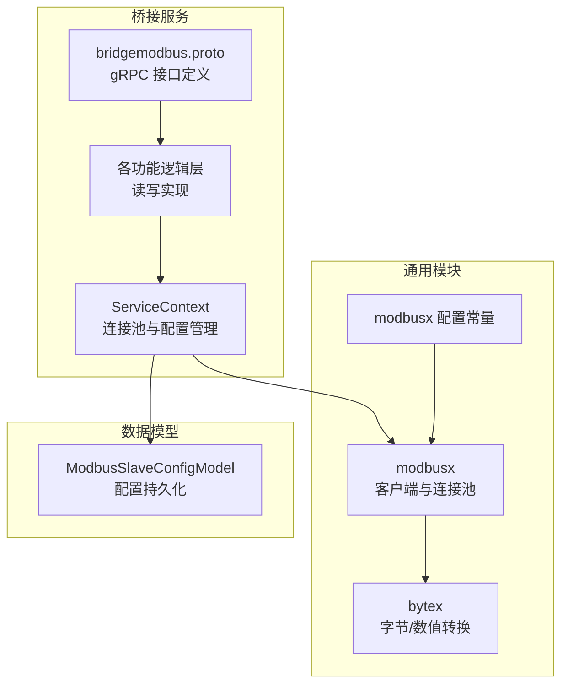
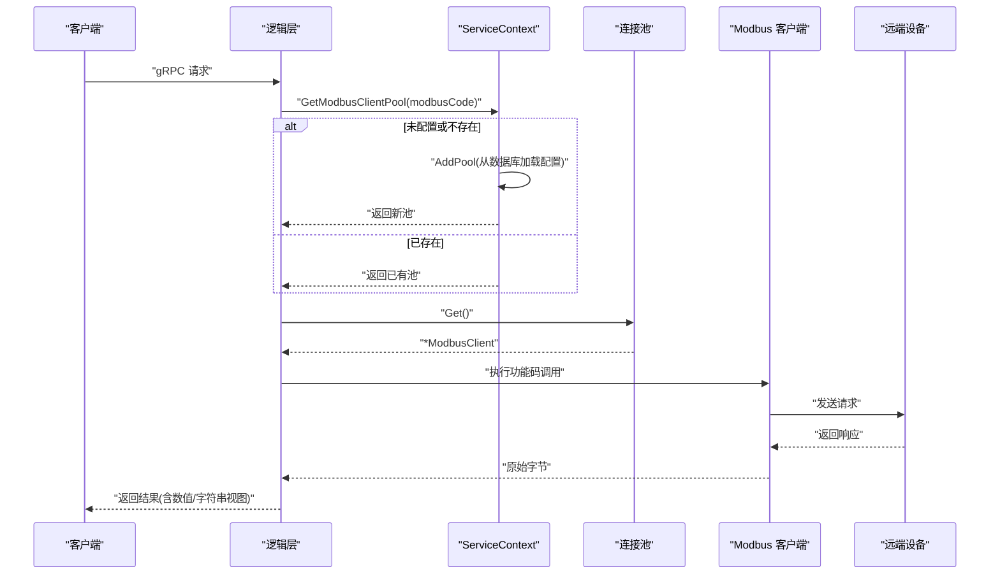
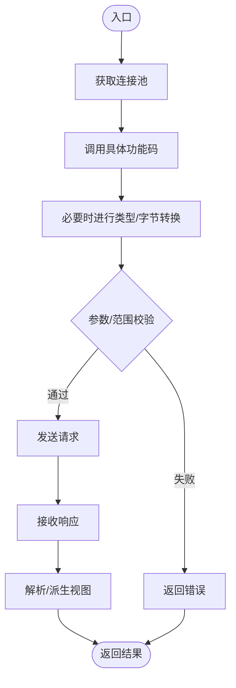
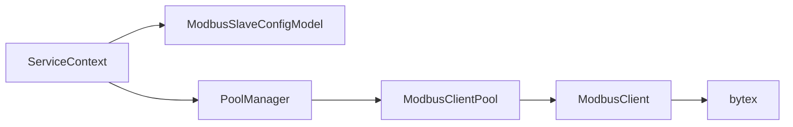

# 数据读写操作

<cite>
**本文引用的文件**
- [common/modbusx/client.go](file://common/modbusx/client.go)
- [common/modbusx/config.go](file://common/modbusx/config.go)
- [common/bytex/bytex.go](file://common/bytex/bytex.go)
- [app/bridgemodbus/bridgemodbus.proto](file://app/bridgemodbus/bridgemodbus.proto)
- [app/bridgemodbus/internal/logic/readcoilslogic.go](file://app/bridgemodbus/internal/logic/readcoilslogic.go)
- [app/bridgemodbus/internal/logic/readholdingregisterslogic.go](file://app/bridgemodbus/internal/logic/readholdingregisterslogic.go)
- [app/bridgemodbus/internal/logic/writesingleregisterlogic.go](file://app/bridgemodbus/internal/logic/writesingleregisterlogic.go)
- [app/bridgemodbus/internal/logic/writemultipleregisterslogic.go](file://app/bridgemodbus/internal/logic/writemultipleregisterslogic.go)
- [app/bridgemodbus/internal/logic/maskwriteregisterlogic.go](file://app/bridgemodbus/internal/logic/maskwriteregisterlogic.go)
- [app/bridgemodbus/internal/svc/servicecontext.go](file://app/bridgemodbus/internal/svc/servicecontext.go)
- [model/modbusslaveconfigmodel.go](file://model/modbusslaveconfigmodel.go)
- [model/modbusslaveconfigmodel_gen.go](file://model/modbusslaveconfigmodel_gen.go)
</cite>

## 目录
1. [引言](#引言)
2. [项目结构](#项目结构)
3. [核心组件](#核心组件)
4. [架构总览](#架构总览)
5. [详细组件分析](#详细组件分析)
6. [依赖分析](#依赖分析)
7. [性能考虑](#性能考虑)
8. [故障排查指南](#故障排查指南)
9. [结论](#结论)
10. [附录](#附录)

## 引言
本技术文档围绕 Modbus 数据读写操作进行系统化梳理，覆盖协议功能码、数据类型与地址范围、线圈/寄存器读写、批量数据处理与单点写入、数据类型转换与字节序、精度控制、批量读取优化与并发控制、响应时间优化策略、错误处理与重试机制，并提供 API 接口文档、参数说明与使用示例，辅以性能测试建议与最佳实践。

## 项目结构
本项目通过“桥接服务”封装底层 Modbus 客户端，统一对外提供 gRPC 接口，内部通过连接池与配置模型实现多链路、可扩展的 Modbus 通信能力。

图示来源
- [app/bridgemodbus/bridgemodbus.proto:1-355](file://app/bridgemodbus/bridgemodbus.proto#L1-L355)
- [app/bridgemodbus/internal/svc/servicecontext.go:1-81](file://app/bridgemodbus/internal/svc/servicecontext.go#L1-L81)
- [common/modbusx/client.go:1-218](file://common/modbusx/client.go#L1-L218)
- [common/modbusx/config.go:1-125](file://common/modbusx/config.go#L1-L125)
- [common/bytex/bytex.go:1-239](file://common/bytex/bytex.go#L1-L239)
- [model/modbusslaveconfigmodel.go:1-32](file://model/modbusslaveconfigmodel.go#L1-L32)

章节来源
- [app/bridgemodbus/bridgemodbus.proto:1-355](file://app/bridgemodbus/bridgemodbus.proto#L1-L355)
- [app/bridgemodbus/internal/svc/servicecontext.go:1-81](file://app/bridgemodbus/internal/svc/servicecontext.go#L1-L81)
- [common/modbusx/client.go:1-218](file://common/modbusx/client.go#L1-L218)
- [common/modbusx/config.go:1-125](file://common/modbusx/config.go#L1-L125)
- [common/bytex/bytex.go:1-239](file://common/bytex/bytex.go#L1-L239)
- [model/modbusslaveconfigmodel.go:1-32](file://model/modbusslaveconfigmodel.go#L1-L32)

## 核心组件
- Modbus 客户端与连接池
  - 提供对标准功能码的封装（线圈/寄存器读写、屏蔽写、FIFO、设备标识等）。
  - 支持 TLS、超时、空闲回收、连接恢复与重连策略。
  - 提供连接池与会话级日志记录。
- 数据类型转换工具
  - 提供字节数组与 16 位整数之间的互转，以及十六进制/二进制字符串输出。
  - 支持布尔位与字节互转，便于线圈读写。
- 服务上下文与配置管理
  - 通过数据库模型加载配置，动态创建/获取连接池。
  - 支持默认池与按 modbusCode 的独立池。
- gRPC 接口定义
  - 覆盖配置管理、线圈/寄存器读写、批量转换等完整能力。

章节来源
- [common/modbusx/client.go:20-97](file://common/modbusx/client.go#L20-L97)
- [common/modbusx/config.go:32-61](file://common/modbusx/config.go#L32-L61)
- [common/bytex/bytex.go:7-239](file://common/bytex/bytex.go#L7-L239)
- [app/bridgemodbus/internal/svc/servicecontext.go:14-81](file://app/bridgemodbus/internal/svc/servicecontext.go#L14-L81)
- [app/bridgemodbus/bridgemodbus.proto:10-83](file://app/bridgemodbus/bridgemodbus.proto#L10-L83)

## 架构总览
下图展示一次典型读写流程：gRPC 请求进入逻辑层，通过 ServiceContext 获取连接池，调用底层 Modbus 客户端执行功能码操作，返回原始字节与派生的数值/字符串视图。

图示来源
- [app/bridgemodbus/internal/logic/readholdingregisterslogic.go:27-57](file://app/bridgemodbus/internal/logic/readholdingregisterslogic.go#L27-L57)
- [app/bridgemodbus/internal/svc/servicecontext.go:56-80](file://app/bridgemodbus/internal/svc/servicecontext.go#L56-L80)
- [common/modbusx/client.go:29-87](file://common/modbusx/client.go#L29-L87)

## 详细组件分析

### Modbus 协议功能码与数据范围
- 线圈读写
  - 读取线圈状态：功能码 0x01，地址范围与数量受设备限制。
  - 写单个线圈：功能码 0x05，值为 ON/OFF。
  - 写多个线圈：功能码 0x0F，支持批量布尔值写入。
- 寄存器读写
  - 读取输入寄存器：功能码 0x04，只读。
  - 读取保持寄存器：功能码 0x03，可读写。
  - 写单个寄存器：功能码 0x06，16 位无符号值。
  - 写多个寄存器：功能码 0x10，支持批量 16 位值。
  - 读写多个寄存器：功能码 0x17，同时完成读写。
  - 屏蔽写寄存器：功能码 0x16，按位掩码修改。
- 批量转换
  - 提供十进制整数到寄存器格式的批量转换，输出十六进制、二进制与字节数组。
- 设备标识
  - 读取设备标识：功能码 0x2B/0x0E，支持通用/扩展/特定对象读取。

章节来源
- [app/bridgemodbus/bridgemodbus.proto:28-83](file://app/bridgemodbus/bridgemodbus.proto#L28-L83)
- [common/modbusx/client.go:29-92](file://common/modbusx/client.go#L29-L92)

### 数据类型转换、字节序与精度控制
- 字节序
  - Modbus 使用大端序（高位字节在前）。工具函数将字节数组转换为 16 位无符号整数序列，再派生有符号整数与十六进制/二进制字符串。
- 精度控制
  - 16 位寄存器范围：无符号 0–65535，有符号 -32768–32767。
  - gRPC 层提供 uint32/int32 视图，便于上层业务计算。
- 线圈布尔
  - 字节数组按位解析为布尔数组，支持批量写入布尔序列。

章节来源
- [common/bytex/bytex.go:23-239](file://common/bytex/bytex.go#L23-L239)
- [app/bridgemodbus/bridgemodbus.proto:195-243](file://app/bridgemodbus/bridgemodbus.proto#L195-L243)

### 线圈读写与寄存器读写的实现原理
- 线圈读取
  - 逻辑层获取连接池，调用底层 ReadCoils，将原始字节转换为布尔数组返回。
- 写单个寄存器
  - 参数校验 16 位上限，转换为字节序列，调用底层 WriteSingleRegister，返回回显。
- 写多个寄存器
  - 校验数量与值范围，批量转换为字节序列，调用底层 WriteMultipleRegisters。
- 屏蔽写寄存器
  - 校验掩码范围，调用底层 MaskWriteRegister。

图示来源
- [app/bridgemodbus/internal/logic/readcoilslogic.go:27-43](file://app/bridgemodbus/internal/logic/readcoilslogic.go#L27-L43)
- [app/bridgemodbus/internal/logic/writesingleregisterlogic.go:29-55](file://app/bridgemodbus/internal/logic/writesingleregisterlogic.go#L29-L55)
- [app/bridgemodbus/internal/logic/writemultipleregisterslogic.go:29-62](file://app/bridgemodbus/internal/logic/writemultipleregisterslogic.go#L29-L62)
- [app/bridgemodbus/internal/logic/maskwriteregisterlogic.go:28-53](file://app/bridgemodbus/internal/logic/maskwriteregisterlogic.go#L28-L53)

章节来源
- [app/bridgemodbus/internal/logic/readcoilslogic.go:27-43](file://app/bridgemodbus/internal/logic/readcoilslogic.go#L27-L43)
- [app/bridgemodbus/internal/logic/writesingleregisterlogic.go:29-55](file://app/bridgemodbus/internal/logic/writesingleregisterlogic.go#L29-L55)
- [app/bridgemodbus/internal/logic/writemultipleregisterslogic.go:29-62](file://app/bridgemodbus/internal/logic/writemultipleregisterslogic.go#L29-L62)
- [app/bridgemodbus/internal/logic/maskwriteregisterlogic.go:28-53](file://app/bridgemodbus/internal/logic/maskwriteregisterlogic.go#L28-L53)

### 批量数据处理与单点写入
- 批量读取
  - 通过读取保持寄存器接口，返回原始字节与多视图（uint32/int32/hex/binary），减少重复转换成本。
- 单点写入
  - 写单个寄存器与写单个线圈均提供回显，便于确认写入结果。
- 批量转换
  - 提供十进制整数到寄存器格式的批量转换，支持无符号/有符号两种模式。

章节来源
- [app/bridgemodbus/bridgemodbus.proto:195-243](file://app/bridgemodbus/bridgemodbus.proto#L195-L243)
- [app/bridgemodbus/bridgemodbus.proto:344-355](file://app/bridgemodbus/bridgemodbus.proto#L344-L355)

### 并发控制与连接池
- 连接池
  - 按 modbusCode 维度管理独立池，支持最大存活时间与自动销毁。
  - 默认池与按编码池并存，逻辑层优先按编码获取。
- 并发安全
  - 连接池内部使用同步池，Get/Put 保证资源复用与释放。
- 会话日志
  - 自定义日志器记录会话标识与地址摘要，便于追踪。

章节来源
- [common/modbusx/client.go:145-191](file://common/modbusx/client.go#L145-L191)
- [common/modbusx/config.go:63-125](file://common/modbusx/config.go#L63-L125)
- [app/bridgemodbus/internal/svc/servicecontext.go:56-80](file://app/bridgemodbus/internal/svc/servicecontext.go#L56-L80)

### 错误处理、异常状态码与重试策略
- 参数校验
  - 写操作对 16 位上限进行检查，批量写入对数量一致性进行校验。
- 异常状态码
  - 使用统一错误码体系，便于上层识别业务错误与参数错误。
- 重试与恢复
  - 客户端配置包含连接恢复与协议恢复超时，底层库具备自动重连与超时控制。

章节来源
- [app/bridgemodbus/internal/logic/writemultipleregisterslogic.go:31-46](file://app/bridgemodbus/internal/logic/writemultipleregisterslogic.go#L31-L46)
- [app/bridgemodbus/internal/logic/maskwriteregisterlogic.go:37-43](file://app/bridgemodbus/internal/logic/maskwriteregisterlogic.go#L37-L43)
- [common/modbusx/client.go:107-143](file://common/modbusx/client.go#L107-L143)

### API 接口文档与使用示例
以下为常用接口的参数说明与调用要点（示例为概念性描述，非代码片段）：

- 保存/删除/分页查询/按编码查询配置
  - 用途：维护不同设备链路的 Modbus 配置（地址、从站、超时、TLS 等）。
  - 关键字段：modbusCode、slaveAddress、slave、timeout、idleTimeout、linkRecoveryTimeout、protocolRecoveryTimeout、connectDelay、enableTls、证书路径、状态等。
  - 返回：主键 ID 或空结果。
- 读取线圈状态
  - 请求：modbusCode、address、quantity（1–2000）。
  - 返回：原始字节与布尔数组。
- 读取离散输入
  - 请求：modbusCode、address、quantity（1–2000）。
  - 返回：原始字节与布尔数组。
- 写单个线圈
  - 请求：modbusCode、address、value（ON/OFF）。
  - 返回：回显字节。
- 写多个线圈
  - 请求：modbusCode、address、quantity、values（布尔数组）。
  - 返回：回显数量。
- 读取输入寄存器/保持寄存器
  - 请求：modbusCode、address、quantity（1–125）。
  - 返回：原始字节与多视图（uint32、int32、hex、binary）。
- 写单个寄存器
  - 请求：modbusCode、address、value（0–65535）。
  - 返回：回显字节。
- 写单个寄存器（十进制）
  - 请求：modbusCode、address、value（int32）、unsigned（true/false）。
  - 返回：回显字节。
- 写多个寄存器
  - 请求：modbusCode、address、quantity、values（uint32 列表，每个值 0–65535）。
  - 返回：回显数量。
- 写多个寄存器（十进制）
  - 请求：modbusCode、address、quantity、values（int32 列表）、unsigned。
  - 返回：回显数量。
- 读写多个寄存器
  - 请求：readAddress、readQuantity、writeAddress、writeQuantity、values。
  - 返回：读取到的数据与多视图。
- 屏蔽写寄存器
  - 请求：address、andMask、orMask（均不超过 65535）。
  - 返回：回显字节。
- 读取 FIFO 队列
  - 请求：modbusCode、address。
  - 返回：队列内容字节。
- 读取设备标识
  - 请求：modbusCode、readDeviceIdCode。
  - 返回：原始对象 ID 映射、十六进制映射、语义化映射。
- 读取特定对象的设备标识
  - 请求：modbusCode、objectId。
  - 返回：同上三类映射。
- 批量转换十进制到寄存器
  - 请求：values（int32 列表，支持正负）、unsigned。
  - 返回：uint16 值、int16 值、十六进制、二进制、字节数组。

章节来源
- [app/bridgemodbus/bridgemodbus.proto:10-83](file://app/bridgemodbus/bridgemodbus.proto#L10-L83)
- [app/bridgemodbus/bridgemodbus.proto:150-355](file://app/bridgemodbus/bridgemodbus.proto#L150-L355)

## 依赖分析
- 服务上下文依赖
  - 数据库模型用于加载/校验配置，转换为客户端配置，驱动连接池创建。
- 逻辑层依赖
  - 通过 ServiceContext 获取连接池，调用 Modbus 客户端执行功能码。
- 工具层依赖
  - bytex 提供字节与数值之间的双向转换，支撑 gRPC 响应的多视图输出。

图示来源
- [app/bridgemodbus/internal/svc/servicecontext.go:34-80](file://app/bridgemodbus/internal/svc/servicecontext.go#L34-L80)
- [common/modbusx/config.go:63-125](file://common/modbusx/config.go#L63-L125)
- [common/modbusx/client.go:145-191](file://common/modbusx/client.go#L145-L191)
- [common/bytex/bytex.go:136-189](file://common/bytex/bytex.go#L136-L189)

章节来源
- [app/bridgemodbus/internal/svc/servicecontext.go:1-81](file://app/bridgemodbus/internal/svc/servicecontext.go#L1-L81)
- [model/modbusslaveconfigmodel_gen.go:131-150](file://model/modbusslaveconfigmodel_gen.go#L131-L150)

## 性能考虑
- 连接池复用
  - 按 modbusCode 维度隔离池，避免跨链路竞争；合理设置池大小与最大存活时间。
- 批量读写
  - 优先使用批量读写接口，减少往返次数；注意设备侧最大数量限制。
- 数据转换缓存
  - gRPC 返回多视图，避免上层重复转换；必要时在应用层缓存热点视图。
- 超时与恢复
  - 根据网络与设备特性调整超时与恢复间隔，平衡可靠性与响应时间。
- 日志与追踪
  - 使用会话标识与地址摘要，便于定位慢请求与异常。

## 故障排查指南
- 常见错误与定位
  - 参数越界：写操作超过 16 位寄存器范围或数量不一致。
  - 配置缺失：modbusCode 未启用或数据库未找到。
  - 连接失败：检查地址、端口、TLS 证书与网络连通性。
- 排查步骤
  - 确认配置状态与转换正确性。
  - 查看连接池获取与归还是否成对出现。
  - 检查日志中的会话标识与地址摘要，定位具体链路。
  - 在设备侧验证功能码与地址范围是否符合规范。

章节来源
- [app/bridgemodbus/internal/logic/writemultipleregisterslogic.go:31-46](file://app/bridgemodbus/internal/logic/writemultipleregisterslogic.go#L31-L46)
- [app/bridgemodbus/internal/svc/servicecontext.go:34-54](file://app/bridgemodbus/internal/svc/servicecontext.go#L34-L54)
- [common/modbusx/client.go:193-217](file://common/modbusx/client.go#L193-L217)

## 结论
本方案通过统一的 gRPC 接口与连接池管理，实现了对 Modbus 协议的标准化封装，覆盖线圈/寄存器读写、批量处理与设备标识读取等核心能力。配合完善的类型转换、错误处理与日志追踪，能够满足工业场景下的高可靠与高性能需求。

## 附录
- 地址范围与数量限制
  - 线圈/离散输入：quantity 通常限制在 1–2000。
  - 输入寄存器/保持寄存器：quantity 通常限制在 1–125。
- 精度与范围
  - 16 位寄存器：无符号 0–65535，有符号 -32768–32767。
- 最佳实践
  - 优先使用批量接口；严格参数校验；合理设置超时与池大小；启用 TLS 加密传输；利用多视图减少重复转换。