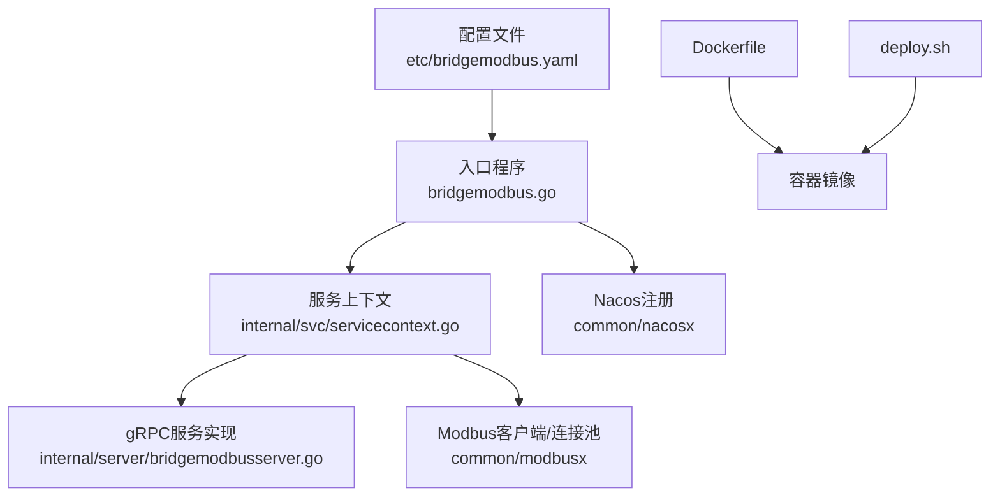
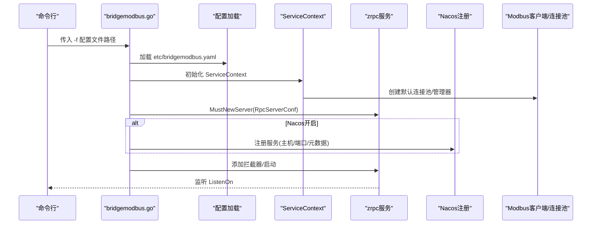
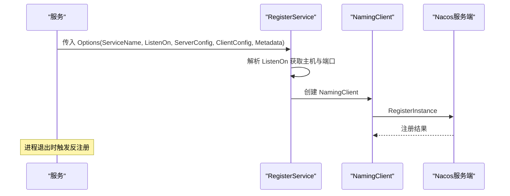
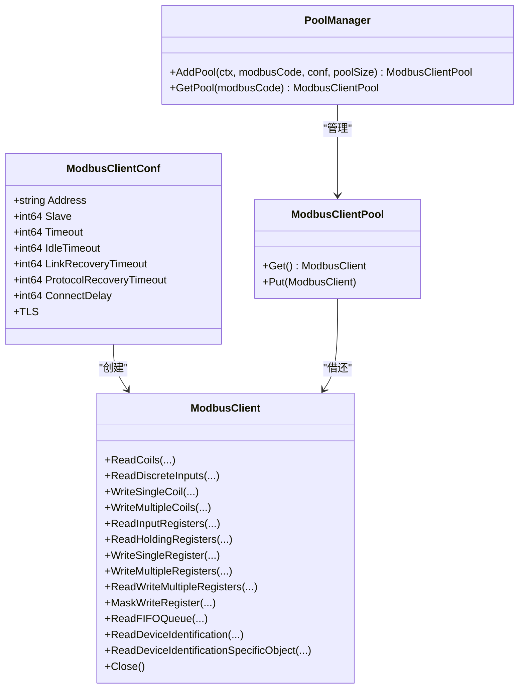
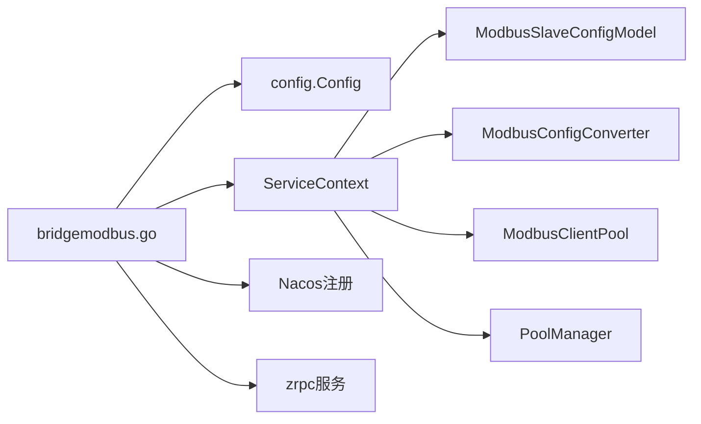

# 服务配置与部署

<cite>
**本文引用的文件**
- [bridgemodbus.yaml](file://app/bridgemodbus/etc/bridgemodbus.yaml)
- [config.go](file://app/bridgemodbus/internal/config/config.go)
- [bridgemodbus.go](file://app/bridgemodbus/bridgemodbus.go)
- [Dockerfile](file://app/bridgemodbus/Dockerfile)
- [deploy.sh](file://app/bridgemodbus/deploy.sh)
- [client.go](file://common/modbusx/client.go)
- [config.go](file://common/modbusx/config.go)
- [register.go](file://common/nacosx/register.go)
- [config.go](file://common/nacosx/config.go)
- [servicecontext.go](file://app/bridgemodbus/internal/svc/servicecontext.go)
- [bridgemodbusserver.go](file://app/bridgemodbus/internal/server/bridgemodbusserver.go)
- [test.env](file://app/bridgemodbus/env/test.env)
- [test_105.env](file://app/bridgemodbus/env/test_105.env)
</cite>

## 目录
1. [简介](#简介)
2. [项目结构](#项目结构)
3. [核心组件](#核心组件)
4. [架构总览](#架构总览)
5. [详细组件分析](#详细组件分析)
6. [依赖关系分析](#依赖关系分析)
7. [性能考虑](#性能考虑)
8. [故障排查指南](#故障排查指南)
9. [结论](#结论)
10. [附录](#附录)

## 简介
本技术文档面向Modbus桥接服务（bridgemodbus）的配置与部署，系统性说明配置文件结构、参数含义、启动参数、监听端口、Nacos注册机制、网络与超时参数、连接池配置、日志级别、Docker容器化与环境变量、服务发现、部署模板、性能调优与安全建议，以及监控、健康检查与故障恢复配置要点。

## 项目结构
Modbus桥接服务采用标准go-zero微服务结构，关键位置如下：
- 配置文件位于 etc/bridgemodbus.yaml
- 二进制入口在 bridgemodbus.go
- 服务上下文在 internal/svc/servicecontext.go
- gRPC服务实现位于 internal/server/bridgemodbusserver.go
- Modbus客户端与连接池位于 common/modbusx
- Nacos注册位于 common/nacosx
- Docker打包与部署脚本位于 Dockerfile 与 deploy.sh
- 环境变量样例位于 env/*.env

图表来源
- [bridgemodbus.yaml:1-26](file://app/bridgemodbus/etc/bridgemodbus.yaml#L1-L26)
- [bridgemodbus.go:25-70](file://app/bridgemodbus/bridgemodbus.go#L25-L70)
- [servicecontext.go:22-32](file://app/bridgemodbus/internal/svc/servicecontext.go#L22-L32)
- [bridgemodbusserver.go:15-24](file://app/bridgemodbus/internal/server/bridgemodbusserver.go#L15-L24)
- [client.go:106-143](file://common/modbusx/client.go#L106-L143)
- [register.go:21-76](file://common/nacosx/register.go#L21-L76)
- [Dockerfile:39-42](file://app/bridgemodbus/Dockerfile#L39-L42)
- [deploy.sh:44-50](file://app/bridgemodbus/deploy.sh#L44-L50)

章节来源
- [bridgemodbus.yaml:1-26](file://app/bridgemodbus/etc/bridgemodbus.yaml#L1-L26)
- [bridgemodbus.go:25-70](file://app/bridgemodbus/bridgemodbus.go#L25-L70)
- [servicecontext.go:22-32](file://app/bridgemodbus/internal/svc/servicecontext.go#L22-L32)
- [client.go:106-143](file://common/modbusx/client.go#L106-L143)
- [register.go:21-76](file://common/nacosx/register.go#L21-L76)
- [Dockerfile:39-42](file://app/bridgemodbus/Dockerfile#L39-L42)
- [deploy.sh:44-50](file://app/bridgemodbus/deploy.sh#L44-L50)

## 核心组件
- 配置模型：Config 结构体承载RpcServerConf、ModbusPool、NacosConfig、DB、ModbusClientConf等字段，用于统一加载yaml配置。
- 服务上下文：ServiceContext负责初始化数据库模型、Modbus配置转换器、默认连接池与PoolManager，并提供按modbusCode动态创建连接池的能力。
- Modbus客户端与连接池：封装modbus.Client，提供多种功能码操作；支持TLS、超时、空闲、重连与协议恢复等参数；内置连接池与资源回收。
- Nacos注册：根据配置决定是否注册服务，支持元数据注入（如gRPC端口），并处理优雅下线注销。
- 入口程序：解析命令行参数加载配置，创建gRPC服务，按需注册Nacos，添加拦截器，打印版本信息并启动服务。

章节来源
- [config.go:9-25](file://app/bridgemodbus/internal/config/config.go#L9-L25)
- [servicecontext.go:14-32](file://app/bridgemodbus/internal/svc/servicecontext.go#L14-L32)
- [client.go:106-143](file://common/modbusx/client.go#L106-L143)
- [config.go:32-61](file://common/modbusx/config.go#L32-L61)
- [register.go:21-76](file://common/nacosx/register.go#L21-L76)
- [bridgemodbus.go:25-70](file://app/bridgemodbus/bridgemodbus.go#L25-L70)

## 架构总览
服务启动流程与组件交互如下：

图表来源
- [bridgemodbus.go:25-70](file://app/bridgemodbus/bridgemodbus.go#L25-L70)
- [servicecontext.go:22-32](file://app/bridgemodbus/internal/svc/servicecontext.go#L22-L32)
- [register.go:21-76](file://common/nacosx/register.go#L21-L76)
- [bridgemodbus.yaml:1-26](file://app/bridgemodbus/etc/bridgemodbus.yaml#L1-L26)

## 详细组件分析

### 配置文件结构与参数说明
- 基础字段
  - Name：服务名称
  - ListenOn：监听地址与端口
  - Timeout：全局超时（毫秒）
  - Mode：运行模式（dev/test/prod）
  - Log：日志编码、输出路径、级别、保留天数
- ModbusPool：默认连接池大小
- NacosConfig：是否注册、Nacos地址、端口、用户名、密码、命名空间、服务名
- DB：数据库DSN
- ModbusClientConf：Modbus TCP地址、从站ID、超时、空闲、重连、协议恢复、连接延迟、TLS证书与CA

章节来源
- [bridgemodbus.yaml:1-26](file://app/bridgemodbus/etc/bridgemodbus.yaml#L1-L26)
- [config.go:9-25](file://app/bridgemodbus/internal/config/config.go#L9-L25)
- [config.go:32-61](file://common/modbusx/config.go#L32-L61)

### 启动参数与监听端口
- 启动参数：-f 指向配置文件路径（默认etc/bridgemodbus.yaml）
- 监听端口：由RpcServerConf.ListenOn决定，Nacos注册时会提取端口作为元数据

章节来源
- [bridgemodbus.go:25-25](file://app/bridgemodbus/bridgemodbus.go#L25-L25)
- [bridgemodbus.yaml:2-2](file://app/bridgemodbus/etc/bridgemodbus.yaml#L2-L2)
- [bridgemodbus.go:57-60](file://app/bridgemodbus/bridgemodbus.go#L57-L60)

### Nacos注册机制
- 条件注册：当NacosConfig.IsRegister为true时进行注册
- 注册内容：服务名、实例IP与端口、权重、健康状态、元数据（含gRPC端口、来源标记）
- 优雅下线：进程退出时自动反注册

图表来源
- [register.go:21-76](file://common/nacosx/register.go#L21-L76)
- [bridgemodbus.go:46-63](file://app/bridgemodbus/bridgemodbus.go#L46-L63)

章节来源
- [register.go:21-76](file://common/nacosx/register.go#L21-L76)
- [config.go:8-37](file://common/nacosx/config.go#L8-L37)
- [bridgemodbus.go:46-63](file://app/bridgemodbus/bridgemodbus.go#L46-L63)

### 网络设置、超时参数与连接池
- ModbusClientConf关键参数
  - Address：TCP设备地址(IP:Port)
  - Slave：从站ID
  - Timeout：请求超时（毫秒）
  - IdleTimeout：空闲连接自动关闭时间（毫秒）
  - LinkRecoveryTimeout：TCP连接错误后的重连间隔（毫秒）
  - ProtocolRecoveryTimeout：协议异常时的重试间隔（毫秒）
  - ConnectDelay：连接建立后等待时间（毫秒）
  - TLS：Enable/CertFile/KeyFile/CAFile
- 连接池
  - 默认池大小来自配置ModbusPool
  - 支持按modbusCode动态创建独立连接池
  - 资源最大空闲时间为10分钟，到期自动销毁
- 动态连接池
  - 通过ServiceContext.AddPool按modbusCode从数据库配置表加载并创建
  - 未启用或不存在时返回业务错误

图表来源
- [config.go:32-61](file://common/modbusx/config.go#L32-L61)
- [client.go:20-97](file://common/modbusx/client.go#L20-L97)
- [client.go:145-191](file://common/modbusx/client.go#L145-L191)
- [config.go:63-125](file://common/modbusx/config.go#L63-L125)

章节来源
- [config.go:32-61](file://common/modbusx/config.go#L32-L61)
- [client.go:106-143](file://common/modbusx/client.go#L106-L143)
- [client.go:145-191](file://common/modbusx/client.go#L145-L191)
- [servicecontext.go:29-54](file://app/bridgemodbus/internal/svc/servicecontext.go#L29-L54)

### 日志级别与日志输出
- 服务日志：Log.Encoding、Path、Level、KeepDays控制编码、路径、级别与保留天数
- Modbus日志：自定义ModbusLogger，携带Address、AddressMd5、Session等字段，区分错误与普通消息

章节来源
- [bridgemodbus.yaml:5-11](file://app/bridgemodbus/etc/bridgemodbus.yaml#L5-L11)
- [client.go:193-217](file://common/modbusx/client.go#L193-L217)

### Docker容器化部署与环境变量
- Dockerfile
  - 基于golang:1.23-alpine3.22构建，设置时区为Asia/Shanghai
  - 仅复制etc与二进制，CMD以配置文件方式启动
- 部署脚本deploy.sh
  - 支持多环境（dev/test等），通过env/*.env注入变量
  - 必要变量：REMOTE_USER、REMOTE_PASSWD、REMOTE_HOST、REMOTE_PORT、REMOTE_PATH、REMOTE_COMPOSE_PATH、IMAGE_NAME、SERVICE_NAME
  - 可选变量：REMOTE_IMAGE_TAG（默认latest）、BACKUP_KEEP（默认3）

章节来源
- [Dockerfile:1-42](file://app/bridgemodbus/Dockerfile#L1-L42)
- [deploy.sh:6-31](file://app/bridgemodbus/deploy.sh#L6-L31)
- [test.env:1-15](file://app/bridgemodbus/env/test.env#L1-L15)
- [test_105.env:1-15](file://app/bridgemodbus/env/test_105.env#L1-L15)

### 服务发现与健康检查
- 服务发现：通过Nacos注册gRPC服务，客户端可基于服务名发现实例
- 健康检查：服务启动后监听端口，可通过外部探针探测端口可用性；建议结合业务Ping接口进行更细粒度健康判断

章节来源
- [register.go:40-52](file://common/nacosx/register.go#L40-L52)
- [bridgemodbusserver.go:27-48](file://app/bridgemodbus/internal/server/bridgemodbusserver.go#L27-L48)

### gRPC接口与业务能力
- 提供配置管理与Modbus读写能力，覆盖线圈、离散输入、保持寄存器、FIFO队列、设备标识等常用功能码
- 支持十进制数值与寄存器格式互转、批量操作等扩展

章节来源
- [bridgemodbusserver.go:26-151](file://app/bridgemodbus/internal/server/bridgemodbusserver.go#L26-L151)

## 依赖关系分析
- 入口程序依赖配置加载、服务上下文、gRPC框架与Nacos注册
- 服务上下文依赖数据库模型、Modbus配置转换器、默认连接池与PoolManager
- Modbus模块提供客户端封装、连接池与日志器
- Nacos模块提供注册与注销能力

图表来源
- [bridgemodbus.go:30-44](file://app/bridgemodbus/bridgemodbus.go#L30-L44)
- [servicecontext.go:22-32](file://app/bridgemodbus/internal/svc/servicecontext.go#L22-L32)
- [client.go:145-191](file://common/modbusx/client.go#L145-L191)
- [register.go:21-76](file://common/nacosx/register.go#L21-L76)

章节来源
- [bridgemodbus.go:30-44](file://app/bridgemodbus/bridgemodbus.go#L30-L44)
- [servicecontext.go:22-32](file://app/bridgemodbus/internal/svc/servicecontext.go#L22-L32)
- [client.go:145-191](file://common/modbusx/client.go#L145-L191)
- [register.go:21-76](file://common/nacosx/register.go#L21-L76)

## 性能考虑
- 连接池规模：根据并发请求数与设备响应能力调整ModbusPool；过大导致资源占用，过小导致排队与超时
- 超时参数：Timeout、IdleTimeout、LinkRecoveryTimeout、ProtocolRecoveryTimeout需结合设备RTU特性与网络状况调优
- 连接复用：优先使用默认池；对多设备/多站点场景建议按modbusCode创建独立池，隔离故障与资源
- 日志级别：生产环境建议提升至info，避免过多debug日志影响性能
- 资源回收：连接池具备10分钟最大空闲回收策略，避免长期占用

章节来源
- [bridgemodbus.yaml:11-11](file://app/bridgemodbus/etc/bridgemodbus.yaml#L11-L11)
- [config.go:39-52](file://common/modbusx/config.go#L39-L52)
- [client.go:174-175](file://common/modbusx/client.go#L174-L175)

## 故障排查指南
- 启动失败
  - 检查配置文件路径与权限（-f参数）
  - 核对ListenOn端口是否被占用
- 连接失败
  - 核对ModbusClientConf.Address与Slave
  - 检查Timeout、IdleTimeout、LinkRecoveryTimeout、ProtocolRecoveryTimeout
  - 如启用TLS，确认证书与CA文件路径正确
- 注册失败
  - 核对NacosConfig.IsRegister、Host、Port、用户名/密码、NamespaceId、ServiceName
  - 查看Nacos日志与网络连通性
- 动态连接池创建失败
  - 确认数据库DSN有效，modbusCode存在且状态为启用
  - 检查转换器是否成功生成客户端配置

章节来源
- [bridgemodbus.go:25-31](file://app/bridgemodbus/bridgemodbus.go#L25-L31)
- [bridgemodbus.yaml:12-25](file://app/bridgemodbus/etc/bridgemodbus.yaml#L12-L25)
- [servicecontext.go:34-54](file://app/bridgemodbus/internal/svc/servicecontext.go#L34-L54)
- [register.go:21-56](file://common/nacosx/register.go#L21-L56)

## 结论
本文档系统梳理了Modbus桥接服务的配置项、启动流程、Nacos注册、网络与超时参数、连接池设计、Docker与部署脚本、以及性能与故障排查要点。建议在生产环境中合理设置连接池规模与超时参数，开启TLS保护敏感链路，并通过Nacos实现服务发现与健康治理。

## 附录

### 配置模板（不同环境）
- 开发环境（dev）
  - 配置文件：etc/bridgemodbus.yaml
  - 运行模式：dev
  - 日志级别：info
  - Nacos注册：可关闭
- 测试环境（test）
  - 配置文件：etc/bridgemodbus.yaml
  - 运行模式：test
  - 日志级别：info
  - Nacos注册：可开启
- 生产环境（prd）
  - 配置文件：etc/bridgemodbus.yaml
  - 运行模式：prod
  - 日志级别：warn
  - Nacos注册：开启
  - TLS：启用并配置证书与CA

章节来源
- [bridgemodbus.yaml:1-26](file://app/bridgemodbus/etc/bridgemodbus.yaml#L1-L26)
- [test.env:1-15](file://app/bridgemodbus/env/test.env#L1-L15)
- [test_105.env:1-15](file://app/bridgemodbus/env/test_105.env#L1-L15)

### 安全配置建议
- TLS：在ModbusClientConf中启用TLS，提供证书与CA文件，确保与远端设备握手安全
- 认证与授权：结合Nacos鉴权与gRPC拦截器实现访问控制
- 网络隔离：将服务部署在受控网络，限制对外暴露端口

章节来源
- [config.go:54-60](file://common/modbusx/config.go#L54-L60)
- [bridgemodbus.go:64-64](file://app/bridgemodbus/bridgemodbus.go#L64-L64)

### 监控与健康检查
- 端口健康：通过系统探针检测ListenOn端口
- 业务健康：建议实现Ping接口返回服务状态
- 日志采集：结合Log.KeepDays与日志路径进行集中采集与归档

章节来源
- [bridgemodbus.yaml:5-11](file://app/bridgemodbus/etc/bridgemodbus.yaml#L5-L11)
- [bridgemodbusserver.go:27-48](file://app/bridgemodbus/internal/server/bridgemodbusserver.go#L27-L48)