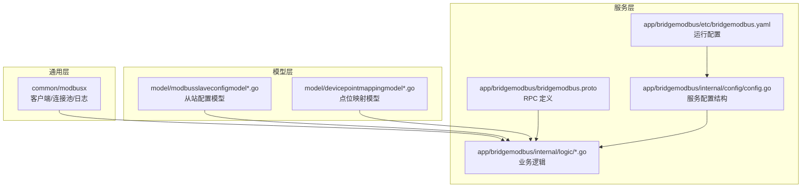
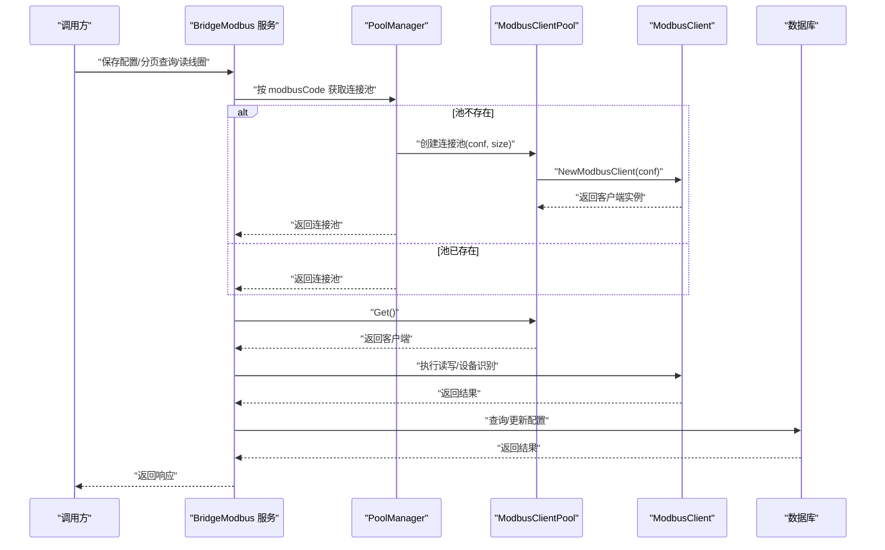
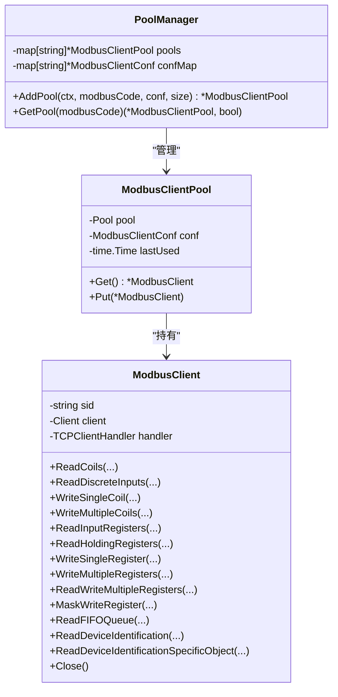
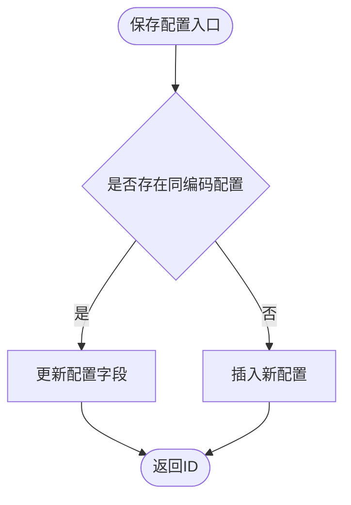
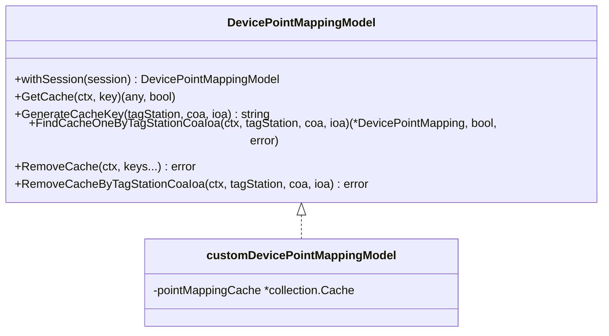
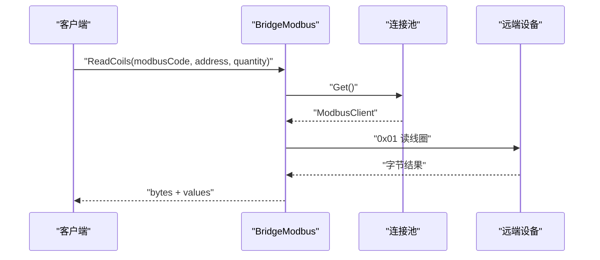
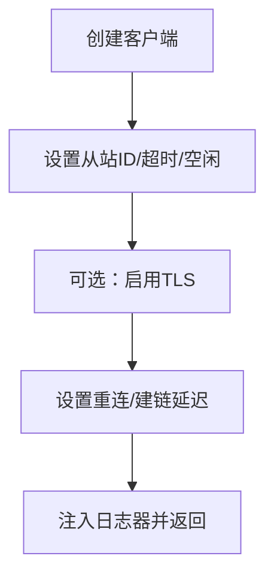
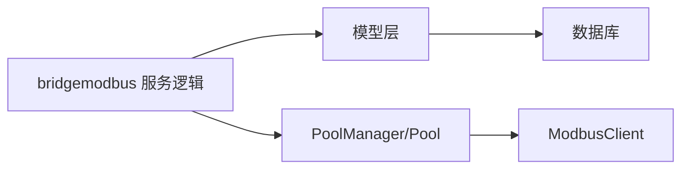

# 设备管理与连接

<cite>
**本文引用的文件**
- [common/modbusx/client.go](file://common/modbusx/client.go)
- [common/modbusx/config.go](file://common/modbusx/config.go)
- [model/modbusslaveconfigmodel.go](file://model/modbusslaveconfigmodel.go)
- [model/modbusslaveconfigmodel_gen.go](file://model/modbusslaveconfigmodel_gen.go)
- [model/devicepointmappingmodel.go](file://model/devicepointmappingmodel.go)
- [model/devicepointmappingmodel_gen.go](file://model/devicepointmappingmodel_gen.go)
- [app/bridgemodbus/bridgemodbus.proto](file://app/bridgemodbus/bridgemodbus.proto)
- [app/bridgemodbus/etc/bridgemodbus.yaml](file://app/bridgemodbus/etc/bridgemodbus.yaml)
- [app/bridgemodbus/internal/config/config.go](file://app/bridgemodbus/internal/config/config.go)
- [app/bridgemodbus/internal/logic/saveconfiglogic.go](file://app/bridgemodbus/internal/logic/saveconfiglogic.go)
- [app/bridgemodbus/internal/logic/readcoilslogic.go](file://app/bridgemodbus/internal/logic/readcoilslogic.go)
- [app/bridgemodbus/internal/logic/pagelistconfiglogic.go](file://app/bridgemodbus/internal/logic/pagelistconfiglogic.go)
</cite>

## 目录
1. [简介](#简介)
2. [项目结构](#项目结构)
3. [核心组件](#核心组件)
4. [架构总览](#架构总览)
5. [详细组件分析](#详细组件分析)
6. [依赖分析](#依赖分析)
7. [性能考虑](#性能考虑)
8. [故障排查指南](#故障排查指南)
9. [结论](#结论)
10. [附录](#附录)

## 简介
本技术文档围绕 Modbus 设备管理与连接展开，覆盖设备配置模型、连接池与会话管理、点位映射与缓存、批量配置与动态更新、状态监控与异常恢复、以及性能优化与最佳实践。文档以仓库中的实际实现为依据，结合协议定义与服务逻辑，帮助读者快速理解并高效运维 Modbus 设备接入能力。

## 项目结构
本项目采用模块化组织方式，Modbus 相关能力主要分布在以下位置：
- 通用 Modbus 客户端与连接池：common/modbusx
- 数据模型与数据库访问：model（含生成的模型文件）
- RPC 服务与协议：app/bridgemodbus（proto、etc、internal）
- 应用配置：app/bridgemodbus/etc/bridgemodbus.yaml
- 服务配置结构：app/bridgemodbus/internal/config/config.go

**图表来源**
- [common/modbusx/client.go:1-218](file://common/modbusx/client.go#L1-L218)
- [model/modbusslaveconfigmodel.go:1-32](file://model/modbusslaveconfigmodel.go#L1-L32)
- [model/devicepointmappingmodel.go:1-108](file://model/devicepointmappingmodel.go#L1-L108)
- [app/bridgemodbus/bridgemodbus.proto:1-355](file://app/bridgemodbus/bridgemodbus.proto#L1-L355)
- [app/bridgemodbus/etc/bridgemodbus.yaml:1-26](file://app/bridgemodbus/etc/bridgemodbus.yaml#L1-L26)
- [app/bridgemodbus/internal/config/config.go:1-26](file://app/bridgemodbus/internal/config/config.go#L1-L26)

**章节来源**
- [app/bridgemodbus/etc/bridgemodbus.yaml:1-26](file://app/bridgemodbus/etc/bridgemodbus.yaml#L1-L26)
- [app/bridgemodbus/internal/config/config.go:1-26](file://app/bridgemodbus/internal/config/config.go#L1-L26)

## 核心组件
- Modbus 客户端与连接池：封装底层 modbus.Client，提供连接复用、超时与重连参数、TLS 支持、日志增强。
- 配置模型：持久化存储从站配置，支持分页查询、按编码查询、启用/禁用状态管理。
- 点位映射模型：设备点位与 TDengine 标识的映射，带缓存与键生成策略。
- RPC 服务：基于 proto 定义的桥接服务，覆盖配置管理、线圈/寄存器读写、设备识别、批量十进制转寄存器等。
- 服务配置：统一承载 Modbus 客户端默认配置、连接池大小、数据库连接、Nacos 注册等。

**章节来源**
- [common/modbusx/client.go:106-143](file://common/modbusx/client.go#L106-L143)
- [common/modbusx/config.go:32-61](file://common/modbusx/config.go#L32-L61)
- [model/modbusslaveconfigmodel_gen.go:59-80](file://model/modbusslaveconfigmodel_gen.go#L59-L80)
- [model/devicepointmappingmodel.go:39-52](file://model/devicepointmappingmodel.go#L39-L52)
- [app/bridgemodbus/bridgemodbus.proto:9-83](file://app/bridgemodbus/bridgemodbus.proto#L9-L83)
- [app/bridgemodbus/internal/config/config.go:9-25](file://app/bridgemodbus/internal/config/config.go#L9-L25)

## 架构总览
下图展示从站配置、连接池、RPC 服务与业务逻辑之间的交互关系：

**图表来源**
- [common/modbusx/config.go:78-124](file://common/modbusx/config.go#L78-L124)
- [common/modbusx/client.go:145-191](file://common/modbusx/client.go#L145-L191)
- [app/bridgemodbus/internal/logic/saveconfiglogic.go:27-61](file://app/bridgemodbus/internal/logic/saveconfiglogic.go#L27-L61)
- [app/bridgemodbus/internal/logic/readcoilslogic.go:26-43](file://app/bridgemodbus/internal/logic/readcoilslogic.go#L26-L43)
- [model/modbusslaveconfigmodel_gen.go:131-150](file://model/modbusslaveconfigmodel_gen.go#L131-L150)

## 详细组件分析

### Modbus 客户端与连接池
- 客户端封装：对外暴露标准读写方法，内部委托底层 modbus.Client，并支持 TLS、超时、空闲、重连、建链延迟等参数注入。
- 连接池：基于 syncx.Pool 实现，支持池大小、最大空闲时间、归还/获取、关闭回调。
- 日志增强：自定义 ModbusLogger，统一输出上下文字段（地址、地址 MD5、会话 ID）并区分错误级别。

**图表来源**
- [common/modbusx/client.go:20-97](file://common/modbusx/client.go#L20-L97)
- [common/modbusx/client.go:145-191](file://common/modbusx/client.go#L145-L191)
- [common/modbusx/config.go:63-124](file://common/modbusx/config.go#L63-L124)

**章节来源**
- [common/modbusx/client.go:106-143](file://common/modbusx/client.go#L106-L143)
- [common/modbusx/client.go:193-217](file://common/modbusx/client.go#L193-L217)
- [common/modbusx/config.go:78-107](file://common/modbusx/config.go#L78-L107)

### 配置模型与动态更新
- 数据模型：ModbusSlaveConfig 结构体映射数据库表字段，包含地址、从站 ID、超时、空闲、重连、TLS 开关及证书路径、状态、备注等。
- 业务逻辑：保存配置支持“新增或更新”，分页查询支持关键词与状态过滤，均通过 SQL Builder 组合查询。
- 动态更新：通过 PoolManager.AddPool 为同一 modbusCode 注册连接池，若已存在则复用并记录告警，避免资源泄漏。

**图表来源**
- [app/bridgemodbus/internal/logic/saveconfiglogic.go:27-61](file://app/bridgemodbus/internal/logic/saveconfiglogic.go#L27-L61)
- [model/modbusslaveconfigmodel_gen.go:131-150](file://model/modbusslaveconfigmodel_gen.go#L131-L150)

**章节来源**
- [model/modbusslaveconfigmodel_gen.go:59-80](file://model/modbusslaveconfigmodel_gen.go#L59-L80)
- [app/bridgemodbus/internal/logic/saveconfiglogic.go:27-61](file://app/bridgemodbus/internal/logic/saveconfiglogic.go#L27-L61)
- [app/bridgemodbus/internal/logic/pagelistconfiglogic.go:29-52](file://app/bridgemodbus/internal/logic/pagelistconfiglogic.go#L29-L52)
- [common/modbusx/config.go:78-107](file://common/modbusx/config.go#L78-L107)

### 点位映射模型与缓存
- 映射结构：DevicePointMapping 用于将设备点位与 TDengine 标识（tag_station、coa、ioa）关联，并支持推送与原始数据插入开关。
- 缓存策略：基于内存缓存实现键值缓存，提供按 key 查询、按 tag_station+coa+ioa 组合生成键、批量删除等操作。
- 使用场景：在读取寄存器或线圈后，结合映射进行数据解析与投递。

**图表来源**
- [model/devicepointmappingmodel.go:17-52](file://model/devicepointmappingmodel.go#L17-L52)
- [model/devicepointmappingmodel_gen.go:59-83](file://model/devicepointmappingmodel_gen.go#L59-L83)

**章节来源**
- [model/devicepointmappingmodel.go:39-107](file://model/devicepointmappingmodel.go#L39-L107)
- [model/devicepointmappingmodel_gen.go:134-153](file://model/devicepointmappingmodel_gen.go#L134-L153)

### RPC 服务与协议要点
- 服务接口：覆盖配置管理（保存、删除、分页、按编码查询、批量查询）、线圈/离散输入、寄存器读写、设备识别、批量十进制转寄存器等。
- 请求/响应：请求包含 modbusCode 作为路由键，便于选择对应连接池；响应包含原始字节与多语言视图（无符号/有符号整数、十六进制、二进制）。
- 设备识别：支持读取全部对象 ID 与特定对象 ID，返回原始映射、十六进制映射与语义化映射。

**图表来源**
- [app/bridgemodbus/bridgemodbus.proto:150-194](file://app/bridgemodbus/bridgemodbus.proto#L150-L194)
- [app/bridgemodbus/internal/logic/readcoilslogic.go:26-43](file://app/bridgemodbus/internal/logic/readcoilslogic.go#L26-L43)

**章节来源**
- [app/bridgemodbus/bridgemodbus.proto:9-83](file://app/bridgemodbus/bridgemodbus.proto#L9-L83)
- [app/bridgemodbus/bridgemodbus.proto:150-355](file://app/bridgemodbus/bridgemodbus.proto#L150-L355)

### 连接建立、心跳与断线重连
- 连接建立：NewModbusClient 根据配置创建 TCPClientHandler，设置从站 ID、超时、空闲、重连、建链延迟与 TLS 参数，生成会话 ID 并注入自定义日志器。
- 断线重连：通过 LinkRecoveryTimeout 与 ProtocolRecoveryTimeout 控制链路与协议异常的恢复节奏。
- 心跳策略：当前实现未内置专用心跳任务，建议在上层业务按需周期性发起读取类请求作为轻量心跳。

**图表来源**
- [common/modbusx/client.go:106-143](file://common/modbusx/client.go#L106-L143)

**章节来源**
- [common/modbusx/client.go:106-143](file://common/modbusx/client.go#L106-L143)
- [common/modbusx/config.go:32-61](file://common/modbusx/config.go#L32-L61)

### 设备点位映射关系与批量配置
- 点位映射：通过 tag_station、coa、ioa 三元组定位 TDengine 表与列，结合 EnablePush/EnableRawInsert 控制数据流转。
- 批量配置：通过 BatchGetConfigByCode 与 SaveConfig 批量读取与保存配置，配合连接池按 modbusCode 路由到不同设备链路。
- 动态更新：PoolManager.GetPool 在并发下读取已有连接池，AddPool 在重复注册时复用并记录日志，避免重复创建。

**章节来源**
- [model/devicepointmappingmodel.go:70-107](file://model/devicepointmappingmodel.go#L70-L107)
- [app/bridgemodbus/bridgemodbus.proto:142-148](file://app/bridgemodbus/bridgemodbus.proto#L142-L148)
- [app/bridgemodbus/internal/logic/saveconfiglogic.go:27-61](file://app/bridgemodbus/internal/logic/saveconfiglogic.go#L27-L61)
- [common/modbusx/config.go:109-124](file://common/modbusx/config.go#L109-L124)

### 设备状态监控、异常处理与错误恢复
- 状态监控：配置模型包含 status 字段（启用/禁用），服务侧可通过分页查询按状态过滤；连接池层面记录创建/关闭日志。
- 异常处理：ModbusLogger 将错误信息以 Error 级别输出，便于集中检索；业务逻辑在获取连接池失败、查询不到配置等场景返回错误。
- 错误恢复：连接池与客户端具备超时与重连参数，建议在上层业务中对瞬时错误进行指数退避重试。

**章节来源**
- [model/modbusslaveconfigmodel_gen.go:78-79](file://model/modbusslaveconfigmodel_gen.go#L78-L79)
- [common/modbusx/client.go:193-217](file://common/modbusx/client.go#L193-L217)
- [app/bridgemodbus/internal/logic/pagelistconfiglogic.go:37-41](file://app/bridgemodbus/internal/logic/pagelistconfiglogic.go#L37-L41)

## 依赖分析
- 低耦合：通用层（modbusx）与服务层（bridgemodbus）通过接口与模型解耦，便于替换底层实现。
- 数据依赖：服务逻辑依赖模型层提供的 CRUD 与分页查询能力；连接池依赖通用层客户端。
- 外部依赖：使用 go-zero 生态（logx、sqlx、squirrel）与第三方 modbus 库。

**图表来源**
- [app/bridgemodbus/internal/logic/readcoilslogic.go:26-43](file://app/bridgemodbus/internal/logic/readcoilslogic.go#L26-L43)
- [common/modbusx/config.go:78-124](file://common/modbusx/config.go#L78-L124)
- [model/modbusslaveconfigmodel_gen.go:131-150](file://model/modbusslaveconfigmodel_gen.go#L131-L150)

**章节来源**
- [app/bridgemodbus/internal/logic/readcoilslogic.go:26-43](file://app/bridgemodbus/internal/logic/readcoilslogic.go#L26-L43)
- [common/modbusx/config.go:78-124](file://common/modbusx/config.go#L78-L124)
- [model/modbusslaveconfigmodel_gen.go:131-150](file://model/modbusslaveconfigmodel_gen.go#L131-L150)

## 性能考虑
- 连接池大小：根据并发请求数与设备链路数量设置合理池大小，避免频繁创建/销毁。
- 超时参数：根据网络状况与设备响应时间调整 Timeout、IdleTimeout、LinkRecoveryTimeout、ProtocolRecoveryTimeout。
- 建链延迟：ConnectDelay 可降低刚建链即发送请求导致的握手竞争风险。
- 缓存命中：点位映射缓存可显著降低数据库压力，建议结合失效策略与批量删除接口进行维护。
- 批量操作：优先使用批量读写接口减少往返次数。

[本节为通用指导，无需列出具体文件来源]

## 故障排查指南
- 无法获取连接池：检查 modbusCode 是否正确、是否已通过 AddPool 注册、是否被禁用（status=2）。
- 读写失败：查看 ModbusLogger 输出的错误日志，确认地址、从站 ID、数量范围是否符合规范。
- TLS 握手失败：核对证书/密钥/CA 文件路径与权限，确保 EnableTls 与配置一致。
- 配置未生效：确认 SaveConfig 是否成功更新，分页查询时 status 是否为启用状态。
- 点位映射缺失：检查缓存键生成规则与缓存命中情况，必要时清空缓存后重试。

**章节来源**
- [common/modbusx/client.go:193-217](file://common/modbusx/client.go#L193-L217)
- [app/bridgemodbus/internal/logic/saveconfiglogic.go:27-61](file://app/bridgemodbus/internal/logic/saveconfiglogic.go#L27-L61)
- [model/modbusslaveconfigmodel_gen.go:78-79](file://model/modbusslaveconfigmodel_gen.go#L78-L79)
- [model/devicepointmappingmodel.go:70-107](file://model/devicepointmappingmodel.go#L70-L107)

## 结论
本方案通过“配置模型 + 连接池 + RPC 服务 + 点位映射缓存”的组合，实现了对多台 Modbus 设备的稳定接入与高效管理。建议在生产环境中结合业务并发与设备特性，合理配置连接池与超时参数，并利用缓存与批量接口提升吞吐与稳定性。

[本节为总结性内容，无需列出具体文件来源]

## 附录

### 设备配置模板（字段定义、数据类型与约束）
- 通用配置（来自 ModbusClientConf）
  - address: 字符串，格式 IP:Port
  - slave: 整型，默认 1
  - timeout: 整型，单位毫秒，默认 10000
  - idleTimeout: 整型，单位毫秒，默认 60000
  - linkRecoveryTimeout: 整型，单位毫秒，默认 3000
  - protocolRecoveryTimeout: 整型，单位毫秒，默认 2000
  - connectDelay: 整型，单位毫秒，默认 100
  - tls.enable: 布尔，是否启用 TLS
  - tls.certFile/keyFile/caFile: 字符串，证书/密钥/CA 文件路径（启用时必填）

- 从站配置（来自 ModbusSlaveConfig）
  - modbus_code: 字符串，唯一编码
  - slave_address: 字符串，格式 IP:Port
  - slave: 整型，从站地址
  - timeout/idle_timeout/link_recovery_timeout/protocol_recovery_timeout/connect_delay: 整型，单位毫秒
  - enable_tls: 整型，0/1
  - tls_cert_file/tls_key_file/tls_ca_file: 字符串（启用时有效）
  - status: 整型，1=启用，2=禁用
  - remark: 字符串，备注

- 点位映射（来自 DevicePointMapping）
  - tag_station/coa/ioa: 字符串/整型，TDengine 标识
  - device_id/device_name: 字符串，设备编号与名称
  - td_table_type: 字符串，表类型（逗号分隔）
  - enable_push/enable_raw_insert: 整型，0/1
  - description/ext1-ext5: 字符串，扩展字段

**章节来源**
- [common/modbusx/config.go:32-61](file://common/modbusx/config.go#L32-L61)
- [model/modbusslaveconfigmodel_gen.go:59-80](file://model/modbusslaveconfigmodel_gen.go#L59-L80)
- [model/devicepointmappingmodel_gen.go:59-83](file://model/devicepointmappingmodel_gen.go#L59-L83)

### 连接参数优化建议
- 超时：根据设备响应时间与网络 RTT 设置 timeout 与 idleTimeout，避免过短导致频繁超时。
- 重连：linkRecoveryTimeout 与 protocolRecoveryTimeout 建议设置为 2–5 秒级，避免过于频繁重试造成设备压力。
- 建链延迟：connectDelay 用于规避握手竞争，通常 100–500ms 即可。
- TLS：仅在需要加密传输时启用，注意证书链完整与权限正确。

**章节来源**
- [common/modbusx/client.go:106-143](file://common/modbusx/client.go#L106-L143)
- [common/modbusx/config.go:32-61](file://common/modbusx/config.go#L32-L61)

### 性能监控指标
- 连接池指标：活跃连接数、空闲连接数、获取耗时、归还耗时、最大空闲时间。
- 业务指标：读写 QPS、成功率、P95/P99 延迟、错误分布（超时/协议/网络）。
- 缓存指标：点位映射缓存命中率、淘汰率、平均 TTL。
- 设备指标：设备在线率、设备读写成功率、设备异常事件数。

**章节来源**
- [common/modbusx/client.go:145-191](file://common/modbusx/client.go#L145-L191)
- [model/devicepointmappingmodel.go:39-52](file://model/devicepointmappingmodel.go#L39-L52)

### 最佳实践
- 为不同设备或网段分配独立 modbusCode，便于连接池隔离与容量规划。
- 使用分页查询与状态过滤，避免一次性加载过多配置。
- 对高频读取的点位映射开启缓存，并在配置变更时主动清理缓存。
- 对瞬时错误采用指数退避重试，避免雪崩效应。
- 启用 TLS 时严格校验证书链与权限，定期轮换证书。

**章节来源**
- [app/bridgemodbus/internal/logic/pagelistconfiglogic.go:29-52](file://app/bridgemodbus/internal/logic/pagelistconfiglogic.go#L29-L52)
- [model/devicepointmappingmodel.go:54-107](file://model/devicepointmappingmodel.go#L54-L107)
- [common/modbusx/client.go:106-143](file://common/modbusx/client.go#L106-L143)