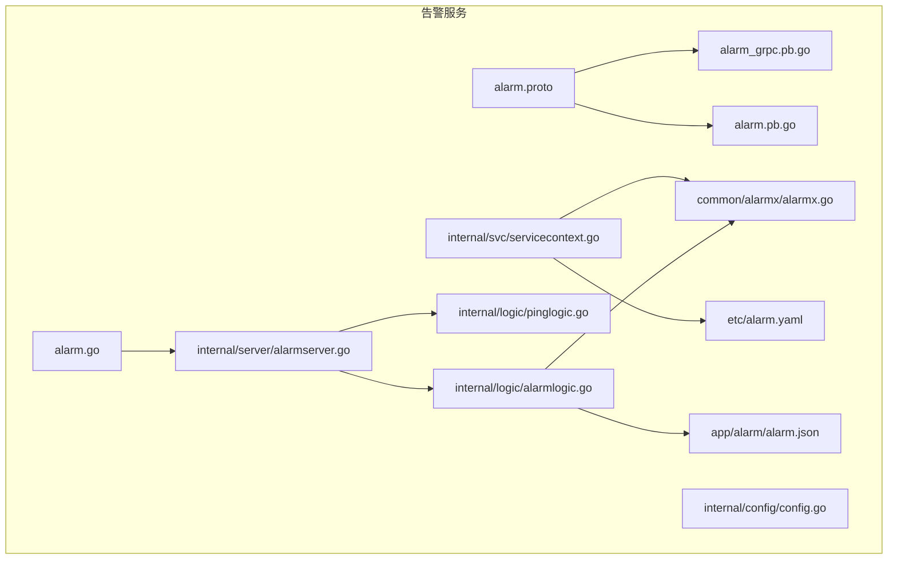
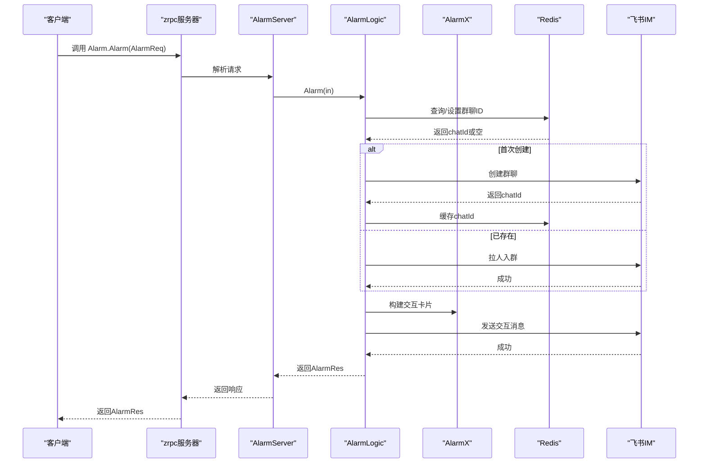
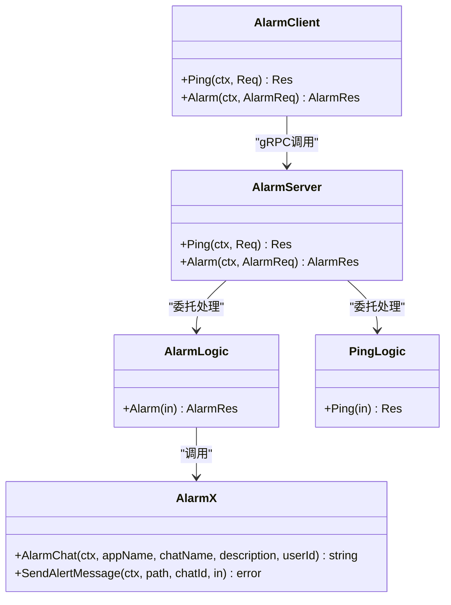
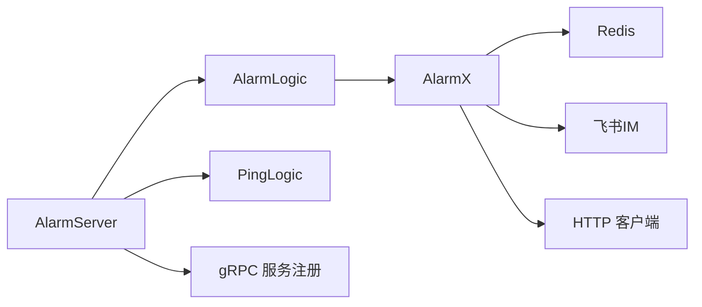
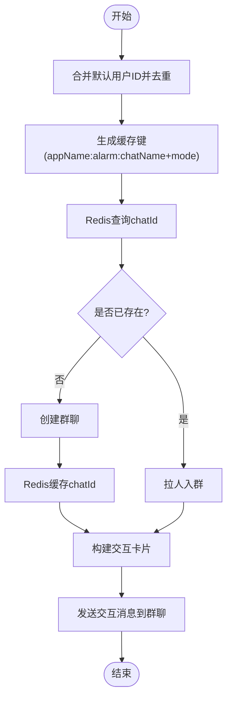

# 告警API接口

<cite>
**本文引用的文件列表**
- [alarm.proto](file://app/alarm/alarm.proto)
- [alarm_grpc.pb.go](file://app/alarm/alarm/alarm_grpc.pb.go)
- [alarm.pb.go](file://app/alarm/alarm/alarm.pb.go)
- [alarm.go](file://app/alarm/alarm.go)
- [alarmserver.go](file://app/alarm/internal/server/alarmserver.go)
- [alarmlogic.go](file://app/alarm/internal/logic/alarmlogic.go)
- [pinglogic.go](file://app/alarm/internal/logic/pinglogic.go)
- [servicecontext.go](file://app/alarm/internal/svc/servicecontext.go)
- [config.go](file://app/alarm/internal/config/config.go)
- [alarm.yaml](file://app/alarm/etc/alarm.yaml)
- [alarmx.go](file://common/alarmx/alarmx.go)
- [alarm.json](file://app/alarm/alarm.json)
</cite>

## 目录
1. [简介](#简介)
2. [项目结构](#项目结构)
3. [核心组件](#核心组件)
4. [架构总览](#架构总览)
5. [详细组件分析](#详细组件分析)
6. [依赖关系分析](#依赖关系分析)
7. [性能与可用性](#性能与可用性)
8. [故障排查指南](#故障排查指南)
9. [结论](#结论)
10. [附录](#附录)

## 简介
本文件为“告警API接口”的完整参考文档，基于仓库中的告警子系统实现，覆盖以下内容：
- 所有gRPC接口的方法签名、参数定义与返回值格式
- 告警创建、查询、更新、删除的API流程说明
- 告警状态管理、历史查询与统计分析接口规范
- 分页查询、过滤条件与排序规则的使用方法
- 请求示例、响应格式与错误码说明
- 认证授权、权限控制与安全考虑
- API版本管理、向后兼容性与迁移指南

注意：当前仓库实现仅包含两个gRPC方法（Ping、Alarm），未提供查询、更新、删除等扩展接口。本文在“概念性概述”部分对扩展能力进行说明，以便后续演进时遵循统一规范。

## 项目结构
告警子系统采用 go-zero 的标准目录组织方式，关键文件如下：
- 接口定义：alarm.proto
- 生成代码：alarm_grpc.pb.go、alarm.pb.go
- 服务端入口：alarm.go
- 服务端实现：internal/server/alarmserver.go
- 业务逻辑：internal/logic/alarmlogic.go、internal/logic/pinglogic.go
- 服务上下文：internal/svc/servicecontext.go
- 配置：internal/config/config.go、etc/alarm.yaml
- 通用告警工具：common/alarmx/alarmx.go
- 交互卡片模板：app/alarm/alarm.json

图表来源
- [alarm.proto:1-34](file://app/alarm/alarm.proto#L1-L34)
- [alarm_grpc.pb.go:1-159](file://app/alarm/alarm/alarm_grpc.pb.go#L1-L159)
- [alarm.pb.go:1-346](file://app/alarm/alarm/alarm.pb.go#L1-L346)
- [alarm.go:1-44](file://app/alarm/alarm.go#L1-L44)
- [alarmserver.go:1-35](file://app/alarm/internal/server/alarmserver.go#L1-L35)
- [alarmlogic.go:1-184](file://app/alarm/internal/logic/alarmlogic.go#L1-L184)
- [pinglogic.go:1-31](file://app/alarm/internal/logic/pinglogic.go#L1-L31)
- [servicecontext.go:1-33](file://app/alarm/internal/svc/servicecontext.go#L1-L33)
- [config.go:1-16](file://app/alarm/internal/config/config.go#L1-L16)
- [alarm.yaml:1-26](file://app/alarm/etc/alarm.yaml#L1-L26)
- [alarmx.go:1-223](file://common/alarmx/alarmx.go#L1-L223)
- [alarm.json:1-75](file://app/alarm/alarm.json#L1-L75)

章节来源
- [alarm.proto:1-34](file://app/alarm/alarm.proto#L1-L34)
- [alarm.go:1-44](file://app/alarm/alarm.go#L1-L44)
- [alarmserver.go:1-35](file://app/alarm/internal/server/alarmserver.go#L1-L35)
- [alarmlogic.go:1-184](file://app/alarm/internal/logic/alarmlogic.go#L1-L184)
- [pinglogic.go:1-31](file://app/alarm/internal/logic/pinglogic.go#L1-L31)
- [servicecontext.go:1-33](file://app/alarm/internal/svc/servicecontext.go#L1-L33)
- [config.go:1-16](file://app/alarm/internal/config/config.go#L1-L16)
- [alarm.yaml:1-26](file://app/alarm/etc/alarm.yaml#L1-L26)
- [alarmx.go:1-223](file://common/alarmx/alarmx.go#L1-L223)
- [alarm.json:1-75](file://app/alarm/alarm.json#L1-L75)

## 核心组件
- gRPC服务：Alarm
  - 方法：Ping、Alarm
- 数据模型：
  - Req/Res：用于健康检查
  - AlarmReq/AlarmRes：告警请求/响应
- 服务端实现：AlarmServer
- 业务逻辑：AlarmLogic、PingLogic
- 服务上下文：ServiceContext（注入 Redis、AlarmX、HTTP 客户端）
- 通用告警工具：AlarmX（封装飞书IM、卡片构建、缓存）
- 配置：RpcServerConf、Alarmx配置项

章节来源
- [alarm_grpc.pb.go:26-69](file://app/alarm/alarm/alarm_grpc.pb.go#L26-L69)
- [alarm.pb.go:24-232](file://app/alarm/alarm/alarm.pb.go#L24-L232)
- [alarmserver.go:15-34](file://app/alarm/internal/server/alarmserver.go#L15-L34)
- [alarmlogic.go:17-63](file://app/alarm/internal/logic/alarmlogic.go#L17-L63)
- [pinglogic.go:12-30](file://app/alarm/internal/logic/pinglogic.go#L12-L30)
- [servicecontext.go:13-31](file://app/alarm/internal/svc/servicecontext.go#L13-L31)
- [alarmx.go:29-160](file://common/alarmx/alarmx.go#L29-L160)
- [config.go:5-14](file://app/alarm/internal/config/config.go#L5-L14)

## 架构总览
告警服务通过 gRPC 提供接口，内部使用 AlarmX 封装飞书IM能力，结合 Redis 缓存群聊ID，并通过 JSON 模板渲染交互卡片。

图表来源
- [alarmserver.go:31-33](file://app/alarm/internal/server/alarmserver.go#L31-L33)
- [alarmlogic.go:31-62](file://app/alarm/internal/logic/alarmlogic.go#L31-L62)
- [alarmx.go:53-140](file://common/alarmx/alarmx.go#L53-L140)
- [alarm_grpc.pb.go:105-139](file://app/alarm/alarm/alarm_grpc.pb.go#L105-L139)

## 详细组件分析

### gRPC接口定义与调用流程
- 服务名：alarm.Alarm
- 方法：
  - Ping(Req) -> Res
  - Alarm(AlarmReq) -> AlarmRes

图表来源
- [alarm_grpc.pb.go:29-69](file://app/alarm/alarm/alarm_grpc.pb.go#L29-L69)
- [alarmserver.go:26-34](file://app/alarm/internal/server/alarmserver.go#L26-L34)
- [alarmlogic.go:31-62](file://app/alarm/internal/logic/alarmlogic.go#L31-L62)
- [pinglogic.go:26-30](file://app/alarm/internal/logic/pinglogic.go#L26-L30)
- [alarmx.go:29-51](file://common/alarmx/alarmx.go#L29-L51)

章节来源
- [alarm.proto:30-33](file://app/alarm/alarm.proto#L30-L33)
- [alarm_grpc.pb.go:21-24](file://app/alarm/alarm/alarm_grpc.pb.go#L21-L24)
- [alarm_grpc.pb.go:144-159](file://app/alarm/alarm/alarm_grpc.pb.go#L144-L159)

### 方法一：Ping（健康检查）
- 方法签名：Ping(Req) -> Res
- 请求体 Req
  - 字段：ping(string)
- 响应体 Res
  - 字段：pong(string)
- 行为：返回固定的“pong”，用于健康检查

章节来源
- [alarm.proto:6-12](file://app/alarm/alarm.proto#L6-L12)
- [alarm_grpc.pb.go:29-32](file://app/alarm/alarm/alarm_grpc.pb.go#L29-L32)
- [pinglogic.go:26-30](file://app/alarm/internal/logic/pinglogic.go#L26-L30)

### 方法二：Alarm（告警上报）
- 方法签名：Alarm(AlarmReq) -> AlarmRes
- 请求体 AlarmReq
  - chatName(string)：群聊名称前缀，最终会附加运行模式后缀
  - description(string)：群描述
  - title(string)：告警标题
  - project(string)：项目名称
  - dateTime(string)：告警时间
  - alarmId(string)：唯一告警ID
  - content(string)：告警内容
  - error(string)：错误信息
  - userId([]string)：告警接收人用户ID列表
  - ip(string)：告警来源IP
- 响应体 AlarmRes
  - 无字段（空消息）

处理流程：
1. 合并默认用户ID并去重
2. 根据应用名+聊天名+模式生成缓存键，查询Redis获取chatId
3. 若不存在则创建群聊并写入Redis缓存；若存在则拉人入群
4. 使用模板构建交互卡片并发送到群聊
5. 返回成功

章节来源
- [alarm.proto:14-28](file://app/alarm/alarm.proto#L14-L28)
- [alarm_grpc.pb.go:31-32](file://app/alarm/alarm/alarm_grpc.pb.go#L31-L32)
- [alarmlogic.go:31-62](file://app/alarm/internal/logic/alarmlogic.go#L31-L62)
- [alarmx.go:53-140](file://common/alarmx/alarmx.go#L53-L140)
- [alarm.json:1-75](file://app/alarm/alarm.json#L1-L75)

### 服务端与路由
- 服务端入口：alarm.go
  - 加载配置 alarm.yaml
  - 初始化 ServiceContext（Redis、AlarmX、HTTP 客户端）
  - 注册 AlarmServer 到 zrpc 服务器
  - 开启反射（开发/测试模式）
- 服务端实现：AlarmServer
  - 将 Ping 映射到 PingLogic
  - 将 Alarm 映射到 AlarmLogic

章节来源
- [alarm.go:21-42](file://app/alarm/alarm.go#L21-L42)
- [alarmserver.go:15-34](file://app/alarm/internal/server/alarmserver.go#L15-L34)
- [servicecontext.go:20-31](file://app/alarm/internal/svc/servicecontext.go#L20-L31)
- [alarm.yaml:1-26](file://app/alarm/etc/alarm.yaml#L1-L26)

### 通用告警工具 AlarmX
- 功能
  - 群聊创建与成员管理
  - 交互卡片构建与消息发送
  - Redis 缓存群聊ID
- 关键方法
  - AlarmChat(ctx, appName, chatName, description, userId) -> string
  - SendAlertMessage(ctx, path, chatId, in) -> error
  - CreateAlertChat/UpdateAlertChat/ImChatCreate/ImChatMembersCreate/ImMessageCreate/ImChatUpdate/ImChatGet
- 卡片模板
  - alarm.json：包含标题、时间、事件ID、项目、IP、内容、错误等字段占位符

章节来源
- [alarmx.go:29-160](file://common/alarmx/alarmx.go#L29-L160)
- [alarmx.go:163-185](file://common/alarmx/alarmx.go#L163-L185)
- [alarm.json:1-75](file://app/alarm/alarm.json#L1-L75)

### 配置与环境
- 配置项（Config）
  - 继承 zrpc.RpcServerConf
  - Alarmx 子配置：AppId、AppSecret、EncryptKey、VerificationToken、UserId、Path
- 运行配置（alarm.yaml）
  - Name、ListenOn、Mode
  - Redis、Telemetry（注释）、Alarmx（飞书凭证与默认用户、卡片路径）

章节来源
- [config.go:5-14](file://app/alarm/internal/config/config.go#L5-L14)
- [alarm.yaml:1-26](file://app/alarm/etc/alarm.yaml#L1-L26)

## 依赖关系分析
- AlarmServer 依赖 ServiceContext，后者注入 AlarmX 与 Redis
- AlarmLogic 依赖 AlarmX 与配置（默认用户ID、卡片路径）
- AlarmX 依赖飞书SDK、Redis、HTTP 客户端
- alarm_grpc.pb.go 由 alarm.proto 生成，提供客户端与服务端桩代码

图表来源
- [alarmserver.go:15-34](file://app/alarm/internal/server/alarmserver.go#L15-L34)
- [alarmlogic.go:31-62](file://app/alarm/internal/logic/alarmlogic.go#L31-L62)
- [servicecontext.go:20-31](file://app/alarm/internal/svc/servicecontext.go#L20-L31)
- [alarmx.go:29-51](file://common/alarmx/alarmx.go#L29-L51)

章节来源
- [alarm_grpc.pb.go:94-102](file://app/alarm/alarm/alarm_grpc.pb.go#L94-L102)
- [servicecontext.go:13-31](file://app/alarm/internal/svc/servicecontext.go#L13-L31)

## 性能与可用性
- 连接池与超时
  - 飞书客户端设置请求超时（秒级）
  - HTTP 客户端复用连接
- 缓存策略
  - Redis 缓存群聊ID，减少重复创建
  - 缓存过期时间（天级）
- 并发与稳定性
  - 依赖 go-zero 的并发模型与资源管理
  - 建议在生产环境开启 Telemetry 与日志采样

章节来源
- [servicecontext.go:26-30](file://app/alarm/internal/svc/servicecontext.go#L26-L30)
- [alarmx.go:53-76](file://common/alarmx/alarmx.go#L53-L76)

## 故障排查指南
- 常见错误场景
  - 飞书接口调用失败：检查 AppId/AppSecret/EncryptKey/VerificationToken 是否正确
  - Redis 连接异常：确认主机、端口、密码（如需）
  - 卡片模板读取失败：确认 Path 指向的 JSON 文件存在且可读
  - 用户ID为空：确保 userId 或默认配置不为空
- 日志与调试
  - 开发/测试模式下启用 gRPC 反射，便于本地调试
  - 查看服务端日志输出，定位具体步骤（创建群、拉人、发消息）
- 建议
  - 对外暴露 Ping 接口用于健康检查
  - 对 Alarm 接口增加幂等性设计（例如基于 alarmId 去重）

章节来源
- [alarm.yaml:1-26](file://app/alarm/etc/alarm.yaml#L1-L26)
- [alarm.go:35-37](file://app/alarm/alarm.go#L35-L37)
- [alarmx.go:89-96](file://common/alarmx/alarmx.go#L89-L96)
- [alarmx.go:109-116](file://common/alarmx/alarmx.go#L109-L116)

## 结论
当前告警API提供基础的健康检查与告警上报能力，通过 AlarmX 与飞书IM集成，实现了告警群聊的自动创建与交互卡片推送。后续可在现有基础上扩展查询、更新、删除等接口，并完善分页、过滤、排序与统计分析能力，同时加强鉴权与审计机制。

## 附录

### API方法清单与规范
- 服务：alarm.Alarm
- 方法：
  - Ping(Req) -> Res
    - 请求体：Req.ping(string)
    - 响应体：Res.pong(string)
  - Alarm(AlarmReq) -> AlarmRes
    - 请求体：AlarmReq（见下节）
    - 响应体：AlarmRes（空）

章节来源
- [alarm.proto:30-33](file://app/alarm/alarm.proto#L30-L33)
- [alarm_grpc.pb.go:29-32](file://app/alarm/alarm/alarm_grpc.pb.go#L29-L32)

### 请求与响应数据模型
- Req/Res
  - Req.ping(string)
  - Res.pong(string)
- AlarmReq
  - chatName(string)
  - description(string)
  - title(string)
  - project(string)
  - dateTime(string)
  - alarmId(string)
  - content(string)
  - error(string)
  - userId([]string)
  - ip(string)
- AlarmRes
  - 无字段

章节来源
- [alarm.pb.go:24-232](file://app/alarm/alarm/alarm.pb.go#L24-L232)

### 告警创建流程（Alarm）

图表来源
- [alarmlogic.go:31-62](file://app/alarm/internal/logic/alarmlogic.go#L31-L62)
- [alarmx.go:53-140](file://common/alarmx/alarmx.go#L53-L140)
- [alarm.json:1-75](file://app/alarm/alarm.json#L1-L75)

### 查询、更新、删除与统计（概念性说明）
- 当前仓库未提供这些接口。建议按以下规范扩展：
  - 查询：支持按 alarmId、时间范围、项目、状态等过滤，支持分页与排序
  - 更新：支持修改告警状态（待处理/处理中/已解决）、关联人员
  - 删除：软删除并保留审计轨迹
  - 统计：按时间、项目、状态聚合统计
- 实现要点：
  - 引入数据库模型与索引
  - 增加鉴权与权限校验
  - 提供 OpenAPI/Swagger 文档
  - 保持向后兼容，新增字段使用可选语义

[本节为概念性说明，不直接分析具体文件]

### 分页、过滤与排序
- 分页：建议在查询接口中提供 page/size 参数
- 过滤：支持 alarmId、时间范围、项目、状态等
- 排序：支持按创建时间、更新时间倒序
- 示例（概念性）：
  - GET /api/v1/alarms?page=1&size=50&from=2025-01-01&to=2025-01-02&project=projA
  - 支持 sort=createTime:desc 或 status:asc

[本节为概念性说明，不直接分析具体文件]

### 请求示例与响应格式
- Ping
  - 请求：{"ping":"ping"}
  - 响应：{"pong":"pong"}
- Alarm
  - 请求：包含 chatName/description/title/project/dateTime/alarmId/content/error/userId/ip
  - 响应：{}

章节来源
- [pinglogic.go:26-30](file://app/alarm/internal/logic/pinglogic.go#L26-L30)
- [alarm.proto:14-28](file://app/alarm/alarm.proto#L14-L28)

### 错误码说明
- gRPC 状态码
  - Unimplemented：未实现的方法
  - Internal：内部错误（网络、序列化、第三方接口异常）
  - InvalidArgument：请求参数非法
- 业务错误
  - 飞书接口返回非成功状态：返回对应错误码与信息
  - Redis 操作失败：返回相应错误
- 建议
  - 统一包装业务错误码与消息
  - 区分可重试与不可重试错误

章节来源
- [alarm_grpc.pb.go:78-83](file://app/alarm/alarm/alarm_grpc.pb.go#L78-L83)
- [alarmx.go:92-96](file://common/alarmx/alarmx.go#L92-L96)
- [alarmx.go:112-116](file://common/alarmx/alarmx.go#L112-L116)

### 认证授权、权限控制与安全
- 当前实现
  - 未内置鉴权中间件
  - 通过配置注入默认用户ID
- 建议
  - 在拦截器中加入 JWT/Token 校验
  - 基于角色/租户维度控制访问
  - 对敏感字段（如 userId、error）进行脱敏输出
  - 限制请求频率与批量操作

章节来源
- [alarm.yaml:18-25](file://app/alarm/etc/alarm.yaml#L18-L25)
- [alarmlogic.go:32-33](file://app/alarm/internal/logic/alarmlogic.go#L32-L33)

### API版本管理、向后兼容与迁移
- 版本策略
  - 采用路径前缀区分版本（/api/v1/...）
  - 保持字段可选，避免破坏性变更
- 迁移指南
  - 新增字段时提供默认值
  - 旧字段废弃时保留但标记弃用
  - 提供迁移脚本与灰度发布策略

[本节为概念性说明，不直接分析具体文件]