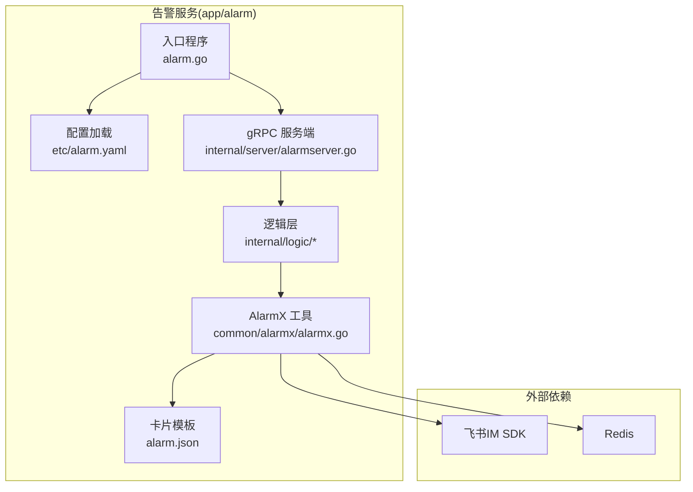
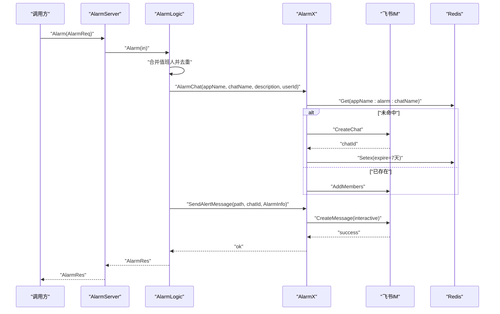
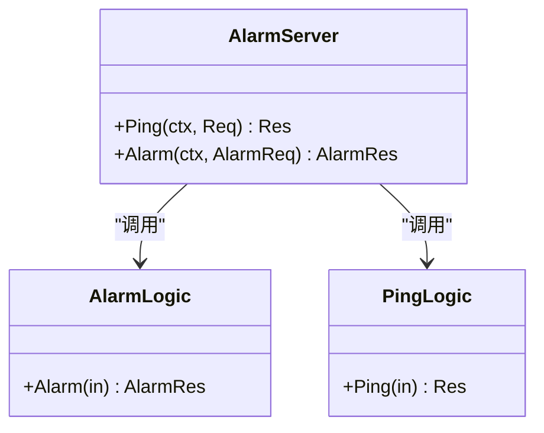
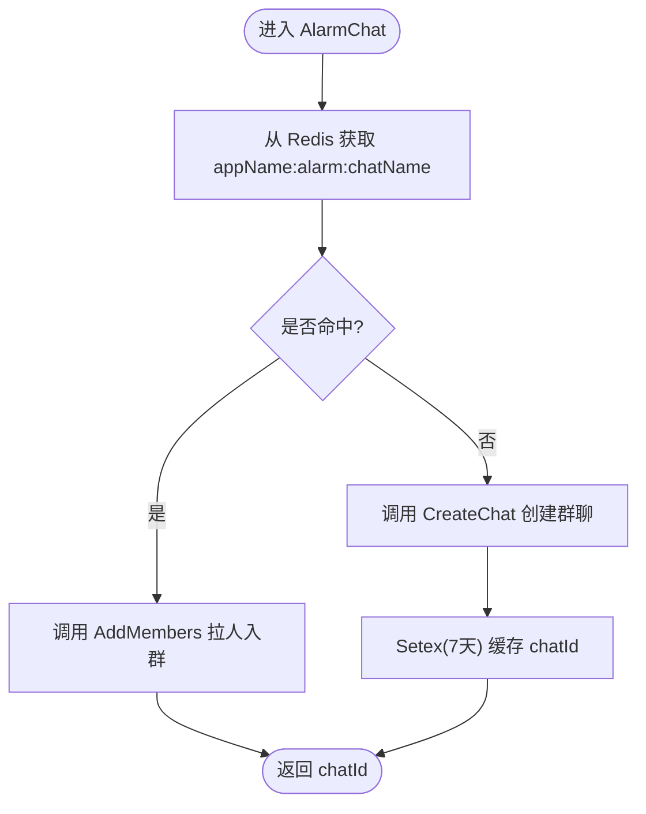
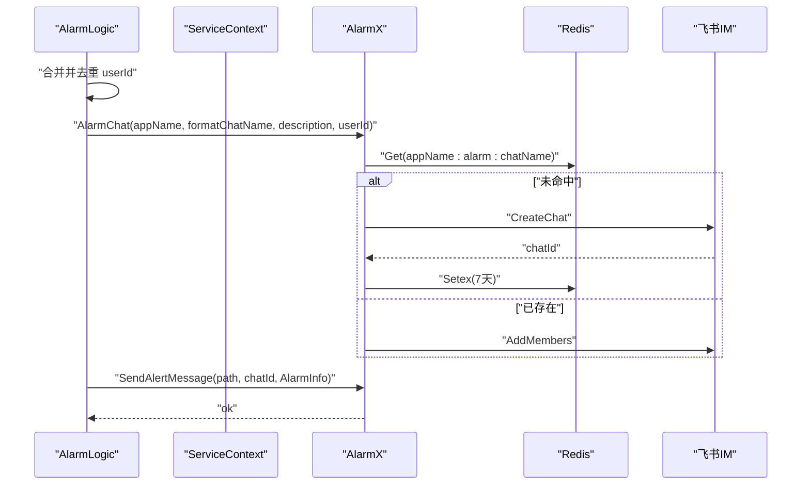
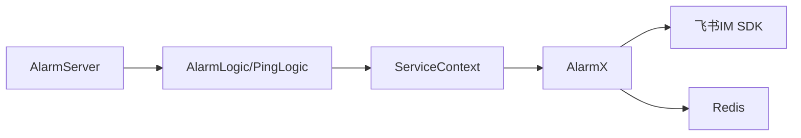
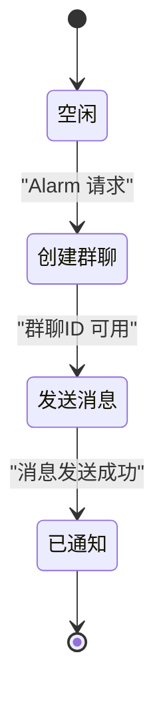

# 告警服务

<cite>
**本文引用的文件**
- [app/alarm/alarm.go](file://app/alarm/alarm.go)
- [app/alarm/etc/alarm.yaml](file://app/alarm/etc/alarm.yaml)
- [app/alarm/alarm.proto](file://app/alarm/alarm.proto)
- [app/alarm/internal/config/config.go](file://app/alarm/internal/config/config.go)
- [app/alarm/internal/svc/servicecontext.go](file://app/alarm/internal/svc/servicecontext.go)
- [app/alarm/internal/server/alarmserver.go](file://app/alarm/internal/server/alarmserver.go)
- [app/alarm/internal/logic/alarmlogic.go](file://app/alarm/internal/logic/alarmlogic.go)
- [app/alarm/internal/logic/pinglogic.go](file://app/alarm/internal/logic/pinglogic.go)
- [common/alarmx/alarmx.go](file://common/alarmx/alarmx.go)
- [app/alarm/alarm.json](file://app/alarm/alarm.json)
- [app/xfusionmock/xfusionmock/xfusionmock.pb.go](file://app/xfusionmock/xfusionmock/xfusionmock.pb.go)
- [app/xfusionmock/xfusionmock/xfusionmock.pb.validate.go](file://app/xfusionmock/xfusionmock/xfusionmock.pb.validate.go)
- [model/kafkamodel.go](file://model/kafkamodel.go)
</cite>

## 目录
1. [简介](#简介)
2. [项目结构](#项目结构)
3. [核心组件](#核心组件)
4. [架构总览](#架构总览)
5. [详细组件分析](#详细组件分析)
6. [依赖分析](#依赖分析)
7. [性能考虑](#性能考虑)
8. [故障排查指南](#故障排查指南)
9. [结论](#结论)
10. [附录](#附录)

## 简介
本告警服务基于 go-zero RPC 框架构建，提供告警推送与交互能力，核心功能包括：
- 接收告警请求并创建或复用飞书告警群聊
- 将告警卡片消息发送至群聊
- 支持值班人自动拉群与去重
- 提供基础健康检查接口
- 为后续扩展告警规则、升级、抑制、历史与统计分析奠定基础

该服务当前以“飞书 IM”作为主要通知渠道，具备卡片模板化渲染能力，并通过 Redis 缓存群聊 ID，减少重复创建开销。

## 项目结构
告警服务位于 app/alarm 目录，采用标准 go-zero 微服务分层：
- 应用入口与配置加载
- gRPC 服务端与逻辑层
- 通用告警工具模块（AlarmX）
- 告警卡片模板

图表来源
- [app/alarm/alarm.go:1-44](file://app/alarm/alarm.go#L1-L44)
- [app/alarm/etc/alarm.yaml:1-26](file://app/alarm/etc/alarm.yaml#L1-L26)
- [app/alarm/internal/server/alarmserver.go:1-35](file://app/alarm/internal/server/alarmserver.go#L1-L35)
- [common/alarmx/alarmx.go:1-223](file://common/alarmx/alarmx.go#L1-L223)

章节来源
- [app/alarm/alarm.go:1-44](file://app/alarm/alarm.go#L1-L44)
- [app/alarm/etc/alarm.yaml:1-26](file://app/alarm/etc/alarm.yaml#L1-L26)
- [app/alarm/internal/server/alarmserver.go:1-35](file://app/alarm/internal/server/alarmserver.go#L1-L35)
- [common/alarmx/alarmx.go:1-223](file://common/alarmx/alarmx.go#L1-L223)

## 核心组件
- gRPC 服务与协议
  - 服务名：Alarm
  - 方法：Ping、Alarm
  - 请求/响应消息：Req、Res、AlarmReq、AlarmRes
- 服务上下文
  - 包含 Redis 客户端、HTTP 客户端、AlarmX 实例
- AlarmX 工具
  - 负责飞书群聊创建/成员拉取、消息发送、卡片渲染
- 逻辑层
  - AlarmLogic：合并配置与请求中的值班人、去重、创建/获取群聊、发送卡片
  - PingLogic：健康检查

章节来源
- [app/alarm/alarm.proto:1-34](file://app/alarm/alarm.proto#L1-L34)
- [app/alarm/internal/config/config.go:1-16](file://app/alarm/internal/config/config.go#L1-L16)
- [app/alarm/internal/svc/servicecontext.go:1-33](file://app/alarm/internal/svc/servicecontext.go#L1-L33)
- [app/alarm/internal/logic/alarmlogic.go:1-184](file://app/alarm/internal/logic/alarmlogic.go#L1-L184)
- [app/alarm/internal/logic/pinglogic.go:1-31](file://app/alarm/internal/logic/pinglogic.go#L1-L31)

## 架构总览
告警服务采用“请求-逻辑-工具-外部系统”的分层设计，关键交互如下：

图表来源
- [app/alarm/internal/server/alarmserver.go:31-34](file://app/alarm/internal/server/alarmserver.go#L31-L34)
- [app/alarm/internal/logic/alarmlogic.go:31-63](file://app/alarm/internal/logic/alarmlogic.go#L31-L63)
- [common/alarmx/alarmx.go:53-140](file://common/alarmx/alarmx.go#L53-L140)

## 详细组件分析

### 组件A：Alarm 服务与协议
- 服务方法
  - Ping：返回固定响应，用于健康检查
  - Alarm：接收告警请求并执行告警流程
- 请求字段
  - chatName、description、title、project、dateTime、alarmId、content、error、userId、ip
- 响应
  - AlarmRes 为空响应体

图表来源
- [app/alarm/internal/server/alarmserver.go:15-35](file://app/alarm/internal/server/alarmserver.go#L15-L35)
- [app/alarm/internal/logic/alarmlogic.go:17-29](file://app/alarm/internal/logic/alarmlogic.go#L17-L29)
- [app/alarm/internal/logic/pinglogic.go:12-24](file://app/alarm/internal/logic/pinglogic.go#L12-L24)

章节来源
- [app/alarm/alarm.proto:30-34](file://app/alarm/alarm.proto#L30-L34)
- [app/alarm/internal/server/alarmserver.go:26-34](file://app/alarm/internal/server/alarmserver.go#L26-L34)

### 组件B：AlarmX 工具与飞书集成
- 功能职责
  - 群聊生命周期管理：创建、成员拉取、缓存
  - 消息发送：interactive 类型卡片消息
  - 卡片渲染：读取模板并替换变量
- 关键流程
  - AlarmChat：优先从 Redis 获取 chatId；不存在则调用飞书创建并写入缓存
  - SendAlertMessage：读取 alarm.json 模板，替换变量后发送
- 外部依赖
  - 飞书 IM Chat/Message API
  - Redis 缓存

图表来源
- [common/alarmx/alarmx.go:53-76](file://common/alarmx/alarmx.go#L53-L76)

章节来源
- [common/alarmx/alarmx.go:29-51](file://common/alarmx/alarmx.go#L29-L51)
- [common/alarmx/alarmx.go:119-140](file://common/alarmx/alarmx.go#L119-L140)
- [app/alarm/alarm.json:1-75](file://app/alarm/alarm.json#L1-L75)

### 组件C：逻辑层 AlarmLogic
- 去重与合并
  - 合并配置中的默认值班人与请求中的 userId，并去重
- 群聊命名
  - 在 chatName 后追加环境后缀，便于区分不同环境
- 卡片发送
  - 使用 alarm.json 模板渲染并发送 interactive 消息
- 回调预留
  - 代码中预留了事件与卡片回调注册点，便于后续扩展

图表来源
- [app/alarm/internal/logic/alarmlogic.go:31-63](file://app/alarm/internal/logic/alarmlogic.go#L31-L63)
- [common/alarmx/alarmx.go:53-140](file://common/alarmx/alarmx.go#L53-L140)

章节来源
- [app/alarm/internal/logic/alarmlogic.go:31-63](file://app/alarm/internal/logic/alarmlogic.go#L31-L63)

### 组件D：配置与服务上下文
- 配置项
  - RpcServerConf：监听地址、模式等
  - Redis：连接参数与键前缀
  - Alarmx：飞书应用凭据、用户 ID 列表、卡片模板路径
- 服务上下文
  - 初始化 httpc、Redis、AlarmX 客户端

章节来源
- [app/alarm/etc/alarm.yaml:1-26](file://app/alarm/etc/alarm.yaml#L1-L26)
- [app/alarm/internal/config/config.go:5-15](file://app/alarm/internal/config/config.go#L5-L15)
- [app/alarm/internal/svc/servicecontext.go:20-32](file://app/alarm/internal/svc/servicecontext.go#L20-L32)

### 组件E：入口程序与启动流程
- 解析命令行参数加载配置
- 打印运行时信息
- 构造 ServiceContext 并注册 Alarm 服务
- 开启反射（开发/测试模式）

章节来源
- [app/alarm/alarm.go:19-43](file://app/alarm/alarm.go#L19-L43)

### 组件F：告警数据模型与规则扩展参考
- 当前告警服务使用 AlarmReq 字段直接驱动通知
- 若需引入“规则引擎”，可参考以下模型字段进行扩展：
  - AlarmData：包含报警等级、类型编码、终端列表、轨迹信息、位置、起止围栏、时间、状态等
  - 该模型可用于后续实现“规则匹配、级别定义、升级与抑制、历史统计”等功能

章节来源
- [app/xfusionmock/xfusionmock/xfusionmock.pb.go:882-904](file://app/xfusionmock/xfusionmock/xfusionmock.pb.go#L882-L904)
- [app/xfusionmock/xfusionmock/xfusionmock.pb.validate.go:676-734](file://app/xfusionmock/xfusionmock/xfusionmock.pb.validate.go#L676-L734)
- [model/kafkamodel.go:60-93](file://model/kafkamodel.go#L60-L93)

## 依赖分析
- 组件耦合
  - AlarmServer 仅依赖 ServiceContext
  - Logic 层依赖 ServiceContext 中的 AlarmX 与配置
  - AlarmX 依赖飞书 SDK 与 Redis
- 外部依赖
  - 飞书 IM：群聊、成员、消息接口
  - Redis：群聊 ID 缓存
  - go-zero：RPC、配置、日志、HTTP 客户端

图表来源
- [app/alarm/internal/server/alarmserver.go:15-35](file://app/alarm/internal/server/alarmserver.go#L15-L35)
- [app/alarm/internal/logic/alarmlogic.go:17-29](file://app/alarm/internal/logic/alarmlogic.go#L17-L29)
- [app/alarm/internal/svc/servicecontext.go:13-32](file://app/alarm/internal/svc/servicecontext.go#L13-L32)
- [common/alarmx/alarmx.go:29-51](file://common/alarmx/alarmx.go#L29-L51)

章节来源
- [app/alarm/internal/server/alarmserver.go:15-35](file://app/alarm/internal/server/alarmserver.go#L15-L35)
- [app/alarm/internal/logic/alarmlogic.go:17-29](file://app/alarm/internal/logic/alarmlogic.go#L17-L29)
- [app/alarm/internal/svc/servicecontext.go:13-32](file://app/alarm/internal/svc/servicecontext.go#L13-L32)
- [common/alarmx/alarmx.go:29-51](file://common/alarmx/alarmx.go#L29-L51)

## 性能考虑
- 缓存优化
  - 使用 Redis 缓存群聊 ID，避免重复创建群聊，降低飞书 API 调用频率
- 异步与并发
  - 建议在高并发场景下对群聊创建与消息发送进行限流与重试
- 日志与可观测性
  - 对关键路径增加日志埋点，结合链路追踪（可选）定位瓶颈
- 资源管理
  - 控制卡片模板大小与网络请求超时，确保响应时间稳定

## 故障排查指南
- 健康检查
  - 调用 Ping 方法验证服务可用性
- 飞书权限与凭证
  - 确认 AppId、AppSecret、EncryptKey、VerificationToken 配置正确
- 群聊创建失败
  - 检查飞书返回码与错误信息，确认用户 ID 列表有效
- 消息发送失败
  - 校验卡片模板路径与变量替换结果，确认消息类型为 interactive
- Redis 连接异常
  - 检查主机、端口与键空间，确认缓存可用

章节来源
- [app/alarm/internal/logic/pinglogic.go:26-30](file://app/alarm/internal/logic/pinglogic.go#L26-L30)
- [common/alarmx/alarmx.go:89-117](file://common/alarmx/alarmx.go#L89-L117)
- [common/alarmx/alarmx.go:132-140](file://common/alarmx/alarmx.go#L132-L140)
- [app/alarm/etc/alarm.yaml:18-25](file://app/alarm/etc/alarm.yaml#L18-L25)

## 结论
本告警服务以最小实现满足“告警群聊创建与卡片通知”的核心需求，具备良好的扩展性。建议后续围绕“规则引擎、级别定义、升级与抑制、历史与统计”完善能力，并在生产环境中强化缓存、限流与可观测性建设。

## 附录

### API 接口清单
- 方法：Ping
  - 请求：Req
  - 响应：Res
- 方法：Alarm
  - 请求：AlarmReq
  - 响应：AlarmRes

章节来源
- [app/alarm/alarm.proto:30-34](file://app/alarm/alarm.proto#L30-L34)

### 告警创建流程（状态更新机制）
- 状态机（示意）
  - Idle → 创建群聊 → 发送消息 → 已通知
  - 可扩展：跟进中、已解决、升级中等状态

图表来源
- [app/alarm/internal/logic/alarmlogic.go:31-63](file://app/alarm/internal/logic/alarmlogic.go#L31-L63)

### 告警规则配置模板（建议）
- 规则字段（示例）
  - 名称、项目、级别（1-紧急、2-严重、3-警告）、类型编码、生效条件、抑制窗口、升级策略、通知渠道
- 与现有模型映射
  - 可参考 AlarmData 的字段组织规则表达式与匹配条件

章节来源
- [app/xfusionmock/xfusionmock/xfusionmock.pb.go:882-904](file://app/xfusionmock/xfusionmock/xfusionmock.pb.go#L882-L904)

### 通知渠道设置（当前实现）
- 飞书 IM：群聊创建、成员拉取、interactive 消息
- Redis：群聊 ID 缓存
- 卡片模板：alarm.json

章节来源
- [common/alarmx/alarmx.go:53-140](file://common/alarmx/alarmx.go#L53-L140)
- [app/alarm/etc/alarm.yaml:18-25](file://app/alarm/etc/alarm.yaml#L18-L25)
- [app/alarm/alarm.json:1-75](file://app/alarm/alarm.json#L1-L75)

### 告警收敛与智能降噪（建议）
- 基于时间窗口的去重与静默
- 基于告警 ID 的聚合
- 基于项目/类型的抑制策略
- 基于用户维度的个人免打扰

### 告警历史管理与统计分析（建议）
- 历史存储：按天/周/月归档
- 统计指标：告警量、平均解决时长、重复告警率、渠道效果
- 报表生成：趋势图、热力图、TOP-N 分类

### 最佳实践（建议）
- 明确告警级别与升级路径
- 合理设置抑制与静默窗口
- 为值班人配置清晰的处置指引
- 持续优化卡片模板与通知节奏