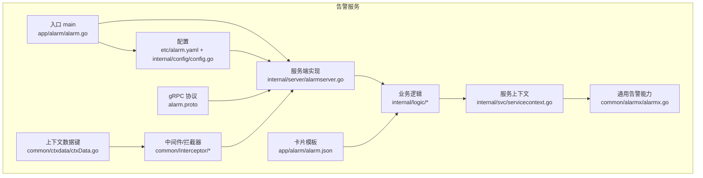
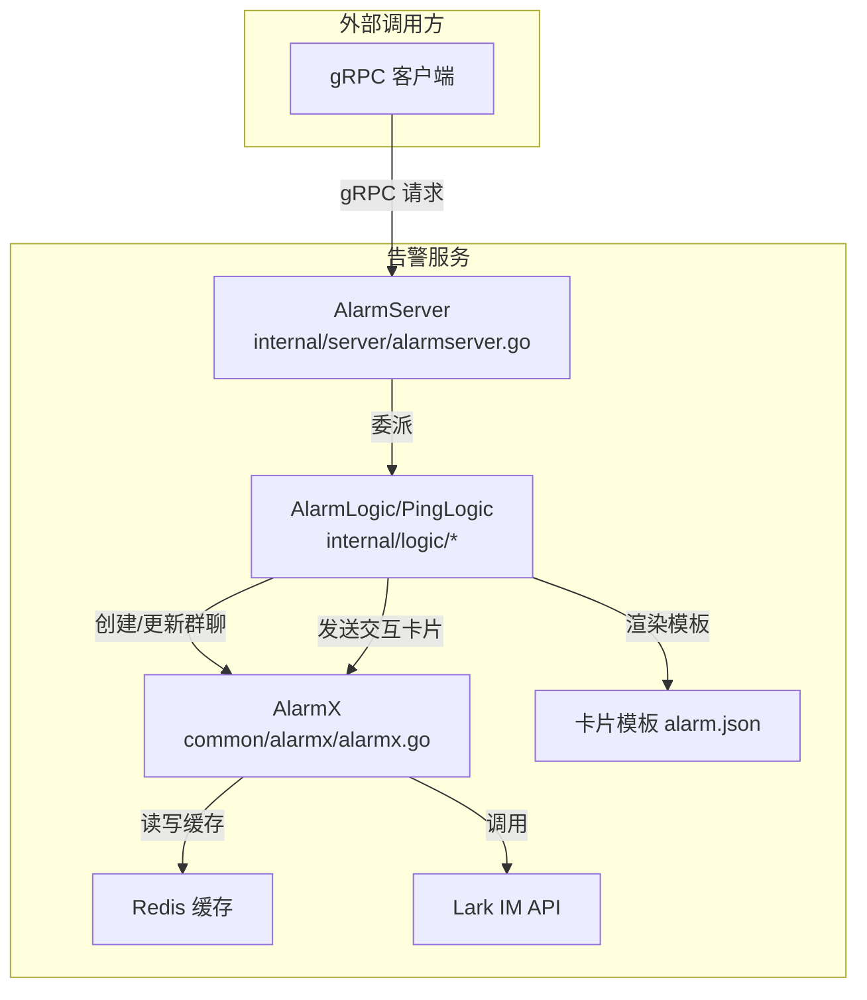
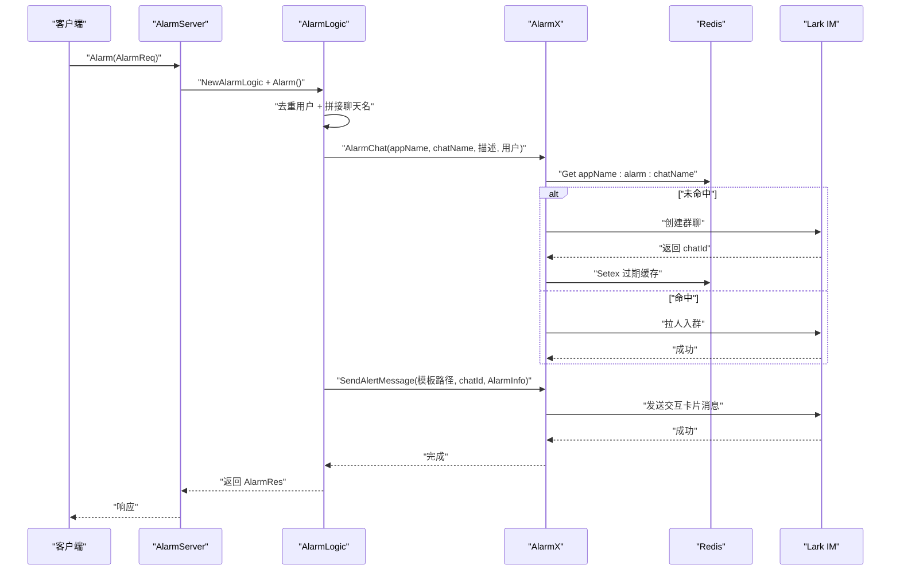
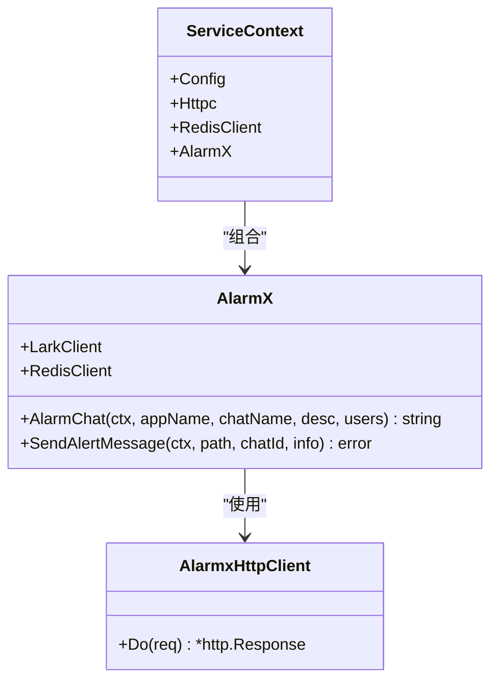
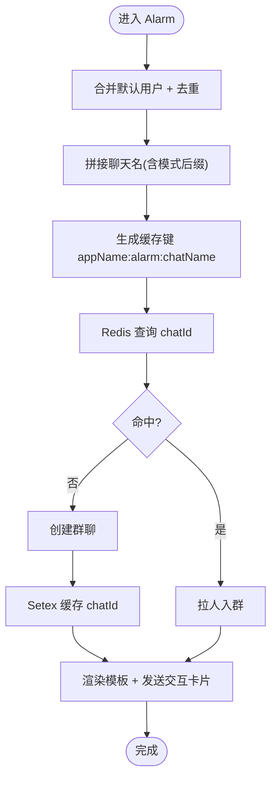
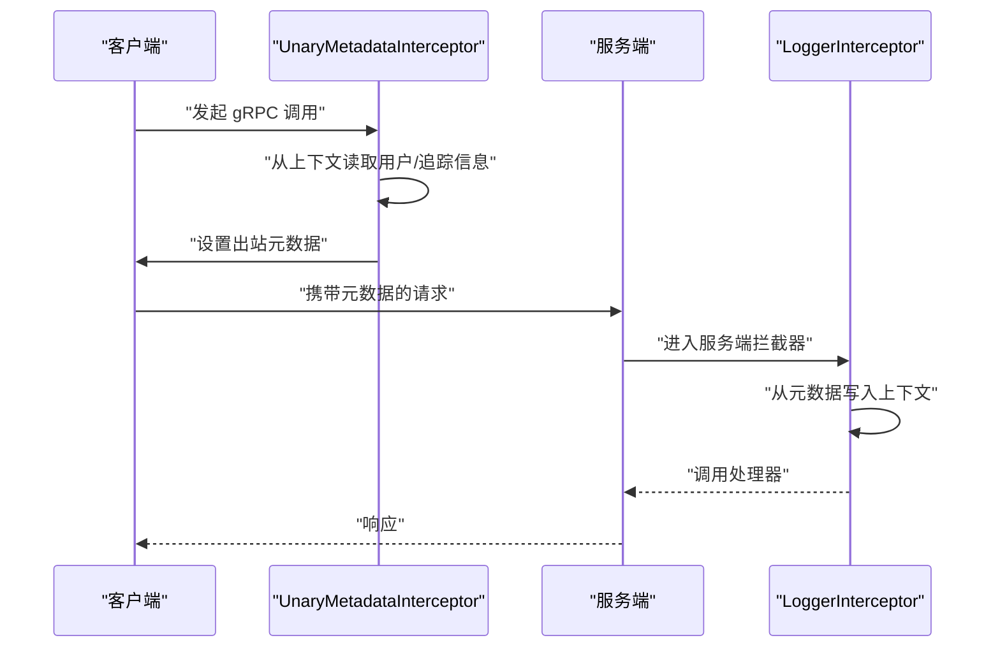
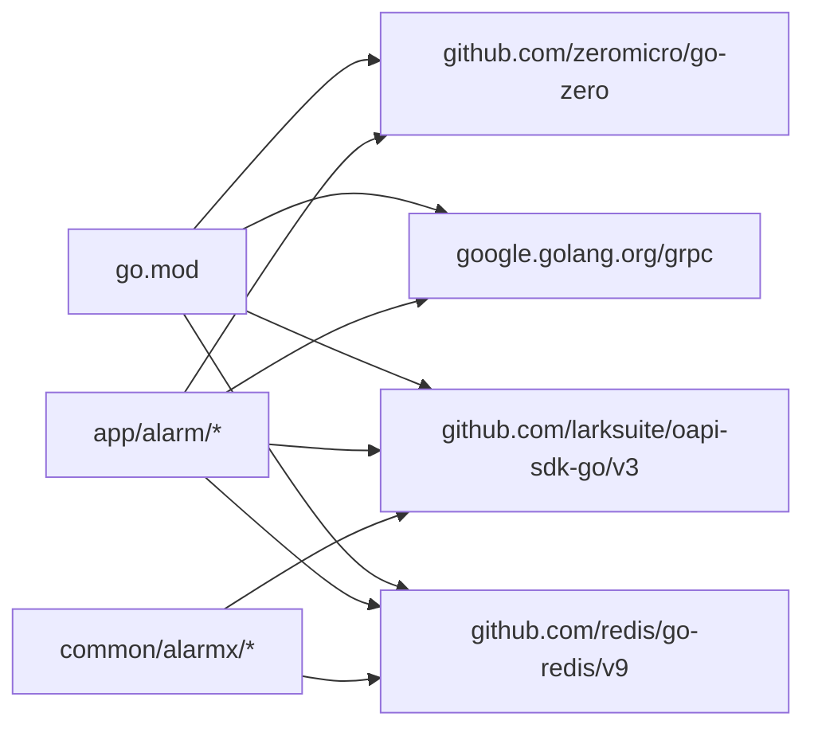

# 告警架构设计

<cite>
**本文引用的文件**
- [app/alarm/alarm.go](file://app/alarm/alarm.go)
- [app/alarm/etc/alarm.yaml](file://app/alarm/etc/alarm.yaml)
- [app/alarm/alarm.proto](file://app/alarm/alarm.proto)
- [app/alarm/internal/svc/servicecontext.go](file://app/alarm/internal/svc/servicecontext.go)
- [app/alarm/internal/config/config.go](file://app/alarm/internal/config/config.go)
- [app/alarm/internal/server/alarmserver.go](file://app/alarm/internal/server/alarmserver.go)
- [app/alarm/internal/logic/alarmlogic.go](file://app/alarm/internal/logic/alarmlogic.go)
- [app/alarm/internal/logic/pinglogic.go](file://app/alarm/internal/logic/pinglogic.go)
- [common/alarmx/alarmx.go](file://common/alarmx/alarmx.go)
- [common/Interceptor/rpcserver/loggerInterceptor.go](file://common/Interceptor/rpcserver/loggerInterceptor.go)
- [common/Interceptor/rpcclient/metadataInterceptor.go](file://common/Interceptor/rpcclient/metadataInterceptor.go)
- [common/ctxdata/ctxData.go](file://common/ctxdata/ctxData.go)
- [app/alarm/alarm.json](file://app/alarm/alarm.json)
- [go.mod](file://go.mod)
</cite>

## 目录
1. [简介](#简介)
2. [项目结构](#项目结构)
3. [核心组件](#核心组件)
4. [架构总览](#架构总览)
5. [详细组件分析](#详细组件分析)
6. [依赖分析](#依赖分析)
7. [性能考虑](#性能考虑)
8. [故障排查指南](#故障排查指南)
9. [结论](#结论)
10. [附录](#附录)

## 简介
本文件面向告警服务的架构设计与实现，系统化梳理 gRPC 服务架构、配置管理、依赖注入、服务上下文、中间件与拦截器、部署与高可用、以及与上下游微服务的集成方式、数据流与错误处理机制。通过分层解耦与模块化设计，告警服务以 Lark IM 作为通知载体，结合 Redis 缓存与本地模板卡片，实现“告警群创建/维护—消息发送—状态联动”的闭环。

## 项目结构
告警服务位于 app/alarm 目录，采用 go-zero 推荐的分层结构：
- 应用入口与启动：app/alarm/alarm.go
- 配置定义与加载：app/alarm/etc/alarm.yaml、internal/config/config.go
- gRPC 协议定义：app/alarm/alarm.proto
- 服务端实现：internal/server/alarmserver.go
- 业务逻辑：internal/logic 下的 alarmlogic.go、pinglogic.go
- 服务上下文：internal/svc/servicecontext.go
- 通用告警能力：common/alarmx/alarmx.go
- 中间件与上下文数据：common/Interceptor/rpcserver/loggerInterceptor.go、common/Interceptor/rpcclient/metadataInterceptor.go、common/ctxdata/ctxData.go
- 交互卡片模板：app/alarm/alarm.json

图表来源
- [app/alarm/alarm.go:1-44](file://app/alarm/alarm.go#L1-L44)
- [app/alarm/etc/alarm.yaml:1-26](file://app/alarm/etc/alarm.yaml#L1-L26)
- [app/alarm/alarm.proto:1-34](file://app/alarm/alarm.proto#L1-L34)
- [app/alarm/internal/server/alarmserver.go:1-35](file://app/alarm/internal/server/alarmserver.go#L1-L35)
- [app/alarm/internal/logic/alarmlogic.go:1-184](file://app/alarm/internal/logic/alarmlogic.go#L1-L184)
- [app/alarm/internal/svc/servicecontext.go:1-33](file://app/alarm/internal/svc/servicecontext.go#L1-L33)
- [common/alarmx/alarmx.go:1-223](file://common/alarmx/alarmx.go#L1-L223)
- [common/Interceptor/rpcserver/loggerInterceptor.go:1-45](file://common/Interceptor/rpcserver/loggerInterceptor.go#L1-L45)
- [common/Interceptor/rpcclient/metadataInterceptor.go:1-56](file://common/Interceptor/rpcclient/metadataInterceptor.go#L1-L56)
- [common/ctxdata/ctxData.go:1-76](file://common/ctxdata/ctxData.go#L1-L76)
- [app/alarm/alarm.json:1-75](file://app/alarm/alarm.json#L1-L75)

章节来源
- [app/alarm/alarm.go:1-44](file://app/alarm/alarm.go#L1-L44)
- [app/alarm/etc/alarm.yaml:1-26](file://app/alarm/etc/alarm.yaml#L1-L26)
- [app/alarm/internal/config/config.go:1-16](file://app/alarm/internal/config/config.go#L1-L16)
- [app/alarm/alarm.proto:1-34](file://app/alarm/alarm.proto#L1-L34)
- [app/alarm/internal/svc/servicecontext.go:1-33](file://app/alarm/internal/svc/servicecontext.go#L1-L33)
- [common/alarmx/alarmx.go:1-223](file://common/alarmx/alarmx.go#L1-L223)

## 核心组件
- gRPC 服务端：基于 go-zero 的 zrpc 服务器，注册 Alarm 服务，提供 Ping 与 Alarm 两个 RPC 方法。
- 服务上下文：封装配置、HTTP 客户端、Redis 客户端与 AlarmX 能力，统一注入到各逻辑层。
- 业务逻辑：Alarm 逻辑负责去重用户、拼接聊天名、调用 AlarmX 创建/更新群聊、发送交互卡片；Ping 逻辑用于健康检查。
- 通用告警能力：AlarmX 封装 Lark IM 的聊天创建/成员添加/消息发送/聊天更新等接口，并使用 Redis 缓存聊天 ID。
- 中间件与拦截器：服务端拦截器从 gRPC 元数据提取用户与追踪信息写入上下文；客户端拦截器将上下文中的用户与追踪信息透传到下游。
- 配置管理：YAML 配置文件与内部 Config 结构体，支持 Redis、日志、Telemetry、Alarmx 参数等。

章节来源
- [app/alarm/internal/server/alarmserver.go:1-35](file://app/alarm/internal/server/alarmserver.go#L1-L35)
- [app/alarm/internal/logic/alarmlogic.go:1-184](file://app/alarm/internal/logic/alarmlogic.go#L1-L184)
- [app/alarm/internal/logic/pinglogic.go:1-31](file://app/alarm/internal/logic/pinglogic.go#L1-L31)
- [common/alarmx/alarmx.go:1-223](file://common/alarmx/alarmx.go#L1-L223)
- [common/Interceptor/rpcserver/loggerInterceptor.go:1-45](file://common/Interceptor/rpcserver/loggerInterceptor.go#L1-L45)
- [common/Interceptor/rpcclient/metadataInterceptor.go:1-56](file://common/Interceptor/rpcclient/metadataInterceptor.go#L1-L56)
- [app/alarm/etc/alarm.yaml:1-26](file://app/alarm/etc/alarm.yaml#L1-L26)
- [app/alarm/internal/config/config.go:1-16](file://app/alarm/internal/config/config.go#L1-L16)

## 架构总览
告警服务采用“协议驱动 + 服务上下文 + 通用能力库”的分层架构：
- 协议层：alarm.proto 定义 Alarm 服务与消息模型。
- 服务层：AlarmServer 将 RPC 请求委派给对应逻辑层。
- 逻辑层：AlarmLogic 负责业务编排，调用 AlarmX 执行 Lark IM 操作。
- 通用能力层：AlarmX 统一封装 Lark SDK 与 Redis 缓存。
- 中间件层：服务端拦截器与客户端拦截器负责上下文与元数据传递。
- 配置层：YAML + Config 结构体集中管理运行参数。

图表来源
- [app/alarm/internal/server/alarmserver.go:1-35](file://app/alarm/internal/server/alarmserver.go#L1-L35)
- [app/alarm/internal/logic/alarmlogic.go:1-184](file://app/alarm/internal/logic/alarmlogic.go#L1-L184)
- [common/alarmx/alarmx.go:1-223](file://common/alarmx/alarmx.go#L1-L223)
- [app/alarm/alarm.json:1-75](file://app/alarm/alarm.json#L1-L75)

## 详细组件分析

### gRPC 服务与协议
- 协议定义：alarm.proto 提供 Ping 与 Alarm 两个方法，AlarmReq 包含标题、项目、时间、事件 ID、内容、错误、用户列表、IP 等字段。
- 服务注册：在 main 中通过 zrpc.MustNewServer 注册 AlarmServer，并按环境开启反射以支持调试工具。

图表来源
- [app/alarm/alarm.proto:1-34](file://app/alarm/alarm.proto#L1-L34)
- [app/alarm/internal/server/alarmserver.go:1-35](file://app/alarm/internal/server/alarmserver.go#L1-L35)
- [app/alarm/internal/logic/alarmlogic.go:1-184](file://app/alarm/internal/logic/alarmlogic.go#L1-L184)
- [common/alarmx/alarmx.go:1-223](file://common/alarmx/alarmx.go#L1-L223)

章节来源
- [app/alarm/alarm.proto:1-34](file://app/alarm/alarm.proto#L1-L34)
- [app/alarm/internal/server/alarmserver.go:1-35](file://app/alarm/internal/server/alarmserver.go#L1-L35)
- [app/alarm/internal/logic/alarmlogic.go:1-184](file://app/alarm/internal/logic/alarmlogic.go#L1-L184)

### 服务上下文与依赖注入
- ServiceContext 聚合配置、HTTP 客户端、Redis 客户端与 AlarmX 实例，构造时注入 Lark 客户端与 AlarmX HttpClient。
- AlarmX 使用 AlarmxHttpClient 将 Lark SDK 的 HTTP 请求委托给 go-zero 的 httpc.Service，便于统一日志与可观测性。

图表来源
- [app/alarm/internal/svc/servicecontext.go:1-33](file://app/alarm/internal/svc/servicecontext.go#L1-L33)
- [common/alarmx/alarmx.go:1-223](file://common/alarmx/alarmx.go#L1-L223)

章节来源
- [app/alarm/internal/svc/servicecontext.go:1-33](file://app/alarm/internal/svc/servicecontext.go#L1-L33)
- [common/alarmx/alarmx.go:1-223](file://common/alarmx/alarmx.go#L1-L223)

### 业务逻辑与卡片渲染
- Alarm 逻辑：合并默认用户列表并去重；根据运行模式拼接聊天名；调用 AlarmX 创建或更新群聊；复制请求为 AlarmInfo 后通过模板路径渲染卡片并发送。
- 卡片模板：alarm.json 定义交互卡片结构，AlarmX 在发送前将模板变量替换为实际值。
- 消息回调与状态联动：代码中预留了事件回调与交互卡片动作的处理函数，可用于“标记已解决”“跟进中”等状态变更。

图表来源
- [app/alarm/internal/logic/alarmlogic.go:1-184](file://app/alarm/internal/logic/alarmlogic.go#L1-L184)
- [common/alarmx/alarmx.go:1-223](file://common/alarmx/alarmx.go#L1-L223)
- [app/alarm/alarm.json:1-75](file://app/alarm/alarm.json#L1-L75)

章节来源
- [app/alarm/internal/logic/alarmlogic.go:1-184](file://app/alarm/internal/logic/alarmlogic.go#L1-L184)
- [app/alarm/alarm.json:1-75](file://app/alarm/alarm.json#L1-L75)

### 中间件与拦截器
- 服务端拦截器：从 gRPC 元数据提取用户 ID、用户名、部门编码、授权头、追踪 ID，并写入上下文，同时记录错误日志。
- 客户端拦截器：将上下文中的用户与追踪信息写入出站元数据，确保跨服务调用时上下文一致。
- 上下文数据键：统一定义在 ctxData，保证键名一致性与类型安全。

图表来源
- [common/Interceptor/rpcserver/loggerInterceptor.go:1-45](file://common/Interceptor/rpcserver/loggerInterceptor.go#L1-L45)
- [common/Interceptor/rpcclient/metadataInterceptor.go:1-56](file://common/Interceptor/rpcclient/metadataInterceptor.go#L1-L56)
- [common/ctxdata/ctxData.go:1-76](file://common/ctxdata/ctxData.go#L1-L76)

章节来源
- [common/Interceptor/rpcserver/loggerInterceptor.go:1-45](file://common/Interceptor/rpcserver/loggerInterceptor.go#L1-L45)
- [common/Interceptor/rpcclient/metadataInterceptor.go:1-56](file://common/Interceptor/rpcclient/metadataInterceptor.go#L1-L56)
- [common/ctxdata/ctxData.go:1-76](file://common/ctxdata/ctxData.go#L1-L76)

### 配置管理与环境差异
- YAML 配置项：服务名、监听地址、日志格式、Redis、Telemetry（可选）、Alarmx 凭据与用户列表、模板路径。
- Config 结构体：继承 zrpc.RpcServerConf 并扩展 Alarmx 字段，便于统一加载与校验。
- 环境差异：开发/测试模式下启用 gRPC 反射，便于本地调试。

章节来源
- [app/alarm/etc/alarm.yaml:1-26](file://app/alarm/etc/alarm.yaml#L1-L26)
- [app/alarm/internal/config/config.go:1-16](file://app/alarm/internal/config/config.go#L1-L16)
- [app/alarm/alarm.go:19-42](file://app/alarm/alarm.go#L19-L42)

## 依赖分析
- 外部依赖：go-zero、grpc、larksuite/oapi-sdk-go/v3、redis/go-redis/v9、copier、stream 等。
- 内部依赖：common/alarmx 为告警核心能力库，被 internal/logic 与 internal/svc 使用。
- 依赖方向：上层逻辑依赖下层能力，避免循环依赖；中间件独立于业务逻辑。

图表来源
- [go.mod:1-245](file://go.mod#L1-L245)
- [app/alarm/internal/logic/alarmlogic.go:1-184](file://app/alarm/internal/logic/alarmlogic.go#L1-L184)
- [common/alarmx/alarmx.go:1-223](file://common/alarmx/alarmx.go#L1-L223)

章节来源
- [go.mod:1-245](file://go.mod#L1-L245)

## 性能考虑
- 缓存策略：使用 Redis 缓存 chatId，减少重复创建群聊的开销；合理设置过期时间，避免内存泄漏。
- 异步与并发：AlarmX 的 Lark 调用建议配合 go-zero 的并发模型与连接池；对高频告警场景可引入队列或限流。
- 日志与追踪：服务端拦截器统一记录错误日志；客户端拦截器透传追踪 ID，便于端到端观测。
- 卡片渲染：模板一次性读取并替换变量，避免重复 IO；对大文本进行安全转义，防止日志污染。

## 故障排查指南
- 健康检查：Ping 方法返回固定响应，可用于快速验证服务可用性与网络连通性。
- 错误日志：服务端拦截器在处理异常时记录错误上下文，便于定位问题。
- Lark 权限与配额：确认 AppId/AppSecret、VerificationToken、EncryptKey 正确；关注 IM API 的配额限制。
- Redis 连接：检查 Redis 地址、认证与网络连通；关注缓存键命名与过期策略。
- 模板渲染：确认 alarm.json 路径存在且字段齐全；对特殊字符进行转义，避免卡片渲染失败。

章节来源
- [app/alarm/internal/logic/pinglogic.go:1-31](file://app/alarm/internal/logic/pinglogic.go#L1-L31)
- [common/Interceptor/rpcserver/loggerInterceptor.go:1-45](file://common/Interceptor/rpcserver/loggerInterceptor.go#L1-L45)
- [common/alarmx/alarmx.go:1-223](file://common/alarmx/alarmx.go#L1-L223)
- [app/alarm/etc/alarm.yaml:1-26](file://app/alarm/etc/alarm.yaml#L1-L26)

## 结论
告警服务通过清晰的分层与模块化设计，实现了“协议—服务—逻辑—能力—中间件—配置”的完整闭环。其核心优势在于：
- 以 go-zero 为基础的高性能 gRPC 服务框架；
- 以 AlarmX 为核心的 Lark IM 能力抽象与 Redis 缓存；
- 以拦截器与上下文数据为中心的跨服务上下文传递；
- 以模板卡片为载体的可扩展交互体验。

在生产环境中，建议进一步完善 Telemetry、限流与熔断、异步队列与重试、以及事件与卡片回调的完整实现，以提升稳定性与可观测性。

## 附录
- 部署与高可用：建议容器化部署，多副本运行并通过负载均衡暴露端口；结合 Nacos 或 etcd 进行服务发现与配置中心对接（当前仓库未直接使用，但具备扩展能力）。
- 集成方式：上游服务通过 gRPC 调用 Alarm 服务，客户端拦截器自动透传用户与追踪信息；服务端拦截器统一记录与转发。
- 数据流：请求经拦截器进入 AlarmServer，委派至 AlarmLogic，再由 AlarmX 与 Lark IM 交互，最终返回响应。
- 错误处理：服务端拦截器捕获异常并记录日志；AlarmX 对 Lark API 返回码进行判错；业务逻辑对关键步骤进行错误传播。