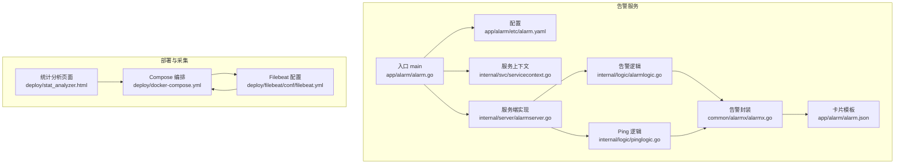
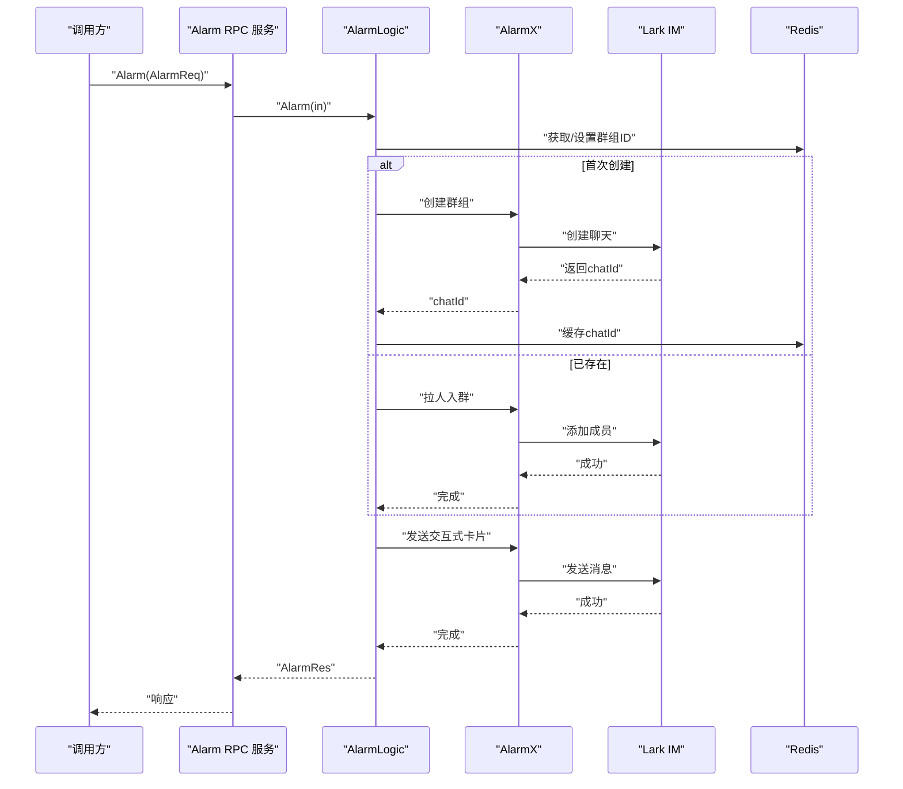
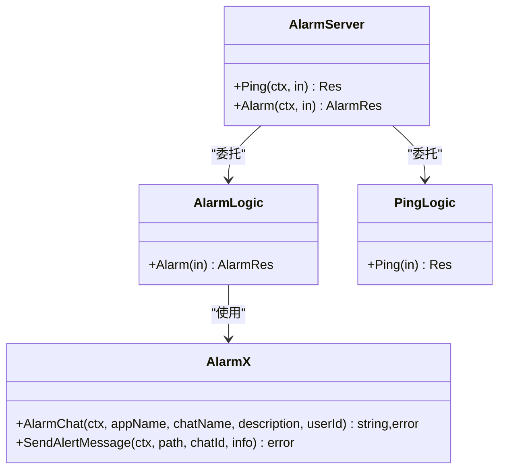
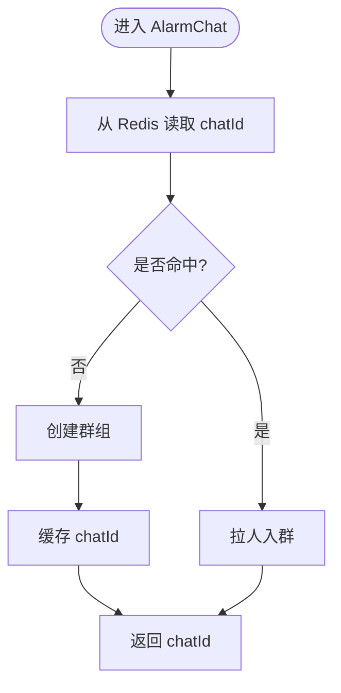
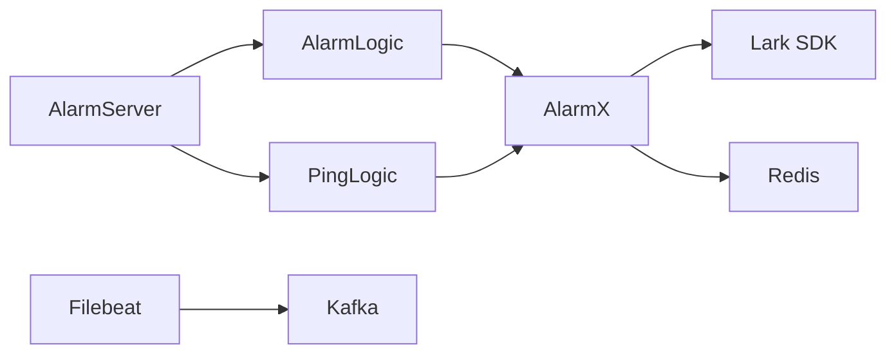

# 告警监控与运维

<cite>
**本文引用的文件**   
- [app/alarm/alarm.go](file://app/alarm/alarm.go)
- [app/alarm/etc/alarm.yaml](file://app/alarm/etc/alarm.yaml)
- [app/alarm/internal/config/config.go](file://app/alarm/internal/config/config.go)
- [app/alarm/internal/server/alarmserver.go](file://app/alarm/internal/server/alarmserver.go)
- [app/alarm/internal/svc/servicecontext.go](file://app/alarm/internal/svc/servicecontext.go)
- [app/alarm/internal/logic/alarmlogic.go](file://app/alarm/internal/logic/alarmlogic.go)
- [app/alarm/internal/logic/pinglogic.go](file://app/alarm/internal/logic/pinglogic.go)
- [common/alarmx/alarmx.go](file://common/alarmx/alarmx.go)
- [app/alarm/alarm.json](file://app/alarm/alarm.json)
- [deploy/docker-compose.yml](file://deploy/docker-compose.yml)
- [deploy/filebeat/conf/filebeat.yml](file://deploy/filebeat/conf/filebeat.yml)
- [deploy/stat_analyzer.html](file://deploy/stat_analyzer.html)
- [.trae/skills/zero-skills/references/resilience-patterns.md](file://.trae/skills/zero-skills/references/resilience-patterns.md)
</cite>

## 目录
1. [简介](#简介)
2. [项目结构](#项目结构)
3. [核心组件](#核心组件)
4. [架构总览](#架构总览)
5. [详细组件分析](#详细组件分析)
6. [依赖分析](#依赖分析)
7. [性能考虑](#性能考虑)
8. [故障排查指南](#故障排查指南)
9. [结论](#结论)
10. [附录](#附录)

## 简介
本文件面向“告警监控与运维”，围绕告警服务的监控指标、性能参数、健康检查、日志与错误追踪、性能分析、部署监控与资源使用、容量规划、故障诊断与根因分析、运维自动化与应急预案、监控仪表板与阈值配置、运维工具链与最佳实践进行系统化说明。告警服务基于 go-zero RPC 框架，通过 Lark IM 接口推送告警卡片，并结合 Redis 缓存群组标识，实现值班与处理流程的闭环。

## 项目结构
告警服务位于 app/alarm，采用 goctl 生成的 RPC 代码骨架，包含配置、服务上下文、逻辑层与服务端入口；公共告警能力封装于 common/alarmx，负责与 Lark IM 对接、群组管理与消息发送；部署侧通过 docker-compose 启动 Kafka/Filebeat，形成日志采集与告警联动的基础设施。

**图表来源**
- [app/alarm/alarm.go:1-44](file://app/alarm/alarm.go#L1-L44)
- [app/alarm/etc/alarm.yaml:1-26](file://app/alarm/etc/alarm.yaml#L1-L26)
- [app/alarm/internal/svc/servicecontext.go:1-33](file://app/alarm/internal/svc/servicecontext.go#L1-L33)
- [app/alarm/internal/server/alarmserver.go:1-35](file://app/alarm/internal/server/alarmserver.go#L1-L35)
- [app/alarm/internal/logic/alarmlogic.go:1-184](file://app/alarm/internal/logic/alarmlogic.go#L1-L184)
- [app/alarm/internal/logic/pinglogic.go:1-31](file://app/alarm/internal/logic/pinglogic.go#L1-L31)
- [common/alarmx/alarmx.go:1-223](file://common/alarmx/alarmx.go#L1-L223)
- [app/alarm/alarm.json:1-75](file://app/alarm/alarm.json#L1-L75)
- [deploy/docker-compose.yml:1-110](file://deploy/docker-compose.yml#L1-L110)
- [deploy/filebeat/conf/filebeat.yml:1-122](file://deploy/filebeat/conf/filebeat.yml#L1-L122)
- [deploy/stat_analyzer.html:862-888](file://deploy/stat_analyzer.html#L862-L888)

**章节来源**
- [app/alarm/alarm.go:1-44](file://app/alarm/alarm.go#L1-L44)
- [app/alarm/etc/alarm.yaml:1-26](file://app/alarm/etc/alarm.yaml#L1-L26)
- [deploy/docker-compose.yml:1-110](file://deploy/docker-compose.yml#L1-L110)
- [deploy/filebeat/conf/filebeat.yml:1-122](file://deploy/filebeat/conf/filebeat.yml#L1-L122)
- [deploy/stat_analyzer.html:862-888](file://deploy/stat_analyzer.html#L862-L888)

## 核心组件
- 告警服务入口与启动
  - 通过命令行参数加载配置，初始化服务上下文，注册 RPC 服务，按环境开启反射。
  - 参考路径：[app/alarm/alarm.go:19-42](file://app/alarm/alarm.go#L19-L42)
- 配置与参数
  - 包含服务名、监听地址、日志编码、Redis 连接、Telemetry（注释）、Lark 应用凭据与默认接收人、卡片模板路径等。
  - 参考路径：[app/alarm/etc/alarm.yaml:1-26](file://app/alarm/etc/alarm.yaml#L1-L26)，[app/alarm/internal/config/config.go:5-15](file://app/alarm/internal/config/config.go#L5-L15)
- 服务上下文
  - 初始化 Redis 客户端、HTTP 客户端、Lark 客户端，并注入 AlarmX 实例。
  - 参考路径：[app/alarm/internal/svc/servicecontext.go:20-31](file://app/alarm/internal/svc/servicecontext.go#L20-L31)
- 服务端实现
  - 提供 Ping 与 Alarm 两个 RPC 方法，分别委托给 PingLogic 与 AlarmLogic。
  - 参考路径：[app/alarm/internal/server/alarmserver.go:26-34](file://app/alarm/internal/server/alarmserver.go#L26-L34)
- 告警逻辑
  - 合并用户列表去重，拼接聊天名后缀，调用 AlarmX 创建或更新群组，发送交互式卡片消息；预留事件与卡片回调扩展点。
  - 参考路径：[app/alarm/internal/logic/alarmlogic.go:31-63](file://app/alarm/internal/logic/alarmlogic.go#L31-L63)
- Ping 逻辑
  - 返回固定响应，用于健康检查。
  - 参考路径：[app/alarm/internal/logic/pinglogic.go:26-29](file://app/alarm/internal/logic/pinglogic.go#L26-L29)
- 告警封装（AlarmX）
  - 封装 Lark IM 的群组创建/成员添加/消息发送；支持从 Redis 读取/缓存群组 ID；提供卡片构建与字符串转义。
  - 参考路径：[common/alarmx/alarmx.go:53-140](file://common/alarmx/alarmx.go#L53-L140)，[common/alarmx/alarmx.go:163-184](file://common/alarmx/alarmx.go#L163-L184)
- 卡片模板
  - 使用占位符填充标题、项目、时间、事件 ID、IP、内容与错误等字段。
  - 参考路径：[app/alarm/alarm.json:1-75](file://app/alarm/alarm.json#L1-L75)

**章节来源**
- [app/alarm/alarm.go:19-42](file://app/alarm/alarm.go#L19-L42)
- [app/alarm/etc/alarm.yaml:1-26](file://app/alarm/etc/alarm.yaml#L1-L26)
- [app/alarm/internal/config/config.go:5-15](file://app/alarm/internal/config/config.go#L5-L15)
- [app/alarm/internal/svc/servicecontext.go:20-31](file://app/alarm/internal/svc/servicecontext.go#L20-L31)
- [app/alarm/internal/server/alarmserver.go:26-34](file://app/alarm/internal/server/alarmserver.go#L26-L34)
- [app/alarm/internal/logic/alarmlogic.go:31-63](file://app/alarm/internal/logic/alarmlogic.go#L31-L63)
- [app/alarm/internal/logic/pinglogic.go:26-29](file://app/alarm/internal/logic/pinglogic.go#L26-L29)
- [common/alarmx/alarmx.go:53-140](file://common/alarmx/alarmx.go#L53-L140)
- [app/alarm/alarm.json:1-75](file://app/alarm/alarm.json#L1-L75)

## 架构总览
告警服务以 RPC 形式对外提供能力，内部通过 AlarmX 与 Lark IM 对接，使用 Redis 缓存群组标识，避免重复创建；日志采集由 Filebeat 从桥接/采集服务输出目录读取并投递至 Kafka，便于后续分析与可视化。

**图表来源**
- [app/alarm/internal/server/alarmserver.go:31-34](file://app/alarm/internal/server/alarmserver.go#L31-L34)
- [app/alarm/internal/logic/alarmlogic.go:31-63](file://app/alarm/internal/logic/alarmlogic.go#L31-L63)
- [common/alarmx/alarmx.go:53-140](file://common/alarmx/alarmx.go#L53-L140)

## 详细组件分析

### 组件：Alarm 服务端与逻辑
- 服务端职责
  - 将 RPC 请求分发到对应逻辑层，保持最小实现，增强可测试性与可维护性。
  - 参考路径：[app/alarm/internal/server/alarmserver.go:26-34](file://app/alarm/internal/server/alarmserver.go#L26-L34)
- 告警逻辑
  - 用户去重与聊天名后缀拼接，确保不同环境隔离；
  - 调用 AlarmX 完成群组生命周期管理与消息发送；
  - 预留事件与卡片回调扩展，便于后续接入交互式处理。
  - 参考路径：[app/alarm/internal/logic/alarmlogic.go:31-63](file://app/alarm/internal/logic/alarmlogic.go#L31-L63)
- Ping 逻辑
  - 固定返回“pong”，用于健康检查与快速连通性验证。
  - 参考路径：[app/alarm/internal/logic/pinglogic.go:26-29](file://app/alarm/internal/logic/pinglogic.go#L26-L29)

**图表来源**
- [app/alarm/internal/server/alarmserver.go:15-34](file://app/alarm/internal/server/alarmserver.go#L15-L34)
- [app/alarm/internal/logic/alarmlogic.go:17-29](file://app/alarm/internal/logic/alarmlogic.go#L17-L29)
- [app/alarm/internal/logic/pinglogic.go:12-24](file://app/alarm/internal/logic/pinglogic.go#L12-L24)
- [common/alarmx/alarmx.go:29-51](file://common/alarmx/alarmx.go#L29-L51)

**章节来源**
- [app/alarm/internal/server/alarmserver.go:26-34](file://app/alarm/internal/server/alarmserver.go#L26-L34)
- [app/alarm/internal/logic/alarmlogic.go:31-63](file://app/alarm/internal/logic/alarmlogic.go#L31-L63)
- [app/alarm/internal/logic/pinglogic.go:26-29](file://app/alarm/internal/logic/pinglogic.go#L26-L29)

### 组件：AlarmX（告警封装）
- 能力概览
  - 群组管理：创建群组、拉人入群、更新群名、查询群信息；
  - 消息发送：构建交互式卡片并发送至指定群；
  - 缓存：使用 Redis 缓存 chatId，降低重复创建成本；
  - 模板：从本地文件读取卡片模板，替换占位符并安全转义内容。
- 关键流程

**图表来源**
- [common/alarmx/alarmx.go:53-76](file://common/alarmx/alarmx.go#L53-L76)

**章节来源**
- [common/alarmx/alarmx.go:53-140](file://common/alarmx/alarmx.go#L53-L140)
- [common/alarmx/alarmx.go:163-184](file://common/alarmx/alarmx.go#L163-L184)

### 组件：配置与服务上下文
- 配置项
  - 服务名、监听地址、日志编码、Redis 连接、Telemetry（可选）、Lark 应用凭据、默认接收人、卡片模板路径。
  - 参考路径：[app/alarm/etc/alarm.yaml:1-26](file://app/alarm/etc/alarm.yaml#L1-L26)，[app/alarm/internal/config/config.go:5-15](file://app/alarm/internal/config/config.go#L5-L15)
- 服务上下文
  - 初始化 Redis、HTTP 客户端与 Lark 客户端，注入 AlarmX。
  - 参考路径：[app/alarm/internal/svc/servicecontext.go:20-31](file://app/alarm/internal/svc/servicecontext.go#L20-L31)

**章节来源**
- [app/alarm/etc/alarm.yaml:1-26](file://app/alarm/etc/alarm.yaml#L1-L26)
- [app/alarm/internal/config/config.go:5-15](file://app/alarm/internal/config/config.go#L5-L15)
- [app/alarm/internal/svc/servicecontext.go:20-31](file://app/alarm/internal/svc/servicecontext.go#L20-L31)

### 组件：部署与日志采集
- Compose 编排
  - 启动 Kafka、Filebeat、各业务服务；业务服务使用 host 网络以便直连设备或桥接服务。
  - 参考路径：[deploy/docker-compose.yml:1-110](file://deploy/docker-compose.yml#L1-L110)
- Filebeat 配置
  - 监控桥接采集输出目录，按正则提取 JSON 片段，解析后投递到 Kafka 对应 Topic。
  - 参考路径：[deploy/filebeat/conf/filebeat.yml:1-122](file://deploy/filebeat/conf/filebeat.yml#L1-L122)
- 统计分析页面
  - 提供服务名、CPU、内存、GC、QPS、丢弃与负载保护状态等字段的解析示例，便于构建监控看板。
  - 参考路径：[deploy/stat_analyzer.html:862-888](file://deploy/stat_analyzer.html#L862-L888)

**章节来源**
- [deploy/docker-compose.yml:1-110](file://deploy/docker-compose.yml#L1-L110)
- [deploy/filebeat/conf/filebeat.yml:1-122](file://deploy/filebeat/conf/filebeat.yml#L1-L122)
- [deploy/stat_analyzer.html:862-888](file://deploy/stat_analyzer.html#L862-L888)

## 依赖分析
- 组件耦合
  - AlarmServer 仅作为分发器，依赖逻辑层；逻辑层依赖 AlarmX；AlarmX 依赖 Lark SDK 与 Redis。
- 外部依赖
  - Lark IM：用于群组与消息能力；
  - Redis：用于缓存 chatId；
  - Kafka/Filebeat：用于日志采集与流式分析。
- 潜在风险
  - Lark API 调用失败或限流；
  - Redis 连接异常导致群组缓存不可用；
  - Filebeat/Kafka 配置不当导致数据丢失或延迟。

**图表来源**
- [app/alarm/internal/server/alarmserver.go:15-34](file://app/alarm/internal/server/alarmserver.go#L15-L34)
- [app/alarm/internal/logic/alarmlogic.go:17-29](file://app/alarm/internal/logic/alarmlogic.go#L17-L29)
- [common/alarmx/alarmx.go:29-51](file://common/alarmx/alarmx.go#L29-L51)

**章节来源**
- [app/alarm/internal/server/alarmserver.go:15-34](file://app/alarm/internal/server/alarmserver.go#L15-L34)
- [app/alarm/internal/logic/alarmlogic.go:17-29](file://app/alarm/internal/logic/alarmlogic.go#L17-L29)
- [common/alarmx/alarmx.go:29-51](file://common/alarmx/alarmx.go#L29-L51)

## 性能考虑
- 负载保护与弹性
  - go-zero 默认启用多层弹性保护（负载削减、限流、熔断、超时），生产模式下无需额外配置即可生效。
  - 参考路径：[resilience-patterns.md:125-156](file://.trae/skills/zero-skills/references/resilience-patterns.md#L125-L156)
- 监控指标建议
  - 服务级：请求量、错误率、P95/P99 延迟、并发请求数、负载保护触发次数；
  - 资源级：CPU、内存、GC 次数与分配速率、磁盘 IO；
  - 外部依赖：Lark API 调用成功率与耗时、Redis 命中率与延迟。
  - 参考路径：[stat_analyzer.html:862-888](file://deploy/stat_analyzer.html#L862-L888)
- 优化建议
  - 合理设置告警用户列表去重，减少不必要的群组变更；
  - 控制卡片内容长度与复杂度，避免 Lark API 调用超时；
  - 对高频告警场景引入节流或聚合策略。

**章节来源**
- [.trae/skills/zero-skills/references/resilience-patterns.md:125-156](file://.trae/skills/zero-skills/references/resilience-patterns.md#L125-L156)
- [deploy/stat_analyzer.html:862-888](file://deploy/stat_analyzer.html#L862-L888)

## 故障排查指南
- 健康检查
  - 使用 Ping 接口验证服务可用性与网络连通性。
  - 参考路径：[app/alarm/internal/logic/pinglogic.go:26-29](file://app/alarm/internal/logic/pinglogic.go#L26-L29)
- 常见问题定位
  - Lark API 失败：检查应用凭据、Token 与加密密钥配置；查看 AlarmX 的错误日志与返回码。
    - 参考路径：[common/alarmx/alarmx.go:89-96](file://common/alarmx/alarmx.go#L89-L96)，[common/alarmx/alarmx.go:109-116](file://common/alarmx/alarmx.go#L109-L116)
  - Redis 连接失败：核对连接串与网络；确认缓存键命名规则与过期策略。
    - 参考路径：[app/alarm/etc/alarm.yaml:8-11](file://app/alarm/etc/alarm.yaml#L8-L11)，[app/alarm/internal/svc/servicecontext.go:21](file://app/alarm/internal/svc/servicecontext.go#L21)
  - 卡片发送失败：检查模板路径与占位符替换；确认消息类型与接收 ID。
    - 参考路径：[app/alarm/alarm.json:1-75](file://app/alarm/alarm.json#L1-L75)，[common/alarmx/alarmx.go:119-140](file://common/alarmx/alarmx.go#L119-L140)
- 日志与追踪
  - 启用日志编码与级别，结合 Filebeat/Kafka 实现集中化日志采集与检索。
  - 参考路径：[app/alarm/etc/alarm.yaml:4-7](file://app/alarm/etc/alarm.yaml#L4-L7)，[deploy/filebeat/conf/filebeat.yml:110-122](file://deploy/filebeat/conf/filebeat.yml#L110-L122)

**章节来源**
- [app/alarm/internal/logic/pinglogic.go:26-29](file://app/alarm/internal/logic/pinglogic.go#L26-L29)
- [common/alarmx/alarmx.go:89-96](file://common/alarmx/alarmx.go#L89-L96)
- [common/alarmx/alarmx.go:109-116](file://common/alarmx/alarmx.go#L109-L116)
- [app/alarm/etc/alarm.yaml:4-7](file://app/alarm/etc/alarm.yaml#L4-L7)
- [app/alarm/etc/alarm.yaml:8-11](file://app/alarm/etc/alarm.yaml#L8-L11)
- [app/alarm/alarm.json:1-75](file://app/alarm/alarm.json#L1-L75)
- [deploy/filebeat/conf/filebeat.yml:110-122](file://deploy/filebeat/conf/filebeat.yml#L110-L122)

## 结论
告警服务以简洁清晰的分层设计实现“群组管理 + 交互式卡片”告警能力，结合 go-zero 的弹性保护与 Redis/Lark 的外部依赖，满足高可用与可观测性需求。配合 Filebeat/Kafka 的日志采集与统计分析页面，可快速搭建监控看板与告警阈值体系。建议在生产环境中完善 Telemetry、限流与熔断策略，并持续优化卡片模板与用户列表管理，提升告警处理效率与体验。

## 附录

### 监控仪表板与阈值配置指南
- 指标建议
  - 服务级：请求量、错误率、P95/P99 延迟、并发请求数、负载保护触发次数；
  - 资源级：CPU 使用率、内存占用、GC 次数与分配速率、磁盘 IO；
  - 外部依赖：Lark API 成功率与 P95/P99 耗时、Redis 命中率与延迟。
- 阈值示例（参考）
  - 错误率 > 1% 持续 5 分钟；
  - P99 延迟 > 500ms 持续 3 分钟；
  - 并发请求数 > 预设上限 × 80%；
  - 负载保护触发次数 > 0；
  - Lark API 失败率 > 5%；
  - Redis 命中率 < 90%。
- 可视化
  - 使用统计分析页面提供的字段解析能力，构建折线图、柱状图与告警面板。

**章节来源**
- [deploy/stat_analyzer.html:862-888](file://deploy/stat_analyzer.html#L862-L888)

### 运维自动化与应急预案
- 自动化
  - 使用 Compose 编排一键启动告警服务与依赖组件；
  - 通过 Filebeat/Kafka 实现日志采集与流式分析；
  - 在告警逻辑中预留事件与卡片回调，便于后续接入自动处理。
- 应急预案
  - Lark API 不可用：降级为文本消息或本地日志记录，同时触发备用通知渠道；
  - Redis 不可用：临时禁用缓存，直接调用 Lark API 创建群组；
  - Kafka/Topic 异常：切换到备用 Topic 或本地落盘，待恢复后再回放。

**章节来源**
- [deploy/docker-compose.yml:1-110](file://deploy/docker-compose.yml#L1-L110)
- [deploy/filebeat/conf/filebeat.yml:1-122](file://deploy/filebeat/conf/filebeat.yml#L1-L122)
- [app/alarm/internal/logic/alarmlogic.go:47-62](file://app/alarm/internal/logic/alarmlogic.go#L47-L62)

### 最佳实践
- 配置管理
  - 将敏感配置（Lark 凭据、Redis 地址）置于环境变量或密管系统；
  - 分环境（dev/test/prd）独立配置，避免误操作。
- 日志与追踪
  - 启用统一日志编码与级别，结合 Filebeat/Kafka 实现集中化存储与检索；
  - 在关键路径埋点，记录请求上下文与关键耗时。
- 性能与弹性
  - 利用 go-zero 默认弹性保护，必要时微调限流与熔断参数；
  - 对高频告警进行聚合或去抖，降低外部依赖压力。
- 可观测性
  - 建立服务级与资源级监控看板，设置分级阈值与告警通道；
  - 定期复盘告警事件，优化阈值与处理流程。

**章节来源**
- [app/alarm/etc/alarm.yaml:1-26](file://app/alarm/etc/alarm.yaml#L1-L26)
- [deploy/filebeat/conf/filebeat.yml:110-122](file://deploy/filebeat/conf/filebeat.yml#L110-L122)
- [.trae/skills/zero-skills/references/resilience-patterns.md:125-156](file://.trae/skills/zero-skills/references/resilience-patterns.md#L125-L156)