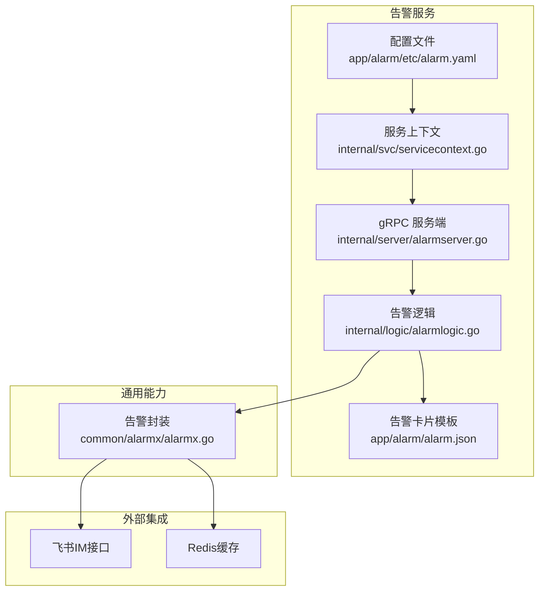
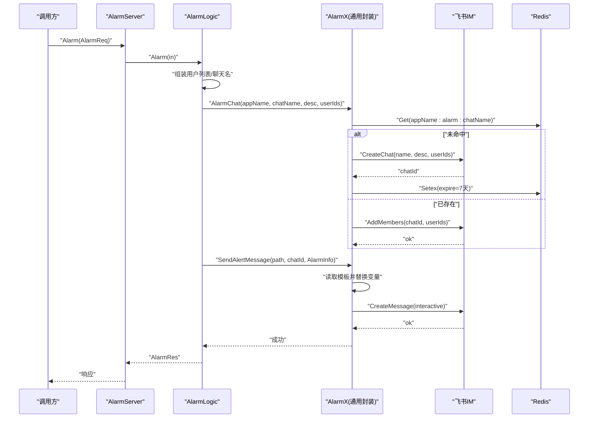
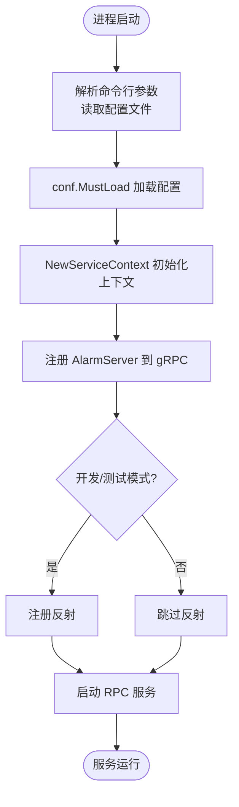
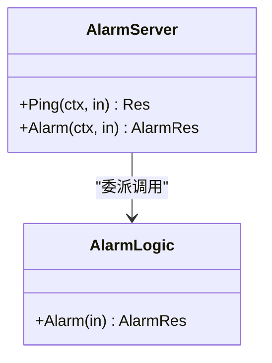
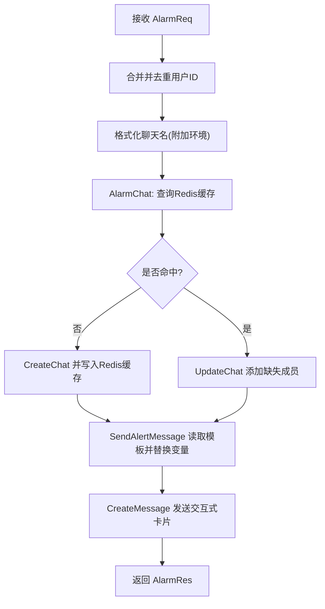
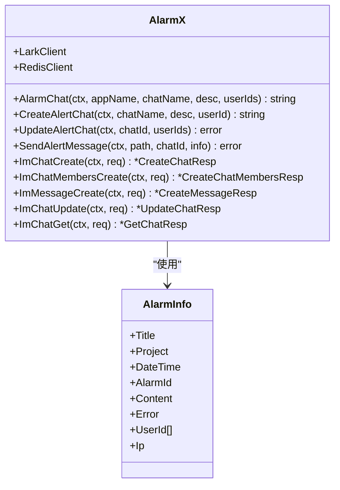
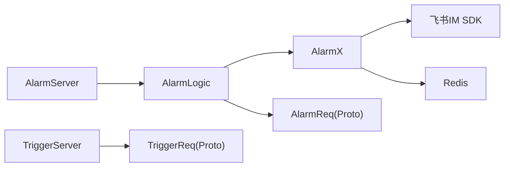

# 告警规则配置

<cite>
**本文引用的文件**
- [app/alarm/etc/alarm.yaml](file://app/alarm/etc/alarm.yaml)
- [app/alarm/internal/config/config.go](file://app/alarm/internal/config/config.go)
- [app/alarm/internal/svc/servicecontext.go](file://app/alarm/internal/svc/servicecontext.go)
- [app/alarm/internal/logic/alarmlogic.go](file://app/alarm/internal/logic/alarmlogic.go)
- [app/alarm/internal/server/alarmserver.go](file://app/alarm/internal/server/alarmserver.go)
- [app/alarm/alarm.go](file://app/alarm/alarm.go)
- [app/alarm/alarm.proto](file://app/alarm/alarm.proto)
- [app/alarm/alarm.json](file://app/alarm/alarm.json)
- [common/alarmx/alarmx.go](file://common/alarmx/alarmx.go)
- [app/xfusionmock/xfusionmock.proto](file://app/xfusionmock/xfusionmock.proto)
- [app/xfusionmock/xfusionmock/xfusionmock.pb.go](file://app/xfusionmock/xfusionmock/xfusionmock.pb.go)
- [app/xfusionmock/xfusionmock/xfusionmock.pb.validate.go](file://app/xfusionmock/xfusionmock/xfusionmock.pb.validate.go)
- [app/trigger/trigger.proto](file://app/trigger/trigger.proto)
- [app/trigger/trigger/trigger.pb.validate.go](file://app/trigger/trigger/trigger.pb.validate.go)
</cite>

## 目录
1. [简介](#简介)
2. [项目结构](#项目结构)
3. [核心组件](#核心组件)
4. [架构总览](#架构总览)
5. [详细组件分析](#详细组件分析)
6. [依赖分析](#依赖分析)
7. [性能考虑](#性能考虑)
8. [故障排查指南](#故障排查指南)
9. [结论](#结论)
10. [附录](#附录)

## 简介
本技术文档围绕“告警规则配置”主题，系统梳理并解释告警规则在本仓库中的定义语法、配置格式与验证机制；阐述告警级别、阈值与触发条件的配置方式；说明规则的动态加载、热更新与版本管理策略；介绍规则引擎工作原理、匹配算法与执行流程；给出告警抑制、去重与收敛策略的配置方法；提供常见业务场景的告警规则模板、最佳实践与性能调优建议，并附带调试方法、故障排查与配置验证工具的使用指南。

## 项目结构
告警子系统主要由以下模块组成：
- 配置层：应用配置与告警卡片模板
- 服务层：gRPC 服务端实现
- 逻辑层：告警请求处理与交互
- 通用能力：告警消息构建与飞书 IM 能力封装
- 触发器与数据模型：与告警数据结构相关的协议与校验

图表来源
- [app/alarm/etc/alarm.yaml:1-26](file://app/alarm/etc/alarm.yaml#L1-L26)
- [app/alarm/internal/svc/servicecontext.go:1-33](file://app/alarm/internal/svc/servicecontext.go#L1-L33)
- [app/alarm/internal/server/alarmserver.go:1-35](file://app/alarm/internal/server/alarmserver.go#L1-L35)
- [app/alarm/internal/logic/alarmlogic.go:1-184](file://app/alarm/internal/logic/alarmlogic.go#L1-L184)
- [app/alarm/alarm.json:1-75](file://app/alarm/alarm.json#L1-L75)
- [common/alarmx/alarmx.go:1-223](file://common/alarmx/alarmx.go#L1-L223)

章节来源
- [app/alarm/etc/alarm.yaml:1-26](file://app/alarm/etc/alarm.yaml#L1-L26)
- [app/alarm/internal/config/config.go:1-16](file://app/alarm/internal/config/config.go#L1-L16)
- [app/alarm/internal/svc/servicecontext.go:1-33](file://app/alarm/internal/svc/servicecontext.go#L1-L33)
- [app/alarm/internal/server/alarmserver.go:1-35](file://app/alarm/internal/server/alarmserver.go#L1-L35)
- [app/alarm/internal/logic/alarmlogic.go:1-184](file://app/alarm/internal/logic/alarmlogic.go#L1-L184)
- [app/alarm/alarm.json:1-75](file://app/alarm/alarm.json#L1-L75)
- [common/alarmx/alarmx.go:1-223](file://common/alarmx/alarmx.go#L1-L223)

## 核心组件
- 配置结构与加载
  - 应用配置通过 YAML 文件加载，包含 RPC 监听、日志、Redis 连接以及告警扩展配置（如 AppId、AppSecret、加密密钥、用户 ID 列表、告警卡片模板路径等）。
  - 服务启动时读取配置并初始化服务上下文，注入 Redis 客户端与飞书客户端。
- gRPC 服务端
  - 提供 Ping 与 Alarm 两个 RPC 接口，Alarm 接口用于接收告警请求并触发后续动作。
- 告警逻辑
  - 组装告警参数，调用通用告警封装，完成聊天群创建或成员更新、消息卡片发送等操作。
- 通用告警封装
  - 封装飞书 IM 的聊天创建/更新、消息发送能力；支持从本地模板文件读取卡片内容并进行变量替换；通过 Redis 缓存聊天会话 ID，避免重复创建。
- 告警卡片模板
  - JSON 卡片模板，包含标题、字段区、按钮等元素，支持占位符替换。

章节来源
- [app/alarm/etc/alarm.yaml:1-26](file://app/alarm/etc/alarm.yaml#L1-L26)
- [app/alarm/internal/config/config.go:1-16](file://app/alarm/internal/config/config.go#L1-L16)
- [app/alarm/internal/svc/servicecontext.go:1-33](file://app/alarm/internal/svc/servicecontext.go#L1-L33)
- [app/alarm/internal/server/alarmserver.go:1-35](file://app/alarm/internal/server/alarmserver.go#L1-L35)
- [app/alarm/internal/logic/alarmlogic.go:1-184](file://app/alarm/internal/logic/alarmlogic.go#L1-L184)
- [common/alarmx/alarmx.go:1-223](file://common/alarmx/alarmx.go#L1-L223)
- [app/alarm/alarm.json:1-75](file://app/alarm/alarm.json#L1-L75)

## 架构总览
告警服务采用“配置驱动 + 卡片模板 + 飞书 IM”的组合模式，通过 gRPC 接收告警请求，利用通用封装完成聊天群与消息的自动化处理。

图表来源
- [app/alarm/internal/server/alarmserver.go:31-34](file://app/alarm/internal/server/alarmserver.go#L31-L34)
- [app/alarm/internal/logic/alarmlogic.go:31-63](file://app/alarm/internal/logic/alarmlogic.go#L31-L63)
- [common/alarmx/alarmx.go:53-140](file://common/alarmx/alarmx.go#L53-L140)

## 详细组件分析

### 配置与启动流程
- 配置文件
  - 包含 RPC 名称、监听地址、日志编码、Redis 连接信息、告警扩展配置（AppId/AppSecret/EncryptKey/VerificationToken/UserId 列表、模板路径）。
- 启动流程
  - main 函数解析命令行参数，加载配置，创建服务上下文，注册 gRPC 服务端，按需开启反射，启动 RPC 服务。

图表来源
- [app/alarm/alarm.go:19-43](file://app/alarm/alarm.go#L19-L43)
- [app/alarm/etc/alarm.yaml:1-26](file://app/alarm/etc/alarm.yaml#L1-L26)
- [app/alarm/internal/config/config.go:5-14](file://app/alarm/internal/config/config.go#L5-L14)
- [app/alarm/internal/svc/servicecontext.go:20-32](file://app/alarm/internal/svc/servicecontext.go#L20-L32)

章节来源
- [app/alarm/etc/alarm.yaml:1-26](file://app/alarm/etc/alarm.yaml#L1-L26)
- [app/alarm/internal/config/config.go:1-16](file://app/alarm/internal/config/config.go#L1-L16)
- [app/alarm/internal/svc/servicecontext.go:1-33](file://app/alarm/internal/svc/servicecontext.go#L1-L33)
- [app/alarm/alarm.go:19-43](file://app/alarm/alarm.go#L19-L43)

### gRPC 接口与服务端
- 接口定义
  - 提供 Ping 与 Alarm 两个 RPC 方法，AlarmReq 中包含聊天名、描述、标题、项目、时间、报警 ID、内容、错误、用户 ID 列表、IP 等字段。
- 服务端实现
  - AlarmServer 将请求委派给对应的 Logic 层处理，返回空响应。

图表来源
- [app/alarm/alarm.proto:30-33](file://app/alarm/alarm.proto#L30-L33)
- [app/alarm/internal/server/alarmserver.go:26-34](file://app/alarm/internal/server/alarmserver.go#L26-L34)
- [app/alarm/internal/logic/alarmlogic.go:31-63](file://app/alarm/internal/logic/alarmlogic.go#L31-L63)

章节来源
- [app/alarm/alarm.proto:14-28](file://app/alarm/alarm.proto#L14-L28)
- [app/alarm/internal/server/alarmserver.go:1-35](file://app/alarm/internal/server/alarmserver.go#L1-L35)
- [app/alarm/internal/logic/alarmlogic.go:1-184](file://app/alarm/internal/logic/alarmlogic.go#L1-L184)

### 告警逻辑与消息发送
- 用户与聊天名处理
  - 合并请求中的用户 ID 与配置中的默认用户 ID，并去重；聊天名拼接环境后缀。
- 聊天群管理
  - 若缓存中不存在该聊天会话，则创建聊天群并拉取用户；若已存在则仅追加缺失用户。
- 消息发送
  - 读取模板文件，替换占位符生成卡片内容，向聊天会话发送交互式消息。
- 事件与卡片回调（预留）
  - 代码中保留了事件与卡片回调的示例注释，便于后续扩展。

图表来源
- [app/alarm/internal/logic/alarmlogic.go:31-63](file://app/alarm/internal/logic/alarmlogic.go#L31-L63)
- [common/alarmx/alarmx.go:53-140](file://common/alarmx/alarmx.go#L53-L140)
- [app/alarm/alarm.json:1-75](file://app/alarm/alarm.json#L1-L75)

章节来源
- [app/alarm/internal/logic/alarmlogic.go:1-184](file://app/alarm/internal/logic/alarmlogic.go#L1-L184)
- [common/alarmx/alarmx.go:1-223](file://common/alarmx/alarmx.go#L1-L223)
- [app/alarm/alarm.json:1-75](file://app/alarm/alarm.json#L1-L75)

### 通用告警封装（AlarmX）
- 聊天群生命周期
  - 通过 Redis 缓存聊天会话 ID，避免重复创建；首次创建后设置过期时间。
- 飞书 IM 能力
  - 提供聊天创建、成员添加、消息发送、聊天更新、聊天查询等方法。
- 模板渲染
  - 从本地文件读取卡片模板，对占位符进行安全替换；提供字符串转义函数以保证日志与消息安全。

图表来源
- [common/alarmx/alarmx.go:29-160](file://common/alarmx/alarmx.go#L29-L160)
- [common/alarmx/alarmx.go:18-27](file://common/alarmx/alarmx.go#L18-L27)

章节来源
- [common/alarmx/alarmx.go:1-223](file://common/alarmx/alarmx.go#L1-L223)

### 告警卡片模板（alarm.json）
- 模板结构
  - 包含宽屏模式开关、头部模板样式、多列字段区、按钮等元素。
- 占位符替换
  - 支持标题、项目、时间、报警 ID、内容、错误、IP、按钮名等占位符。

章节来源
- [app/alarm/alarm.json:1-75](file://app/alarm/alarm.json#L1-L75)

### 告警数据模型与规则引擎（概念性说明）
- 告警数据模型
  - 在其他模块中存在告警数据结构（如 AlarmData），包含报警等级、报警类型、终端列表、轨迹信息、位置、起止围栏、起止时间、持续时长、状态等字段。
- 规则引擎与匹配算法
  - 当前仓库未直接提供“规则引擎”的源码实现；告警服务通过 gRPC 接收外部触发请求并进行消息投递。若需要规则引擎，请结合业务场景自行扩展，例如：
    - 定义规则 DSL 或 JSON Schema，解析并编译规则表达式；
    - 实现匹配算法（阈值比较、滑动窗口统计、状态机等）；
    - 将匹配结果转化为 AlarmReq 并调用 Alarm 服务。
- 执行流程
  - 规则引擎 → 规则匹配 → 生成告警请求 → Alarm 服务 → 飞书消息投递。

章节来源
- [app/xfusionmock/xfusionmock.proto:153-187](file://app/xfusionmock/xfusionmock.proto#L153-L187)
- [app/xfusionmock/xfusionmock/xfusionmock.pb.go:882-1071](file://app/xfusionmock/xfusionmock/xfusionmock.pb.go#L882-L1071)

## 依赖分析
- 组件耦合
  - AlarmServer 与 AlarmLogic 强耦合，职责清晰；AlarmLogic 依赖 AlarmX 与配置。
  - AlarmX 依赖飞书 SDK 与 Redis 客户端，承担对外部系统的访问。
- 外部依赖
  - 飞书 IM SDK：用于聊天与消息操作。
  - Redis：用于缓存聊天会话 ID。
- 协议与校验
  - AlarmReq 与 TriggerReq 均有对应的 proto 校验文件，可用于请求参数的合法性校验。

图表来源
- [app/alarm/internal/server/alarmserver.go:15-34](file://app/alarm/internal/server/alarmserver.go#L15-L34)
- [app/alarm/internal/logic/alarmlogic.go:17-29](file://app/alarm/internal/logic/alarmlogic.go#L17-L29)
- [common/alarmx/alarmx.go:29-51](file://common/alarmx/alarmx.go#L29-L51)
- [app/trigger/trigger.proto:1-34](file://app/trigger/trigger.proto#L1-L34)

章节来源
- [app/alarm/internal/server/alarmserver.go:1-35](file://app/alarm/internal/server/alarmserver.go#L1-L35)
- [app/alarm/internal/logic/alarmlogic.go:1-184](file://app/alarm/internal/logic/alarmlogic.go#L1-L184)
- [common/alarmx/alarmx.go:1-223](file://common/alarmx/alarmx.go#L1-L223)
- [app/trigger/trigger.proto:1-34](file://app/trigger/trigger.proto#L1-L34)

## 性能考虑
- 缓存优化
  - 使用 Redis 缓存聊天会话 ID，减少重复创建聊天群的成本；合理设置过期时间，避免长期占用内存。
- 模板读取
  - 模板文件一次性读取并替换变量，建议在服务启动时预热模板，降低请求路径上的 IO 开销。
- 并发与限流
  - 对外接口建议增加并发限制与熔断保护，防止突发流量导致飞书接口限流或下游压力过大。
- 日志与监控
  - 记录关键指标（创建聊天耗时、消息发送耗时、用户拉取耗时），结合链路追踪定位瓶颈。

## 故障排查指南
- 配置检查
  - 确认配置文件中的 AppId/AppSecret/EncryptKey/VerificationToken/UserId 列表与模板路径正确。
- Redis 连通性
  - 检查 Redis 地址、端口与 Key 前缀是否正确；确认缓存键是否存在且未过期。
- 飞书权限与配额
  - 核对应用权限范围与配额限制；关注返回码与错误信息，定位具体失败环节。
- 请求参数校验
  - 使用 proto 校验工具对请求参数进行验证，确保必填字段与格式符合要求。
- 日志定位
  - 查看服务日志中的错误堆栈与返回码，结合 AlarmX 的错误处理逻辑定位问题。

章节来源
- [app/alarm/etc/alarm.yaml:1-26](file://app/alarm/etc/alarm.yaml#L1-L26)
- [common/alarmx/alarmx.go:53-140](file://common/alarmx/alarmx.go#L53-L140)
- [app/trigger/trigger/trigger.pb.validate.go:416-426](file://app/trigger/trigger/trigger.pb.validate.go#L416-L426)

## 结论
本告警系统通过“配置 + 卡片模板 + 飞书 IM”的方式实现了告警消息的自动化投递，具备良好的可扩展性与可维护性。对于规则引擎与动态规则管理，建议结合业务需求另行扩展，以满足更复杂的阈值、去重与收敛策略。通过合理的缓存策略、参数校验与监控告警，可进一步提升系统的稳定性与性能。

## 附录

### 告警规则定义语法与配置格式
- 规则定义位置
  - 规则引擎未在本仓库直接实现，建议在业务侧以 JSON/DSL 形式定义规则，并通过触发器服务或定时任务将匹配结果转化为 AlarmReq。
- 字段映射
  - AlarmReq 字段与告警数据模型中的字段可建立映射关系，如标题、项目、时间、报警 ID、内容、错误、IP、用户 ID 等。
- 验证机制
  - 使用 proto 校验工具对请求参数进行验证，确保必填字段与格式符合要求。

章节来源
- [app/alarm/alarm.proto:14-28](file://app/alarm/alarm.proto#L14-L28)
- [app/xfusionmock/xfusionmock/xfusionmock.pb.validate.go:1879-1889](file://app/xfusionmock/xfusionmock/xfusionmock.pb.validate.go#L1879-L1889)
- [app/trigger/trigger/trigger.pb.validate.go:416-426](file://app/trigger/trigger/trigger.pb.validate.go#L416-L426)

### 告警级别、阈值与触发条件
- 告警级别
  - 告警数据模型中包含“等级”字段，可用于区分紧急、严重、警告等不同级别。
- 阈值与触发条件
  - 建议在规则引擎中实现阈值比较、滑动窗口统计、状态机等算法，将匹配结果映射到 AlarmReq。
- 动态加载与热更新
  - 规则可存储于配置中心或数据库，通过定时刷新或事件驱动方式进行热更新。

章节来源
- [app/xfusionmock/xfusionmock/xfusionmock.pb.go:895-896](file://app/xfusionmock/xfusionmock/xfusionmock.pb.go#L895-L896)

### 动态加载、热更新与版本管理
- 版本管理
  - 规则版本可通过版本号或时间戳进行管理，支持灰度发布与回滚。
- 热更新
  - 建议通过配置中心或消息队列推送规则变更事件，服务端订阅并更新内存规则集。

### 规则引擎工作原理与执行流程
- 工作原理
  - 解析规则表达式，匹配输入数据，生成告警事件。
- 执行流程
  - 输入数据 → 规则匹配 → 生成 AlarmReq → Alarm 服务 → 飞书消息投递。

### 告警抑制、去重与收敛策略
- 抑制
  - 基于规则或时间窗口抑制重复触发。
- 去重
  - 基于报警 ID 或关键字段去重。
- 收敛
  - 将同一类告警在短时间内聚合为一条消息，减少噪声。

### 常见业务场景模板与最佳实践
- 模板
  - 可参考 alarm.json 的卡片结构，按业务补充字段与样式。
- 最佳实践
  - 明确告警级别划分与阈值设定；启用缓存与幂等；完善日志与监控；对高风险场景增加限流与熔断。

### 调试方法与配置验证工具
- 调试
  - 使用 gRPC 客户端直连服务端进行调试；开启开发模式下的反射以便查看接口。
- 验证
  - 使用 proto 校验工具对请求参数进行验证；检查 Redis 缓存与飞书返回码。

章节来源
- [app/alarm/alarm.go:32-38](file://app/alarm/alarm.go#L32-L38)
- [app/trigger/trigger/trigger.pb.validate.go:416-426](file://app/trigger/trigger/trigger.pb.validate.go#L416-L426)