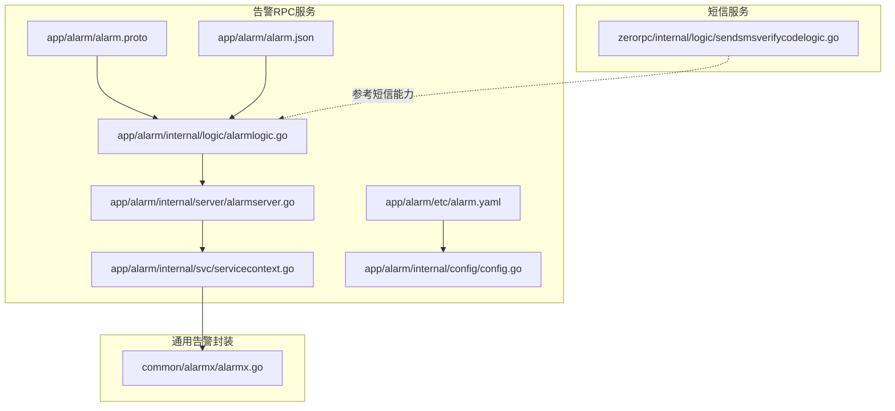
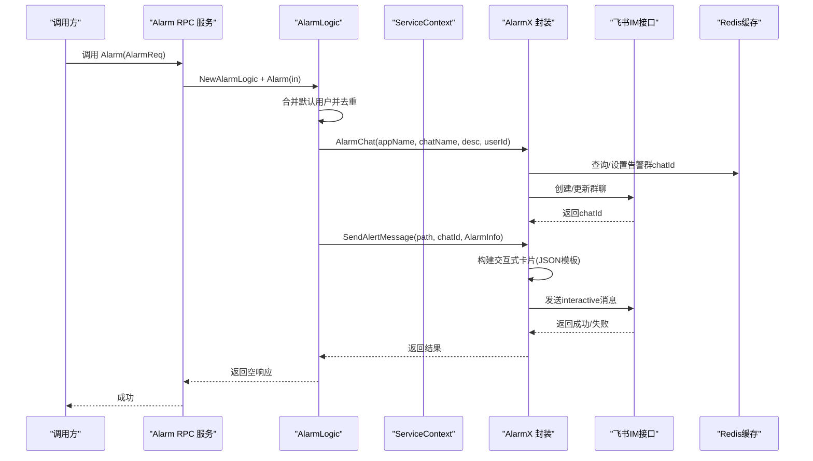
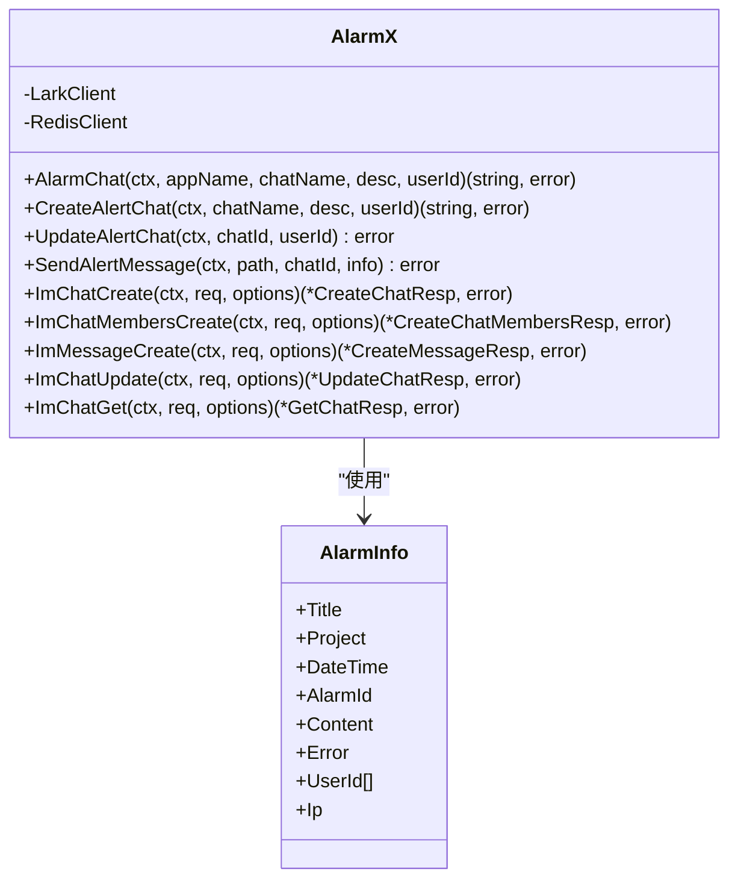
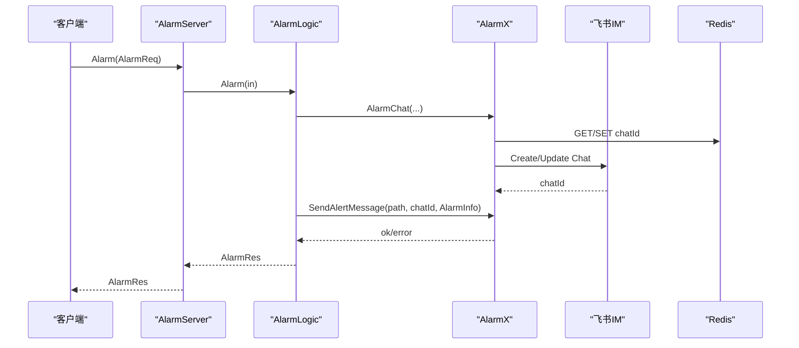
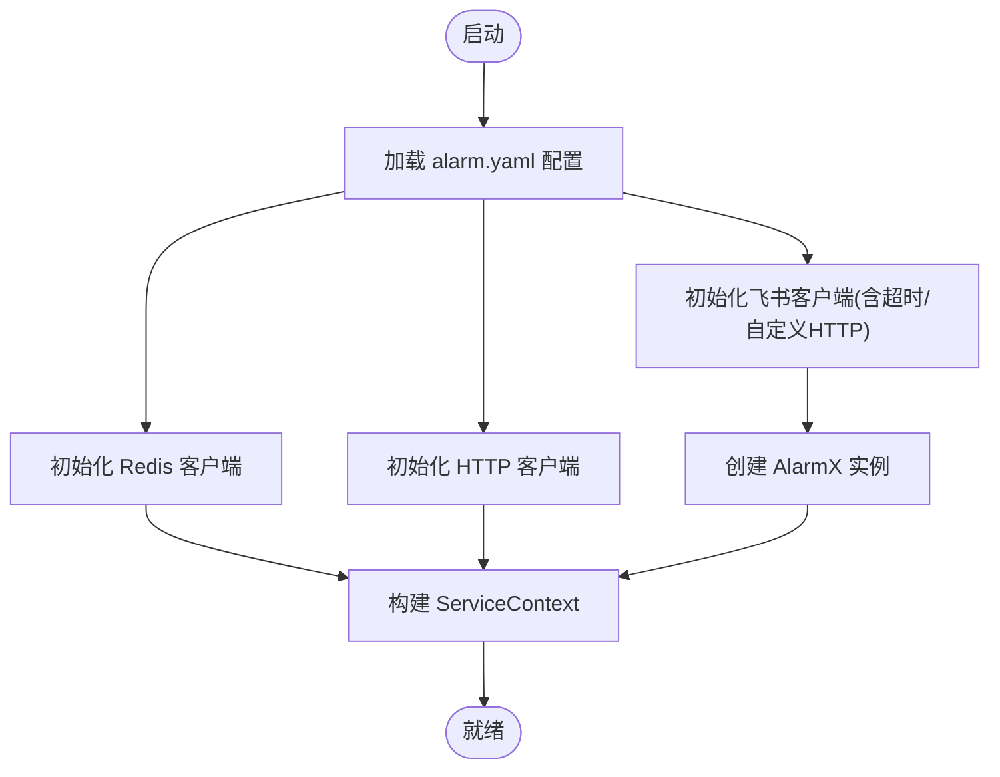
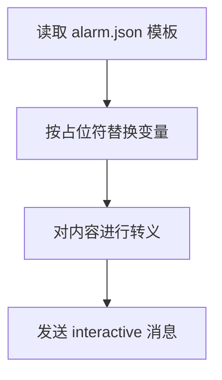
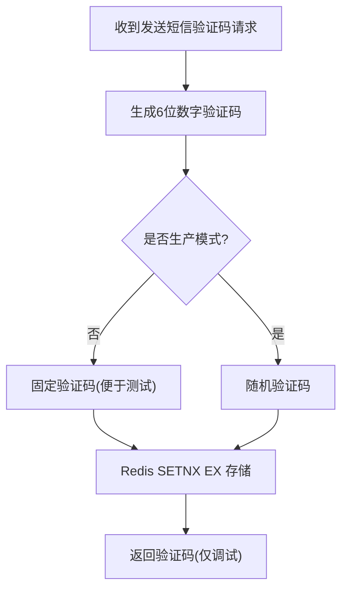
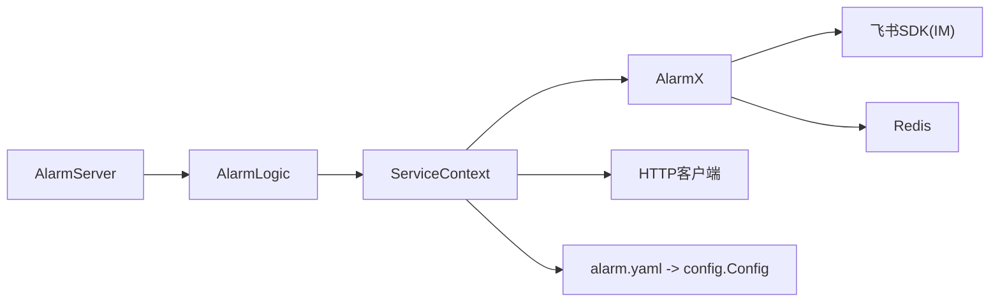
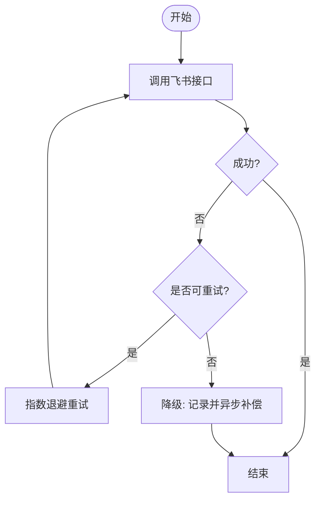

# 告警通知机制

<cite>
**本文档引用的文件**
- [common/alarmx/alarmx.go](file://common/alarmx/alarmx.go)
- [app/alarm/etc/alarm.yaml](file://app/alarm/etc/alarm.yaml)
- [app/alarm/internal/config/config.go](file://app/alarm/internal/config/config.go)
- [app/alarm/internal/logic/alarmlogic.go](file://app/alarm/internal/logic/alarmlogic.go)
- [app/alarm/internal/server/alarmserver.go](file://app/alarm/internal/server/alarmserver.go)
- [app/alarm/internal/svc/servicecontext.go](file://app/alarm/internal/svc/servicecontext.go)
- [app/alarm/alarm.proto](file://app/alarm/alarm.proto)
- [app/alarm/alarm.json](file://app/alarm/alarm.json)
- [zerorpc/internal/logic/sendsmsverifycodelogic.go](file://zerorpc/internal/logic/sendsmsverifycodelogic.go)
</cite>

## 目录
1. [简介](#简介)
2. [项目结构](#项目结构)
3. [核心组件](#核心组件)
4. [架构总览](#架构总览)
5. [组件详解](#组件详解)
6. [依赖关系分析](#依赖关系分析)
7. [性能与容量](#性能与容量)
8. [故障处理与降级](#故障处理与降级)
9. [排障指南](#排障指南)
10. [结论](#结论)

## 简介
本文件面向“告警通知机制”的技术文档，聚焦于多渠道告警通知在本仓库中的实现与集成方式。当前工程中已实现基于飞书工作台的告警通知通道，支持：
- 告警群聊的自动创建与成员维护
- 基于交互式卡片的消息发送
- 回执与状态变更（如“已解决”“跟进中”）的示例处理

同时，仓库还提供了短信验证码发送逻辑，可作为短信通知能力的参考实现。本文将从架构、流程、配置、模板、状态跟踪、重试与降级等方面进行系统化说明，并给出性能与成本优化建议。

## 项目结构
告警通知相关模块主要分布在以下位置：
- 通用告警封装：common/alarmx
- 告警 RPC 服务：app/alarm
- 短信验证码服务：zerorpc（短信能力参考）

**图表来源**
- [app/alarm/alarm.proto:1-34](file://app/alarm/alarm.proto#L1-L34)
- [app/alarm/internal/logic/alarmlogic.go:1-184](file://app/alarm/internal/logic/alarmlogic.go#L1-L184)
- [app/alarm/internal/server/alarmserver.go:1-35](file://app/alarm/internal/server/alarmserver.go#L1-L35)
- [app/alarm/internal/svc/servicecontext.go:1-33](file://app/alarm/internal/svc/servicecontext.go#L1-L33)
- [app/alarm/etc/alarm.yaml:1-26](file://app/alarm/etc/alarm.yaml#L1-L26)
- [app/alarm/internal/config/config.go:1-16](file://app/alarm/internal/config/config.go#L1-L16)
- [app/alarm/alarm.json:1-75](file://app/alarm/alarm.json#L1-L75)
- [common/alarmx/alarmx.go:1-223](file://common/alarmx/alarmx.go#L1-L223)
- [zerorpc/internal/logic/sendsmsverifycodelogic.go:1-43](file://zerorpc/internal/logic/sendsmsverifycodelogic.go#L1-L43)

**章节来源**
- [app/alarm/etc/alarm.yaml:1-26](file://app/alarm/etc/alarm.yaml#L1-L26)
- [app/alarm/internal/config/config.go:1-16](file://app/alarm/internal/config/config.go#L1-L16)
- [app/alarm/internal/svc/servicecontext.go:1-33](file://app/alarm/internal/svc/servicecontext.go#L1-L33)
- [common/alarmx/alarmx.go:1-223](file://common/alarmx/alarmx.go#L1-L223)
- [app/alarm/alarm.json:1-75](file://app/alarm/alarm.json#L1-L75)
- [zerorpc/internal/logic/sendsmsverifycodelogic.go:1-43](file://zerorpc/internal/logic/sendsmsverifycodelogic.go#L1-L43)

## 核心组件
- 告警信息模型：用于承载告警标题、项目、时间、ID、内容、错误、IP、用户ID等字段。
- 告警封装类：负责与飞书 IM 接口对接，完成群聊创建/更新、消息发送、卡片构建与转义。
- 告警 RPC 服务：接收外部告警请求，组装告警信息，调用告警封装类执行通知。
- 服务上下文：初始化 Redis、HTTP 客户端、飞书客户端，并注入到逻辑层。
- 配置与模板：通过 YAML 配置 appId/secret、加密参数、默认用户列表与卡片模板路径；通过 JSON 模板渲染交互式卡片。

**章节来源**
- [common/alarmx/alarmx.go:18-27](file://common/alarmx/alarmx.go#L18-L27)
- [common/alarmx/alarmx.go:29-32](file://common/alarmx/alarmx.go#L29-L32)
- [app/alarm/internal/logic/alarmlogic.go:17-29](file://app/alarm/internal/logic/alarmlogic.go#L17-L29)
- [app/alarm/internal/svc/servicecontext.go:13-18](file://app/alarm/internal/svc/servicecontext.go#L13-L18)
- [app/alarm/etc/alarm.yaml:18-25](file://app/alarm/etc/alarm.yaml#L18-L25)
- [app/alarm/alarm.json:1-75](file://app/alarm/alarm.json#L1-L75)

## 架构总览
告警通知的整体调用链如下：

**图表来源**
- [app/alarm/internal/server/alarmserver.go:31-34](file://app/alarm/internal/server/alarmserver.go#L31-L34)
- [app/alarm/internal/logic/alarmlogic.go:31-63](file://app/alarm/internal/logic/alarmlogic.go#L31-L63)
- [common/alarmx/alarmx.go:53-76](file://common/alarmx/alarmx.go#L53-L76)
- [common/alarmx/alarmx.go:119-140](file://common/alarmx/alarmx.go#L119-L140)
- [app/alarm/alarm.json:1-75](file://app/alarm/alarm.json#L1-L75)
- [app/alarm/internal/svc/servicecontext.go:26-31](file://app/alarm/internal/svc/servicecontext.go#L26-L31)

## 组件详解

### 1) 告警封装类 AlarmX
- 职责
  - 管理告警群聊生命周期：查询/创建/更新
  - 发送交互式卡片消息
  - 构建卡片内容并进行安全转义
- 关键方法
  - AlarmChat：根据应用名+群名从 Redis 缓存读取 chatId，不存在则创建并写入缓存
  - CreateAlertChat / UpdateAlertChat：调用飞书 IM 接口创建或新增成员
  - SendAlertMessage：读取模板 JSON，替换变量，发送 interactive 消息
  - buildCard：读取模板文件，按占位符替换标题、项目、时间、ID、内容、错误、IP、按钮名等
  - EscapeString：对内容进行安全转义，防止日志注入与渲染异常
- 依赖
  - 飞书 SDK（IM Chat/Message）
  - Redis（缓存 chatId）
  - 自定义 HTTP 客户端适配（AlarmxHttpClient）

**图表来源**
- [common/alarmx/alarmx.go:29-32](file://common/alarmx/alarmx.go#L29-L32)
- [common/alarmx/alarmx.go:18-27](file://common/alarmx/alarmx.go#L18-L27)
- [common/alarmx/alarmx.go:53-76](file://common/alarmx/alarmx.go#L53-L76)
- [common/alarmx/alarmx.go:119-140](file://common/alarmx/alarmx.go#L119-L140)

**章节来源**
- [common/alarmx/alarmx.go:1-223](file://common/alarmx/alarmx.go#L1-L223)

### 2) 告警 RPC 服务
- 服务定义：通过 proto 定义 Alarm 服务，包含 Ping 与 Alarm 两个方法
- 服务端实现：AlarmServer 将请求委派给 Logic 层
- 逻辑层处理：
  - 合并默认用户并去重
  - 生成带模式后缀的群名
  - 调用 AlarmX 执行群聊与消息发送
  - 示例：支持消息回调与卡片动作的注册（注释掉，便于扩展）

**图表来源**
- [app/alarm/alarm.proto:30-33](file://app/alarm/alarm.proto#L30-L33)
- [app/alarm/internal/server/alarmserver.go:31-34](file://app/alarm/internal/server/alarmserver.go#L31-L34)
- [app/alarm/internal/logic/alarmlogic.go:31-63](file://app/alarm/internal/logic/alarmlogic.go#L31-L63)
- [common/alarmx/alarmx.go:53-76](file://common/alarmx/alarmx.go#L53-L76)
- [common/alarmx/alarmx.go:119-140](file://common/alarmx/alarmx.go#L119-L140)

**章节来源**
- [app/alarm/alarm.proto:1-34](file://app/alarm/alarm.proto#L1-L34)
- [app/alarm/internal/server/alarmserver.go:1-35](file://app/alarm/internal/server/alarmserver.go#L1-L35)
- [app/alarm/internal/logic/alarmlogic.go:1-184](file://app/alarm/internal/logic/alarmlogic.go#L1-L184)

### 3) 服务上下文与配置
- ServiceContext 初始化：
  - Redis 客户端
  - HTTP 客户端
  - 飞书客户端（设置超时与自定义 HTTP 客户端）
  - AlarmX 实例
- 配置项：
  - Redis 连接参数
  - 飞书 AppId/AppSecret/EncryptKey/VerificationToken
  - 默认用户列表
  - 卡片模板路径

**图表来源**
- [app/alarm/etc/alarm.yaml:8-25](file://app/alarm/etc/alarm.yaml#L8-L25)
- [app/alarm/internal/config/config.go:5-14](file://app/alarm/internal/config/config.go#L5-L14)
- [app/alarm/internal/svc/servicecontext.go:20-32](file://app/alarm/internal/svc/servicecontext.go#L20-L32)

**章节来源**
- [app/alarm/etc/alarm.yaml:1-26](file://app/alarm/etc/alarm.yaml#L1-L26)
- [app/alarm/internal/config/config.go:1-16](file://app/alarm/internal/config/config.go#L1-L16)
- [app/alarm/internal/svc/servicecontext.go:1-33](file://app/alarm/internal/svc/servicecontext.go#L1-L33)

### 4) 通知模板与变量替换
- 模板来源：JSON 文件，定义卡片头部、元素与字段
- 变量替换：buildCard 读取模板，将占位符替换为 AlarmInfo 字段
- 安全转义：EscapeString 对内容进行转义，避免日志与渲染问题

**图表来源**
- [app/alarm/alarm.json:1-75](file://app/alarm/alarm.json#L1-L75)
- [common/alarmx/alarmx.go:163-184](file://common/alarmx/alarmx.go#L163-L184)

**章节来源**
- [app/alarm/alarm.json:1-75](file://app/alarm/alarm.json#L1-L75)
- [common/alarmx/alarmx.go:163-184](file://common/alarmx/alarmx.go#L163-L184)

### 5) 短信通知能力参考
- 当前仓库未直接提供“短信通知”RPC，但提供了“发送短信验证码”的逻辑，可作为短信通道能力的参考实现
- 关键点：随机数生成、Redis 缓存键规则、环境开关（非生产模式固定验证码）、返回验证码（调试用途）

**图表来源**
- [zerorpc/internal/logic/sendsmsverifycodelogic.go:29-42](file://zerorpc/internal/logic/sendsmsverifycodelogic.go#L29-L42)

**章节来源**
- [zerorpc/internal/logic/sendsmsverifycodelogic.go:1-43](file://zerorpc/internal/logic/sendsmsverifycodelogic.go#L1-L43)

## 依赖关系分析
- AlarmServer 依赖 Logic
- Logic 依赖 ServiceContext
- ServiceContext 依赖 AlarmX
- AlarmX 依赖飞书 SDK、Redis、HTTP 客户端
- 配置由 alarm.yaml 提供，经 config.Config 映射

**图表来源**
- [app/alarm/internal/server/alarmserver.go:15-24](file://app/alarm/internal/server/alarmserver.go#L15-L24)
- [app/alarm/internal/logic/alarmlogic.go:23-29](file://app/alarm/internal/logic/alarmlogic.go#L23-L29)
- [app/alarm/internal/svc/servicecontext.go:20-32](file://app/alarm/internal/svc/servicecontext.go#L20-L32)
- [app/alarm/etc/alarm.yaml:1-26](file://app/alarm/etc/alarm.yaml#L1-L26)
- [app/alarm/internal/config/config.go:5-14](file://app/alarm/internal/config/config.go#L5-L14)

**章节来源**
- [app/alarm/internal/server/alarmserver.go:1-35](file://app/alarm/internal/server/alarmserver.go#L1-L35)
- [app/alarm/internal/logic/alarmlogic.go:1-184](file://app/alarm/internal/logic/alarmlogic.go#L1-L184)
- [app/alarm/internal/svc/servicecontext.go:1-33](file://app/alarm/internal/svc/servicecontext.go#L1-L33)
- [app/alarm/etc/alarm.yaml:1-26](file://app/alarm/etc/alarm.yaml#L1-L26)
- [app/alarm/internal/config/config.go:1-16](file://app/alarm/internal/config/config.go#L1-L16)

## 性能与容量
- 并发与超时
  - 飞书客户端设置了请求超时，避免阻塞
  - 建议在高并发场景下增加连接池与限流策略
- 缓存命中
  - 使用 Redis 缓存 chatId，减少重复创建群聊的开销
  - 建议对模板内容也做本地缓存，降低磁盘 IO
- 模板渲染
  - JSON 模板一次性读取与替换，建议对大模板进行分块或懒加载
- 日志与转义
  - EscapeString 保证日志安全，避免大文本导致的性能损耗
- 成本优化
  - 控制群聊数量与成员规模，合理设置缓存过期时间
  - 在非生产环境固定验证码，减少短信通道调用

**章节来源**
- [app/alarm/internal/svc/servicecontext.go:26-31](file://app/alarm/internal/svc/servicecontext.go#L26-L31)
- [common/alarmx/alarmx.go:64-64](file://common/alarmx/alarmx.go#L64-L64)
- [app/alarm/alarm.json:1-75](file://app/alarm/alarm.json#L1-L75)
- [zerorpc/internal/logic/sendsmsverifycodelogic.go:31-33](file://zerorpc/internal/logic/sendsmsverifycodelogic.go#L31-L33)

## 故障处理与降级
- 请求失败
  - 飞书接口失败：返回错误码，上层可根据错误类型决定是否重试
  - Redis 异常：可降级为不缓存 chatId，直接走创建流程（需注意群重复创建风险）
- 重试策略
  - 建议对网络抖动与临时错误采用指数退避重试
  - 对明确的业务错误（如参数校验失败）不建议重试
- 降级方案
  - 通知通道不可用时，记录告警并落库，后续异步补偿
  - 短信通道不可用时，可切换到其他通道或延迟队列
- 回执与状态
  - 已实现消息回执与卡片动作示例（注释），可扩展为“已解决/跟进中”状态管理与回执确认

**图表来源**
- [common/alarmx/alarmx.go:132-139](file://common/alarmx/alarmx.go#L132-L139)
- [app/alarm/internal/logic/alarmlogic.go:49-61](file://app/alarm/internal/logic/alarmlogic.go#L49-L61)

**章节来源**
- [common/alarmx/alarmx.go:132-139](file://common/alarmx/alarmx.go#L132-L139)
- [app/alarm/internal/logic/alarmlogic.go:49-61](file://app/alarm/internal/logic/alarmlogic.go#L49-L61)

## 排障指南
- 飞书鉴权失败
  - 检查 appId、secret、EncryptKey、VerificationToken 是否正确
  - 确认 HTTP 客户端已注入自定义实现
- 群聊创建失败
  - 查看返回的错误码，确认用户权限与群名唯一性
  - 检查 Redis 是否可用，缓存是否过期
- 消息发送失败
  - 检查模板路径与占位符是否匹配
  - 查看 EscapeString 是否导致内容异常
- 短信验证码异常
  - 非生产模式固定验证码，属预期行为
  - Redis SETNX EX 失败时检查键冲突与过期时间

**章节来源**
- [app/alarm/etc/alarm.yaml:18-25](file://app/alarm/etc/alarm.yaml#L18-L25)
- [app/alarm/internal/svc/servicecontext.go:26-31](file://app/alarm/internal/svc/servicecontext.go#L26-L31)
- [common/alarmx/alarmx.go:88-96](file://common/alarmx/alarmx.go#L88-L96)
- [common/alarmx/alarmx.go:132-139](file://common/alarmx/alarmx.go#L132-L139)
- [zerorpc/internal/logic/sendsmsverifycodelogic.go:34-38](file://zerorpc/internal/logic/sendsmsverifycodelogic.go#L34-L38)

## 结论
本告警通知机制以飞书 IM 为核心通道，结合 Redis 缓存与交互式卡片模板，实现了告警群聊的自动化与消息的结构化展示。通过 ServiceContext 的集中初始化与 AlarmX 的封装，整体具备良好的可扩展性。对于短信等其他通道，可参考短信验证码逻辑进行接入。建议在生产环境中完善重试、降级与回执确认机制，并对模板与缓存进行性能优化与容量评估。