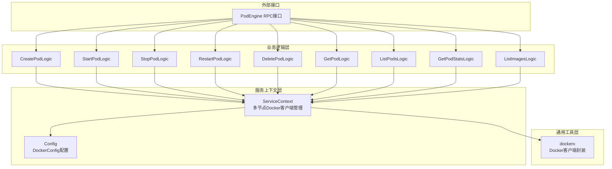
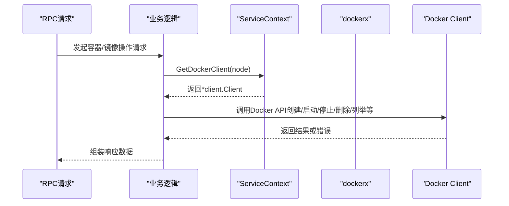
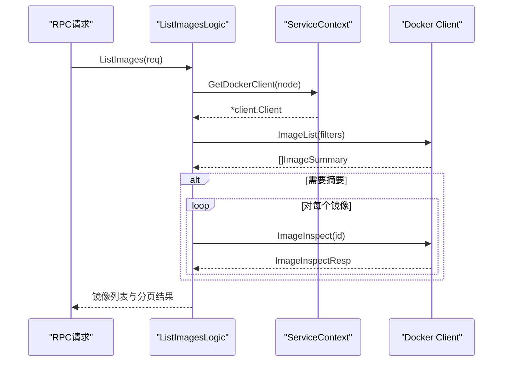
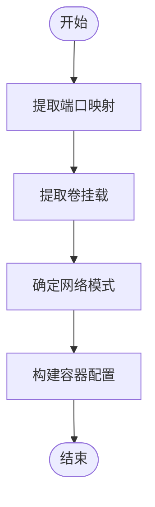
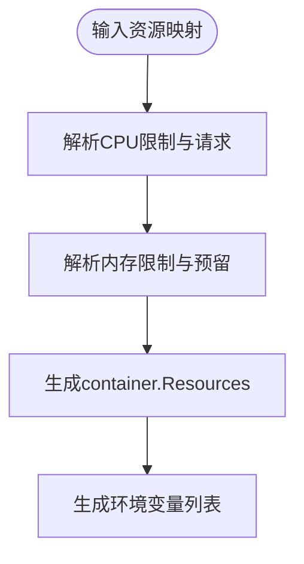
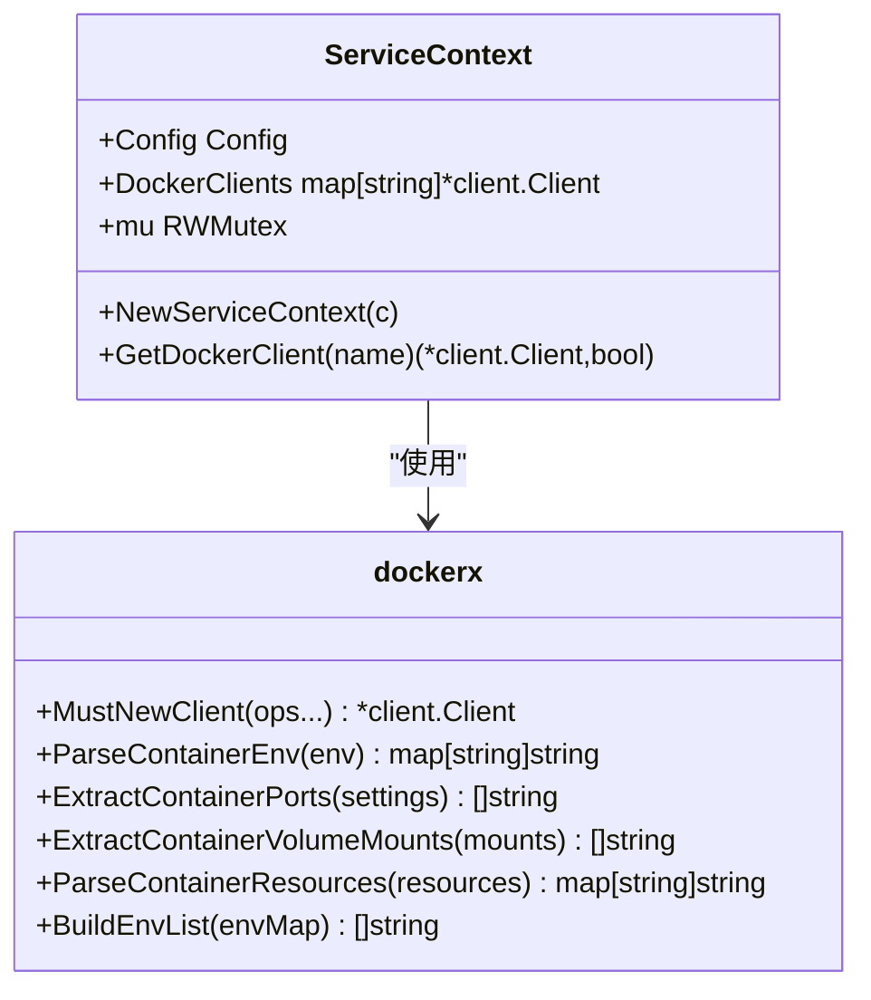
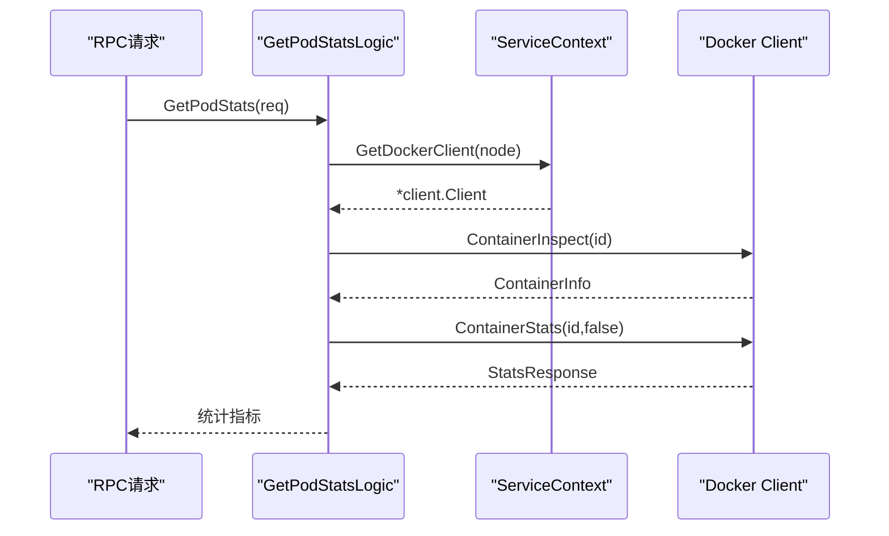
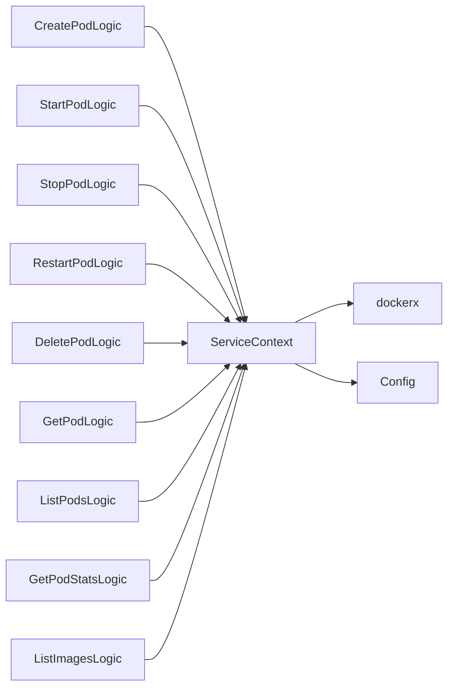

# Docker客户端封装

<cite>
**本文档引用的文件**
- [common/dockerx/dockerx.go](file://common/dockerx/dockerx.go)
- [app/podengine/internal/svc/servicecontext.go](file://app/podengine/internal/svc/servicecontext.go)
- [app/podengine/internal/config/config.go](file://app/podengine/internal/config/config.go)
- [app/podengine/internal/logic/createpodlogic.go](file://app/podengine/internal/logic/createpodlogic.go)
- [app/podengine/internal/logic/startpodlogic.go](file://app/podengine/internal/logic/startpodlogic.go)
- [app/podengine/internal/logic/stoppodlogic.go](file://app/podengine/internal/logic/stoppodlogic.go)
- [app/podengine/internal/logic/restartpodlogic.go](file://app/podengine/internal/logic/restartpodlogic.go)
- [app/podengine/internal/logic/deletepodlogic.go](file://app/podengine/internal/logic/deletepodlogic.go)
- [app/podengine/internal/logic/getpodlogic.go](file://app/podengine/internal/logic/getpodlogic.go)
- [app/podengine/internal/logic/listpodslogic.go](file://app/podengine/internal/logic/listpodslogic.go)
- [app/podengine/internal/logic/getpodstatslogic.go](file://app/podengine/internal/logic/getpodstatslogic.go)
- [app/podengine/internal/logic/listimageslogic.go](file://app/podengine/internal/logic/listimageslogic.go)
- [util/dockeru/main.go](file://util/dockeru/main.go)
</cite>

## 目录
1. [简介](#简介)
2. [项目结构](#项目结构)
3. [核心组件](#核心组件)
4. [架构总览](#架构总览)
5. [详细组件分析](#详细组件分析)
6. [依赖关系分析](#依赖关系分析)
7. [性能考量](#性能考量)
8. [故障排查指南](#故障排查指南)
9. [结论](#结论)
10. [附录](#附录)

## 简介
本技术文档围绕仓库中的Docker客户端封装组件展开，系统性介绍基于Go语言对Docker API的封装实现，涵盖容器生命周期管理（创建、启动、停止、重启、删除）、镜像管理（列举、查看详情）、资源与网络信息提取、以及连接管理与错误处理策略。文档同时提供关键流程的时序图与类图，帮助读者快速理解代码结构与调用关系。

## 项目结构
该封装位于通用工具层与业务服务层之间，形成“通用Docker工具 + PodEngine服务 + 业务逻辑”的分层结构：
- 通用工具层：提供Docker客户端实例化、环境变量解析、端口与卷挂载提取、资源解析等通用能力。
- 服务上下文层：集中管理多节点Docker客户端实例，支持本地与远端主机。
- 业务逻辑层：以Pod为抽象，封装容器生命周期、镜像管理、统计查询等操作。



图表来源
- [app/podengine/internal/svc/servicecontext.go:11-50](file://app/podengine/internal/svc/servicecontext.go#L11-L50)
- [app/podengine/internal/config/config.go:5-17](file://app/podengine/internal/config/config.go#L5-L17)
- [common/dockerx/dockerx.go:11-18](file://common/dockerx/dockerx.go#L11-L18)

章节来源
- [app/podengine/internal/svc/servicecontext.go:11-50](file://app/podengine/internal/svc/servicecontext.go#L11-L50)
- [app/podengine/internal/config/config.go:5-17](file://app/podengine/internal/config/config.go#L5-L17)

## 核心组件
- Docker客户端工厂与追踪集成
  - 提供MustNewClient函数，自动注入OpenTelemetry追踪提供者，确保Docker API调用具备可观测性。
- 容器信息解析与转换
  - 环境变量解析、端口映射提取、卷挂载解析、资源限制解析与反向生成。
- 多节点Docker客户端管理
  - 支持本地与多个远端Docker主机，按节点名获取对应客户端实例，线程安全读写锁保护。

章节来源
- [common/dockerx/dockerx.go:11-18](file://common/dockerx/dockerx.go#L11-L18)
- [common/dockerx/dockerx.go:20-33](file://common/dockerx/dockerx.go#L20-L33)
- [common/dockerx/dockerx.go:35-56](file://common/dockerx/dockerx.go#L35-L56)
- [common/dockerx/dockerx.go:58-86](file://common/dockerx/dockerx.go#L58-L86)
- [common/dockerx/dockerx.go:88-94](file://common/dockerx/dockerx.go#L88-L94)
- [app/podengine/internal/svc/servicecontext.go:11-50](file://app/podengine/internal/svc/servicecontext.go#L11-L50)

## 架构总览
下图展示了PodEngine服务如何通过ServiceContext统一管理Docker客户端，并在各业务逻辑中进行容器与镜像操作：



图表来源
- [app/podengine/internal/svc/servicecontext.go:42-50](file://app/podengine/internal/svc/servicecontext.go#L42-L50)
- [common/dockerx/dockerx.go:11-18](file://common/dockerx/dockerx.go#L11-L18)

## 详细组件分析

### 容器生命周期管理
- 创建容器
  - 解析容器规格，构造container.Config、container.HostConfig、network.NetworkingConfig。
  - 支持端口绑定、资源限制、卷挂载、重启策略、网络模式等。
  - 创建后立即检查容器信息，填充Pod结构返回。
- 启动容器
  - 调用ContainerStart，随后ContainerInspect获取最新状态并组装响应。
- 停止容器
  - 调用ContainerStop，再Inspect确认状态。
- 重启容器
  - 调用ContainerRestart，随后Inspect组装响应。
- 删除容器
  - 支持强制删除与是否移除卷，调用ContainerRemove。

```mermaid
sequenceDiagram
participant API as "RPC请求"
participant Create as "CreatePodLogic"
participant SC as "ServiceContext"
participant DC as "Docker Client"
API->>Create : CreatePod(req)
Create->>SC : GetDockerClient(node)
SC-->>Create : *client.Client
Create->>DC : ContainerCreate(config, hostConfig, ...)
DC-->>Create : ContainerCreateResp
Create->>DC : ContainerInspect(resp.ID)
DC-->>Create : ContainerInfo
Create-->>API : Pod结构
```

图表来源
- [app/podengine/internal/logic/createpodlogic.go:34-152](file://app/podengine/internal/logic/createpodlogic.go#L34-L152)

章节来源
- [app/podengine/internal/logic/createpodlogic.go:34-152](file://app/podengine/internal/logic/createpodlogic.go#L34-L152)
- [app/podengine/internal/logic/startpodlogic.go:29-87](file://app/podengine/internal/logic/startpodlogic.go#L29-L87)
- [app/podengine/internal/logic/stoppodlogic.go:28-48](file://app/podengine/internal/logic/stoppodlogic.go#L28-L48)
- [app/podengine/internal/logic/restartpodlogic.go:30-83](file://app/podengine/internal/logic/restartpodlogic.go#L30-L83)
- [app/podengine/internal/logic/deletepodlogic.go:28-49](file://app/podengine/internal/logic/deletepodlogic.go#L28-L49)

### 镜像管理
- 列举镜像
  - 支持按引用过滤、分页、可选包含摘要信息。
  - 可选调用ImageInspect获取摘要列表。
- 镜像详情
  - 通过ImageInspect获取镜像摘要、标签、大小、创建时间等。



图表来源
- [app/podengine/internal/logic/listimageslogic.go:30-110](file://app/podengine/internal/logic/listimageslogic.go#L30-L110)

章节来源
- [app/podengine/internal/logic/listimageslogic.go:30-110](file://app/podengine/internal/logic/listimageslogic.go#L30-L110)

### 网络与卷挂载
- 端口映射
  - 支持从容器配置中提取端口绑定，生成人类可读的端口描述。
- 卷挂载
  - 支持从容器挂载点提取卷挂载信息，区分读写模式。
- 网络模式
  - 支持host、none、bridge及自定义网络名；创建时根据规格动态选择。



图表来源
- [common/dockerx/dockerx.go:35-56](file://common/dockerx/dockerx.go#L35-L56)
- [app/podengine/internal/logic/createpodlogic.go:62-76](file://app/podengine/internal/logic/createpodlogic.go#L62-L76)

章节来源
- [common/dockerx/dockerx.go:35-56](file://common/dockerx/dockerx.go#L35-L56)
- [app/podengine/internal/logic/createpodlogic.go:62-76](file://app/podengine/internal/logic/createpodlogic.go#L62-L76)

### 资源限制与解析
- CPU配额与份额
  - 将CPU限制转换为Docker的CPUQuota/CPU周期，将CPU请求转换为CPUShares。
- 内存限制与预留
  - 支持字节数与单位（K/M/G/T）解析，分别设置Memory与MemoryReservation。
- 反向生成环境变量列表
  - 将键值对映射还原为“KEY=VALUE”列表，便于传递给Docker API。



图表来源
- [common/dockerx/dockerx.go:58-86](file://common/dockerx/dockerx.go#L58-L86)
- [common/dockerx/dockerx.go:88-94](file://common/dockerx/dockerx.go#L88-L94)
- [app/podengine/internal/logic/createpodlogic.go:189-222](file://app/podengine/internal/logic/createpodlogic.go#L189-L222)

章节来源
- [common/dockerx/dockerx.go:58-86](file://common/dockerx/dockerx.go#L58-L86)
- [common/dockerx/dockerx.go:88-94](file://common/dockerx/dockerx.go#L88-L94)
- [app/podengine/internal/logic/createpodlogic.go:189-222](file://app/podengine/internal/logic/createpodlogic.go#L189-L222)

### 连接管理与认证
- 客户端初始化
  - 通过MustNewClient创建客户端，自动注入OTel追踪提供者。
  - 支持client.FromEnv与API版本协商，适配不同Docker守护进程版本。
- 多节点客户端
  - ServiceContext集中管理多节点客户端，支持本地与远端主机。
  - 通过DockerConfig配置节点名与Docker主机地址，按需创建客户端实例。
- 认证机制
  - 通过client.FromEnv自动读取DOCKER_*环境变量完成认证。
  - 远端主机通过client.WithHost(host)指定连接地址。



图表来源
- [app/podengine/internal/svc/servicecontext.go:11-50](file://app/podengine/internal/svc/servicecontext.go#L11-L50)
- [common/dockerx/dockerx.go:11-18](file://common/dockerx/dockerx.go#L11-L18)

章节来源
- [app/podengine/internal/svc/servicecontext.go:18-40](file://app/podengine/internal/svc/servicecontext.go#L18-L40)
- [app/podengine/internal/config/config.go:16-16](file://app/podengine/internal/config/config.go#L16-L16)
- [common/dockerx/dockerx.go:11-18](file://common/dockerx/dockerx.go#L11-L18)

### 错误处理策略
- 业务逻辑层
  - 对请求参数进行校验，节点不存在、Docker API调用失败均返回明确错误。
  - 对容器Inspect失败、API调用失败进行日志记录与错误包装。
- 通用工具层
  - MustNewClient在创建客户端失败时panic，确保上层尽早暴露问题。
- 建议
  - 在调用链上增加重试与超时控制，结合可观测性指标定位问题。

章节来源
- [app/podengine/internal/logic/createpodlogic.go:34-45](file://app/podengine/internal/logic/createpodlogic.go#L34-L45)
- [app/podengine/internal/logic/createpodlogic.go:107-117](file://app/podengine/internal/logic/createpodlogic.go#L107-L117)
- [app/podengine/internal/logic/getpodlogic.go:36-43](file://app/podengine/internal/logic/getpodlogic.go#L36-L43)
- [app/podengine/internal/logic/listpodslogic.go:61-68](file://app/podengine/internal/logic/listpodslogic.go#L61-L68)
- [common/dockerx/dockerx.go:14-17](file://common/dockerx/dockerx.go#L14-L17)

### 容器统计与监控
- 统计采集
  - 通过ContainerStats获取CPU、内存、网络、存储等指标。
  - 计算CPU使用率百分比、内存使用率百分比、网络收发字节、存储读写字节。
- 展示格式
  - 提供数值与可读字符串格式，便于前端展示。



图表来源
- [app/podengine/internal/logic/getpodstatslogic.go:32-134](file://app/podengine/internal/logic/getpodstatslogic.go#L32-L134)

章节来源
- [app/podengine/internal/logic/getpodstatslogic.go:32-134](file://app/podengine/internal/logic/getpodstatslogic.go#L32-L134)

### 常见操作与最佳实践
- 容器操作
  - 创建：设置镜像、环境、命令、标签、端口、资源、卷、网络、重启策略。
  - 启动/停止/重启：调用对应API后立即Inspect刷新状态。
  - 删除：支持强制删除与移除卷。
- 镜像操作
  - 列举：支持引用过滤、分页、可选包含摘要。
  - 保存：可参考util/dockeru工具链导出镜像为tar文件。
- 网络与卷
  - 端口映射：支持host:container/tcp格式。
  - 卷挂载：支持host:container[:ro]格式。
- 连接与超时
  - 建议在业务层引入context.WithTimeout控制Docker API调用超时。
  - 对关键操作（如ContainerStats）建议增加指数退避重试。
- 配置参数
  - DockerConfig中配置节点名与Docker主机地址，ServiceContext按需创建客户端。

章节来源
- [app/podengine/internal/logic/createpodlogic.go:154-170](file://app/podengine/internal/logic/createpodlogic.go#L154-L170)
- [app/podengine/internal/logic/createpodlogic.go:267-287](file://app/podengine/internal/logic/createpodlogic.go#L267-L287)
- [app/podengine/internal/logic/listimageslogic.go:41-47](file://app/podengine/internal/logic/listimageslogic.go#L41-L47)
- [util/dockeru/main.go:136-201](file://util/dockeru/main.go#L136-L201)

## 依赖关系分析
- 组件耦合
  - 业务逻辑依赖ServiceContext获取Docker客户端，解耦了具体连接细节。
  - dockerx提供纯函数式的解析与转换，降低业务逻辑复杂度。
- 外部依赖
  - Docker SDK for Go、OpenTelemetry、go-zero日志与时间库。
- 潜在风险
  - 多节点客户端并发访问需注意线程安全；建议在ServiceContext层面统一管理。



图表来源
- [app/podengine/internal/svc/servicecontext.go:11-50](file://app/podengine/internal/svc/servicecontext.go#L11-L50)
- [app/podengine/internal/logic/createpodlogic.go:42-42](file://app/podengine/internal/logic/createpodlogic.go#L42-L42)

章节来源
- [app/podengine/internal/svc/servicecontext.go:11-50](file://app/podengine/internal/svc/servicecontext.go#L11-L50)

## 性能考量
- 统计查询
  - ContainerStats非流式获取，适合周期性采样；建议控制采样频率，避免频繁调用。
- 列表查询
  - 使用filters减少返回数据量；合理设置分页参数。
- 资源解析
  - 环境变量与资源映射的解析为O(n)，建议缓存常用映射以减少重复计算。
- 并发与连接
  - 多节点客户端共享连接池；在高并发场景建议增加连接复用与限流策略。

## 故障排查指南
- 客户端创建失败
  - 检查DOCKER_HOST与认证环境变量是否正确；确认Docker守护进程可达。
- 节点不存在
  - 确认DockerConfig配置的节点名与实际一致；检查ServiceContext初始化逻辑。
- 容器创建失败
  - 检查镜像是否存在、端口冲突、资源限制是否合理、卷挂载路径权限。
- 容器状态异常
  - 通过ContainerInspect查看状态字段；结合日志定位启动失败原因。
- 镜像列举无结果
  - 检查引用过滤条件是否匹配；确认镜像标签与摘要是否包含。
- 统计信息缺失
  - 确认容器运行状态；检查Docker版本与API兼容性。

章节来源
- [common/dockerx/dockerx.go:14-17](file://common/dockerx/dockerx.go#L14-L17)
- [app/podengine/internal/svc/servicecontext.go:42-50](file://app/podengine/internal/svc/servicecontext.go#L42-L50)
- [app/podengine/internal/logic/createpodlogic.go:107-117](file://app/podengine/internal/logic/createpodlogic.go#L107-L117)
- [app/podengine/internal/logic/listimageslogic.go:53-55](file://app/podengine/internal/logic/listimageslogic.go#L53-L55)

## 结论
该Docker客户端封装以通用工具层与服务上下文为核心，向上提供清晰的容器与镜像管理能力。通过统一的客户端管理与可观测性集成，能够稳定支撑PodEngine服务的容器编排需求。建议在生产环境中补充超时与重试策略，并完善监控告警体系以提升稳定性与可维护性。

## 附录
- 实用工具
  - util/dockeru提供了镜像导出与容器管理的CLI辅助工具，便于运维与调试。

章节来源
- [util/dockeru/main.go:176-191](file://util/dockeru/main.go#L176-L191)