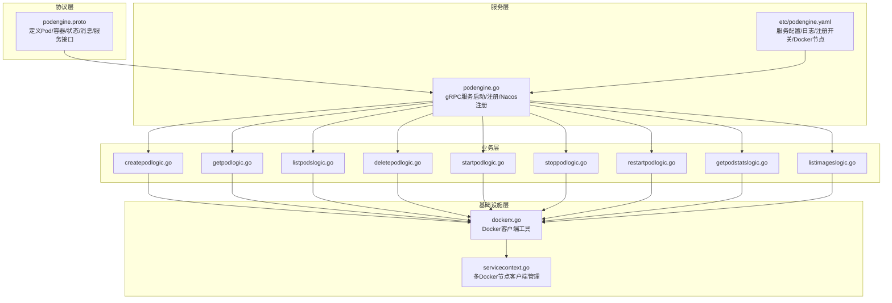
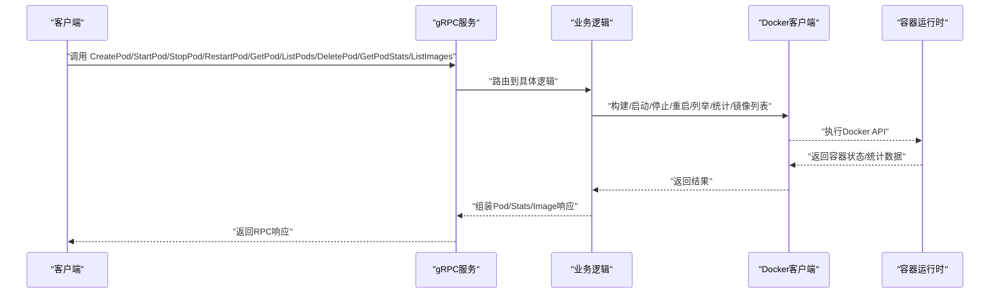
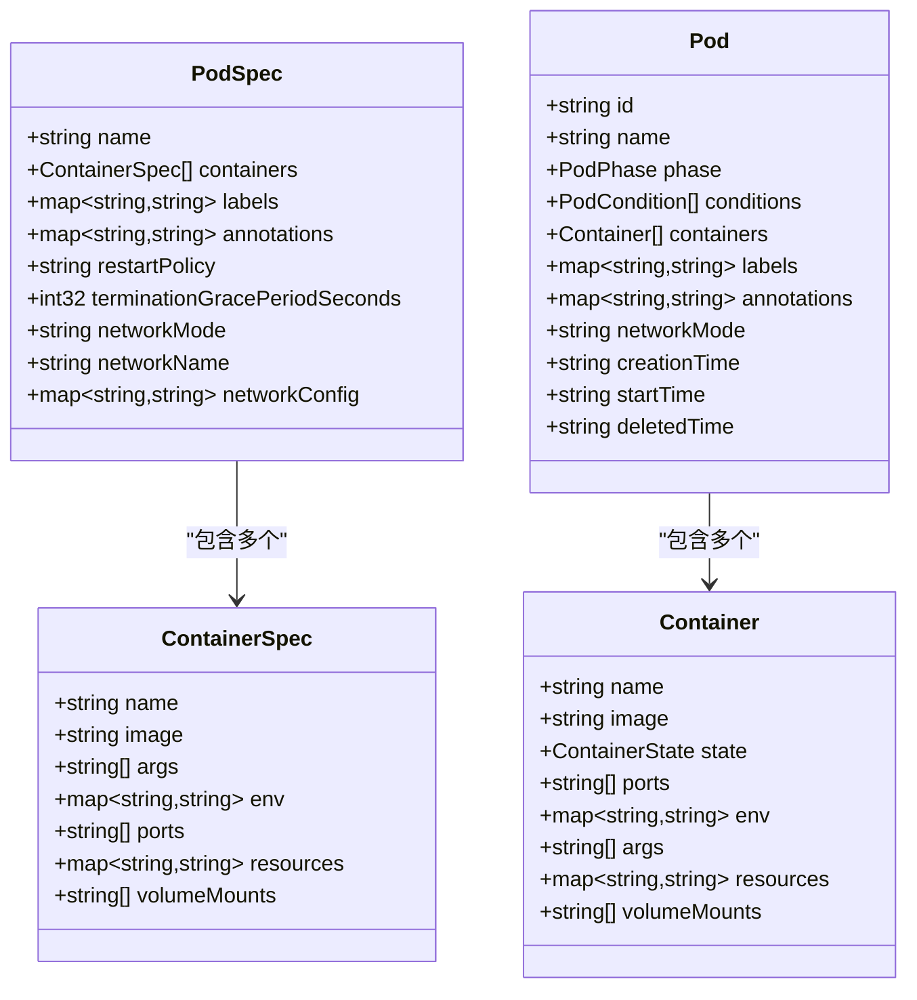
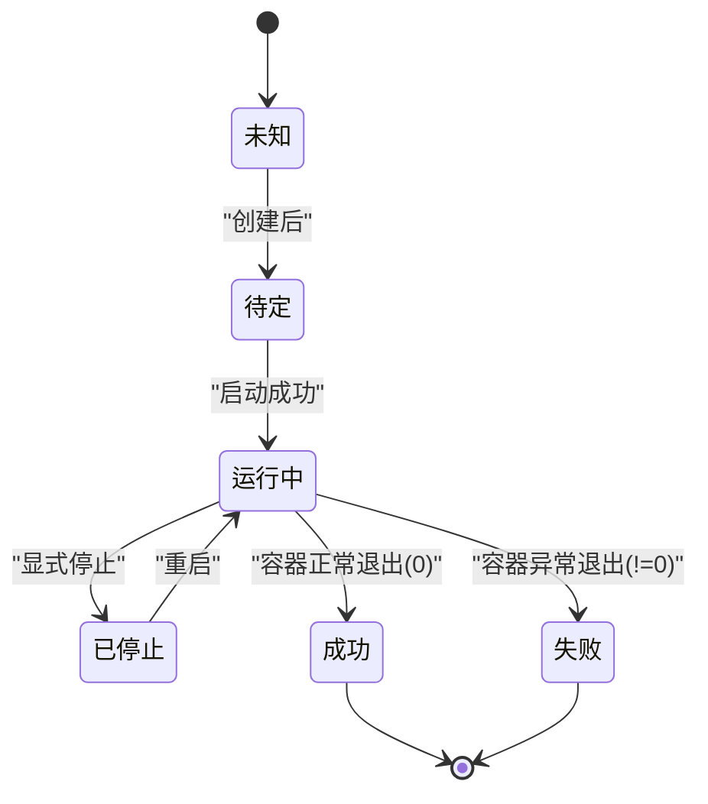
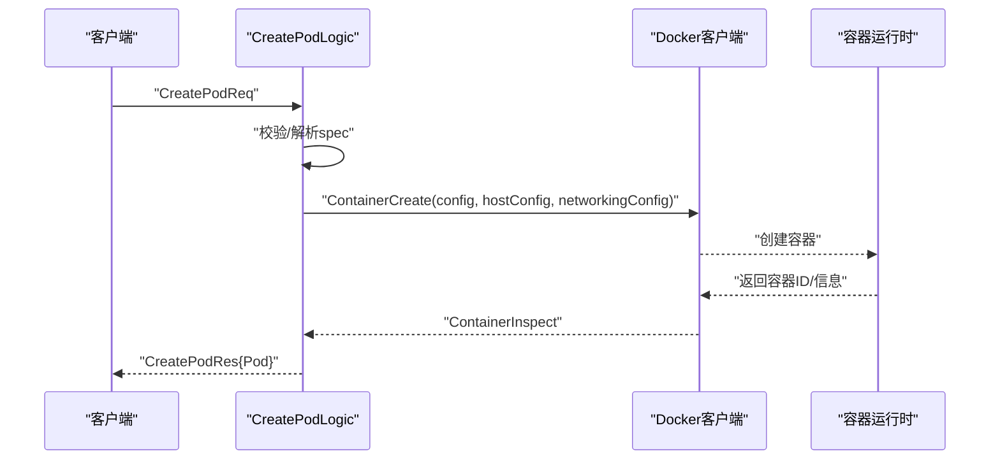
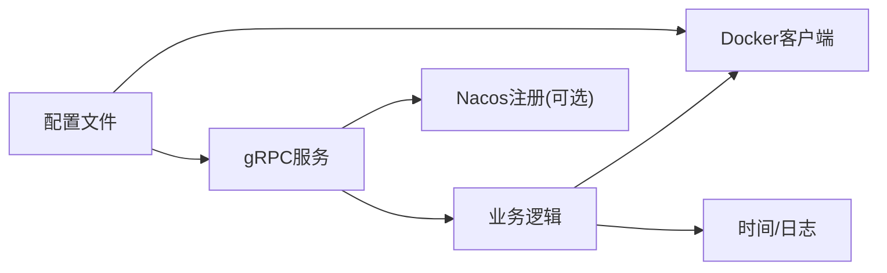

# Pod抽象模型

<cite>
**本文档引用的文件**
- [podengine.proto](file://app/podengine/podengine.proto)
- [podengine.go](file://app/podengine/podengine.go)
- [createpodlogic.go](file://app/podengine/internal/logic/createpodlogic.go)
- [getpodlogic.go](file://app/podengine/internal/logic/getpodlogic.go)
- [listpodslogic.go](file://app/podengine/internal/logic/listpodslogic.go)
- [deletepodlogic.go](file://app/podengine/internal/logic/deletepodlogic.go)
- [startpodlogic.go](file://app/podengine/internal/logic/startpodlogic.go)
- [stoppodlogic.go](file://app/podengine/internal/logic/stoppodlogic.go)
- [restartpodlogic.go](file://app/podengine/internal/logic/restartpodlogic.go)
- [getpodstatslogic.go](file://app/podengine/internal/logic/getpodstatslogic.go)
- [listimageslogic.go](file://app/podengine/internal/logic/listimageslogic.go)
- [dockerx.go](file://common/dockerx/dockerx.go)
- [servicecontext.go](file://app/podengine/internal/svc/servicecontext.go)
- [podengine.yaml](file://app/podengine/etc/podengine.yaml)
</cite>

## 目录
1. [引言](#引言)
2. [项目结构](#项目结构)
3. [核心组件](#核心组件)
4. [架构总览](#架构总览)
5. [详细组件分析](#详细组件分析)
6. [依赖分析](#依赖分析)
7. [性能考虑](#性能考虑)
8. [故障排查指南](#故障排查指南)
9. [结论](#结论)
10. [附录](#附录)

## 引言
本文件围绕Pod抽象模型进行系统化技术文档编制，目标是帮助读者从零理解并正确使用该仓库中的Pod抽象与Docker运行时之间的映射关系。内容涵盖：
- Pod在容器管理中的抽象理念与设计动机
- 数据结构定义、字段语义与约束
- Pod与Docker容器的映射关系（容器组、资源共享、网络隔离）
- Pod状态管理、生命周期事件与状态转换规则
- 配置模板、资源限制与环境变量的管理方式
- Pod创建、查询、更新、删除的完整流程
- 调度策略、高可用与性能优化建议
- 实际应用场景与最佳实践

## 项目结构
Pod引擎位于应用模块“app/podengine”，采用gRPC服务定义与Go逻辑实现分离的分层结构：
- 协议层：通过Protocol Buffers定义Pod、容器、状态、请求/响应消息与服务接口
- 服务层：gRPC服务器入口与配置加载、注册与服务发现
- 业务层：各RPC方法对应的逻辑实现（创建、启动、停止、重启、查询、列举、删除、统计、镜像列表）
- 基础设施层：Docker客户端封装与多节点连接管理

图表来源
- [podengine.proto:1-338](file://app/podengine/podengine.proto#L1-L338)
- [podengine.go:1-69](file://app/podengine/podengine.go#L1-L69)
- [createpodlogic.go:1-288](file://app/podengine/internal/logic/createpodlogic.go#L1-L288)
- [getpodlogic.go:1-117](file://app/podengine/internal/logic/getpodlogic.go#L1-L117)
- [listpodslogic.go:1-140](file://app/podengine/internal/logic/listpodslogic.go#L1-L140)
- [deletepodlogic.go:1-50](file://app/podengine/internal/logic/deletepodlogic.go#L1-L50)
- [startpodlogic.go:1-88](file://app/podengine/internal/logic/startpodlogic.go#L1-L88)
- [stoppodlogic.go:1-49](file://app/podengine/internal/logic/stoppodlogic.go#L1-L49)
- [restartpodlogic.go:1-84](file://app/podengine/internal/logic/restartpodlogic.go#L1-L84)
- [getpodstatslogic.go:1-134](file://app/podengine/internal/logic/getpodstatslogic.go#L1-L134)
- [listimageslogic.go:1-111](file://app/podengine/internal/logic/listimageslogic.go#L1-L111)
- [dockerx.go:1-95](file://common/dockerx/dockerx.go#L1-L95)
- [servicecontext.go:1-51](file://app/podengine/internal/svc/servicecontext.go#L1-L51)
- [podengine.yaml:1-20](file://app/podengine/etc/podengine.yaml#L1-L20)

章节来源
- [podengine.proto:1-338](file://app/podengine/podengine.proto#L1-L338)
- [podengine.go:1-69](file://app/podengine/podengine.go#L1-L69)
- [podengine.yaml:1-20](file://app/podengine/etc/podengine.yaml#L1-L20)

## 核心组件
- Pod与容器模型
  - Pod：系统中已创建或运行中的Pod实例，包含阶段、条件、容器列表、标签、注解、网络模式及时间戳等
  - Container：实际运行中的容器实例，包含名称、镜像、状态、端口、环境变量、启动参数、资源限制、卷挂载等
- Pod阶段与条件
  - PodPhase：UNKNOWN/PENDING/RUNNING/SUCCEEDED/FAILED/STOPPED
  - PodConditionType：POD_SCHEDULED/CONTAINERS_READY/INITIALIZED/READY
- 规格与期望状态
  - PodSpec：包含容器列表、标签、注解、重启策略、优雅终止时间、网络模式/名称/配置等
  - ContainerSpec：单容器规格，包含名称、镜像、args/env/ports/resources/volumeMounts
- RPC接口
  - CreatePod/StartPod/StopPod/RestartPod/GetPod/ListPods/DeletePod/GetPodStats/ListImages

章节来源
- [podengine.proto:33-178](file://app/podengine/podengine.proto#L33-L178)

## 架构总览
Pod引擎以gRPC为核心，统一对外暴露Pod生命周期管理能力。服务端根据请求选择对应逻辑处理，并通过Docker客户端对底层容器进行操作。配置文件支持本地与远程Docker守护进程，便于多节点调度。

图表来源
- [podengine.proto:16-26](file://app/podengine/podengine.proto#L16-L26)
- [podengine.go:37-43](file://app/podengine/podengine.go#L37-L43)
- [createpodlogic.go:34-152](file://app/podengine/internal/logic/createpodlogic.go#L34-L152)
- [getpodlogic.go:31-78](file://app/podengine/internal/logic/getpodlogic.go#L31-L78)
- [listpodslogic.go:31-124](file://app/podengine/internal/logic/listpodslogic.go#L31-L124)
- [deletepodlogic.go:28-49](file://app/podengine/internal/logic/deletepodlogic.go#L28-L49)
- [startpodlogic.go:29-87](file://app/podengine/internal/logic/startpodlogic.go#L29-L87)
- [stoppodlogic.go:28-48](file://app/podengine/internal/logic/stoppodlogic.go#L28-L48)
- [restartpodlogic.go:30-83](file://app/podengine/internal/logic/restartpodlogic.go#L30-L83)
- [getpodstatslogic.go:32-133](file://app/podengine/internal/logic/getpodstatslogic.go#L32-L133)
- [listimageslogic.go:30-110](file://app/podengine/internal/logic/listimageslogic.go#L30-L110)

## 详细组件分析

### 数据模型与字段语义
- Pod
  - 字段：id/name/phase/conditions/containers/labels/annotations/networkMode/creationTime/startTime/deletedTime
  - 语义：表示系统中一个Pod的观测状态；conditions用于表达调度、容器就绪、初始化、就绪等关键条件
- Container
  - 字段：name/image/state/ports/env/args/resources/volumeMounts
  - 语义：描述容器实例的当前状态与运行参数
- ContainerState
  - 字段：running/terminated/waiting/reason/message/startedTime/finishedTime/exitCode
  - 语义：容器的运行状态机快照
- PodSpec/ContainerSpec
  - 字段：name/containers/labels/annotations/restartPolicy/terminationGracePeriodSeconds/networkMode/networkName/networkConfig
  - 语义：期望状态的声明，支持多容器、网络模式与资源限制

章节来源
- [podengine.proto:33-178](file://app/podengine/podengine.proto#L33-L178)

### Pod与Docker容器的关系映射
- 容器组：PodSpec允许声明多个ContainerSpec，逻辑上形成“容器组”。当前实现中创建流程仅使用第一个容器规格进行创建，后续可扩展为多容器编排
- 共享资源：通过HostConfig与ContainerConfig映射，实现CPU/Memory限制、端口绑定、卷挂载、重启策略、网络模式等
- 网络隔离：支持bridge/host/none三种模式，以及自定义网络名称；网络配置通过NetworkingConfig传递给Docker

图表来源
- [podengine.proto:108-155](file://app/podengine/podengine.proto#L108-L155)
- [podengine.proto:163-178](file://app/podengine/podengine.proto#L163-L178)

章节来源
- [createpodlogic.go:49-106](file://app/podengine/internal/logic/createpodlogic.go#L49-L106)
- [dockerx.go:35-86](file://common/dockerx/dockerx.go#L35-L86)

### 状态管理与生命周期
- Pod阶段（PodPhase）：UNKNOWN/PENDING/RUNNING/SUCCEEDED/FAILED/STOPPED
- 条件（PodConditionType）：调度、容器就绪、初始化、就绪
- 生命周期事件：创建（Pending）、启动（Running）、停止（Stopped）、成功完成（Succeeded）、失败（Failed）

图表来源
- [podengine.proto:33-41](file://app/podengine/podengine.proto#L33-L41)
- [getpodlogic.go:80-95](file://app/podengine/internal/logic/getpodlogic.go#L80-L95)
- [listpodslogic.go:126-139](file://app/podengine/internal/logic/listpodslogic.go#L126-L139)

章节来源
- [podengine.proto:33-41](file://app/podengine/podengine.proto#L33-L41)
- [getpodlogic.go:80-116](file://app/podengine/internal/logic/getpodlogic.go#L80-L116)
- [listpodslogic.go:126-139](file://app/podengine/internal/logic/listpodslogic.go#L126-L139)

### 配置模板、资源限制与环境变量
- 配置模板：PodSpec/ContainerSpec作为期望状态模板，支持labels/annotations、restartPolicy、terminationGracePeriodSeconds、networkMode/networkName/networkConfig
- 资源限制：CPU限额/CPU份额、内存限额/预留，解析与反向提取均在dockerx工具中实现
- 环境变量：env键值对在创建时转为Docker环境列表，在查询时从容器配置反解析回map

章节来源
- [podengine.proto:125-155](file://app/podengine/podengine.proto#L125-L155)
- [createpodlogic.go:189-222](file://app/podengine/internal/logic/createpodlogic.go#L189-L222)
- [dockerx.go:20-33](file://common/dockerx/dockerx.go#L20-L33)
- [dockerx.go:58-86](file://common/dockerx/dockerx.go#L58-L86)

### Pod创建流程
- 输入：CreatePodReq（node/name/spec）
- 步骤：
  - 参数校验与节点选择
  - 将ContainerSpec映射为Docker Config/HostConfig/NetworkingConfig
  - 设置端口绑定、资源限制、卷挂载、重启策略、网络模式
  - 调用Docker API创建容器并返回Pod观测状态

图表来源
- [createpodlogic.go:34-152](file://app/podengine/internal/logic/createpodlogic.go#L34-L152)

章节来源
- [createpodlogic.go:34-152](file://app/podengine/internal/logic/createpodlogic.go#L34-L152)

### Pod查询与列举流程
- GetPod：通过Docker Inspect获取容器状态，映射为Pod对象
- ListPods：基于过滤器（ids/names/labels）列出容器，映射为ListPodItem并分页返回

章节来源
- [getpodlogic.go:31-78](file://app/podengine/internal/logic/getpodlogic.go#L31-L78)
- [listpodslogic.go:31-124](file://app/podengine/internal/logic/listpodslogic.go#L31-L124)

### Pod启动/停止/重启流程
- StartPod：调用ContainerStart，随后Inspect并返回运行中Pod
- StopPod：调用ContainerStop，随后Inspect确认状态
- RestartPod：调用ContainerRestart，随后Inspect并返回运行中Pod

章节来源
- [startpodlogic.go:29-87](file://app/podengine/internal/logic/startpodlogic.go#L29-L87)
- [stoppodlogic.go:28-48](file://app/podengine/internal/logic/stoppodlogic.go#L28-L48)
- [restartpodlogic.go:30-83](file://app/podengine/internal/logic/restartpodlogic.go#L30-L83)

### Pod删除流程
- DeletePod：支持强制删除与是否移除卷，调用ContainerRemove

章节来源
- [deletepodlogic.go:28-49](file://app/podengine/internal/logic/deletepodlogic.go#L28-L49)

### Pod统计与镜像管理
- GetPodStats：获取CPU/内存/网络/存储统计，计算百分比与显示格式
- ListImages：按引用/标签过滤镜像，支持包含摘要信息

章节来源
- [getpodstatslogic.go:32-133](file://app/podengine/internal/logic/getpodstatslogic.go#L32-L133)
- [listimageslogic.go:30-110](file://app/podengine/internal/logic/listimageslogic.go#L30-L110)

## 依赖分析
- 服务端依赖
  - gRPC框架与反射（开发/测试模式）
  - Nacos服务注册（可选）
- 业务逻辑依赖
  - Docker客户端：用于容器生命周期与统计
  - 时间处理：Carbon
  - 日志：logx
- 配置依赖
  - 本地Docker环境与远程Docker节点（通过配置文件声明）

图表来源
- [podengine.go:37-67](file://app/podengine/podengine.go#L37-L67)
- [servicecontext.go:18-50](file://app/podengine/internal/svc/servicecontext.go#L18-L50)
- [podengine.yaml:1-20](file://app/podengine/etc/podengine.yaml#L1-L20)

章节来源
- [podengine.go:1-69](file://app/podengine/podengine.go#L1-L69)
- [servicecontext.go:1-51](file://app/podengine/internal/svc/servicecontext.go#L1-L51)
- [podengine.yaml:1-20](file://app/podengine/etc/podengine.yaml#L1-L20)

## 性能考虑
- 资源限制与份额
  - 使用CPUQuota/CPUPeriod与CPUShares/Memory/MemoryReservation实现硬/软限制
  - 建议在容器规格中明确设置CPU与内存限额，避免过度竞争
- 端口绑定与网络
  - 非host网络模式下仅绑定需要暴露的端口，减少主机端口占用
  - 使用自定义网络名称隔离不同Pod的网络
- 统计采样
  - GetPodStats非流式获取，适合周期性采集；注意关闭响应体释放资源
- 镜像管理
  - 列表镜像时按引用过滤，减少无效扫描
- 并发与锁
  - 多Docker客户端管理使用读写锁保护，避免竞态

章节来源
- [createpodlogic.go:189-222](file://app/podengine/internal/logic/createpodlogic.go#L189-L222)
- [getpodstatslogic.go:49-59](file://app/podengine/internal/logic/getpodstatslogic.go#L49-L59)
- [servicecontext.go:42-50](file://app/podengine/internal/svc/servicecontext.go#L42-L50)

## 故障排查指南
- 常见错误类型
  - 节点未找到：检查配置文件中的Docker节点映射
  - 容器不存在：确认ID或名称是否正确
  - 资源解析失败：核对resources字符串格式（CPU/内存单位）
  - 网络模式不合法：确保networkMode为bridge/host/none之一
- 排查步骤
  - 检查服务日志级别与路径
  - 使用GetPod确认容器状态与时间戳
  - 使用GetPodStats查看CPU/内存/网络/存储指标
  - 使用ListImages核对镜像引用与标签
- 建议
  - 对外暴露的端口必须显式声明，避免遗漏
  - 为每个Pod设置合理的优雅终止时间，保证平滑停止

章节来源
- [podengine.yaml:5-11](file://app/podengine/etc/podengine.yaml#L5-L11)
- [getpodlogic.go:31-43](file://app/podengine/internal/logic/getpodlogic.go#L31-L43)
- [getpodstatslogic.go:32-59](file://app/podengine/internal/logic/getpodstatslogic.go#L32-L59)
- [listimageslogic.go:30-55](file://app/podengine/internal/logic/listimageslogic.go#L30-L55)

## 结论
本Pod抽象模型以清晰的数据结构与严格的RPC接口定义，实现了对Docker容器的统一抽象与管理。通过期望状态（PodSpec/ContainerSpec）与观测状态（Pod/Container）的分离，既保留了与Kubernetes等运行时的兼容性，又提供了面向Docker的高效实现。结合资源限制、网络隔离与统计监控，可在生产环境中实现高可用与高性能的容器编排。

## 附录
- 配置文件示例字段说明
  - Name/ListenOn/Mode/Timeout/Log：服务基本信息与日志配置
  - NacosConfig：服务注册开关与注册元数据
  - DockerConfig：Docker节点映射（键为节点名，值为Docker主机地址）

章节来源
- [podengine.yaml:1-20](file://app/podengine/etc/podengine.yaml#L1-L20)