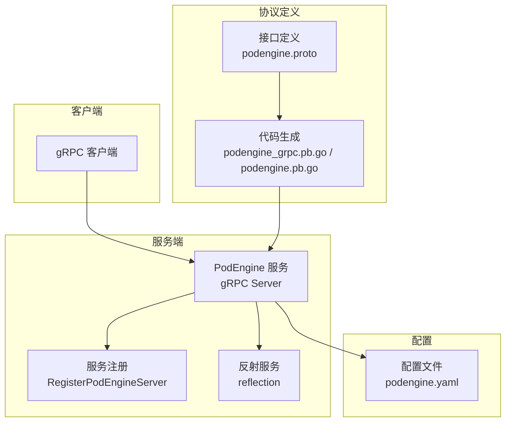
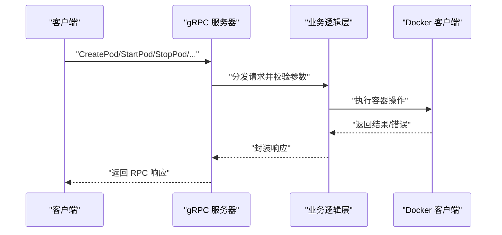
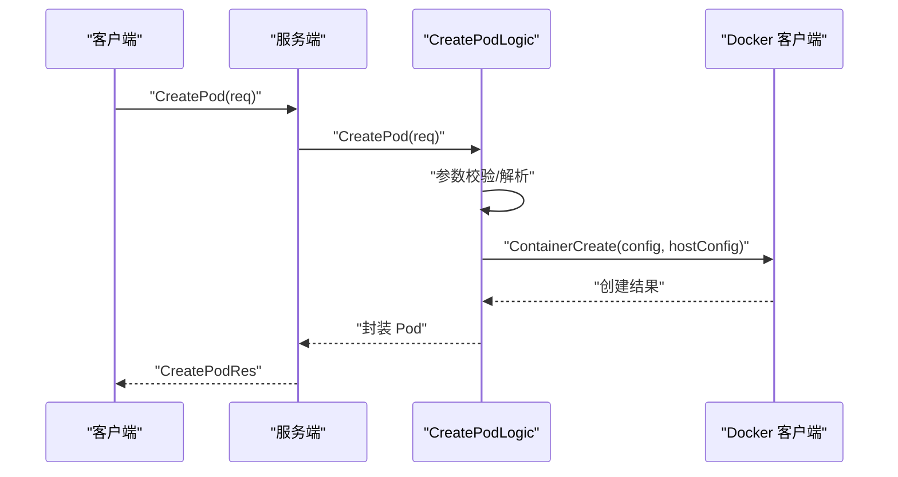
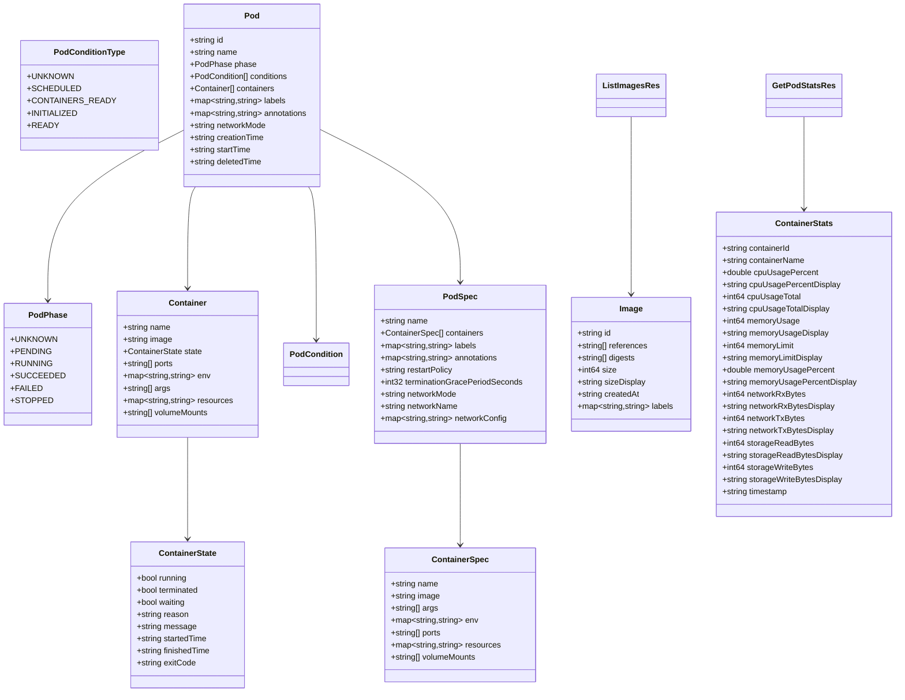
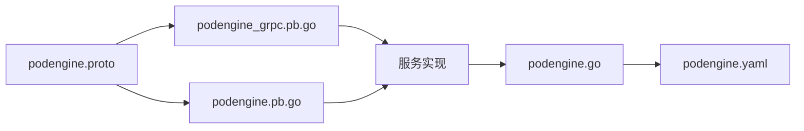

# gRPC API接口

<cite>
**本文档引用的文件**
- [podengine.proto](file://app/podengine/podengine.proto)
- [podengine_grpc.pb.go](file://app/podengine/podengine/podengine_grpc.pb.go)
- [podengine.pb.go](file://app/podengine/podengine/podengine.pb.go)
- [podengine.go](file://app/podengine/podengine.go)
- [podengine.yaml](file://app/podengine/etc/podengine.yaml)
- [createpodlogic.go](file://app/podengine/internal/logic/createpodlogic.go)
- [getpodlogic.go](file://app/podengine/internal/logic/getpodlogic.go)
- [listpodslogic.go](file://app/podengine/internal/logic/listpodslogic.go)
- [startpodlogic.go](file://app/podengine/internal/logic/startpodlogic.go)
- [stoppodlogic.go](file://app/podengine/internal/logic/stoppodlogic.go)
- [deletepodlogic.go](file://app/podengine/internal/logic/deletepodlogic.go)
- [restartpodlogic.go](file://app/podengine/internal/logic/restartpodlogic.go)
- [getpodstatslogic.go](file://app/podengine/internal/logic/getpodstatslogic.go)
- [listimageslogic.go](file://app/podengine/internal/logic/listimageslogic.go)
- [podengine.swagger.json](file://swagger/podengine.swagger.json)
</cite>

## 目录
1. [简介](#简介)
2. [项目结构](#项目结构)
3. [核心组件](#核心组件)
4. [架构总览](#架构总览)
5. [详细组件分析](#详细组件分析)
6. [依赖关系分析](#依赖关系分析)
7. [性能与并发特性](#性能与并发特性)
8. [故障排查指南](#故障排查指南)
9. [结论](#结论)
10. [附录](#附录)

## 简介
本文件为 PodEngine 服务的 gRPC API 接口完整文档，覆盖 Pod 生命周期管理的核心 RPC 方法：CreatePod、StartPod、StopPod、RestartPod、GetPod、ListPods、DeletePod、GetPodStats、ListImages。文档从接口定义、参数与返回值、错误处理、调用约定、认证与权限、版本兼容性、调用示例、性能与并发、监控与日志等方面进行系统化说明，并提供可视化图示帮助理解。

## 项目结构
PodEngine 服务位于应用模块 app/podengine 下，采用 Go-Zero 框架与 gRPC 服务注册方式提供 RPC 能力；接口定义通过 proto 文件统一描述，服务端在启动时注册到 gRPC Server 并可选开启反射以便本地调试。

**图表来源**
- [podengine.go:37-43](file://app/podengine/podengine.go#L37-L43)
- [podengine_grpc.pb.go:212-221](file://app/podengine/podengine/podengine_grpc.pb.go#L212-L221)
- [podengine.proto:16-26](file://app/podengine/podengine.proto#L16-L26)
- [podengine.yaml:1-20](file://app/podengine/etc/podengine.yaml#L1-L20)

**章节来源**
- [podengine.go:27-68](file://app/podengine/podengine.go#L27-L68)
- [podengine.proto:1-338](file://app/podengine/podengine.proto#L1-L338)
- [podengine.yaml:1-20](file://app/podengine/etc/podengine.yaml#L1-L20)

## 核心组件
- 服务接口：PodEngine，包含九个 RPC 方法，分别对应 Pod 生命周期与镜像查询。
- 数据模型：包含 Pod、Container、ContainerSpec、PodSpec、PodPhase、PodCondition、ContainerState、Image、ContainerStats 等消息类型。
- 服务端实现：基于 Go-Zero 的 zrpc 服务框架，注册 gRPC 服务并注入拦截器。
- 客户端生成：通过 protoc-gen-go 与 protoc-gen-go-grpc 生成 Go 客户端与服务端桩代码。

**章节来源**
- [podengine.proto:16-338](file://app/podengine/podengine.proto#L16-L338)
- [podengine_grpc.pb.go:33-49](file://app/podengine/podengine/podengine_grpc.pb.go#L33-L49)
- [podengine.pb.go:25-82](file://app/podengine/podengine/podengine.pb.go#L25-L82)

## 架构总览
PodEngine 服务通过 gRPC 提供统一的 Pod 生命周期管理能力，抽象容器运行模型，适配 Docker/Kubernetes 等运行时。客户端通过标准 gRPC 客户端调用，服务端在启动时注册服务并可选启用反射便于本地调试。

**图表来源**
- [podengine_grpc.pb.go:223-383](file://app/podengine/podengine/podengine_grpc.pb.go#L223-L383)
- [createpodlogic.go:34-152](file://app/podengine/internal/logic/createpodlogic.go#L34-L152)
- [getpodlogic.go:31-78](file://app/podengine/internal/logic/getpodlogic.go#L31-L78)

**章节来源**
- [podengine_grpc.pb.go:212-431](file://app/podengine/podengine/podengine_grpc.pb.go#L212-L431)
- [podengine.go:37-43](file://app/podengine/podengine.go#L37-L43)

## 详细组件分析

### 服务与方法总览
- 服务名：PodEngine
- 方法列表：
  - CreatePod：创建 Pod
  - StartPod：启动 Pod
  - StopPod：停止 Pod
  - RestartPod：重启 Pod
  - GetPod：获取 Pod 详情
  - ListPods：列出 Pod
  - DeletePod：删除 Pod
  - GetPodStats：获取 Pod 统计
  - ListImages：列出镜像

每个方法均遵循 gRPC Unary RPC 规范，请求与响应均为 protobuf 消息类型。

**章节来源**
- [podengine.proto:16-26](file://app/podengine/podengine.proto#L16-L26)
- [podengine_grpc.pb.go:21-31](file://app/podengine/podengine/podengine_grpc.pb.go#L21-L31)

### CreatePod（创建 Pod）
- 请求消息：CreatePodReq
  - node：节点标识，默认 local
  - name：Pod 逻辑名称（必填）
  - spec：PodSpec（必填）
- 响应消息：CreatePodRes
  - pod：创建后的 Pod 对象
- 参数校验：
  - 使用 validate 规则对 name、spec、containers 等字段进行约束
- 处理流程：
  - 校验请求并通过
  - 选择 Docker 客户端
  - 解析容器配置、资源限制、卷挂载、端口映射、重启策略、优雅停止时间
  - 调用 Docker API 创建容器并返回 Pod 信息

**图表来源**
- [createpodlogic.go:34-152](file://app/podengine/internal/logic/createpodlogic.go#L34-L152)
- [podengine.proto:185-193](file://app/podengine/podengine.proto#L185-L193)

**章节来源**
- [podengine.proto:185-193](file://app/podengine/podengine.proto#L185-L193)
- [createpodlogic.go:34-152](file://app/podengine/internal/logic/createpodlogic.go#L34-L152)

### StartPod（启动 Pod）
- 请求消息：StartPodReq
  - node：节点标识，默认 local
  - id：容器 ID（必填）
- 响应消息：StartPodRes
  - pod：启动后的 Pod 对象
- 处理流程：
  - 校验请求
  - 选择 Docker 客户端
  - 调用 Docker API 启动容器
  - 返回最新 Pod 信息

**章节来源**
- [podengine.proto:195-202](file://app/podengine/podengine.proto#L195-L202)
- [startpodlogic.go:29-87](file://app/podengine/internal/logic/startpodlogic.go#L29-L87)

### StopPod（停止 Pod）
- 请求消息：StopPodReq
  - node：节点标识，默认 local
  - id：容器 ID（必填）
  - force：是否强制停止
- 响应消息：StopPodRes
- 处理流程：
  - 校验请求
  - 选择 Docker 客户端
  - 调用 Docker API 停止容器
  - 返回空响应

**章节来源**
- [podengine.proto:204-211](file://app/podengine/podengine.proto#L204-L211)
- [stoppodlogic.go:28-48](file://app/podengine/internal/logic/stoppodlogic.go#L28-L48)

### RestartPod（重启 Pod）
- 请求消息：RestartPodReq
  - node：节点标识，默认 local
  - id：容器 ID（必填）
- 响应消息：RestartPodRes
  - pod：重启后的 Pod 对象
- 处理流程：
  - 校验请求
  - 选择 Docker 客户端
  - 调用 Docker API 重启容器
  - 返回最新 Pod 信息

**章节来源**
- [podengine.proto:213-220](file://app/podengine/podengine.proto#L213-L220)
- [restartpodlogic.go:30-83](file://app/podengine/internal/logic/restartpodlogic.go#L30-L83)

### GetPod（获取 Pod）
- 请求消息：GetPodReq
  - node：节点标识，默认 local
  - id：容器 ID（必填）
- 响应消息：GetPodRes
  - pod：Pod 对象
- 处理流程：
  - 校验请求
  - 选择 Docker 客户端
  - 调用 Docker API 获取容器信息
  - 封装 Pod 返回

**章节来源**
- [podengine.proto:222-229](file://app/podengine/podengine.proto#L222-L229)
- [getpodlogic.go:31-78](file://app/podengine/internal/logic/getpodlogic.go#L31-L78)

### ListPods（列出 Pod）
- 请求消息：ListPodsReq
  - node：节点标识，默认 local
  - limit：最大数量（<=1000）
  - offset：偏移量（<=1000）
  - names：按名称过滤（精确匹配）
  - ids：按 ID 过滤（精确匹配）
  - labels：按标签过滤
- 响应消息：ListPodsRes
  - items：ListPodItem 列表
  - total：总数
- 处理流程：
  - 校验请求
  - 选择 Docker 客户端
  - 构造过滤条件并列出容器
  - 分页截取并封装返回

**章节来源**
- [podengine.proto:231-261](file://app/podengine/podengine.proto#L231-L261)
- [listpodslogic.go:31-124](file://app/podengine/internal/logic/listpodslogic.go#L31-L124)

### DeletePod（删除 Pod）
- 请求消息：DeletePodReq
  - node：节点标识，默认 local
  - id：容器 ID（必填）
  - force：是否强制删除
  - removeVolumes：是否同时删除卷
- 响应消息：DeletePodRes
- 处理流程：
  - 校验请求
  - 选择 Docker 客户端
  - 调用 Docker API 删除容器
  - 返回空响应

**章节来源**
- [podengine.proto:263-271](file://app/podengine/podengine.proto#L263-L271)
- [deletepodlogic.go:28-49](file://app/podengine/internal/logic/deletepodlogic.go#L28-L49)

### GetPodStats（获取 Pod 统计）
- 请求消息：GetPodStatsReq
  - node：节点标识，默认 local
  - id：容器 ID（必填）
- 响应消息：GetPodStatsRes
  - stats：ContainerStats 列表
- 处理流程：
  - 校验请求
  - 选择 Docker 客户端
  - 获取容器基础信息与实时统计
  - 计算 CPU、内存、网络、存储指标并封装返回

**章节来源**
- [podengine.proto:273-314](file://app/podengine/podengine.proto#L273-L314)
- [getpodstatslogic.go:32-133](file://app/podengine/internal/logic/getpodstatslogic.go#L32-L133)

### ListImages（列出镜像）
- 请求消息：ListImagesReq
  - node：节点标识，默认 local
  - limit：最大数量（<=1000）
  - offset：偏移量（<=1000）
  - references：按镜像引用过滤
  - includeDigests：是否包含摘要
- 响应消息：ListImagesRes
  - items：Image 列表
  - total：总数
- 处理流程：
  - 校验请求
  - 选择 Docker 客户端
  - 构造过滤条件并列出镜像
  - 可选获取镜像摘要
  - 分页截取并封装返回

**章节来源**
- [podengine.proto:316-338](file://app/podengine/podengine.proto#L316-L338)
- [listimageslogic.go:30-110](file://app/podengine/internal/logic/listimageslogic.go#L30-L110)

### 数据模型与枚举
- PodPhase：Pod 阶段（未知、等待中、运行中、成功、失败、已停止）
- PodConditionType：Pod 条件类型（调度、容器就绪、初始化、就绪）
- ContainerState：容器状态（运行、终止、等待、原因、消息、开始/结束时间、退出码）
- Container、ContainerSpec、PodSpec：容器与 Pod 的期望/观测状态
- Pod、Image、ContainerStats：返回对象

**图表来源**
- [podengine.proto:33-338](file://app/podengine/podengine.proto#L33-L338)
- [podengine.pb.go:25-763](file://app/podengine/podengine/podengine.pb.go#L25-L763)

**章节来源**
- [podengine.proto:33-338](file://app/podengine/podengine.proto#L33-L338)
- [podengine.pb.go:25-763](file://app/podengine/podengine/podengine.pb.go#L25-L763)

## 依赖关系分析
- 服务注册：服务端通过 RegisterPodEngineServer 注册服务，开发/测试模式下启用 reflection。
- 客户端生成：protoc-gen-go 与 protoc-gen-go-grpc 生成客户端与服务端桩代码。
- 配置加载：服务启动时加载 podengine.yaml，设置监听地址、超时、日志、Nacos 注册等。

**图表来源**
- [podengine.proto:1-12](file://app/podengine/podengine.proto#L1-L12)
- [podengine_grpc.pb.go:1-19](file://app/podengine/podengine/podengine_grpc.pb.go#L1-L19)
- [podengine.pb.go:1-23](file://app/podengine/podengine/podengine.pb.go#L1-L23)
- [podengine.go:30-33](file://app/podengine/podengine.go#L30-L33)

**章节来源**
- [podengine_grpc.pb.go:212-221](file://app/podengine/podengine/podengine_grpc.pb.go#L212-L221)
- [podengine.go:37-43](file://app/podengine/podengine.go#L37-L43)
- [podengine.yaml:1-20](file://app/podengine/etc/podengine.yaml#L1-L20)

## 性能与并发特性
- 并发模型：gRPC 默认使用多路复用，单连接上可并发处理多个 RPC；具体并发度受服务端 goroutine 数与资源限制影响。
- 超时控制：服务配置包含 Timeout 字段，建议客户端在调用时设置合理的超时与重试策略。
- 统计接口：GetPodStats 提供 CPU、内存、网络、存储等指标，可用于性能监控与容量规划。
- 负载均衡：可通过 Nacos 注册服务并在客户端侧配置服务发现与负载均衡策略（需结合上层框架）。

**章节来源**
- [podengine.yaml:4-4](file://app/podengine/etc/podengine.yaml#L4-L4)
- [getpodstatslogic.go:48-133](file://app/podengine/internal/logic/getpodstatslogic.go#L48-L133)

## 故障排查指南
- 常见错误场景：
  - 节点不存在：当 node 未在配置中注册时会返回错误
  - 容器不存在：查询/操作容器时若不存在返回相应错误
  - 参数校验失败：请求消息字段不满足 validate 规则
- 日志与拦截器：
  - 服务端启动时注入 LoggerInterceptor，便于统一记录请求/响应与耗时
  - 开发/测试模式下启用 reflection，便于本地调试
- Swagger 文档：
  - 项目包含 podengine.swagger.json，可用于 OpenAPI/Swagger 生态集成（注意：该 JSON 未包含具体路径定义）

**章节来源**
- [createpodlogic.go:42-45](file://app/podengine/internal/logic/createpodlogic.go#L42-L45)
- [getpodlogic.go:40-43](file://app/podengine/internal/logic/getpodlogic.go#L40-L43)
- [listpodslogic.go:36-39](file://app/podengine/internal/logic/listpodslogic.go#L36-L39)
- [podengine.go:63-63](file://app/podengine/podengine.go#L63-L63)
- [podengine.swagger.json:1-50](file://swagger/podengine.swagger.json#L1-L50)

## 结论
PodEngine 服务通过清晰的 gRPC 接口与完善的 protobuf 模型，提供了容器化 Pod 的全生命周期管理能力。其设计遵循 Go-Zero 与 gRPC 最佳实践，具备良好的扩展性与可观测性。生产部署建议结合 Nacos 服务发现、日志与指标监控体系，确保高可用与可运维性。

## 附录

### 调用约定与认证机制
- 调用约定：
  - 使用 gRPC Unary RPC，请求/响应均为 protobuf 消息
  - 建议客户端设置超时、重试与熔断策略
- 认证与权限：
  - 当前接口未在 proto 中定义专用鉴权字段或拦截器，建议在服务端通过中间件或网关层实现统一鉴权与权限控制

**章节来源**
- [podengine_grpc.pb.go:33-49](file://app/podengine/podengine/podengine_grpc.pb.go#L33-L49)
- [podengine.go:63-63](file://app/podengine/podengine.go#L63-L63)

### 版本兼容性与迁移指南
- 版本策略：
  - 项目未提供显式的 API 版本号，建议在 proto 文件中增加版本注释与弃用标记
- 兼容性原则：
  - 新增字段建议保持向后兼容，避免破坏现有客户端
  - 弃用字段建议保留一段时间并标注 deprecation
- 迁移建议：
  - 逐步替换旧字段，提供过渡期的双写与兼容逻辑
  - 发布变更前提供变更日志与升级指引

**章节来源**
- [podengine.proto:1-12](file://app/podengine/podengine.proto#L1-L12)

### 接口调用示例（语言与客户端）
以下为常见语言的调用要点与参考路径（请根据实际生成的客户端代码进行对接）：

- Go 客户端
  - 参考路径：[podengine_grpc.pb.go:39-49](file://app/podengine/podengine/podengine_grpc.pb.go#L39-L49)
  - 示例步骤：
    - 创建 gRPC 连接
    - 通过 NewPodEngineClient 获取客户端
    - 调用具体方法（如 CreatePod、StartPod 等），传入请求消息与上下文
- Python 客户端
  - 参考路径：[podengine.proto:1-12](file://app/podengine/podengine.proto#L1-L12)
  - 步骤：
    - 使用 protoc 生成 Python 代码
    - 通过 grpc.aio 或 grpc 通道创建 PodEngineStub
    - 调用对应 RPC 方法
- Java 客户端
  - 参考路径：[podengine.proto:9-11](file://app/podengine/podengine.proto#L9-L11)
  - 步骤：
    - 使用 protoc 生成 Java 代码
    - 通过 ManagedChannel 创建 PodEngineGrpc 子类客户端
    - 调用对应方法

**章节来源**
- [podengine_grpc.pb.go:39-49](file://app/podengine/podengine/podengine_grpc.pb.go#L39-L49)
- [podengine.proto:9-11](file://app/podengine/podengine.proto#L9-L11)

### 监控、日志与调试工具
- 日志：
  - 服务端注入 LoggerInterceptor，日志路径与级别可在配置文件中设置
- 调试：
  - 开发/测试模式下启用 reflection，便于本地调试与查看服务清单
- 监控：
  - GetPodStats 提供 CPU/内存/网络/存储指标
  - 建议结合 Prometheus/Grafana 或企业监控平台采集指标

**章节来源**
- [podengine.go:40-42](file://app/podengine/podengine.go#L40-L42)
- [podengine.yaml:5-11](file://app/podengine/etc/podengine.yaml#L5-L11)
- [getpodstatslogic.go:106-133](file://app/podengine/internal/logic/getpodstatslogic.go#L106-L133)