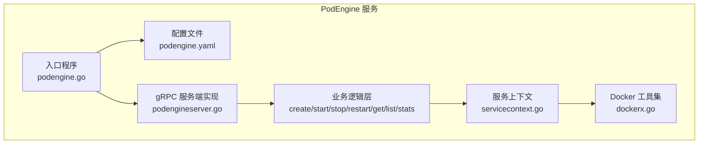
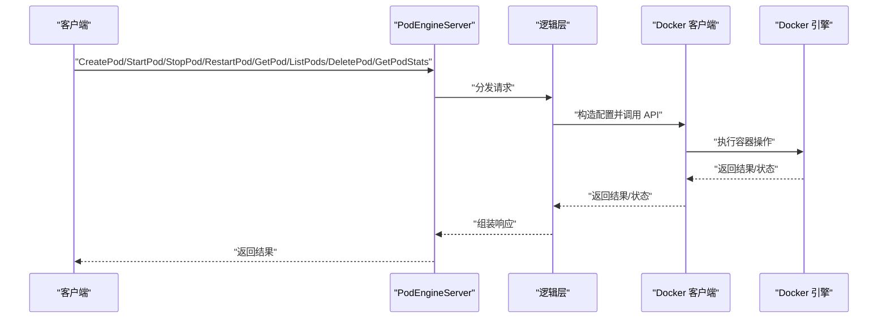
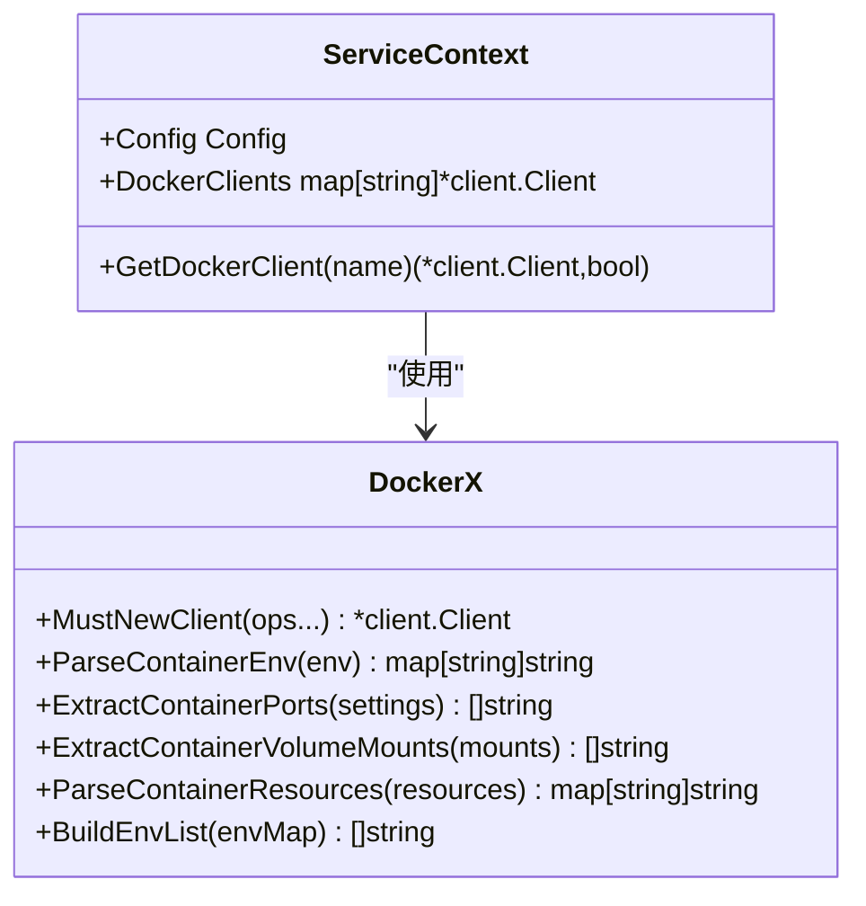
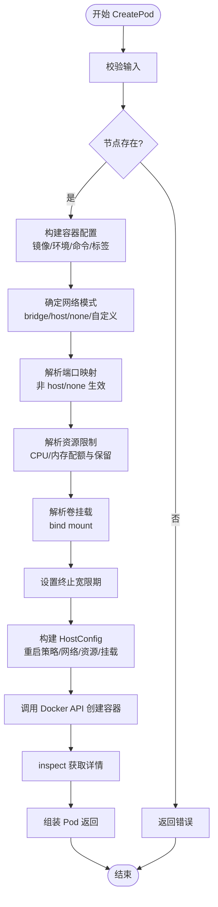
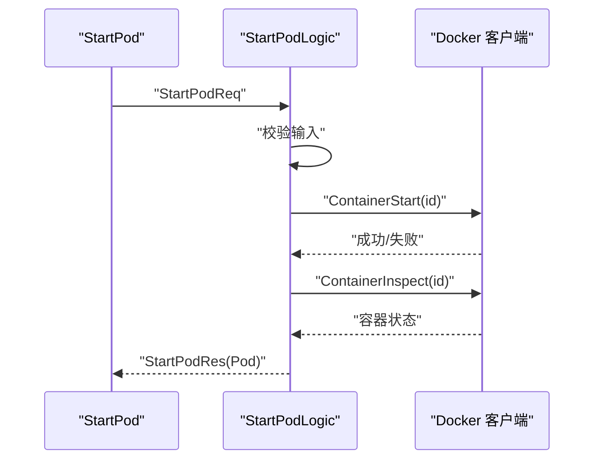
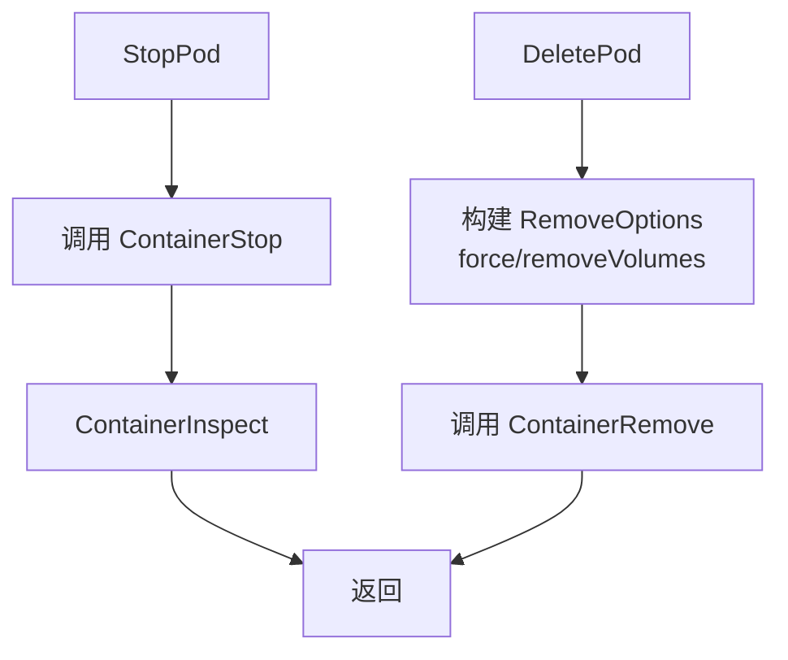
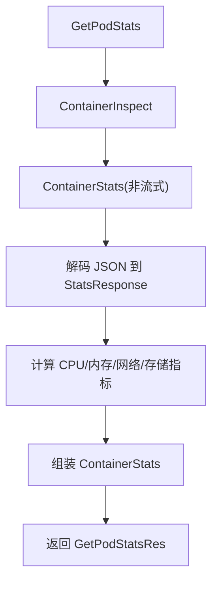
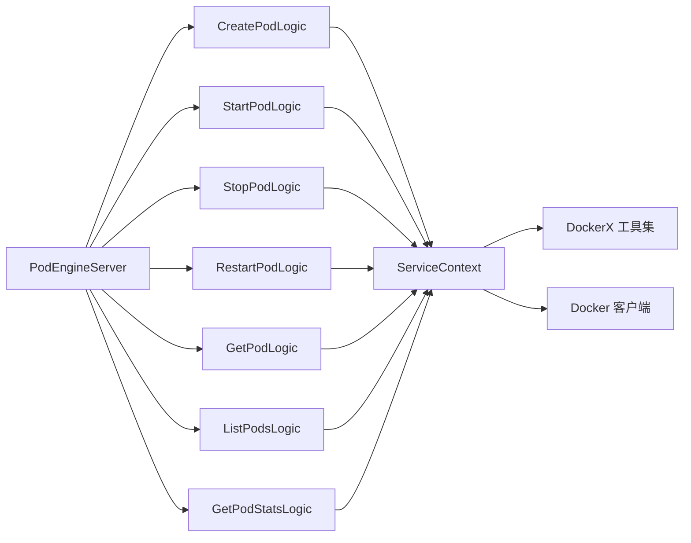

# 容器生命周期管理

<cite>
**本文引用的文件**
- [app/podengine/podengine.go](file://app/podengine/podengine.go)
- [app/podengine/etc/podengine.yaml](file://app/podengine/etc/podengine.yaml)
- [app/podengine/podengine.proto](file://app/podengine/podengine.proto)
- [app/podengine/internal/server/podengineserver.go](file://app/podengine/internal/server/podengineserver.go)
- [app/podengine/internal/svc/servicecontext.go](file://app/podengine/internal/svc/servicecontext.go)
- [app/podengine/internal/logic/createpodlogic.go](file://app/podengine/internal/logic/createpodlogic.go)
- [app/podengine/internal/logic/startpodlogic.go](file://app/podengine/internal/logic/startpodlogic.go)
- [app/podengine/internal/logic/stoppodlogic.go](file://app/podengine/internal/logic/stoppodlogic.go)
- [app/podengine/internal/logic/restartpodlogic.go](file://app/podengine/internal/logic/restartpodlogic.go)
- [app/podengine/internal/logic/getpodlogic.go](file://app/podengine/internal/logic/getpodlogic.go)
- [app/podengine/internal/logic/listpodslogic.go](file://app/podengine/internal/logic/listpodslogic.go)
- [app/podengine/internal/logic/getpodstatslogic.go](file://app/podengine/internal/logic/getpodstatslogic.go)
- [common/dockerx/dockerx.go](file://common/dockerx/dockerx.go)
</cite>

## 目录
1. [简介](#简介)
2. [项目结构](#项目结构)
3. [核心组件](#核心组件)
4. [架构总览](#架构总览)
5. [详细组件分析](#详细组件分析)
6. [依赖分析](#依赖分析)
7. [性能考虑](#性能考虑)
8. [故障排查指南](#故障排查指南)
9. [结论](#结论)
10. [附录](#附录)

## 简介
本技术文档围绕容器生命周期管理功能展开，基于仓库中的 PodEngine 服务，系统性阐述容器从创建到销毁的完整流程，包括镜像选择、资源配置、网络与存储挂载、启动初始化与健康校验、运行期监控与指标采集、优雅停止与删除、重启策略与故障恢复、以及日志与调试实践。该实现以 gRPC 服务形式提供统一接口，并通过 Docker Engine API 对容器进行编排与管理。

## 项目结构
PodEngine 服务位于 app/podengine 目录，采用 go-zero 框架与 protobuf 定义服务契约，配合 common/dockerx 提供 Docker 客户端封装与数据转换工具。核心目录与文件职责如下：
- 服务入口与配置：app/podengine/podengine.go、app/podengine/etc/podengine.yaml
- 服务契约：app/podengine/podengine.proto
- 服务端实现：app/podengine/internal/server/podengineserver.go
- 业务逻辑：app/podengine/internal/logic/*.go
- 服务上下文与 Docker 客户端：app/podengine/internal/svc/servicecontext.go
- Docker 工具：common/dockerx/dockerx.go

图表来源
- [app/podengine/podengine.go:1-69](file://app/podengine/podengine.go#L1-L69)
- [app/podengine/etc/podengine.yaml:1-20](file://app/podengine/etc/podengine.yaml#L1-L20)
- [app/podengine/internal/server/podengineserver.go:1-70](file://app/podengine/internal/server/podengineserver.go#L1-L70)
- [app/podengine/internal/svc/servicecontext.go:1-51](file://app/podengine/internal/svc/servicecontext.go#L1-L51)
- [common/dockerx/dockerx.go:1-95](file://common/dockerx/dockerx.go#L1-L95)

章节来源
- [app/podengine/podengine.go:1-69](file://app/podengine/podengine.go#L1-L69)
- [app/podengine/etc/podengine.yaml:1-20](file://app/podengine/etc/podengine.yaml#L1-L20)

## 核心组件
- 服务入口与启动：负责加载配置、构建服务上下文、注册 gRPC 服务、可选注册到 Nacos、添加拦截器、启动 RPC 服务器。
- 服务上下文：维护多节点 Docker 客户端映射，按节点名获取对应客户端，支持本地与远程 Docker Host。
- 服务端实现：将 gRPC 方法路由到对应的逻辑层。
- 业务逻辑层：实现容器生命周期各阶段的具体操作，包括创建、启动、停止、重启、查询、列表、删除、统计。
- Docker 工具集：封装 Docker API 常用数据结构转换，如环境变量、端口绑定、卷挂载、资源限制等。

章节来源
- [app/podengine/podengine.go:27-68](file://app/podengine/podengine.go#L27-L68)
- [app/podengine/internal/server/podengineserver.go:26-69](file://app/podengine/internal/server/podengineserver.go#L26-L69)
- [app/podengine/internal/svc/servicecontext.go:18-50](file://app/podengine/internal/svc/servicecontext.go#L18-L50)
- [common/dockerx/dockerx.go:20-94](file://common/dockerx/dockerx.go#L20-L94)

## 架构总览
PodEngine 通过 gRPC 暴露容器生命周期管理能力，内部以逻辑层处理请求，调用 Docker 客户端执行具体操作，并在必要时回填状态与统计数据。配置文件支持本地与远程 Docker Host，便于多节点编排。

图表来源
- [app/podengine/internal/server/podengineserver.go:26-69](file://app/podengine/internal/server/podengineserver.go#L26-L69)
- [app/podengine/internal/logic/createpodlogic.go:34-152](file://app/podengine/internal/logic/createpodlogic.go#L34-L152)
- [app/podengine/internal/logic/startpodlogic.go:29-87](file://app/podengine/internal/logic/startpodlogic.go#L29-L87)
- [app/podengine/internal/logic/stoppodlogic.go:28-48](file://app/podengine/internal/logic/stoppodlogic.go#L28-L48)
- [app/podengine/internal/logic/restartpodlogic.go:30-83](file://app/podengine/internal/logic/restartpodlogic.go#L30-L83)
- [app/podengine/internal/logic/getpodlogic.go:31-77](file://app/podengine/internal/logic/getpodlogic.go#L31-L77)
- [app/podengine/internal/logic/listpodslogic.go:31-124](file://app/podengine/internal/logic/listpodslogic.go#L31-L124)
- [app/podengine/internal/logic/getpodstatslogic.go:32-133](file://app/podengine/internal/logic/getpodstatslogic.go#L32-L133)

## 详细组件分析

### 服务入口与配置
- 入口程序解析命令行配置文件路径，加载配置，构建服务上下文，创建并启动 gRPC 服务器；在开发/测试模式下启用反射；可选注册到 Nacos；添加日志拦截器；打印 Go 版本；最后启动服务。
- 配置文件包含服务名称、监听地址、日志级别与路径、Nacos 注册开关与参数、Docker Host 映射等。

章节来源
- [app/podengine/podengine.go:25-68](file://app/podengine/podengine.go#L25-L68)
- [app/podengine/etc/podengine.yaml:1-20](file://app/podengine/etc/podengine.yaml#L1-L20)

### 服务上下文与 Docker 客户端
- 服务上下文维护 Docker 客户端映射，支持本地与多个远程 Docker Host；按节点名获取客户端；并发安全读写。
- Docker 工具集提供环境变量解析与重建、端口与卷挂载提取、资源限制解析与重建等辅助方法。

图表来源
- [app/podengine/internal/svc/servicecontext.go:11-50](file://app/podengine/internal/svc/servicecontext.go#L11-L50)
- [common/dockerx/dockerx.go:11-94](file://common/dockerx/dockerx.go#L11-L94)

章节来源
- [app/podengine/internal/svc/servicecontext.go:18-50](file://app/podengine/internal/svc/servicecontext.go#L18-L50)
- [common/dockerx/dockerx.go:20-94](file://common/dockerx/dockerx.go#L20-L94)

### 容器创建流程（CreatePod）
- 输入校验：校验 Pod 名称、Pod 规格、容器数量等。
- 节点选择：根据 Node 获取对应 Docker 客户端。
- 配置构建：
  - 镜像选择：来自容器规格的镜像字段。
  - 环境变量与启动参数：从规格映射与数组重建。
  - 标签：透传到容器 Config。
  - 网络模式：默认 bridge，可指定 host/none 或自定义网络名称。
  - 端口绑定：仅在非 host/none 模式下解析端口映射。
  - 资源限制：解析 CPU/内存配额与保留值。
  - 卷挂载：解析 bind mount 字符串为 Docker Mount 结构。
  - 终止宽限期：设置 StopTimeout。
  - 重启策略：支持 no/onFailure/always。
- 创建容器：调用 Docker API 创建，随后 inspect 获取详细信息，组装 Pod 返回。

图表来源
- [app/podengine/internal/logic/createpodlogic.go:34-152](file://app/podengine/internal/logic/createpodlogic.go#L34-L152)
- [app/podengine/internal/logic/createpodlogic.go:154-187](file://app/podengine/internal/logic/createpodlogic.go#L154-L187)
- [app/podengine/internal/logic/createpodlogic.go:189-222](file://app/podengine/internal/logic/createpodlogic.go#L189-L222)
- [app/podengine/internal/logic/createpodlogic.go:267-287](file://app/podengine/internal/logic/createpodlogic.go#L267-L287)

章节来源
- [app/podengine/internal/logic/createpodlogic.go:34-152](file://app/podengine/internal/logic/createpodlogic.go#L34-L152)

### 容器启动流程（StartPod）
- 输入校验：校验节点与容器 ID。
- 获取 Docker 客户端：按节点定位。
- 启动容器：调用 Docker API 启动。
- 查询状态：inspect 获取最新状态，组装 Pod 返回。

图表来源
- [app/podengine/internal/logic/startpodlogic.go:29-87](file://app/podengine/internal/logic/startpodlogic.go#L29-L87)

章节来源
- [app/podengine/internal/logic/startpodlogic.go:29-87](file://app/podengine/internal/logic/startpodlogic.go#L29-L87)

### 容器停止与删除（StopPod/DeletePod）
- 停止：调用 Docker API 停止容器，随后 inspect 校验状态。
- 删除：支持强制删除与是否同时删除卷，调用 Docker API 删除容器。

图表来源
- [app/podengine/internal/logic/stoppodlogic.go:28-48](file://app/podengine/internal/logic/stoppodlogic.go#L28-L48)
- [app/podengine/internal/logic/deletepodlogic.go:28-49](file://app/podengine/internal/logic/deletepodlogic.go#L28-L49)

章节来源
- [app/podengine/internal/logic/stoppodlogic.go:28-48](file://app/podengine/internal/logic/stoppodlogic.go#L28-L48)
- [app/podengine/internal/logic/deletepodlogic.go:28-49](file://app/podengine/internal/logic/deletepodlogic.go#L28-L49)

### 容器重启（RestartPod）
- 输入校验后调用 Docker API 重启容器，随后 inspect 组装返回。

章节来源
- [app/podengine/internal/logic/restartpodlogic.go:30-83](file://app/podengine/internal/logic/restartpodlogic.go#L30-L83)

### 容器查询与列表（GetPod/ListPods）
- GetPod：inspect 容器，计算 Pod 阶段与容器状态，填充端口、环境、资源、卷挂载等。
- ListPods：支持按 ID/名称/标签过滤，列举容器并分页返回。

章节来源
- [app/podengine/internal/logic/getpodlogic.go:31-117](file://app/podengine/internal/logic/getpodlogic.go#L31-L117)
- [app/podengine/internal/logic/listpodslogic.go:31-140](file://app/podengine/internal/logic/listpodslogic.go#L31-L140)

### 性能指标与统计（GetPodStats）
- 获取容器统计：调用 Docker API 获取一次统计快照，解析 CPU、内存、网络、存储指标，组装返回。

图表来源
- [app/podengine/internal/logic/getpodstatslogic.go:32-133](file://app/podengine/internal/logic/getpodstatslogic.go#L32-L133)

章节来源
- [app/podengine/internal/logic/getpodstatslogic.go:32-133](file://app/podengine/internal/logic/getpodstatslogic.go#L32-L133)

### 数据模型与服务契约
- PodEngine 服务定义了完整的生命周期管理 RPC 接口，涵盖创建、启动、停止、重启、查询、列表、删除、统计与镜像列表。
- Pod/Container/ContainerSpec/PodSpec 等消息体抽象了期望状态与观察状态，支持标签、注解、重启策略、网络模式、资源限制等。

章节来源
- [app/podengine/podengine.proto:16-26](file://app/podengine/podengine.proto#L16-L26)
- [app/podengine/podengine.proto:108-155](file://app/podengine/podengine.proto#L108-L155)
- [app/podengine/podengine.proto:162-178](file://app/podengine/podengine.proto#L162-L178)
- [app/podengine/podengine.proto:282-314](file://app/podengine/podengine.proto#L282-L314)

## 依赖分析
- 服务端到逻辑层：每个 gRPC 方法均通过 server 层路由到对应逻辑层。
- 逻辑层到服务上下文：逻辑层通过 ServiceContext 获取 Docker 客户端。
- 逻辑层到 Docker 工具集：解析/重建环境变量、端口、卷、资源等。
- Docker 工具集到 Docker 客户端：封装 Docker API 使用。

图表来源
- [app/podengine/internal/server/podengineserver.go:26-69](file://app/podengine/internal/server/podengineserver.go#L26-L69)
- [app/podengine/internal/svc/servicecontext.go:18-50](file://app/podengine/internal/svc/servicecontext.go#L18-L50)
- [common/dockerx/dockerx.go:11-94](file://common/dockerx/dockerx.go#L11-L94)

章节来源
- [app/podengine/internal/server/podengineserver.go:26-69](file://app/podengine/internal/server/podengineserver.go#L26-L69)
- [app/podengine/internal/svc/servicecontext.go:18-50](file://app/podengine/internal/svc/servicecontext.go#L18-L50)
- [common/dockerx/dockerx.go:11-94](file://common/dockerx/dockerx.go#L11-L94)

## 性能考虑
- 统计接口为一次性快照，避免长连接带来的开销；建议按需调用，避免过于频繁的轮询。
- 端口与卷解析为轻量字符串处理，复杂度低；注意大规模容器场景下的批量查询与过滤。
- 资源解析与重建采用简单数值转换，注意输入格式一致性以减少错误分支。
- 多节点 Docker 客户端缓存避免重复创建，提升并发访问效率。

## 故障排查指南
- 容器创建失败：检查镜像是否存在、端口冲突、资源限制格式、卷挂载路径权限与存在性。
- 容器无法启动：查看 inspect 状态中的错误原因与退出码；确认网络模式与端口映射；检查环境变量与命令参数。
- 统计数据缺失：确认 Docker API 可用且容器处于运行态；检查统计接口调用频率与解码流程。
- 多节点访问：确认配置文件中 Docker Host 地址正确，网络可达；检查节点名与映射一致。
- 日志与拦截器：服务启动时添加日志拦截器，结合配置文件的日志路径与级别定位问题。

章节来源
- [app/podengine/internal/logic/createpodlogic.go:107-117](file://app/podengine/internal/logic/createpodlogic.go#L107-L117)
- [app/podengine/internal/logic/startpodlogic.go:40-51](file://app/podengine/internal/logic/startpodlogic.go#L40-L51)
- [app/podengine/internal/logic/getpodstatslogic.go:49-59](file://app/podengine/internal/logic/getpodstatslogic.go#L49-L59)
- [app/podengine/etc/podengine.yaml:5-11](file://app/podengine/etc/podengine.yaml#L5-L11)
- [app/podengine/podengine.go:63-64](file://app/podengine/podengine.go#L63-L64)

## 结论
本实现以清晰的服务契约与模块化设计，提供了从创建到销毁的完整容器生命周期管理能力。通过 Docker 工具集与多节点客户端支持，满足多运行节点场景下的统一编排需求。建议在生产环境中结合健康检查、重启策略与监控告警，进一步增强稳定性与可观测性。

## 附录
- 重启策略与健康状态验证：服务契约支持重启策略（no/onFailure/always），可在上层业务中结合健康检查与探针实现更完善的健康状态验证。
- 日志管理与调试：利用服务日志与拦截器输出关键路径信息；结合 Docker 日志与容器 inspect 输出进行问题定位。
- 自动重试与故障恢复：建议在客户端或上层控制器中实现幂等与重试策略，结合 Pod 阶段判断决定后续动作。