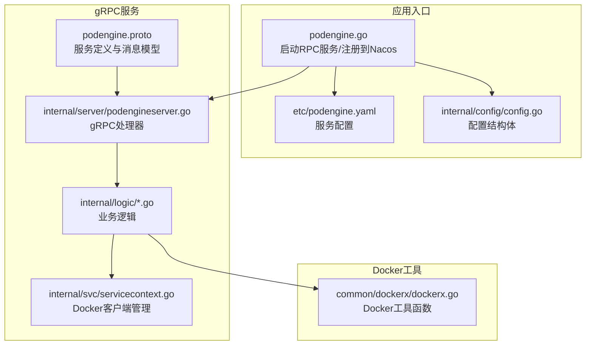
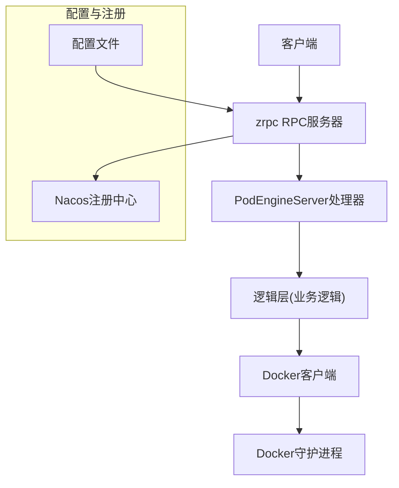
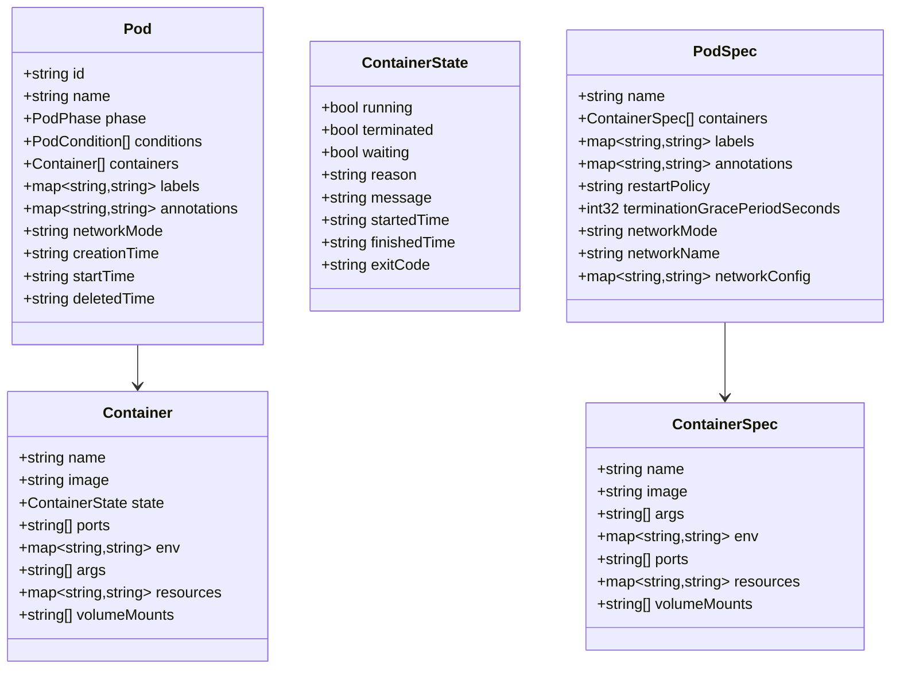
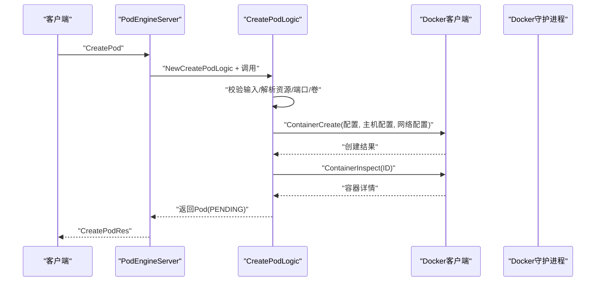
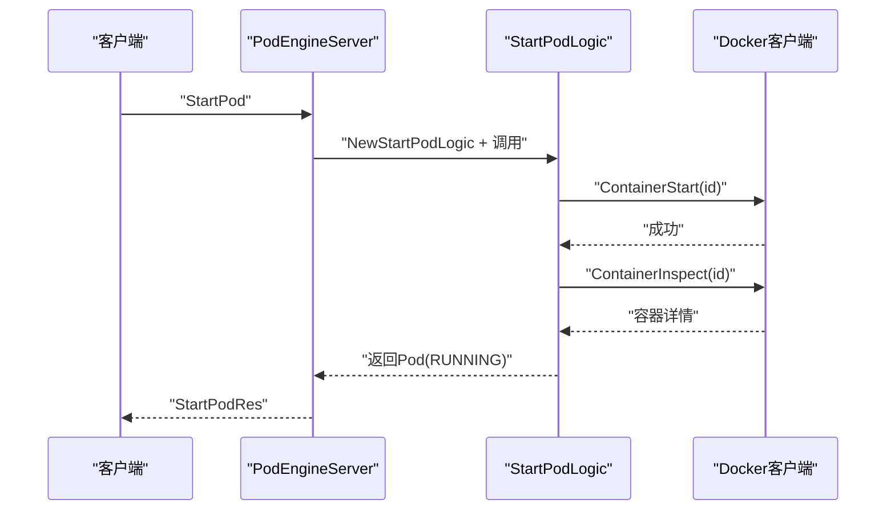
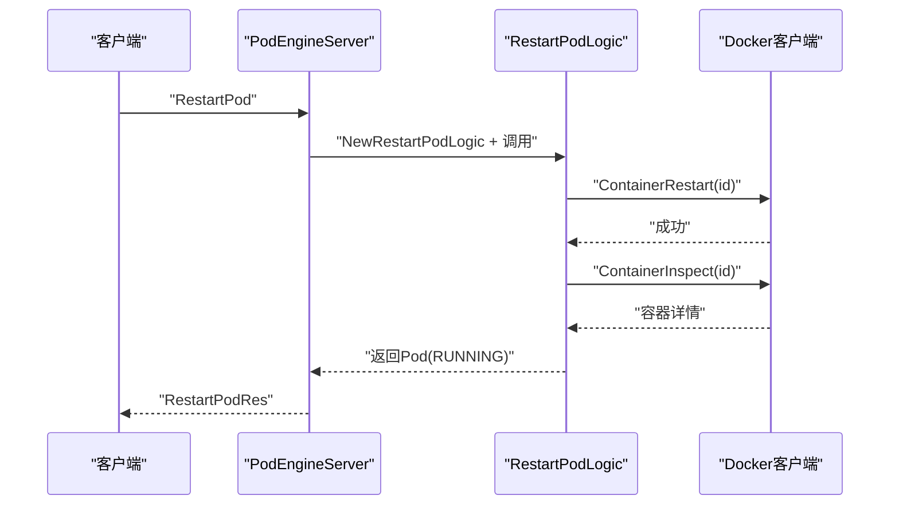
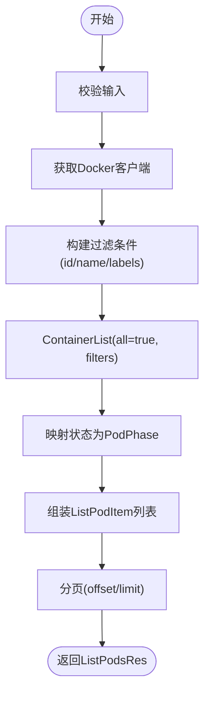
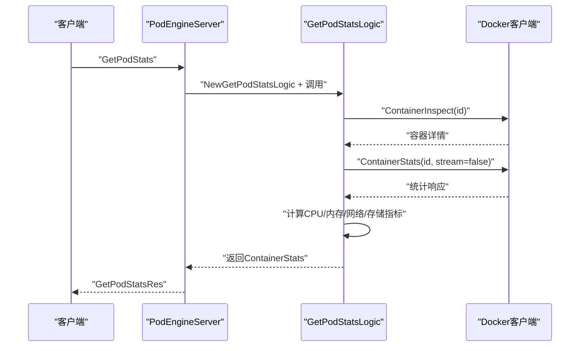
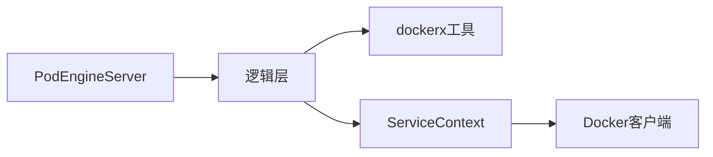

# 容器管理服务

<cite>
**本文档引用的文件**
- [app/podengine/podengine.go](file://app/podengine/podengine.go)
- [app/podengine/podengine.proto](file://app/podengine/podengine.proto)
- [app/podengine/etc/podengine.yaml](file://app/podengine/etc/podengine.yaml)
- [app/podengine/internal/config/config.go](file://app/podengine/internal/config/config.go)
- [app/podengine/internal/server/podengineserver.go](file://app/podengine/internal/server/podengineserver.go)
- [app/podengine/internal/svc/servicecontext.go](file://app/podengine/internal/svc/servicecontext.go)
- [app/podengine/internal/logic/createpodlogic.go](file://app/podengine/internal/logic/createpodlogic.go)
- [app/podengine/internal/logic/startpodlogic.go](file://app/podengine/internal/logic/startpodlogic.go)
- [app/podengine/internal/logic/restartpodlogic.go](file://app/podengine/internal/logic/restartpodlogic.go)
- [app/podengine/internal/logic/listpodslogic.go](file://app/podengine/internal/logic/listpodslogic.go)
- [app/podengine/internal/logic/getpodstatslogic.go](file://app/podengine/internal/logic/getpodstatslogic.go)
- [common/dockerx/dockerx.go](file://common/dockerx/dockerx.go)
- [swagger/podengine.swagger.json](file://swagger/podengine.swagger.json)
</cite>

## 目录
1. [简介](#简介)
2. [项目结构](#项目结构)
3. [核心组件](#核心组件)
4. [架构总览](#架构总览)
5. [详细组件分析](#详细组件分析)
6. [依赖分析](#依赖分析)
7. [性能考虑](#性能考虑)
8. [故障排查指南](#故障排查指南)
9. [结论](#结论)
10. [附录](#附录)

## 简介
本项目提供基于 gRPC 的容器管理服务，抽象出 Pod/容器生命周期管理能力，适配 Docker 运行时。通过统一的 API 接口实现容器的创建、启动、停止、重启、查询、列表、删除以及资源统计等功能，并支持多节点 Docker 客户端管理与注册中心集成。

## 项目结构
- 应用入口与配置
  - 入口程序：app/podengine/podengine.go
  - 配置文件：app/podengine/etc/podengine.yaml
  - 配置结构体：app/podengine/internal/config/config.go
- gRPC 服务定义与实现
  - 协议定义：app/podengine/podengine.proto
  - 服务端：app/podengine/internal/server/podengineserver.go
  - 业务逻辑：app/podengine/internal/logic/*.go
  - 服务上下文：app/podengine/internal/svc/servicecontext.go
- Docker 工具与适配
  - Docker 客户端封装：common/dockerx/dockerx.go
- 文档
  - Swagger 文档：swagger/podengine.swagger.json

**图表来源**
- [app/podengine/podengine.go:1-69](file://app/podengine/podengine.go#L1-L69)
- [app/podengine/etc/podengine.yaml:1-20](file://app/podengine/etc/podengine.yaml#L1-L20)
- [app/podengine/internal/config/config.go:1-18](file://app/podengine/internal/config/config.go#L1-L18)
- [app/podengine/podengine.proto:1-338](file://app/podengine/podengine.proto#L1-L338)
- [app/podengine/internal/server/podengineserver.go:1-70](file://app/podengine/internal/server/podengineserver.go#L1-L70)
- [app/podengine/internal/svc/servicecontext.go:1-51](file://app/podengine/internal/svc/servicecontext.go#L1-L51)
- [common/dockerx/dockerx.go:1-95](file://common/dockerx/dockerx.go#L1-L95)

**章节来源**
- [app/podengine/podengine.go:1-69](file://app/podengine/podengine.go#L1-L69)
- [app/podengine/etc/podengine.yaml:1-20](file://app/podengine/etc/podengine.yaml#L1-L20)
- [app/podengine/internal/config/config.go:1-18](file://app/podengine/internal/config/config.go#L1-L18)
- [app/podengine/podengine.proto:1-338](file://app/podengine/podengine.proto#L1-L338)
- [app/podengine/internal/server/podengineserver.go:1-70](file://app/podengine/internal/server/podengineserver.go#L1-L70)
- [app/podengine/internal/svc/servicecontext.go:1-51](file://app/podengine/internal/svc/servicecontext.go#L1-L51)
- [common/dockerx/dockerx.go:1-95](file://common/dockerx/dockerx.go#L1-L95)

## 核心组件
- Pod 引擎服务
  - 服务接口：CreatePod、StartPod、StopPod、RestartPod、GetPod、ListPods、DeletePod、GetPodStats、ListImages
  - 数据模型：Pod、Container、ContainerSpec、PodSpec、ContainerState、PodCondition、ContainerStats、Image
- 服务上下文
  - 多节点 Docker 客户端管理（local 与自定义节点）
  - 并发安全的客户端访问
- Docker 工具
  - 环境变量解析与构建
  - 端口映射提取
  - 卷挂载解析
  - 资源限制解析与构建
- 配置与部署
  - YAML 配置文件
  - Nacos 注册与发现（可选）

**章节来源**
- [app/podengine/podengine.proto:14-26](file://app/podengine/podengine.proto#L14-L26)
- [app/podengine/podengine.proto:162-178](file://app/podengine/podengine.proto#L162-L178)
- [app/podengine/podengine.proto:82-101](file://app/podengine/podengine.proto#L82-L101)
- [app/podengine/podengine.proto:108-155](file://app/podengine/podengine.proto#L108-L155)
- [app/podengine/internal/svc/servicecontext.go:11-51](file://app/podengine/internal/svc/servicecontext.go#L11-L51)
- [common/dockerx/dockerx.go:20-94](file://common/dockerx/dockerx.go#L20-L94)

## 架构总览
服务采用分层架构：
- 入口层：加载配置、初始化 RPC 服务器、注册到 Nacos
- 服务层：gRPC 处理器将请求转发至对应逻辑层
- 逻辑层：执行业务逻辑，调用 Docker 客户端进行容器操作
- 工具层：Docker 工具函数负责数据转换与解析
- 配置层：YAML 配置与服务上下文

**图表来源**
- [app/podengine/podengine.go:37-67](file://app/podengine/podengine.go#L37-L67)
- [app/podengine/internal/server/podengineserver.go:26-69](file://app/podengine/internal/server/podengineserver.go#L26-L69)
- [app/podengine/internal/svc/servicecontext.go:18-50](file://app/podengine/internal/svc/servicecontext.go#L18-L50)

**章节来源**
- [app/podengine/podengine.go:27-67](file://app/podengine/podengine.go#L27-L67)
- [app/podengine/internal/server/podengineserver.go:15-70](file://app/podengine/internal/server/podengineserver.go#L15-L70)
- [app/podengine/internal/svc/servicecontext.go:18-50](file://app/podengine/internal/svc/servicecontext.go#L18-L50)

## 详细组件分析

### Pod 抽象模型与状态机
- Pod 阶段（PodPhase）：UNKNOWN、PENDING、RUNNING、SUCCEEDED、FAILED、STOPPED
- Pod 条件（PodConditionType）：POD_SCHEDULED、CONTAINERS_READY、INITIALIZED、READY
- 容器状态（ContainerState）：running、terminated、waiting、reason、message、startedTime、finishedTime、exitCode
- Pod 模型：包含 id、name、phase、conditions、containers、labels、annotations、networkMode、creationTime、startTime、deletedTime
- 容器模型：name、image、state、ports、env、args、resources、volumeMounts

**图表来源**
- [app/podengine/podengine.proto:162-178](file://app/podengine/podengine.proto#L162-L178)
- [app/podengine/podengine.proto:82-101](file://app/podengine/podengine.proto#L82-L101)
- [app/podengine/podengine.proto:108-155](file://app/podengine/podengine.proto#L108-L155)
- [app/podengine/podengine.proto:108-121](file://app/podengine/podengine.proto#L108-L121)

**章节来源**
- [app/podengine/podengine.proto:33-52](file://app/podengine/podengine.proto#L33-L52)
- [app/podengine/podengine.proto:65-75](file://app/podengine/podengine.proto#L65-L75)
- [app/podengine/podengine.proto:162-178](file://app/podengine/podengine.proto#L162-L178)
- [app/podengine/podengine.proto:82-101](file://app/podengine/podengine.proto#L82-L101)
- [app/podengine/podengine.proto:108-155](file://app/podengine/podengine.proto#L108-L155)

### 容器创建流程（CreatePod）
- 输入校验：验证 PodSpec、容器数量、字段约束
- Docker 客户端选择：按 node 参数选择本地或远程 Docker 客户端
- 配置构建：
  - 容器配置：镜像、环境变量、命令、标签、STDIO 关闭、TTY 关闭
  - 网络模式：默认 bridge，支持 host、none 或自定义网络名
  - 端口绑定：当网络模式非 host/none 时解析端口映射
  - 资源限制：CPUQuota/CPUPeriod、Memory、CPUShares、MemoryReservation
  - 卷挂载：bind mount，支持 ro 标记
  - 终止宽限期：StopTimeout
- 创建容器并返回 Pod 响应（初始状态为 PENDING）

**图表来源**
- [app/podengine/internal/server/podengineserver.go:26-29](file://app/podengine/internal/server/podengineserver.go#L26-L29)
- [app/podengine/internal/logic/createpodlogic.go:34-152](file://app/podengine/internal/logic/createpodlogic.go#L34-L152)

**章节来源**
- [app/podengine/internal/logic/createpodlogic.go:34-152](file://app/podengine/internal/logic/createpodlogic.go#L34-L152)

### 容器启动流程（StartPod）
- 输入校验：验证 node 与 id
- 选择 Docker 客户端
- 调用 ContainerStart 启动容器
- ContainerInspect 获取最新状态并组装 Pod 响应（phase=RUNNING）

**图表来源**
- [app/podengine/internal/server/podengineserver.go:31-34](file://app/podengine/internal/server/podengineserver.go#L31-L34)
- [app/podengine/internal/logic/startpodlogic.go:29-87](file://app/podengine/internal/logic/startpodlogic.go#L29-L87)

**章节来源**
- [app/podengine/internal/logic/startpodlogic.go:29-87](file://app/podengine/internal/logic/startpodlogic.go#L29-L87)

### 容器重启流程（RestartPod）
- 输入校验：验证 node 与 id
- 选择 Docker 客户端
- 调用 ContainerRestart
- ContainerInspect 获取最新状态并组装 Pod 响应（phase=RUNNING）

**图表来源**
- [app/podengine/internal/server/podengineserver.go:41-44](file://app/podengine/internal/server/podengineserver.go#L41-L44)
- [app/podengine/internal/logic/restartpodlogic.go:30-83](file://app/podengine/internal/logic/restartpodlogic.go#L30-L83)

**章节来源**
- [app/podengine/internal/logic/restartpodlogic.go:30-83](file://app/podengine/internal/logic/restartpodlogic.go#L30-L83)

### 容器列表与过滤（ListPods）
- 支持按 id、name、labels 精确过滤
- 分页：limit、offset
- Pod 阶段映射：根据容器状态映射为 PodPhase
- 返回字段：id、name、phase、image、command、ports、sizeRw、sizeRootFs、labels、state、status、networkMode、mounts

**图表来源**
- [app/podengine/internal/logic/listpodslogic.go:31-124](file://app/podengine/internal/logic/listpodslogic.go#L31-L124)

**章节来源**
- [app/podengine/internal/logic/listpodslogic.go:31-124](file://app/podengine/internal/logic/listpodslogic.go#L31-L124)

### 资源统计（GetPodStats）
- ContainerInspect 获取基础信息
- ContainerStats 获取实时统计（CPU、内存、网络、存储）
- 计算指标：CPU 使用率百分比、内存使用率百分比、网络收发字节、存储读写字节
- 返回 ContainerStats 列表

**图表来源**
- [app/podengine/internal/server/podengineserver.go:61-64](file://app/podengine/internal/server/podengineserver.go#L61-L64)
- [app/podengine/internal/logic/getpodstatslogic.go:32-133](file://app/podengine/internal/logic/getpodstatslogic.go#L32-L133)

**章节来源**
- [app/podengine/internal/logic/getpodstatslogic.go:32-133](file://app/podengine/internal/logic/getpodstatslogic.go#L32-L133)

### Docker 工具函数
- 环境变量解析与构建：将键值对数组与 map 互转
- 端口映射提取：从 NetworkSettings 提取 hostPort -> containerPort 映射
- 卷挂载提取：从 MountPoint 列表提取 bind mount 字符串
- 资源解析：CPUQuota/Period、Memory、CPUShares、MemoryReservation 的解析与构建

**章节来源**
- [common/dockerx/dockerx.go:20-94](file://common/dockerx/dockerx.go#L20-L94)

## 依赖分析
- 组件耦合
  - 服务端处理器仅依赖服务上下文与逻辑层，低耦合高内聚
  - 逻辑层依赖 Docker 客户端与工具函数，职责单一
  - 服务上下文集中管理 Docker 客户端，避免重复创建
- 外部依赖
  - Docker SDK：容器生命周期与统计
  - Nacos：服务注册（可选）
  - gRPC：服务通信
- 潜在循环依赖
  - 未发现直接循环依赖；各层单向依赖

**图表来源**
- [app/podengine/internal/server/podengineserver.go:15-70](file://app/podengine/internal/server/podengineserver.go#L15-L70)
- [app/podengine/internal/svc/servicecontext.go:18-50](file://app/podengine/internal/svc/servicecontext.go#L18-L50)
- [common/dockerx/dockerx.go:1-95](file://common/dockerx/dockerx.go#L1-L95)

**章节来源**
- [app/podengine/internal/server/podengineserver.go:15-70](file://app/podengine/internal/server/podengineserver.go#L15-L70)
- [app/podengine/internal/svc/servicecontext.go:18-50](file://app/podengine/internal/svc/servicecontext.go#L18-L50)
- [common/dockerx/dockerx.go:1-95](file://common/dockerx/dockerx.go#L1-L95)

## 性能考虑
- 客户端复用：服务上下文中集中管理 Docker 客户端，避免频繁创建销毁
- 并发安全：读写锁保护客户端访问，适合多并发场景
- 统计开销：GetPodStats 使用非流式统计，避免持续监听带来的资源消耗
- 网络与卷：端口与卷挂载解析在逻辑层完成，减少 Docker 层复杂度
- 建议
  - 对高频查询增加缓存（如最近一次统计结果）
  - 对大规模列表查询优化过滤条件与分页
  - 对资源限制解析增加单位标准化与边界检查

[本节为通用建议，无需特定文件来源]

## 故障排查指南
- 常见错误类型
  - 输入校验失败：字段为空、格式不合法
  - 节点不存在：node 参数未在配置中定义
  - Docker 操作失败：容器创建/启动/重启/统计失败
- 日志与追踪
  - 服务端拦截器记录请求日志
  - OpenTelemetry TracerProvider 注入 Docker 客户端
- 排查步骤
  - 检查配置文件与 Docker 守护进程连通性
  - 查看服务日志与 gRPC 错误码
  - 使用 GetPodStats 验证统计接口可用性
  - 使用 ListPods 验证过滤与分页逻辑

**章节来源**
- [app/podengine/podengine.go:63-63](file://app/podengine/podengine.go#L63-L63)
- [common/dockerx/dockerx.go:11-18](file://common/dockerx/dockerx.go#L11-L18)
- [app/podengine/internal/logic/createpodlogic.go:35-45](file://app/podengine/internal/logic/createpodlogic.go#L35-L45)
- [app/podengine/internal/logic/startpodlogic.go:40-51](file://app/podengine/internal/logic/startpodlogic.go#L40-L51)
- [app/podengine/internal/logic/restartpodlogic.go:40-48](file://app/podengine/internal/logic/restartpodlogic.go#L40-L48)
- [app/podengine/internal/logic/getpodstatslogic.go:49-59](file://app/podengine/internal/logic/getpodstatslogic.go#L49-L59)

## 结论
该容器管理服务以 Pod/容器抽象为核心，通过 gRPC 提供完整的生命周期管理能力，适配 Docker 运行时。服务结构清晰、职责分离，具备良好的扩展性与可维护性。结合多节点 Docker 客户端管理与 Nacos 注册，可满足多环境部署与服务治理需求。

[本节为总结，无需特定文件来源]

## 附录

### API 接口一览
- CreatePod：创建 Pod（容器）
- StartPod：启动 Pod（容器）
- StopPod：停止 Pod（容器），支持强制停止
- RestartPod：重启 Pod（容器）
- GetPod：获取 Pod 详情
- ListPods：列出 Pod，支持过滤与分页
- DeletePod：删除 Pod，支持强制删除与卷清理
- GetPodStats：获取 Pod 资源统计
- ListImages：列出镜像

**章节来源**
- [app/podengine/podengine.proto:16-26](file://app/podengine/podengine.proto#L16-L26)

### Pod/容器状态映射
- running -> RUNNING
- exited -> SUCCEEDED
- created -> PENDING
- stopped -> STOPPED
- 其他 -> UNKNOWN

**章节来源**
- [app/podengine/internal/logic/listpodslogic.go:126-139](file://app/podengine/internal/logic/listpodslogic.go#L126-L139)

### 配置模板与示例
- 服务配置：监听地址、日志级别、Nacos 注册开关与参数、Docker 客户端配置
- Docker 客户端：支持 local 与自定义节点（如 tcp://host:2375）

**章节来源**
- [app/podengine/etc/podengine.yaml:1-20](file://app/podengine/etc/podengine.yaml#L1-L20)
- [app/podengine/internal/config/config.go:5-17](file://app/podengine/internal/config/config.go#L5-L17)
- [app/podengine/internal/svc/servicecontext.go:18-40](file://app/podengine/internal/svc/servicecontext.go#L18-L40)

### 资源限制设置与解析规则
- CPU 限制：cpu（核数），解析为 Docker CPUQuota 与 CPUPeriod
- 内存限制：memory（支持字节/单位），解析为 Memory
- CPU 请求：cpuRequest（核数），解析为 CPUShares
- 内存请求：memoryRequest（支持字节/单位），解析为 MemoryReservation

**章节来源**
- [app/podengine/internal/logic/createpodlogic.go:189-222](file://app/podengine/internal/logic/createpodlogic.go#L189-L222)
- [app/podengine/internal/logic/createpodlogic.go:224-265](file://app/podengine/internal/logic/createpodlogic.go#L224-L265)
- [common/dockerx/dockerx.go:58-86](file://common/dockerx/dockerx.go#L58-L86)

### 网络与存储挂载
- 网络模式：bridge、host、none 或自定义网络名
- 端口映射：容器端口与主机端口映射，非 host/none 模式下生效
- 卷挂载：bind mount，支持 ro 标记

**章节来源**
- [app/podengine/podengine.proto:147-154](file://app/podengine/podengine.proto#L147-L154)
- [app/podengine/internal/logic/createpodlogic.go:73-82](file://app/podengine/internal/logic/createpodlogic.go#L73-L82)
- [app/podengine/internal/logic/createpodlogic.go:267-287](file://app/podengine/internal/logic/createpodlogic.go#L267-L287)
- [common/dockerx/dockerx.go:35-56](file://common/dockerx/dockerx.go#L35-L56)

### 健康检查与自动重启
- 重启策略：no、onFailure、always，映射为 Docker RestartPolicy
- 终止宽限期：terminationGracePeriodSeconds，默认 60 秒
- 建议
  - 生产环境优先使用 onfailure 或 always 策略
  - 配合 GetPodStats 与日志采集实现健康监控

**章节来源**
- [app/podengine/podengine.proto:141-142](file://app/podengine/podengine.proto#L141-L142)
- [app/podengine/internal/logic/createpodlogic.go:172-187](file://app/podengine/internal/logic/createpodlogic.go#L172-L187)
- [app/podengine/internal/logic/createpodlogic.go:84-88](file://app/podengine/internal/logic/createpodlogic.go#L84-L88)

### 权限控制与安全
- 建议
  - 通过网关或中间件添加鉴权与授权
  - 限制 node 参数范围，避免越权访问其他节点
  - 严格校验输入参数与资源限制
  - 使用只读卷与最小权限原则

[本节为通用建议，无需特定文件来源]

### 性能调优方案
- 客户端连接池：复用 Docker 客户端，减少握手开销
- 统计采样：合理设置 GetPodStats 采样频率
- 过滤优化：优先使用 id/name/label 精确过滤
- 资源隔离：合理设置 CPU/Memory 上限与请求，避免资源争抢

[本节为通用建议，无需特定文件来源]

### 最佳实践
- 编排策略
  - 使用 labels/annotations 进行分组与元数据管理
  - 通过 restartPolicy 与健康检查实现自愈
- 故障恢复
  - 结合日志与统计指标快速定位问题
  - 对关键服务启用 always 策略并配置监控告警
- 应用场景
  - 微服务容器化部署
  - 边缘计算节点容器编排
  - 开发测试环境快速创建与回收

[本节为通用建议，无需特定文件来源]