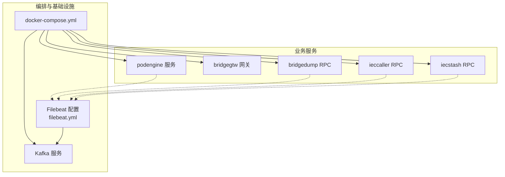
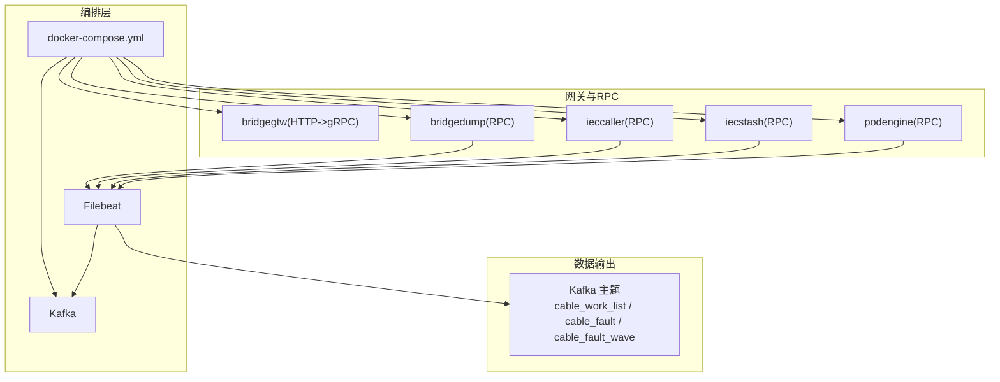
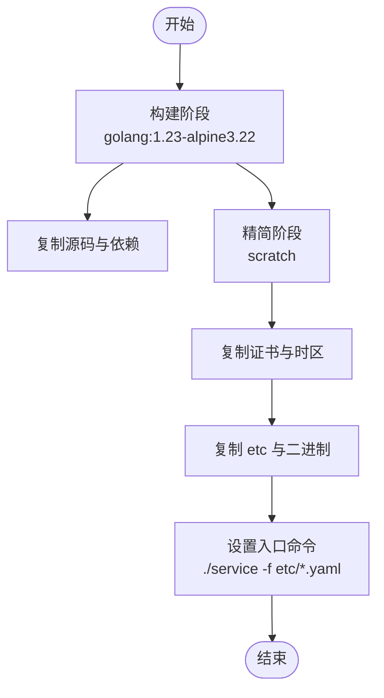
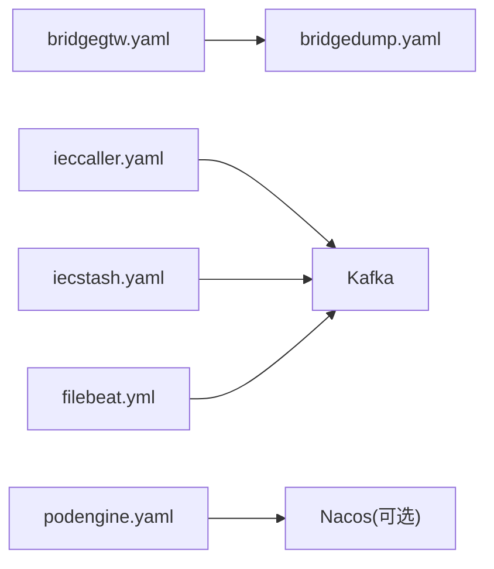

# 服务配置与部署

<cite>
**本文引用的文件**
- [deploy/docker-compose.yml](file://deploy/docker-compose.yml)
- [deploy/filebeat/conf/filebeat.yml](file://deploy/filebeat/conf/filebeat.yml)
- [app/podengine/etc/podengine.yaml](file://app/podengine/etc/podengine.yaml)
- [app/bridgegtw/etc/bridgegtw.yaml](file://app/bridgegtw/etc/bridgegtw.yaml)
- [app/bridgedump/etc/bridgedump.yaml](file://app/bridgedump/etc/bridgedump.yaml)
- [app/ieccaller/etc/ieccaller.yaml](file://app/ieccaller/etc/ieccaller.yaml)
- [app/iecstash/etc/iecstash.yaml](file://app/iecstash/etc/iecstash.yaml)
- [app/podengine/Dockerfile](file://app/podengine/Dockerfile)
- [app/bridgegtw/Dockerfile](file://app/bridgegtw/Dockerfile)
- [app/bridgedump/Dockerfile](file://app/bridgedump/Dockerfile)
- [app/ieccaller/Dockerfile](file://app/ieccaller/Dockerfile)
- [app/iecstash/Dockerfile](file://app/iecstash/Dockerfile)
</cite>

## 目录
1. [简介](#简介)
2. [项目结构](#项目结构)
3. [核心组件](#核心组件)
4. [架构总览](#架构总览)
5. [详细组件分析](#详细组件分析)
6. [依赖关系分析](#依赖关系分析)
7. [性能考虑](#性能考虑)
8. [故障排查指南](#故障排查指南)
9. [结论](#结论)
10. [附录](#附录)

## 简介
本技术文档面向容器管理服务的配置与部署，围绕以下目标展开：
- 全面解读各服务配置文件的关键参数：gRPC 服务器配置、Nacos 注册中心配置、日志级别与保留策略、监控与输出设置等。
- 详解 Docker 构建流程、镜像制作与部署策略，涵盖多阶段构建、精简镜像、时区与代理配置、入口命令等。
- 说明环境变量、网络端口映射与数据卷挂载的配置要点与注意事项。
- 提供启动脚本、健康检查与自动重启策略的建议与实践。
- 阐述集群部署、负载均衡与故障转移机制的设计思路与实现要点。
- 给出生产环境的部署最佳实践、安全配置与性能调优建议。
- 提供服务监控、日志采集与告警的完整配置指南。

## 项目结构
该仓库采用按功能模块划分的服务化组织方式，每个服务均包含独立的配置文件、源码、Dockerfile 与部署脚本。部署层通过 docker-compose 编排 Kafka、Filebeat、以及各业务服务容器，形成统一的可观测与数据流转体系。

图表来源
- [deploy/docker-compose.yml:1-110](file://deploy/docker-compose.yml#L1-L110)
- [deploy/filebeat/conf/filebeat.yml:1-122](file://deploy/filebeat/conf/filebeat.yml#L1-L122)

章节来源
- [deploy/docker-compose.yml:1-110](file://deploy/docker-compose.yml#L1-L110)

## 核心组件
本节聚焦于容器管理服务中与配置与部署密切相关的核心组件，包括：
- gRPC 服务器配置：监听地址、超时、日志编码与路径、日志保留天数等。
- Nacos 注册中心配置：是否注册、服务名、命名空间、用户名与密码等。
- 日志与监控配置：日志级别、输出模式、保留策略；Kafka 输出配置（Filebeat）。
- Docker 镜像构建：多阶段构建、精简镜像、时区与代理、入口命令。

章节来源
- [app/podengine/etc/podengine.yaml:1-20](file://app/podengine/etc/podengine.yaml#L1-L20)
- [app/bridgegtw/etc/bridgegtw.yaml:1-40](file://app/bridgegtw/etc/bridgegtw.yaml#L1-L40)
- [app/bridgedump/etc/bridgedump.yaml:1-10](file://app/bridgedump/etc/bridgedump.yaml#L1-L10)
- [app/ieccaller/etc/ieccaller.yaml:1-79](file://app/ieccaller/etc/ieccaller.yaml#L1-L79)
- [app/iecstash/etc/iecstash.yaml:1-46](file://app/iecstash/etc/iecstash.yaml#L1-L46)
- [deploy/filebeat/conf/filebeat.yml:1-122](file://deploy/filebeat/conf/filebeat.yml#L1-L122)

## 架构总览
下图展示容器编排、日志采集与数据流的整体架构：docker-compose 启动 Kafka 与 Filebeat，Filebeat 将桥接采集的数据写入 Kafka；各业务服务通过 gRPC 或 HTTP 访问上游或下游服务，实现数据汇聚与转发。

图表来源
- [deploy/docker-compose.yml:1-110](file://deploy/docker-compose.yml#L1-L110)
- [deploy/filebeat/conf/filebeat.yml:1-122](file://deploy/filebeat/conf/filebeat.yml#L1-L122)

## 详细组件分析

### gRPC 服务器配置与日志设置
- podengine.rpc
  - 监听地址与端口、运行模式、请求超时、日志编码、日志路径与保留天数。
  - Nacos 注册开关、服务名、命名空间、账号密码等。
  - Docker 配置项（示例：Docker Daemon 地址）。
- bridgegtw
  - HTTP 网关监听、日志配置、超时、上游 gRPC 端点、Proto 文件、路由映射至具体 RPC 方法。
- bridgedump.rpc
  - gRPC 监听、日志配置、数据转储目录。
- ieccaller.rpc
  - 监听端口、部署模式、日志、Nacos 注册、IEC 服务器配置、Kafka 与 MQTT 推送配置、流事件上游配置、批处理大小与优雅退出周期等。
- iecstash.rpc
  - 监听端口、日志、Nacos 注册、Kafka 消费配置（连接数、消费者数、处理器数、批次字节数、偏移策略）、流事件上游配置、批处理大小与优雅退出周期等。

章节来源
- [app/podengine/etc/podengine.yaml:1-20](file://app/podengine/etc/podengine.yaml#L1-L20)
- [app/bridgegtw/etc/bridgegtw.yaml:1-40](file://app/bridgegtw/etc/bridgegtw.yaml#L1-L40)
- [app/bridgedump/etc/bridgedump.yaml:1-10](file://app/bridgedump/etc/bridgedump.yaml#L1-L10)
- [app/ieccaller/etc/ieccaller.yaml:1-79](file://app/ieccaller/etc/ieccaller.yaml#L1-L79)
- [app/iecstash/etc/iecstash.yaml:1-46](file://app/iecstash/etc/iecstash.yaml#L1-L46)

### Nacos 注册中心配置
- podengine.rpc：可配置是否注册、Nacos 地址、端口、用户名、密码、命名空间、服务名等。
- ieccaller.rpc：可配置是否注册、Nacos 地址、端口、用户名、密码、命名空间、服务名等。
- iecstash.rpc：可配置是否注册、Nacos 地址、端口、用户名、密码、命名空间、服务名等。
- bridgegtw：当前未见 Nacos 配置项，但可通过上游 gRPC 端点进行服务发现与路由。

章节来源
- [app/podengine/etc/podengine.yaml:11-19](file://app/podengine/etc/podengine.yaml#L11-L19)
- [app/ieccaller/etc/ieccaller.yaml:13-21](file://app/ieccaller/etc/ieccaller.yaml#L13-L21)
- [app/iecstash/etc/iecstash.yaml:10-18](file://app/iecstash/etc/iecstash.yaml#L10-L18)

### 日志级别与监控设置
- 日志级别：info、warn、error 等（可在配置文件中设置）。
- 日志保留策略：按天数保留（如 30/300 天）。
- Kafka 输出（Filebeat）：启用 Kafka 输出、主题动态选择、压缩方式、最大消息大小、ack 数量等。
- 多输入源：针对不同桥接采集子系统的日志目录，分别定义输入、主题字段、多行匹配、扫描频率、忽略与清理策略等。

章节来源
- [app/podengine/etc/podengine.yaml:5-10](file://app/podengine/etc/podengine.yaml#L5-L10)
- [app/bridgegtw/etc/bridgegtw.yaml:5-11](file://app/bridgegtw/etc/bridgegtw.yaml#L5-L11)
- [app/bridgedump/etc/bridgedump.yaml:4-9](file://app/bridgedump/etc/bridgedump.yaml#L4-L9)
- [app/ieccaller/etc/ieccaller.yaml:7-12](file://app/ieccaller/etc/ieccaller.yaml#L7-L12)
- [app/iecstash/etc/iecstash.yaml:4-9](file://app/iecstash/etc/iecstash.yaml#L4-L9)
- [deploy/filebeat/conf/filebeat.yml:110-119](file://deploy/filebeat/conf/filebeat.yml#L110-L119)

### Docker 容器构建与镜像制作
- 多阶段构建：基于 golang:1.23-alpine3.22 构建二进制，最终拷贝到 scratch 精简镜像，减少攻击面。
- 时区与代理：设置 Asia/Shanghai 时区；支持 HTTP/HTTPS 代理与 GOPROXY。
- 入口命令：通过 CMD 指定服务二进制及其配置文件路径。
- 共享特性：各服务 Dockerfile 结构一致，便于标准化与复用。

图表来源
- [app/podengine/Dockerfile:1-42](file://app/podengine/Dockerfile#L1-L42)
- [app/bridgegtw/Dockerfile:1-43](file://app/bridgegtw/Dockerfile#L1-L43)
- [app/bridgedump/Dockerfile:1-42](file://app/bridgedump/Dockerfile#L1-L42)
- [app/ieccaller/Dockerfile:1-42](file://app/ieccaller/Dockerfile#L1-L42)
- [app/iecstash/Dockerfile:1-42](file://app/iecstash/Dockerfile#L1-L42)

章节来源
- [app/podengine/Dockerfile:1-42](file://app/podengine/Dockerfile#L1-L42)
- [app/bridgegtw/Dockerfile:1-43](file://app/bridgegtw/Dockerfile#L1-L43)
- [app/bridgedump/Dockerfile:1-42](file://app/bridgedump/Dockerfile#L1-L42)
- [app/ieccaller/Dockerfile:1-42](file://app/ieccaller/Dockerfile#L1-L42)
- [app/iecstash/Dockerfile:1-42](file://app/iecstash/Dockerfile#L1-L42)

### 部署策略与编排
- docker-compose 编排：统一管理 Kafka、Filebeat、各业务服务容器。
- 端口映射：Kafka 对外暴露 9092/9094；Kafdrop 暴露 39000:9000；业务服务使用 host 网络以简化端口管理。
- 数据卷挂载：挂载 etc 配置目录与日志/采集数据目录；Filebeat 挂载宿主机 Docker 容器日志目录以便采集。
- 重启策略：默认 restart: always，确保异常退出后自动恢复。
- 环境变量：统一设置时区 TZ=Asia/Shanghai，便于日志与任务调度一致性。

章节来源
- [deploy/docker-compose.yml:1-110](file://deploy/docker-compose.yml#L1-L110)

### 启动脚本、健康检查与自动重启
- 启动脚本：各服务目录提供 deploy.sh，建议结合 docker-compose 使用，统一构建与部署。
- 健康检查：建议在生产环境为 Kafka、业务服务添加健康检查探针，检测端口与关键接口可用性。
- 自动重启：通过 docker-compose 的 restart 策略与 systemd/systemctl 管理，确保服务高可用。

章节来源
- [deploy/docker-compose.yml:1-110](file://deploy/docker-compose.yml#L1-L110)

### 集群部署、负载均衡与故障转移
- 集群部署：通过 docker-compose 扩展副本数或使用 Kubernetes Deployment/Service 实现水平扩展。
- 负载均衡：Kafka 作为消息总线，业务服务通过消费者组实现负载均衡；网关层可结合上游 gRPC 端点进行流量分发。
- 故障转移：Kafka 副本与分区配置保障消息可靠性；Filebeat 与业务服务的 restart: always 实现快速自愈。

章节来源
- [deploy/docker-compose.yml:1-110](file://deploy/docker-compose.yml#L1-L110)
- [app/ieccaller/etc/ieccaller.yaml:35-41](file://app/ieccaller/etc/ieccaller.yaml#L35-L41)
- [app/iecstash/etc/iecstash.yaml:18-35](file://app/iecstash/etc/iecstash.yaml#L18-L35)

### 生产环境最佳实践、安全配置与性能调优
- 安全配置
  - 使用只读文件系统与非特权用户运行（如可行），限制容器权限。
  - 通过环境变量注入敏感配置（如 Nacos 用户名/密码、MQTT 凭证），避免硬编码。
  - 启用 TLS/SSL（如 Kafka、MQTT、gRPC）并在网关层统一终止。
- 性能调优
  - Kafka：合理设置分区数、副本因子与 ISR；调整批大小、压缩算法与 ack 数量。
  - Filebeat：根据磁盘与网络状况调整扫描频率、关闭时间与清理策略；启用 gzip 压缩。
  - 业务服务：根据 CPU 核数配置 Kafka 消费连接数、消费者数与处理器数；控制批处理大小与优雅退出周期。
- 监控与日志
  - 通过 Filebeat 将业务日志与容器日志统一输出到 Kafka，再由下游消费链路接入监控平台。
  - 在 docker-compose 中为关键服务添加健康检查与资源限制（mem_limit）。

章节来源
- [app/ieccaller/etc/ieccaller.yaml:35-79](file://app/ieccaller/etc/ieccaller.yaml#L35-L79)
- [app/iecstash/etc/iecstash.yaml:18-46](file://app/iecstash/etc/iecstash.yaml#L18-L46)
- [deploy/filebeat/conf/filebeat.yml:110-119](file://deploy/filebeat/conf/filebeat.yml#L110-L119)
- [deploy/docker-compose.yml:56-100](file://deploy/docker-compose.yml#L56-L100)

## 依赖关系分析
- 配置文件依赖：各服务通过 -f 指向 etc 下的 YAML 配置文件，集中管理日志、注册中心、上游/下游、Kafka/MQTT 等参数。
- 运行时依赖：bridgegtw 依赖 bridgedump 的 gRPC 服务；ieccaller/iecstash 依赖 Kafka；Filebeat 依赖 Kafka；Kafka 依赖 Zookeeper（在 compose 中已配置）。
- 镜像依赖：各服务 Dockerfile 基于相同模板，最终镜像均为 scratch，减少体积与攻击面。

图表来源
- [app/bridgegtw/etc/bridgegtw.yaml:25-40](file://app/bridgegtw/etc/bridgegtw.yaml#L25-L40)
- [app/bridgedump/etc/bridgedump.yaml:1-10](file://app/bridgedump/etc/bridgedump.yaml#L1-L10)
- [app/ieccaller/etc/ieccaller.yaml:35-57](file://app/ieccaller/etc/ieccaller.yaml#L35-L57)
- [app/iecstash/etc/iecstash.yaml:18-35](file://app/iecstash/etc/iecstash.yaml#L18-L35)
- [deploy/filebeat/conf/filebeat.yml:110-119](file://deploy/filebeat/conf/filebeat.yml#L110-L119)
- [app/podengine/etc/podengine.yaml:11-19](file://app/podengine/etc/podengine.yaml#L11-L19)

章节来源
- [app/bridgegtw/etc/bridgegtw.yaml:1-40](file://app/bridgegtw/etc/bridgegtw.yaml#L1-L40)
- [app/bridgedump/etc/bridgedump.yaml:1-10](file://app/bridgedump/etc/bridgedump.yaml#L1-L10)
- [app/ieccaller/etc/ieccaller.yaml:1-79](file://app/ieccaller/etc/ieccaller.yaml#L1-L79)
- [app/iecstash/etc/iecstash.yaml:1-46](file://app/iecstash/etc/iecstash.yaml#L1-L46)
- [deploy/filebeat/conf/filebeat.yml:1-122](file://deploy/filebeat/conf/filebeat.yml#L1-L122)
- [app/podengine/etc/podengine.yaml:1-20](file://app/podengine/etc/podengine.yaml#L1-L20)

## 性能考虑
- Kafka 性能
  - 分区数与副本因子：根据吞吐需求与容灾要求设定。
  - 批大小与压缩：在保证延迟的前提下提升吞吐，合理设置 gzip 压缩比。
  - ack 数量：平衡可靠性与性能。
- Filebeat 性能
  - 扫描频率与关闭时间：避免频繁 IO；根据写入节奏调整。
  - 多行匹配与 JSON 解析：减少解析错误与丢弃事件。
- 业务服务性能
  - Kafka 消费并发：Conns × Consumers × Processors 与 CPU 核数匹配。
  - 批处理大小：PushAsduChunkBytes 控制内存占用与网络效率。
  - 优雅退出周期：GracePeriod 平滑处理正在处理的任务。

章节来源
- [app/ieccaller/etc/ieccaller.yaml:24-34](file://app/ieccaller/etc/ieccaller.yaml#L24-L34)
- [app/iecstash/etc/iecstash.yaml:24-35](file://app/iecstash/etc/iecstash.yaml#L24-L35)
- [deploy/filebeat/conf/filebeat.yml:110-119](file://deploy/filebeat/conf/filebeat.yml#L110-L119)

## 故障排查指南
- Kafka 连接问题
  - 检查 listeners 与 advertised.listeners 配置，确保容器内外端口映射正确。
  - 确认 KAFKA_PROCESS_ROLES 与 CONTROLLER 配置，避免单节点控制器问题。
- Filebeat 采集异常
  - 检查输入路径与主题字段是否匹配；确认容器日志目录挂载正确。
  - 关注多行匹配与 JSON 解析规则，避免事件被丢弃。
- 业务服务无法启动
  - 检查 -f 指向的配置文件是否存在且格式正确。
  - 查看日志路径与权限，确认容器内可写。
- 服务间通信失败
  - bridgegtw 的上游 gRPC 端点是否可达；确认 bridgedump 已启动并监听对应端口。
  - Nacos 注册状态（如启用注册），确认服务名与命名空间一致。

章节来源
- [deploy/docker-compose.yml:13-27](file://deploy/docker-compose.yml#L13-L27)
- [deploy/filebeat/conf/filebeat.yml:5-73](file://deploy/filebeat/conf/filebeat.yml#L5-L73)
- [app/bridgegtw/etc/bridgegtw.yaml:25-40](file://app/bridgegtw/etc/bridgegtw.yaml#L25-L40)
- [app/bridgedump/etc/bridgedump.yaml:1-10](file://app/bridgedump/etc/bridgedump.yaml#L1-L10)
- [app/podengine/etc/podengine.yaml:11-19](file://app/podengine/etc/podengine.yaml#L11-L19)

## 结论
本仓库提供了完整的容器化服务配置与部署方案：通过 docker-compose 统一编排 Kafka、Filebeat 与各业务服务；借助多阶段 Dockerfile 实现精简镜像与一致构建；通过丰富的配置文件参数实现日志、注册中心、Kafka/MQTT、批处理与优雅退出等关键能力。生产环境中应重点关注安全加固、性能调优与可观测性建设，确保高可用与可维护性。

## 附录
- 配置文件路径参考
  - podengine: [app/podengine/etc/podengine.yaml](file://app/podengine/etc/podengine.yaml)
  - bridgegtw: [app/bridgegtw/etc/bridgegtw.yaml](file://app/bridgegtw/etc/bridgegtw.yaml)
  - bridgedump: [app/bridgedump/etc/bridgedump.yaml](file://app/bridgedump/etc/bridgedump.yaml)
  - ieccaller: [app/ieccaller/etc/ieccaller.yaml](file://app/ieccaller/etc/ieccaller.yaml)
  - iecstash: [app/iecstash/etc/iecstash.yaml](file://app/iecstash/etc/iecstash.yaml)
- Dockerfile 路径参考
  - podengine: [app/podengine/Dockerfile](file://app/podengine/Dockerfile)
  - bridgegtw: [app/bridgegtw/Dockerfile](file://app/bridgegtw/Dockerfile)
  - bridgedump: [app/bridgedump/Dockerfile](file://app/bridgedump/Dockerfile)
  - ieccaller: [app/ieccaller/Dockerfile](file://app/ieccaller/Dockerfile)
  - iecstash: [app/iecstash/Dockerfile](file://app/iecstash/Dockerfile)
- 编排与日志配置
  - docker-compose: [deploy/docker-compose.yml](file://deploy/docker-compose.yml)
  - filebeat: [deploy/filebeat/conf/filebeat.yml](file://deploy/filebeat/conf/filebeat.yml)