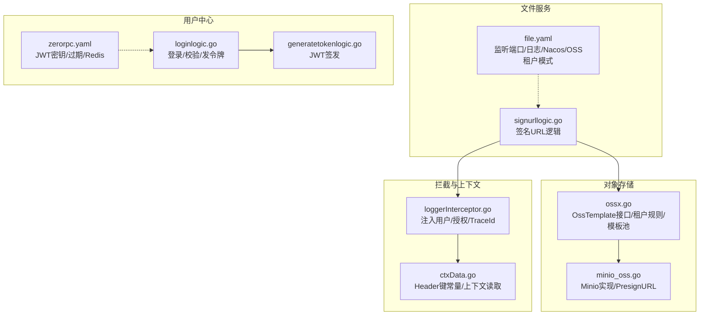
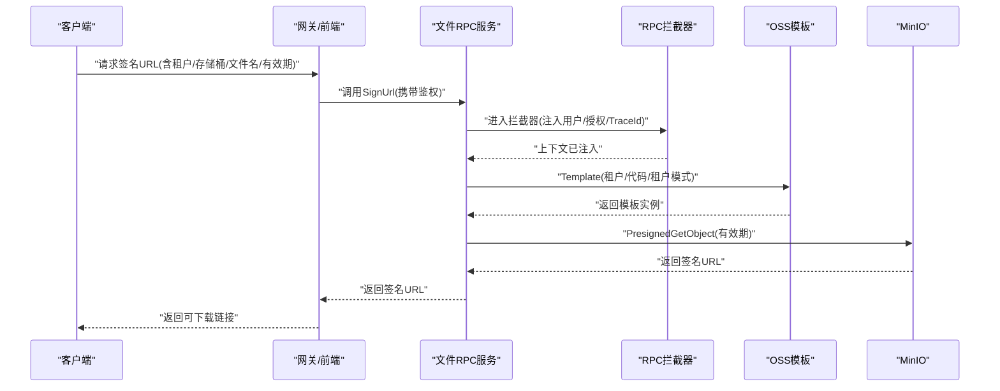
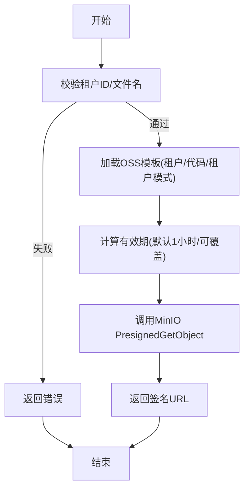
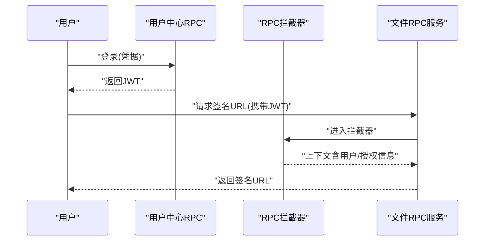
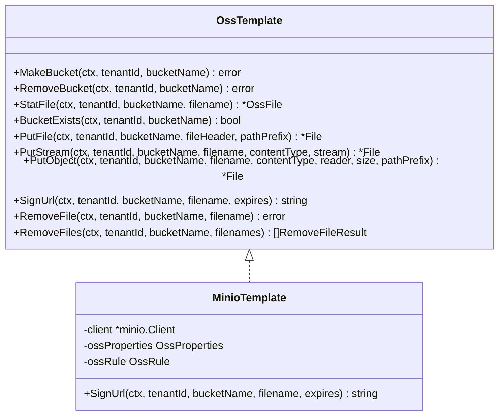
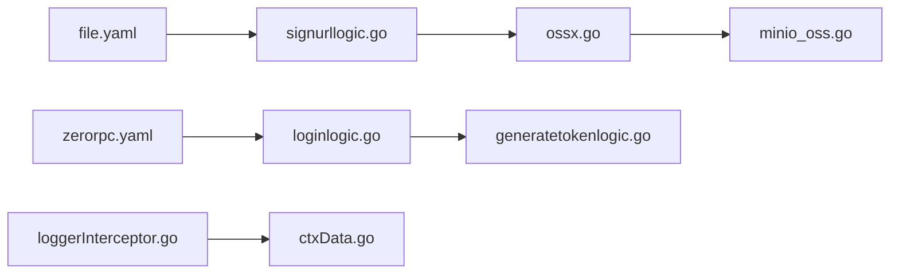

# 安全与访问控制

<cite>
**本文引用的文件**
- [signurllogic.go](file://app/file/internal/logic/signurllogic.go)
- [ossx.go](file://common/ossx/ossx.go)
- [minio_oss.go](file://common/ossx/minio_oss.go)
- [generatetokenlogic.go](file://zerorpc/internal/logic/generatetokenlogic.go)
- [loginlogic.go](file://zerorpc/internal/logic/loginlogic.go)
- [loggerInterceptor.go](file://common/Interceptor/rpcserver/loggerInterceptor.go)
- [file.yaml](file://app/file/etc/file.yaml)
- [zerorpc.yaml](file://zerorpc/etc/zerorpc.yaml)
- [ctxData.go](file://common/ctxdata/ctxData.go)
</cite>

## 目录
1. [引言](#引言)
2. [项目结构](#项目结构)
3. [核心组件](#核心组件)
4. [架构总览](#架构总览)
5. [详细组件分析](#详细组件分析)
6. [依赖分析](#依赖分析)
7. [性能考虑](#性能考虑)
8. [故障排查指南](#故障排查指南)
9. [结论](#结论)
10. [附录](#附录)

## 引言
本文件聚焦于文件服务的安全与访问控制，系统性梳理签名URL生成算法、有效期控制与权限验证机制；明确文件访问权限管理、用户身份认证与资源授权策略；阐述安全传输协议、数据加密与防篡改措施；介绍访问日志记录、审计追踪与异常行为检测；并提供安全配置指南、漏洞防护建议与合规性要求，辅以威胁模型分析、风险评估与安全最佳实践。

## 项目结构
围绕文件服务与安全相关的关键模块如下：
- 文件服务RPC：负责签名URL生成等能力
- 对象存储抽象与实现：统一模板接口与MinIO实现
- 用户中心RPC：负责登录与令牌签发
- RPC拦截器：注入上下文与日志
- 配置文件：服务端口、日志、Nacos注册、OSS租户模式、JWT密钥与过期时间等

**图表来源**
- [file.yaml:1-23](file://app/file/etc/file.yaml#L1-L23)
- [signurllogic.go:1-61](file://app/file/internal/logic/signurllogic.go#L1-L61)
- [ossx.go:1-152](file://common/ossx/ossx.go#L1-L152)
- [minio_oss.go:1-243](file://common/ossx/minio_oss.go#L1-L243)
- [zerorpc.yaml:1-39](file://zerorpc/etc/zerorpc.yaml#L1-L39)
- [loginlogic.go:1-110](file://zerorpc/internal/logic/loginlogic.go#L1-L110)
- [generatetokenlogic.go:1-53](file://zerorpc/internal/logic/generatetokenlogic.go#L1-L53)
- [loggerInterceptor.go:1-45](file://common/Interceptor/rpcserver/loggerInterceptor.go#L1-L45)
- [ctxData.go:1-76](file://common/ctxdata/ctxData.go#L1-L76)

**章节来源**
- [file.yaml:1-23](file://app/file/etc/file.yaml#L1-L23)
- [zerorpc.yaml:1-39](file://zerorpc/etc/zerorpc.yaml#L1-L39)

## 核心组件
- 签名URL生成器：接收租户ID、代码、存储桶、文件名与有效期，返回可下载链接
- 对象存储模板：抽象统一接口，按租户模式拼接存储桶名，支持缓存模板实例
- MinIO实现：基于PresignedGetObject生成带有效期的URL
- 登录与令牌：基于JWT签发短期访问令牌，支持刷新策略
- RPC拦截器：从gRPC元数据注入用户信息与授权头到上下文，便于审计与追踪
- 上下文工具：提供Header键常量与上下文读取方法

**章节来源**
- [signurllogic.go:29-60](file://app/file/internal/logic/signurllogic.go#L29-L60)
- [ossx.go:28-39](file://common/ossx/ossx.go#L28-L39)
- [minio_oss.go:150-162](file://common/ossx/minio_oss.go#L150-L162)
- [generatetokenlogic.go:29-52](file://zerorpc/internal/logic/generatetokenlogic.go#L29-L52)
- [loggerInterceptor.go:12-44](file://common/Interceptor/rpcserver/loggerInterceptor.go#L12-L44)
- [ctxData.go:9-24](file://common/ctxdata/ctxData.go#L9-L24)

## 架构总览
文件服务通过RPC暴露签名URL能力，内部根据租户与存储配置选择对应模板，最终调用MinIO生成预签名URL。用户侧通过用户中心RPC完成登录与令牌获取，后续请求在gRPC中由拦截器注入上下文，便于审计与追踪。

**图表来源**
- [signurllogic.go:29-60](file://app/file/internal/logic/signurllogic.go#L29-L60)
- [ossx.go:109-151](file://common/ossx/ossx.go#L109-L151)
- [minio_oss.go:150-162](file://common/ossx/minio_oss.go#L150-L162)
- [loggerInterceptor.go:12-44](file://common/Interceptor/rpcserver/loggerInterceptor.go#L12-L44)

## 详细组件分析

### 组件A：签名URL生成算法与有效期控制
- 输入参数校验：租户ID与文件名必填
- 租户与存储配置：通过模板工厂按租户ID加载OSS配置，支持租户模式下的存储桶前缀拼接
- 有效期控制：默认1小时，可通过请求参数覆盖
- 预签名生成：调用MinIO PresignedGetObject生成带有效期的URL
- 返回值：仅返回签名URL，不包含额外敏感信息

**图表来源**
- [signurllogic.go:29-60](file://app/file/internal/logic/signurllogic.go#L29-L60)
- [ossx.go:109-151](file://common/ossx/ossx.go#L109-L151)
- [minio_oss.go:150-162](file://common/ossx/minio_oss.go#L150-L162)

**章节来源**
- [signurllogic.go:29-60](file://app/file/internal/logic/signurllogic.go#L29-L60)
- [ossx.go:109-151](file://common/ossx/ossx.go#L109-L151)
- [minio_oss.go:150-162](file://common/ossx/minio_oss.go#L150-L162)

### 组件B：权限验证与资源授权策略
- 身份认证：用户通过用户中心RPC登录，获取JWT访问令牌
- 授权注入：gRPC拦截器从元数据读取用户ID、用户名、部门编码、授权头与TraceId，并注入到上下文
- 访问控制：签名URL生成逻辑未直接进行业务级权限校验，建议在上游业务层或拦截器中增加对“文件归属/可见性/角色”的检查
- 最佳实践：结合业务模型在签名前校验用户对目标文件的访问权限

**图表来源**
- [loginlogic.go:30-109](file://zerorpc/internal/logic/loginlogic.go#L30-L109)
- [generatetokenlogic.go:29-52](file://zerorpc/internal/logic/generatetokenlogic.go#L29-L52)
- [loggerInterceptor.go:12-44](file://common/Interceptor/rpcserver/loggerInterceptor.go#L12-L44)

**章节来源**
- [loginlogic.go:30-109](file://zerorpc/internal/logic/loginlogic.go#L30-L109)
- [generatetokenlogic.go:29-52](file://zerorpc/internal/logic/generatetokenlogic.go#L29-L52)
- [loggerInterceptor.go:12-44](file://common/Interceptor/rpcserver/loggerInterceptor.go#L12-L44)
- [ctxData.go:9-24](file://common/ctxdata/ctxData.go#L9-L24)

### 组件C：对象存储抽象与实现
- 抽象接口：统一创建/删除存储桶、统计文件、上传/删除文件、生成签名URL等能力
- 租户规则：在租户模式下，存储桶名前缀为“租户ID-”
- 模板缓存：按租户维度缓存模板与配置，避免重复初始化
- MinIO实现：封装MinIO客户端，提供PresignedGetObject生成签名URL

**图表来源**
- [ossx.go:28-39](file://common/ossx/ossx.go#L28-L39)
- [minio_oss.go:20-24](file://common/ossx/minio_oss.go#L20-L24)

**章节来源**
- [ossx.go:28-39](file://common/ossx/ossx.go#L28-L39)
- [minio_oss.go:20-24](file://common/ossx/minio_oss.go#L20-L24)

### 组件D：安全传输协议、数据加密与防篡改
- 传输安全：当前MinIO客户端初始化时未启用TLS，存在明文传输风险
- 防篡改：签名URL有效期短、附加版本参数，降低被滥用风险
- 建议：启用HTTPS/TLS，确保签名URL仅在受信网络内使用

**章节来源**
- [minio_oss.go:223-226](file://common/ossx/minio_oss.go#L223-L226)

### 组件E：访问日志记录、审计追踪与异常行为检测
- 日志：RPC拦截器捕获错误并输出，便于定位问题
- 追踪：拦截器注入TraceId，便于跨服务链路追踪
- 建议：在签名URL生成前后记录关键字段（租户ID、用户ID、存储桶、文件名、IP、UA、时间戳），并建立异常行为规则（高频请求、无效文件名、超长有效期）

**章节来源**
- [loggerInterceptor.go:12-44](file://common/Interceptor/rpcserver/loggerInterceptor.go#L12-L44)
- [ctxData.go:63-67](file://common/ctxdata/ctxData.go#L63-L67)

## 依赖分析
- 文件RPC依赖对象存储模板与配置；模板依赖具体OSS实现（如MinIO）
- 用户中心RPC依赖JWT配置与用户模型；拦截器依赖上下文工具
- 配置层面：文件服务开启OSS租户模式；用户中心配置JWT密钥与过期时间

**图表来源**
- [file.yaml:1-23](file://app/file/etc/file.yaml#L1-L23)
- [zerorpc.yaml:1-39](file://zerorpc/etc/zerorpc.yaml#L1-L39)
- [signurllogic.go:1-61](file://app/file/internal/logic/signurllogic.go#L1-L61)
- [ossx.go:1-152](file://common/ossx/ossx.go#L1-L152)
- [minio_oss.go:1-243](file://common/ossx/minio_oss.go#L1-L243)
- [loginlogic.go:1-110](file://zerorpc/internal/logic/loginlogic.go#L1-L110)
- [generatetokenlogic.go:1-53](file://zerorpc/internal/logic/generatetokenlogic.go#L1-L53)
- [loggerInterceptor.go:1-45](file://common/Interceptor/rpcserver/loggerInterceptor.go#L1-L45)
- [ctxData.go:1-76](file://common/ctxdata/ctxData.go#L1-L76)

**章节来源**
- [file.yaml:17-20](file://app/file/etc/file.yaml#L17-L20)
- [zerorpc.yaml:33-35](file://zerorpc/etc/zerorpc.yaml#L33-L35)

## 性能考虑
- 模板缓存：按租户维度缓存模板与配置，减少重复初始化开销
- 并发控制：文件服务配置了缩略图任务并发度，建议在高并发场景下评估签名URL生成的并发限制
- 传输优化：启用TLS可提升安全性，但需关注CPU与握手开销

**章节来源**
- [ossx.go:109-151](file://common/ossx/ossx.go#L109-L151)
- [file.yaml](file://app/file/etc/file.yaml#L20)

## 故障排查指南
- 签名URL为空或报错
  - 检查租户ID与存储桶是否正确，确认租户模式下桶名前缀拼接
  - 校验文件是否存在与可访问
  - 查看MinIO客户端初始化与Presign调用是否成功
- JWT令牌无效
  - 核对JWT密钥与过期时间配置
  - 确认拦截器是否正确注入用户信息与授权头
- 日志与追踪
  - 关注RPC拦截器错误日志
  - 在关键路径补充TraceId以便定位

**章节来源**
- [signurllogic.go:29-60](file://app/file/internal/logic/signurllogic.go#L29-L60)
- [minio_oss.go:150-162](file://common/ossx/minio_oss.go#L150-L162)
- [generatetokenlogic.go:29-52](file://zerorpc/internal/logic/generatetokenlogic.go#L29-L52)
- [loggerInterceptor.go:12-44](file://common/Interceptor/rpcserver/loggerInterceptor.go#L12-L44)

## 结论
文件服务的安全与访问控制以“租户隔离+预签名URL+JWT令牌”为核心，具备基础的权限边界与有效期控制。建议进一步强化传输安全（启用TLS）、完善业务级权限校验、加强日志与审计能力，并建立异常行为检测机制，以满足更严格的合规与安全要求。

## 附录

### 安全配置清单
- 启用TLS：将MinIO客户端初始化中的安全选项设为启用
- 密钥管理：定期轮换JWT密钥，限制密钥长度与复杂度
- 有效期策略：根据业务场景设置合理有效期，避免长期有效
- 日志与审计：记录关键字段与TraceId，保留至少90天
- Nacos注册：确保服务发现与配置变更的审计

**章节来源**
- [zerorpc.yaml:33-35](file://zerorpc/etc/zerorpc.yaml#L33-L35)
- [file.yaml:17-20](file://app/file/etc/file.yaml#L17-L20)
- [minio_oss.go:223-226](file://common/ossx/minio_oss.go#L223-L226)

### 威胁模型与风险评估
- 威胁：预签名URL泄露导致未授权访问
  - 风险：中
  - 缓解：缩短有效期、限制来源IP、引入业务级权限校验
- 威胁：传输过程被窃听
  - 风险：高
  - 缓解：启用TLS、强制HTTPS
- 威胁：JWT密钥泄露
  - 风险：高
  - 缓解：密钥轮换、最小权限、集中化密钥管理
- 威胁：日志与追踪缺失
  - 风险：中
  - 缓解：完善日志采集与留存、建立告警

### 合规性与最佳实践
- 合规：遵循所在区域的数据保护法规，确保日志与密钥管理符合要求
- 最佳实践：零信任网络、最小权限原则、多因子认证、定期渗透测试与安全评估