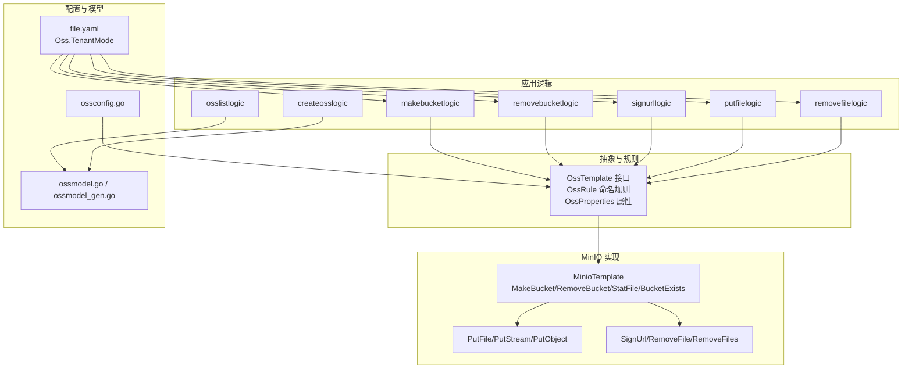
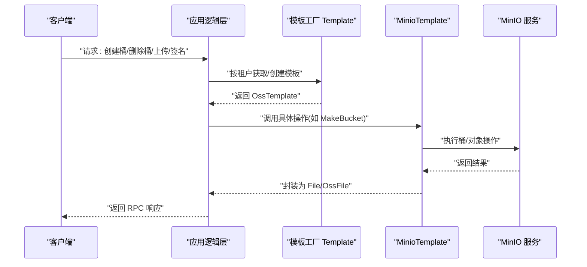
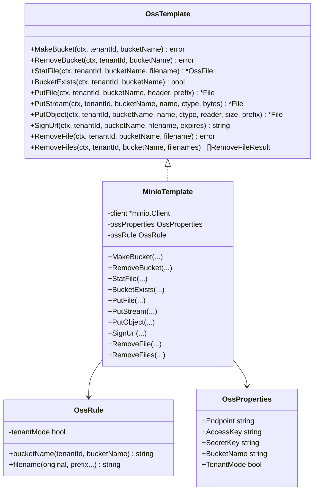
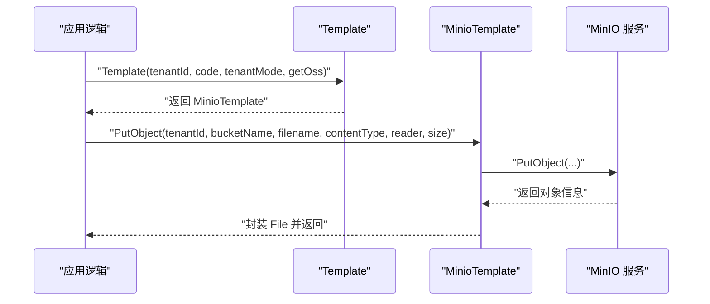
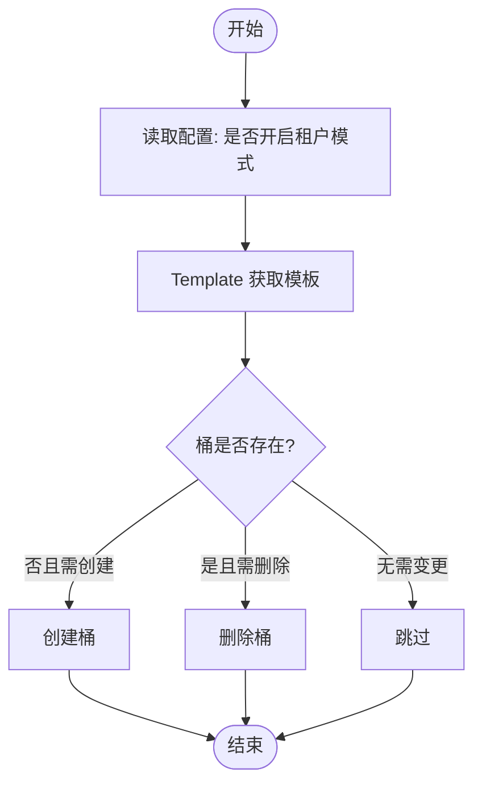
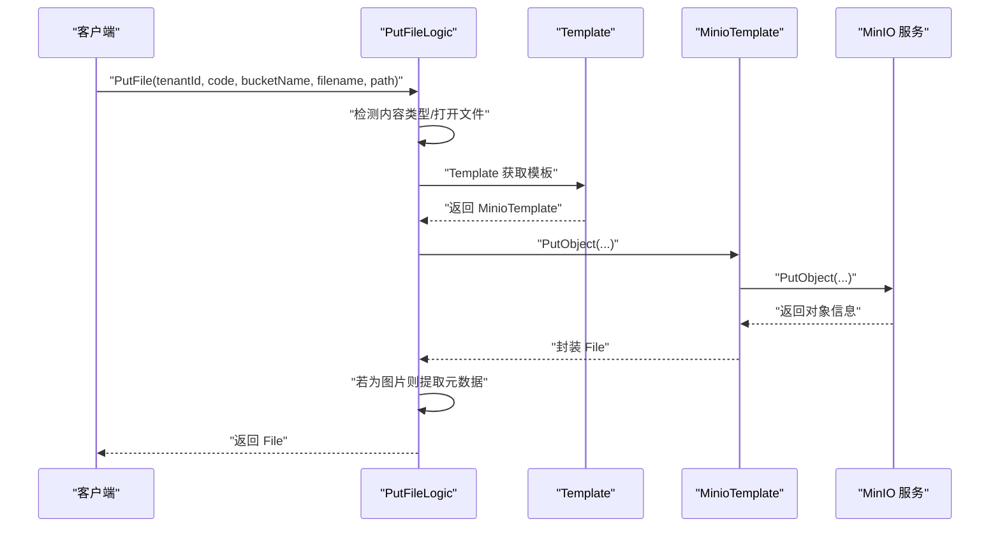
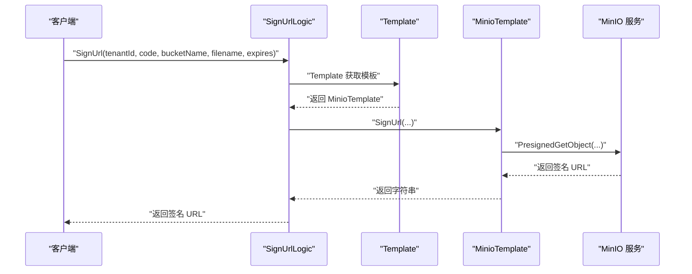
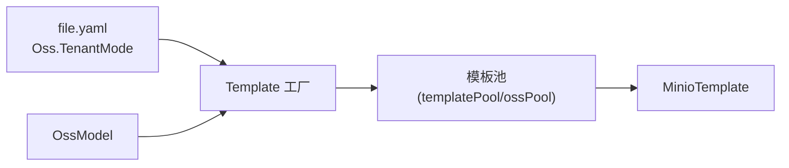
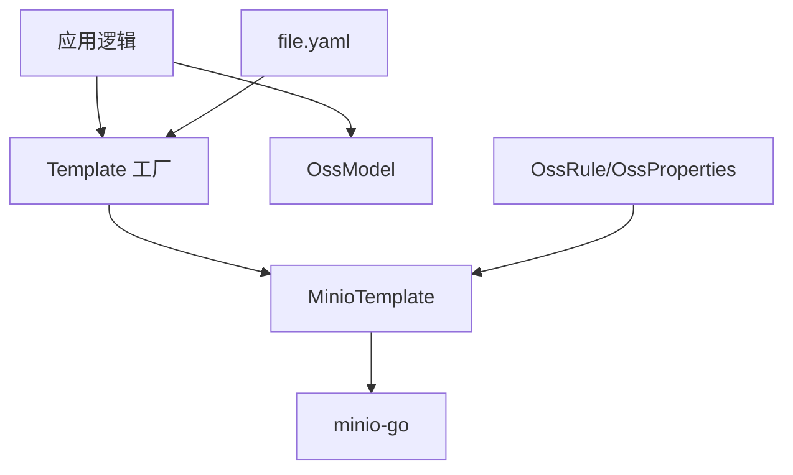

# 对象存储集成

<cite>
**本文引用的文件**
- [common/ossx/minio_oss.go](file://common/ossx/minio_oss.go)
- [common/ossx/ossx.go](file://common/ossx/ossx.go)
- [common/ossx/osssconfig/ossconfig.go](file://common/ossx/osssconfig/ossconfig.go)
- [model/ossmodel.go](file://model/ossmodel.go)
- [model/ossmodel_gen.go](file://model/ossmodel_gen.go)
- [app/file/file.proto](file://app/file/file.proto)
- [app/file/etc/file.yaml](file://app/file/etc/file.yaml)
- [app/file/internal/logic/makebucketlogic.go](file://app/file/internal/logic/makebucketlogic.go)
- [app/file/internal/logic/removebucketlogic.go](file://app/file/internal/logic/removebucketlogic.go)
- [app/file/internal/logic/signurllogic.go](file://app/file/internal/logic/signurllogic.go)
- [app/file/internal/logic/putfilelogic.go](file://app/file/internal/logic/putfilelogic.go)
- [app/file/internal/logic/removefilelogic.go](file://app/file/internal/logic/removefilelogic.go)
- [app/file/internal/logic/osslistlogic.go](file://app/file/internal/logic/osslistlogic.go)
- [app/file/internal/logic/createosslogic.go](file://app/file/internal/logic/createosslogic.go)
- [app/file/internal/svc/servicecontext.go](file://app/file/internal/svc/servicecontext.go)
</cite>

## 目录
1. [引言](#引言)
2. [项目结构](#项目结构)
3. [核心组件](#核心组件)
4. [架构总览](#架构总览)
5. [详细组件分析](#详细组件分析)
6. [依赖分析](#依赖分析)
7. [性能考虑](#性能考虑)
8. [故障排查指南](#故障排查指南)
9. [结论](#结论)
10. [附录](#附录)

## 引言
本文件面向“对象存储集成”主题，围绕仓库中的 MinIO 兼容对象存储实现展开，系统性梳理存储桶管理、文件系统抽象、配置与连接池、多存储后端扩展点、权限与签名链接、元数据与缩略图处理、性能优化与成本控制、安全策略与故障恢复等关键能力。文档以代码为依据，辅以可视化图示，帮助读者快速理解并落地使用。

## 项目结构
对象存储能力主要由以下模块构成：
- 抽象层与规则：统一接口、命名规则、租户模式、连接池与模板工厂
- MinIO 实现：基于 minio-go 的具体实现
- 应用侧逻辑：围绕 OSS 的 CRUD、桶管理、文件上传/删除/签名等 RPC 业务逻辑
- 配置与模型：应用配置、OSS 配置开关、数据库模型与生成代码

图表来源
- [common/ossx/ossx.go:28-151](file://common/ossx/ossx.go#L28-L151)
- [common/ossx/minio_oss.go:20-242](file://common/ossx/minio_oss.go#L20-L242)
- [app/file/etc/file.yaml:17-19](file://app/file/etc/file.yaml#L17-L19)
- [model/ossmodel.go:10-31](file://model/ossmodel.go#L10-L31)
- [model/ossmodel_gen.go](file://model/ossmodel_gen.go)

章节来源
- [common/ossx/ossx.go:17-151](file://common/ossx/ossx.go#L17-L151)
- [common/ossx/minio_oss.go:20-242](file://common/ossx/minio_oss.go#L20-L242)
- [app/file/etc/file.yaml:17-19](file://app/file/etc/file.yaml#L17-L19)
- [model/ossmodel.go:10-31](file://model/ossmodel.go#L10-L31)

## 核心组件
- 抽象接口与规则
  - OssTemplate：统一的存储操作接口，包含桶管理、文件操作、签名、批量删除等方法
  - OssRule：命名规则，支持租户前缀与随机文件名生成
  - OssProperties：存储服务通用属性（端点、密钥、默认桶等）
- MinIO 实现
  - MinioTemplate：基于 minio-go 的具体实现，封装桶与对象操作
- 连接池与模板工厂
  - Template：按租户维度缓存模板实例，避免重复初始化
- 应用逻辑
  - 提供创建/查询/更新/删除 OSS 配置，以及桶的创建/删除、文件上传/删除、签名 URL 等 RPC 逻辑

章节来源
- [common/ossx/ossx.go:28-151](file://common/ossx/ossx.go#L28-L151)
- [common/ossx/minio_oss.go:20-242](file://common/ossx/minio_oss.go#L20-L242)
- [app/file/internal/logic/makebucketlogic.go:26-44](file://app/file/internal/logic/makebucketlogic.go#L26-L44)
- [app/file/internal/logic/removebucketlogic.go:26-44](file://app/file/internal/logic/removebucketlogic.go#L26-L44)
- [app/file/internal/logic/signurllogic.go:29-60](file://app/file/internal/logic/signurllogic.go#L29-L60)
- [app/file/internal/logic/putfilelogic.go:33-77](file://app/file/internal/logic/putfilelogic.go#L33-L77)
- [app/file/internal/logic/removefilelogic.go:26-38](file://app/file/internal/logic/removefilelogic.go#L26-L38)
- [app/file/internal/logic/osslistlogic.go:27-62](file://app/file/internal/logic/osslistlogic.go#L27-L62)
- [app/file/internal/logic/createosslogic.go:26-45](file://app/file/internal/logic/createosslogic.go#L26-L45)

## 架构总览
下图展示从应用逻辑到抽象接口再到 MinIO 实现的整体调用链路，以及配置与模型如何参与其中。

图表来源
- [common/ossx/ossx.go:109-151](file://common/ossx/ossx.go#L109-L151)
- [common/ossx/minio_oss.go:26-38](file://common/ossx/minio_oss.go#L26-L38)
- [common/ossx/minio_oss.go:65-94](file://common/ossx/minio_oss.go#L65-L94)
- [common/ossx/minio_oss.go:150-162](file://common/ossx/minio_oss.go#L150-L162)

## 详细组件分析

### 抽象接口与命名规则
- OssTemplate 接口定义了统一的操作集合，便于替换不同后端（当前仅实现 MinIO）
- OssRule 提供两种命名策略：
  - 存储桶命名：可选租户前缀拼接
  - 文件名命名：路径前缀 + 日期目录 + UUID + 原扩展名；支持固定文件名覆盖
- OssProperties 统一封装端点、密钥、默认桶等属性

图表来源
- [common/ossx/ossx.go:28-105](file://common/ossx/ossx.go#L28-L105)
- [common/ossx/minio_oss.go:20-242](file://common/ossx/minio_oss.go#L20-L242)

章节来源
- [common/ossx/ossx.go:28-105](file://common/ossx/ossx.go#L28-L105)
- [common/ossx/minio_oss.go:20-242](file://common/ossx/minio_oss.go#L20-L242)

### MinIO 实现细节
- 客户端初始化：基于 Endpoint、AccessKey、SecretKey 创建 minio.Client
- 桶管理：创建/删除/存在性检查
- 文件操作：支持 multipart 表单、字节流、io.Reader 三种上传方式；统计文件信息
- 签名链接：生成带过期时间的预签名 URL
- 批量删除：并发删除多个对象并收集错误

图表来源
- [common/ossx/ossx.go:109-151](file://common/ossx/ossx.go#L109-L151)
- [common/ossx/minio_oss.go:124-148](file://common/ossx/minio_oss.go#L124-L148)

章节来源
- [common/ossx/minio_oss.go:65-148](file://common/ossx/minio_oss.go#L65-L148)
- [common/ossx/minio_oss.go:150-172](file://common/ossx/minio_oss.go#L150-L172)
- [common/ossx/minio_oss.go:174-204](file://common/ossx/minio_oss.go#L174-L204)

### 存储桶管理与权限
- 创建/删除存储桶：通过 Template 获取模板后调用对应方法
- 存在性检查：先判断再决定是否创建或删除
- 权限与签名：签名 URL 用于临时授权访问，可设置过期时间

图表来源
- [app/file/etc/file.yaml:17-19](file://app/file/etc/file.yaml#L17-L19)
- [app/file/internal/logic/makebucketlogic.go:26-44](file://app/file/internal/logic/makebucketlogic.go#L26-L44)
- [app/file/internal/logic/removebucketlogic.go:26-44](file://app/file/internal/logic/removebucketlogic.go#L26-L44)

章节来源
- [app/file/internal/logic/makebucketlogic.go:26-44](file://app/file/internal/logic/makebucketlogic.go#L26-L44)
- [app/file/internal/logic/removebucketlogic.go:26-44](file://app/file/internal/logic/removebucketlogic.go#L26-L44)

### 文件上传与元数据
- 上传入口：支持本地文件路径、分片流、字节流三种方式
- 内容类型检测：自动识别 MIME 类型
- 元数据：对图片提取 EXIF 等元数据并回填响应
- 缩略图：协议中定义了缩略图字段，但当前上传逻辑未体现缩略图生成流程

图表来源
- [app/file/internal/logic/putfilelogic.go:33-77](file://app/file/internal/logic/putfilelogic.go#L33-L77)
- [common/ossx/ossx.go:109-151](file://common/ossx/ossx.go#L109-L151)
- [common/ossx/minio_oss.go:124-148](file://common/ossx/minio_oss.go#L124-L148)

章节来源
- [app/file/internal/logic/putfilelogic.go:33-77](file://app/file/internal/logic/putfilelogic.go#L33-L77)
- [app/file/file.proto:34-46](file://app/file/file.proto#L34-L46)

### 签名链接与生命周期
- 签名链接：根据配置的过期时间生成预签名 URL，用于临时授权下载
- 生命周期策略：当前未见具体实现；可在 MinIO 控制台或 SDK 中配置，不在本仓库范围内

图表来源
- [app/file/internal/logic/signurllogic.go:29-60](file://app/file/internal/logic/signurllogic.go#L29-L60)
- [common/ossx/minio_oss.go:150-162](file://common/ossx/minio_oss.go#L150-L162)

章节来源
- [app/file/internal/logic/signurllogic.go:29-60](file://app/file/internal/logic/signurllogic.go#L29-L60)
- [common/ossx/minio_oss.go:150-162](file://common/ossx/minio_oss.go#L150-L162)

### 配置管理与连接池
- 应用配置：file.yaml 中的 Oss.TenantMode 控制是否启用租户模式
- 模板池：按租户 ID 缓存模板实例，避免重复初始化
- 模型：OssModel 提供 OSS 配置的增删改查能力

图表来源
- [app/file/etc/file.yaml:17-19](file://app/file/etc/file.yaml#L17-L19)
- [common/ossx/ossx.go:109-151](file://common/ossx/ossx.go#L109-L151)
- [model/ossmodel.go:10-31](file://model/ossmodel.go#L10-L31)

章节来源
- [app/file/etc/file.yaml:17-19](file://app/file/etc/file.yaml#L17-L19)
- [common/ossx/ossx.go:109-151](file://common/ossx/ossx.go#L109-L151)
- [model/ossmodel.go:10-31](file://model/ossmodel.go#L10-L31)

## 依赖分析
- 组件耦合
  - 应用逻辑依赖 Template 工厂与 OssModel
  - MinioTemplate 依赖 minio-go 客户端
  - OssRule 与 OssProperties 作为配置与命名策略载体
- 外部依赖
  - minio-go：MinIO 客户端 SDK
  - go-zero：RPC、配置、日志、数据库模型
- 可能的循环依赖
  - 当前结构清晰，未发现循环导入

图表来源
- [common/ossx/ossx.go:109-151](file://common/ossx/ossx.go#L109-L151)
- [common/ossx/minio_oss.go:214-235](file://common/ossx/minio_oss.go#L214-L235)
- [app/file/etc/file.yaml:17-19](file://app/file/etc/file.yaml#L17-L19)
- [model/ossmodel.go:10-31](file://model/ossmodel.go#L10-L31)

章节来源
- [common/ossx/ossx.go:109-151](file://common/ossx/ossx.go#L109-L151)
- [common/ossx/minio_oss.go:214-235](file://common/ossx/minio_oss.go#L214-L235)
- [app/file/etc/file.yaml:17-19](file://app/file/etc/file.yaml#L17-L19)
- [model/ossmodel.go:10-31](file://model/ossmodel.go#L10-L31)

## 性能考虑
- 连接池与复用
  - 模板按租户缓存，减少重复初始化开销
  - 建议：在高并发场景下结合 go-zero 的并发模型与连接池参数进行压测与调优
- 上传路径优化
  - PutObject 支持 io.Reader，适合大文件分块上传；建议配合断点续传与并发分片
- 缓存策略
  - 可在应用层对签名 URL 与文件元信息做短期缓存，降低 MinIO 查询压力
- 成本控制
  - 合理设置签名过期时间，避免长期有效链接造成带宽浪费
  - 使用对象标签与生命周期策略（在 MinIO 控制台或 SDK 中配置）实现冷热分层与自动清理

## 故障排查指南
- 客户端为空
  - 若出现“client is nil”，检查模板初始化与配置项是否正确
- 桶不存在或权限不足
  - 先调用 BucketExists，确认桶状态；核对 AccessKey/SecretKey 与 Endpoint
- 上传失败
  - 检查文件大小、内容类型与路径；关注 PutObject 返回的错误信息
- 批量删除异常
  - RemoveFiles 会返回每个对象的错误映射，按需记录与重试
- 签名链接无效
  - 确认过期时间与对象路径；检查签名 URL 生成逻辑

章节来源
- [common/ossx/minio_oss.go:237-242](file://common/ossx/minio_oss.go#L237-L242)
- [common/ossx/minio_oss.go:174-204](file://common/ossx/minio_oss.go#L174-L204)
- [common/ossx/minio_oss.go:150-162](file://common/ossx/minio_oss.go#L150-L162)

## 结论
该对象存储集成以抽象接口为核心，通过模板工厂与连接池实现高效复用，并以 MinIO 为默认实现提供了完整的桶与对象管理能力。应用层围绕 RPC 提供了创建/删除桶、上传/删除文件、签名链接等常用功能。未来可在此基础上扩展更多存储后端、完善生命周期策略与版本控制、引入更细粒度的缓存与成本控制策略。

## 附录

### 存储配置模板
- 应用配置（file.yaml）
  - 关键项：Oss.TenantMode（是否启用租户模式）
  - 参考路径：[app/file/etc/file.yaml:17-19](file://app/file/etc/file.yaml#L17-L19)
- OSS 配置模型
  - 字段：tenantId、category、ossCode、endpoint、accessKey、secretKey、bucketName、appId、region、remark、status
  - 参考路径：[app/file/file.proto:17-32](file://app/file/file.proto#L17-L32)
- OSS 模型接口与生成代码
  - 接口：OssModel
  - 生成代码：ossmodel_gen.go
  - 参考路径：[model/ossmodel.go:10-31](file://model/ossmodel.go#L10-L31)，[model/ossmodel_gen.go](file://model/ossmodel_gen.go)

### 安全策略实施
- 最小权限原则：为不同租户或业务线分配独立的 AccessKey/SecretKey 与存储桶
- 网络隔离：通过 VPC/防火墙限制 MinIO 访问来源
- 加密传输：确保 Endpoint 使用 HTTPS（当前实现 Secure=false，建议生产环境改为 true）
- 签名链接：严格设置过期时间，避免长期有效链接泄露

### 故障恢复机制
- 模板重建：当配置变更时，模板工厂会重新创建实例并更新缓存
- 批量删除容错：逐对象收集错误，便于定位与重试
- 日志与监控：结合应用日志与 MinIO 服务端日志进行问题定位