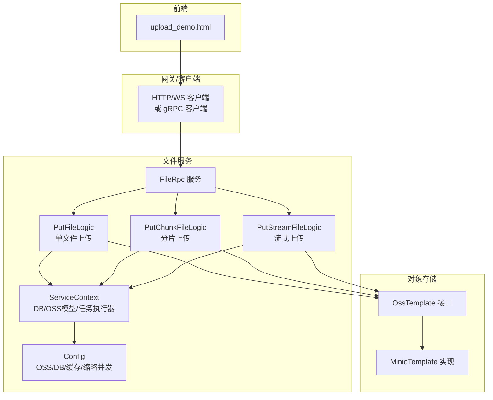
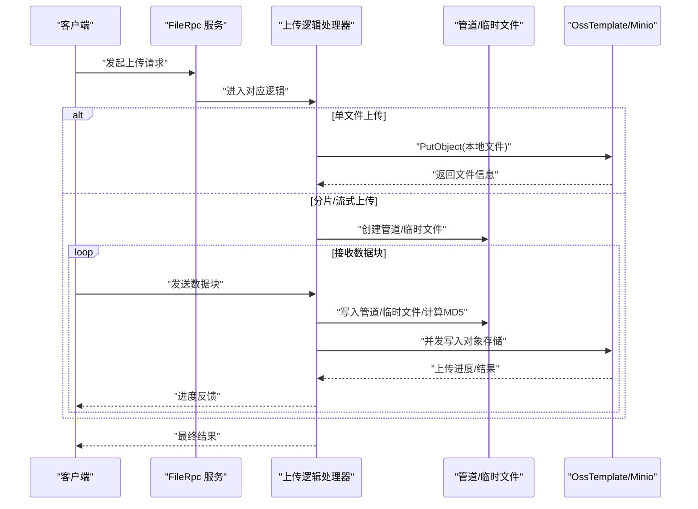
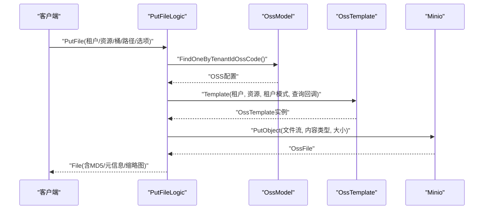
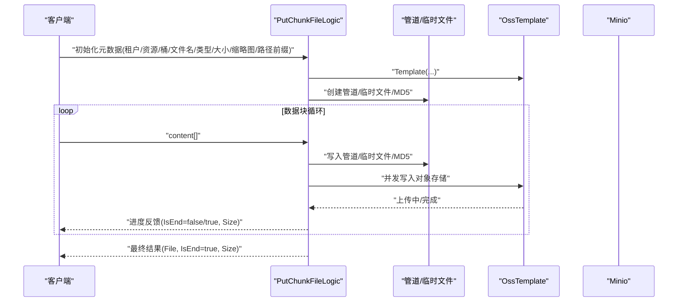
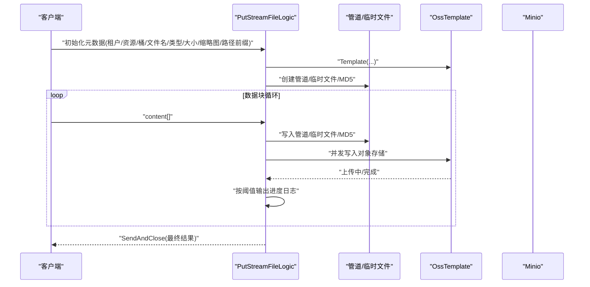
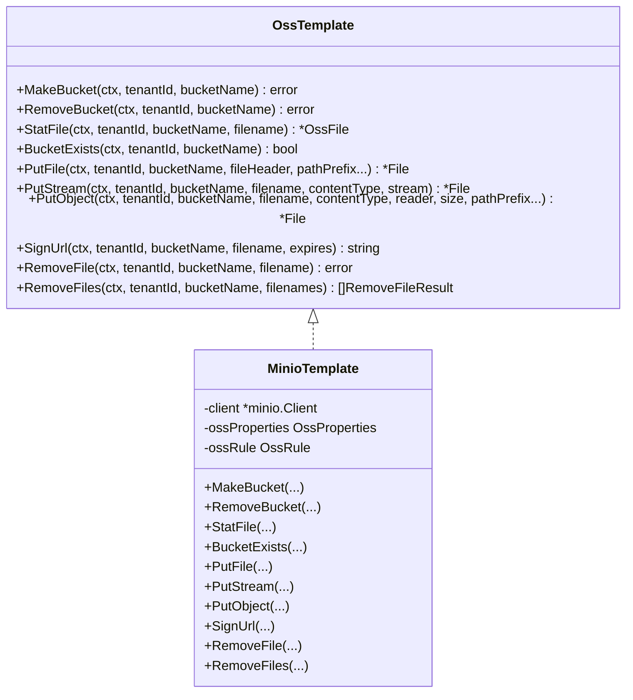
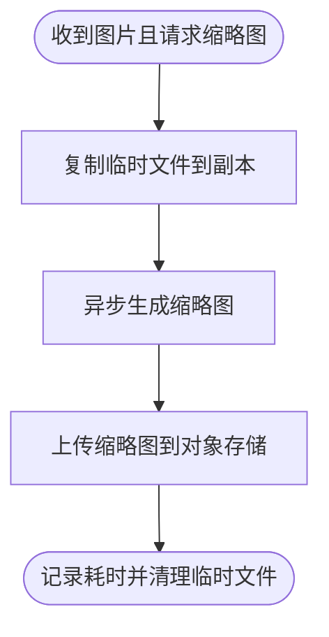
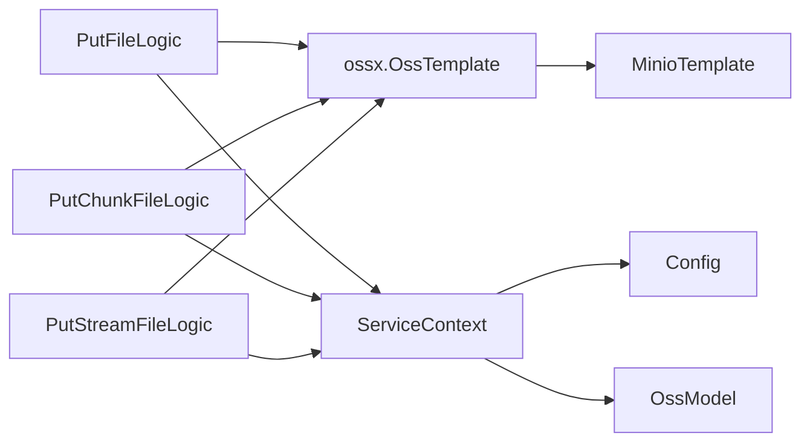

# 文件上传机制

<cite>
**本文引用的文件**
- [app/file/internal/logic/putfilelogic.go](file://app/file/internal/logic/putfilelogic.go)
- [app/file/internal/logic/putchunkfilelogic.go](file://app/file/internal/logic/putchunkfilelogic.go)
- [app/file/internal/logic/putstreamfilelogic.go](file://app/file/internal/logic/putstreamfilelogic.go)
- [app/file/file.proto](file://app/file/file.proto)
- [common/ossx/ossx.go](file://common/ossx/ossx.go)
- [common/ossx/minio_oss.go](file://common/ossx/minio_oss.go)
- [common/imagex/exifx.go](file://common/imagex/exifx.go)
- [common/tool/tool.go](file://common/tool/tool.go)
- [app/file/internal/svc/servicecontext.go](file://app/file/internal/svc/servicecontext.go)
- [app/file/etc/file.yaml](file://app/file/etc/file.yaml)
- [app/file/internal/config/config.go](file://app/file/internal/config/config.go)
- [model/ossmodel.go](file://model/ossmodel.go)
- [gtw/upload_demo.html](file://gtw/upload_demo.html)
</cite>

## 目录
1. [简介](#简介)
2. [项目结构](#项目结构)
3. [核心组件](#核心组件)
4. [架构总览](#架构总览)
5. [详细组件分析](#详细组件分析)
6. [依赖分析](#依赖分析)
7. [性能考量](#性能考量)
8. [故障排查指南](#故障排查指南)
9. [结论](#结论)
10. [附录](#附录)

## 简介
本文件上传机制覆盖三类上传方式：
- 单文件上传：适用于中小文件，直接读取本地文件并通过对象存储接口上传。
- 分片上传：适用于大文件，客户端将文件切分为多个分片，按序发送至服务端，服务端并行写入对象存储，完成后返回结果。
- 流式上传：适用于实时传输与大文件，客户端以流式方式持续推送数据，服务端边接收边写入对象存储，支持进度反馈。

本文档深入解析每种方式的实现原理、数据流、并发控制、进度跟踪、断点续传思路、异常处理与性能优化建议，并提供配置参数说明与最佳实践。

## 项目结构
围绕文件上传的关键模块如下：
- 服务端逻辑层：单文件上传、分片上传、流式上传三个逻辑处理器。
- 协议定义：gRPC 服务与消息结构，定义上传请求/响应字段。
- 对象存储封装：统一模板接口与 MinIO 实现，负责桶、对象的创建、上传、签名等。
- 工具与图像元数据：文件大小格式化、EXIF 元数据提取、缩略图生成调度。
- 服务上下文与配置：数据库连接、缩略图并发任务执行器、OSS 配置。
- 前端演示页面：展示如何以流式方式上传文件并观察进度。

图表来源
- [app/file/file.proto:270-287](file://app/file/file.proto#L270-L287)
- [app/file/internal/logic/putfilelogic.go:33-77](file://app/file/internal/logic/putfilelogic.go#L33-L77)
- [app/file/internal/logic/putchunkfilelogic.go:38-269](file://app/file/internal/logic/putchunkfilelogic.go#L38-L269)
- [app/file/internal/logic/putstreamfilelogic.go:43-286](file://app/file/internal/logic/putstreamfilelogic.go#L43-L286)
- [common/ossx/ossx.go:28-39](file://common/ossx/ossx.go#L28-L39)
- [common/ossx/minio_oss.go:124-148](file://common/ossx/minio_oss.go#L124-L148)
- [app/file/internal/svc/servicecontext.go:12-26](file://app/file/internal/svc/servicecontext.go#L12-L26)
- [app/file/internal/config/config.go:10-30](file://app/file/internal/config/config.go#L10-L30)

章节来源
- [app/file/file.proto:176-225](file://app/file/file.proto#L176-L225)
- [app/file/etc/file.yaml:1-23](file://app/file/etc/file.yaml#L1-L23)
- [app/file/internal/config/config.go:10-30](file://app/file/internal/config/config.go#L10-L30)

## 核心组件
- 单文件上传逻辑：读取本地文件，探测内容类型，调用对象存储模板上传，可选提取图片 EXIF 元数据并返回。
- 分片上传逻辑：基于 gRPC 双向流，客户端按块发送数据；服务端维护临时文件、MD5 流、内容类型探测、EXIF 缓存、并发写入对象存储，周期性返回进度。
- 流式上传逻辑：与分片类似，但客户端以持续流推送；服务端同样边收边写，支持大文件与实时传输，具备进度日志阈值控制。
- 对象存储模板：抽象统一上传接口，根据租户与配置选择具体实现（当前为 MinIO），支持桶管理、对象上传、签名、删除等。
- 缩略图与并发：通过任务执行器控制缩略图生成并发度，避免高并发下资源争用。
- 配置与上下文：集中管理 OSS、数据库、缓存、缩略图并发等配置，并注入到服务上下文中。

章节来源
- [app/file/internal/logic/putfilelogic.go:33-77](file://app/file/internal/logic/putfilelogic.go#L33-L77)
- [app/file/internal/logic/putchunkfilelogic.go:38-269](file://app/file/internal/logic/putchunkfilelogic.go#L38-L269)
- [app/file/internal/logic/putstreamfilelogic.go:43-286](file://app/file/internal/logic/putstreamfilelogic.go#L43-L286)
- [common/ossx/ossx.go:28-39](file://common/ossx/ossx.go#L28-L39)
- [common/ossx/minio_oss.go:124-148](file://common/ossx/minio_oss.go#L124-L148)
- [app/file/internal/svc/servicecontext.go:12-26](file://app/file/internal/svc/servicecontext.go#L12-L26)
- [app/file/internal/config/config.go:10-30](file://app/file/internal/config/config.go#L10-L30)

## 架构总览
以下序列图展示三类上传的典型调用链路与关键交互点。

图表来源
- [app/file/file.proto:270-287](file://app/file/file.proto#L270-L287)
- [app/file/internal/logic/putfilelogic.go:33-77](file://app/file/internal/logic/putfilelogic.go#L33-L77)
- [app/file/internal/logic/putchunkfilelogic.go:38-269](file://app/file/internal/logic/putchunkfilelogic.go#L38-L269)
- [app/file/internal/logic/putstreamfilelogic.go:43-286](file://app/file/internal/logic/putstreamfilelogic.go#L43-L286)
- [common/ossx/ossx.go:28-39](file://common/ossx/ossx.go#L28-L39)
- [common/ossx/minio_oss.go:124-148](file://common/ossx/minio_oss.go#L124-L148)

## 详细组件分析

### 单文件上传（PutFile）
- 输入：租户ID、资源编号、存储桶、文件名、本地路径、是否生成缩略图、路径前缀等。
- 处理流程：
  - 通过租户与资源编号查询 OSS 配置，构建对象存储模板。
  - 打开本地文件，读取前 512 字节探测内容类型，重置文件指针继续读取。
  - 调用模板 PutObject 将文件流上传至对象存储。
  - 若为图片类型，提取 EXIF 元数据并填充返回结构。
- 输出：文件链接、域名、名称、大小、格式化大小、MD5、图片元信息、缩略图链接与名称等。

图表来源
- [app/file/internal/logic/putfilelogic.go:33-77](file://app/file/internal/logic/putfilelogic.go#L33-L77)
- [model/ossmodel.go:10-13](file://model/ossmodel.go#L10-L13)
- [common/ossx/ossx.go:109-151](file://common/ossx/ossx.go#L109-L151)
- [common/ossx/minio_oss.go:124-148](file://common/ossx/minio_oss.go#L124-L148)

章节来源
- [app/file/internal/logic/putfilelogic.go:33-77](file://app/file/internal/logic/putfilelogic.go#L33-L77)
- [app/file/file.proto:176-189](file://app/file/file.proto#L176-L189)

### 分片上传（PutChunkFile）
- 适用场景：大文件、网络不稳定、需要断点续传能力。
- 关键特性：
  - gRPC 双向流，客户端按块发送数据。
  - 服务端使用 io.Pipe 与临时文件，同时计算 MD5，探测内容类型，缓存前若干字节用于 EXIF。
  - 并发写入对象存储，周期性返回进度（已上传字节数、是否结束）。
  - 支持图片缩略图异步生成与上传。
- 分片大小与编号：
  - 客户端按固定大小切分（示例中使用常量与阈值控制），服务端按收到的数据块累计字节数与块编号。
  - 服务端在初始化阶段解析一次元数据（租户ID、资源编号、存储桶、文件名、内容类型、总大小、是否缩略图、路径前缀）。
- 并发控制：
  - 通过 goroutine 将管道数据写入对象存储，避免阻塞接收循环。
- 断点续传思路：
  - 服务端记录已写入字节数，若客户端重启可从断点继续发送；当前服务端未实现服务端侧断点记录，断点续传需客户端侧维护。
- 异常处理：
  - 读取流错误、对象存储写入错误、临时文件清理均纳入错误处理与日志记录。

图表来源
- [app/file/internal/logic/putchunkfilelogic.go:38-269](file://app/file/internal/logic/putchunkfilelogic.go#L38-L269)
- [app/file/file.proto:191-207](file://app/file/file.proto#L191-L207)
- [common/ossx/ossx.go:28-39](file://common/ossx/ossx.go#L28-L39)
- [common/ossx/minio_oss.go:124-148](file://common/ossx/minio_oss.go#L124-L148)

章节来源
- [app/file/internal/logic/putchunkfilelogic.go:38-269](file://app/file/internal/logic/putchunkfilelogic.go#L38-L269)
- [app/file/file.proto:191-207](file://app/file/file.proto#L191-L207)

### 流式上传（PutStreamFile）
- 适用场景：实时传输、大文件、边传边用。
- 关键特性：
  - 与分片上传类似的接收与写入流程，但客户端以持续流推送。
  - 服务端记录块编号与累计字节数，按阈值输出进度日志。
  - 支持图片 EXIF 元数据提取与缩略图异步生成。
- 进度跟踪：
  - 通过累计字节数与阈值触发日志输出，便于监控上传进度。
- 异常处理：
  - 读取流错误、对象存储写入错误、临时文件清理均纳入错误处理与日志记录。

图表来源
- [app/file/internal/logic/putstreamfilelogic.go:43-286](file://app/file/internal/logic/putstreamfilelogic.go#L43-L286)
- [app/file/file.proto:209-225](file://app/file/file.proto#L209-L225)
- [common/ossx/ossx.go:28-39](file://common/ossx/ossx.go#L28-L39)
- [common/ossx/minio_oss.go:124-148](file://common/ossx/minio_oss.go#L124-L148)

章节来源
- [app/file/internal/logic/putstreamfilelogic.go:43-286](file://app/file/internal/logic/putstreamfilelogic.go#L43-L286)
- [app/file/file.proto:209-225](file://app/file/file.proto#L209-L225)

### 对象存储模板与 MinIO 实现
- OssTemplate 抽象了桶管理、对象上传、签名、删除等通用能力。
- MinioTemplate 基于 MinIO SDK 实现 PutObject、StatFile、SignUrl 等方法。
- 模板工厂根据租户与配置动态创建/复用模板，避免重复初始化。

图表来源
- [common/ossx/ossx.go:28-39](file://common/ossx/ossx.go#L28-L39)
- [common/ossx/minio_oss.go:20-148](file://common/ossx/minio_oss.go#L20-L148)

章节来源
- [common/ossx/ossx.go:28-39](file://common/ossx/ossx.go#L28-L39)
- [common/ossx/minio_oss.go:20-148](file://common/ossx/minio_oss.go#L20-L148)

### 缩略图与并发控制
- 缩略图生成通过任务执行器调度，避免高并发下资源争用。
- 服务端在检测到图片且请求缩略图时，复制临时文件到副本，异步生成缩略图并上传，完成后记录耗时。

图表来源
- [app/file/internal/logic/putchunkfilelogic.go:233-255](file://app/file/internal/logic/putchunkfilelogic.go#L233-L255)
- [app/file/internal/logic/putstreamfilelogic.go:243-265](file://app/file/internal/logic/putstreamfilelogic.go#L243-L265)
- [app/file/internal/svc/servicecontext.go:16-24](file://app/file/internal/svc/servicecontext.go#L16-L24)

章节来源
- [app/file/internal/svc/servicecontext.go:16-24](file://app/file/internal/svc/servicecontext.go#L16-L24)
- [app/file/internal/logic/putchunkfilelogic.go:233-255](file://app/file/internal/logic/putchunkfilelogic.go#L233-L255)
- [app/file/internal/logic/putstreamfilelogic.go:243-265](file://app/file/internal/logic/putstreamfilelogic.go#L243-L265)

### 前端演示与使用
- 前端演示页面展示了如何以流式方式上传文件，包含并发控制、进度显示、失败重试、统计信息等功能。
- 页面通过 XMLHttpRequest 发送 FormData 至服务端，服务端以流式方式接收并写入对象存储。

章节来源
- [gtw/upload_demo.html:433-434](file://gtw/upload_demo.html#L433-L434)

## 依赖分析
- 上传逻辑依赖对象存储模板与 MinIO 实现，确保上传路径一致。
- 服务上下文注入数据库模型与任务执行器，支撑 OSS 配置查询与缩略图并发处理。
- 配置集中于 Config 结构体，包含 Nacos 注册、DB 连接、缓存、OSS 配置与缩略图并发度。

图表来源
- [app/file/internal/logic/putfilelogic.go:33-77](file://app/file/internal/logic/putfilelogic.go#L33-L77)
- [app/file/internal/logic/putchunkfilelogic.go:38-269](file://app/file/internal/logic/putchunkfilelogic.go#L38-L269)
- [app/file/internal/logic/putstreamfilelogic.go:43-286](file://app/file/internal/logic/putstreamfilelogic.go#L43-L286)
- [common/ossx/ossx.go:28-39](file://common/ossx/ossx.go#L28-L39)
- [common/ossx/minio_oss.go:124-148](file://common/ossx/minio_oss.go#L124-L148)
- [app/file/internal/svc/servicecontext.go:12-26](file://app/file/internal/svc/servicecontext.go#L12-L26)
- [app/file/internal/config/config.go:10-30](file://app/file/internal/config/config.go#L10-L30)
- [model/ossmodel.go:10-13](file://model/ossmodel.go#L10-L13)

章节来源
- [app/file/internal/config/config.go:10-30](file://app/file/internal/config/config.go#L10-L30)
- [app/file/etc/file.yaml:1-23](file://app/file/etc/file.yaml#L1-L23)
- [model/ossmodel.go:10-13](file://model/ossmodel.go#L10-L13)

## 性能考量
- 分片大小与并发：
  - 分片大小建议结合网络带宽与对象存储最佳实践设置；当前实现以固定阈值与块编号推进，客户端可按需调整。
  - 缩略图并发度由配置项控制，避免过多并发导致磁盘与 CPU 压力过大。
- 内存与磁盘优化：
  - 使用 io.Pipe 与临时文件配合，避免将整个文件加载到内存；MD5 流式计算降低额外内存占用。
  - 临时目录与清理逻辑确保异常退出后资源释放。
- 进度日志与可观测性：
  - 分片与流式上传均支持按阈值输出进度日志，便于监控与调试。
- 网络异常与超时：
  - 服务端对读取流错误与对象存储写入错误进行捕获与日志记录；建议在客户端侧增加重试与断点续传策略。

[本节为通用性能建议，无需特定文件引用]

## 故障排查指南
- 上传失败：
  - 检查对象存储连接参数（Endpoint、AccessKey、SecretKey、BucketName）与租户配置是否正确。
  - 查看服务端日志中关于“Failed to read from stream”、“Failed to write to OSS”等错误信息。
- 缩略图未生成：
  - 确认请求中“isThumb”为真，且为图片类型；检查缩略图并发任务执行器是否正常工作。
- 进度异常：
  - 检查客户端是否按固定大小切分与发送；服务端日志中确认累计字节数与阈值触发情况。
- 临时文件未清理：
  - 确认服务端在异常退出时是否执行了临时文件删除逻辑。

章节来源
- [app/file/internal/logic/putchunkfilelogic.go:96-98](file://app/file/internal/logic/putchunkfilelogic.go#L96-L98)
- [app/file/internal/logic/putstreamfilelogic.go:104-107](file://app/file/internal/logic/putstreamfilelogic.go#L104-L107)
- [app/file/internal/svc/servicecontext.go:16-24](file://app/file/internal/svc/servicecontext.go#L16-L24)

## 结论
本文件上传机制通过统一的对象存储模板与多种上传方式满足不同场景需求：
- 单文件上传适合中小文件与简单流程；
- 分片上传与流式上传适合大文件与实时传输，具备进度反馈与缩略图异步处理能力；
- 通过配置化的并发与日志策略，兼顾性能与可观测性。

建议在生产环境中结合业务流量与网络条件，合理设置分片大小与并发度，并完善客户端断点续传与重试策略。

[本节为总结性内容，无需特定文件引用]

## 附录

### 上传配置参数说明
- 服务端配置（file.yaml）
  - Name/ListenOn/Timeout/Mode/Log：服务基本信息与日志配置。
  - NacosConfig：服务注册与发现配置。
  - Oss：租户模式开关。
  - ThumbTaskConcurrency：缩略图并发度。
  - DB：数据库连接串。

- 服务配置（Config）
  - NacosConfig：同上。
  - DB：数据库连接串。
  - Cache：缓存配置。
  - Oss：对象存储配置。
  - ThumbTaskConcurrency：缩略图并发度。

章节来源
- [app/file/etc/file.yaml:1-23](file://app/file/etc/file.yaml#L1-L23)
- [app/file/internal/config/config.go:10-30](file://app/file/internal/config/config.go#L10-L30)

### 上传协议字段说明
- 单文件上传请求字段：租户ID、资源编号、存储桶、文件名、内容类型、本地路径、是否缩略图、路径前缀。
- 分片上传请求字段：租户ID、资源编号、存储桶、文件名、内容类型、数据块、总大小、是否缩略图、路径前缀。
- 流式上传请求字段：租户ID、资源编号、存储桶、文件名、内容类型、数据块、总大小、是否缩略图、路径前缀。
- 返回字段：文件链接、域名、名称、大小、格式化大小、MD5、图片元信息、缩略图链接与名称等。

章节来源
- [app/file/file.proto:176-225](file://app/file/file.proto#L176-L225)

### 最佳实践指南
- 分片大小建议：根据网络带宽与对象存储最佳实践设置；客户端按固定大小切分并发送。
- 并发控制：合理设置缩略图并发度，避免磁盘与 CPU 压力过大。
- 进度与日志：开启进度日志阈值，便于监控上传过程。
- 异常处理：在客户端侧增加重试与断点续传策略；服务端对读取与写入错误进行捕获与日志记录。
- 图片处理：仅对图片类型提取 EXIF 元数据并生成缩略图，避免对非图片类型产生不必要的开销。

[本节为通用最佳实践，无需特定文件引用]