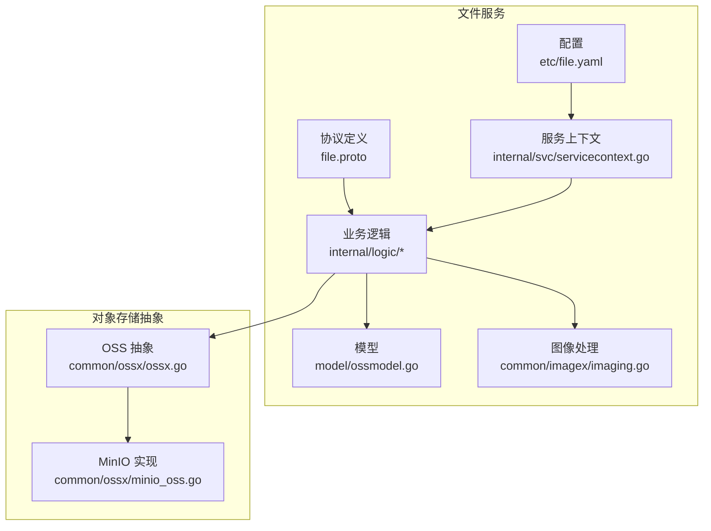
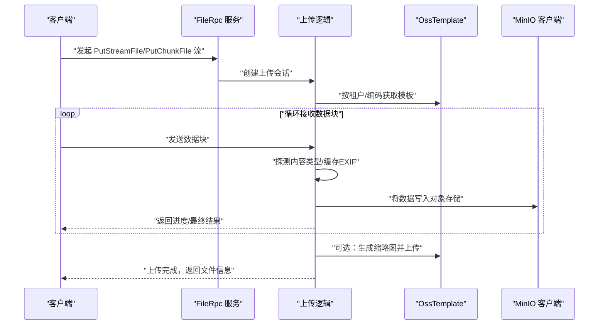
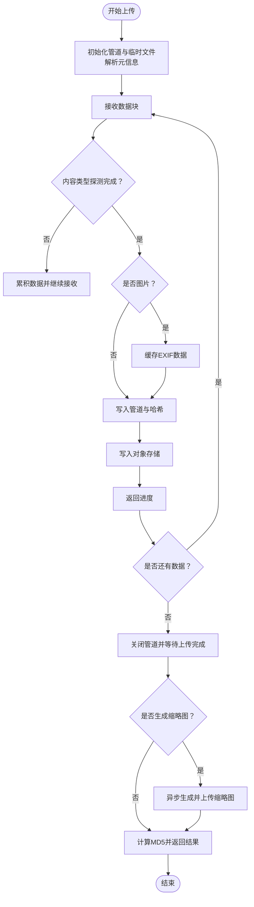
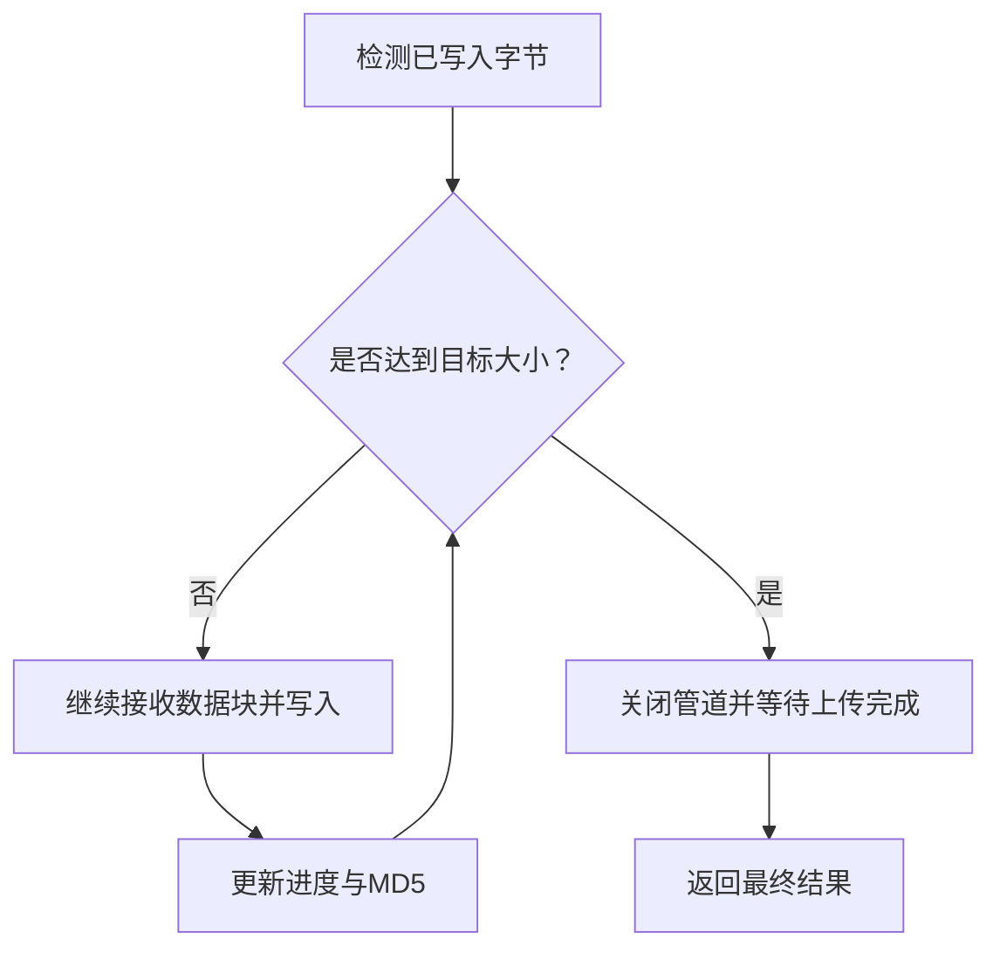
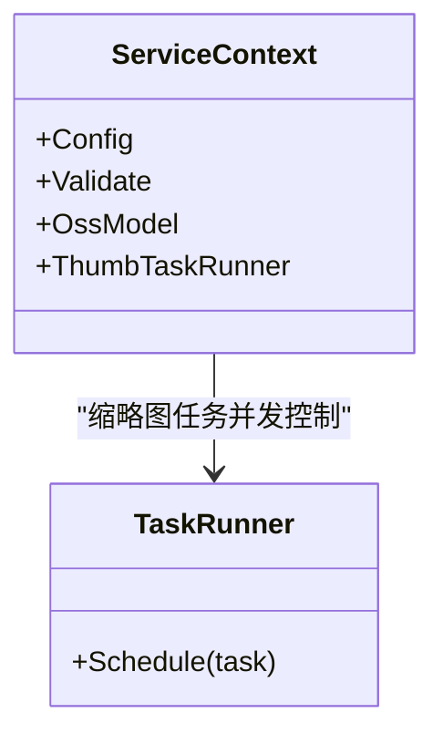
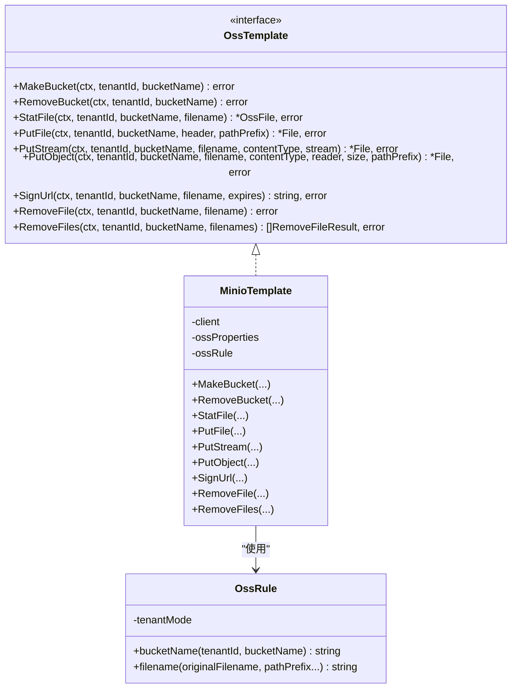
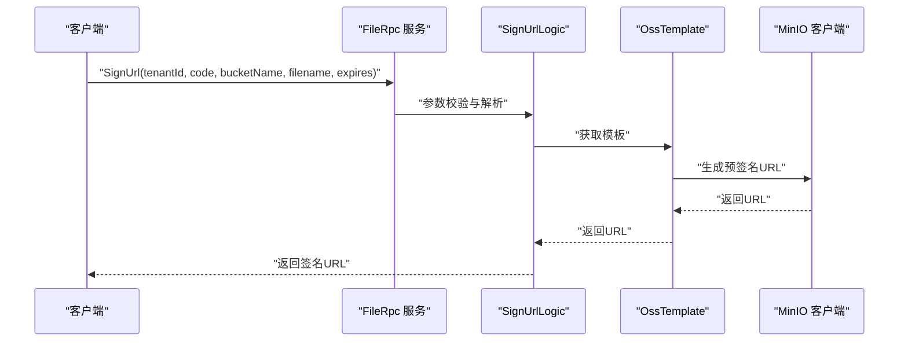
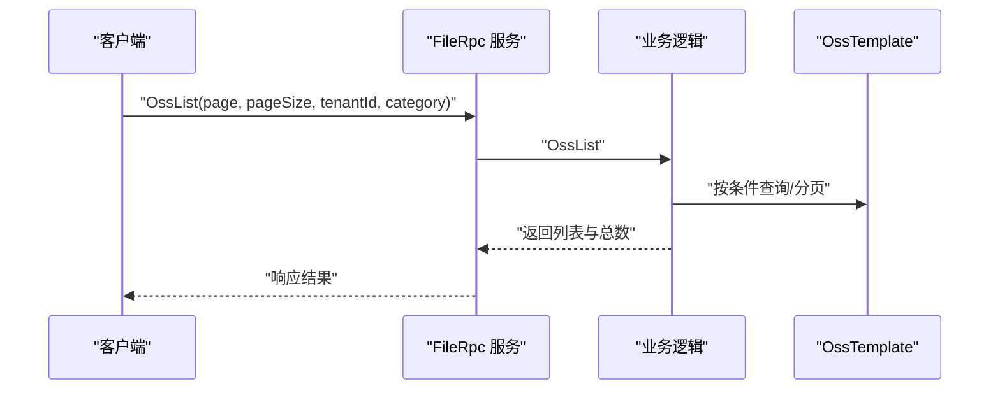
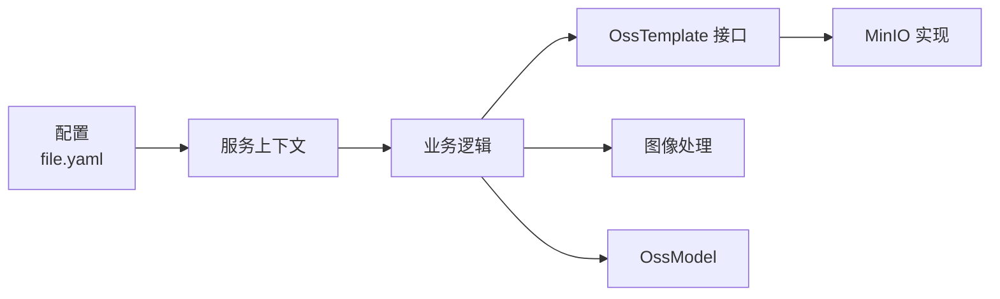

# 文件服务

<cite>
**本文引用的文件**
- [app/file/etc/file.yaml](file://app/file/etc/file.yaml)
- [app/file/file.proto](file://app/file/file.proto)
- [common/ossx/ossx.go](file://common/ossx/ossx.go)
- [common/ossx/minio_oss.go](file://common/ossx/minio_oss.go)
- [app/file/internal/config/config.go](file://app/file/internal/config/config.go)
- [app/file/internal/logic/putchunkfilelogic.go](file://app/file/internal/logic/putchunkfilelogic.go)
- [app/file/internal/logic/putstreamfilelogic.go](file://app/file/internal/logic/putstreamfilelogic.go)
- [app/file/internal/logic/signurllogic.go](file://app/file/internal/logic/signurllogic.go)
- [app/file/internal/logic/statfilelogic.go](file://app/file/internal/logic/statfilelogic.go)
- [app/file/internal/logic/createosslogic.go](file://app/file/internal/logic/createosslogic.go)
- [app/file/internal/logic/removefilelogic.go](file://app/file/internal/logic/removefilelogic.go)
- [app/file/internal/logic/ossdetaillogic.go](file://app/file/internal/logic/ossdetaillogic.go)
- [app/file/internal/svc/servicecontext.go](file://app/file/internal/svc/servicecontext.go)
- [model/ossmodel.go](file://model/ossmodel.go)
- [common/imagex/imaging.go](file://common/imagex/imaging.go)
</cite>

## 目录
1. [简介](#简介)
2. [项目结构](#项目结构)
3. [核心组件](#核心组件)
4. [架构总览](#架构总览)
5. [组件详解](#组件详解)
6. [依赖关系分析](#依赖关系分析)
7. [性能与并发](#性能与并发)
8. [故障排查指南](#故障排查指南)
9. [结论](#结论)
10. [附录](#附录)

## 简介
本文件服务基于 Go-Zero 微服务框架构建，提供分布式对象存储接入能力，当前主要兼容 MinIO 兼容协议的对象存储后端。系统支持：
- 分片/流式上传：通过双向流与单向流两种方式接收文件数据，边收边写入对象存储，并可选生成缩略图与提取图片元信息。
- 断点续传机制：通过流式管道与 MD5 校验，结合对象存储的多段上传能力，可在网络中断后恢复上传。
- 并发控制策略：使用任务运行器对缩略图生成等异步任务进行并发限流，避免资源争用。
- 对象存储集成：统一抽象 OssTemplate 接口，当前实现 MinIO 模板；支持按租户隔离存储桶命名规则。
- 文件签名 URL：生成带过期时间的预签名链接，便于前端直传或下载。
- API 接口：覆盖对象存储配置管理、桶管理、文件信息查询、签名 URL、上传、删除等完整能力。

## 项目结构
文件服务位于 app/file，采用典型的 Go-Zero RPC 服务结构：
- 配置：app/file/etc/file.yaml
- 协议：app/file/file.proto
- 服务上下文：app/file/internal/svc/servicecontext.go
- 业务逻辑：app/file/internal/logic/*
- 对象存储抽象与实现：common/ossx/*
- 数据模型：model/ossmodel.go
- 图像处理：common/imagex/imaging.go

**图表来源**
- [app/file/etc/file.yaml:1-23](file://app/file/etc/file.yaml#L1-L23)
- [app/file/file.proto:1-287](file://app/file/file.proto#L1-L287)
- [app/file/internal/svc/servicecontext.go:1-27](file://app/file/internal/svc/servicecontext.go#L1-L27)
- [common/ossx/ossx.go:1-152](file://common/ossx/ossx.go#L1-L152)
- [common/ossx/minio_oss.go:1-243](file://common/ossx/minio_oss.go#L1-L243)
- [model/ossmodel.go:1-32](file://model/ossmodel.go#L1-L32)
- [common/imagex/imaging.go:1-69](file://common/imagex/imaging.go#L1-L69)

**章节来源**
- [app/file/etc/file.yaml:1-23](file://app/file/etc/file.yaml#L1-L23)
- [app/file/file.proto:1-287](file://app/file/file.proto#L1-L287)
- [app/file/internal/svc/servicecontext.go:1-27](file://app/file/internal/svc/servicecontext.go#L1-L27)

## 核心组件
- 配置中心与注册中心：Nacos 注册与配置，服务监听端口、日志路径、数据库连接、租户模式开关、缩略图并发数等。
- 协议与服务：定义了完整的文件服务 RPC 接口，包括对象存储配置 CRUD、桶管理、文件统计、签名 URL、上传（分片/流式）、删除等。
- 对象存储抽象层：OssTemplate 接口统一了桶创建/删除、文件上传、签名 URL、删除等能力；当前实现 MinIO 模板。
- 业务逻辑层：各接口对应的逻辑实现，负责参数校验、租户与存储配置解析、流式上传、缩略图生成、EXIF 元信息提取等。
- 服务上下文：注入配置、验证器、模型与缩略图任务运行器。

**章节来源**
- [app/file/internal/config/config.go:10-31](file://app/file/internal/config/config.go#L10-L31)
- [app/file/file.proto:270-287](file://app/file/file.proto#L270-L287)
- [common/ossx/ossx.go:28-39](file://common/ossx/ossx.go#L28-L39)
- [common/ossx/minio_oss.go:20-243](file://common/ossx/minio_oss.go#L20-L243)
- [app/file/internal/svc/servicecontext.go:12-26](file://app/file/internal/svc/servicecontext.go#L12-L26)

## 架构总览
文件服务通过 gRPC 提供统一接口，内部以“协议 → 服务上下文 → 业务逻辑 → 对象存储抽象 → MinIO 客户端”的链路工作。上传流程采用“边收边写”，通过 io.Pipe 将流式数据同时写入对象存储与本地临时文件，以便后续处理（如缩略图、MD5 校验）。

**图表来源**
- [app/file/file.proto:191-225](file://app/file/file.proto#L191-L225)
- [app/file/internal/logic/putstreamfilelogic.go:43-287](file://app/file/internal/logic/putstreamfilelogic.go#L43-L287)
- [app/file/internal/logic/putchunkfilelogic.go:38-270](file://app/file/internal/logic/putchunkfilelogic.go#L38-L270)
- [common/ossx/ossx.go:109-151](file://common/ossx/ossx.go#L109-L151)
- [common/ossx/minio_oss.go:65-148](file://common/ossx/minio_oss.go#L65-L148)

## 组件详解

### 1) 分片上传与流式上传
- 双向流（PutChunkFile）：适用于网关直连场景，客户端与服务端均可持续发送/接收数据块，服务端实时返回进度与最终结果。
- 单向流（PutStreamFile）：客户端持续发送数据块，服务端完成后一次性返回结果。
- 流式处理：使用 io.Pipe 将数据同时写入对象存储与本地临时文件，便于后续处理（如缩略图、MD5 校验）。
- 内容类型探测：在收到足够数据后自动探测 MIME 类型，用于后续 EXIF 提取与缩略图生成。
- 缩略图生成：当文件为图片且请求标记 isThumb 时，异步生成缩略图并上传至对象存储。
- MD5 校验：对上传数据计算 MD5，用于完整性校验与去重参考。

**图表来源**
- [app/file/internal/logic/putstreamfilelogic.go:94-208](file://app/file/internal/logic/putstreamfilelogic.go#L94-L208)
- [app/file/internal/logic/putchunkfilelogic.go:85-191](file://app/file/internal/logic/putchunkfilelogic.go#L85-L191)
- [common/ossx/minio_oss.go:96-148](file://common/ossx/minio_oss.go#L96-L148)
- [common/imagex/imaging.go:18-32](file://common/imagex/imaging.go#L18-L32)

**章节来源**
- [app/file/file.proto:191-225](file://app/file/file.proto#L191-L225)
- [app/file/internal/logic/putstreamfilelogic.go:43-287](file://app/file/internal/logic/putstreamfilelogic.go#L43-L287)
- [app/file/internal/logic/putchunkfilelogic.go:38-270](file://app/file/internal/logic/putchunkfilelogic.go#L38-L270)
- [common/ossx/minio_oss.go:65-148](file://common/ossx/minio_oss.go#L65-L148)
- [common/imagex/imaging.go:18-32](file://common/imagex/imaging.go#L18-L32)

### 2) 断点续传机制
- 通过流式管道与对象存储的多段上传能力，可在网络中断后恢复上传。
- 服务端维护写入进度与 MD5 校验，确保数据一致性。
- 当上传过程中发生错误，可依据已写入字节数与目标总大小决定是否继续传输。

**图表来源**
- [app/file/internal/logic/putstreamfilelogic.go:95-98](file://app/file/internal/logic/putstreamfilelogic.go#L95-L98)
- [app/file/internal/logic/putchunkfilelogic.go:87-90](file://app/file/internal/logic/putchunkfilelogic.go#L87-L90)

**章节来源**
- [app/file/internal/logic/putstreamfilelogic.go:94-208](file://app/file/internal/logic/putstreamfilelogic.go#L94-L208)
- [app/file/internal/logic/putchunkfilelogic.go:85-191](file://app/file/internal/logic/putchunkfilelogic.go#L85-L191)

### 3) 并发控制策略
- 缩略图任务并发：通过服务上下文中的 TaskRunner 控制并发数量，默认值来自配置。
- 上传过程中的并发：使用 goroutine 将管道数据写入对象存储，避免阻塞接收循环。
- 并发池：模板与配置缓存使用读写锁保护，减少重复初始化开销。

**图表来源**
- [app/file/internal/svc/servicecontext.go:12-26](file://app/file/internal/svc/servicecontext.go#L12-L26)

**章节来源**
- [app/file/internal/svc/servicecontext.go:19-26](file://app/file/internal/svc/servicecontext.go#L19-L26)
- [app/file/etc/file.yaml:20](file://app/file/etc/file.yaml#L20)

### 4) 对象存储集成与 MinIO 兼容性
- 抽象接口：OssTemplate 定义了桶管理、文件上传、签名 URL、删除等统一方法。
- MinIO 实现：MinioTemplate 基于 MinIO 客户端实现，支持创建/删除桶、上传对象、预签名 URL、批量删除等。
- 租户隔离：OssRule 根据配置决定是否在桶名前加上租户 ID 前缀，实现多租户隔离。
- 模板缓存：按租户维度缓存模板与配置，避免重复初始化。

**图表来源**
- [common/ossx/ossx.go:28-39](file://common/ossx/ossx.go#L28-L39)
- [common/ossx/minio_oss.go:20-243](file://common/ossx/minio_oss.go#L20-L243)
- [common/ossx/ossx.go:43-68](file://common/ossx/ossx.go#L43-L68)

**章节来源**
- [common/ossx/ossx.go:109-151](file://common/ossx/ossx.go#L109-L151)
- [common/ossx/minio_oss.go:214-235](file://common/ossx/minio_oss.go#L214-L235)
- [common/ossx/ossx.go:47-53](file://common/ossx/ossx.go#L47-L53)

### 5) 文件签名 URL 与访问控制
- 签名 URL：根据租户、编码、桶名与文件名生成带过期时间的预签名链接。
- 访问控制：通过租户模式与桶名前缀实现多租户隔离；签名 URL 的过期时间可由请求指定。
- 文件信息：StatFile 可返回文件基础信息，并可选返回签名 URL。

**图表来源**
- [app/file/file.proto:164-174](file://app/file/file.proto#L164-L174)
- [app/file/internal/logic/signurllogic.go:29-60](file://app/file/internal/logic/signurllogic.go#L29-L60)
- [common/ossx/minio_oss.go:150-162](file://common/ossx/minio_oss.go#L150-L162)

**章节来源**
- [app/file/internal/logic/signurllogic.go:29-60](file://app/file/internal/logic/signurllogic.go#L29-L60)
- [app/file/internal/logic/statfilelogic.go:29-58](file://app/file/internal/logic/statfilelogic.go#L29-L58)

### 6) API 接口与文件操作流程
- 对象存储配置管理：CreateOss、UpdateOss、DeleteOss、OssDetail、OssList。
- 桶管理：MakeBucket、RemoveBucket。
- 文件操作：StatFile、SignUrl、PutFile、PutChunkFile、PutStreamFile、GetFile、RemoveFile、RemoveFiles。
- 视频截图：CaptureVideoStream。

**图表来源**
- [app/file/file.proto:77-88](file://app/file/file.proto#L77-L88)
- [app/file/internal/logic/ossdetaillogic.go:26-36](file://app/file/internal/logic/ossdetaillogic.go#L26-L36)

**章节来源**
- [app/file/file.proto:270-287](file://app/file/file.proto#L270-L287)
- [app/file/internal/logic/createosslogic.go:26-45](file://app/file/internal/logic/createosslogic.go#L26-L45)
- [app/file/internal/logic/removefilelogic.go:26-38](file://app/file/internal/logic/removefilelogic.go#L26-L38)

### 7) 错误处理机制
- 参数校验：使用结构体校验器对关键字段进行必填校验。
- 上传错误：接收流错误、对象存储写入错误、缩略图生成错误均被记录并返回。
- 删除错误：批量删除返回每项删除结果，便于定位失败项。

**章节来源**
- [app/file/internal/logic/signurllogic.go:34-38](file://app/file/internal/logic/signurllogic.go#L34-L38)
- [app/file/internal/logic/putstreamfilelogic.go:96-98](file://app/file/internal/logic/putstreamfilelogic.go#L96-L98)
- [common/ossx/minio_oss.go:174-204](file://common/ossx/minio_oss.go#L174-L204)

## 依赖关系分析
- 服务配置依赖：Nacos 注册与配置、数据库连接、日志路径、租户模式、缩略图并发。
- 业务逻辑依赖：服务上下文提供模型与并发控制器；逻辑层依赖对象存储抽象与图像处理模块。
- 对象存储依赖：MinIO 客户端，支持桶管理、对象上传、签名 URL、批量删除。

**图表来源**
- [app/file/etc/file.yaml:1-23](file://app/file/etc/file.yaml#L1-L23)
- [app/file/internal/svc/servicecontext.go:12-26](file://app/file/internal/svc/servicecontext.go#L12-L26)
- [common/ossx/ossx.go:109-151](file://common/ossx/ossx.go#L109-L151)
- [common/ossx/minio_oss.go:214-235](file://common/ossx/minio_oss.go#L214-L235)
- [model/ossmodel.go:1-32](file://model/ossmodel.go#L1-L32)
- [common/imagex/imaging.go:1-69](file://common/imagex/imaging.go#L1-L69)

**章节来源**
- [app/file/etc/file.yaml:1-23](file://app/file/etc/file.yaml#L1-L23)
- [app/file/internal/svc/servicecontext.go:12-26](file://app/file/internal/svc/servicecontext.go#L12-L26)

## 性能与并发
- 上传吞吐：流式管道避免大文件内存占用，边收边写提升吞吐。
- 并发控制：缩略图任务并发数通过配置项控制，防止 CPU/IO 抖动。
- 日志与监控：上传进度日志按阈值输出，便于观测大文件传输状态。
- 存储成本：通过桶前缀隔离与签名 URL 限制访问范围，降低误用与泄露风险。

[本节为通用性能建议，不直接分析具体文件]

## 故障排查指南
- 无法连接对象存储：检查 Endpoint、AccessKey、SecretKey 与 BucketName 配置。
- 上传中断：确认网络稳定性与超时设置；查看进度日志定位卡顿点。
- 缩略图未生成：检查 isThumb 标记与图像处理依赖；查看异步任务执行日志。
- 签名 URL 失效：确认过期时间设置与对象存在性；核对桶前缀与租户隔离配置。
- 批量删除异常：关注返回的单项错误，逐项排查失败原因。

**章节来源**
- [app/file/internal/logic/putstreamfilelogic.go:200-207](file://app/file/internal/logic/putstreamfilelogic.go#L200-L207)
- [common/ossx/minio_oss.go:174-204](file://common/ossx/minio_oss.go#L174-L204)
- [app/file/internal/logic/signurllogic.go:49-52](file://app/file/internal/logic/signurllogic.go#L49-L52)

## 结论
该文件服务以清晰的分层设计实现了对象存储的统一接入与高效上传能力。通过流式上传、缩略图异步处理与租户隔离策略，满足了分布式场景下的高可用与高性能需求。后续可扩展更多对象存储后端与更丰富的安全策略。

[本节为总结性内容，不直接分析具体文件]

## 附录

### A. 上传配置模板（YAML）
- 服务监听与日志
  - Name: file.rpc
  - ListenOn: 0.0.0.0:21003
  - Log.Encoding: plain
  - Log.Path: /opt/logs/file.rpc
- Nacos 注册与配置
  - NacosConfig.IsRegister: true
  - NacosConfig.Host: 127.0.0.1
  - NacosConfig.Port: 8848
  - NacosConfig.Username: nacos
  - NacosConfig.PassWord: nacos
  - NacosConfig.NamespaceId: public
  - NacosConfig.ServiceName: file
- 对象存储
  - Oss.TenantMode: true
- 缩略图并发
  - ThumbTaskConcurrency: 2
- 数据库
  - DB.DataSource: root:...@tcp(localhost:33069)/zero?...

**章节来源**
- [app/file/etc/file.yaml:1-23](file://app/file/etc/file.yaml#L1-L23)

### B. API 接口一览（按功能分组）
- 对象存储配置管理
  - OssDetail、OssList、CreateOss、UpdateOss、DeleteOss
- 桶管理
  - MakeBucket、RemoveBucket
- 文件信息与签名
  - StatFile、SignUrl
- 上传接口
  - PutFile、PutChunkFile（双向流）、PutStreamFile（单向流）
- 下载与删除
  - GetFile、RemoveFile、RemoveFiles
- 视频截图
  - CaptureVideoStream

**章节来源**
- [app/file/file.proto:270-287](file://app/file/file.proto#L270-L287)

### C. 最佳实践
- 文件类型识别：利用前 512 字节探测 MIME 类型，确保后续 EXIF 与缩略图处理正确。
- 压缩处理：图片类文件优先使用缩略图策略，降低带宽与存储成本。
- CDN 集成：通过签名 URL 与对象存储域名对接 CDN，实现就近加速。
- 安全策略：启用租户模式与桶前缀隔离；限制签名 URL 过期时间；对敏感桶设置访问白名单。
- 性能优化：合理设置缩略图并发数；对大文件采用流式上传并开启进度日志；使用对象存储的多段上传特性提升稳定性。

[本节为通用最佳实践，不直接分析具体文件]