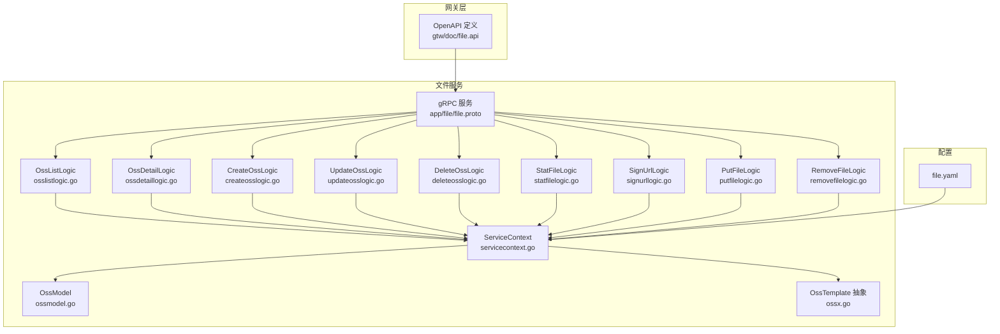
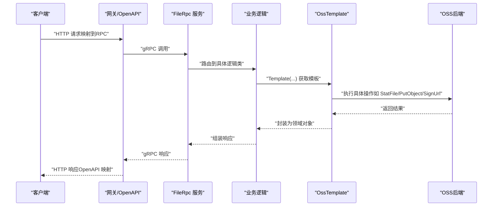
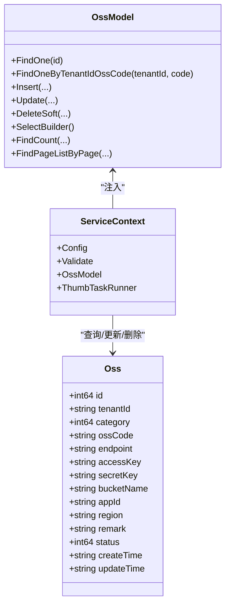
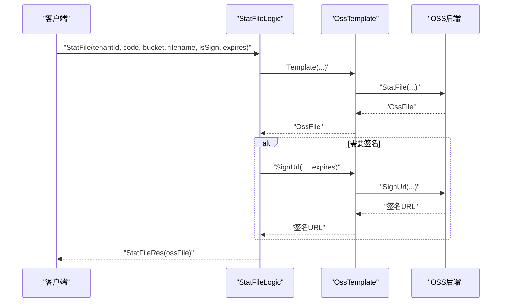
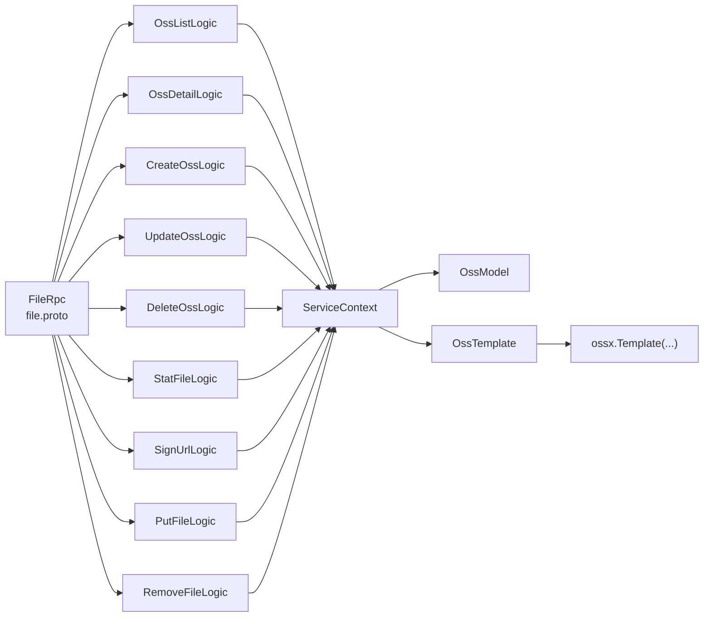
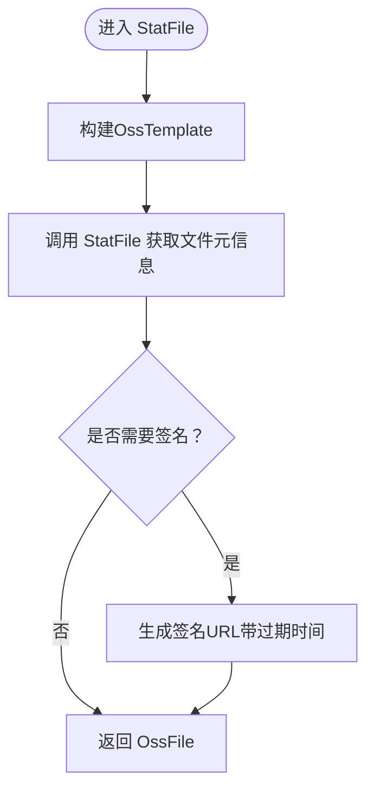

# 文件管理API

<cite>
**本文引用的文件**
- [file.proto](file://app/file/file.proto)
- [file.api](file://gtw/doc/file.api)
- [file.yaml](file://app/file/etc/file.yaml)
- [ossx.go](file://common/ossx/ossx.go)
- [ossmodel.go](file://model/ossmodel.go)
- [servicecontext.go](file://app/file/internal/svc/servicecontext.go)
- [osslistlogic.go](file://app/file/internal/logic/osslistlogic.go)
- [ossdetaillogic.go](file://app/file/internal/logic/ossdetaillogic.go)
- [createosslogic.go](file://app/file/internal/logic/createosslogic.go)
- [updateosslogic.go](file://app/file/internal/logic/updateosslogic.go)
- [deleteosslogic.go](file://app/file/internal/logic/deleteosslogic.go)
- [statfilelogic.go](file://app/file/internal/logic/statfilelogic.go)
- [signurllogic.go](file://app/file/internal/logic/signurllogic.go)
- [putfilelogic.go](file://app/file/internal/logic/putfilelogic.go)
- [removefilelogic.go](file://app/file/internal/logic/removefilelogic.go)
</cite>

## 目录
1. [简介](#简介)
2. [项目结构](#项目结构)
3. [核心组件](#核心组件)
4. [架构总览](#架构总览)
5. [详细组件分析](#详细组件分析)
6. [依赖关系分析](#依赖关系分析)
7. [性能与并发特性](#性能与并发特性)
8. [故障排查指南](#故障排查指南)
9. [结论](#结论)
10. [附录：接口清单与示例](#附录接口清单与示例)

## 简介
本文件管理API基于gRPC协议提供对象存储（OSS）能力，覆盖存储配置、文件上传、下载、签名URL生成、文件状态查询与删除等核心能力。系统通过统一的OSS模板抽象支持多厂商（当前实现中主要适配MinIO），并通过租户维度隔离存储资源。网关层通过OpenAPI描述文件对外暴露部分HTTP语义的请求/响应结构，便于前端或外部系统对接。

## 项目结构
- gRPC服务定义位于 app/file/file.proto，包含所有文件管理相关RPC方法及消息体。
- 网关层OpenAPI定义位于 gtw/doc/file.api，用于描述HTTP风格的请求/响应字段映射。
- 业务逻辑集中在 app/file/internal/logic 下，每个RPC方法对应一个逻辑处理文件。
- OSS模板与通用能力位于 common/ossx/ossx.go，负责根据租户与资源编号选择具体OSS实现。
- 数据模型与仓储位于 model/ossmodel.go，提供OSS配置的增删改查。
- 服务上下文在 app/file/internal/svc/servicecontext.go 中初始化，包括数据库连接、校验器与缩略图任务执行器。
- 服务运行配置位于 app/file/etc/file.yaml，包含监听端口、日志、注册中心与OSS租户模式开关等。

**图表来源**
- [file.proto:270-287](file://app/file/file.proto#L270-L287)
- [file.api:1-60](file://gtw/doc/file.api#L1-L60)
- [ossx.go:109-151](file://common/ossx/ossx.go#L109-L151)
- [ossmodel.go:10-31](file://model/ossmodel.go#L10-L31)
- [servicecontext.go:12-26](file://app/file/internal/svc/servicecontext.go#L12-L26)
- [file.yaml:1-23](file://app/file/etc/file.yaml#L1-L23)

**章节来源**
- [file.proto:1-287](file://app/file/file.proto#L1-L287)
- [file.api:1-60](file://gtw/doc/file.api#L1-L60)
- [file.yaml:1-23](file://app/file/etc/file.yaml#L1-L23)

## 核心组件
- gRPC服务接口：集中于 file.proto 的 FileRpc 服务，涵盖存储配置与文件操作的完整RPC集合。
- OpenAPI请求/响应映射：file.api 定义了HTTP风格的请求/响应字段，便于网关转换与前端使用。
- OSS模板与规则：ossx.go 提供OssTemplate接口与Template工厂方法，按租户与资源编号动态选择OSS实现，并支持租户命名空间隔离。
- 业务逻辑层：各RPC方法对应独立逻辑类，负责参数校验、OSS模板调用、结果组装与异常处理。
- 数据模型与仓储：ossmodel.go 提供OSS配置的ORM接口，ServiceContext负责注入与初始化。
- 服务上下文：servicecontext.go 初始化数据库连接、验证器与缩略图任务执行器，支撑业务逻辑运行。

**章节来源**
- [file.proto:270-287](file://app/file/file.proto#L270-L287)
- [file.api:1-60](file://gtw/doc/file.api#L1-L60)
- [ossx.go:28-151](file://common/ossx/ossx.go#L28-L151)
- [ossmodel.go:10-31](file://model/ossmodel.go#L10-L31)
- [servicecontext.go:12-26](file://app/file/internal/svc/servicecontext.go#L12-L26)

## 架构总览
文件管理API采用分层架构：
- 表现层：gRPC服务与可选的OpenAPI映射（网关层）。
- 业务层：各RPC对应的逻辑类，封装业务规则与流程。
- 领域层：OSS模板抽象与具体实现（当前适配MinIO），负责与对象存储交互。
- 数据层：OSS配置模型与SQL存储，提供CRUD与分页查询能力。

**图表来源**
- [file.proto:270-287](file://app/file/file.proto#L270-L287)
- [ossx.go:109-151](file://common/ossx/ossx.go#L109-L151)
- [file.api:1-60](file://gtw/doc/file.api#L1-L60)

## 详细组件分析

### 存储配置管理（OSS）
- 查询存储列表
  - 方法：OssList
  - 请求：包含分页、排序、租户ID、分类等条件
  - 响应：返回列表与总数
  - 实现要点：根据租户ID与分类过滤，分页查询并转换时间格式
- 查询存储详情
  - 方法：OssDetail
  - 请求：存储ID
  - 响应：单条存储配置
  - 实现要点：查询并格式化时间字段
- 新增存储
  - 方法：CreateOss
  - 请求：租户ID、分类、资源编号、Endpoint、AK/SK、Bucket、AppId、Region、备注
  - 响应：新增ID
  - 实现要点：插入默认状态并返回自增ID
- 更新存储
  - 方法：UpdateOss
  - 请求：ID与上述字段（含状态）
  - 响应：空
  - 实现要点：按ID更新记录
- 删除存储
  - 方法：DeleteOss
  - 请求：ID
  - 响应：ID
  - 实现要点：软删除并返回ID

**图表来源**
- [file.proto:17-32](file://app/file/file.proto#L17-L32)
- [ossmodel.go:10-31](file://model/ossmodel.go#L10-L31)
- [servicecontext.go:12-26](file://app/file/internal/svc/servicecontext.go#L12-L26)

**章节来源**
- [osslistlogic.go:27-62](file://app/file/internal/logic/osslistlogic.go#L27-L62)
- [ossdetaillogic.go:26-36](file://app/file/internal/logic/ossdetaillogic.go#L26-L36)
- [createosslogic.go:26-45](file://app/file/internal/logic/createosslogic.go#L26-L45)
- [updateosslogic.go:26-45](file://app/file/internal/logic/updateosslogic.go#L26-L45)
- [deleteosslogic.go:25-35](file://app/file/internal/logic/deleteosslogic.go#L25-L35)

### 文件操作
- 文件状态统计与签名URL
  - 方法：StatFile
  - 请求：租户ID、资源编号、Bucket、文件名、是否生成签名、过期时间（分钟）
  - 响应：文件信息（含上传时间、类型、大小、格式化大小、签名URL可选）
  - 实现要点：通过OSS模板查询文件元信息；当请求要求签名时，按过期时间生成签名URL
- 签名URL生成
  - 方法：SignUrl
  - 请求：租户ID、资源编号、Bucket、文件名、过期时间（分钟）
  - 响应：签名URL
  - 实现要点：参数校验后生成签名URL，默认1小时
- 上传文件
  - 方法：PutFile
  - 请求：租户ID、资源编号、Bucket、文件名、Content-Type、本地文件路径、是否缩略图、路径前缀
  - 响应：文件信息（含EXIF元信息，若为图片）
  - 实现要点：检测内容类型，上传至OSS；对图片提取EXIF并写入响应
- 删除文件
  - 方法：RemoveFile
  - 请求：租户ID、资源编号、Bucket、文件名
  - 响应：空
  - 实现要点：调用OSS模板删除指定文件

**图表来源**
- [statfilelogic.go:29-58](file://app/file/internal/logic/statfilelogic.go#L29-L58)
- [ossx.go:109-151](file://common/ossx/ossx.go#L109-L151)

**章节来源**
- [statfilelogic.go:29-58](file://app/file/internal/logic/statfilelogic.go#L29-L58)
- [signurllogic.go:29-60](file://app/file/internal/logic/signurllogic.go#L29-L60)
- [putfilelogic.go:33-77](file://app/file/internal/logic/putfilelogic.go#L33-L77)
- [removefilelogic.go:26-38](file://app/file/internal/logic/removefilelogic.go#L26-L38)

### OpenAPI映射与HTTP语义
- 文件信息结构：File、OssFile
- 请求映射：PutFileRequest、SignUrlRequest、StatFileRequest
- 响应映射：GetFileReply、SignUrlReqly、StatFileReply
- 说明：网关层通过这些类型进行HTTP请求/响应的字段绑定与序列化。

**章节来源**
- [file.api:5-58](file://gtw/doc/file.api#L5-L58)

## 依赖关系分析
- FileRpc 服务依赖各逻辑类；逻辑类通过ServiceContext访问OssModel与OssTemplate。
- OssTemplate由ossx.Template工厂方法按租户与资源编号动态创建，内部维护模板池与配置缓存。
- OssModel提供ORM能力，ServiceContext负责初始化与注入。
- 配置文件file.yaml决定租户模式、日志、注册中心与数据库连接字符串。

**图表来源**
- [file.proto:270-287](file://app/file/file.proto#L270-L287)
- [ossx.go:109-151](file://common/ossx/ossx.go#L109-L151)
- [ossmodel.go:10-31](file://model/ossmodel.go#L10-L31)
- [servicecontext.go:12-26](file://app/file/internal/svc/servicecontext.go#L12-L26)

**章节来源**
- [file.proto:270-287](file://app/file/file.proto#L270-L287)
- [ossx.go:109-151](file://common/ossx/ossx.go#L109-L151)
- [ossmodel.go:10-31](file://model/ossmodel.go#L10-L31)
- [servicecontext.go:12-26](file://app/file/internal/svc/servicecontext.go#L12-L26)

## 性能与并发特性
- 模板缓存：OssTemplate按租户维度缓存，避免重复初始化，降低连接与鉴权开销。
- 并发上传：PutStreamFile为流式上传，适合大文件分块传输，减少内存峰值。
- 缩略图任务：ServiceContext中配置了缩略图任务执行器，可在上传后异步生成缩略图，提升吞吐。
- 分页查询：OssList支持分页与排序，避免一次性加载大量配置。
- 日志与超时：配置文件包含日志编码、输出路径与超时设置，便于性能观测与调优。

**章节来源**
- [ossx.go:109-151](file://common/ossx/ossx.go#L109-L151)
- [servicecontext.go:19-26](file://app/file/internal/svc/servicecontext.go#L19-L26)
- [file.yaml:1-23](file://app/file/etc/file.yaml#L1-L23)

## 故障排查指南
- 参数校验失败：逻辑层使用验证器对关键字段进行校验，检查请求字段是否缺失或格式不正确。
- OSS配置未找到：Template工厂会根据租户ID与资源编号查询OSS配置，确认配置存在且状态有效。
- 签名URL失败：检查租户模式、Bucket名称、文件名与过期时间；确保OSS后端可用。
- 上传失败：确认本地文件路径有效、内容类型检测正常、目标Bucket存在且有写权限。
- 删除失败：确认文件名与Bucket一致，OSS后端无网络或权限问题。

**章节来源**
- [signurllogic.go:29-60](file://app/file/internal/logic/signurllogic.go#L29-L60)
- [statfilelogic.go:29-58](file://app/file/internal/logic/statfilelogic.go#L29-L58)
- [putfilelogic.go:33-77](file://app/file/internal/logic/putfilelogic.go#L33-L77)
- [removefilelogic.go:26-38](file://app/file/internal/logic/removefilelogic.go#L26-L38)

## 结论
该文件管理API以清晰的分层设计与OSS模板抽象实现了跨厂商的对象存储能力，结合租户隔离与流式上传等特性，满足多场景下的文件管理需求。通过OpenAPI映射与统一的配置中心，系统具备良好的可扩展性与运维友好性。

## 附录：接口清单与示例

### 接口总览（gRPC）
- Ping：健康检查
- OssDetail：查询存储详情
- OssList：查询存储列表
- CreateOss：创建存储
- UpdateOss：更新存储
- DeleteOss：删除存储
- MakeBucket：创建存储桶
- RemoveBucket：删除存储桶
- StatFile：获取文件信息（可选生成签名URL）
- SignUrl：生成签名URL
- PutFile：上传文件
- PutChunkFile：分块上传（双向流）
- PutStreamFile：流式上传
- RemoveFile：删除文件
- RemoveFiles：批量删除文件
- CaptureVideoStream：截取视频流图片

**章节来源**
- [file.proto:270-287](file://app/file/file.proto#L270-L287)

### OpenAPI映射（HTTP风格）
- 文件信息结构：File、OssFile
- 请求映射：PutFileRequest、SignUrlRequest、StatFileRequest
- 响应映射：GetFileReply、SignUrlReqly、StatFileReply

**章节来源**
- [file.api:5-58](file://gtw/doc/file.api#L5-L58)

### 关键流程图：文件状态统计与签名

**图表来源**
- [statfilelogic.go:29-58](file://app/file/internal/logic/statfilelogic.go#L29-L58)
- [ossx.go:109-151](file://common/ossx/ossx.go#L109-L151)