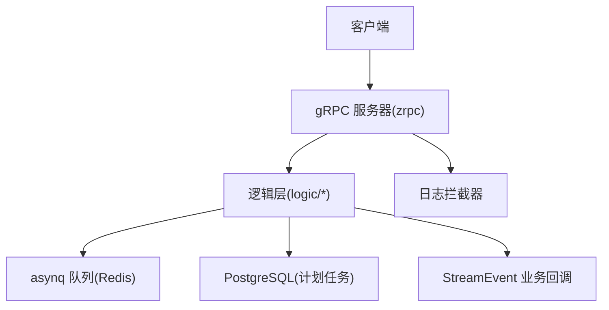
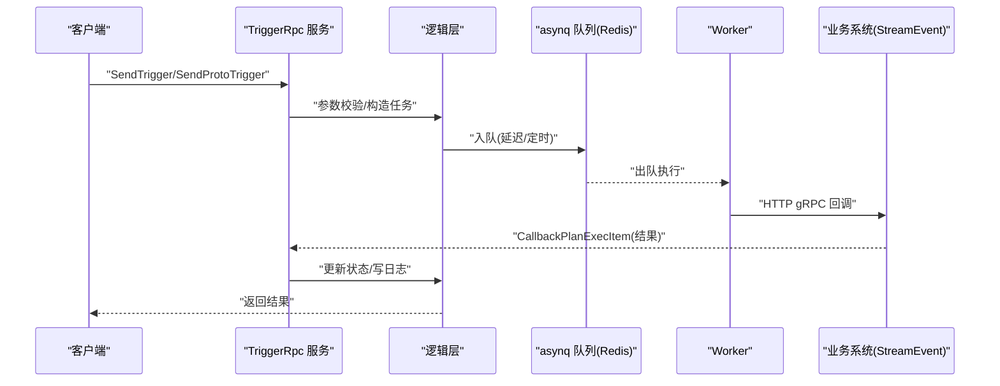
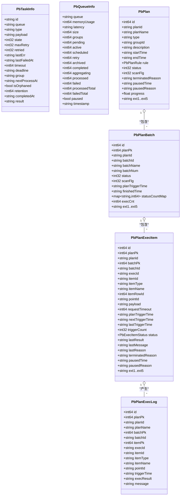

# API接口参考

<cite>
**本文引用的文件**
- [trigger.proto](file://app/trigger/trigger.proto)
- [trigger.go](file://app/trigger/trigger.go)
- [trigger.yaml](file://app/trigger/etc/trigger.yaml)
- [sendtriggerlogic.go](file://app/trigger/internal/logic/sendtriggerlogic.go)
- [createplantasklogic.go](file://app/trigger/internal/logic/createplantasklogic.go)
- [loggerInterceptor.go](file://common/Interceptor/rpcserver/loggerInterceptor.go)
- [extproto.proto](file://third_party/extproto.proto)
- [trigger.swagger.json](file://swagger/trigger.swagger.json)
- [trigger.md](file://docs/trigger.md)
- [config.go](file://app/trigger/internal/config/config.go)
- [servicecontext.go](file://app/trigger/internal/svc/servicecontext.go)
</cite>

## 目录
1. [简介](#简介)
2. [项目结构](#项目结构)
3. [核心组件](#核心组件)
4. [架构总览](#架构总览)
5. [详细接口说明](#详细接口说明)
6. [依赖关系分析](#依赖关系分析)
7. [性能与限流](#性能与限流)
8. [故障排查指南](#故障排查指南)
9. [结论](#结论)
10. [附录](#附录)

## 简介
本文件为触发器服务的 gRPC API 接口参考，覆盖两类核心能力：
- 异步任务调度：支持 HTTP 回调与 gRPC Proto 回调，具备指数退避重试、队列管理与任务查询能力。
- 计划任务管理：基于规则引擎的周期性任务，提供计划、批次、执行项的全生命周期管理与回调确认。

接口定义位于 [trigger.proto](file://app/trigger/trigger.proto)，服务启动入口在 [trigger.go](file://app/trigger/trigger.go)，配置位于 [trigger.yaml](file://app/trigger/etc/trigger.yaml)。

## 项目结构
触发器服务采用 go-zero 框架，gRPC 服务由 zrpc 提供，内部结合 asynq 分布式队列与 PostgreSQL 存储计划任务数据。核心目录与文件如下：
- 服务定义与生成：app/trigger/trigger.proto
- 服务入口与注册：app/trigger/trigger.go
- 配置：app/trigger/etc/trigger.yaml
- 逻辑实现：app/trigger/internal/logic/*.go
- 服务上下文与依赖注入：app/trigger/internal/svc/servicecontext.go
- 统一错误码扩展：third_party/extproto.proto
- Swagger 文档：swagger/trigger.swagger.json
- 架构与使用说明：docs/trigger.md

图表来源
- [trigger.go:46-52](file://app/trigger/trigger.go#L46-L52)
- [servicecontext.go:50-90](file://app/trigger/internal/svc/servicecontext.go#L50-L90)
- [loggerInterceptor.go:12-44](file://common/Interceptor/rpcserver/loggerInterceptor.go#L12-L44)

章节来源
- [trigger.go:34-88](file://app/trigger/trigger.go#L34-L88)
- [trigger.yaml:1-37](file://app/trigger/etc/trigger.yaml#L1-L37)
- [trigger.md:1-284](file://docs/trigger.md#L1-L284)

## 核心组件
- gRPC 服务：TriggerRpc，提供任务调度与计划管理接口。
- 逻辑层：每个接口对应一个 logic 文件，负责参数校验、业务编排与持久化。
- 依赖注入：ServiceContext 统一封装 asynq、数据库、Redis、StreamEvent 客户端等。
- 统一错误码：extproto.Code 定义六位错误码，映射 HTTP 状态码，便于客户端统一处理。

章节来源
- [trigger.proto:13-106](file://app/trigger/trigger.proto#L13-L106)
- [servicecontext.go:29-90](file://app/trigger/internal/svc/servicecontext.go#L29-L90)
- [extproto.proto:38-75](file://third_party/extproto.proto#L38-L75)

## 架构总览
触发器服务分为两条主线：
- 异步任务回调链路：客户端调用 SendTrigger/SendProtoTrigger → asynq 入队 → Worker 执行 → 回调业务系统 → 更新任务状态。
- 计划任务链路：客户端调用 CreatePlanTask → 解析规则生成批次与执行项 → CronService 扫表 → 业务系统回调 → 状态机流转。

图表来源
- [trigger.md:14-104](file://docs/trigger.md#L14-L104)
- [sendtriggerlogic.go:37-104](file://app/trigger/internal/logic/sendtriggerlogic.go#L37-L104)
- [createplantasklogic.go:38-250](file://app/trigger/internal/logic/createplantasklogic.go#L38-L250)

## 详细接口说明

### 通用约定
- 认证与用户上下文：所有请求均携带 extproto.CurrentUser，服务端通过拦截器将用户信息注入上下文。
- 返回值：成功返回标准响应；失败返回统一错误码（extproto.Code）及 HTTP 映射码。
- 时间格式：字符串格式，如 yyyy-MM-dd HH:mm:ss；超时单位：秒或毫秒视接口而定。
- 队列与重试：默认队列 critical，重试策略为指数退避，上限 25 次。

章节来源
- [loggerInterceptor.go:12-44](file://common/Interceptor/rpcserver/loggerInterceptor.go#L12-L44)
- [extproto.proto:38-75](file://third_party/extproto.proto#L38-L75)
- [trigger.proto:216-286](file://app/trigger/trigger.proto#L216-L286)

---

### 1) 发送 HTTP POST JSON 回调
- 方法：SendTrigger
- 功能：提交一个 HTTP POST JSON 回调任务，支持指定触发时间或延迟秒数。
- 请求参数
  - processIn：秒，延迟触发时间（与 triggerTime 二选一）
  - triggerTime：触发时间字符串（与 processIn 二选一）
  - url：回调地址（必填）
  - maxRetry：最大重试次数（默认 25）
  - msgId：消息唯一标识（可空，空时自动生成）
  - body：回调内容（可空）
  - currentUser：用户上下文（必填）
- 返回值
  - traceId：追踪 ID
  - queue：任务所在队列
  - id：任务 ID
- 使用场景
  - 一次性回调、延时回调、定时回调
- 成功示例
  - 请求：processIn=5, url=https://example.com/callback, body={"event":"test"}
  - 响应：traceId=..., queue=critical, id=...
- 失败示例
  - 参数非法：返回 _1_01_PARAM
  - 触发时间无效：返回 _1_01_PARAM_INVALID
- 版本与兼容性
  - 无破坏性变更记录，遵循语义化版本演进
- 安全与权限
  - 通过 currentUser 注入上下文，业务侧自行鉴权
- 性能与限流
  - asynq 默认并发 20，队列权重 critical:6；建议客户端控制 QPS
- 错误码
  - _1_01_PARAM、_1_01_PARAM_INVALID、_1_03_MQ

章节来源
- [trigger.proto:216-240](file://app/trigger/trigger.proto#L216-L240)
- [sendtriggerlogic.go:37-104](file://app/trigger/internal/logic/sendtriggerlogic.go#L37-L104)
- [extproto.proto:47-56](file://third_party/extproto.proto#L47-L56)

---

### 2) 发送 gRPC Proto 字节码回调
- 方法：SendProtoTrigger
- 功能：提交一个 gRPC Proto 字节码回调任务，支持指数退避重试与请求超时。
- 请求参数
  - processIn：秒，延迟触发时间
  - triggerTime：触发时间字符串
  - maxRetry：最大重试次数（默认 25）
  - msgId：消息唯一标识（可空）
  - grpcServer：目标服务地址（必填）
  - method：方法名（必填）
  - payload：pb 字节数据（必填）
  - requestTimeout：请求超时（毫秒，可空）
  - currentUser：用户上下文（必填）
- 返回值
  - traceId、queue、id
- 使用场景
  - 跨服务 gRPC 回调、批量任务投递
- 成功示例
  - 请求：grpcServer=127.0.0.1:8080, method=SomeMethod, payload=...
  - 响应：traceId=..., queue=critical, id=...
- 失败示例
  - 参数缺失：返回 _1_01_PARAM_MISSING
  - 服务不可达：返回 _1_06_RPC
- 版本与兼容性
  - 无破坏性变更记录
- 安全与权限
  - 通过 currentUser 注入上下文，业务侧自行鉴权
- 性能与限流
  - 建议控制并发与 payload 大小，避免内存峰值
- 错误码
  - _1_01_PARAM、_1_06_RPC

章节来源
- [trigger.proto:242-286](file://app/trigger/trigger.proto#L242-L286)
- [sendtriggerlogic.go:37-104](file://app/trigger/internal/logic/sendtriggerlogic.go#L37-L104)
- [extproto.proto:72-75](file://third_party/extproto.proto#L72-L75)

---

### 3) 队列与任务管理

#### 3.1 获取队列列表
- 方法：Queues
- 请求：currentUser
- 返回：queues[]
- 使用场景：运维监控、健康检查

章节来源
- [trigger.proto:288-294](file://app/trigger/trigger.proto#L288-L294)

#### 3.2 获取队列信息
- 方法：GetQueueInfo
- 请求：queue（必填）、currentUser
- 返回：PbQueueInfo
- 使用场景：容量评估、告警阈值设置

章节来源
- [trigger.proto:296-305](file://app/trigger/trigger.proto#L296-L305)

#### 3.3 获取任务详情
- 方法：GetTaskInfo
- 请求：queue、id、currentUser
- 返回：PbTaskInfo
- 使用场景：任务排查、重试定位

章节来源
- [trigger.proto:331-342](file://app/trigger/trigger.proto#L331-L342)

#### 3.4 归档任务
- 方法：ArchiveTask
- 请求：queue、id、currentUser
- 返回：空
- 使用场景：清理历史任务

章节来源
- [trigger.proto:307-317](file://app/trigger/trigger.proto#L307-L317)

#### 3.5 删除任务
- 方法：DeleteTask
- 请求：queue、id、currentUser
- 返回：空
- 使用场景：强制清理

章节来源
- [trigger.proto:319-329](file://app/trigger/trigger.proto#L319-L329)

#### 3.6 运行任务
- 方法：RunTask
- 请求：queue、id、currentUser
- 返回：空
- 使用场景：手动触发

章节来源
- [trigger.proto:471-481](file://app/trigger/trigger.proto#L471-L481)

#### 3.7 历史统计
- 方法：HistoricalStats
- 请求：queue、n（天数，1~90）、currentUser
- 返回：dailyStat[]
- 使用场景：容量规划、趋势分析

章节来源
- [trigger.proto:366-377](file://app/trigger/trigger.proto#L366-L377)

#### 3.8 任务列表（分页）
- 方法：ListActiveTasks、ListPendingTasks、ListScheduledTasks、ListRetryTasks、ListArchivedTasks、ListCompletedTasks、ListAggregatingTasks
- 请求：pageSize、pageNum、queue、currentUser（部分接口含 group）
- 返回：queueInfo + tasksInfo[]
- 使用场景：任务面板、运维管理

章节来源
- [trigger.proto:379-481](file://app/trigger/trigger.proto#L379-L481)

#### 3.9 清理历史任务
- 方法：DeleteAllCompletedTasks、DeleteAllArchivedTasks
- 请求：queue、currentUser
- 返回：count
- 使用场景：定期清理

章节来源
- [trigger.proto:344-364](file://app/trigger/trigger.proto#L344-L364)

---

### 4) 计划任务管理

#### 4.1 预计算计划日期
- 方法：CalcPlanTaskDate
- 请求：startTime、endTime、rule（必填）、excludeDates、currentUser
- 返回：planDates[]
- 使用场景：前端预览、容量评估

章节来源
- [trigger.proto:483-502](file://app/trigger/trigger.proto#L483-L502)

#### 4.2 创建计划任务
- 方法：CreatePlanTask
- 请求：deptCode（必填）、planId（必填）、planName、type、groupId、description、startTime、endTime、rule（必填）、excludeDates、intervalTime、intervalType、execItems（必填，至少一项）、batchNumPrefix、skipTimeFilter、currentUser
- 返回：id、planId、batchCnt、execCnt
- 使用场景：周期性巡检、批量调度
- 限制
  - 时间跨度不超过 3 年
  - 规则计算后生成的日期×执行项数量不超过 5000
- 状态机与回调
  - 状态：WAITING → RUNNING → COMPLETED/DELAYED/PAUSED/TERMINATED
  - 回调：CallbackPlanExecItem

章节来源
- [trigger.proto:504-619](file://app/trigger/trigger.proto#L504-L619)
- [createplantasklogic.go:38-250](file://app/trigger/internal/logic/createplantasklogic.go#L38-L250)
- [trigger.md:108-158](file://docs/trigger.md#L108-L158)

#### 4.3 计划控制
- 方法：PausePlan、ResumePlan、TerminatePlan
- 请求：id 或 planId、reason（可选）、currentUser
- 返回：空
- 使用场景：紧急停机、恢复、终止

章节来源
- [trigger.proto:621-650](file://app/trigger/trigger.proto#L621-L650)

#### 4.4 批次控制
- 方法：PausePlanBatch、ResumePlanBatch、TerminatePlanBatch
- 请求：id、batchId、reason（可选）、currentUser
- 返回：空
- 使用场景：按批次隔离风险

章节来源
- [trigger.proto:652-681](file://app/trigger/trigger.proto#L652-L681)

#### 4.5 执行项控制
- 方法：PausePlanExecItem、ResumePlanExecItem、RunPlanExecItem、TerminatePlanExecItem
- 请求：id、execId、currentUser
- 返回：空
- 使用场景：细粒度控制

章节来源
- [trigger.proto:683-723](file://app/trigger/trigger.proto#L683-L723)

#### 4.6 查询接口
- 方法：GetPlan、ListPlans、GetPlanBatch、ListPlanBatches、GetPlanExecItem、ListPlanExecItems、GetPlanExecLog、ListPlanExecLogs、GetExecItemDashboard
- 请求：分页参数、过滤条件、currentUser
- 返回：实体或分页列表
- 使用场景：管理后台、报表

章节来源
- [trigger.proto:725-996](file://app/trigger/trigger.proto#L725-L996)
- [trigger.proto:1098-1168](file://app/trigger/trigger.proto#L1098-L1168)

#### 4.7 回调执行项结果
- 方法：CallbackPlanExecItem
- 请求：id、execId、execResult（completed/failed/delayed/ongoing/terminated）、message、reason、delayConfig（可选）
- 返回：空
- 使用场景：业务系统上报执行结果，驱动状态机流转

章节来源
- [trigger.proto:1142-1168](file://app/trigger/trigger.proto#L1142-L1168)
- [trigger.md:141-158](file://docs/trigger.md#L141-L158)

#### 4.8 生成自增 ID
- 方法：NextId
- 请求：outDescType、separate
- 返回：nextId
- 使用场景：业务编号生成

章节来源
- [trigger.proto:1170-1181](file://app/trigger/trigger.proto#L1170-L1181)

---

### 5) 数据模型与状态机

图表来源
- [trigger.proto:124-214](file://app/trigger/trigger.proto#L124-L214)
- [trigger.proto:735-787](file://app/trigger/trigger.proto#L735-L787)
- [trigger.proto:1042-1095](file://app/trigger/trigger.proto#L1042-L1095)
- [trigger.proto:857-927](file://app/trigger/trigger.proto#L857-L927)
- [trigger.proto:998-1040](file://app/trigger/trigger.proto#L998-L1040)

---

### 6) 认证授权与安全
- 认证方式
  - 请求头注入用户信息：userId、userName、deptCode、authorization、traceId
  - 服务端拦截器将上述键注入上下文，供逻辑层读取
- 权限控制
  - 通过 currentUser 中的租户/部门信息进行业务级鉴权
- 安全考虑
  - 回调地址与 gRPC 服务地址需可信
  - 建议对回调接口做签名/Token 校验
  - 控制 payload 大小与重试次数，避免资源滥用

章节来源
- [loggerInterceptor.go:12-44](file://common/Interceptor/rpcserver/loggerInterceptor.go#L12-L44)
- [trigger.proto:216-286](file://app/trigger/trigger.proto#L216-L286)

---

### 7) 版本管理与兼容性
- 版本策略
  - 采用语义化版本，接口新增不破坏既有行为
- 兼容性
  - 新增字段向后兼容；删除字段需标注废弃
- 废弃策略
  - 保留迁移期（建议 3 个月），期间同时支持新旧接口
- Swagger
  - 当前 Swagger 未包含完整路径定义，建议补充

章节来源
- [trigger.swagger.json:1-50](file://swagger/trigger.swagger.json#L1-L50)

---

### 8) 客户端 SDK 使用示例
- gRPC 客户端
  - 使用 go-zero 生成的 stub，设置超时与拦截器
  - 通过 Metadata 注入用户上下文
- HTTP 回调
  - 服务端发送 POST JSON，建议幂等处理与重试
- gRPC 回调
  - 服务端接收 pb 字节码，解析业务负载
- 调试工具
  - grpcurl：测试接口与查看元数据
  - Jaeger/OTel：结合 traceId 追踪链路
  - asynq UI：查看队列与任务状态

章节来源
- [trigger.go:46-52](file://app/trigger/trigger.go#L46-L52)
- [trigger.md:274-278](file://docs/trigger.md#L274-L278)

---

### 9) 错误码定义
- 统一错误码（六位数字）
  - 100XXX：系统/通用
  - 101XXX：参数/校验
  - 102XXX：数据
  - 103XXX：缓存/中间件
  - 104XXX：认证/权限
  - 105XXX：业务
  - 106XXX：外部依赖
- 映射关系
  - 通过 extproto.Code 的 Options 映射 HTTP 状态码
- 常见错误
  - 参数缺失/非法：_1_01_PARAM/_1_01_PARAM_MISSING/_1_01_PARAM_INVALID
  - 记录不存在/已存在：_1_02_RECORD_NOT_EXIST/_1_02_RECORD_ALREADY_EXIST
  - 未认证/无权限：_1_03_UNAUTHORIZED/_1_03_FORBIDDEN
  - 远程调用失败：_1_06_RPC

章节来源
- [extproto.proto:38-75](file://third_party/extproto.proto#L38-L75)

---

### 10) 性能与限流
- 队列与并发
  - asynq 默认并发 20，队列权重 critical:6、default:3、low:1
- 重试策略
  - 指数退避：1s、2s、4s、8s、16s…最高 30 分钟封顶；默认最多 25 次
- 限流建议
  - 客户端按队列维度限流，避免 Redis 峰值
  - 控制 payload 大小与并发度
- 监控
  - 队列长度、延迟、失败率、重试次数
  - OpenTelemetry 分布式追踪

章节来源
- [trigger.md:63-69](file://docs/trigger.md#L63-L69)
- [trigger.md:153-158](file://docs/trigger.md#L153-L158)

---

### 11) 故障排查指南
- 常见问题
  - 任务未触发：检查 triggerTime/processIn、队列是否暂停、Redis 连通性
  - 回调失败：检查业务系统可达性、超时配置、幂等设计
  - 状态异常：查看 PbExecItemStatus 与 PlanExecLog
- 排查步骤
  - 使用 GetTaskInfo/List*Tasks 定位任务状态
  - 查看 HistoricalStats 与队列信息
  - 检查回调日志与 traceId
- 建议工具
  - asynq UI、数据库查询、日志聚合

章节来源
- [trigger.proto:124-214](file://app/trigger/trigger.proto#L124-L214)
- [trigger.md:274-278](file://docs/trigger.md#L274-L278)

---

### 12) 结论
触发器服务提供稳定可靠的异步回调与计划任务能力，接口清晰、状态机完备、可观测性强。建议在生产环境做好限流、幂等与安全加固，并结合监控体系持续优化。

## 附录

### A. 配置项说明
- trigger.yaml
  - Name、ListenOn、Timeout、Log、NacosConfig、Redis、RedisDB、DB、StreamEventConf、GracePeriod
- ServiceContext
  - asynq 客户端/服务器/调度器、数据库连接、Redis、StreamEvent 客户端、ID 生成器等

章节来源
- [trigger.yaml:1-37](file://app/trigger/etc/trigger.yaml#L1-L37)
- [config.go:9-27](file://app/trigger/internal/config/config.go#L9-L27)
- [servicecontext.go:50-90](file://app/trigger/internal/svc/servicecontext.go#L50-L90)