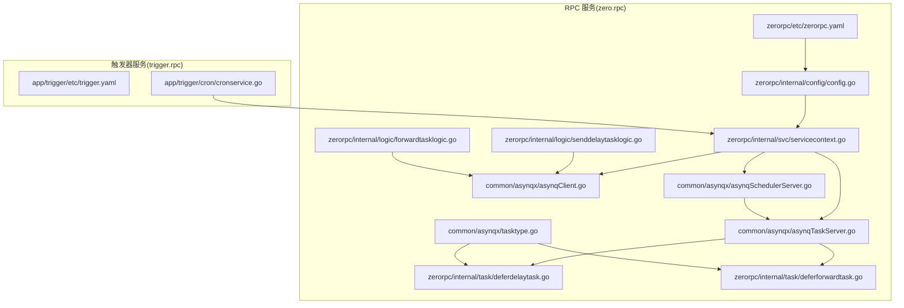
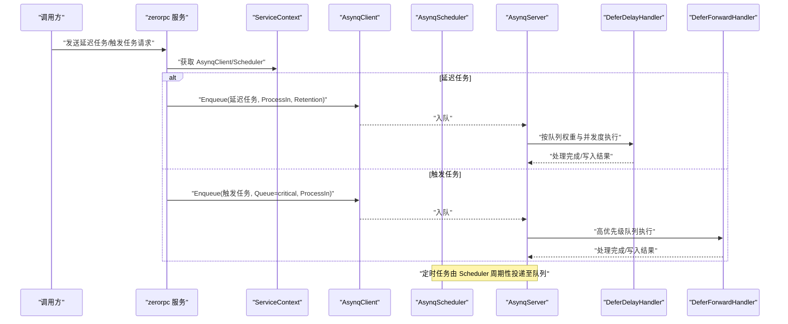
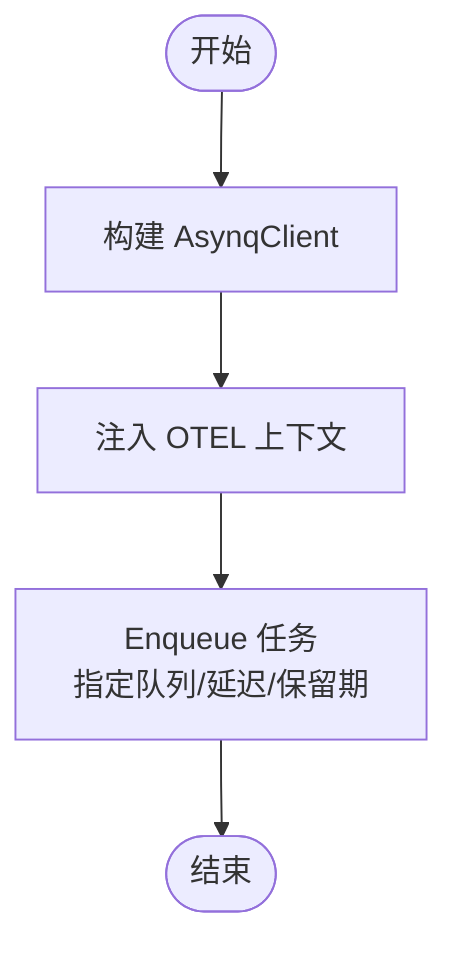
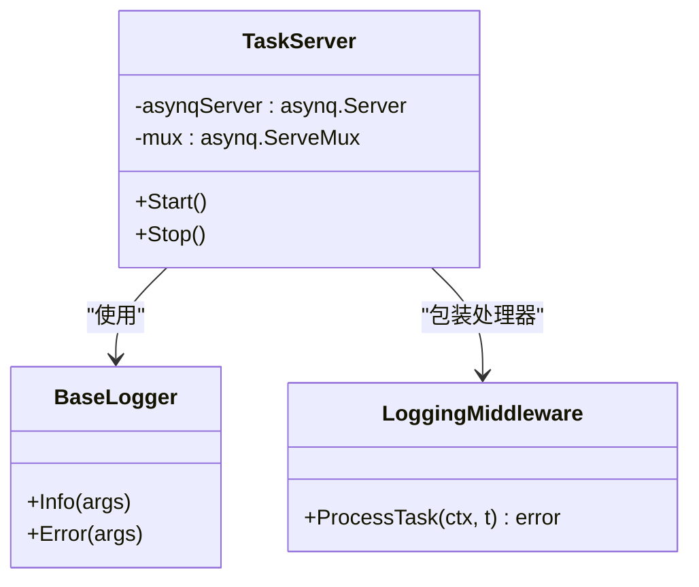
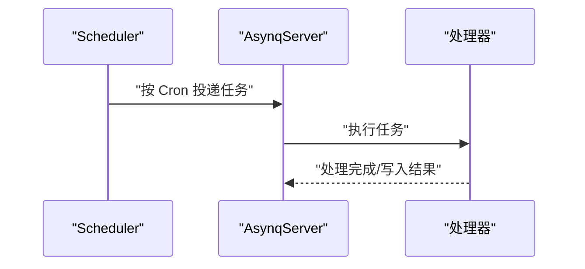
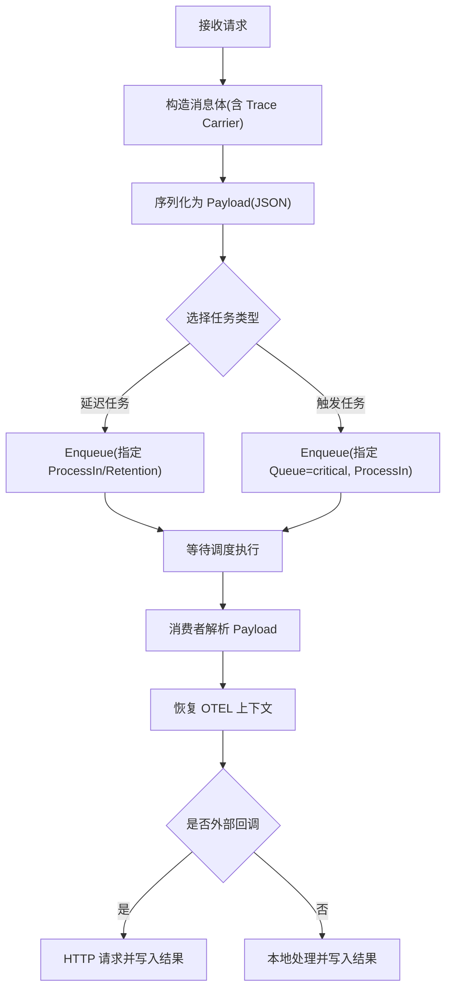
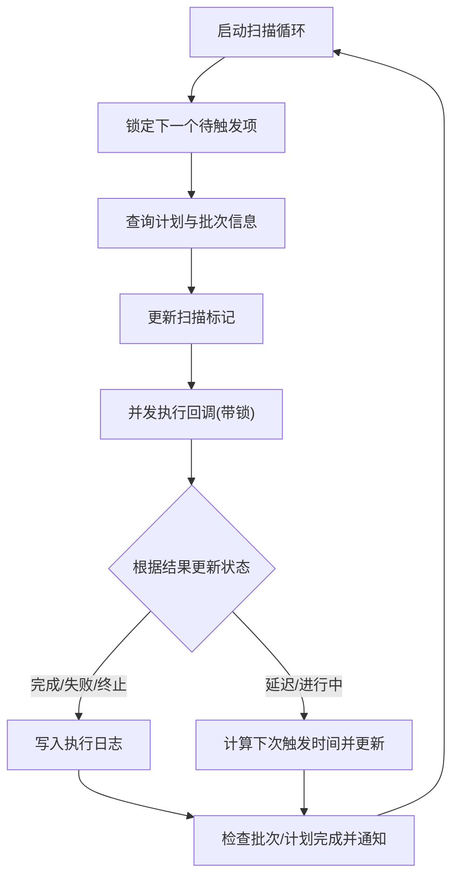
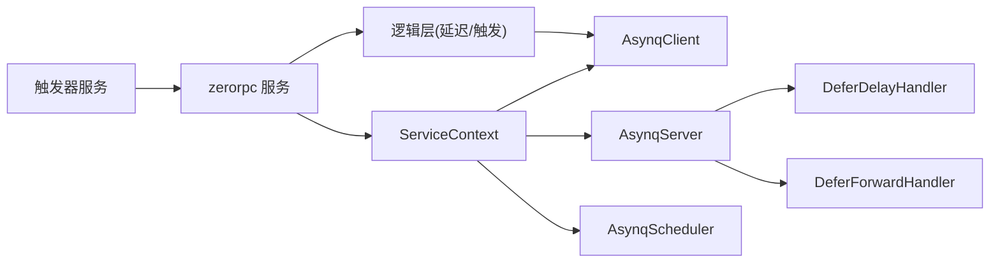

# 任务调度机制

<cite>
**本文引用的文件**
- [common/asynqx/asynqClient.go](file://common/asynqx/asynqClient.go)
- [common/asynqx/asynqTaskServer.go](file://common/asynqx/asynqTaskServer.go)
- [common/asynqx/asynqSchedulerServer.go](file://common/asynqx/asynqSchedulerServer.go)
- [common/asynqx/tasktype.go](file://common/asynqx/tasktype.go)
- [zerorpc/internal/svc/asynqClient.go](file://zerorpc/internal/svc/asynqClient.go)
- [zerorpc/internal/svc/asynqTaskServer.go](file://zerorpc/internal/svc/asynqTaskServer.go)
- [zerorpc/internal/svc/asynqSchedulerServer.go](file://zerorpc/internal/svc/asynqSchedulerServer.go)
- [zerorpc/internal/svc/servicecontext.go](file://zerorpc/internal/svc/servicecontext.go)
- [zerorpc/internal/logic/senddelaytasklogic.go](file://zerorpc/internal/logic/senddelaytasklogic.go)
- [zerorpc/internal/logic/forwardtasklogic.go](file://zerorpc/internal/logic/forwardtasklogic.go)
- [zerorpc/internal/task/deferdelaytask.go](file://zerorpc/internal/task/deferdelaytask.go)
- [zerorpc/internal/task/deferforwardtask.go](file://zerorpc/internal/task/deferforwardtask.go)
- [zerorpc/etc/zerorpc.yaml](file://zerorpc/etc/zerorpc.yaml)
- [zerorpc/internal/config/config.go](file://zerorpc/internal/config/config.go)
- [app/trigger/etc/trigger.yaml](file://app/trigger/etc/trigger.yaml)
- [app/trigger/cron/cronservice.go](file://app/trigger/cron/cronservice.go)
</cite>

## 目录
1. [引言](#引言)
2. [项目结构](#项目结构)
3. [核心组件](#核心组件)
4. [架构总览](#架构总览)
5. [详细组件分析](#详细组件分析)
6. [依赖分析](#依赖分析)
7. [性能考虑](#性能考虑)
8. [故障排查指南](#故障排查指南)
9. [结论](#结论)
10. [附录](#附录)

## 引言
本文件围绕触发器服务中的任务调度机制展开，系统性梳理基于 Asynq 的任务队列架构与实现原理，覆盖任务客户端、任务服务器与调度器三者之间的协作方式；深入说明延迟任务的创建、执行与管理流程，阐述任务优先级、并发控制与负载均衡策略；介绍任务序列化、错误处理与重试策略；并给出监控指标、性能优化建议与故障恢复机制。最后提供配置示例、最佳实践与常见问题解决方案。

## 项目结构
本仓库中与任务调度相关的关键模块分布于以下位置：
- 通用 Asynq 封装：common/asynqx（客户端、任务服务器、调度器、任务类型定义）
- RPC 服务侧集成：zerorpc/internal/svc 与 zerorpc/internal/logic、zerorpc/internal/task
- 触发器服务：app/trigger/cron/cronservice.go（扫描计划执行项并触发回调）
- 配置文件：zerorpc/etc/zerorpc.yaml、app/trigger/etc/trigger.yaml

图表来源
- [zerorpc/etc/zerorpc.yaml:1-39](file://zerorpc/etc/zerorpc.yaml#L1-L39)
- [zerorpc/internal/config/config.go:1-25](file://zerorpc/internal/config/config.go#L1-L25)
- [zerorpc/internal/svc/servicecontext.go:1-102](file://zerorpc/internal/svc/servicecontext.go#L1-L102)
- [zerorpc/internal/logic/senddelaytasklogic.go:1-53](file://zerorpc/internal/logic/senddelaytasklogic.go#L1-L53)
- [zerorpc/internal/logic/forwardtasklogic.go:1-90](file://zerorpc/internal/logic/forwardtasklogic.go#L1-L90)
- [zerorpc/internal/task/deferdelaytask.go:1-37](file://zerorpc/internal/task/deferdelaytask.go#L1-L37)
- [zerorpc/internal/task/deferforwardtask.go:1-97](file://zerorpc/internal/task/deferforwardtask.go#L1-L97)
- [common/asynqx/asynqClient.go:1-31](file://common/asynqx/asynqClient.go#L1-L31)
- [common/asynqx/asynqTaskServer.go:1-87](file://common/asynqx/asynqTaskServer.go#L1-L87)
- [common/asynqx/asynqSchedulerServer.go:1-62](file://common/asynqx/asynqSchedulerServer.go#L1-L62)
- [common/asynqx/tasktype.go:1-10](file://common/asynqx/tasktype.go#L1-L10)
- [app/trigger/etc/trigger.yaml:1-37](file://app/trigger/etc/trigger.yaml#L1-L37)
- [app/trigger/cron/cronservice.go:1-469](file://app/trigger/cron/cronservice.go#L1-L469)

章节来源
- [zerorpc/etc/zerorpc.yaml:1-39](file://zerorpc/etc/zerorpc.yaml#L1-L39)
- [app/trigger/etc/trigger.yaml:1-37](file://app/trigger/etc/trigger.yaml#L1-L37)

## 核心组件
- 任务客户端（生产者）：封装 Redis 连接与 OTEL 跨进程传播，负责 Enqueue 延迟/定时任务。
- 任务服务器（消费者）：封装 Asynq.Server，注册处理器，设置并发度与队列权重，统一中间件记录与日志。
- 调度器（定时任务）：封装 Asynq.Scheduler，按 Cron 表达式周期性投递任务。
- 任务类型：集中定义延迟任务、触发任务等类型常量，便于跨模块一致使用。
- 服务上下文：聚合 Asynq 客户端、服务器、调度器以及业务依赖（HTTP 客户端、告警、模型等）。

章节来源
- [common/asynqx/asynqClient.go:17-31](file://common/asynqx/asynqClient.go#L17-L31)
- [common/asynqx/asynqTaskServer.go:39-87](file://common/asynqx/asynqTaskServer.go#L39-L87)
- [common/asynqx/asynqSchedulerServer.go:32-62](file://common/asynqx/asynqSchedulerServer.go#L32-L62)
- [common/asynqx/tasktype.go:1-10](file://common/asynqx/tasktype.go#L1-L10)
- [zerorpc/internal/svc/servicecontext.go:19-101](file://zerorpc/internal/svc/servicecontext.go#L19-L101)

## 架构总览
下图展示从 RPC 服务到 Asynq 的完整调用链路，包括延迟任务下发、定时任务调度与消费处理。

图表来源
- [zerorpc/internal/logic/senddelaytasklogic.go:32-52](file://zerorpc/internal/logic/senddelaytasklogic.go#L32-L52)
- [zerorpc/internal/logic/forwardtasklogic.go:39-89](file://zerorpc/internal/logic/forwardtasklogic.go#L39-L89)
- [common/asynqx/asynqClient.go:17-31](file://common/asynqx/asynqClient.go#L17-L31)
- [common/asynqx/asynqTaskServer.go:28-87](file://common/asynqx/asynqTaskServer.go#L28-L87)
- [common/asynqx/asynqSchedulerServer.go:21-62](file://common/asynqx/asynqSchedulerServer.go#L21-L62)
- [zerorpc/internal/task/deferdelaytask.go:23-36](file://zerorpc/internal/task/deferdelaytask.go#L23-L36)
- [zerorpc/internal/task/deferforwardtask.go:31-96](file://zerorpc/internal/task/deferforwardtask.go#L31-L96)

## 详细组件分析

### 组件A：任务客户端（生产者）
- 功能职责
  - 基于 Redis 初始化 Asynq.Client 与 Inspector。
  - 提供 OTEL 跨进程传播的 Span 注入，便于链路追踪。
- 关键点
  - Redis 连接参数来自配置中心或环境变量。
  - 生产端 Span 类型标注为 Producer，便于在分布式追踪中识别上游来源。
- 使用场景
  - 延迟任务：指定 ProcessIn 实现延时执行。
  - 触发任务：可指定队列权重（如 critical），确保高优先级任务优先被消费。

图表来源
- [common/asynqx/asynqClient.go:17-31](file://common/asynqx/asynqClient.go#L17-L31)
- [zerorpc/internal/logic/senddelaytasklogic.go:32-52](file://zerorpc/internal/logic/senddelaytasklogic.go#L32-L52)
- [zerorpc/internal/logic/forwardtasklogic.go:39-89](file://zerorpc/internal/logic/forwardtasklogic.go#L39-L89)

章节来源
- [common/asynqx/asynqClient.go:17-31](file://common/asynqx/asynqClient.go#L17-L31)
- [zerorpc/internal/logic/senddelaytasklogic.go:32-52](file://zerorpc/internal/logic/senddelaytasklogic.go#L32-L52)
- [zerorpc/internal/logic/forwardtasklogic.go:39-89](file://zerorpc/internal/logic/forwardtasklogic.go#L39-L89)

### 组件B：任务服务器（消费者）
- 功能职责
  - 启动 Asynq.Server 并运行 ServeMux。
  - 设置并发度、队列权重（critical/default/low），实现优先级与负载均衡。
  - 中间件统一记录任务类型、任务 ID 与耗时，异常时输出错误日志。
- 关键点
  - Concurrency 控制最大并发数。
  - Queues 映射不同队列权重，实现资源倾斜与公平调度。
  - LoggingMiddleware 记录处理开始、结束与耗时，便于监控与排障。
- 错误处理
  - IsFailure 回调用于判定失败任务，便于统计与告警。

图表来源
- [common/asynqx/asynqTaskServer.go:16-87](file://common/asynqx/asynqTaskServer.go#L16-L87)

章节来源
- [common/asynqx/asynqTaskServer.go:28-87](file://common/asynqx/asynqTaskServer.go#L28-L87)

### 组件C：调度器（定时任务）
- 功能职责
  - 基于 Cron 表达式周期性投递任务到队列。
  - 支持 PostEnqueueFunc 回调，记录入队成功/失败信息。
  - 指定 Asia/Shanghai 时区，保证调度一致性。
- 关键点
  - Register 接口用于注册周期性任务条目。
  - Retention 控制任务保留期，避免无限堆积。
- 使用场景
  - 定时巡检、周期性数据同步、心跳检测等。

图表来源
- [common/asynqx/asynqSchedulerServer.go:21-62](file://common/asynqx/asynqSchedulerServer.go#L21-L62)

章节来源
- [common/asynqx/asynqSchedulerServer.go:21-62](file://common/asynqx/asynqSchedulerServer.go#L21-L62)

### 组件D：延迟任务与触发任务
- 延迟任务
  - 通过 ProcessIn 指定延迟秒数，Retention 指定保留期。
  - Payload 采用 JSON 序列化，包含消息体、Trace 上下文与业务数据。
- 触发任务
  - 支持两种触发方式：按绝对时间或相对秒数。
  - 默认进入 critical 队列，具备更高优先级。
  - 处理失败时通过告警服务上报，便于快速发现与恢复。
- 处理器
  - 解析 Payload，提取 OTEL 上下文，继续链路追踪。
  - 触发任务处理器支持对外部 HTTP 端点发起请求，并根据响应状态写入结果。

图表来源
- [zerorpc/internal/logic/senddelaytasklogic.go:32-52](file://zerorpc/internal/logic/senddelaytasklogic.go#L32-L52)
- [zerorpc/internal/logic/forwardtasklogic.go:39-89](file://zerorpc/internal/logic/forwardtasklogic.go#L39-L89)
- [zerorpc/internal/task/deferdelaytask.go:23-36](file://zerorpc/internal/task/deferdelaytask.go#L23-L36)
- [zerorpc/internal/task/deferforwardtask.go:31-96](file://zerorpc/internal/task/deferforwardtask.go#L31-L96)

章节来源
- [zerorpc/internal/logic/senddelaytasklogic.go:32-52](file://zerorpc/internal/logic/senddelaytasklogic.go#L32-L52)
- [zerorpc/internal/logic/forwardtasklogic.go:39-89](file://zerorpc/internal/logic/forwardtasklogic.go#L39-L89)
- [zerorpc/internal/task/deferdelaytask.go:23-36](file://zerorpc/internal/task/deferdelaytask.go#L23-L36)
- [zerorpc/internal/task/deferforwardtask.go:31-96](file://zerorpc/internal/task/deferforwardtask.go#L31-L96)

### 组件E：触发器服务（扫描与回调）
- 功能职责
  - 周期扫描计划执行项，锁定并执行回调。
  - 通过 Redis 分布式锁避免重复执行。
  - 根据回调返回结果更新执行状态（完成/失败/延迟/进行中/终止）。
- 关键点
  - 使用 TaskRunner 并发调度，提升吞吐。
  - 对 gRPC 调用设置超时，防止阻塞。
  - 记录执行日志，便于审计与回溯。

图表来源
- [app/trigger/cron/cronservice.go:58-184](file://app/trigger/cron/cronservice.go#L58-L184)
- [app/trigger/cron/cronservice.go:203-468](file://app/trigger/cron/cronservice.go#L203-L468)

章节来源
- [app/trigger/cron/cronservice.go:58-184](file://app/trigger/cron/cronservice.go#L58-L184)
- [app/trigger/cron/cronservice.go:203-468](file://app/trigger/cron/cronservice.go#L203-L468)

## 依赖分析
- 模块耦合
  - RPC 服务通过 ServiceContext 聚合 Asynq 客户端、服务器与调度器，降低上层对底层细节的感知。
  - 任务处理器仅依赖 ServiceContext 中的业务能力（如 HTTP 客户端、告警服务），保持职责单一。
- 外部依赖
  - Redis：作为队列存储与分布式锁后端。
  - OTEL：贯穿生产、消费两端，实现跨服务链路追踪。
  - 告警服务：在任务执行失败时进行告警上报。

图表来源
- [zerorpc/internal/svc/servicecontext.go:19-101](file://zerorpc/internal/svc/servicecontext.go#L19-L101)
- [zerorpc/internal/logic/senddelaytasklogic.go:32-52](file://zerorpc/internal/logic/senddelaytasklogic.go#L32-L52)
- [zerorpc/internal/logic/forwardtasklogic.go:39-89](file://zerorpc/internal/logic/forwardtasklogic.go#L39-L89)
- [app/trigger/cron/cronservice.go:1-469](file://app/trigger/cron/cronservice.go#L1-L469)

章节来源
- [zerorpc/internal/svc/servicecontext.go:19-101](file://zerorpc/internal/svc/servicecontext.go#L19-L101)
- [app/trigger/cron/cronservice.go:1-469](file://app/trigger/cron/cronservice.go#L1-L469)

## 性能考虑
- 并发与队列
  - 通过 Queues 映射 critical/default/low 队列权重，将高优先级任务集中在 critical 队列，减少尾延迟。
  - Concurrency 控制最大并发，避免 CPU/IO 抖动。
- 资源池
  - Redis 连接池 PoolSize 与读写超时合理配置，避免阻塞导致任务堆积。
- 负载均衡
  - 多个任务服务器实例共享同一 Redis，实现水平扩展与自动均衡。
- 监控与日志
  - LoggingMiddleware 输出任务类型、任务 ID 与耗时，便于定位慢任务。
  - Scheduler 的 PostEnqueueFunc 记录入队结果，辅助评估调度稳定性。

## 故障排查指南
- 任务未被执行
  - 检查任务服务器是否正常启动与运行。
  - 核对队列权重与并发度配置，确认任务是否被正确入队。
- 延迟任务未按时执行
  - 核对 ProcessIn 参数与 Retention 设置。
  - 检查 Redis 时间同步与时区配置。
- 处理器报错
  - 查看 LoggingMiddleware 日志，定位具体错误与耗时。
  - 若为外部 HTTP 回调失败，结合告警服务定位下游异常。
- 调度器未投递
  - 检查 Cron 表达式与时区设置。
  - 关注 PostEnqueueFunc 回调日志，确认入队是否成功。

章节来源
- [common/asynqx/asynqTaskServer.go:73-87](file://common/asynqx/asynqTaskServer.go#L73-L87)
- [common/asynqx/asynqSchedulerServer.go:42-52](file://common/asynqx/asynqSchedulerServer.go#L42-L52)
- [zerorpc/internal/task/deferforwardtask.go:52-96](file://zerorpc/internal/task/deferforwardtask.go#L52-L96)

## 结论
本方案以 Asynq 为核心，结合 Redis 实现高可靠的任务队列与调度能力。通过明确的任务类型、严格的优先级与并发控制、完善的日志与告警机制，能够满足延迟任务与周期性任务的多样化需求。配合触发器服务的扫描与回调机制，形成“计划驱动 + 事件驱动”的双通道任务体系，具备良好的扩展性与可观测性。

## 附录

### 配置示例
- RPC 服务配置（Redis 主机、密码、Key 等）
  - 参考路径：[zerorpc/etc/zerorpc.yaml:13-21](file://zerorpc/etc/zerorpc.yaml#L13-L21)
- 触发器服务配置（Redis 主机、密码、DB、日志级别等）
  - 参考路径：[app/trigger/etc/trigger.yaml:19-28](file://app/trigger/etc/trigger.yaml#L19-L28)

章节来源
- [zerorpc/etc/zerorpc.yaml:13-21](file://zerorpc/etc/zerorpc.yaml#L13-L21)
- [app/trigger/etc/trigger.yaml:19-28](file://app/trigger/etc/trigger.yaml#L19-L28)

### 最佳实践
- 任务类型命名规范：统一使用 tasktype.go 中的常量，避免拼写差异。
- 延迟任务：合理设置 ProcessIn 与 Retention，避免过长保留期造成存储压力。
- 高优先级任务：统一放入 critical 队列，避免与普通任务争抢资源。
- 并发与队列：根据业务峰值调整 Concurrency 与 Queues 权重，定期观察队列积压与耗时。
- 链路追踪：确保生产端与消费端均注入/提取 OTEL 上下文，保证全链路可观测。
- 告警策略：针对高频失败任务建立阈值告警，缩短故障恢复时间。

### 常见问题
- 任务堆积
  - 检查 Concurrency 是否过低或处理器存在阻塞。
  - 核对队列权重，确保 critical 队列有足够的资源。
- 任务重复执行
  - 检查触发器服务的分布式锁是否生效，避免并发冲突。
- 调度不准确
  - 确认时区设置为 Asia/Shanghai，核对 Cron 表达式。