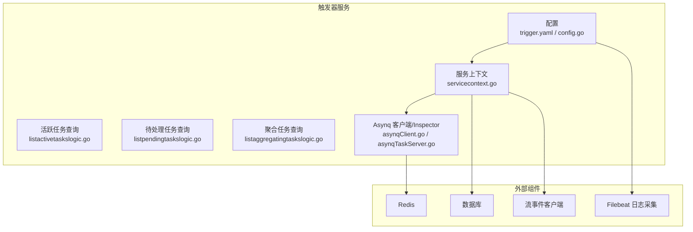
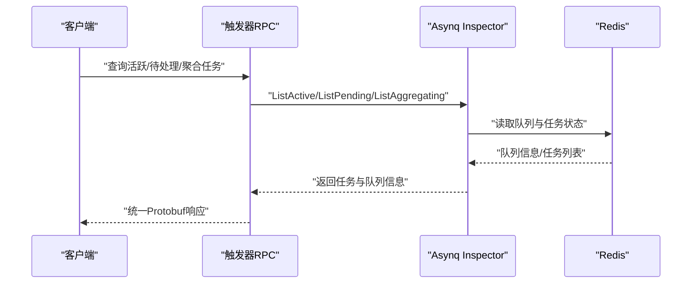
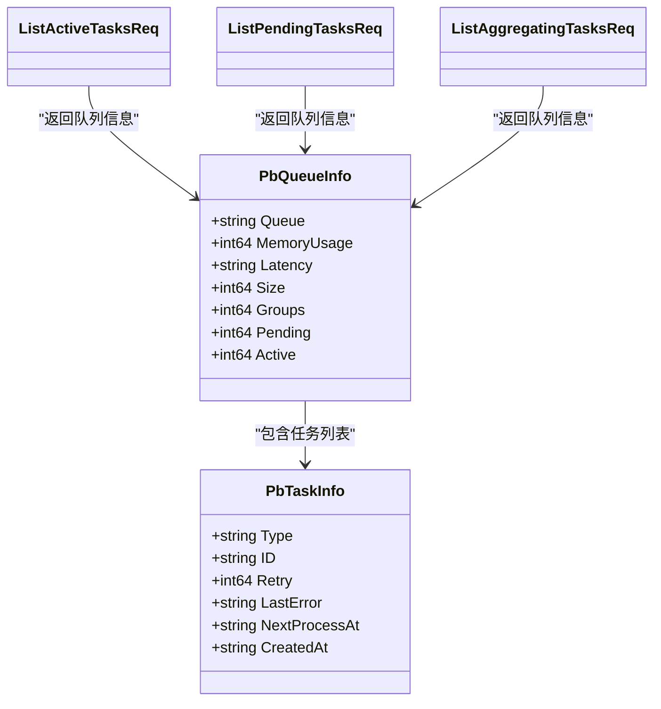
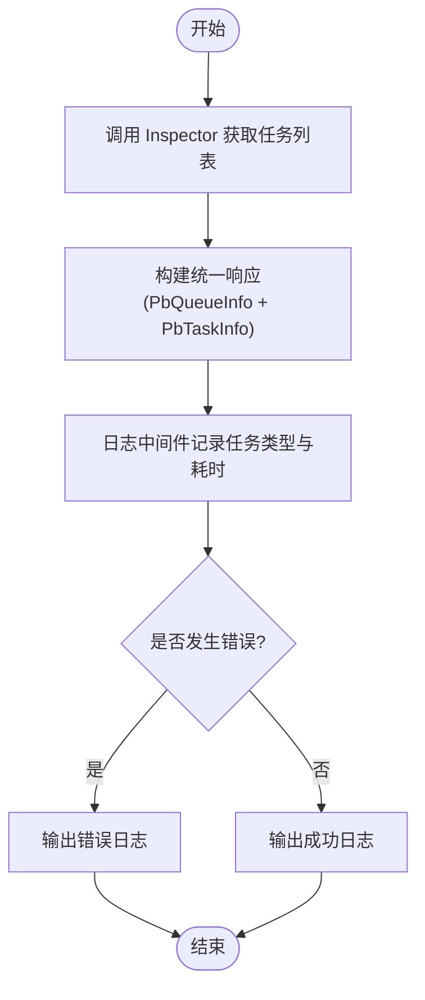
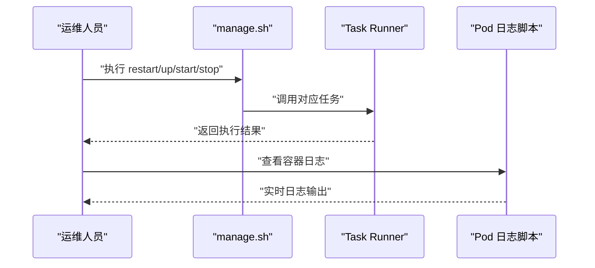
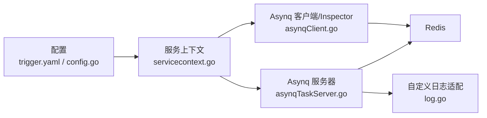

# 监控与运维

<cite>
**本文引用的文件**
- [trigger.yaml](file://app/trigger/etc/trigger.yaml)
- [config.go](file://app/trigger/internal/config/config.go)
- [servicecontext.go](file://app/trigger/internal/svc/servicecontext.go)
- [asynqTaskServer.go](file://common/asynqx/asynqTaskServer.go)
- [asynqClient.go](file://common/asynqx/asynqClient.go)
- [log.go](file://common/asynqx/log.go)
- [listactivetaskslogic.go](file://app/trigger/internal/logic/listactivetaskslogic.go)
- [listpendingtaskslogic.go](file://app/trigger/internal/logic/listpendingtaskslogic.go)
- [listaggregatingtaskslogic.go](file://app/trigger/internal/logic/listaggregatingtaskslogic.go)
- [trigger.proto](file://app/trigger/trigger/trigger.proto)
- [cronservice.go](file://app/trigger/cron/cronservice.go)
- [manage.sh](file://util/manage.sh)
- [pod-log-app.sh](file://util/dockeru/pod-log-app.sh)
- [filebeat.yml](file://deploy/filebeat/conf/filebeat.yml)
- [alarm.pb.go](file://app/alarm/alarm/alarm.pb.go)
</cite>

## 目录
1. [简介](#简介)
2. [项目结构](#项目结构)
3. [核心组件](#核心组件)
4. [架构总览](#架构总览)
5. [详细组件分析](#详细组件分析)
6. [依赖分析](#依赖分析)
7. [性能考虑](#性能考虑)
8. [故障排查指南](#故障排查指南)
9. [结论](#结论)
10. [附录](#附录)

## 简介
本文件面向触发器服务的监控与运维，围绕任务队列监控指标（队列长度、任务积压、执行成功率、延迟时间）、任务执行监控（状态跟踪、执行日志分析、性能统计）、告警机制配置（阈值、规则、通知渠道）、运维工具（任务查询、状态检查、故障诊断）、日志管理策略（级别、采集与分析）以及自动化部署与灾难恢复进行系统化说明。文档以代码为依据，结合可视化图示帮助不同背景读者快速掌握运维要点。

## 项目结构
触发器服务采用 go-zero RPC 架构，核心由以下部分组成：
- 配置层：应用配置与日志、Redis、数据库、流事件客户端等参数
- 服务上下文：封装 Asynq 客户端/服务器/调度器、Inspector、数据库与 Redis 连接
- 业务逻辑层：基于 Asynq Inspector 提供的队列与任务查询能力，返回统一的 Protobuf 结构
- 异步队列层：Asynq 作为任务队列与调度引擎，提供消费者、生产者、调度器与 Inspector
- 运维工具：Shell 脚本用于容器编排与日志查看；Filebeat 用于日志采集

图表来源
- [trigger.yaml:1-37](file://app/trigger/etc/trigger.yaml#L1-L37)
- [config.go:9-27](file://app/trigger/internal/config/config.go#L9-L27)
- [servicecontext.go:50-91](file://app/trigger/internal/svc/servicecontext.go#L50-L91)
- [asynqClient.go:17-23](file://common/asynqx/asynqClient.go#L17-L23)
- [asynqTaskServer.go:39-64](file://common/asynqx/asynqTaskServer.go#L39-L64)

章节来源
- [trigger.yaml:1-37](file://app/trigger/etc/trigger.yaml#L1-L37)
- [config.go:9-27](file://app/trigger/internal/config/config.go#L9-L27)
- [servicecontext.go:50-91](file://app/trigger/internal/svc/servicecontext.go#L50-L91)

## 核心组件
- 队列监控指标
  - 队列长度：Pending + Active
  - 任务积压：Pending
  - 执行成功率：通过任务状态与错误日志统计
  - 延迟时间：队列信息中的 Latency 字段
- 任务执行监控
  - 状态跟踪：活跃、待处理、聚合任务列表
  - 执行日志：统一日志中间件记录任务类型与耗时
  - 性能统计：按任务类型与队列维度统计耗时分布
- 告警机制
  - 阈值：队列 Pending 超过阈值、执行失败率上升、延迟超限
  - 规则：基于队列信息与任务日志的聚合统计
  - 通知：通过告警服务发送通知
- 运维工具
  - 任务查询：通过 RPC 查询活跃/待处理/聚合任务
  - 状态检查：查看队列信息与任务详情
  - 故障诊断：日志采集、容器日志查看、脚本编排
- 日志管理
  - 日志级别：info/warn/error 等
  - 采集：Filebeat 从本地日志目录采集并投递至 Kafka
  - 分析：结合 ELK/日志平台进行检索与可视化

章节来源
- [listactivetaskslogic.go:29-52](file://app/trigger/internal/logic/listactivetaskslogic.go#L29-L52)
- [listpendingtaskslogic.go:29-52](file://app/trigger/internal/logic/listpendingtaskslogic.go#L29-L52)
- [listaggregatingtaskslogic.go:29-53](file://app/trigger/internal/logic/listaggregatingtaskslogic.go#L29-L53)
- [asynqTaskServer.go:73-87](file://common/asynqx/asynqTaskServer.go#L73-L87)
- [log.go:8-37](file://common/asynqx/log.go#L8-L37)
- [trigger.yaml:5-11](file://app/trigger/etc/trigger.yaml#L5-L11)
- [filebeat.yml:1-122](file://deploy/filebeat/conf/filebeat.yml#L1-L122)

## 架构总览
触发器服务通过 Asynq 实现任务的生产、调度与消费，并通过 Inspector 获取队列与任务状态，对外提供 RPC 查询接口。日志通过 Filebeat 采集并投递到 Kafka，便于集中分析。

图表来源
- [listactivetaskslogic.go:30-51](file://app/trigger/internal/logic/listactivetaskslogic.go#L30-L51)
- [listpendingtaskslogic.go:30-51](file://app/trigger/internal/logic/listpendingtaskslogic.go#L30-L51)
- [listaggregatingtaskslogic.go:29-51](file://app/trigger/internal/logic/listaggregatingtaskslogic.go#L29-L51)
- [asynqClient.go:21-23](file://common/asynqx/asynqClient.go#L21-L23)

## 详细组件分析

### 队列监控指标与数据模型
- 关键指标
  - 队列长度：Pending + Active
  - 任务积压：Pending
  - 执行成功率：成功/失败计数
  - 延迟时间：Latency
- 数据模型
  - 队列信息结构包含队列名、内存占用、延迟、大小、分组数、Pending、Active 等字段
  - 任务信息结构包含任务类型、ID、状态、重试次数、最后运行时间等

图表来源
- [trigger.proto](file://app/trigger/trigger/trigger.proto)
- [listactivetaskslogic.go:42-47](file://app/trigger/internal/logic/listactivetaskslogic.go#L42-L47)
- [listpendingtaskslogic.go:42-47](file://app/trigger/internal/logic/listpendingtaskslogic.go#L42-L47)
- [listaggregatingtaskslogic.go:42-47](file://app/trigger/internal/logic/listaggregatingtaskslogic.go#L42-L47)

章节来源
- [trigger.proto](file://app/trigger/trigger/trigger.proto)
- [listactivetaskslogic.go:29-52](file://app/trigger/internal/logic/listactivetaskslogic.go#L29-L52)
- [listpendingtaskslogic.go:29-52](file://app/trigger/internal/logic/listpendingtaskslogic.go#L29-L52)
- [listaggregatingtaskslogic.go:29-53](file://app/trigger/internal/logic/listaggregatingtaskslogic.go#L29-L53)

### 任务执行监控与日志
- 状态跟踪
  - 活跃任务：当前正在执行的任务
  - 待处理任务：等待执行的任务
  - 聚合任务：按分组聚合的任务视图
- 执行日志
  - 统一日志中间件记录任务类型与耗时
  - 错误时输出错误日志，成功时输出调试日志
- 性能统计
  - 基于日志耗时统计各任务类型的 P50/P95 延迟
  - 结合队列信息评估并发与积压情况

图表来源
- [listactivetaskslogic.go:30-51](file://app/trigger/internal/logic/listactivetaskslogic.go#L30-L51)
- [asynqTaskServer.go:73-87](file://common/asynqx/asynqTaskServer.go#L73-L87)
- [log.go:8-37](file://common/asynqx/log.go#L8-L37)

章节来源
- [listactivetaskslogic.go:29-52](file://app/trigger/internal/logic/listactivetaskslogic.go#L29-L52)
- [listpendingtaskslogic.go:29-52](file://app/trigger/internal/logic/listpendingtaskslogic.go#L29-L52)
- [listaggregatingtaskslogic.go:29-53](file://app/trigger/internal/logic/listaggregatingtaskslogic.go#L29-L53)
- [asynqTaskServer.go:73-87](file://common/asynqx/asynqTaskServer.go#L73-L87)
- [log.go:8-37](file://common/asynqx/log.go#L8-L37)

### 告警机制配置
- 阈值建议
  - Pending 队列超时阈值：根据 SLA 设定（例如超过 1 分钟未处理的任务占比）
  - 失败率阈值：连续 N 分钟内失败任务占比超过阈值
  - 延迟阈值：队列 Latency 超过预设上限
- 告警规则
  - 基于队列信息与任务日志的聚合统计
  - 支持多级告警（预警/严重）
- 通知渠道
  - 通过告警服务发送通知（如企业微信/钉钉）

章节来源
- [alarm.pb.go:128-212](file://app/alarm/alarm/alarm.pb.go#L128-L212)

### 运维工具使用
- 任务查询
  - 通过触发器 RPC 查询活跃/待处理/聚合任务，获取队列与任务详情
- 状态检查
  - 查看队列长度、Pending/Active 数量、延迟时间
- 故障诊断
  - 使用日志脚本查看容器日志
  - 使用编排脚本批量启动/停止/重启服务

图表来源
- [manage.sh:24-34](file://util/manage.sh#L24-L34)
- [pod-log-app.sh:14-23](file://util/dockeru/pod-log-app.sh#L14-L23)

章节来源
- [manage.sh:1-35](file://util/manage.sh#L1-L35)
- [pod-log-app.sh:1-23](file://util/dockeru/pod-log-app.sh#L1-L23)

### 日志管理策略
- 日志级别
  - 在配置中设置日志级别（如 info），支持 warn/error 等
- 采集与投递
  - Filebeat 从本地日志目录读取并解析 JSON，投递到 Kafka
- 分析与检索
  - 在日志平台中按服务名、任务类型、错误码等字段检索

章节来源
- [trigger.yaml:5-11](file://app/trigger/etc/trigger.yaml#L5-L11)
- [filebeat.yml:1-122](file://deploy/filebeat/conf/filebeat.yml#L1-L122)

### 自动化部署与灾难恢复
- 自动化部署
  - 使用编排脚本统一管理服务生命周期
  - 结合 Taskfile 与 docker-compose 进行容器编排
- 灾难恢复
  - 基于队列与任务状态的快照与回放
  - 通过日志与链路追踪定位异常点
  - 服务降级与熔断策略配合告警联动

章节来源
- [manage.sh:1-35](file://util/manage.sh#L1-L35)
- [cronservice.go:38-79](file://app/trigger/cron/cronservice.go#L38-L79)

## 依赖分析
触发器服务的关键依赖关系如下：
- 配置驱动服务上下文，服务上下文创建 Asynq 客户端/服务器/调度器与 Inspector
- 业务逻辑通过 Inspector 访问 Redis 获取队列与任务状态
- 日志通过 Asynq 自定义 Logger 适配到统一日志框架

图表来源
- [trigger.yaml:1-37](file://app/trigger/etc/trigger.yaml#L1-L37)
- [config.go:9-27](file://app/trigger/internal/config/config.go#L9-L27)
- [servicecontext.go:65-68](file://app/trigger/internal/svc/servicecontext.go#L65-L68)
- [asynqClient.go:17-23](file://common/asynqx/asynqClient.go#L17-L23)
- [asynqTaskServer.go:39-64](file://common/asynqx/asynqTaskServer.go#L39-L64)
- [log.go:8-37](file://common/asynqx/log.go#L8-L37)

章节来源
- [servicecontext.go:50-91](file://app/trigger/internal/svc/servicecontext.go#L50-L91)
- [asynqTaskServer.go:16-37](file://common/asynqx/asynqTaskServer.go#L16-L37)
- [asynqClient.go:17-23](file://common/asynqx/asynqClient.go#L17-L23)

## 性能考虑
- 并发与队列
  - Asynq 服务器配置了并发度与队列优先级，避免高优先级队列被低优先级饿死
- 日志开销
  - 统一日志中间件记录耗时，便于性能分析但需控制日志级别与采样
- 数据库与缓存
  - 服务上下文统一管理数据库与 Redis 连接，减少连接抖动
- 调度与扫描
  - Cron 服务按处理结果动态调整轮询间隔，降低空闲时 CPU 占用

章节来源
- [asynqTaskServer.go:50-63](file://common/asynqx/asynqTaskServer.go#L50-L63)
- [asynqTaskServer.go:73-87](file://common/asynqx/asynqTaskServer.go#L73-L87)
- [servicecontext.go:50-91](file://app/trigger/internal/svc/servicecontext.go#L50-L91)
- [cronservice.go:58-79](file://app/trigger/cron/cronservice.go#L58-L79)

## 故障排查指南
- 常见问题
  - 队列积压：检查 Pending 数量与延迟，确认消费者并发与任务耗时
  - 执行失败：查看错误日志与任务重试次数
  - 日志缺失：确认 Filebeat 配置与 Kafka 输出
- 诊断步骤
  - 使用任务查询接口获取队列与任务详情
  - 通过日志脚本查看容器日志
  - 检查配置文件中的日志级别与路径

章节来源
- [listactivetaskslogic.go:29-52](file://app/trigger/internal/logic/listactivetaskslogic.go#L29-L52)
- [listpendingtaskslogic.go:29-52](file://app/trigger/internal/logic/listpendingtaskslogic.go#L29-L52)
- [listaggregatingtaskslogic.go:29-53](file://app/trigger/internal/logic/listaggregatingtaskslogic.go#L29-L53)
- [pod-log-app.sh:14-23](file://util/dockeru/pod-log-app.sh#L14-L23)
- [filebeat.yml:110-122](file://deploy/filebeat/conf/filebeat.yml#L110-L122)

## 结论
触发器服务通过 Asynq 实现稳定的任务队列与调度，结合统一的日志与查询接口，能够有效支撑监控与运维需求。建议在生产环境中完善告警阈值与通知渠道，持续优化队列与并发配置，并建立完善的日志采集与分析体系，以实现对任务执行的全生命周期可观测与可追溯。

## 附录
- 关键接口与指标
  - 队列信息：Pending、Active、Size、Latency、Groups
  - 任务信息：Type、ID、Retry、LastError、NextProcessAt、CreatedAt
- 建议的监控仪表板
  - 队列长度趋势、Pending 积压、执行失败率、任务平均耗时、延迟分布