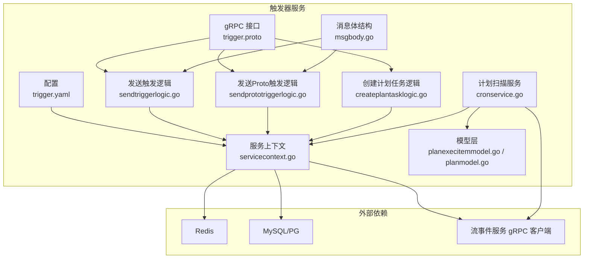
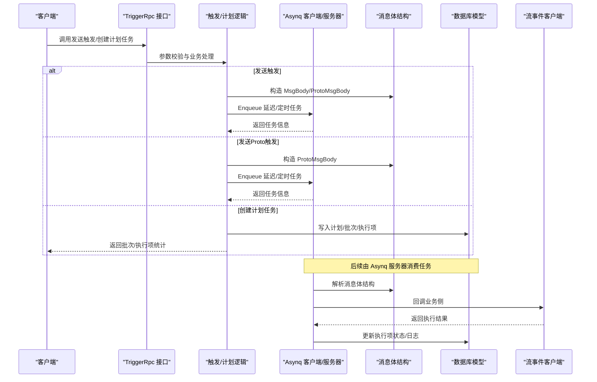
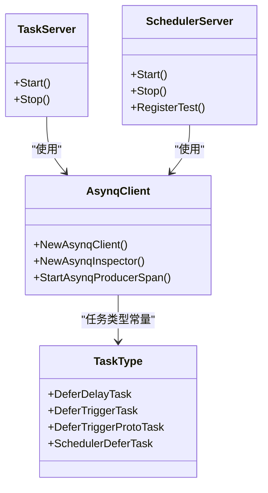
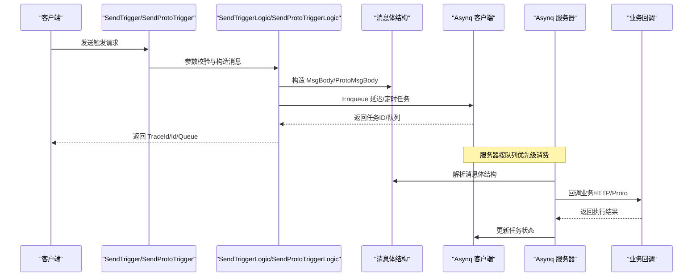
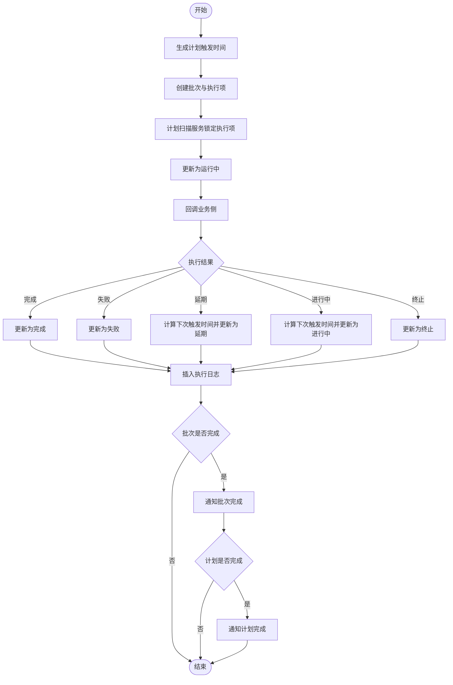
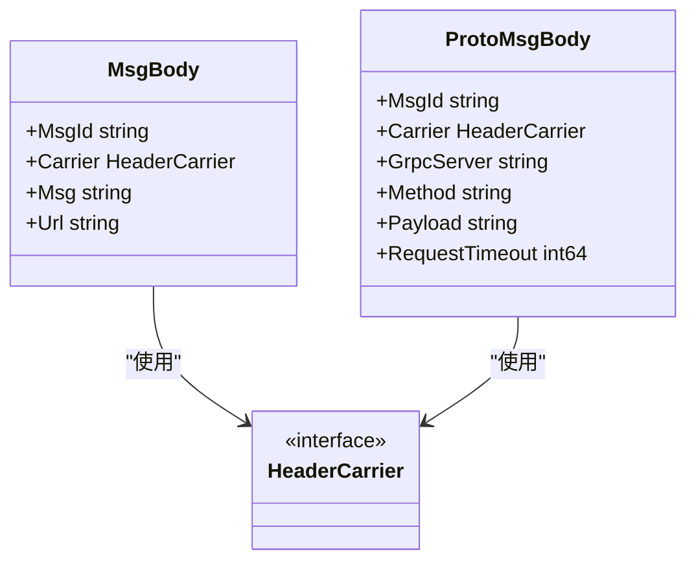
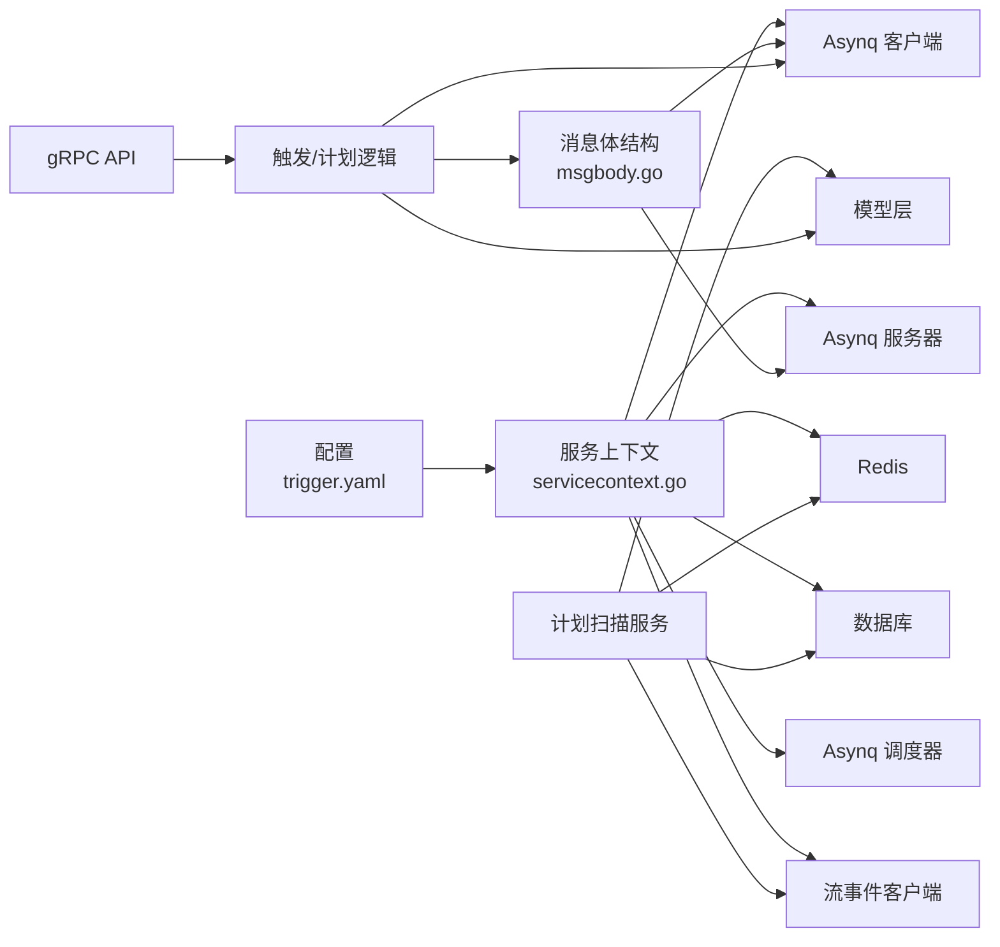

# 触发器服务

<cite>
**本文引用的文件**
- [trigger.proto](file://app/trigger/trigger.proto)
- [trigger.yaml](file://app/trigger/etc/trigger.yaml)
- [config.go](file://app/trigger/internal/config/config.go)
- [servicecontext.go](file://app/trigger/internal/svc/servicecontext.go)
- [sendtriggerlogic.go](file://app/trigger/internal/logic/sendtriggerlogic.go)
- [sendprototriggerlogic.go](file://app/trigger/internal/logic/sendprototriggerlogic.go)
- [createplantasklogic.go](file://app/trigger/internal/logic/createplantasklogic.go)
- [cronservice.go](file://app/trigger/cron/cronservice.go)
- [tasktype.go](file://common/asynqx/tasktype.go)
- [asynqClient.go](file://common/asynqx/asynqClient.go)
- [asynqTaskServer.go](file://common/asynqx/asynqTaskServer.go)
- [asynqSchedulerServer.go](file://common/asynqx/asynqSchedulerServer.go)
- [msgbody.go](file://common/msgbody/msgbody.go)
- [planexecitemmodel.go](file://model/planexecitemmodel.go)
- [planmodel.go](file://model/planmodel.go)
- [trigger.swagger.json](file://swagger/trigger.swagger.json)
</cite>

## 目录
1. [简介](#简介)
2. [项目结构](#项目结构)
3. [核心组件](#核心组件)
4. [架构总览](#架构总览)
5. [详细组件分析](#详细组件分析)
6. [依赖分析](#依赖分析)
7. [性能考虑](#性能考虑)
8. [故障排查指南](#故障排查指南)
9. [结论](#结论)
10. [附录](#附录)

## 简介
触发器服务是一个基于 Asynq 的异步任务调度与计划任务执行平台，提供两类能力：
- 异步触发：支持 HTTP JSON 回调与 gRPC Proto 回调两种方式，具备延迟/定时执行、重试、保留期、队列优先级等特性。
- 计划任务：基于 RRule 规则生成周期性任务，支持批次化、执行项状态机、超时与锁保护、回调结果处理与日志记录。

服务通过 Asynq 客户端/服务器、调度器与数据库模型协同工作，并以 gRPC 对外暴露统一 API。

**更新** 本版本更新了消息体结构设计，将触发器服务的消息体从 ctxdata 迁移到 msgbody，引入了新的 MsgBody 和 ProtoMsgBody 结构，提供更清晰的消息承载能力。同时，所有 protobuf 消息类型已标准化，添加了 Pb 后缀以区分 Go 代码中的结构体类型。

## 项目结构
触发器服务位于 app/trigger 目录，核心由以下部分组成：
- 协议与 API：trigger.proto 定义 gRPC 接口与消息类型；trigger.swagger.json 提供 Swagger 文档元信息。
- 配置：trigger.yaml 提供服务监听、日志、Nacos 注册、Redis、数据库与流事件客户端配置。
- 服务上下文：servicecontext 负责初始化 Asynq 客户端/服务器、调度器、数据库连接、Redis、流事件客户端等。
- 逻辑层：sendtriggerlogic 实现异步触发；sendprototriggerlogic 实现 gRPC Proto 触发；createplantasklogic 实现计划任务创建。
- 定时扫描：cronservice 周期扫描待触发的计划执行项并回调业务侧。
- Asynq 封装：common/asynqx 提供 Asynq 客户端、服务器、调度器封装与任务类型常量。
- 消息体结构：common/msgbody 提供 MsgBody 和 ProtoMsgBody 结构，替代原有的 ctxdata 能力。
- 模型层：model 提供计划、批次、执行项与执行日志的持久化与状态更新。

**图表来源**
- [trigger.proto](file://app/trigger/trigger.proto)
- [trigger.yaml](file://app/trigger/etc/trigger.yaml)
- [servicecontext.go](file://app/trigger/internal/svc/servicecontext.go)
- [sendtriggerlogic.go](file://app/trigger/internal/logic/sendtriggerlogic.go)
- [sendprototriggerlogic.go](file://app/trigger/internal/logic/sendprototriggerlogic.go)
- [createplantasklogic.go](file://app/trigger/internal/logic/createplantasklogic.go)
- [cronservice.go](file://app/trigger/cron/cronservice.go)
- [msgbody.go](file://common/msgbody/msgbody.go)
- [planexecitemmodel.go](file://model/planexecitemmodel.go)
- [planmodel.go](file://model/planmodel.go)

**章节来源**
- [trigger.proto](file://app/trigger/trigger.proto)
- [trigger.yaml](file://app/trigger/etc/trigger.yaml)
- [servicecontext.go](file://app/trigger/internal/svc/servicecontext.go)

## 核心组件
- Asynq 客户端/服务器/调度器：负责任务生产、消费与定时调度。
- 计划扫描服务：周期扫描数据库中满足条件的执行项，回调业务侧并更新状态。
- 计划任务模型：提供执行项锁定、状态变更、批次完成检测等能力。
- 触发逻辑：封装 HTTP/Proto 两种触发方式，支持延迟/定时、重试、队列选择与保留期。
- 消息体结构：新的 MsgBody 和 ProtoMsgBody 结构提供标准化的消息承载能力。
- 服务上下文：集中管理 Redis、数据库、Asynq、流事件客户端等资源。

**更新** 新增消息体结构组件，提供标准化的消息承载能力，替代原有的 ctxdata 能力。所有 protobuf 消息类型已标准化，添加了 Pb 后缀以区分 Go 代码中的结构体类型。

**章节来源**
- [asynqClient.go](file://common/asynqx/asynqClient.go)
- [asynqTaskServer.go](file://common/asynqx/asynqTaskServer.go)
- [asynqSchedulerServer.go](file://common/asynqx/asynqSchedulerServer.go)
- [cronservice.go](file://app/trigger/cron/cronservice.go)
- [msgbody.go](file://common/msgbody/msgbody.go)
- [planexecitemmodel.go](file://model/planexecitemmodel.go)
- [sendtriggerlogic.go](file://app/trigger/internal/logic/sendtriggerlogic.go)
- [sendprototriggerlogic.go](file://app/trigger/internal/logic/sendprototriggerlogic.go)

## 架构总览
触发器服务采用"gRPC API + Asynq 异步队列 + 数据库状态机 + 标准化消息体"的架构模式：
- gRPC API 接收外部请求，写入 Asynq 队列或直接创建计划任务。
- Asynq 服务器按队列优先级并发消费任务，执行回调或状态更新。
- 计划扫描服务定期轮询数据库，定位待触发执行项，回调业务侧并更新状态。
- 流事件客户端向业务侧推送计划事件通知。
- 标准化消息体结构提供统一的消息承载能力，支持 OpenTelemetry 上下文传播。

**图表来源**
- [trigger.proto](file://app/trigger/trigger.proto)
- [sendtriggerlogic.go](file://app/trigger/internal/logic/sendtriggerlogic.go)
- [sendprototriggerlogic.go](file://app/trigger/internal/logic/sendprototriggerlogic.go)
- [createplantasklogic.go](file://app/trigger/internal/logic/createplantasklogic.go)
- [asynqTaskServer.go](file://common/asynqx/asynqTaskServer.go)
- [msgbody.go](file://common/msgbody/msgbody.go)
- [planexecitemmodel.go](file://model/planexecitemmodel.go)

## 详细组件分析

### Asynq 架构与任务类型
- 任务类型：延迟任务、触发任务、Proto 触发任务、调度器延迟任务。
- 服务器配置：并发度、队列优先级（critical/default/low）、日志与失败判定。
- 调度器：基于 Asia/Shanghai 时区，注册 Cron 表达式任务，支持后入队回调。
- 客户端/检查器：封装 Asynq 客户端与 Inspector，支持 OpenTelemetry 上下文注入。

**图表来源**
- [asynqTaskServer.go](file://common/asynqx/asynqTaskServer.go)
- [asynqSchedulerServer.go](file://common/asynqx/asynqSchedulerServer.go)
- [asynqClient.go](file://common/asynqx/asynqClient.go)
- [tasktype.go](file://common/asynqx/tasktype.go)

**章节来源**
- [asynqTaskServer.go](file://common/asynqx/asynqTaskServer.go)
- [asynqSchedulerServer.go](file://common/asynqx/asynqSchedulerServer.go)
- [asynqClient.go](file://common/asynqx/asynqClient.go)
- [tasktype.go](file://common/asynqx/tasktype.go)

### 异步触发流程（HTTP/Proto）
- HTTP JSON 回调：支持延迟/定时、最大重试、队列选择、保留期、TraceID 与消息 ID。
- gRPC Proto 回调：支持延迟/定时、最大重试、服务名/方法、超时、Trace 上下文传播。
- 生产者 Span：在 Asynq 生产者侧开启 Span 并注入上下文，便于链路追踪。
- 标准化消息体：新的 MsgBody 和 ProtoMsgBody 结构提供统一的消息承载能力。

**更新** 新增标准化消息体结构，提供更清晰的消息承载能力。所有 protobuf 消息类型已标准化，添加了 Pb 后缀以区分 Go 代码中的结构体类型。

**图表来源**
- [trigger.proto](file://app/trigger/trigger.proto)
- [sendtriggerlogic.go](file://app/trigger/internal/logic/sendtriggerlogic.go)
- [sendprototriggerlogic.go](file://app/trigger/internal/logic/sendprototriggerlogic.go)
- [asynqClient.go](file://common/asynqx/asynqClient.go)
- [msgbody.go](file://common/msgbody/msgbody.go)

**章节来源**
- [trigger.proto](file://app/trigger/trigger.proto)
- [sendtriggerlogic.go](file://app/trigger/internal/logic/sendtriggerlogic.go)
- [sendprototriggerlogic.go](file://app/trigger/internal/logic/sendprototriggerlogic.go)
- [msgbody.go](file://common/msgbody/msgbody.go)

### 计划任务生命周期与状态机
- 规则生成：基于 RRule 生成计划触发时间，支持排除日期、时间范围限制。
- 批次与执行项：按触发时间生成批次与执行项，支持间隔类型与偏移。
- 扫描与回调：计划扫描服务锁定执行项、更新状态为运行中、回调业务侧、根据结果更新状态（完成/失败/延期/进行中/终止）。
- 日志与通知：插入执行日志，批量/计划完成后通知流事件服务。

**图表来源**
- [createplantasklogic.go](file://app/trigger/internal/logic/createplantasklogic.go)
- [cronservice.go](file://app/trigger/cron/cronservice.go)
- [planexecitemmodel.go](file://model/planexecitemmodel.go)
- [planmodel.go](file://model/planmodel.go)

**章节来源**
- [createplantasklogic.go](file://app/trigger/internal/logic/createplantasklogic.go)
- [cronservice.go](file://app/trigger/cron/cronservice.go)
- [planexecitemmodel.go](file://model/planexecitemmodel.go)
- [planmodel.go](file://model/planmodel.go)

### 消息体结构设计
- MsgBody 结构：包含消息 ID、OpenTelemetry HeaderCarrier、消息内容和 URL，支持 HTTP 回调。
- ProtoMsgBody 结构：包含消息 ID、OpenTelemetry HeaderCarrier、gRPC 服务器地址、方法、负载和请求超时，支持 gRPC Proto 回调。
- 标准化承载：替代原有的 ctxdata 能力，提供统一的消息承载格式。
- 上下文传播：通过 HeaderCarrier 支持 OpenTelemetry 上下文传播。

**更新** 新增消息体结构设计，提供标准化的消息承载能力。所有 protobuf 消息类型已标准化，添加了 Pb 后缀以区分 Go 代码中的结构体类型。

**图表来源**
- [msgbody.go](file://common/msgbody/msgbody.go)

**章节来源**
- [msgbody.go](file://common/msgbody/msgbody.go)

### Protobuf 消息类型标准化
**更新** 所有 protobuf 消息类型已进行全面标准化，添加了 Pb 后缀以区分 Go 代码中的结构体类型：

- **枚举类型**：ExecItemStatus → ExecItemStatusPb
- **任务信息**：TaskInfo → TaskInfoPb  
- **计划相关**：Plan → PlanPb、PlanBatch → PlanBatchPb、PlanExecItem → PlanExecItemPb、PlanExecLog → PlanExecLogPb
- **计划规则**：PlanRule → PlanRulePb
- **执行项创建**：CreatePlanExecItem → CreatePlanExecItemPb
- **仪表板统计**：FinishedItemsStats → FinishedItemsStatsPb、PendingItemsStats → PendingItemsStatsPb、ExecItemDashboardItem → ExecItemDashboardItemPb
- **延期配置**：DelayConfig → DelayConfigPb

这些标准化变更确保了 protobuf 消息类型与 Go 代码结构体之间的清晰区分，提高了代码的可维护性和类型安全性。

**章节来源**
- [trigger.proto](file://app/trigger/trigger.proto)
- [gettaskinfologic.go](file://app/trigger/internal/logic/gettaskinfologic.go)
- [listplanexecitemslogic.go](file://app/trigger/internal/logic/listplanexecitemslogic.go)
- [getplanexecitemlogic.go](file://app/trigger/internal/logic/getplanexecitemlogic.go)

### API 接口与监控
- 触发相关：发送触发、发送 Proto 触发、运行任务、删除任务、归档任务、获取任务信息等。
- 队列与统计：获取队列列表、队列信息、历史统计、活跃/待处理/聚合/预定/重试/已完成/已归档任务列表。
- 计划任务：计算计划日期、创建计划任务、暂停/恢复/终止计划与批次、暂停/恢复/终止执行项、立即执行执行项、获取计划/批次/执行项详情、计划执行日志、执行项仪表板统计、回调执行项。
- 监控：队列信息包含 pending/active/scheduled/retry/aggregated/archived/completed 等计数与内存占用、延迟等指标。

**章节来源**
- [trigger.proto](file://app/trigger/trigger.proto)
- [trigger.swagger.json](file://swagger/trigger.swagger.json)

## 依赖分析
- 服务上下文集中管理 Redis、数据库、Asynq 客户端/服务器/调度器、流事件客户端与工具类。
- 计划扫描服务依赖数据库模型进行执行项锁定与状态更新，依赖 Redis 分布式锁与流事件客户端进行回调与通知。
- Asynq 服务器按队列优先级并发处理任务，消费者 Span 记录处理耗时与错误。
- 新增消息体结构依赖 OpenTelemetry propagation 包进行上下文传播。

**更新** 新增消息体结构依赖关系。所有 protobuf 消息类型已标准化，添加了 Pb 后缀以区分 Go 代码中的结构体类型。

**图表来源**
- [servicecontext.go](file://app/trigger/internal/svc/servicecontext.go)
- [cronservice.go](file://app/trigger/cron/cronservice.go)
- [planexecitemmodel.go](file://model/planexecitemmodel.go)
- [msgbody.go](file://common/msgbody/msgbody.go)

**章节来源**
- [servicecontext.go](file://app/trigger/internal/svc/servicecontext.go)
- [cronservice.go](file://app/trigger/cron/cronservice.go)
- [msgbody.go](file://common/msgbody/msgbody.go)

## 性能考虑
- 队列优先级：critical/default/low 三档队列，critical 并发更高，适合高优任务。
- 并发控制：Asynq 服务器并发度可调，建议结合 CPU 与 Redis 性能压测确定最优值。
- 扫描频率：计划扫描服务在无待处理项时采用随机抖动的休眠，避免空转竞争。
- 重试策略：Asynq 默认指数退避，上限封顶至 30 分钟，减少对下游压力。
- 资源池：Redis 连接池大小与超时配置需与 Asynq 服务器一致，避免阻塞。
- 数据库：执行项锁定使用版本号与 LIMIT 1，避免热点竞争；PostgreSQL 使用 ORDER BY RANDOM()，MySQL 使用 RAND()。
- 消息体优化：新的消息体结构提供更高效的序列化和反序列化性能。
- 类型安全：标准化的 Pb 后缀消息类型提高了编译时类型检查的准确性。

**更新** 新增消息体结构性能优化考虑和类型安全改进。

## 故障排查指南
- 任务未被消费：检查 Asynq 服务器是否启动、队列配置是否正确、Redis 连接是否正常。
- 计划未触发：确认计划状态为启用、批次状态为启用、执行项状态为待执行/延期等待、下次触发时间已到达。
- 回调失败：查看回调返回结果与日志，确认业务侧是否可达、超时设置是否合理。
- 扫描异常：检查计划扫描服务日志，关注锁定失败与状态更新错误。
- 队列堆积：通过队列信息接口观察 pending/active/scheduled/retry 数量变化，调整队列优先级与并发度。
- 消息体解析失败：检查消息体结构是否符合 MsgBody/ProtoMsgBody 定义，确认 JSON 序列化是否正确。
- 类型转换错误：检查 protobuf 消息类型是否正确使用 Pb 后缀版本，确保与 Go 代码中的结构体类型匹配。

**更新** 新增消息体解析相关故障排查指导和类型转换错误排查。

**章节来源**
- [asynqTaskServer.go](file://common/asynqx/asynqTaskServer.go)
- [cronservice.go](file://app/trigger/cron/cronservice.go)
- [planexecitemmodel.go](file://model/planexecitemmodel.go)
- [msgbody.go](file://common/msgbody/msgbody.go)

## 结论
触发器服务通过 Asynq 实现高可靠、可扩展的异步任务调度与计划任务执行，结合数据库状态机与流事件通知，形成完整的任务生命周期管理闭环。其清晰的队列优先级、可配置的重试与保留策略、以及完善的监控指标，使其适用于复杂业务场景下的定时与计划任务需求。

**更新** 新版本进一步增强了消息体结构的标准化和一致性，提供了更好的可维护性和扩展性。所有 protobuf 消息类型已标准化，添加了 Pb 后缀以区分 Go 代码中的结构体类型，提高了代码的类型安全性和可维护性。

## 附录

### 配置模板
- 服务监听与日志：参考 [trigger.yaml](file://app/trigger/etc/trigger.yaml)
- Asynq 客户端/服务器/调度器：参考 [asynqClient.go](file://common/asynqx/asynqClient.go)、[asynqTaskServer.go](file://common/asynqx/asynqTaskServer.go)、[asynqSchedulerServer.go](file://common/asynqx/asynqSchedulerServer.go)
- 服务上下文初始化：参考 [servicecontext.go](file://app/trigger/internal/svc/servicecontext.go)
- 消息体结构：参考 [msgbody.go](file://common/msgbody/msgbody.go)

**更新** 新增消息体结构配置模板。所有 protobuf 消息类型已标准化，添加了 Pb 后缀以区分 Go 代码中的结构体类型。

**章节来源**
- [trigger.yaml](file://app/trigger/etc/trigger.yaml)
- [asynqClient.go](file://common/asynqx/asynqClient.go)
- [asynqTaskServer.go](file://common/asynqx/asynqTaskServer.go)
- [asynqSchedulerServer.go](file://common/asynqx/asynqSchedulerServer.go)
- [servicecontext.go](file://app/trigger/internal/svc/servicecontext.go)
- [msgbody.go](file://common/msgbody/msgbody.go)

### Protobuf 消息类型对照表
**更新** 以下是标准化后的消息类型对照表：

| 原类型 | 新类型 | 用途 |
|--------|--------|------|
| ExecItemStatus | ExecItemStatusPb | 执行项状态枚举 |
| TaskInfo | TaskInfoPb | 任务信息结构 |
| Plan | PlanPb | 计划任务结构 |
| PlanBatch | PlanBatchPb | 计划批次结构 |
| PlanExecItem | PlanExecItemPb | 计划执行项结构 |
| PlanExecLog | PlanExecLogPb | 计划执行日志结构 |
| PlanRule | PlanRulePb | 计划规则结构 |
| CreatePlanExecItem | CreatePlanExecItemPb | 创建执行项请求结构 |
| FinishedItemsStats | FinishedItemsStatsPb | 已结束执行项统计结构 |
| PendingItemsStats | PendingItemsStatsPb | 待完成执行项统计结构 |
| ExecItemDashboardItem | ExecItemDashboardItemPb | 执行项仪表板统计项结构 |
| DelayConfig | DelayConfigPb | 延期配置结构 |

**章节来源**
- [trigger.proto](file://app/trigger/trigger.proto)
- [gettaskinfologic.go](file://app/trigger/internal/logic/gettaskinfologic.go)
- [listplanexecitemslogic.go](file://app/trigger/internal/logic/listplanexecitemslogic.go)
- [getplanexecitemlogic.go](file://app/trigger/internal/logic/getplanexecitemlogic.go)