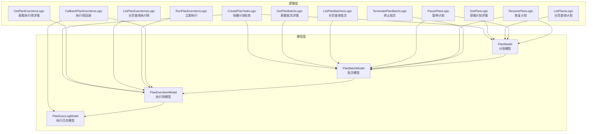
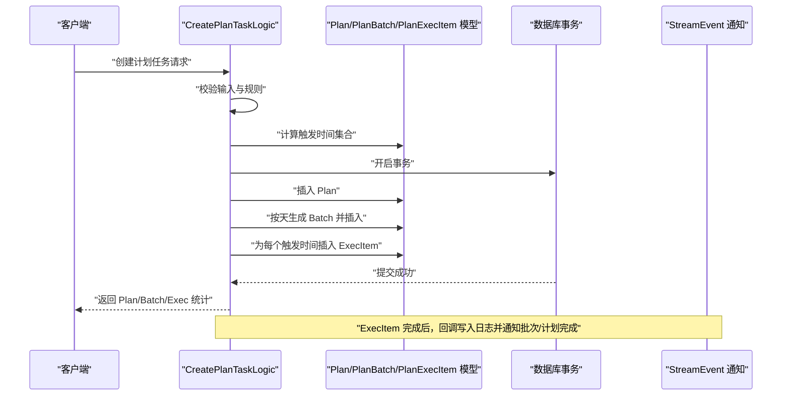
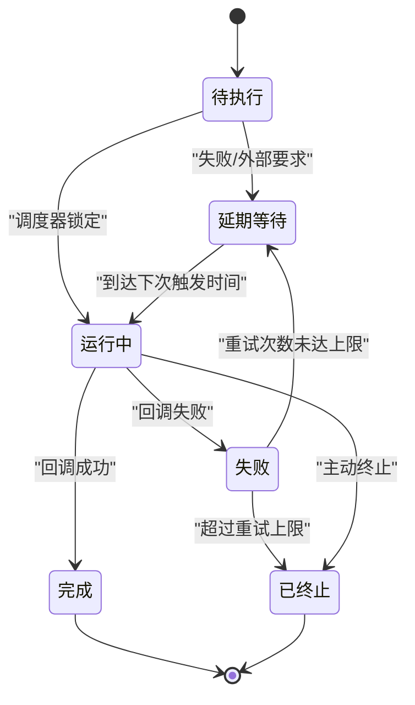
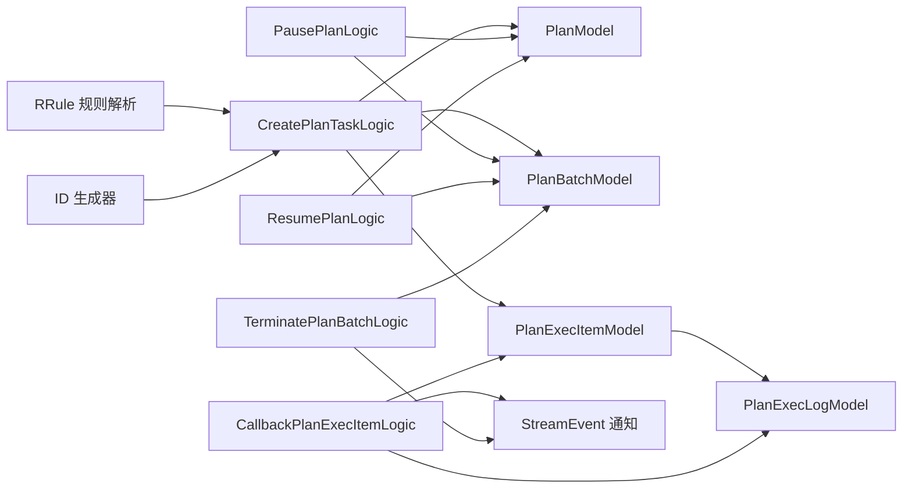

# 计划任务管理

<cite>
**本文引用的文件**
- [planmodel.go](file://model/planmodel.go)
- [planbatchmodel.go](file://model/planbatchmodel.go)
- [planexecitemmodel.go](file://model/planexecitemmodel.go)
- [planexeclogmodel.go](file://model/planexeclogmodel.go)
- [createplantasklogic.go](file://app/trigger/internal/logic/createplantasklogic.go)
- [getplanlogic.go](file://app/trigger/internal/logic/getplanlogic.go)
- [listplanslogic.go](file://app/trigger/internal/logic/listplanslogic.go)
- [getplanbatchlogic.go](file://app/trigger/internal/logic/getplanbatchlogic.go)
- [listplanbatcheslogic.go](file://app/trigger/internal/logic/listplanbatcheslogic.go)
- [getplanexecitemlogic.go](file://app/trigger/internal/logic/getplanexecitemlogic.go)
- [listplanexecitemslogic.go](file://app/trigger/internal/logic/listplanexecitemslogic.go)
- [runplanexecitemlogic.go](file://app/trigger/internal/logic/runplanexecitemlogic.go)
- [callbackplanexecitemlogic.go](file://app/trigger/internal/logic/callbackplanexecitemlogic.go)
- [pauseplanlogic.go](file://app/trigger/internal/logic/pauseplanlogic.go)
- [resumeplanlogic.go](file://app/trigger/internal/logic/resumeplanlogic.go)
- [terminateplanbatchlogic.go](file://app/trigger/internal/logic/terminateplanbatchlogic.go)
</cite>

## 目录
1. [简介](#简介)
2. [项目结构](#项目结构)
3. [核心组件](#核心组件)
4. [架构概览](#架构概览)
5. [详细组件分析](#详细组件分析)
6. [依赖关系分析](#依赖关系分析)
7. [性能考虑](#性能考虑)
8. [故障排查指南](#故障排查指南)
9. [结论](#结论)
10. [附录](#附录)

## 简介
本技术文档围绕触发器服务的“计划任务管理”能力，系统性阐述计划任务的数据模型设计、生命周期管理、批量任务处理机制、状态管理与进度跟踪、API 接口定义以及配置模板与最佳实践。目标是帮助开发者与运维人员快速理解并高效使用该模块。

## 项目结构
计划任务相关代码主要分布在以下位置：
- 数据模型层：位于 model 目录，包含 Plan、PlanBatch、PlanExecItem、PlanExecLog 的自定义模型扩展与数据库访问方法
- 业务逻辑层：位于 app/trigger/internal/logic，提供计划任务的创建、查询、暂停/恢复、终止、执行项回调等核心逻辑
- 协议与类型：位于 app/trigger/trigger（由 proto 编译生成），用于 RPC 接口定义与跨服务通信

图表来源
- [planmodel.go:1-65](file://model/planmodel.go#L1-L65)
- [planbatchmodel.go:1-94](file://model/planbatchmodel.go#L1-L94)
- [planexecitemmodel.go:1-435](file://model/planexecitemmodel.go#L1-L435)
- [planexeclogmodel.go:1-31](file://model/planexeclogmodel.go#L1-L31)
- [createplantasklogic.go:1-250](file://app/trigger/internal/logic/createplantasklogic.go#L1-L250)
- [getplanlogic.go:1-102](file://app/trigger/internal/logic/getplanlogic.go#L1-L102)
- [listplanslogic.go:1-118](file://app/trigger/internal/logic/listplanslogic.go#L1-L118)
- [getplanbatchlogic.go:1-116](file://app/trigger/internal/logic/getplanbatchlogic.go#L1-L116)
- [listplanbatcheslogic.go:1-149](file://app/trigger/internal/logic/listplanbatcheslogic.go#L1-L149)
- [getplanexecitemlogic.go:1-105](file://app/trigger/internal/logic/getplanexecitemlogic.go#L1-L105)
- [listplanexecitemslogic.go:1-134](file://app/trigger/internal/logic/listplanexecitemslogic.go#L1-L134)
- [runplanexecitemlogic.go:1-93](file://app/trigger/internal/logic/runplanexecitemlogic.go#L1-L93)
- [callbackplanexecitemlogic.go:1-246](file://app/trigger/internal/logic/callbackplanexecitemlogic.go#L1-L246)
- [pauseplanlogic.go:1-99](file://app/trigger/internal/logic/pauseplanlogic.go#L1-L99)
- [resumeplanlogic.go:1-101](file://app/trigger/internal/logic/resumeplanlogic.go#L1-L101)
- [terminateplanbatchlogic.go:1-119](file://app/trigger/internal/logic/terminateplanbatchlogic.go#L1-L119)

章节来源
- [planmodel.go:1-65](file://model/planmodel.go#L1-L65)
- [planbatchmodel.go:1-94](file://model/planbatchmodel.go#L1-L94)
- [planexecitemmodel.go:1-435](file://model/planexecitemmodel.go#L1-L435)
- [planexeclogmodel.go:1-31](file://model/planexeclogmodel.go#L1-L31)

## 核心组件
- 计划（Plan）：描述一个完整的计划任务，包含周期规则、起止时间、状态、进度等信息
- 批次（PlanBatch）：按触发时间切分的执行集合，承载执行项的聚合与进度统计
- 执行项（PlanExecItem）：具体的可调度任务单元，包含触发时间、状态、重试次数、回调数据等
- 执行日志（PlanExecLog）：记录每次执行的结果、消息与原因，便于审计与追踪

章节来源
- [planmodel.go:1-65](file://model/planmodel.go#L1-L65)
- [planbatchmodel.go:1-94](file://model/planbatchmodel.go#L1-L94)
- [planexecitemmodel.go:1-435](file://model/planexecitemmodel.go#L1-L435)
- [planexeclogmodel.go:1-31](file://model/planexeclogmodel.go#L1-L31)

## 架构概览
计划任务管理采用“模型-逻辑-接口”的分层设计：
- 模型层负责与数据库交互，提供 CRUD、统计与原子更新方法
- 逻辑层封装业务规则，如创建时的时间点生成、状态流转、并发控制与事件通知
- 接口层通过 RPC 提供对外服务，覆盖查询、状态变更与统计分析

图表来源
- [createplantasklogic.go:38-250](file://app/trigger/internal/logic/createplantasklogic.go#L38-L250)
- [planbatchmodel.go:68-94](file://model/planbatchmodel.go#L68-L94)
- [planexecitemmodel.go:165-200](file://model/planexecitemmodel.go#L165-L200)
- [callbackplanexecitemlogic.go:182-242](file://app/trigger/internal/logic/callbackplanexecitemlogic.go#L182-L242)

## 详细组件分析

### 数据模型设计与关系
- Plan（计划）
  - 字段要点：唯一标识、名称、类型、分组、周期规则 JSON、起止时间、状态、暂停/终止原因、扩展字段
  - 约束：唯一索引 PlanId；状态枚举（启用/暂停/终止）
- PlanBatch（批次）
  - 字段要点：关联 Plan、批次编号/名称、计划触发时间、状态、完成时间、扩展字段
  - 约束：与 Plan 外键关联；状态与完成时间共同决定批次是否完成
- PlanExecItem（执行项）
  - 字段要点：关联 Batch/Plan、执行标识、业务项标识/名称/点位、负载、超时、计划/下一次/上次触发时间、状态、重试次数、结果/消息/原因、暂停/终止原因、扩展字段
  - 约束：状态机严格控制；版本号用于乐观锁；NextTriggerTime 决定调度优先级
- PlanExecLog（执行日志）
  - 字段要点：关联 Plan/Batch/ExecItem、TraceId、执行结果、消息、原因
  - 作用：审计与回溯

```mermaid
erDiagram
PLAN {
bigint id PK
string plan_id UK
string plan_name
string type
string group_id
text recurrence_rule
datetime start_time
datetime end_time
int status
datetime paused_time
string paused_reason
datetime finished_time
string terminated_reason
}
PLAN_BATCH {
bigint id PK
bigint plan_pk FK
string plan_id
string batch_id UK
string batch_num
string batch_name
datetime plan_trigger_time
int status
datetime finished_time
datetime paused_time
string paused_reason
string terminated_reason
}
PLAN_EXEC_ITEM {
bigint id PK
bigint plan_pk FK
string plan_id
bigint batch_pk FK
string batch_id
string exec_id UK
string item_id
string item_type
string item_name
string point_id
text payload
int request_timeout
datetime plan_trigger_time
datetime next_trigger_time
datetime last_trigger_time
int trigger_count
int status
string last_result
string last_message
string last_reason
string terminated_reason
datetime paused_time
string paused_reason
int version
}
PLAN_EXEC_LOG {
bigint id PK
bigint plan_pk FK
string plan_id
string plan_name
bigint batch_pk FK
string batch_id
bigint item_pk FK
string exec_id
string item_id
string item_type
string item_name
string point_id
datetime trigger_time
string trace_id
string exec_result
string message
string reason
}
PLAN ||--o{ PLAN_BATCH : "拥有"
PLAN_BATCH ||--o{ PLAN_EXEC_ITEM : "包含"
PLAN_EXEC_ITEM ||--o{ PLAN_EXEC_LOG : "产生"
```

图表来源
- [planmodel.go:1-65](file://model/planmodel.go#L1-L65)
- [planbatchmodel.go:1-94](file://model/planbatchmodel.go#L1-L94)
- [planexecitemmodel.go:1-435](file://model/planexecitemmodel.go#L1-L435)
- [planexeclogmodel.go:1-31](file://model/planexeclogmodel.go#L1-L31)

章节来源
- [planmodel.go:1-65](file://model/planmodel.go#L1-L65)
- [planbatchmodel.go:1-94](file://model/planbatchmodel.go#L1-L94)
- [planexecitemmodel.go:1-435](file://model/planexecitemmodel.go#L1-L435)
- [planexeclogmodel.go:1-31](file://model/planexeclogmodel.go#L1-L31)

### 生命周期管理
- 创建阶段
  - 输入：计划标识、名称、类型、分组、周期规则、起止时间、排除日期、执行项列表、间隔策略
  - 处理：解析规则生成触发时间集合；按天切分为批次；为每个触发时间生成执行项；写入数据库并返回统计
- 调度阶段
  - 锁定：按状态与下次触发时间筛选，随机/有序选取一个执行项，原子更新状态为运行中
  - 执行：业务侧实际执行，完成后回调
- 完成阶段
  - 成功：状态置为完成，触发计数+1
  - 失败：根据重试策略延后或终止
  - 延期：设置下次触发时间
  - 终止：记录终止原因并停止调度
  - 通知：执行项完成后，若批次/计划全部完成，发送完成事件

图表来源
- [planexecitemmodel.go:74-144](file://model/planexecitemmodel.go#L74-L144)
- [planexecitemmodel.go:165-351](file://model/planexecitemmodel.go#L165-L351)
- [callbackplanexecitemlogic.go:96-212](file://app/trigger/internal/logic/callbackplanexecitemlogic.go#L96-L212)

章节来源
- [createplantasklogic.go:38-250](file://app/trigger/internal/logic/createplantasklogic.go#L38-L250)
- [planexecitemmodel.go:74-144](file://model/planexecitemmodel.go#L74-L144)
- [planexecitemmodel.go:165-351](file://model/planexecitemmodel.go#L165-L351)
- [callbackplanexecitemlogic.go:96-212](file://app/trigger/internal/logic/callbackplanexecitemlogic.go#L96-L212)

### 批量任务处理与分组策略
- 触发时间生成：基于 RRULE 规则与排除日期，生成计划时间段内的触发时间集合
- 批次划分：以“年-月-日 时:分”粒度聚合为批次，保证同一批次内任务在相同时间窗口触发
- 执行项排序：按 NextTriggerTime 升序、状态优先、ID 降序排列，确保公平调度
- 执行顺序控制：支持固定间隔与抖动间隔两种策略，满足不同业务对并发与抖动的需求

章节来源
- [createplantasklogic.go:73-115](file://app/trigger/internal/logic/createplantasklogic.go#L73-L115)
- [createplantasklogic.go:149-237](file://app/trigger/internal/logic/createplantasklogic.go#L149-L237)
- [listplanexecitemslogic.go:72](file://app/trigger/internal/logic/listplanexecitemslogic.go#L72)

### 状态管理、进度跟踪与结果记录
- 状态机：待执行、延期等待、运行中、完成、失败、已终止
- 进度计算：按批次统计完成/总数百分比，作为计划整体进度
- 结果记录：执行日志包含 TraceId、结果、消息、原因，便于问题定位

章节来源
- [planbatchmodel.go:68-94](file://model/planbatchmodel.go#L68-L94)
- [planexecitemmodel.go:165-351](file://model/planexecitemmodel.go#L165-L351)
- [callbackplanexecitemlogic.go:182-209](file://app/trigger/internal/logic/callbackplanexecitemlogic.go#L182-L209)

### API 接口清单
- 计划管理
  - 创建计划任务：CreatePlanTask
  - 获取计划详情：GetPlan
  - 分页查询计划：ListPlans
  - 暂停计划：PausePlan
  - 恢复计划：ResumePlan
- 批次管理
  - 获取批次详情：GetPlanBatch
  - 分页查询批次：ListPlanBatches
  - 终止批次：TerminatePlanBatch
- 执行项管理
  - 获取执行项详情：GetPlanExecItem
  - 分页查询执行项：ListPlanExecItems
  - 立即执行：RunPlanExecItem
  - 执行项回调：CallbackPlanExecItem

章节来源
- [createplantasklogic.go:38-250](file://app/trigger/internal/logic/createplantasklogic.go#L38-L250)
- [getplanlogic.go:34-101](file://app/trigger/internal/logic/getplanlogic.go#L34-L101)
- [listplanslogic.go:28-117](file://app/trigger/internal/logic/listplanslogic.go#L28-L117)
- [pauseplanlogic.go:33-98](file://app/trigger/internal/logic/pauseplanlogic.go#L33-L98)
- [resumeplanlogic.go:33-100](file://app/trigger/internal/logic/resumeplanlogic.go#L33-L100)
- [getplanbatchlogic.go:34-115](file://app/trigger/internal/logic/getplanbatchlogic.go#L34-L115)
- [listplanbatcheslogic.go:31-148](file://app/trigger/internal/logic/listplanbatcheslogic.go#L31-L148)
- [terminateplanbatchlogic.go:34-118](file://app/trigger/internal/logic/terminateplanbatchlogic.go#L34-L118)
- [getplanexecitemlogic.go:33-104](file://app/trigger/internal/logic/getplanexecitemlogic.go#L33-L104)
- [listplanexecitemslogic.go:27-133](file://app/trigger/internal/logic/listplanexecitemslogic.go#L27-L133)
- [runplanexecitemlogic.go:34-92](file://app/trigger/internal/logic/runplanexecitemlogic.go#L34-L92)
- [callbackplanexecitemlogic.go:39-245](file://app/trigger/internal/logic/callbackplanexecitemlogic.go#L39-L245)

## 依赖关系分析
- 模型间依赖：Plan -> PlanBatch -> PlanExecItem；执行完成后写入 PlanExecLog
- 逻辑间依赖：创建逻辑依赖 RRULE 解析与 ID 生成；回调逻辑依赖 Redis 分布式锁与 StreamEvent 通知
- 外部依赖：RRule（周期规则）、Carbon（时间处理）、Masterminds/squirrel（SQL 构造）、go-zero 核心库

图表来源
- [createplantasklogic.go:73-115](file://app/trigger/internal/logic/createplantasklogic.go#L73-L115)
- [callbackplanexecitemlogic.go:63-70](file://app/trigger/internal/logic/callbackplanexecitemlogic.go#L63-L70)
- [pauseplanlogic.go:64-91](file://app/trigger/internal/logic/pauseplanlogic.go#L64-L91)
- [resumeplanlogic.go:66-93](file://app/trigger/internal/logic/resumeplanlogic.go#L66-L93)
- [terminateplanbatchlogic.go:74-90](file://app/trigger/internal/logic/terminateplanbatchlogic.go#L74-L90)

章节来源
- [createplantasklogic.go:73-115](file://app/trigger/internal/logic/createplantasklogic.go#L73-L115)
- [callbackplanexecitemlogic.go:63-70](file://app/trigger/internal/logic/callbackplanexecitemlogic.go#L63-L70)
- [pauseplanlogic.go:64-91](file://app/trigger/internal/logic/pauseplanlogic.go#L64-L91)
- [resumeplanlogic.go:66-93](file://app/trigger/internal/logic/resumeplanlogic.go#L66-L93)
- [terminateplanbatchlogic.go:74-90](file://app/trigger/internal/logic/terminateplanbatchlogic.go#L74-L90)

## 性能考虑
- 调度选择：按状态与下次触发时间筛选，Postgres 使用 RANDOM()，MySQL 使用 RAND()，避免热点集中
- 并发控制：执行项回调使用 Redis 分布式锁，防止重复处理
- 统计计算：批次进度通过单 SQL 聚合统计，避免多次往返
- 事务批处理：创建阶段统一在一个事务中写入 Plan/Batch/ExecItem，减少锁竞争
- 索引建议：PlanId、BatchId、ExecId、PlanTriggerTime、NextTriggerTime、Status 等字段应建立合适索引以提升查询与调度效率

## 故障排查指南
- 创建失败
  - 规则非法：检查 RRULE 参数与排除日期格式
  - 时间范围过大：计划跨度不得超过 3 年
  - 触发项过多：时间段内触发项数量不应超过阈值
- 调度异常
  - 执行项状态不正确：仅待执行/延期等待可被调度
  - 锁冲突：回调时 Redis 分布式锁获取失败需重试
- 状态不一致
  - 批次/计划完成时间更新：确认无未完成的执行项
  - 回调结果与期望不符：检查回调参数与延迟配置

章节来源
- [createplantasklogic.go:53-115](file://app/trigger/internal/logic/createplantasklogic.go#L53-L115)
- [callbackplanexecitemlogic.go:47-95](file://app/trigger/internal/logic/callbackplanexecitemlogic.go#L47-L95)
- [planbatchmodel.go:41-66](file://model/planbatchmodel.go#L41-L66)

## 结论
本模块通过清晰的数据模型与严谨的状态机设计，实现了高可靠、可观测的计划任务管理能力。结合 RRULE 规则、批次化调度与分布式锁保障，能够满足复杂业务场景下的定时与周期任务需求。建议在生产环境中配合完善的监控与告警体系，持续优化索引与调度策略。

## 附录

### 配置模板（示例字段说明）
- 计划基础信息
  - planId：计划唯一标识
  - planName：计划名称
  - type：计划类型
  - groupId：所属分组
  - description：描述
- 周期规则
  - rule：RRULE 规则对象（含频率、周/月/年的具体设置、小时/分钟集合等）
  - startTime/endTime：计划起止时间
  - excludeDates：排除日期数组
- 执行项
  - execItems：执行项列表，包含 item 基本信息、payload、超时等
- 批次与并发
  - intervalType：批次内执行项间隔策略（固定/抖动）
  - intervalTime：间隔毫秒数
  - batchNumPrefix：批次编号前缀
- 扩展字段
  - ext1-ext5：业务扩展字段

章节来源
- [createplantasklogic.go:116-140](file://app/trigger/internal/logic/createplantasklogic.go#L116-L140)
- [createplantasklogic.go:188-229](file://app/trigger/internal/logic/createplantasklogic.go#L188-L229)

### 典型业务场景
- 周期报表生成：按日/周/月生成报表任务，批次内按固定间隔串行或并行执行
- 设备巡检：按设备类型分组，周期性触发巡检任务，失败自动重试
- 数据归档：按时间窗口切分批次，确保跨天数据一致性

### 最佳实践
- 合理设置 RRULE 与排除日期，避免生成过多触发点
- 对失败项使用“失败延期”策略，避免频繁重试造成压力
- 使用 Redis 分布式锁保护回调入口，确保幂等
- 对关键路径增加监控与告警，关注批次/计划完成率与平均耗时