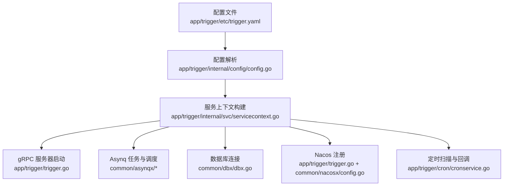
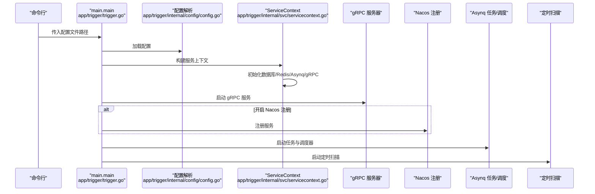
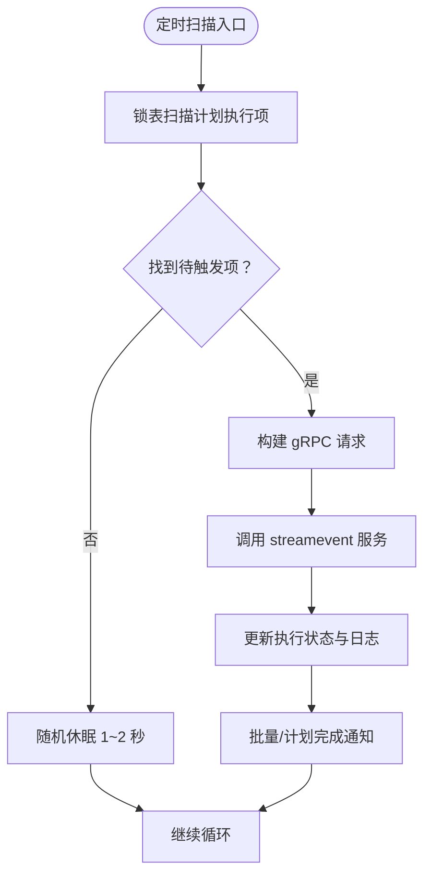
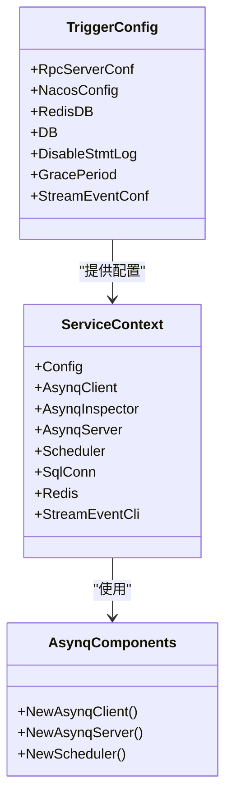

# 配置管理

<cite>
**本文引用的文件**
- [trigger.yaml](file://app/trigger/etc/trigger.yaml)
- [config.go](file://app/trigger/internal/config/config.go)
- [trigger.go](file://app/trigger/trigger.go)
- [servicecontext.go](file://app/trigger/internal/svc/servicecontext.go)
- [cronservice.go](file://app/trigger/cron/cronservice.go)
- [tasktype.go](file://common/asynqx/tasktype.go)
- [asynqClient.go](file://common/asynqx/asynqClient.go)
- [asynqTaskServer.go](file://common/asynqx/asynqTaskServer.go)
- [asynqSchedulerServer.go](file://common/asynqx/asynqSchedulerServer.go)
- [config.go](file://common/nacosx/config.go)
- [dbx.go](file://common/dbx/dbx.go)
- [kqConfig.go](file://common/configx/kqConfig.go)
</cite>

## 目录
1. [简介](#简介)
2. [项目结构](#项目结构)
3. [核心组件](#核心组件)
4. [架构总览](#架构总览)
5. [详细组件分析](#详细组件分析)
6. [依赖关系分析](#依赖关系分析)
7. [性能考虑](#性能考虑)
8. [故障排查指南](#故障排查指南)
9. [结论](#结论)
10. [附录](#附录)

## 简介
本文件面向触发器服务（trigger）的配置管理，系统性梳理配置文件结构、关键配置项作用与默认值、数据库与Redis连接、Asynq任务队列参数、Nacos服务注册配置、任务类型与调度策略、性能调优参数、环境变量替换与动态更新机制、配置验证、多环境差异与最佳实践、配置监控与审计、配置回滚策略，并提供配置模板、检查工具与常见问题排查方法。

## 项目结构
触发器服务的配置位于 etc 目录下，核心配置文件为 trigger.yaml；应用通过内部 config 模块解析配置，并在启动时构建 ServiceContext，初始化数据库、Redis、Asynq、gRPC 客户端与 Nacos 注册等组件。

图表来源
- [trigger.yaml:1-37](file://app/trigger/etc/trigger.yaml#L1-L37)
- [config.go:9-27](file://app/trigger/internal/config/config.go#L9-L27)
- [servicecontext.go:50-90](file://app/trigger/internal/svc/servicecontext.go#L50-L90)
- [trigger.go:34-88](file://app/trigger/trigger.go#L34-L88)
- [asynqTaskServer.go:39-64](file://common/asynqx/asynqTaskServer.go#L39-L64)
- [asynqSchedulerServer.go:32-52](file://common/asynqx/asynqSchedulerServer.go#L32-L52)
- [dbx.go:31-64](file://common/dbx/dbx.go#L31-L64)
- [config.go:15-37](file://common/nacosx/config.go#L15-L37)

章节来源
- [trigger.yaml:1-37](file://app/trigger/etc/trigger.yaml#L1-L37)
- [config.go:9-27](file://app/trigger/internal/config/config.go#L9-L27)
- [trigger.go:34-88](file://app/trigger/trigger.go#L34-L88)
- [servicecontext.go:50-90](file://app/trigger/internal/svc/servicecontext.go#L50-L90)

## 核心组件
- 配置模型：定义了服务基础配置、Nacos注册、RedisDB、数据库、禁用SQL语句日志、优雅停机周期、流事件客户端配置等字段。
- 启动流程：加载配置、设置优雅停机时间、构建 ServiceContext、注册 gRPC 服务、可选 Nacos 注册、启动 Asynq 任务与调度器、启动定时扫描服务。
- 运行期依赖：数据库连接、Redis、Asynq 客户端/服务器/调度器、gRPC 客户端（调用 streamevent）、验证器、ID 工具等。

章节来源
- [config.go:9-27](file://app/trigger/internal/config/config.go#L9-L27)
- [trigger.go:34-88](file://app/trigger/trigger.go#L34-L88)
- [servicecontext.go:29-48](file://app/trigger/internal/svc/servicecontext.go#L29-L48)

## 架构总览
触发器服务的配置贯穿启动、运行与治理三个阶段：配置加载与校验、运行期资源初始化、服务注册与可观测性。

图表来源
- [trigger.go:34-88](file://app/trigger/trigger.go#L34-L88)
- [servicecontext.go:50-90](file://app/trigger/internal/svc/servicecontext.go#L50-L90)
- [asynqTaskServer.go:28-37](file://common/asynqx/asynqTaskServer.go#L28-L37)
- [asynqSchedulerServer.go:21-26](file://common/asynqx/asynqSchedulerServer.go#L21-L26)

## 详细组件分析

### 配置文件结构与关键项
- 基础服务配置
  - 名称、监听地址、模式、超时、日志级别与保留天数等。
- Nacos 服务注册
  - 是否注册、主机、端口、用户名、密码、命名空间、服务名。
- Redis
  - 主机、类型、键前缀、密码；另有一个独立的 RedisDB 整型字段。
- 数据库
  - DataSource 字符串，支持 MySQL/PG/SQLite/TAOS 等类型识别。
- 其他
  - 禁用 SQL 语句日志、优雅停机周期、流事件客户端配置（包含目标、非阻塞、超时、优雅期）。

章节来源
- [trigger.yaml:1-37](file://app/trigger/etc/trigger.yaml#L1-L37)
- [config.go:9-27](file://app/trigger/internal/config/config.go#L9-L27)

### 配置模型与默认值
- 配置模型继承 zrpc 的 RpcServerConf，新增 NacosConfig、RedisDB、DB、DisableStmtLog、GracePeriod、StreamEventConf。
- 关键默认值
  - GracePeriod 默认 30 秒（来自结构体标签）。
  - StreamEventConf 来自 zrpc.RpcClientConf，具体字段由 go-zero 定义。
  - RedisDB 默认 0（整型零值）。
  - DisableStmtLog 默认 false（未在配置中显式开启），但 ServiceContext 中可根据配置关闭。

章节来源
- [config.go:9-27](file://app/trigger/internal/config/config.go#L9-L27)
- [servicecontext.go:51-53](file://app/trigger/internal/svc/servicecontext.go#L51-L53)

### 数据库连接与类型识别
- 自动识别数据源类型（MySQL、Postgres、SQLite、TAOS），并创建对应连接与 goqu 数据库实例。
- 支持通过 DataSource 字符串中的协议/关键字判断类型。

章节来源
- [dbx.go:31-64](file://common/dbx/dbx.go#L31-L64)
- [dbx.go:106-138](file://common/dbx/dbx.go#L106-L138)

### Redis 配置与使用
- Redis 主机、类型、密码、键前缀、DB 索引（通过 RedisDB）共同决定连接参数。
- 在 ServiceContext 中统一初始化 Redis 实例，并用于分布式锁等场景。

章节来源
- [trigger.yaml:19-24](file://app/trigger/etc/trigger.yaml#L19-L24)
- [config.go:20](file://app/trigger/internal/config/config.go#L20)
- [servicecontext.go:54](file://app/trigger/internal/svc/servicecontext.go#L54)

### Asynq 任务队列参数
- 客户端与 Inspector：基于 Redis 地址、密码、DB 索引创建。
- 任务服务器
  - 并发度：20
  - 队列优先级：critical(6)、default(3)、low(1)
  - 连接超时与读写超时：5 秒
  - 连接池大小：50
- 调度器
  - 时区：Asia/Shanghai
  - 入队后回调记录错误
  - 日志适配器：BaseLogger

章节来源
- [asynqClient.go:17-23](file://common/asynqx/asynqClient.go#L17-L23)
- [asynqTaskServer.go:39-64](file://common/asynqx/asynqTaskServer.go#L39-L64)
- [asynqSchedulerServer.go:32-52](file://common/asynqx/asynqSchedulerServer.go#L32-L52)

### 任务类型定义
- 延迟任务、触发器任务、触发器 Proto 任务、调度延迟任务等常量集中定义，便于统一管理与消费端识别。

章节来源
- [tasktype.go:3-10](file://common/asynqx/tasktype.go#L3-L10)

### Nacos 服务注册配置
- 可选注册开关、主机、端口、用户名、密码、命名空间、服务名。
- 启动时根据配置构造 ServerConfig 与 ClientConfig，并注册服务元数据（含 gRPC 端口）。

章节来源
- [trigger.yaml:11-18](file://app/trigger/etc/trigger.yaml#L11-L18)
- [trigger.go:54-71](file://app/trigger/trigger.go#L54-L71)
- [config.go:15-37](file://common/nacosx/config.go#L15-L37)

### 流事件客户端配置
- 使用 zrpc.RpcClientConf，包含目标、非阻塞、超时、优雅期等字段。
- 运行时按配置创建 gRPC 客户端，并设置拦截器与最大消息尺寸。

章节来源
- [trigger.yaml:29-37](file://app/trigger/etc/trigger.yaml#L29-L37)
- [config.go:26](file://app/trigger/internal/config/config.go#L26)
- [servicecontext.go:79-87](file://app/trigger/internal/svc/servicecontext.go#L79-L87)

### 定时扫描与调度策略
- CronService
  - 通过锁表扫描计划执行项，按需随机退避（1~2 秒），避免空转。
  - 将执行结果转换为 gRPC 请求，调用 streamevent 服务。
- 调度策略
  - Asynq 调度器通过 Cron 表达式注册任务（示例中为每分钟）。
  - 任务类型常量统一管理，便于扩展。

图表来源
- [cronservice.go:58-79](file://app/trigger/cron/cronservice.go#L58-L79)
- [cronservice.go:81-184](file://app/trigger/cron/cronservice.go#L81-L184)
- [cronservice.go:203-468](file://app/trigger/cron/cronservice.go#L203-L468)

章节来源
- [cronservice.go:31-79](file://app/trigger/cron/cronservice.go#L31-L79)
- [cronservice.go:81-184](file://app/trigger/cron/cronservice.go#L81-L184)
- [asynqSchedulerServer.go:54-61](file://common/asynqx/asynqSchedulerServer.go#L54-L61)

### 性能调优参数
- Asynq 服务器并发度、队列权重、连接超时与池大小。
- gRPC 最大消息尺寸（发送侧设置为最大整型，接收侧注释掉默认值）。
- SQL 语句日志可按需关闭，降低日志开销。
- Redis 锁与连接池参数影响高并发下的竞争与吞吐。

章节来源
- [asynqTaskServer.go:55-64](file://common/asynqx/asynqTaskServer.go#L55-L64)
- [servicecontext.go:82-86](file://app/trigger/internal/svc/servicecontext.go#L82-L86)
- [servicecontext.go:51-53](file://app/trigger/internal/svc/servicecontext.go#L51-L53)

### 环境变量替换与动态配置更新
- 配置加载采用 go-zero 的 conf.MustLoad，支持环境变量覆盖（遵循 go-zero 的环境变量注入约定）。
- 动态配置更新：当前实现未见内置热加载逻辑，建议结合外部配置中心（如 Nacos）与进程信号进行平滑重启或外部编排。

章节来源
- [trigger.go:37-38](file://app/trigger/trigger.go#L37-L38)

### 配置验证机制
- ServiceContext 构造时会根据配置关闭 SQL 语句日志（若启用）。
- 未发现显式的结构体级校验逻辑，建议在业务层增加必要校验或引入第三方校验库。

章节来源
- [servicecontext.go:51-53](file://app/trigger/internal/svc/servicecontext.go#L51-L53)

### 不同部署环境下的配置差异与最佳实践
- 开发/测试/生产模式
  - Mode 字段控制是否启用反射（开发/测试模式下启用）。
  - 日志级别与保留天数按环境调整。
- Nacos 注册
  - 生产环境建议开启注册与健康检查。
- 数据库
  - 生产环境建议使用 Postgres 或 MySQL，确保连接池与超时合理。
- Asynq
  - 根据负载调整并发度与队列权重，监控失败率与处理时延。
- gRPC
  - 根据实际负载调整最大消息尺寸与超时。

章节来源
- [trigger.go:49-51](file://app/trigger/trigger.go#L49-L51)
- [trigger.yaml:3](file://app/trigger/etc/trigger.yaml#L3)
- [trigger.yaml:5-10](file://app/trigger/etc/trigger.yaml#L5-L10)
- [asynqTaskServer.go:55-64](file://common/asynqx/asynqTaskServer.go#L55-L64)

### 配置监控、审计与回滚策略
- 监控
  - Asynq 服务器与调度器内置日志适配器，建议接入统一日志平台。
  - gRPC 客户端与服务器拦截器可用于统计与追踪。
- 审计
  - 建议对关键配置变更记录操作人、时间、变更前后值。
- 回滚
  - 建议通过版本化配置与发布流水线实现回滚，避免直接手工修改。

章节来源
- [asynqTaskServer.go:73-86](file://common/asynqx/asynqTaskServer.go#L73-L86)
- [asynqSchedulerServer.go:45-49](file://common/asynqx/asynqSchedulerServer.go#L45-L49)

### 配置模板示例与检查工具
- 配置模板
  - 参考 etc/trigger.yaml 的字段组织方式，按需增减。
- 检查工具
  - 使用 go-zero 的配置加载能力进行基本语法与字段存在性校验。
  - 建议在 CI 中加入 YAML Schema 校验与静态分析。

章节来源
- [trigger.yaml:1-37](file://app/trigger/etc/trigger.yaml#L1-L37)

## 依赖关系分析

图表来源
- [config.go:9-27](file://app/trigger/internal/config/config.go#L9-L27)
- [servicecontext.go:29-48](file://app/trigger/internal/svc/servicecontext.go#L29-L48)
- [asynqClient.go:17-23](file://common/asynqx/asynqClient.go#L17-L23)
- [asynqTaskServer.go:39-64](file://common/asynqx/asynqTaskServer.go#L39-L64)
- [asynqSchedulerServer.go:32-52](file://common/asynqx/asynqSchedulerServer.go#L32-L52)

章节来源
- [config.go:9-27](file://app/trigger/internal/config/config.go#L9-L27)
- [servicecontext.go:29-48](file://app/trigger/internal/svc/servicecontext.go#L29-L48)

## 性能考虑
- Asynq 并发与队列权重应与 CPU 核数、任务耗时匹配，避免过载或饥饿。
- Redis 连接池大小与超时需与任务并发度协同调优。
- gRPC 最大消息尺寸按实际 payload 调整，避免过大导致内存压力。
- SQL 语句日志在高吞吐场景建议关闭，降低 IO 压力。
- 定时扫描采用随机退避，避免热点时段集中争抢。

## 故障排查指南
- 数据库连接失败
  - 检查 DataSource 格式与可达性；确认数据库类型识别正确。
- Redis 连接异常
  - 校验主机、密码、DB 索引；关注连接池与超时配置。
- Asynq 任务堆积或失败
  - 查看失败回调日志；调整并发度与队列权重；检查任务处理耗时。
- gRPC 调用超时或失败
  - 检查流事件客户端超时与最大消息尺寸；确认目标服务可用。
- Nacos 注册失败
  - 校验账号、命名空间、服务名与网络连通性。
- 定时扫描不触发
  - 检查计划执行项状态与锁表逻辑；确认 CronService 正常运行。

章节来源
- [dbx.go:31-64](file://common/dbx/dbx.go#L31-L64)
- [asynqTaskServer.go:55-64](file://common/asynqx/asynqTaskServer.go#L55-L64)
- [servicecontext.go:79-87](file://app/trigger/internal/svc/servicecontext.go#L79-L87)
- [trigger.go:54-71](file://app/trigger/trigger.go#L54-L71)
- [cronservice.go:58-79](file://app/trigger/cron/cronservice.go#L58-L79)

## 结论
触发器服务的配置管理围绕“配置文件 + 内部配置模型 + 启动流程 + 运行期依赖”展开。通过明确的字段职责、合理的默认值与性能参数、以及可选的服务注册与可观测性组件，可在不同环境中稳定运行。建议在生产环境完善动态配置、监控审计与回滚策略，并持续优化 Asynq 与数据库参数以满足业务峰值需求。

## 附录
- 配置模板参考：etc/trigger.yaml
- 关键配置项清单
  - 基础：Name、ListenOn、Mode、Timeout、Log.*、GracePeriod
  - Nacos：IsRegister、Host、Port、Username、PassWord、NamespaceId、ServiceName
  - Redis：Host、Type、Key、Pass、RedisDB
  - DB：DataSource
  - 流事件：Endpoints、NonBlock、Timeout、GracePeriod
- 相关组件
  - Asynq 任务类型：defer:*、scheduler:* 常量
  - Kafka 配置结构：Brokers、Topic（用于其他模块）

章节来源
- [trigger.yaml:1-37](file://app/trigger/etc/trigger.yaml#L1-L37)
- [tasktype.go:3-10](file://common/asynqx/tasktype.go#L3-L10)
- [kqConfig.go:3-6](file://common/configx/kqConfig.go#L3-L6)