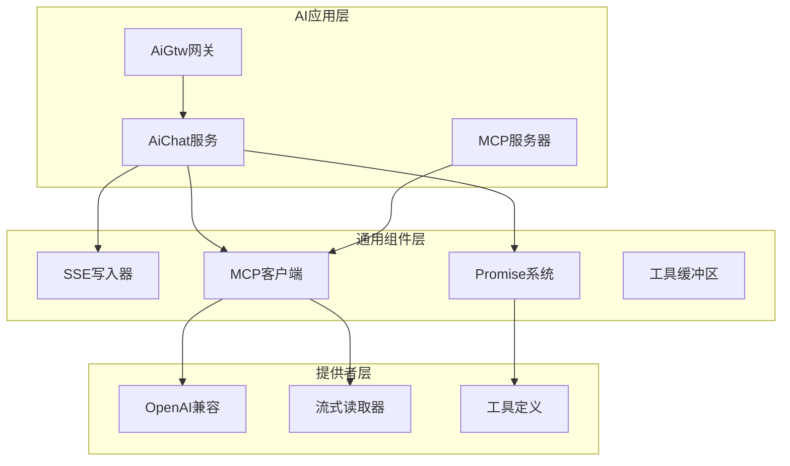
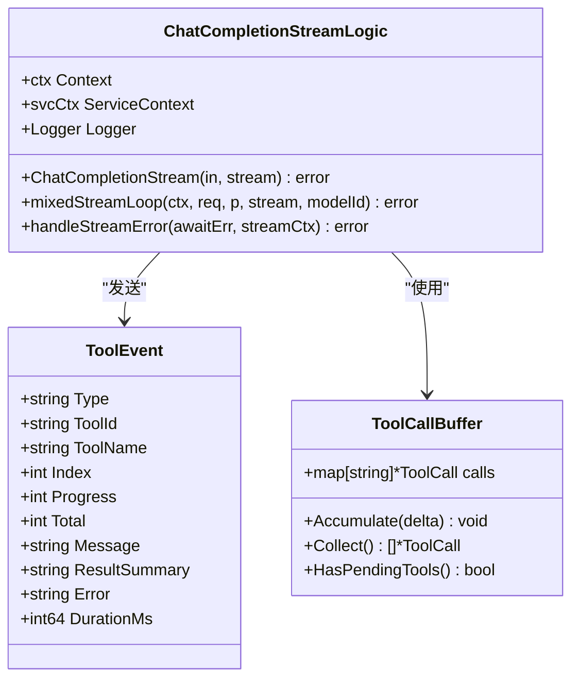
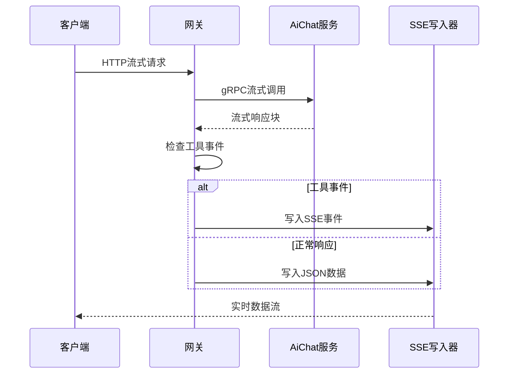
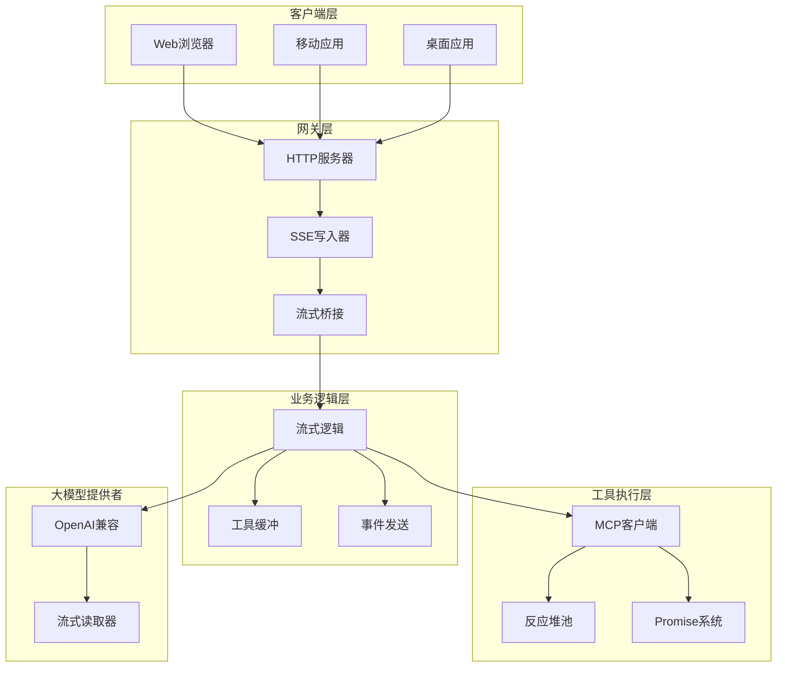
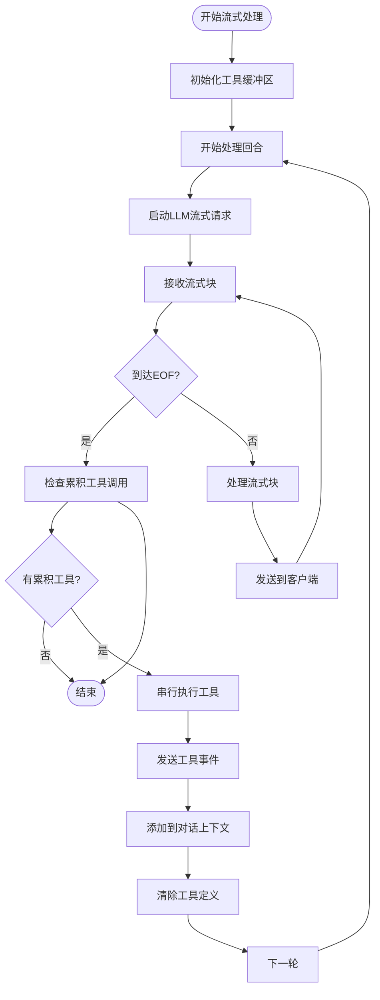
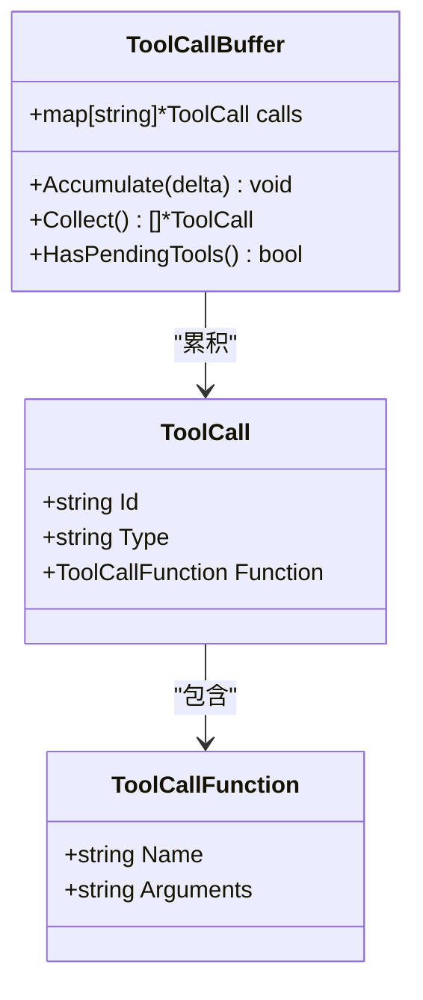
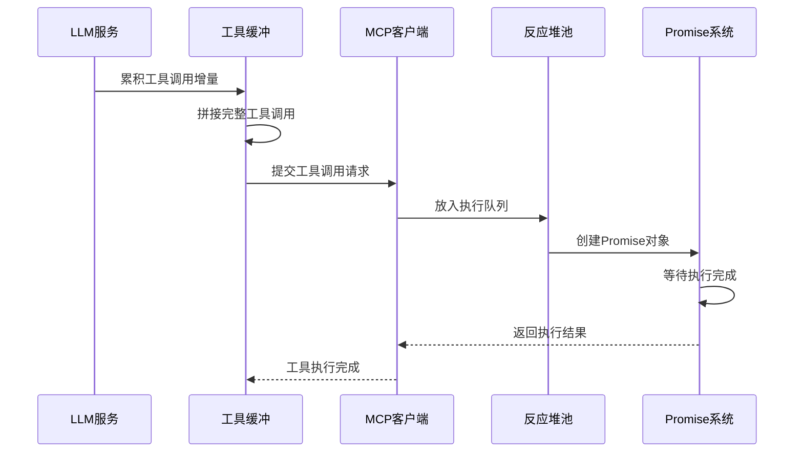
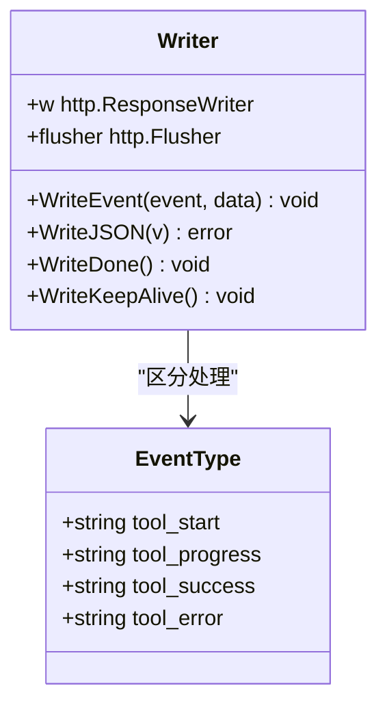
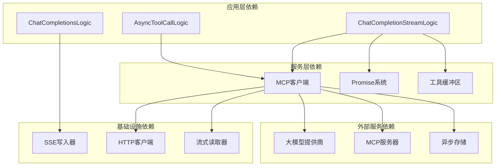
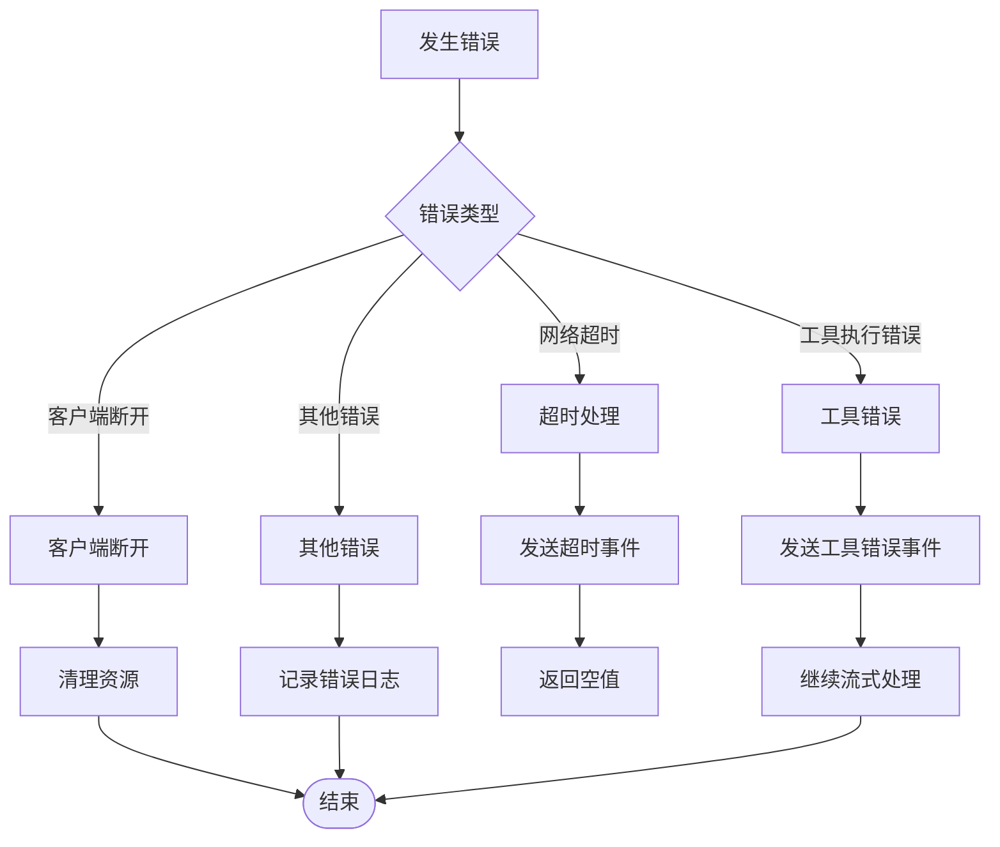

# 混合流式处理机制

<cite>
**本文档引用的文件**
- [chatcompletionstreamlogic.go](file://aiapp/aichat/internal/logic/chatcompletionstreamlogic.go)
- [chatcompletionslogic.go](file://aiapp/aigtw/internal/logic/pass/chatcompletionslogic.go)
- [writer.go](file://common/ssex/writer.go)
- [client.go](file://common/mcpx/client.go)
- [provider.go](file://aiapp/aichat/internal/provider/provider.go)
- [openai.go](file://aiapp/aichat/internal/provider/openai.go)
- [types.go](file://aiapp/aichat/internal/provider/types.go)
- [promise.go](file://common/antsx/promise.go)
- [memory_handler.go](file://common/mcpx/memory_handler.go)
- [asynctoolcalllogic.go](file://aiapp/aichat/internal/logic/asynctoolcalllogic.go)
- [asyncToolCallLogic.go](file://aiapp/aigtw/internal/logic/pass/asyncToolCallLogic.go)
</cite>

## 目录
1. [简介](#简介)
2. [项目结构](#项目结构)
3. [核心组件](#核心组件)
4. [架构概览](#架构概览)
5. [详细组件分析](#详细组件分析)
6. [依赖关系分析](#依赖关系分析)
7. [性能考虑](#性能考虑)
8. [故障排除指南](#故障排除指南)
9. [结论](#结论)

## 简介

混合流式处理机制是本项目中一个创新的架构设计，它将传统的流式处理与现代的大语言模型（LLM）工具调用能力相结合，实现了真正意义上的"边思考边执行"的智能交互体验。该机制的核心价值在于：

- **实时性**：用户可以同时看到模型的推理过程和工具执行进度
- **透明性**：完整的执行链路对用户完全透明，包括工具选择、执行和结果
- **可靠性**：通过Promise模式和异步处理确保系统的稳定性
- **可扩展性**：支持多种大模型提供商和工具生态

这种混合流式处理机制突破了传统AI应用只能输出最终结果的局限，让用户能够实时追踪AI的思维过程和工具调用状态。

## 项目结构

项目采用模块化的微服务架构，围绕AI聊天服务构建了完整的生态系统：

**图表来源**
- [chatcompletionstreamlogic.go:1-353](file://aiapp/aichat/internal/logic/chatcompletionstreamlogic.go#L1-L353)
- [client.go:1-800](file://common/mcpx/client.go#L1-L800)
- [writer.go:1-79](file://common/ssex/writer.go#L1-L79)

**章节来源**
- [chatcompletionstreamlogic.go:1-353](file://aiapp/aichat/internal/logic/chatcompletionstreamlogic.go#L1-L353)
- [chatcompletionslogic.go:1-235](file://aiapp/aigtw/internal/logic/pass/chatcompletionslogic.go#L1-L235)

## 核心组件

### 流式聊天逻辑组件

混合流式处理的核心在于`ChatCompletionStreamLogic`类，它实现了完整的流式处理管道：

**图表来源**
- [chatcompletionstreamlogic.go:56-353](file://aiapp/aichat/internal/logic/chatcompletionstreamlogic.go#L56-L353)
- [types.go:94-167](file://aiapp/aichat/internal/provider/types.go#L94-L167)

### 网关桥接组件

HTTP到SSE的桥接逻辑确保了Web客户端能够实时接收流式数据：

**图表来源**
- [chatcompletionslogic.go:56-112](file://aiapp/aigtw/internal/logic/pass/chatcompletionslogic.go#L56-L112)
- [writer.go:24-79](file://common/ssex/writer.go#L24-L79)

**章节来源**
- [chatcompletionstreamlogic.go:56-353](file://aiapp/aichat/internal/logic/chatcompletionstreamlogic.go#L56-L353)
- [chatcompletionslogic.go:18-235](file://aiapp/aigtw/internal/logic/pass/chatcompletionslogic.go#L18-L235)

## 架构概览

混合流式处理机制的整体架构展现了高度的模块化和解耦设计：

**图表来源**
- [chatcompletionstreamlogic.go:108-288](file://aiapp/aichat/internal/logic/chatcompletionstreamlogic.go#L108-L288)
- [client.go:25-58](file://common/mcpx/client.go#L25-L58)
- [writer.go:9-22](file://common/ssex/writer.go#L9-L22)

## 详细组件分析

### 流式处理主循环

混合流式处理的核心在于其独特的主循环设计，该循环能够智能地处理LLM输出和工具调用的交错执行：

**图表来源**
- [chatcompletionstreamlogic.go:108-288](file://aiapp/aichat/internal/logic/chatcompletionstreamlogic.go#L108-L288)

### 工具调用缓冲机制

工具调用的增量收集和拼接是实现流畅用户体验的关键：

**图表来源**
- [types.go:94-167](file://aiapp/aichat/internal/provider/types.go#L94-L167)

### 异步工具执行系统

通过Promise模式实现的异步工具执行确保了系统的高并发处理能力：

**图表来源**
- [promise.go:16-150](file://common/antsx/promise.go#L16-L150)
- [client.go:347-392](file://common/mcpx/client.go#L347-L392)

**章节来源**
- [chatcompletionstreamlogic.go:108-288](file://aiapp/aichat/internal/logic/chatcompletionstreamlogic.go#L108-L288)
- [types.go:94-167](file://aiapp/aichat/internal/provider/types.go#L94-L167)
- [promise.go:16-150](file://common/antsx/promise.go#L16-L150)

### SSE事件处理机制

SSE写入器提供了标准化的事件推送能力，支持多种事件类型的区分处理：

**图表来源**
- [writer.go:9-79](file://common/ssex/writer.go#L9-L79)

**章节来源**
- [chatcompletionslogic.go:56-124](file://aiapp/aigtw/internal/logic/pass/chatcompletionslogic.go#L56-L124)
- [writer.go:9-79](file://common/ssex/writer.go#L9-L79)

## 依赖关系分析

混合流式处理机制涉及多个层次的依赖关系，形成了清晰的分层架构：

**图表来源**
- [chatcompletionstreamlogic.go:1-353](file://aiapp/aichat/internal/logic/chatcompletionstreamlogic.go#L1-L353)
- [client.go:1-800](file://common/mcpx/client.go#L1-L800)

### 错误处理策略

系统采用了多层次的错误处理机制，确保在各种异常情况下都能保持系统的稳定性：

**图表来源**
- [chatcompletionstreamlogic.go:290-312](file://aiapp/aichat/internal/logic/chatcompletionstreamlogic.go#L290-L312)

**章节来源**
- [chatcompletionstreamlogic.go:290-312](file://aiapp/aichat/internal/logic/chatcompletionstreamlogic.go#L290-L312)
- [client.go:140-201](file://common/mcpx/client.go#L140-L201)

## 性能考虑

混合流式处理机制在设计时充分考虑了性能优化：

### 并发处理优化
- **反应堆池**：通过`Reactor`池化工具执行，避免了过多的goroutine创建
- **Promise模式**：使用Promise避免了复杂的回调地狱，提高了代码可维护性
- **工具缓冲**：智能的工具调用缓冲减少了不必要的网络往返

### 内存管理优化
- **流式处理**：采用流式读取避免了大响应的内存占用
- **增量拼接**：工具调用的增量拼接机制减少了内存分配
- **异步存储**：内存异步结果存储支持TTL过期清理

### 网络优化
- **SSE长连接**：使用SSE协议减少HTTP请求开销
- **批量处理**：工具调用的批量处理提高了吞吐量
- **连接复用**：MCP客户端的连接复用减少了连接建立成本

## 故障排除指南

### 常见问题诊断

**工具调用失败**
1. 检查MCP服务器连接状态
2. 验证工具名称格式（server__tool）
3. 查看工具参数的JSON格式
4. 检查工具执行的超时设置

**流式处理中断**
1. 检查客户端连接状态
2. 验证SSE写入器的Flush功能
3. 查看流式读取器的缓冲设置
4. 检查网络连接的稳定性

**性能问题排查**
1. 监控反应堆池的使用率
2. 检查Promise的等待时间
3. 分析工具调用的执行时间
4. 监控内存使用情况

**章节来源**
- [chatcompletionstreamlogic.go:290-312](file://aiapp/aichat/internal/logic/chatcompletionstreamlogic.go#L290-L312)
- [memory_handler.go:33-54](file://common/mcpx/memory_handler.go#L33-L54)

### 调试技巧

1. **启用详细日志**：在开发环境中开启详细的调试日志
2. **监控指标**：使用内置的统计指标监控系统性能
3. **单元测试**：编写针对流式处理的单元测试
4. **集成测试**：进行端到端的集成测试验证

## 结论

混合流式处理机制代表了AI应用架构的一次重要创新，它成功地将传统的流式处理与现代的工具调用能力结合，为用户提供了前所未有的交互体验。该机制的主要优势包括：

**技术优势**
- 实现了真正的实时交互体验
- 通过模块化设计确保了系统的可维护性
- 采用Promise模式提高了代码的可读性和可测试性
- 支持多种大模型提供商和工具生态

**架构优势**
- 清晰的分层设计便于扩展和维护
- 强大的错误处理机制确保了系统的稳定性
- 高效的并发处理能力支持大规模部署
- 灵活的配置选项适应不同的应用场景

**应用价值**
- 为AI应用提供了更加自然的交互方式
- 提升了用户对AI决策过程的透明度和信任度
- 降低了AI应用的开发和维护成本
- 为未来的AI应用发展奠定了坚实的技术基础

随着AI技术的不断发展，混合流式处理机制将继续演进，为构建更加智能、更加人性化的AI应用提供强有力的技术支撑。