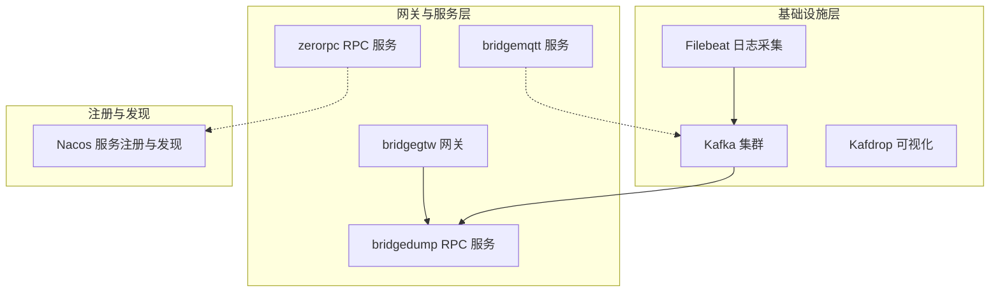
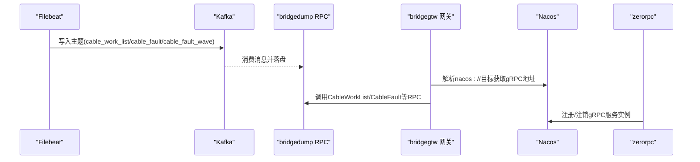
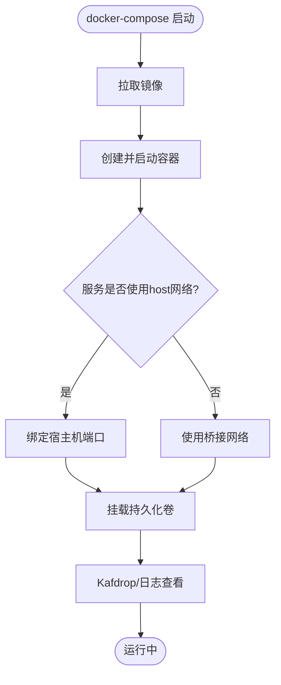
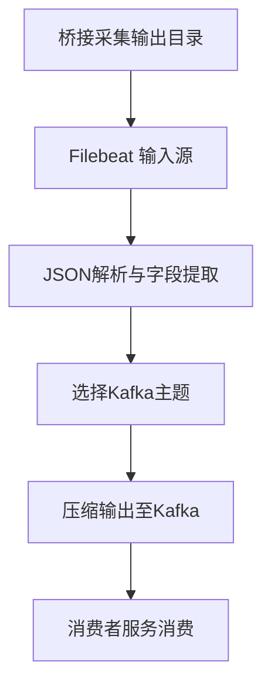
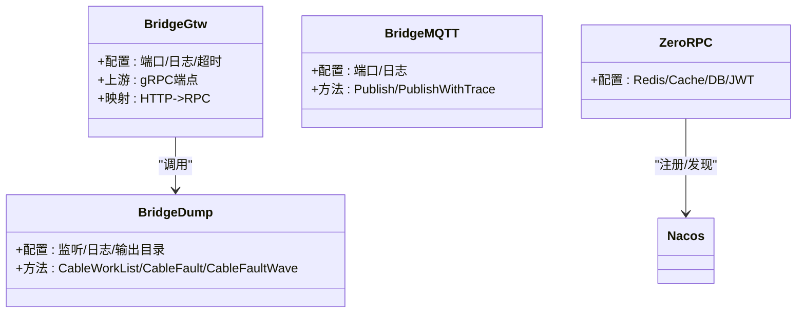
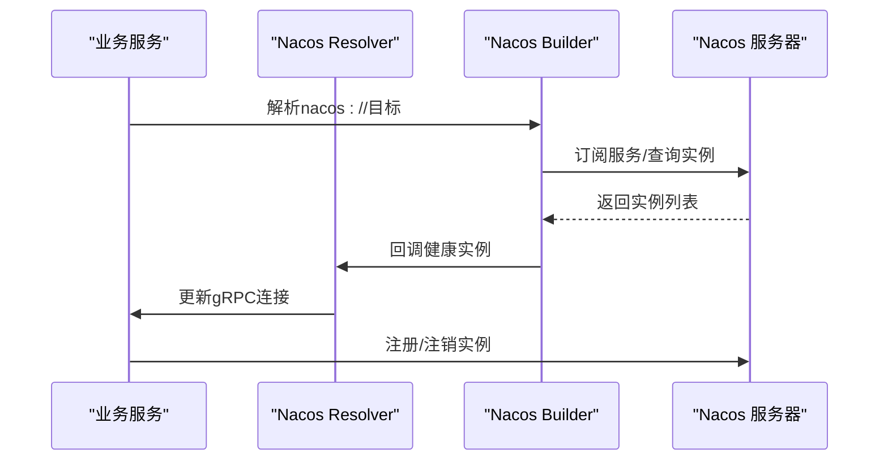
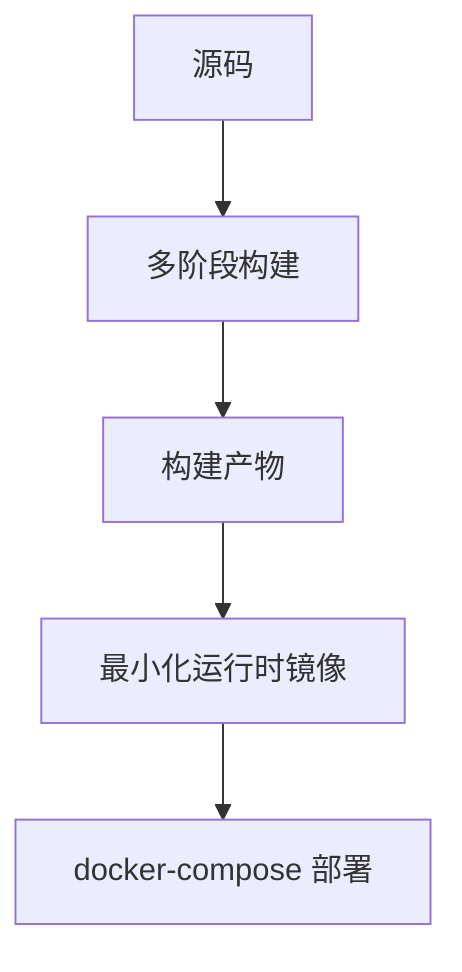
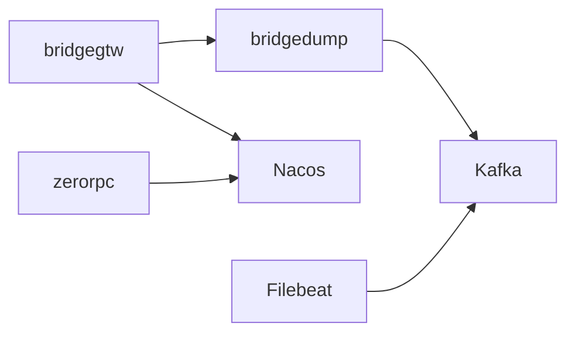

# 基础设施架构

<cite>
**本文引用的文件**
- [docker-compose.yml](file://deploy/docker-compose.yml)
- [filebeat.yml](file://deploy/filebeat/conf/filebeat.yml)
- [config.go](file://common/nacosx/config.go)
- [register.go](file://common/nacosx/register.go)
- [resolver.go](file://common/nacosx/resolver.go)
- [options.go](file://common/nacosx/options.go)
- [builder.go](file://common/nacosx/builder.go)
- [bridgegtw.yaml](file://app/bridgegtw/etc/bridgegtw.yaml)
- [bridgedump.yaml](file://app/bridgedump/etc/bridgedump.yaml)
- [zerorpc.yaml](file://zerorpc/etc/zerorpc.yaml)
- [bridgegtw Dockerfile](file://app/bridgegtw/Dockerfile)
- [bridgedump Dockerfile](file://app/bridgedump/Dockerfile)
- [bridgemqtt Dockerfile](file://app/bridgemqtt/Dockerfile)
- [manage.sh](file://util/manage.sh)
- [config.yaml](file://util/config.yaml)
</cite>

## 目录
1. [引言](#引言)
2. [项目结构](#项目结构)
3. [核心组件](#核心组件)
4. [架构总览](#架构总览)
5. [详细组件分析](#详细组件分析)
6. [依赖分析](#依赖分析)
7. [性能考虑](#性能考虑)
8. [故障排查指南](#故障排查指南)
9. [结论](#结论)
10. [附录](#附录)

## 引言
本文件面向Zero-Service项目的基础设施与运维团队，系统性阐述其基础设施设计与实现，涵盖容器编排、服务注册与发现、负载均衡、高可用与容灾、监控与运维、以及扩展与性能优化策略。文档基于仓库中的实际配置与代码进行分析，并提供可视化图示帮助读者快速理解系统架构。

## 项目结构
该项目采用多服务微架构，围绕Kafka消息总线与Filebeat日志采集形成“数据采集—消息传输—服务消费”的闭环；同时通过Nacos实现gRPC服务的注册与发现，结合Go Zero生态的服务框架完成业务逻辑处理。部署层采用docker-compose进行本地或单机多节点编排，配合集中式日志与可视化工具提升可观测性。

图表来源
- [docker-compose.yml:1-110](file://deploy/docker-compose.yml#L1-L110)
- [filebeat.yml:1-122](file://deploy/filebeat/conf/filebeat.yml#L1-L122)
- [bridgegtw.yaml:1-40](file://app/bridgegtw/etc/bridgegtw.yaml#L1-L40)
- [bridgedump.yaml:1-10](file://app/bridgedump/etc/bridgedump.yaml#L1-L10)
- [zerorpc.yaml:1-39](file://zerorpc/etc/zerorpc.yaml#L1-L39)

章节来源
- [docker-compose.yml:1-110](file://deploy/docker-compose.yml#L1-L110)
- [filebeat.yml:1-122](file://deploy/filebeat/conf/filebeat.yml#L1-L122)

## 核心组件
- 消息中间件与日志采集
  - Kafka：提供高吞吐、持久化的消息通道，支撑跨服务解耦与异步处理。
  - Filebeat：从桥接采集服务输出目录采集JSON日志，按主题投递至Kafka。
  - Kafdrop：可视化Kafka主题与消费者组状态。
- 网关与RPC服务
  - bridgegtw：基于Go Zero的网关，将HTTP请求映射到gRPC方法，统一接入点。
  - bridgedump：桥接采集服务的RPC后端，负责数据落盘与转发。
  - bridgemqtt：MQTT桥接服务，支持发布/订阅与链路追踪。
  - zerorpc：通用RPC服务，承载用户、支付等业务能力。
- 服务注册与发现
  - Nacos：提供gRPC服务的注册、发现与健康检查，内置自定义Resolver与Builder。
- 容器编排与部署
  - docker-compose：统一编排Kafka、Filebeat、各业务服务与可视化工具。
  - 多阶段Dockerfile：最小化镜像体积，统一时区与代理配置。
  - 运维脚本：封装常用操作命令，便于批量管理。

章节来源
- [docker-compose.yml:1-110](file://deploy/docker-compose.yml#L1-L110)
- [filebeat.yml:1-122](file://deploy/filebeat/conf/filebeat.yml#L1-L122)
- [bridgegtw.yaml:1-40](file://app/bridgegtw/etc/bridgegtw.yaml#L1-L40)
- [bridgedump.yaml:1-10](file://app/bridgedump/etc/bridgedump.yaml#L1-L10)
- [zerorpc.yaml:1-39](file://zerorpc/etc/zerorpc.yaml#L1-L39)
- [bridgegtw Dockerfile:1-43](file://app/bridgegtw/Dockerfile#L1-L43)
- [bridgedump Dockerfile:1-42](file://app/bridgedump/Dockerfile#L1-L42)
- [bridgemqtt Dockerfile:1-42](file://app/bridgemqtt/Dockerfile#L1-L42)
- [manage.sh:1-35](file://util/manage.sh#L1-L35)
- [config.yaml:1-26](file://util/config.yaml#L1-L26)

## 架构总览
下图展示了Zero-Service的基础设施与数据流：Filebeat从桥接采集服务的输出目录读取JSON日志，按主题写入Kafka；RPC服务从Kafka消费数据并写入本地存储；bridgegtw作为统一入口，将HTTP请求映射到gRPC方法；Nacos负责gRPC服务的注册与发现。

图表来源
- [filebeat.yml:1-122](file://deploy/filebeat/conf/filebeat.yml#L1-L122)
- [docker-compose.yml:1-110](file://deploy/docker-compose.yml#L1-L110)
- [bridgegtw.yaml:1-40](file://app/bridgegtw/etc/bridgegtw.yaml#L1-L40)
- [register.go:1-99](file://common/nacosx/register.go#L1-L99)
- [builder.go:1-139](file://common/nacosx/builder.go#L1-L139)

## 详细组件分析

### 容器编排与网络
- 编排策略
  - 使用docker-compose统一编排Kafka、Filebeat、各业务服务与Kafdrop。
  - 业务服务采用host网络模式，便于直接绑定宿主机端口与访问本地磁盘。
  - Kafka配置了控制器与broker角色，使用不同监听端口区分容器内外访问。
- 存储与挂载
  - Kafka数据目录持久化至宿主机路径，确保重启不丢失。
  - Filebeat挂载容器日志目录与桥接采集输出目录，保证日志采集连续性。
- 可视化
  - Kafdrop通过暴露端口提供Kafka主题与消费者组的Web界面。

图表来源
- [docker-compose.yml:1-110](file://deploy/docker-compose.yml#L1-L110)

章节来源
- [docker-compose.yml:1-110](file://deploy/docker-compose.yml#L1-L110)

### 日志采集与消息传输
- Filebeat配置
  - 针对不同桥接采集子目录配置独立输入源，动态选择Kafka主题。
  - 使用JSON解析与字段提取，过滤无效行，压缩输出至Kafka。
- Kafka主题与分区
  - 主题命名与采集目录一一对应，便于问题定位与资源隔离。
  - 分区数量与副本因子根据吞吐与可靠性需求配置。

图表来源
- [filebeat.yml:1-122](file://deploy/filebeat/conf/filebeat.yml#L1-L122)

章节来源
- [filebeat.yml:1-122](file://deploy/filebeat/conf/filebeat.yml#L1-L122)

### 网关与RPC服务
- bridgegtw
  - 作为HTTP到gRPC的网关，配置gRPC后端端点与方法映射。
  - 支持ProtoSets加载，便于调用下游RPC接口。
- bridgedump
  - 提供桥接采集相关的RPC方法，如工作列表、故障数据、波形数据等。
  - 通过本地目录落盘，供Filebeat采集与Kafka消费。
- bridgemqtt
  - 提供MQTT发布/订阅能力，支持链路追踪。
- zerorpc
  - 提供通用RPC能力，包含鉴权、缓存、数据库连接等配置项。

图表来源
- [bridgegtw.yaml:1-40](file://app/bridgegtw/etc/bridgegtw.yaml#L1-L40)
- [bridgedump.yaml:1-10](file://app/bridgedump/etc/bridgedump.yaml#L1-L10)
- [zerorpc.yaml:1-39](file://zerorpc/etc/zerorpc.yaml#L1-L39)

章节来源
- [bridgegtw.yaml:1-40](file://app/bridgegtw/etc/bridgegtw.yaml#L1-L40)
- [bridgedump.yaml:1-10](file://app/bridgedump/etc/bridgedump.yaml#L1-L10)
- [zerorpc.yaml:1-39](file://zerorpc/etc/zerorpc.yaml#L1-L39)

### 服务注册与发现（Nacos）
- 注册流程
  - 服务启动时向Nacos注册实例，携带IP、端口、权重、集群、分组与元数据。
  - 优雅停机时执行反注册，避免流量指向已下线实例。
- 解析器与Builder
  - 自定义gRPC Resolver，支持从Nacos订阅服务变更并更新连接池。
  - Builder解析nacos://URL，建立订阅与定时刷新机制，仅推送健康且启用的实例。
- 日志与配置
  - 提供Nacos SDK日志初始化与级别控制，便于问题排查。

图表来源
- [register.go:1-99](file://common/nacosx/register.go#L1-L99)
- [builder.go:1-139](file://common/nacosx/builder.go#L1-L139)
- [resolver.go:1-74](file://common/nacosx/resolver.go#L1-L74)
- [options.go:1-72](file://common/nacosx/options.go#L1-L72)
- [config.go:1-38](file://common/nacosx/config.go#L1-L38)

章节来源
- [register.go:1-99](file://common/nacosx/register.go#L1-L99)
- [builder.go:1-139](file://common/nacosx/builder.go#L1-L139)
- [resolver.go:1-74](file://common/nacosx/resolver.go#L1-L74)
- [options.go:1-72](file://common/nacosx/options.go#L1-L72)
- [config.go:1-38](file://common/nacosx/config.go#L1-L38)

### 容器化与镜像构建
- 多阶段构建
  - 使用golang:alpine作为构建基础，最终镜像基于scratch，显著减小体积。
  - 统一时区配置与代理参数，适配国内网络环境。
- 镜像内容
  - 仅包含运行所需的二进制、配置文件与协议文件，减少攻击面。
- 运维脚本
  - manage.sh封装常用命令，结合Taskfile实现批量服务启停与重启。

图表来源
- [bridgegtw Dockerfile:1-43](file://app/bridgegtw/Dockerfile#L1-L43)
- [bridgedump Dockerfile:1-42](file://app/bridgedump/Dockerfile#L1-L42)
- [bridgemqtt Dockerfile:1-42](file://app/bridgemqtt/Dockerfile#L1-L42)
- [manage.sh:1-35](file://util/manage.sh#L1-L35)

章节来源
- [bridgegtw Dockerfile:1-43](file://app/bridgegtw/Dockerfile#L1-L43)
- [bridgedump Dockerfile:1-42](file://app/bridgedump/Dockerfile#L1-L42)
- [bridgemqtt Dockerfile:1-42](file://app/bridgemqtt/Dockerfile#L1-L42)
- [manage.sh:1-35](file://util/manage.sh#L1-L35)

### 高可用与容灾设计
- 多节点部署
  - 通过docker-compose在多台主机上部署相同服务，实现横向扩展。
  - Kafka可配置多副本与分区，提升吞吐与可用性。
- 故障转移
  - Nacos注册中心与gRPC Resolver共同保障服务发现的实时性与一致性。
  - bridgegtw与各RPC服务均具备健康检查与优雅停机，降低切换风险。
- 数据备份
  - Kafka数据目录持久化至宿主机，建议结合快照与异地复制策略。
  - Filebeat与业务服务的日志目录同样需要定期备份与归档。

章节来源
- [docker-compose.yml:1-110](file://deploy/docker-compose.yml#L1-L110)
- [register.go:1-99](file://common/nacosx/register.go#L1-L99)
- [builder.go:1-139](file://common/nacosx/builder.go#L1-L139)

### 基础设施监控与运维管理
- 日志收集
  - Filebeat按主题采集桥接采集输出目录的日志，统一写入Kafka，便于后续离线分析与实时监控。
- 指标监控
  - 建议在各服务中集成Prometheus指标导出，结合Grafana进行可视化。
- 告警通知
  - 结合Kafka消费者侧的错误日志与业务异常，配置告警规则与通知渠道。
- 运维管理
  - 利用manage.sh与config.yaml集中管理多主机服务，简化批量运维操作。

章节来源
- [filebeat.yml:1-122](file://deploy/filebeat/conf/filebeat.yml#L1-L122)
- [config.yaml:1-26](file://util/config.yaml#L1-L26)
- [manage.sh:1-35](file://util/manage.sh#L1-L35)

## 依赖分析
- 组件耦合
  - bridgegtw与bridgedump通过gRPC耦合，依赖Nacos进行服务发现。
  - Filebeat与Kafka强耦合，Kafka与各消费者服务弱耦合，形成松耦合的数据流。
- 外部依赖
  - Nacos SDK用于服务注册与发现。
  - Kafka客户端用于消息生产与消费。
- 循环依赖
  - 当前模块间无循环依赖，职责清晰。

图表来源
- [bridgegtw.yaml:1-40](file://app/bridgegtw/etc/bridgegtw.yaml#L1-L40)
- [bridgedump.yaml:1-10](file://app/bridgedump/etc/bridgedump.yaml#L1-L10)
- [filebeat.yml:1-122](file://deploy/filebeat/conf/filebeat.yml#L1-L122)
- [register.go:1-99](file://common/nacosx/register.go#L1-L99)

章节来源
- [bridgegtw.yaml:1-40](file://app/bridgegtw/etc/bridgegtw.yaml#L1-L40)
- [bridgedump.yaml:1-10](file://app/bridgedump/etc/bridgedump.yaml#L1-L10)
- [filebeat.yml:1-122](file://deploy/filebeat/conf/filebeat.yml#L1-L122)
- [register.go:1-99](file://common/nacosx/register.go#L1-L99)

## 性能考虑
- 网络与I/O
  - 业务服务采用host网络模式，减少NAT与DNAT开销，提高网络性能。
  - Kafka分区数与副本数应与CPU、磁盘与网络带宽匹配，避免成为瓶颈。
- 日志与消息
  - Filebeat启用gzip压缩，降低网络与存储压力。
  - 合理设置scan_frequency、close_inactive与clean_inactive，平衡延迟与资源占用。
- 镜像与资源
  - 最小化镜像减少启动时间与内存占用。
  - 为容器设置合理的mem_limit，避免资源争抢。
- 服务发现
  - Nacos订阅与定时刷新机制确保实例列表及时更新，减少连接失败率。

章节来源
- [docker-compose.yml:1-110](file://deploy/docker-compose.yml#L1-L110)
- [filebeat.yml:1-122](file://deploy/filebeat/conf/filebeat.yml#L1-L122)
- [bridgegtw Dockerfile:1-43](file://app/bridgegtw/Dockerfile#L1-L43)

## 故障排查指南
- 服务无法注册到Nacos
  - 检查Nacos服务连通性与认证配置。
  - 查看服务启动日志，确认注册参数（服务名、集群、分组、元数据）正确。
- gRPC调用失败
  - 检查bridgegtw的映射配置与目标RPC方法是否一致。
  - 通过Nacos控制台确认目标服务实例健康状态。
- 日志采集异常
  - 检查Filebeat输入路径与主题映射，确认文件权限与目录挂载。
  - 关注Filebeat日志中的解析错误与丢弃事件原因。
- Kafka消费停滞
  - 检查消费者组偏移量与分区分配情况。
  - 关注Kafka Broker状态与磁盘空间。

章节来源
- [register.go:1-99](file://common/nacosx/register.go#L1-L99)
- [resolver.go:1-74](file://common/nacosx/resolver.go#L1-L74)
- [filebeat.yml:1-122](file://deploy/filebeat/conf/filebeat.yml#L1-L122)
- [docker-compose.yml:1-110](file://deploy/docker-compose.yml#L1-L110)

## 结论
Zero-Service的基础设施以Kafka为核心的数据总线，结合Filebeat实现高效日志采集，通过Nacos完成gRPC服务的注册与发现，并以docker-compose实现统一编排与运维。该架构具备良好的扩展性与可观测性，适合在工业物联网场景中进行大规模部署与演进。建议在现有基础上进一步完善指标监控、告警体系与自动化运维流程，持续提升系统的稳定性与可维护性。

## 附录
- 扩展与优化建议
  - 引入Prometheus+Grafana进行全栈指标监控。
  - 在Nacos侧启用更细粒度的健康检查与熔断策略。
  - 对Kafka进行分区与副本规划，结合业务峰值进行容量评估。
  - 为Filebeat与Kafka消费者引入背压与限速策略，避免雪崩效应。
- 运维最佳实践
  - 使用config.yaml与manage.sh实现多主机批量运维。
  - 定期备份Kafka数据目录与业务日志目录，制定恢复演练计划。
  - 对容器镜像进行安全扫描，确保供应链安全。